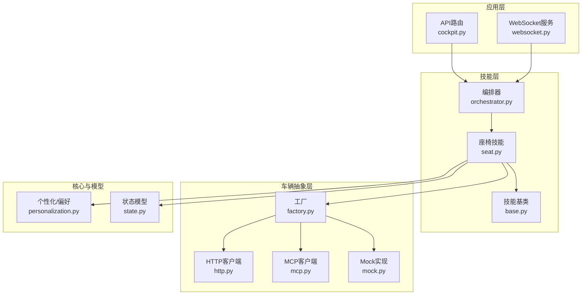
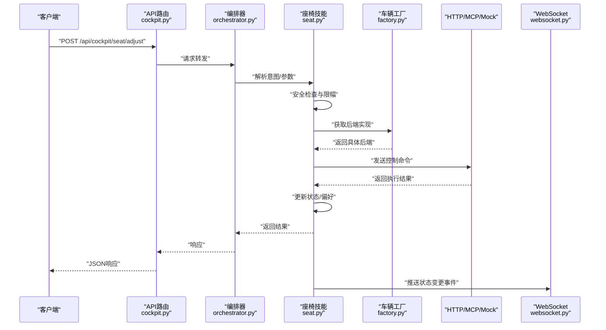
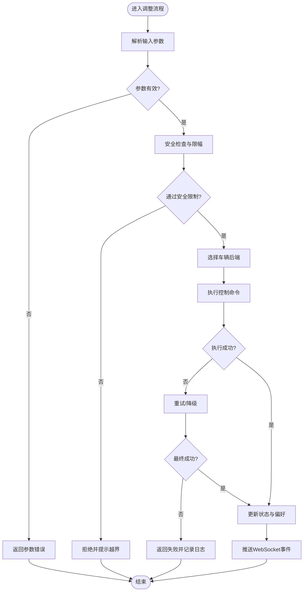
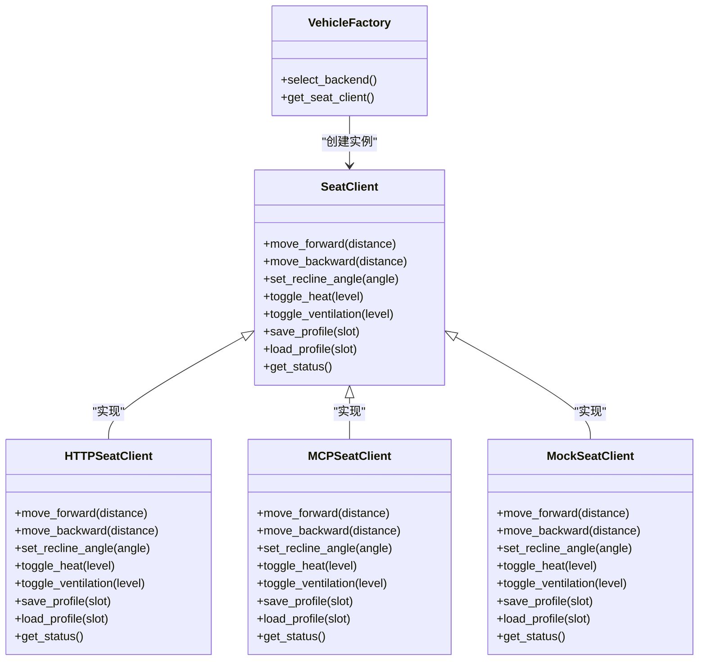
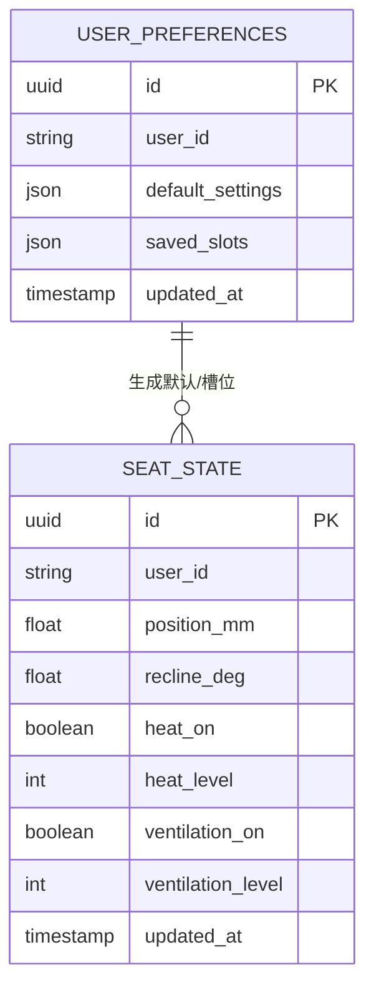
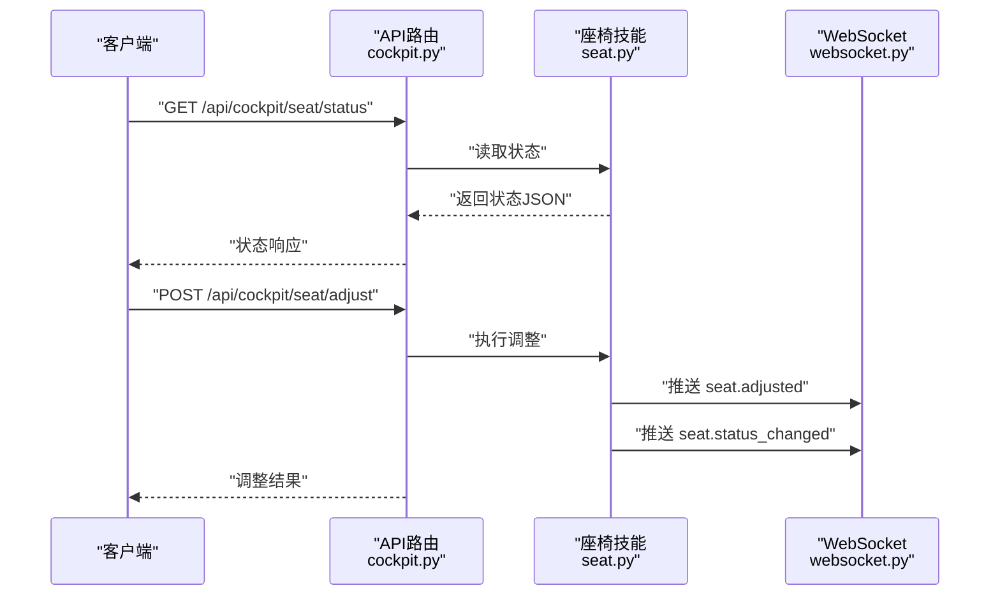
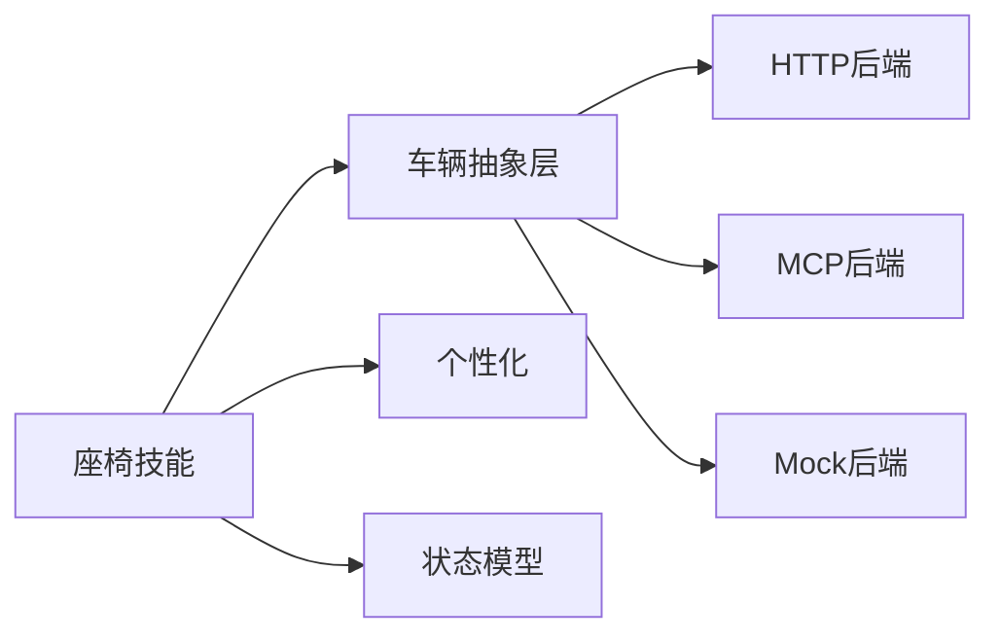

# 座椅调节控制

<cite>
**本文引用的文件**   
- [backend_design/nexus/skills/vehicle/seat.py](file://backend_design/nexus/skills/vehicle/seat.py)
- [backend_design/nexus/skills/base.py](file://backend_design/nexus/skills/base.py)
- [backend_design/nexus/skills/orchestrator.py](file://backend_design/nexus/skills/orchestrator.py)
- [backend_design/nexus/vehicle/factory.py](file://backend_design/nexus/vehicle/factory.py)
- [backend_design/nexus/vehicle/http.py](file://backend_design/nexus/vehicle/http.py)
- [backend_design/nexus/vehicle/mcp.py](file://backend_design/nexus/vehicle/mcp.py)
- [backend_design/nexus/vehicle/mock.py](file://backend_design/nexus/vehicle/mock.py)
- [backend_design/nexus/core/personalization.py](file://backend_design/nexus/core/personalization.py)
- [backend_design/nexus/models/state.py](file://backend_design/nexus/models/state.py)
- [backend_design/nexus/api/routes/cockpit.py](file://backend_design/nexus/api/routes/cockpit.py)
- [backend_design/nexus/api/websocket.py](file://backend_design/nexus/api/websocket.py)
</cite>

## 目录
1. [简介](#简介)
2. [项目结构](#项目结构)
3. [核心组件](#核心组件)
4. [架构总览](#架构总览)
5. [详细组件分析](#详细组件分析)
6. [依赖关系分析](#依赖关系分析)
7. [性能考虑](#性能考虑)
8. [故障排查指南](#故障排查指南)
9. [结论](#结论)
10. [附录](#附录)

## 简介
本技术文档聚焦于“座椅调节控制系统”的功能实现与集成方式，覆盖前后移动、靠背角度调节、加热/通风等能力；阐述位置记忆与用户偏好配置机制；说明与车辆座椅控制模块的通信协议与数据格式；提供API调用示例与状态查询方法；并给出安全约束检查与异常恢复策略。

## 项目结构
本项目采用分层与按功能域组织相结合的结构：
- 技能层（Skills）：封装具体车控能力，如座椅控制。
- 编排层（Orchestrator）：协调多技能执行与上下文管理。
- 车辆抽象层（Vehicle Abstraction）：统一对外暴露车辆控制接口，屏蔽底层HTTP/MCP/Mock差异。
- 个性化与状态：负责用户偏好、位置记忆与系统状态。
- API网关与WebSocket：对外暴露REST与实时事件通道。

图表来源
- [backend_design/nexus/api/routes/cockpit.py](file://backend_design/nexus/api/routes/cockpit.py)
- [backend_design/nexus/api/websocket.py](file://backend_design/nexus/api/websocket.py)
- [backend_design/nexus/skills/vehicle/seat.py](file://backend_design/nexus/skills/vehicle/seat.py)
- [backend_design/nexus/skills/base.py](file://backend_design/nexus/skills/base.py)
- [backend_design/nexus/skills/orchestrator.py](file://backend_design/nexus/skills/orchestrator.py)
- [backend_design/nexus/vehicle/factory.py](file://backend_design/nexus/vehicle/factory.py)
- [backend_design/nexus/vehicle/http.py](file://backend_design/nexus/vehicle/http.py)
- [backend_design/nexus/vehicle/mcp.py](file://backend_design/nexus/vehicle/mcp.py)
- [backend_design/nexus/vehicle/mock.py](file://backend_design/nexus/vehicle/mock.py)
- [backend_design/nexus/core/personalization.py](file://backend_design/nexus/core/personalization.py)
- [backend_design/nexus/models/state.py](file://backend_design/nexus/models/state.py)

章节来源
- [backend_design/nexus/skills/vehicle/seat.py](file://backend_design/nexus/skills/vehicle/seat.py)
- [backend_design/nexus/skills/base.py](file://backend_design/nexus/skills/base.py)
- [backend_design/nexus/skills/orchestrator.py](file://backend_design/nexus/skills/orchestrator.py)
- [backend_design/nexus/vehicle/factory.py](file://backend_design/nexus/vehicle/factory.py)
- [backend_design/nexus/vehicle/http.py](file://backend_design/nexus/vehicle/http.py)
- [backend_design/nexus/vehicle/mcp.py](file://backend_design/nexus/vehicle/mcp.py)
- [backend_design/nexus/vehicle/mock.py](file://backend_design/nexus/vehicle/mock.py)
- [backend_design/nexus/core/personalization.py](file://backend_design/nexus/core/personalization.py)
- [backend_design/nexus/models/state.py](file://backend_design/nexus/models/state.py)
- [backend_design/nexus/api/routes/cockpit.py](file://backend_design/nexus/api/routes/cockpit.py)
- [backend_design/nexus/api/websocket.py](file://backend_design/nexus/api/websocket.py)

## 核心组件
- 座椅技能（Seat Skill）
  - 职责：解析用户意图或指令，校验参数与安全边界，调用车辆抽象层执行座椅动作，更新状态与偏好，推送结果与事件。
  - 关键能力：前后移动、靠背角度调节、加热/通风开关与档位、位置记忆与加载、安全限制检查。
- 车辆抽象层（Vehicle Abstraction）
  - 职责：统一座椅控制接口，支持HTTP、MCP、Mock三种后端实现，通过工厂选择具体实现。
- 个性化与偏好（Personalization）
  - 职责：维护用户偏好、座位记忆槽位、默认值与回退策略。
- 状态模型（State Model）
  - 职责：定义当前座椅位置、角度、加热/通风状态及变更历史。
- 编排器（Orchestrator）
  - 职责：协调技能执行、错误处理、重试与降级。
- API与WebSocket
  - 职责：暴露REST接口与实时事件流，供前端或第三方系统调用。

章节来源
- [backend_design/nexus/skills/vehicle/seat.py](file://backend_design/nexus/skills/vehicle/seat.py)
- [backend_design/nexus/vehicle/factory.py](file://backend_design/nexus/vehicle/factory.py)
- [backend_design/nexus/core/personalization.py](file://backend_design/nexus/core/personalization.py)
- [backend_design/nexus/models/state.py](file://backend_design/nexus/models/state.py)
- [backend_design/nexus/skills/orchestrator.py](file://backend_design/nexus/skills/orchestrator.py)
- [backend_design/nexus/api/routes/cockpit.py](file://backend_design/nexus/api/routes/cockpit.py)
- [backend_design/nexus/api/websocket.py](file://backend_design/nexus/api/websocket.py)

## 架构总览
整体流程从API入口进入，经编排器调度至座椅技能，再由工厂选择具体车辆后端执行，最终返回结果并通过WebSocket推送状态变更。

图表来源
- [backend_design/nexus/api/routes/cockpit.py](file://backend_design/nexus/api/routes/cockpit.py)
- [backend_design/nexus/skills/orchestrator.py](file://backend_design/nexus/skills/orchestrator.py)
- [backend_design/nexus/skills/vehicle/seat.py](file://backend_design/nexus/skills/vehicle/seat.py)
- [backend_design/nexus/vehicle/factory.py](file://backend_design/nexus/vehicle/factory.py)
- [backend_design/nexus/vehicle/http.py](file://backend_design/nexus/vehicle/http.py)
- [backend_design/nexus/vehicle/mcp.py](file://backend_design/nexus/vehicle/mcp.py)
- [backend_design/nexus/vehicle/mock.py](file://backend_design/nexus/vehicle/mock.py)
- [backend_design/nexus/api/websocket.py](file://backend_design/nexus/api/websocket.py)

## 详细组件分析

### 座椅技能（Seat Skill）
- 功能范围
  - 前后移动：基于目标位置或增量调整，结合安全边界进行限幅。
  - 靠背角度调节：支持角度目标值或步进调整，包含人体工学安全限制。
  - 加热/通风：开关与档位控制，具备互斥与功率限制策略。
  - 位置记忆与加载：保存当前座椅组合到指定槽位，或从槽位恢复到当前位置。
  - 用户偏好：读取默认配置与用户定制项，支持回退策略。
- 安全约束
  - 运动范围限制：前后位移、靠背角度上下限。
  - 速度/加速度限制：避免急动导致不适或安全隐患。
  - 互斥逻辑：例如加热与通风不可同时高功率运行。
  - 权限与场景：驾驶中限制某些操作，乘客模式放宽。
- 异常恢复
  - 重试与退避：对瞬时失败进行有限次重试。
  - 降级策略：当后端不可用时切换至Mock或只读状态。
  - 回滚机制：若部分步骤失败，尝试撤销已生效的操作。

图表来源
- [backend_design/nexus/skills/vehicle/seat.py](file://backend_design/nexus/skills/vehicle/seat.py)
- [backend_design/nexus/vehicle/factory.py](file://backend_design/nexus/vehicle/factory.py)
- [backend_design/nexus/vehicle/http.py](file://backend_design/nexus/vehicle/http.py)
- [backend_design/nexus/vehicle/mcp.py](file://backend_design/nexus/vehicle/mcp.py)
- [backend_design/nexus/vehicle/mock.py](file://backend_design/nexus/vehicle/mock.py)
- [backend_design/nexus/core/personalization.py](file://backend_design/nexus/core/personalization.py)
- [backend_design/nexus/models/state.py](file://backend_design/nexus/models/state.py)
- [backend_design/nexus/api/websocket.py](file://backend_design/nexus/api/websocket.py)

章节来源
- [backend_design/nexus/skills/vehicle/seat.py](file://backend_design/nexus/skills/vehicle/seat.py)
- [backend_design/nexus/core/personalization.py](file://backend_design/nexus/core/personalization.py)
- [backend_design/nexus/models/state.py](file://backend_design/nexus/models/state.py)

### 车辆抽象层与后端实现
- 工厂（Factory）
  - 根据配置或运行时环境选择HTTP、MCP或Mock后端。
- HTTP后端
  - 通过REST接口与车辆ECU或网关通信，支持超时、重试与熔断。
- MCP后端
  - 通过消息通信协议与车载中间件交互，适合复杂指令与批量操作。
- Mock后端
  - 用于开发与测试，模拟各种响应与异常场景。

图表来源
- [backend_design/nexus/vehicle/factory.py](file://backend_design/nexus/vehicle/factory.py)
- [backend_design/nexus/vehicle/http.py](file://backend_design/nexus/vehicle/http.py)
- [backend_design/nexus/vehicle/mcp.py](file://backend_design/nexus/vehicle/mcp.py)
- [backend_design/nexus/vehicle/mock.py](file://backend_design/nexus/vehicle/mock.py)

章节来源
- [backend_design/nexus/vehicle/factory.py](file://backend_design/nexus/vehicle/factory.py)
- [backend_design/nexus/vehicle/http.py](file://backend_design/nexus/vehicle/http.py)
- [backend_design/nexus/vehicle/mcp.py](file://backend_design/nexus/vehicle/mcp.py)
- [backend_design/nexus/vehicle/mock.py](file://backend_design/nexus/vehicle/mock.py)

### 个性化与状态管理
- 个性化（Personalization）
  - 存储用户偏好：默认位置、角度、加热/通风习惯、槽位映射。
  - 支持多用户与租户隔离。
- 状态模型（State Model）
  - 定义当前座椅位置、角度、加热/通风状态、最近操作时间戳。
  - 提供快照与增量更新能力。

图表来源
- [backend_design/nexus/core/personalization.py](file://backend_design/nexus/core/personalization.py)
- [backend_design/nexus/models/state.py](file://backend_design/nexus/models/state.py)

章节来源
- [backend_design/nexus/core/personalization.py](file://backend_design/nexus/core/personalization.py)
- [backend_design/nexus/models/state.py](file://backend_design/nexus/models/state.py)

### API与WebSocket
- REST API
  - 典型端点：
    - POST /api/cockpit/seat/adjust：执行座椅调整。
    - GET /api/cockpit/seat/status：查询当前状态。
    - POST /api/cockpit/seat/profile/save：保存位置到槽位。
    - POST /api/cockpit/seat/profile/load：从槽位加载位置。
- WebSocket
  - 事件类型：
    - seat.adjusted：调整完成。
    - seat.status_changed：状态变更。
    - seat.error：执行失败。

图表来源
- [backend_design/nexus/api/routes/cockpit.py](file://backend_design/nexus/api/routes/cockpit.py)
- [backend_design/nexus/skills/vehicle/seat.py](file://backend_design/nexus/skills/vehicle/seat.py)
- [backend_design/nexus/api/websocket.py](file://backend_design/nexus/api/websocket.py)

章节来源
- [backend_design/nexus/api/routes/cockpit.py](file://backend_design/nexus/api/routes/cockpit.py)
- [backend_design/nexus/api/websocket.py](file://backend_design/nexus/api/websocket.py)

## 依赖关系分析
- 组件耦合
  - 座椅技能依赖车辆抽象层与个性化/状态模块。
  - 工厂解耦具体后端实现，降低耦合度。
- 外部依赖
  - HTTP后端依赖网络与车辆网关。
  - MCP后端依赖车载消息总线。
  - Mock后端仅用于本地开发测试。
- 潜在循环依赖
  - 通过分层与接口抽象避免循环依赖。

图表来源
- [backend_design/nexus/skills/vehicle/seat.py](file://backend_design/nexus/skills/vehicle/seat.py)
- [backend_design/nexus/vehicle/factory.py](file://backend_design/nexus/vehicle/factory.py)
- [backend_design/nexus/vehicle/http.py](file://backend_design/nexus/vehicle/http.py)
- [backend_design/nexus/vehicle/mcp.py](file://backend_design/nexus/vehicle/mcp.py)
- [backend_design/nexus/vehicle/mock.py](file://backend_design/nexus/vehicle/mock.py)
- [backend_design/nexus/core/personalization.py](file://backend_design/nexus/core/personalization.py)
- [backend_design/nexus/models/state.py](file://backend_design/nexus/models/state.py)

章节来源
- [backend_design/nexus/skills/vehicle/seat.py](file://backend_design/nexus/skills/vehicle/seat.py)
- [backend_design/nexus/vehicle/factory.py](file://backend_design/nexus/vehicle/factory.py)
- [backend_design/nexus/core/personalization.py](file://backend_design/nexus/core/personalization.py)
- [backend_design/nexus/models/state.py](file://backend_design/nexus/models/state.py)

## 性能考虑
- 并发与限流
  - 对高频调整请求进行限流，避免过载。
- 缓存与去抖
  - 对状态查询使用短时缓存，减少重复计算。
  - 对连续调整指令进行合并与去抖。
- 异步与批处理
  - 将非关键路径（如日志、事件推送）异步化。
  - 批量操作时合并多个指令以减少往返。
- 资源占用
  - 合理设置连接池与超时，避免资源泄漏。

[本节为通用指导，不直接分析具体文件]

## 故障排查指南
- 常见问题
  - 参数越界：检查安全限制与输入校验。
  - 后端不可用：查看工厂选择与后端健康状态。
  - 权限不足：确认用户角色与场景限制。
- 诊断手段
  - 启用调试日志，定位失败阶段。
  - 使用Mock后端复现问题。
  - 订阅WebSocket事件，观察状态流转。
- 恢复策略
  - 自动重试与退避。
  - 降级到只读状态或Mock。
  - 回滚未完全成功的操作。

章节来源
- [backend_design/nexus/skills/vehicle/seat.py](file://backend_design/nexus/skills/vehicle/seat.py)
- [backend_design/nexus/vehicle/factory.py](file://backend_design/nexus/vehicle/factory.py)
- [backend_design/nexus/api/websocket.py](file://backend_design/nexus/api/websocket.py)

## 结论
本系统通过清晰的技能化设计与车辆抽象层，实现了座椅调节控制的模块化与可扩展性。配合个性化与状态管理，提供了良好的用户体验与可维护性。安全约束与异常恢复机制确保在复杂环境下仍能稳定运行。建议在生产环境中优先使用HTTP或MCP后端，并在开发测试中使用Mock后端快速验证。

[本节为总结，不直接分析具体文件]

## 附录

### 数据格式与协议要点
- 调整请求字段（示例）
  - position_mm：前后位置（毫米），受安全范围限制。
  - recline_deg：靠背角度（度），受人体工学限制。
  - heat_on/toggle_heat：加热开关或档位。
  - ventilation_on/toggle_ventilation：通风开关或档位。
  - slot：位置记忆槽位编号。
- 状态响应字段（示例）
  - current_position_mm、current_recline_deg
  - heat_on、heat_level、ventilation_on、ventilation_level
  - updated_at：更新时间戳
- 通信协议
  - HTTP：REST风格，JSON载荷，标准状态码。
  - MCP：结构化消息体，支持批量与异步回调。
  - WebSocket：事件驱动，实时更新状态与结果。

章节来源
- [backend_design/nexus/vehicle/http.py](file://backend_design/nexus/vehicle/http.py)
- [backend_design/nexus/vehicle/mcp.py](file://backend_design/nexus/vehicle/mcp.py)
- [backend_design/nexus/api/websocket.py](file://backend_design/nexus/api/websocket.py)
- [backend_design/nexus/models/state.py](file://backend_design/nexus/models/state.py)