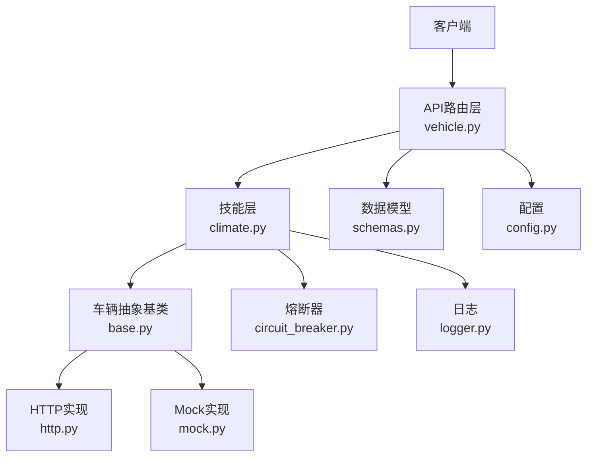
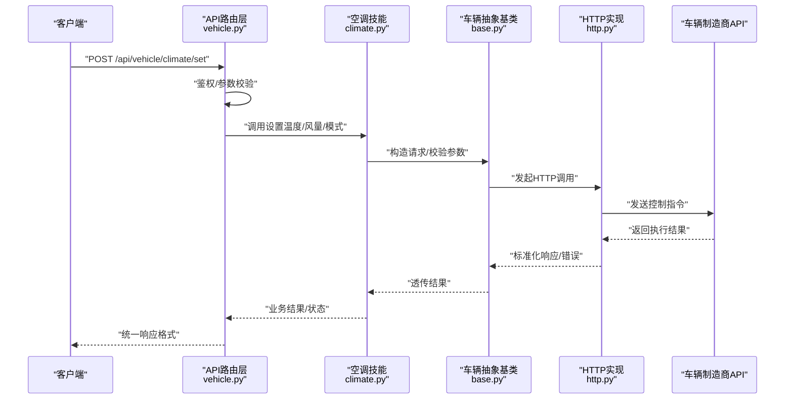
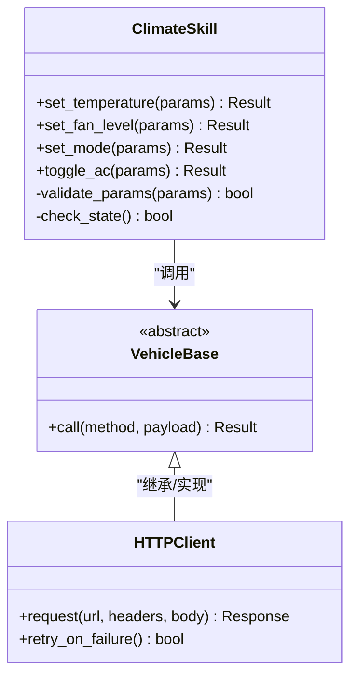
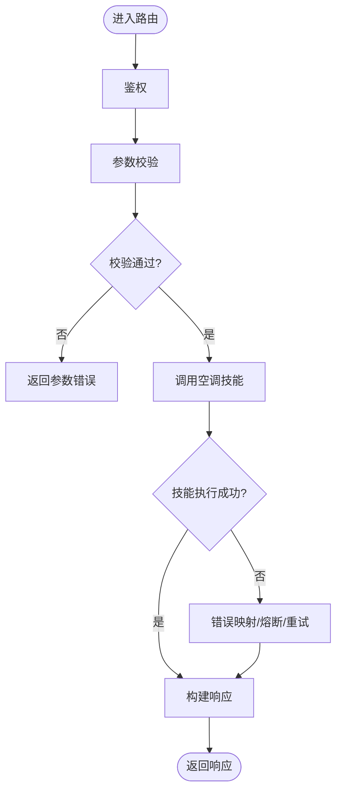
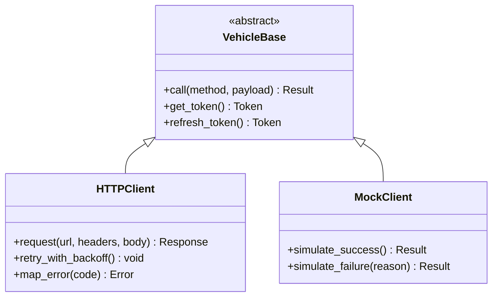
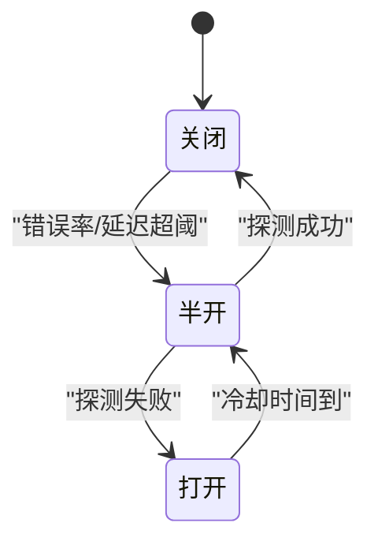
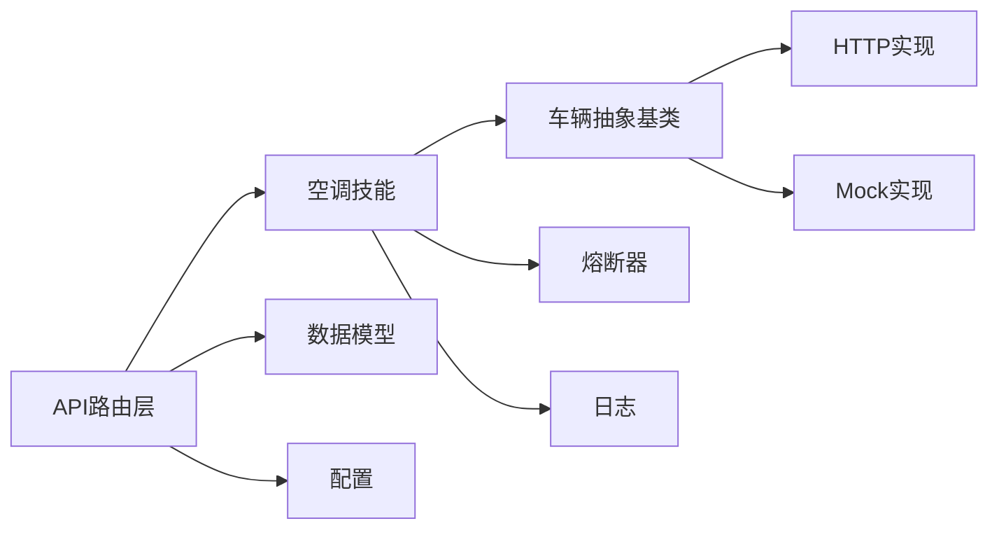

# 空调控制系统

<cite>
**本文引用的文件**   
- [backend_design/nexus/skills/vehicle/climate.py](file://backend_design/nexus/skills/vehicle/climate.py)
- [backend_design/nexus/api/routes/vehicle.py](file://backend_design/nexus/api/routes/vehicle.py)
- [backend_design/nexus/vehicle/base.py](file://backend_design/nexus/vehicle/base.py)
- [backend_design/nexus/vehicle/http.py](file://backend_design/nexus/vehicle/http.py)
- [backend_design/nexus/vehicle/mock.py](file://backend_design/nexus/vehicle/mock.py)
- [backend_design/nexus/core/circuit_breaker.py](file://backend_design/nexus/core/circuit_breaker.py)
- [backend_design/nexus/core/logger.py](file://backend_design/nexus/core/logger.py)
- [backend_design/nexus/models/schemas.py](file://backend_design/nexus/models/schemas.py)
- [backend_design/nexus/config.py](file://backend_design/nexus/config.py)
- [backend_design/nexus/main.py](file://backend_design/nexus/main.py)
</cite>

## 目录
1. [简介](#简介)
2. [项目结构](#项目结构)
3. [核心组件](#核心组件)
4. [架构总览](#架构总览)
5. [详细组件分析](#详细组件分析)
6. [依赖关系分析](#依赖关系分析)
7. [性能考虑](#性能考虑)
8. [故障排查指南](#故障排查指南)
9. [结论](#结论)
10. [附录](#附录)

## 简介
本技术文档围绕“空调控制系统”的实现与集成进行系统化说明，覆盖温度调节、风量控制、模式切换等关键能力；给出API接口定义、参数校验与业务处理流程；描述与车辆制造商API的对接方式、错误处理与重试机制；并提供调用示例、常见使用场景、性能优化建议与故障排查方法。读者无需深入源码即可理解系统设计与使用方法。

## 项目结构
本项目采用分层与按功能域组织相结合的结构：
- API路由层：暴露HTTP接口，负责请求解析、鉴权、参数校验与响应封装。
- 技能层（Skills）：面向具体车控能力的编排与实现，如空调、媒体、导航、座椅、车窗等。
- 车辆抽象层（Vehicle Abstraction）：统一对外部不同厂商API的访问协议，提供HTTP/MCP/Mock等后端实现。
- 核心支撑：配置、日志、熔断器、异常模型、数据模型等。

图表来源
- [backend_design/nexus/api/routes/vehicle.py](file://backend_design/nexus/api/routes/vehicle.py)
- [backend_design/nexus/skills/vehicle/climate.py](file://backend_design/nexus/skills/vehicle/climate.py)
- [backend_design/nexus/vehicle/base.py](file://backend_design/nexus/vehicle/base.py)
- [backend_design/nexus/vehicle/http.py](file://backend_design/nexus/vehicle/http.py)
- [backend_design/nexus/vehicle/mock.py](file://backend_design/nexus/vehicle/mock.py)
- [backend_design/nexus/core/circuit_breaker.py](file://backend_design/nexus/core/circuit_breaker.py)
- [backend_design/nexus/core/logger.py](file://backend_design/nexus/core/logger.py)
- [backend_design/nexus/models/schemas.py](file://backend_design/nexus/models/schemas.py)
- [backend_design/nexus/config.py](file://backend_design/nexus/config.py)

章节来源
- [backend_design/nexus/main.py](file://backend_design/nexus/main.py)
- [backend_design/nexus/config.py](file://backend_design/nexus/config.py)

## 核心组件
- 空调技能（Climate Skill）
  - 职责：将用户意图或上层指令转化为对车辆的空调控制操作，包括温度设定、风量档位、出风模式、自动/手动模式切换、分区控制等。
  - 关键点：参数校验、边界值约束、状态一致性检查、幂等性保障、结果回传。
- 车辆抽象层（Vehicle Base + Implementations）
  - 职责：屏蔽不同厂商API差异，提供统一的空调控制接口；支持HTTP直连、MCP网关、本地Mock等多种后端。
  - 关键点：连接管理、认证令牌刷新、超时与重试、熔断降级、错误分类与上报。
- API路由层（Vehicle Routes）
  - 职责：暴露REST接口，承载请求入站、鉴权、参数校验、调用技能层、返回标准化响应。
  - 关键点：输入校验、错误码映射、限流与审计、可观测性埋点。
- 支撑组件
  - 熔断器：在下游不稳定时快速失败并保护上游。
  - 日志：结构化记录关键路径与异常堆栈。
  - 配置：集中管理外部服务地址、超时、重试策略等。
  - 数据模型：统一请求/响应Schema，确保前后端契约稳定。

章节来源
- [backend_design/nexus/skills/vehicle/climate.py](file://backend_design/nexus/skills/vehicle/climate.py)
- [backend_design/nexus/vehicle/base.py](file://backend_design/nexus/vehicle/base.py)
- [backend_design/nexus/vehicle/http.py](file://backend_design/nexus/vehicle/http.py)
- [backend_design/nexus/vehicle/mock.py](file://backend_design/nexus/vehicle/mock.py)
- [backend_design/nexus/api/routes/vehicle.py](file://backend_design/nexus/api/routes/vehicle.py)
- [backend_design/nexus/core/circuit_breaker.py](file://backend_design/nexus/core/circuit_breaker.py)
- [backend_design/nexus/core/logger.py](file://backend_design/nexus/core/logger.py)
- [backend_design/nexus/models/schemas.py](file://backend_design/nexus/models/schemas.py)
- [backend_design/nexus/config.py](file://backend_design/nexus/config.py)

## 架构总览
下图展示了从客户端到车辆制造商API的端到端调用链路，以及关键横切关注点（校验、熔断、日志、配置）。

图表来源
- [backend_design/nexus/api/routes/vehicle.py](file://backend_design/nexus/api/routes/vehicle.py)
- [backend_design/nexus/skills/vehicle/climate.py](file://backend_design/nexus/skills/vehicle/climate.py)
- [backend_design/nexus/vehicle/base.py](file://backend_design/nexus/vehicle/base.py)
- [backend_design/nexus/vehicle/http.py](file://backend_design/nexus/vehicle/http.py)

## 详细组件分析

### 空调技能（Climate Skill）
- 功能范围
  - 温度调节：设定目标温度、左右区独立控制、温度步进与边界限制。
  - 风量控制：多档风量、自动风量、风量上下限。
  - 模式切换：制冷/制热/自动/除雾/内循环/外循环等。
  - 开关控制：空调开/关、分区开关。
- 参数校验与业务规则
  - 数值范围校验（温度、风量档位）、枚举值校验（模式）、组合互斥（如除雾与内循环互斥）。
  - 状态前置检查（如车门未锁定时禁止某些操作）。
  - 幂等设计：相同参数短时间内重复提交不产生副作用。
- 与车辆抽象层的交互
  - 通过车辆抽象基类调用具体实现（HTTP/Mock），屏蔽差异。
  - 对异常进行分类处理（网络、认证、业务拒绝、超时等）。
- 可观测性与容错
  - 关键路径打点、错误上报、熔断器配合快速失败。

图表来源
- [backend_design/nexus/skills/vehicle/climate.py](file://backend_design/nexus/skills/vehicle/climate.py)
- [backend_design/nexus/vehicle/base.py](file://backend_design/nexus/vehicle/base.py)
- [backend_design/nexus/vehicle/http.py](file://backend_design/nexus/vehicle/http.py)

章节来源
- [backend_design/nexus/skills/vehicle/climate.py](file://backend_design/nexus/skills/vehicle/climate.py)

### API路由层（Vehicle Routes）
- 接口设计要点
  - REST风格：资源为“车辆空调”，动词为“设置/查询/开关”。
  - 统一响应体：包含状态码、消息、数据体、追踪ID。
  - 参数校验：基于数据模型进行强类型校验，缺失/非法字段直接返回错误。
- 典型流程
  - 接收请求 -> 鉴权 -> 参数校验 -> 调用技能层 -> 记录日志 -> 返回响应。
- 错误处理
  - 将底层异常转换为标准错误码，避免泄露内部细节。
  - 针对超时、熔断打开等场景返回友好提示与重试建议。

图表来源
- [backend_design/nexus/api/routes/vehicle.py](file://backend_design/nexus/api/routes/vehicle.py)
- [backend_design/nexus/models/schemas.py](file://backend_design/nexus/models/schemas.py)

章节来源
- [backend_design/nexus/api/routes/vehicle.py](file://backend_design/nexus/api/routes/vehicle.py)
- [backend_design/nexus/models/schemas.py](file://backend_design/nexus/models/schemas.py)

### 车辆抽象层与HTTP实现
- 抽象基类
  - 定义统一的调用签名与错误分类，便于扩展新的后端实现。
- HTTP实现
  - 负责与车辆制造商API通信，包括：
    - 认证令牌获取与刷新
    - 请求头组装（租户、设备标识、时间戳、签名等）
    - 超时、重试、退避策略
    - 响应解码与错误码归一化
- Mock实现
  - 用于开发与联调，模拟正常/异常分支，便于测试覆盖。

图表来源
- [backend_design/nexus/vehicle/base.py](file://backend_design/nexus/vehicle/base.py)
- [backend_design/nexus/vehicle/http.py](file://backend_design/nexus/vehicle/http.py)
- [backend_design/nexus/vehicle/mock.py](file://backend_design/nexus/vehicle/mock.py)

章节来源
- [backend_design/nexus/vehicle/base.py](file://backend_design/nexus/vehicle/base.py)
- [backend_design/nexus/vehicle/http.py](file://backend_design/nexus/vehicle/http.py)
- [backend_design/nexus/vehicle/mock.py](file://backend_design/nexus/vehicle/mock.py)

### 熔断器与错误处理
- 熔断器
  - 当下游错误率或延迟超过阈值时打开熔断，避免雪崩。
  - 半开探测：周期性放行少量请求以探测恢复。
- 错误分类
  - 网络错误、认证失败、业务拒绝、超时、未知错误。
  - 针对不同错误采取重试、降级、告警等策略。
- 日志与追踪
  - 全链路追踪ID贯穿请求，便于定位问题。
  - 关键节点输出结构化日志，包含耗时、状态码、错误码。

图表来源
- [backend_design/nexus/core/circuit_breaker.py](file://backend_design/nexus/core/circuit_breaker.py)
- [backend_design/nexus/core/logger.py](file://backend_design/nexus/core/logger.py)

章节来源
- [backend_design/nexus/core/circuit_breaker.py](file://backend_design/nexus/core/circuit_breaker.py)
- [backend_design/nexus/core/logger.py](file://backend_design/nexus/core/logger.py)

### 数据模型与配置
- 数据模型
  - 统一请求/响应Schema，明确字段类型、必填项、取值范围与默认值。
  - 版本兼容：通过版本号或字段可选性保证演进。
- 配置
  - 外部服务地址、超时、重试次数、熔断阈值、日志级别等。
  - 环境隔离：开发/测试/生产配置分离。

章节来源
- [backend_design/nexus/models/schemas.py](file://backend_design/nexus/models/schemas.py)
- [backend_design/nexus/config.py](file://backend_design/nexus/config.py)

## 依赖关系分析
- 组件耦合
  - API路由层依赖数据模型与空调技能；空调技能依赖车辆抽象层；车辆抽象层依赖具体实现（HTTP/Mock）。
  - 熔断器与日志作为横切组件被广泛引用。
- 外部依赖
  - 车辆制造商API（HTTP/MCP）；认证服务；可能的缓存/消息队列（视部署而定）。
- 潜在风险
  - 循环依赖需避免；外部服务不稳定时需依赖熔断与重试；配置错误会导致连通性问题。

图表来源
- [backend_design/nexus/api/routes/vehicle.py](file://backend_design/nexus/api/routes/vehicle.py)
- [backend_design/nexus/skills/vehicle/climate.py](file://backend_design/nexus/skills/vehicle/climate.py)
- [backend_design/nexus/vehicle/base.py](file://backend_design/nexus/vehicle/base.py)
- [backend_design/nexus/vehicle/http.py](file://backend_design/nexus/vehicle/http.py)
- [backend_design/nexus/vehicle/mock.py](file://backend_design/nexus/vehicle/mock.py)
- [backend_design/nexus/core/circuit_breaker.py](file://backend_design/nexus/core/circuit_breaker.py)
- [backend_design/nexus/core/logger.py](file://backend_design/nexus/core/logger.py)
- [backend_design/nexus/models/schemas.py](file://backend_design/nexus/models/schemas.py)
- [backend_design/nexus/config.py](file://backend_design/nexus/config.py)

章节来源
- [backend_design/nexus/api/routes/vehicle.py](file://backend_design/nexus/api/routes/vehicle.py)
- [backend_design/nexus/skills/vehicle/climate.py](file://backend_design/nexus/skills/vehicle/climate.py)
- [backend_design/nexus/vehicle/base.py](file://backend_design/nexus/vehicle/base.py)
- [backend_design/nexus/vehicle/http.py](file://backend_design/nexus/vehicle/http.py)
- [backend_design/nexus/vehicle/mock.py](file://backend_design/nexus/vehicle/mock.py)
- [backend_design/nexus/core/circuit_breaker.py](file://backend_design/nexus/core/circuit_breaker.py)
- [backend_design/nexus/core/logger.py](file://backend_design/nexus/core/logger.py)
- [backend_design/nexus/models/schemas.py](file://backend_design/nexus/models/schemas.py)
- [backend_design/nexus/config.py](file://backend_design/nexus/config.py)

## 性能考虑
- 连接与并发
  - 复用HTTP连接池，合理设置最大连接数与空闲回收。
  - 控制并发度，避免压垮下游。
- 超时与重试
  - 设置合理的读/写超时；指数退避+抖动重试，限制最大重试次数。
- 熔断与降级
  - 根据错误率与延迟动态调整熔断阈值；开启半开探测。
- 缓存与幂等
  - 对只读查询做短期缓存；对写操作保证幂等，减少重复执行。
- 序列化与传输
  - 精简Payload，启用压缩；避免大对象频繁往返。
- 监控与观测
  - 采集QPS、P95/P99延迟、错误率、熔断状态；结合日志与追踪定位瓶颈。

[本节为通用性能指导，不直接分析具体文件]

## 故障排查指南
- 常见问题
  - 认证失败：检查令牌有效期、签名算法、时钟同步。
  - 超时：确认下游延迟、网络质量、超时配置是否合理。
  - 熔断打开：查看错误率与延迟指标，评估是否需要扩容或修复下游。
  - 参数错误：核对请求字段类型、取值范围、必填项。
- 定位步骤
  - 通过追踪ID检索全链路日志，定位失败阶段。
  - 检查熔断器状态与最近错误统计。
  - 复现最小用例，逐步缩小范围。
- 恢复建议
  - 临时降级：切换到Mock或只读模式。
  - 重试与退避：对瞬时错误进行有限重试。
  - 配置调优：调整超时、重试、熔断阈值。

章节来源
- [backend_design/nexus/core/logger.py](file://backend_design/nexus/core/logger.py)
- [backend_design/nexus/core/circuit_breaker.py](file://backend_design/nexus/core/circuit_breaker.py)

## 结论
本空调控制系统通过清晰的层次划分与抽象，实现了温度、风量、模式等核心能力的稳定交付。借助统一的车辆抽象层，系统能够灵活接入不同厂商API；配合熔断、重试、日志与配置管理，具备较强的鲁棒性与可维护性。建议在上线前完善监控与演练，持续优化性能与用户体验。

[本节为总结性内容，不直接分析具体文件]

## 附录

### API接口定义（摘要）
- 设置温度
  - 方法：POST
  - 路径：/api/vehicle/climate/set_temperature
  - 请求体关键字段：温度值、区域（左/右/全局）、单位
  - 响应：状态码、消息、数据体（含最终生效温度）
- 设置风量
  - 方法：POST
  - 路径：/api/vehicle/climate/set_fan_level
  - 请求体关键字段：风量档位、区域
  - 响应：状态码、消息、数据体（含当前风量）
- 设置模式
  - 方法：POST
  - 路径：/api/vehicle/climate/set_mode
  - 请求体关键字段：模式（制冷/制热/自动/除雾/内循环/外循环）
  - 响应：状态码、消息、数据体（含当前模式）
- 开关空调
  - 方法：POST
  - 路径：/api/vehicle/climate/toggle_ac
  - 请求体关键字段：开关状态
  - 响应：状态码、消息、数据体（含当前运行状态）

章节来源
- [backend_design/nexus/api/routes/vehicle.py](file://backend_design/nexus/api/routes/vehicle.py)
- [backend_design/nexus/models/schemas.py](file://backend_design/nexus/models/schemas.py)

### 调用示例与常见场景
- 示例：将主驾侧温度设置为22℃
  - 请求：POST /api/vehicle/climate/set_temperature，body包含温度=22、区域=主驾
  - 预期：返回成功状态与最终生效温度
- 场景：夏季快速降温
  - 步骤：开启空调 -> 设置最低温度 -> 风量设为高 -> 模式设为制冷 -> 开启外循环
- 场景：冬季快速升温
  - 步骤：开启空调 -> 设置最高温度 -> 风量设为中 -> 模式设为制热 -> 开启内循环
- 场景：除雾
  - 步骤：设置模式为除雾 -> 风量适中 -> 自动切换外循环

[本节为概念性示例，不直接分析具体文件]

### 与车辆制造商API集成要点
- 认证与授权
  - 获取/刷新令牌、签名生成、租户上下文传递。
- 协议适配
  - 统一请求/响应格式，映射厂商特定错误码。
- 可靠性
  - 超时、重试、熔断、降级策略；离线/弱网下的行为约定。
- 安全
  - 传输加密、敏感信息脱敏、防重放。

章节来源
- [backend_design/nexus/vehicle/http.py](file://backend_design/nexus/vehicle/http.py)
- [backend_design/nexus/vehicle/base.py](file://backend_design/nexus/vehicle/base.py)
- [backend_design/nexus/config.py](file://backend_design/nexus/config.py)