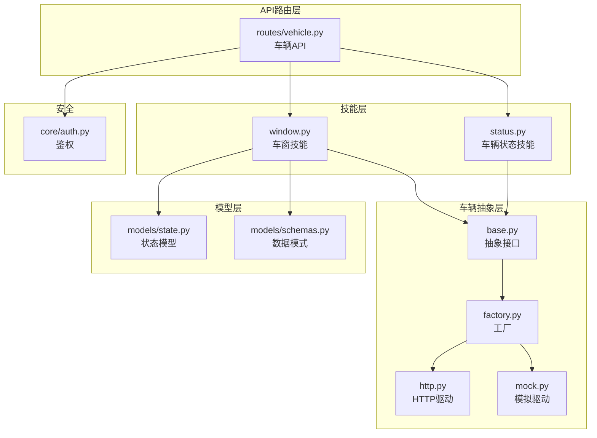
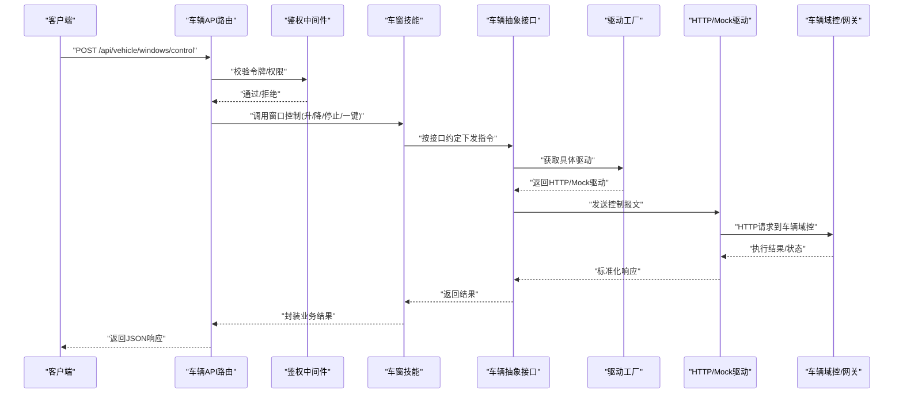
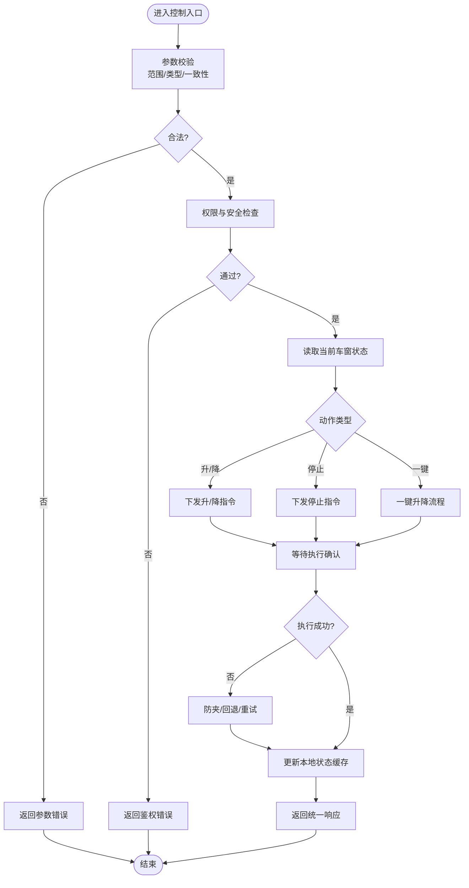
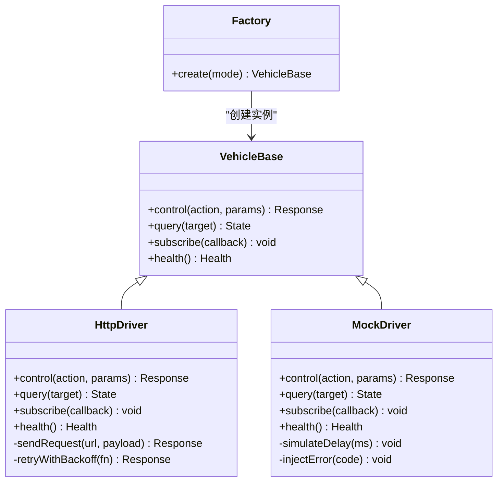
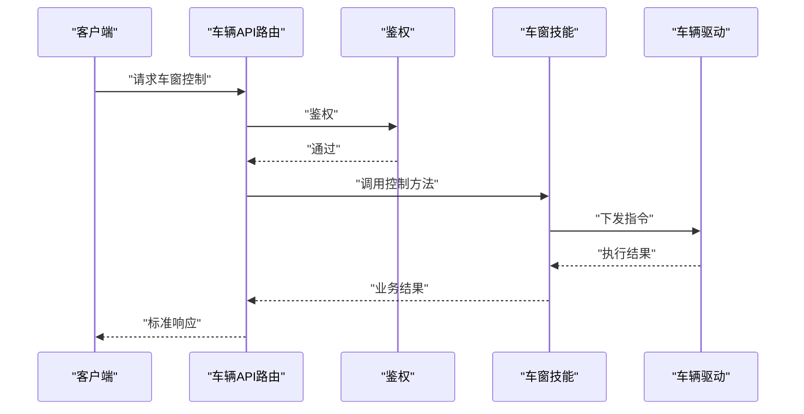
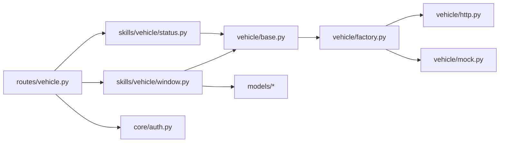

# 车窗控制

<cite>
**本文引用的文件**   
- [backend_design/nexus/skills/vehicle/window.py](file://backend_design/nexus/skills/vehicle/window.py)
- [backend_design/nexus/skills/vehicle/status.py](file://backend_design/nexus/skills/vehicle/status.py)
- [backend_design/nexus/api/routes/vehicle.py](file://backend_design/nexus/api/routes/vehicle.py)
- [backend_design/nexus/vehicle/base.py](file://backend_design/nexus/vehicle/base.py)
- [backend_design/nexus/vehicle/factory.py](file://backend_design/nexus/vehicle/factory.py)
- [backend_design/nexus/vehicle/http.py](file://backend_design/nexus/vehicle/http.py)
- [backend_design/nexus/vehicle/mock.py](file://backend_design/nexus/vehicle/mock.py)
- [backend_design/nexus/core/auth.py](file://backend_design/nexus/core/auth.py)
- [backend_design/nexus/models/state.py](file://backend_design/nexus/models/state.py)
- [backend_design/nexus/models/schemas.py](file://backend_design/nexus/models/schemas.py)
</cite>

## 目录
1. [简介](#简介)
2. [项目结构](#项目结构)
3. [核心组件](#核心组件)
4. [架构总览](#架构总览)
5. [详细组件分析](#详细组件分析)
6. [依赖关系分析](#依赖关系分析)
7. [性能考虑](#性能考虑)
8. [故障诊断指南](#故障诊断指南)
9. [结论](#结论)
10. [附录](#附录)

## 简介
本技术文档围绕“车窗控制系统”的实现与使用，覆盖以下关键主题：
- 升降控制、防夹保护、一键升降等功能的实现逻辑
- 车窗状态监控与安全检测机制
- 权限验证流程
- 与车辆门窗控制模块的通信协议与指令格式
- 调用示例与状态反馈处理
- 安全防护措施与故障诊断方法

该子系统位于后端技能层（skills）中，通过统一的车辆抽象接口与底层驱动（HTTP/Mock）交互，并在API路由层暴露对外能力。

## 项目结构
与车窗控制相关的代码主要分布在如下位置：
- 技能层：提供面向业务的车窗操作与状态查询能力
- 车辆抽象层：定义统一接口与工厂，屏蔽底层差异
- API路由层：将业务技能暴露为REST接口
- 模型层：承载请求/响应结构与系统状态

图示来源
- [backend_design/nexus/skills/vehicle/window.py](file://backend_design/nexus/skills/vehicle/window.py)
- [backend_design/nexus/skills/vehicle/status.py](file://backend_design/nexus/skills/vehicle/status.py)
- [backend_design/nexus/vehicle/base.py](file://backend_design/nexus/vehicle/base.py)
- [backend_design/nexus/vehicle/factory.py](file://backend_design/nexus/vehicle/factory.py)
- [backend_design/nexus/vehicle/http.py](file://backend_design/nexus/vehicle/http.py)
- [backend_design/nexus/vehicle/mock.py](file://backend_design/nexus/vehicle/mock.py)
- [backend_design/nexus/api/routes/vehicle.py](file://backend_design/nexus/api/routes/vehicle.py)
- [backend_design/nexus/models/state.py](file://backend_design/nexus/models/state.py)
- [backend_design/nexus/models/schemas.py](file://backend_design/nexus/models/schemas.py)
- [backend_design/nexus/core/auth.py](file://backend_design/nexus/core/auth.py)

章节来源
- [backend_design/nexus/skills/vehicle/window.py](file://backend_design/nexus/skills/vehicle/window.py)
- [backend_design/nexus/skills/vehicle/status.py](file://backend_design/nexus/skills/vehicle/status.py)
- [backend_design/nexus/api/routes/vehicle.py](file://backend_design/nexus/api/routes/vehicle.py)
- [backend_design/nexus/vehicle/base.py](file://backend_design/nexus/vehicle/base.py)
- [backend_design/nexus/vehicle/factory.py](file://backend_design/nexus/vehicle/factory.py)
- [backend_design/nexus/vehicle/http.py](file://backend_design/nexus/vehicle/http.py)
- [backend_design/nexus/vehicle/mock.py](file://backend_design/nexus/vehicle/mock.py)
- [backend_design/nexus/models/state.py](file://backend_design/nexus/models/state.py)
- [backend_design/nexus/models/schemas.py](file://backend_design/nexus/models/schemas.py)
- [backend_design/nexus/core/auth.py](file://backend_design/nexus/core/auth.py)

## 核心组件
- 车窗技能（window.py）
  - 职责：封装车窗相关的高阶能力，如升/降、停止、一键升降、防夹策略、角度控制等；协调状态读取与安全校验。
  - 关键点：对底层驱动进行抽象调用，统一错误码与结果结构，记录日志与指标。
- 车辆状态技能（status.py）
  - 职责：聚合并返回当前车辆各部件状态，包括车窗开度、锁止状态、防夹触发标志等。
- 车辆抽象接口（base.py）
  - 职责：定义所有车辆驱动的通用契约，确保上层技能无需关心具体实现。
- 驱动工厂（factory.py）
  - 职责：根据配置选择HTTP或Mock驱动实例，完成注入与生命周期管理。
- HTTP驱动（http.py）
  - 职责：将技能层的命令转换为对车辆网关/域控的HTTP请求，负责序列化、重试、超时与错误映射。
- Mock驱动（mock.py）
  - 职责：在开发/测试环境模拟车窗行为，支持预设场景与异常注入。
- API路由（routes/vehicle.py）
  - 职责：暴露REST接口，接收前端/语音助手请求，调用技能层执行，返回标准化响应。
- 鉴权（core/auth.py）
  - 职责：校验调用方身份与权限，拦截未授权访问。
- 模型（models/state.py, models/schemas.py）
  - 职责：定义状态对象与请求/响应数据结构，保证前后端一致。

章节来源
- [backend_design/nexus/skills/vehicle/window.py](file://backend_design/nexus/skills/vehicle/window.py)
- [backend_design/nexus/skills/vehicle/status.py](file://backend_design/nexus/skills/vehicle/status.py)
- [backend_design/nexus/vehicle/base.py](file://backend_design/nexus/vehicle/base.py)
- [backend_design/nexus/vehicle/factory.py](file://backend_design/nexus/vehicle/factory.py)
- [backend_design/nexus/vehicle/http.py](file://backend_design/nexus/vehicle/http.py)
- [backend_design/nexus/vehicle/mock.py](file://backend_design/nexus/vehicle/mock.py)
- [backend_design/nexus/api/routes/vehicle.py](file://backend_design/nexus/api/routes/vehicle.py)
- [backend_design/nexus/core/auth.py](file://backend_design/nexus/core/auth.py)
- [backend_design/nexus/models/state.py](file://backend_design/nexus/models/state.py)
- [backend_design/nexus/models/schemas.py](file://backend_design/nexus/models/schemas.py)

## 架构总览
车窗控制的整体调用链路从API路由开始，经鉴权后进入技能层，再通过车辆抽象层选择具体驱动执行，最终与车辆域控或模拟环境交互。

图示来源
- [backend_design/nexus/api/routes/vehicle.py](file://backend_design/nexus/api/routes/vehicle.py)
- [backend_design/nexus/core/auth.py](file://backend_design/nexus/core/auth.py)
- [backend_design/nexus/skills/vehicle/window.py](file://backend_design/nexus/skills/vehicle/window.py)
- [backend_design/nexus/vehicle/base.py](file://backend_design/nexus/vehicle/base.py)
- [backend_design/nexus/vehicle/factory.py](file://backend_design/nexus/vehicle/factory.py)
- [backend_design/nexus/vehicle/http.py](file://backend_design/nexus/vehicle/http.py)
- [backend_design/nexus/vehicle/mock.py](file://backend_design/nexus/vehicle/mock.py)

## 详细组件分析

### 车窗技能（window.py）
- 功能要点
  - 升/降/停止：支持单窗与多窗批量控制，具备目标位置与速度档位参数。
  - 一键升降：长按触发全开/全关，带防夹与限位保护。
  - 角度控制：支持百分比或角度值设定，内部做边界裁剪与一致性校验。
  - 防夹保护：基于电流/阻力阈值与时间窗判定，遇阻立即停止并回退一定距离。
  - 安全检测：检查车门锁止、车速、儿童锁等前置条件。
  - 权限校验：结合用户角色与设备上下文，限制危险操作。
- 数据流
  - 输入：目标窗位、动作类型、是否一键、安全上下文
  - 处理：参数校验→权限检查→状态读取→下发指令→等待确认→更新本地缓存
  - 输出：统一响应体（含状态码、消息、执行结果、时序信息）
- 错误处理
  - 网络/驱动异常：重试与降级（切换Mock）
  - 执行失败：回滚至上一安全位置，上报告警
  - 越界/非法参数：快速失败，返回明确错误码

图示来源
- [backend_design/nexus/skills/vehicle/window.py](file://backend_design/nexus/skills/vehicle/window.py)
- [backend_design/nexus/models/state.py](file://backend_design/nexus/models/state.py)
- [backend_design/nexus/models/schemas.py](file://backend_design/nexus/models/schemas.py)

章节来源
- [backend_design/nexus/skills/vehicle/window.py](file://backend_design/nexus/skills/vehicle/window.py)
- [backend_design/nexus/models/state.py](file://backend_design/nexus/models/state.py)
- [backend_design/nexus/models/schemas.py](file://backend_design/nexus/models/schemas.py)

### 车辆状态技能（status.py）
- 功能要点
  - 聚合各子系统状态，包括车窗开度、锁止、防夹标志、温度、媒体等
  - 提供增量订阅与快照查询两种模式
- 数据流
  - 读取：从状态存储/总线拉取最新状态
  - 过滤：按权限与字段白名单裁剪
  - 输出：标准化状态对象

章节来源
- [backend_design/nexus/skills/vehicle/status.py](file://backend_design/nexus/skills/vehicle/status.py)

### 车辆抽象接口与驱动（base.py, factory.py, http.py, mock.py）
- 抽象接口（base.py）
  - 定义统一方法：控制、查询、订阅、健康检查
  - 约束返回值与异常类型，便于上层统一处理
- 驱动工厂（factory.py）
  - 依据配置选择HTTP或Mock驱动
  - 支持热切换与降级策略
- HTTP驱动（http.py）
  - 负责与车辆域控的HTTP通信
  - 包含重试、超时、熔断、幂等键、签名与加密
- Mock驱动（mock.py）
  - 用于开发与联调，可注入延迟、错误与随机抖动

图示来源
- [backend_design/nexus/vehicle/base.py](file://backend_design/nexus/vehicle/base.py)
- [backend_design/nexus/vehicle/http.py](file://backend_design/nexus/vehicle/http.py)
- [backend_design/nexus/vehicle/mock.py](file://backend_design/nexus/vehicle/mock.py)
- [backend_design/nexus/vehicle/factory.py](file://backend_design/nexus/vehicle/factory.py)

章节来源
- [backend_design/nexus/vehicle/base.py](file://backend_design/nexus/vehicle/base.py)
- [backend_design/nexus/vehicle/factory.py](file://backend_design/nexus/vehicle/factory.py)
- [backend_design/nexus/vehicle/http.py](file://backend_design/nexus/vehicle/http.py)
- [backend_design/nexus/vehicle/mock.py](file://backend_design/nexus/vehicle/mock.py)

### API路由与鉴权（routes/vehicle.py, core/auth.py）
- 路由职责
  - 暴露REST接口：车窗控制、状态查询、批量操作
  - 参数解析与校验，绑定技能层方法
  - 统一错误包装与日志记录
- 鉴权职责
  - 校验JWT/会话令牌
  - 基于角色的细粒度权限控制（例如仅允许驾驶员操作）
  - 审计日志与风控标记

图示来源
- [backend_design/nexus/api/routes/vehicle.py](file://backend_design/nexus/api/routes/vehicle.py)
- [backend_design/nexus/core/auth.py](file://backend_design/nexus/core/auth.py)
- [backend_design/nexus/skills/vehicle/window.py](file://backend_design/nexus/skills/vehicle/window.py)

章节来源
- [backend_design/nexus/api/routes/vehicle.py](file://backend_design/nexus/api/routes/vehicle.py)
- [backend_design/nexus/core/auth.py](file://backend_design/nexus/core/auth.py)

## 依赖关系分析
- 耦合与内聚
  - 技能层与驱动层通过抽象接口解耦，提升可替换性与可测试性
  - API路由仅依赖技能层，不直接感知驱动细节
- 外部依赖
  - HTTP驱动依赖车辆域控服务，需考虑网络稳定性与可用性
  - Mock驱动用于无硬件环境下的联调
- 潜在循环依赖
  - 通过分层与接口隔离避免循环引用
- 接口契约
  - 统一的状态与响应结构由模型层保障

图示来源
- [backend_design/nexus/api/routes/vehicle.py](file://backend_design/nexus/api/routes/vehicle.py)
- [backend_design/nexus/skills/vehicle/window.py](file://backend_design/nexus/skills/vehicle/window.py)
- [backend_design/nexus/skills/vehicle/status.py](file://backend_design/nexus/skills/vehicle/status.py)
- [backend_design/nexus/vehicle/base.py](file://backend_design/nexus/vehicle/base.py)
- [backend_design/nexus/vehicle/factory.py](file://backend_design/nexus/vehicle/factory.py)
- [backend_design/nexus/vehicle/http.py](file://backend_design/nexus/vehicle/http.py)
- [backend_design/nexus/vehicle/mock.py](file://backend_design/nexus/vehicle/mock.py)
- [backend_design/nexus/core/auth.py](file://backend_design/nexus/core/auth.py)

章节来源
- [backend_design/nexus/api/routes/vehicle.py](file://backend_design/nexus/api/routes/vehicle.py)
- [backend_design/nexus/skills/vehicle/window.py](file://backend_design/nexus/skills/vehicle/window.py)
- [backend_design/nexus/skills/vehicle/status.py](file://backend_design/nexus/skills/vehicle/status.py)
- [backend_design/nexus/vehicle/base.py](file://backend_design/nexus/vehicle/base.py)
- [backend_design/nexus/vehicle/factory.py](file://backend_design/nexus/vehicle/factory.py)
- [backend_design/nexus/vehicle/http.py](file://backend_design/nexus/vehicle/http.py)
- [backend_design/nexus/vehicle/mock.py](file://backend_design/nexus/vehicle/mock.py)
- [backend_design/nexus/core/auth.py](file://backend_design/nexus/core/auth.py)

## 性能考虑
- 并发与批处理
  - 批量控制采用并行下发与汇总结果，降低端到端时延
- 缓存与去抖
  - 状态缓存减少重复查询；高频指令合并与去抖避免频繁下发
- 超时与重试
  - 合理设置超时与指数退避重试，避免雪崩
- 降级与熔断
  - 当HTTP驱动不可用时自动切换Mock或返回只读状态
- 资源占用
  - 控制指令尽量精简，避免大Payload；日志采样与异步落盘

[本节为通用指导，不涉及具体文件分析]

## 故障诊断指南
- 常见问题定位
  - 鉴权失败：检查令牌有效期、角色权限、IP白名单
  - 指令下发失败：查看HTTP驱动日志、重试次数、错误码映射
  - 防夹误触发：核对阻力阈值、回退距离、传感器信号质量
  - 状态不一致：比对本地缓存与远端状态，必要时强制刷新
- 诊断步骤
  - 启用调试日志与追踪ID，关联一次请求的全链路
  - 使用Mock驱动复现问题，隔离网络因素
  - 回放历史事件，定位时序与竞态问题
- 恢复策略
  - 自动回退至安全位置
  - 重启驱动连接或切换备用通道
  - 人工介入确认后再恢复控制

章节来源
- [backend_design/nexus/vehicle/http.py](file://backend_design/nexus/vehicle/http.py)
- [backend_design/nexus/vehicle/mock.py](file://backend_design/nexus/vehicle/mock.py)
- [backend_design/nexus/core/auth.py](file://backend_design/nexus/core/auth.py)

## 结论
本车窗控制系统以清晰的层次化架构实现了可控、可观测、可扩展的车窗管理能力。通过抽象接口与驱动工厂，系统具备良好的可替换性与可测试性；结合鉴权、防夹、状态同步与错误恢复机制，满足车规级安全与可靠性要求。建议在后续迭代中完善遥测指标、灰度发布与自动化回归测试，进一步提升稳定性与可维护性。

[本节为总结性内容，不涉及具体文件分析]

## 附录

### 通信协议与指令格式（概念说明）
- 传输协议
  - 推荐HTTP/HTTPS，TLS加密，携带签名与时间戳防重放
- 典型指令字段（概念）
  - 动作：升/降/停止/一键
  - 目标：百分比或角度
  - 安全上下文：车速、锁止、儿童锁、用户角色
  - 幂等键：用于重试去重
- 响应结构（概念）
  - 状态码、消息、执行结果、时序信息、诊断码

[本节为概念性说明，不涉及具体文件分析]

### 调用示例与状态反馈（概念说明）
- 控制示例
  - 请求：指定目标窗位与动作类型
  - 响应：返回执行结果与当前状态
- 状态反馈
  - 实时推送或轮询获取最新开度、防夹标志、错误码
- 错误处理
  - 参数错误、鉴权失败、执行失败、网络异常的分类与提示

[本节为概念性说明，不涉及具体文件分析]