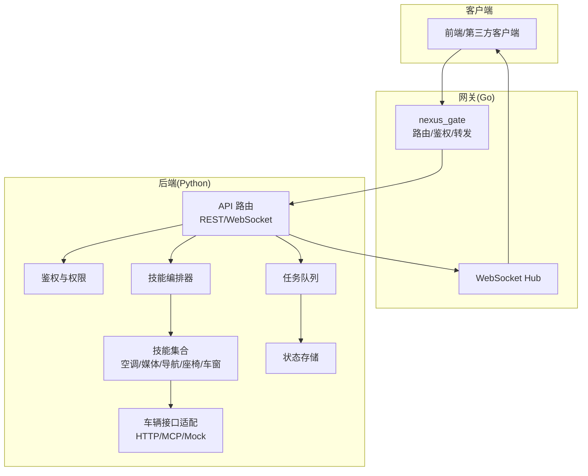
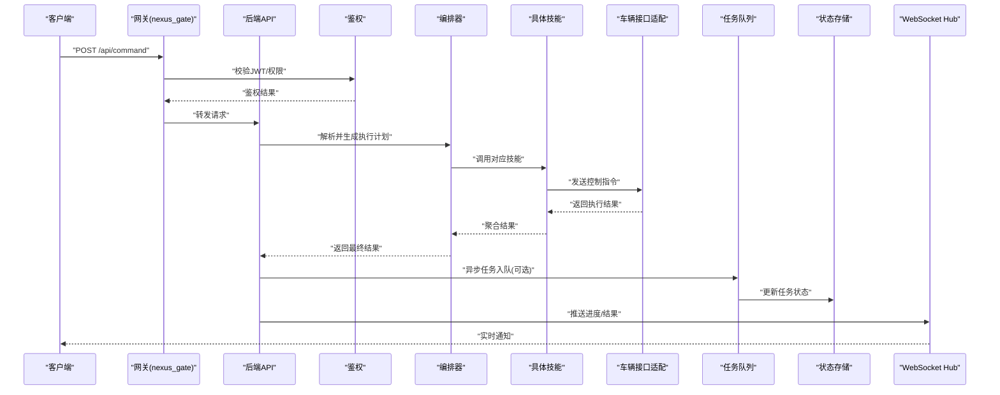
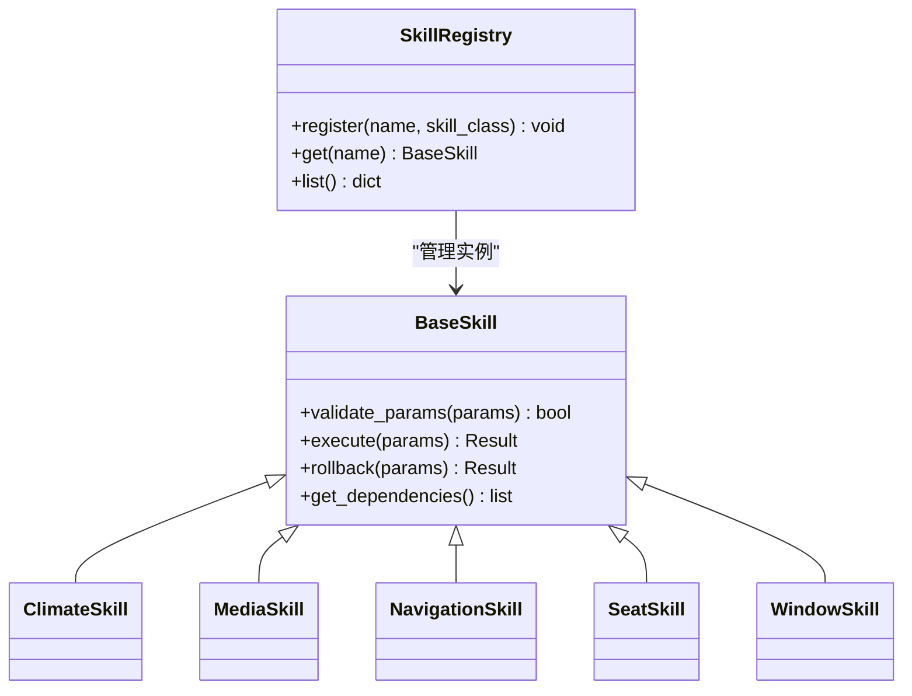
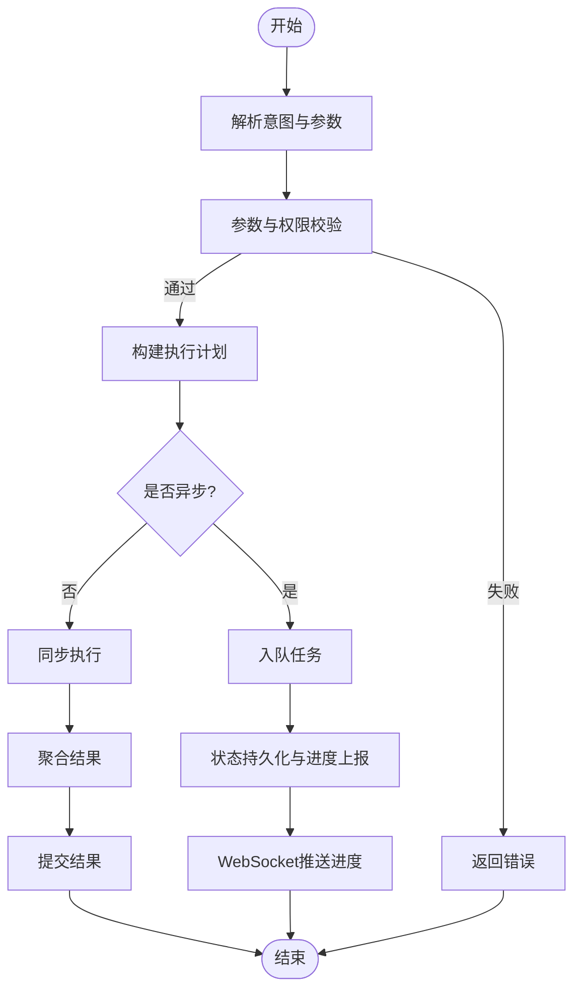
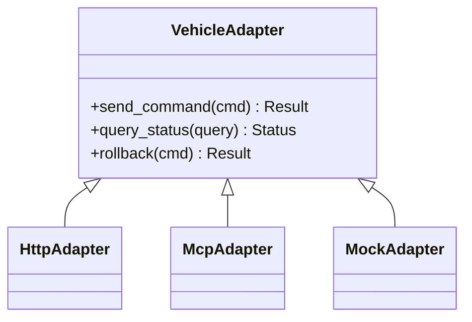
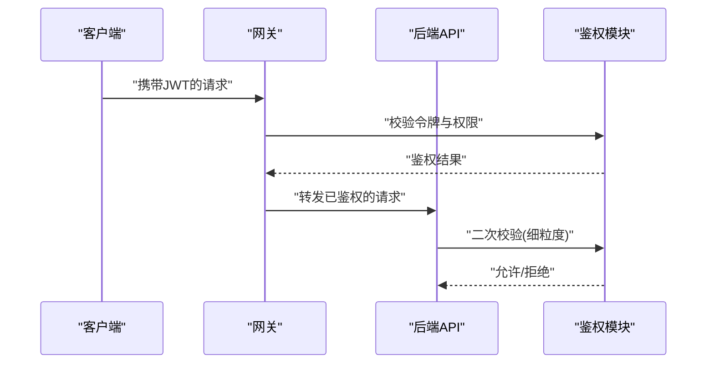
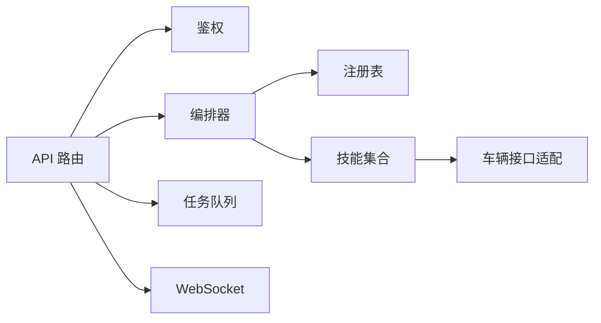
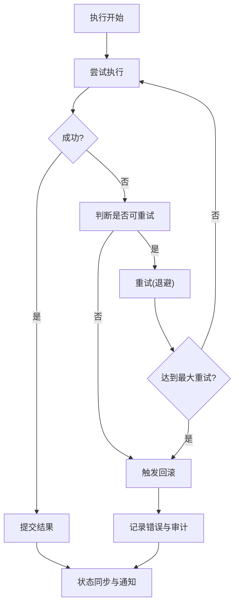

# 远程控制命令

<cite>
**本文引用的文件**   
- [backend_design/nexus/skills/vehicle/climate.py](file://backend_design/nexus/skills/vehicle/climate.py)
- [backend_design/nexus/skills/vehicle/media.py](file://backend_design/nexus/skills/vehicle/media.py)
- [backend_design/nexus/skills/vehicle/navigation.py](file://backend_design/nexus/skills/vehicle/navigation.py)
- [backend_design/nexus/skills/vehicle/seat.py](file://backend_design/nexus/skills/vehicle/seat.py)
- [backend_design/nexus/skills/vehicle/window.py](file://backend_design/nexus/skills/vehicle/window.py)
- [backend_design/nexus/skills/base.py](file://backend_design/nexus/skills/base.py)
- [backend_design/nexus/skills/orchestrator.py](file://backend_design/nexus/skills/orchestrator.py)
- [backend_design/nexus/skills/registry.py](file://backend_design/nexus/skills/registry.py)
- [backend_design/nexus/vehicle/factory.py](file://backend_design/nexus/vehicle/factory.py)
- [backend_design/nexus/vehicle/http.py](file://backend_design/nexus/vehicle/http.py)
- [backend_design/nexus/vehicle/mcp.py](file://backend_design/nexus/vehicle/mcp.py)
- [backend_design/nexus/vehicle/mock.py](file://backend_design/nexus/vehicle/mock.py)
- [backend_design/nexus/core/auth.py](file://backend_design/nexus/core/auth.py)
- [backend_design/nexus/api/routes/cockpit.py](file://backend_design/nexus/api/routes/cockpit.py)
- [backend_design/nexus/api/websocket.py](file://backend_design/nexus/api/websocket.py)
- [backend_design/nexus/middleware/task_queue.py](file://backend_design/nexus/middleware/task_queue.py)
- [backend_design/nexus/core/circuit_breaker.py](file://backend_design/nexus/core/circuit_breaker.py)
- [backend_design/nexus/intent/router.py](file://backend_design/nexus/intent/router.py)
- [backend_design/nexus/models/state.py](file://backend_design/nexus/models/state.py)
- [backend_design/nexus_gate/internal/handlers/handlers.go](file://backend_design/nexus_gate/internal/handlers/handlers.go)
- [backend_design/nexus_gate/internal/ws/hub.go](file://backend_design/nexus_gate/internal/ws/hub.go)
</cite>

## 目录
1. [简介](#简介)
2. [项目结构](#项目结构)
3. [核心组件](#核心组件)
4. [架构总览](#架构总览)
5. [详细组件分析](#详细组件分析)
6. [依赖关系分析](#依赖关系分析)
7. [性能与可靠性](#性能与可靠性)
8. [故障处理与回滚](#故障处理与回滚)
9. [自定义控制命令开发指南](#自定义控制命令开发指南)
10. [测试方法](#测试方法)
11. [结论](#结论)

## 简介
本技术文档围绕“远程控制命令系统”展开，聚焦以下目标：
- 命令下发流程、执行确认与回滚机制
- 各类控制技能实现：空调、媒体播放、导航设置、座椅调节、车窗控制等
- 命令验证、权限控制与安全性保障
- 异步执行、任务队列与进度跟踪
- 自定义控制命令的开发指南与测试方法
- 故障处理、超时控制与状态同步机制

该系统采用“意图识别 -> 技能编排 -> 车辆接口适配 -> 网关/WebSocket 推送”的分层架构，支持同步与异步两种执行模式，并提供断路器、任务队列与状态持久化等关键能力。

## 项目结构
从仓库结构看，远程控制命令相关代码主要分布在后端 Python 服务与 Go 网关中：
- 技能层（skills）：定义各控制领域的能力（空调、媒体、导航、座椅、车窗等），并统一通过基类与注册表管理
- 编排器（orchestrator）：负责将用户意图转换为具体技能调用序列，协调并发与顺序执行
- 车辆接口适配（vehicle）：抽象底层车控协议（HTTP/MCP/Mock），屏蔽差异
- API 与 WebSocket：对外暴露 REST 与实时通道，承载命令下发与结果推送
- 中间件：任务队列、限流、缓存等横切能力
- 安全与鉴权：JWT 鉴权、权限校验
- 网关（Go）：统一入口、鉴权、路由、WebSocket Hub 广播

图表来源
- [backend_design/nexus/api/routes/cockpit.py](file://backend_design/nexus/api/routes/cockpit.py)
- [backend_design/nexus/api/websocket.py](file://backend_design/nexus/api/websocket.py)
- [backend_design/nexus/skills/orchestrator.py](file://backend_design/nexus/skills/orchestrator.py)
- [backend_design/nexus/skills/registry.py](file://backend_design/nexus/skills/registry.py)
- [backend_design/nexus/vehicle/factory.py](file://backend_design/nexus/vehicle/factory.py)
- [backend_design/nexus/middleware/task_queue.py](file://backend_design/nexus/middleware/task_queue.py)
- [backend_design/nexus_gate/internal/handlers/handlers.go](file://backend_design/nexus_gate/internal/handlers/handlers.go)
- [backend_design/nexus_gate/internal/ws/hub.go](file://backend_design/nexus_gate/internal/ws/hub.go)

章节来源
- [backend_design/nexus/skills/base.py](file://backend_design/nexus/skills/base.py)
- [backend_design/nexus/skills/orchestrator.py](file://backend_design/nexus/skills/orchestrator.py)
- [backend_design/nexus/skills/registry.py](file://backend_design/nexus/skills/registry.py)
- [backend_design/nexus/vehicle/factory.py](file://backend_design/nexus/vehicle/factory.py)
- [backend_design/nexus/vehicle/http.py](file://backend_design/nexus/vehicle/http.py)
- [backend_design/nexus/vehicle/mcp.py](file://backend_design/nexus/vehicle/mcp.py)
- [backend_design/nexus/vehicle/mock.py](file://backend_design/nexus/vehicle/mock.py)
- [backend_design/nexus/api/routes/cockpit.py](file://backend_design/nexus/api/routes/cockpit.py)
- [backend_design/nexus/api/websocket.py](file://backend_design/nexus/api/websocket.py)
- [backend_design/nexus/middleware/task_queue.py](file://backend_design/nexus/middleware/task_queue.py)
- [backend_design/nexus/core/auth.py](file://backend_design/nexus/core/auth.py)
- [backend_design/nexus_gate/internal/handlers/handlers.go](file://backend_design/nexus_gate/internal/handlers/handlers.go)
- [backend_design/nexus_gate/internal/ws/hub.go](file://backend_design/nexus_gate/internal/ws/hub.go)

## 核心组件
- 技能基类与注册表
  - 所有控制技能继承统一的基类，提供参数校验、日志、错误封装与生命周期钩子
  - 注册表集中管理技能元数据与实例，便于动态发现与编排
- 编排器
  - 接收意图解析后的结构化指令，按依赖关系生成执行计划
  - 支持串行、并行、条件分支与重试策略
- 车辆接口适配
  - 抽象 HTTP/MCP/Mock 三种实现，统一返回标准化响应
  - 工厂根据配置选择具体实现
- 任务队列与状态
  - 长耗时操作入队，异步执行，状态写入持久化存储
  - 前端可通过 WebSocket 订阅进度与结果
- 鉴权与安全
  - 基于 JWT 的鉴权与细粒度权限控制
  - 输入校验、速率限制、熔断保护

章节来源
- [backend_design/nexus/skills/base.py](file://backend_design/nexus/skills/base.py)
- [backend_design/nexus/skills/registry.py](file://backend_design/nexus/skills/registry.py)
- [backend_design/nexus/skills/orchestrator.py](file://backend_design/nexus/skills/orchestrator.py)
- [backend_design/nexus/vehicle/factory.py](file://backend_design/nexus/vehicle/factory.py)
- [backend_design/nexus/middleware/task_queue.py](file://backend_design/nexus/middleware/task_queue.py)
- [backend_design/nexus/core/auth.py](file://backend_design/nexus/core/auth.py)

## 架构总览
远程命令从客户端到车辆的端到端流程如下：

图表来源
- [backend_design/nexus/api/routes/cockpit.py](file://backend_design/nexus/api/routes/cockpit.py)
- [backend_design/nexus/api/websocket.py](file://backend_design/nexus/api/websocket.py)
- [backend_design/nexus/skills/orchestrator.py](file://backend_design/nexus/skills/orchestrator.py)
- [backend_design/nexus/vehicle/factory.py](file://backend_design/nexus/vehicle/factory.py)
- [backend_design/nexus/middleware/task_queue.py](file://backend_design/nexus/middleware/task_queue.py)
- [backend_design/nexus/core/auth.py](file://backend_design/nexus/core/auth.py)
- [backend_design/nexus_gate/internal/handlers/handlers.go](file://backend_design/nexus_gate/internal/handlers/handlers.go)
- [backend_design/nexus_gate/internal/ws/hub.go](file://backend_design/nexus_gate/internal/ws/hub.go)

## 详细组件分析

### 技能基类与注册表
- 设计要点
  - 基类提供统一的参数校验、异常包装、日志记录与可观测性埋点
  - 注册表维护技能名称、版本、依赖与实例，供编排器动态加载
- 典型交互
  - 编排器通过注册表获取技能实例
  - 技能内部通过车辆接口适配器发送指令

图表来源
- [backend_design/nexus/skills/base.py](file://backend_design/nexus/skills/base.py)
- [backend_design/nexus/skills/registry.py](file://backend_design/nexus/skills/registry.py)
- [backend_design/nexus/skills/vehicle/climate.py](file://backend_design/nexus/skills/vehicle/climate.py)
- [backend_design/nexus/skills/vehicle/media.py](file://backend_design/nexus/skills/vehicle/media.py)
- [backend_design/nexus/skills/vehicle/navigation.py](file://backend_design/nexus/skills/vehicle/navigation.py)
- [backend_design/nexus/skills/vehicle/seat.py](file://backend_design/nexus/skills/vehicle/seat.py)
- [backend_design/nexus/skills/vehicle/window.py](file://backend_design/nexus/skills/vehicle/window.py)

章节来源
- [backend_design/nexus/skills/base.py](file://backend_design/nexus/skills/base.py)
- [backend_design/nexus/skills/registry.py](file://backend_design/nexus/skills/registry.py)

### 编排器与任务队列
- 编排器职责
  - 将意图解析结果转换为技能调用图
  - 处理并发、重试、超时与回滚
- 任务队列
  - 对耗时操作进行异步执行
  - 持久化任务状态，支持进度查询与断点续传

图表来源
- [backend_design/nexus/skills/orchestrator.py](file://backend_design/nexus/skills/orchestrator.py)
- [backend_design/nexus/middleware/task_queue.py](file://backend_design/nexus/middleware/task_queue.py)
- [backend_design/nexus/models/state.py](file://backend_design/nexus/models/state.py)
- [backend_design/nexus/api/websocket.py](file://backend_design/nexus/api/websocket.py)

章节来源
- [backend_design/nexus/skills/orchestrator.py](file://backend_design/nexus/skills/orchestrator.py)
- [backend_design/nexus/middleware/task_queue.py](file://backend_design/nexus/middleware/task_queue.py)
- [backend_design/nexus/models/state.py](file://backend_design/nexus/models/state.py)

### 车辆接口适配
- 抽象层
  - 统一接口定义，屏蔽不同协议的差异
- 实现
  - HTTP：通过 REST 调用车载服务
  - MCP：通过消息通信协议
  - Mock：用于开发与测试

图表来源
- [backend_design/nexus/vehicle/factory.py](file://backend_design/nexus/vehicle/factory.py)
- [backend_design/nexus/vehicle/http.py](file://backend_design/nexus/vehicle/http.py)
- [backend_design/nexus/vehicle/mcp.py](file://backend_design/nexus/vehicle/mcp.py)
- [backend_design/nexus/vehicle/mock.py](file://backend_design/nexus/vehicle/mock.py)

章节来源
- [backend_design/nexus/vehicle/factory.py](file://backend_design/nexus/vehicle/factory.py)
- [backend_design/nexus/vehicle/http.py](file://backend_design/nexus/vehicle/http.py)
- [backend_design/nexus/vehicle/mcp.py](file://backend_design/nexus/vehicle/mcp.py)
- [backend_design/nexus/vehicle/mock.py](file://backend_design/nexus/vehicle/mock.py)

### 鉴权与安全
- 鉴权流程
  - 网关层校验 JWT，传递用户上下文至后端
  - 后端在 API 层进行细粒度权限校验
- 安全措施
  - 输入校验、速率限制、熔断保护
  - 敏感参数脱敏与审计日志

图表来源
- [backend_design/nexus/core/auth.py](file://backend_design/nexus/core/auth.py)
- [backend_design/nexus/api/routes/cockpit.py](file://backend_design/nexus/api/routes/cockpit.py)
- [backend_design/nexus_gate/internal/handlers/handlers.go](file://backend_design/nexus_gate/internal/handlers/handlers.go)

章节来源
- [backend_design/nexus/core/auth.py](file://backend_design/nexus/core/auth.py)
- [backend_design/nexus/api/routes/cockpit.py](file://backend_design/nexus/api/routes/cockpit.py)
- [backend_design/nexus_gate/internal/handlers/handlers.go](file://backend_design/nexus_gate/internal/handlers/handlers.go)

### 控制技能详解

#### 空调控制
- 功能范围
  - 温度设定、风量调节、模式切换、分区控制
- 执行流程
  - 参数校验 -> 权限检查 -> 调用车辆接口 -> 状态同步
- 回滚策略
  - 若后续步骤失败，恢复至上一稳定状态

章节来源
- [backend_design/nexus/skills/vehicle/climate.py](file://backend_design/nexus/skills/vehicle/climate.py)

#### 媒体播放
- 功能范围
  - 播放/暂停、切歌、音量控制、列表管理
- 执行流程
  - 解析媒体源 -> 校验权限 -> 下发指令 -> 推送播放状态
- 回滚策略
  - 播放中断时恢复上次播放位置

章节来源
- [backend_design/nexus/skills/vehicle/media.py](file://backend_design/nexus/skills/vehicle/media.py)

#### 导航设置
- 功能范围
  - 目的地设置、路线偏好、语音播报开关
- 执行流程
  - 地址解析 -> 权限校验 -> 调用导航服务 -> 状态反馈
- 回滚策略
  - 导航取消或重置为默认路线

章节来源
- [backend_design/nexus/skills/vehicle/navigation.py](file://backend_design/nexus/skills/vehicle/navigation.py)

#### 座椅调节
- 功能范围
  - 前后移动、靠背角度、腰托、加热/通风
- 执行流程
  - 参数边界检查 -> 权限校验 -> 下发指令 -> 读取当前状态
- 回滚策略
  - 若调节失败，恢复到初始位置

章节来源
- [backend_design/nexus/skills/vehicle/seat.py](file://backend_design/nexus/skills/vehicle/seat.py)

#### 车窗控制
- 功能范围
  - 升降控制、防夹检测、一键关闭
- 执行流程
  - 安全检查 -> 权限校验 -> 下发指令 -> 状态同步
- 回滚策略
  - 遇障碍物自动回退并报警

章节来源
- [backend_design/nexus/skills/vehicle/window.py](file://backend_design/nexus/skills/vehicle/window.py)

## 依赖关系分析
- 组件耦合
  - 编排器依赖注册表与技能基类
  - 技能依赖车辆接口适配
  - API 依赖鉴权、任务队列与 WebSocket
- 外部依赖
  - 网关（Go）负责鉴权与路由
  - 任务队列与状态存储可能使用 Redis/数据库

图表来源
- [backend_design/nexus/api/routes/cockpit.py](file://backend_design/nexus/api/routes/cockpit.py)
- [backend_design/nexus/skills/orchestrator.py](file://backend_design/nexus/skills/orchestrator.py)
- [backend_design/nexus/skills/registry.py](file://backend_design/nexus/skills/registry.py)
- [backend_design/nexus/vehicle/factory.py](file://backend_design/nexus/vehicle/factory.py)
- [backend_design/nexus/middleware/task_queue.py](file://backend_design/nexus/middleware/task_queue.py)
- [backend_design/nexus/api/websocket.py](file://backend_design/nexus/api/websocket.py)

章节来源
- [backend_design/nexus/api/routes/cockpit.py](file://backend_design/nexus/api/routes/cockpit.py)
- [backend_design/nexus/skills/orchestrator.py](file://backend_design/nexus/skills/orchestrator.py)
- [backend_design/nexus/skills/registry.py](file://backend_design/nexus/skills/registry.py)
- [backend_design/nexus/vehicle/factory.py](file://backend_design/nexus/vehicle/factory.py)
- [backend_design/nexus/middleware/task_queue.py](file://backend_design/nexus/middleware/task_queue.py)
- [backend_design/nexus/api/websocket.py](file://backend_design/nexus/api/websocket.py)

## 性能与可靠性
- 异步执行
  - 长耗时任务入队，避免阻塞主线程
- 并发控制
  - 编排器支持并行执行无依赖的技能
- 超时控制
  - 全局与局部超时策略，防止资源泄漏
- 熔断保护
  - 针对不稳定下游服务的熔断与降级

章节来源
- [backend_design/nexus/middleware/task_queue.py](file://backend_design/nexus/middleware/task_queue.py)
- [backend_design/nexus/core/circuit_breaker.py](file://backend_design/nexus/core/circuit_breaker.py)

## 故障处理与回滚
- 错误分类
  - 参数错误、权限不足、网络异常、设备不可用
- 重试与补偿
  - 幂等性保证、指数退避重试、补偿事务
- 状态同步
  - 任务状态持久化，WebSocket 实时推送
- 回滚机制
  - 多步操作中任一失败触发回滚，确保一致性

图表来源
- [backend_design/nexus/skills/orchestrator.py](file://backend_design/nexus/skills/orchestrator.py)
- [backend_design/nexus/core/circuit_breaker.py](file://backend_design/nexus/core/circuit_breaker.py)
- [backend_design/nexus/models/state.py](file://backend_design/nexus/models/state.py)
- [backend_design/nexus/api/websocket.py](file://backend_design/nexus/api/websocket.py)

章节来源
- [backend_design/nexus/skills/orchestrator.py](file://backend_design/nexus/skills/orchestrator.py)
- [backend_design/nexus/core/circuit_breaker.py](file://backend_design/nexus/core/circuit_breaker.py)
- [backend_design/nexus/models/state.py](file://backend_design/nexus/models/state.py)
- [backend_design/nexus/api/websocket.py](file://backend_design/nexus/api/websocket.py)

## 自定义控制命令开发指南
- 步骤
  1. 新建技能类，继承基类，实现 execute 与 rollback
  2. 在注册表中登记技能元数据
  3. 在编排器中添加依赖与执行策略
  4. 编写单元测试与集成测试
- 最佳实践
  - 参数校验前置，错误信息明确
  - 幂等性与可回滚性设计
  - 日志与指标埋点完善

章节来源
- [backend_design/nexus/skills/base.py](file://backend_design/nexus/skills/base.py)
- [backend_design/nexus/skills/registry.py](file://backend_design/nexus/skills/registry.py)
- [backend_design/nexus/skills/orchestrator.py](file://backend_design/nexus/skills/orchestrator.py)

## 测试方法
- 单元测试
  - 覆盖参数校验、异常路径与回滚逻辑
- 集成测试
  - 使用 Mock 车辆接口模拟真实场景
- 端到端测试
  - 通过网关与 WebSocket 验证完整链路
- 混沌工程
  - 注入延迟、丢包与服务不可用，验证熔断与降级

章节来源
- [backend_design/nexus/vehicle/mock.py](file://backend_design/nexus/vehicle/mock.py)
- [backend_design/nexus/core/circuit_breaker.py](file://backend_design/nexus/core/circuit_breaker.py)

## 结论
本远程控制命令系统通过分层设计与模块化组织，实现了高内聚、低耦合的可扩展架构。借助编排器、任务队列、熔断与状态同步等机制，系统在可靠性与性能方面具备良好表现。建议持续完善监控告警与自动化测试，进一步提升稳定性与可维护性。