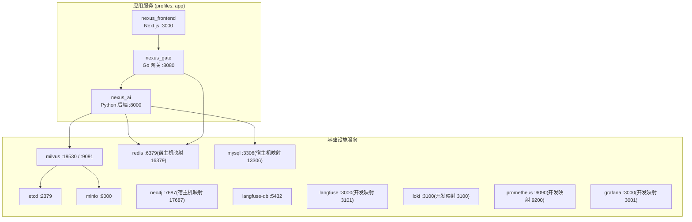
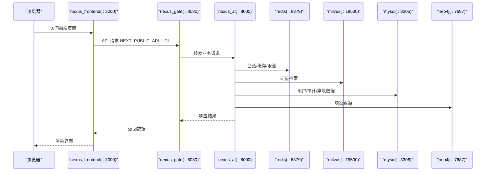
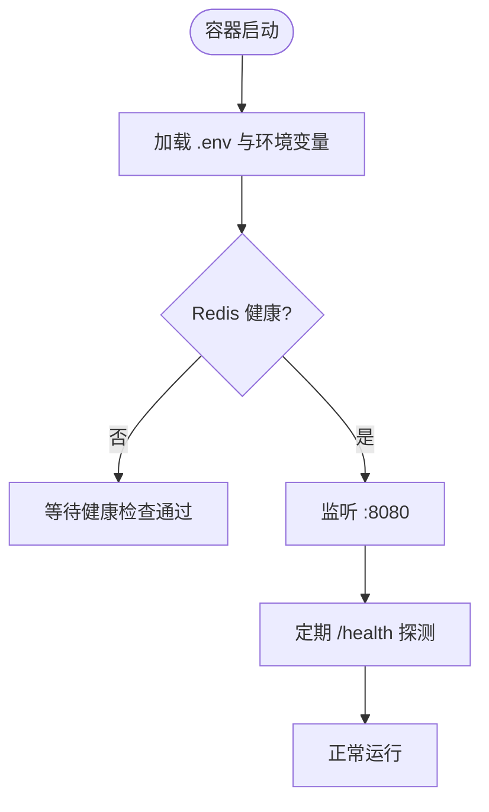
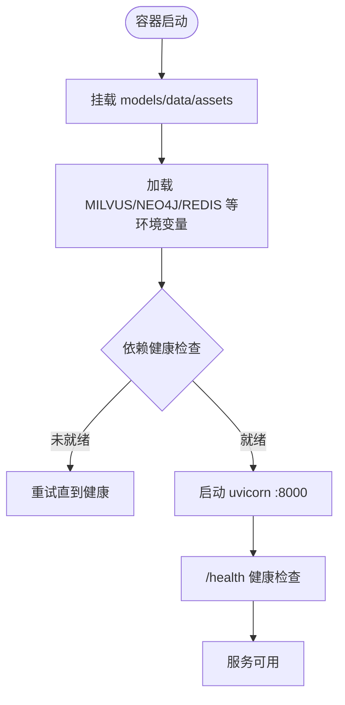
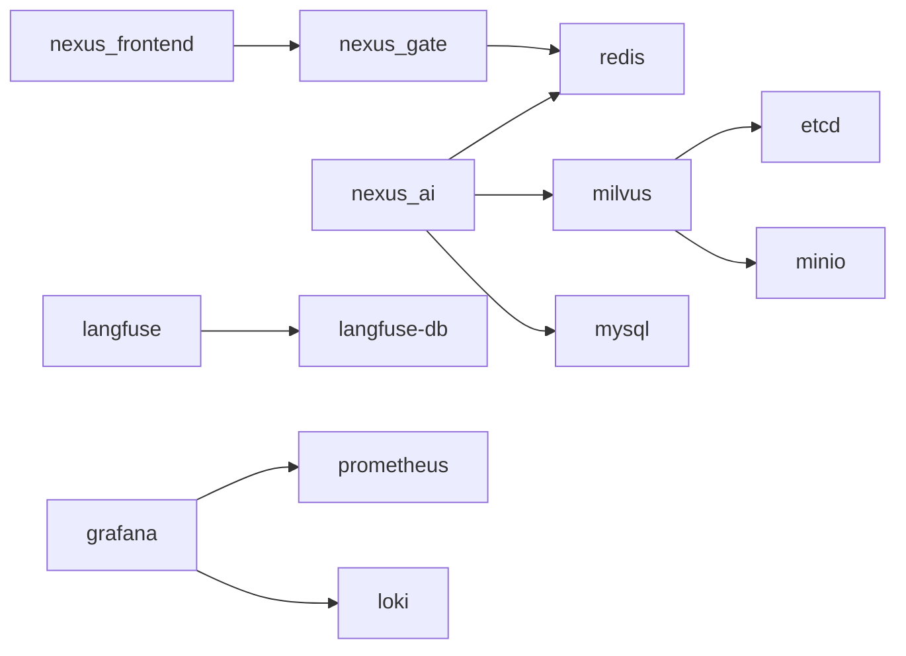

# Docker Compose编排配置

<cite>
**本文引用的文件**   
- [docker-compose.yml](file://docker-compose.yml)
- [docker-compose.dev.yml](file://docker-compose.dev.yml)
- [backend_design/Dockerfile](file://backend_design/Dockerfile)
- [backend_design/nexus_gate/Dockerfile](file://backend_design/nexus_gate/Dockerfile)
- [frontend_design/Dockerfile](file://frontend_design/Dockerfile)
- [config/prometheus/prometheus.yml](file://config/prometheus/prometheus.yml)
- [config/loki/loki-config.yml](file://config/loki/loki-config.yml)
- [Makefile](file://Makefile)
- [scripts/start-all.ps1](file://scripts/start-all.ps1)
</cite>

## 目录
1. [简介](#简介)
2. [项目结构](#项目结构)
3. [核心组件](#核心组件)
4. [架构总览](#架构总览)
5. [详细组件分析](#详细组件分析)
6. [依赖关系分析](#依赖关系分析)
7. [性能与容量规划](#性能与容量规划)
8. [故障排查指南](#故障排查指南)
9. [结论](#结论)
10. [附录：常用命令与环境变量](#附录常用命令与环境变量)

## 简介
本文件为 NexusCockpit 的 Docker Compose 编排配置提供系统化、可操作的文档。内容覆盖应用服务（Go 网关、Python 后端、前端）与基础设施服务（Milvus、Neo4j、Redis、MySQL、MinIO、etcd、Langfuse、Loki、Prometheus、Grafana）的配置说明，包括端口映射、环境变量、数据卷挂载、健康检查、网络与安全设置，以及 profiles 机制在开发/生产环境中的使用方式。同时给出服务依赖图、常见问题定位方法与性能调优建议。

## 项目结构
NexusCockpit 采用“应用 + 基础设施”分层编排：
- 应用层（profiles: app）：nexus_gate（Go）、nexus_ai（Python）、nexus_frontend（Next.js）
- 基础设施层（默认启动）：etcd、minio、milvus、neo4j、redis、mysql、langfuse-db、langfuse、loki、prometheus、grafana
- 开发扩展（docker-compose.dev.yml）：暴露调试端口、追加调试挂载、开启 DEBUG/LOG_LEVEL=DEBUG

图表来源
- [docker-compose.yml:16-88](file://docker-compose.yml#L16-L88)
- [docker-compose.yml:95-277](file://docker-compose.yml#L95-L277)

章节来源
- [docker-compose.yml:1-292](file://docker-compose.yml#L1-L292)
- [docker-compose.dev.yml:1-63](file://docker-compose.dev.yml#L1-L63)

## 核心组件
本节聚焦各服务的职责、关键配置项与运行要点。

- Go 网关（nexus_gate）
  - 构建上下文：./backend_design/nexus_gate，Dockerfile 多阶段构建，最小化运行时镜像
  - 对外端口：8080
  - 环境变量：从 .env 注入；内部通过 NEXUS_AI_HOST/NEXUS_AI_PORT 访问 Python 后端，REDIS_HOST/REDIS_PORT 访问 Redis
  - 依赖：redis（健康检查后启动）
  - 健康检查：HTTP GET /health

- Python AI 后端（nexus_ai）
  - 构建上下文：./backend_design，Dockerfile 多阶段构建，CPU-only PyTorch，uvicorn 启动
  - 对外端口：8000
  - 环境变量：MILVUS_*、NEO4J_URI、REDIS_*；v2.2 已移除 RABBITMQ 相关
  - 数据卷：models、data、assets 持久化到宿主机
  - 依赖：redis、milvus、mysql（均健康检查后启动）
  - 健康检查：HTTP GET /health

- 前端（nexus_frontend）
  - 构建上下文：./frontend_design，Next.js 静态导出+standalone 运行
  - 对外端口：3000
  - 环境变量：NEXT_PUBLIC_API_URL=http://localhost:8080
  - 依赖：nexus_gate

- 基础设施服务
  - etcd：Milvus 元数据存储，数据卷 etcd_data
  - minio：对象存储，MINIO_ACCESS_KEY/SECRET_KEY 支持环境变量注入
  - milvus：向量数据库，依赖 etcd/minio，端口 19530（API），9091（metrics）
  - neo4j：知识图谱，启用 apoc 插件，端口 7687（映射 17687）
  - redis：缓存/向量搜索/限流/PubSub，密码保护、AOF、内存策略、IO 线程
  - mysql：用户数据与审计日志，字符集 utf8mb4，自动执行迁移脚本
  - langfuse-db/langfuse：LLM 追踪，本地化部署，首次需创建项目获取密钥
  - loki：日志聚合，保留期 168h，文件系统存储
  - prometheus：指标采集，抓取 nexus-ai、nexus-gate、milvus、自身
  - grafana：可视化看板，预置 Prometheus/Loki 数据源

章节来源
- [docker-compose.yml:16-88](file://docker-compose.yml#L16-L88)
- [docker-compose.yml:95-277](file://docker-compose.yml#L95-L277)
- [backend_design/Dockerfile:1-58](file://backend_design/Dockerfile#L1-L58)
- [backend_design/nexus_gate/Dockerfile:1-22](file://backend_design/nexus_gate/Dockerfile#L1-L22)
- [frontend_design/Dockerfile:1-32](file://frontend_design/Dockerfile#L1-L32)
- [config/prometheus/prometheus.yml:1-35](file://config/prometheus/prometheus.yml#L1-L35)
- [config/loki/loki-config.yml:1-56](file://config/loki/loki-config.yml#L1-L56)

## 架构总览
下图展示请求链路与服务依赖关系，体现前端→网关→后端→中间件的调用路径，以及可观测性栈（Prometheus/Grafana/Loki/Langfuse）。

图表来源
- [docker-compose.yml:16-88](file://docker-compose.yml#L16-L88)
- [docker-compose.yml:95-277](file://docker-compose.yml#L95-L277)

## 详细组件分析

### 应用服务详解

#### Go 网关（nexus_gate）
- 构建与运行
  - 多阶段构建：golang:1.22-alpine 编译，alpine:3.19 运行
  - 暴露端口：8080
  - 健康检查：wget 探测 /health
- 环境变量
  - NEXUS_AI_HOST/NEXUS_AI_PORT：指向 Python 后端
  - REDIS_HOST/REDIS_PORT：连接 Redis
  - 其他敏感信息通过 env_file: .env 注入
- 依赖与重启策略
  - depends_on redis（condition: service_healthy）
  - restart: unless-stopped

图表来源
- [docker-compose.yml:16-39](file://docker-compose.yml#L16-L39)
- [backend_design/nexus_gate/Dockerfile:1-22](file://backend_design/nexus_gate/Dockerfile#L1-L22)

章节来源
- [docker-compose.yml:16-39](file://docker-compose.yml#L16-L39)
- [backend_design/nexus_gate/Dockerfile:1-22](file://backend_design/nexus_gate/Dockerfile#L1-L22)

#### Python AI 后端（nexus_ai）
- 构建与运行
  - 多阶段构建：python:3.10-slim，CPU-only PyTorch，uvicorn 启动
  - 暴露端口：8000
  - 健康检查：curl 探测 /health
- 环境变量
  - MILVUS_HOST/MILVUS_PORT/MILVUS_URI
  - NEO4J_URI=bolt://neo4j:7687
  - REDIS_HOST/REDIS_PORT
  - v2.2 已移除 RABBITMQ 相关变量
- 数据卷
  - ./models:/app/models
  - ./data:/app/data
  - ./assets:/app/assets
- 依赖与重启策略
  - depends_on redis/milvus/mysql（condition: service_healthy）
  - restart: unless-stopped

图表来源
- [docker-compose.yml:40-74](file://docker-compose.yml#L40-L74)
- [backend_design/Dockerfile:1-58](file://backend_design/Dockerfile#L1-L58)

章节来源
- [docker-compose.yml:40-74](file://docker-compose.yml#L40-L74)
- [backend_design/Dockerfile:1-58](file://backend_design/Dockerfile#L1-L58)

#### 前端（nexus_frontend）
- 构建与运行
  - Next.js 静态导出 + standalone 运行
  - 暴露端口：3000
  - 环境变量：NEXT_PUBLIC_API_URL=http://localhost:8080
- 依赖
  - depends_on nexus_gate

章节来源
- [docker-compose.yml:76-88](file://docker-compose.yml#L76-L88)
- [frontend_design/Dockerfile:1-32](file://frontend_design/Dockerfile#L1-L32)

### 基础设施服务详解

#### Milvus 向量库
- 依赖：etcd、minio
- 端口：19530（API），9091（metrics，开发模式额外映射）
- 环境变量：ETCD_ENDPOINTS、MINIO_ADDRESS、MINIO_ACCESS_KEY_ID/SECRET_ACCESS_KEY
- 健康检查：http://localhost:9091/healthz

章节来源
- [docker-compose.yml:126-145](file://docker-compose.yml#L126-L145)
- [docker-compose.dev.yml:16-19](file://docker-compose.dev.yml#L16-L19)

#### Neo4j 知识图谱
- 端口：7687（映射宿主机 17687，避开 Hyper-V 保留范围）
- 环境变量：NEO4J_AUTH、NEO4J_PLUGINS=apoc、禁用安全限制以启用 apoc.*
- 数据卷：neo4j_data、neo4j_logs

章节来源
- [docker-compose.yml:147-159](file://docker-compose.yml#L147-L159)

#### Redis 8
- 特性：内置 Query Engine（RediSearch FT.* + VECTOR 索引）
- 安全：requirepass、protected-mode yes
- 性能：appendonly yes、maxmemory 1gb、allkeys-lru、io-threads 4
- 端口：6379（映射宿主机 16379，避开保留范围）
- 健康检查：redis-cli ping 带密码

章节来源
- [docker-compose.yml:161-186](file://docker-compose.yml#L161-L186)

#### MySQL 8
- 字符集：utf8mb4，排序规则：utf8mb4_unicode_ci
- 初始化：自动执行 v2.1_migration.sql
- 端口：3306（映射宿主机 13306）
- 健康检查：mysqladmin ping

章节来源
- [docker-compose.yml:188-208](file://docker-compose.yml#L188-L208)

#### Langfuse（LLM 追踪）
- 组件：langfuse-db（Postgres）、langfuse（Web 应用）
- 环境变量：DATABASE_URL、NEXTAUTH_URL、NEXTAUTH_SECRET、SALT、TELEMETRY_ENABLED=false
- 端口：3000（开发映射 3101）
- 健康检查：wget 探测 /api/publichealth

章节来源
- [docker-compose.yml:210-246](file://docker-compose.yml#L210-L246)
- [docker-compose.dev.yml:32-35](file://docker-compose.dev.yml#L32-L35)

#### Loki（日志聚合）
- 配置：local-config.yml 挂载至 /etc/loki/local-config.yml
- 存储：文件系统，保留期 168h
- 端口：3100（开发映射 3100）

章节来源
- [docker-compose.yml:248-254](file://docker-compose.yml#L248-L254)
- [config/loki/loki-config.yml:1-56](file://config/loki/loki-config.yml#L1-L56)

#### Prometheus（指标采集）
- 抓取目标：nexus-ai、nexus-gate、milvus、prometheus 自身
- 使用 host.docker.internal 访问宿主网络服务
- 端口：9090（开发映射 9200）

章节来源
- [docker-compose.yml:256-263](file://docker-compose.yml#L256-L263)
- [config/prometheus/prometheus.yml:1-35](file://config/prometheus/prometheus.yml#L1-L35)

#### Grafana（可视化）
- 环境变量：GF_SECURITY_ADMIN_PASSWORD、GF_USERS_ALLOW_SIGN_UP=false
- 数据源：预置 Prometheus/Loki
- 端口：3000（开发映射 3001）

章节来源
- [docker-compose.yml:265-276](file://docker-compose.yml#L265-L276)

### 环境与配置文件

#### .env 与敏感信息
- 所有服务可通过 env_file: .env 注入敏感配置（如 MINIO_ACCESS_KEY、MYSQL_ROOT_PASSWORD、REDIS_PASSWORD、LANGFUSE_* 等）
- 建议在 .env 中集中管理，避免硬编码

章节来源
- [docker-compose.yml:23-24](file://docker-compose.yml#L23-L24)
- [docker-compose.yml:113-116](file://docker-compose.yml#L113-L116)
- [docker-compose.yml:191-195](file://docker-compose.yml#L191-L195)
- [docker-compose.yml:216-219](file://docker-compose.yml#L216-L219)

#### 开发模式覆盖（docker-compose.dev.yml）
- 暴露调试端口：Milvus metrics、Neo4j Browser、MinIO Console、Langfuse Web、Loki、Prometheus、Grafana
- 追加调试挂载：docs、logs/backend_logs
- 开启 DEBUG=true、LOG_LEVEL=DEBUG

章节来源
- [docker-compose.dev.yml:1-63](file://docker-compose.dev.yml#L1-L63)

## 依赖关系分析
- 应用依赖
  - nexus_frontend → nexus_gate
  - nexus_gate → redis
  - nexus_ai → redis、milvus、mysql
- 基础设施依赖
  - milvus → etcd、minio
  - langfuse → langfuse-db
  - grafana → prometheus、loki

图表来源
- [docker-compose.yml:16-88](file://docker-compose.yml#L16-L88)
- [docker-compose.yml:95-277](file://docker-compose.yml#L95-L277)

章节来源
- [docker-compose.yml:16-88](file://docker-compose.yml#L16-L88)
- [docker-compose.yml:95-277](file://docker-compose.yml#L95-L277)

## 性能与容量规划
- Redis
  - maxmemory 1gb、allkeys-lru 适合开发/小规模场景；生产建议根据热点数据量调整并评估持久化开销
  - io-threads 4 提升并发读性能；生产可结合 CPU 核数优化
- Milvus
  - 向量检索对内存与磁盘 IO 敏感；确保 etcd/minio 资源充足
  - 监控 9091 指标，关注 segment 合并与查询延迟
- Neo4j
  - 启用 apoc 插件便于复杂图算法；生产需评估内存与事务日志空间
- MySQL
  - utf8mb4 字符集与排序规则保证中文兼容；迁移脚本在首次启动时执行
- Prometheus/Grafana/Loki
  - 抓取间隔 15s；Loki 保留期 168h，避免磁盘无限增长
  - 生产建议按节点规模扩容与分片

[本节为通用指导，不直接分析具体文件]

## 故障排查指南
- 服务无法启动或健康检查失败
  - 检查端口冲突（特别是 Windows Hyper-V 保留范围 7406-7505、7681-7780、6349-6448）
  - 查看 docker compose logs 与各服务健康检查输出
  - 确认 .env 中敏感变量是否正确注入
- 网关无法访问后端
  - 校验 NEXUS_AI_HOST/NEXUS_AI_PORT 与 nexus_ai 服务名解析
  - 确认 nexus_ai 健康检查通过后再访问
- 向量检索异常
  - 检查 milvus 健康端点 http://localhost:9091/healthz
  - 确认 etcd/minio 可用且凭据一致
- 图谱查询失败
  - 验证 NEO4J_URI 与认证信息
  - 确认 apoc 插件已启用
- 缓存/限流问题
  - 使用 redis-cli 测试连通性与密码
  - 检查 maxmemory 与策略是否合理
- 指标与日志
  - Prometheus 抓取目标可达性（host.docker.internal）
  - Loki 查询日志保留期与存储路径

章节来源
- [docker-compose.yml:147-159](file://docker-compose.yml#L147-L159)
- [docker-compose.yml:161-186](file://docker-compose.yml#L161-L186)
- [docker-compose.yml:126-145](file://docker-compose.yml#L126-L145)
- [config/prometheus/prometheus.yml:1-35](file://config/prometheus/prometheus.yml#L1-L35)
- [config/loki/loki-config.yml:1-56](file://config/loki/loki-config.yml#L1-L56)

## 结论
本编排方案将应用与基础设施解耦，通过 profiles 与覆盖文件实现开发与生产的灵活切换。健康检查与依赖顺序保障服务可用性，数据卷与配置分离便于运维与回滚。配合 Prometheus/Grafana/Loki/Langfuse 形成完整的可观测体系，满足车载 Agent 系统的高可用与可维护需求。

[本节为总结性内容，不直接分析具体文件]

## 附录：常用命令与环境变量

### 启动方式
- 仅启动基础设施（中间件）
  - docker compose up -d
- 启动完整栈（应用 + 基础设施）
  - docker compose --profile app up -d
- 开发模式（叠加 dev 覆盖）
  - docker compose -f docker-compose.yml -f docker-compose.dev.yml up -d
- 停止与清理
  - docker compose down
  - docker compose down -v（谨慎：删除数据卷）

章节来源
- [docker-compose.yml:1-8](file://docker-compose.yml#L1-L8)
- [Makefile:94-107](file://Makefile#L94-L107)

### 常用命令（Makefile）
- make docker-up / docker-down / docker-logs / docker-clean
- make init-db（初始化 Milvus/Neo4j）

章节来源
- [Makefile:94-116](file://Makefile#L94-L116)

### 本地一键启动脚本（PowerShell）
- scripts/start-all.ps1：后台启动 Backend/Gateway/Frontend 并写入日志文件

章节来源
- [scripts/start-all.ps1:1-101](file://scripts/start-all.ps1#L1-L101)

### 关键环境变量（示例）
- MINIO_ACCESS_KEY/MINIO_SECRET_KEY
- MYSQL_ROOT_PASSWORD
- REDIS_PASSWORD
- LANGFUSE_DB_PASSWORD/LANGFUSE_NEXTAUTH_SECRET/LANGFUSE_SALT
- GRAFANA_ADMIN_PASSWORD

章节来源
- [docker-compose.yml:113-116](file://docker-compose.yml#L113-L116)
- [docker-compose.yml:191-195](file://docker-compose.yml#L191-L195)
- [docker-compose.yml:216-219](file://docker-compose.yml#L216-L219)
- [docker-compose.yml:268-270](file://docker-compose.yml#L268-L270)