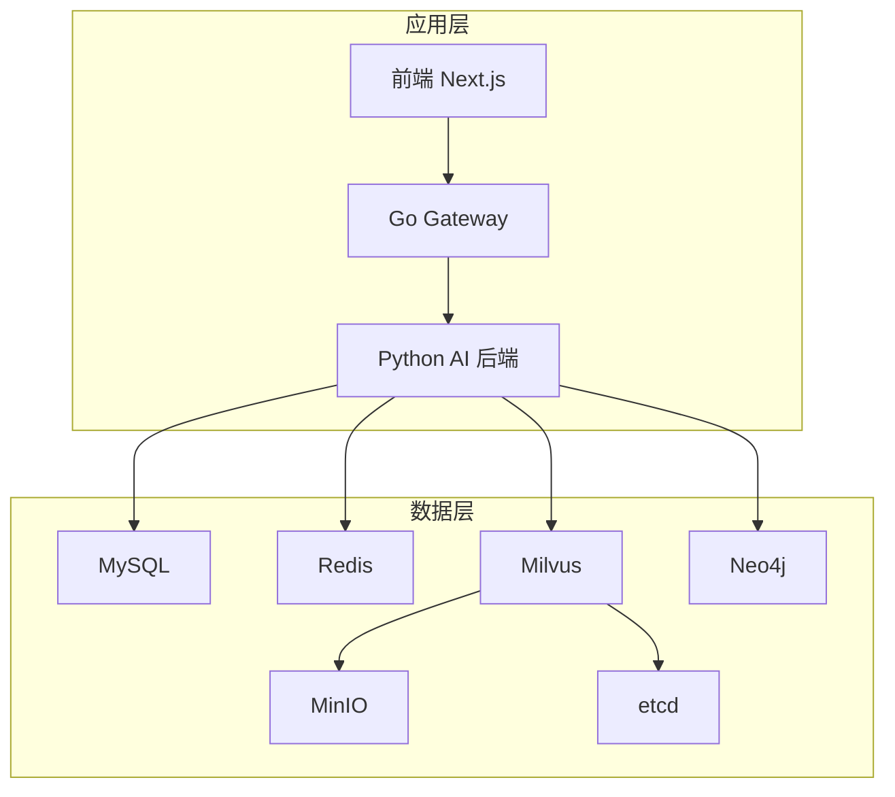
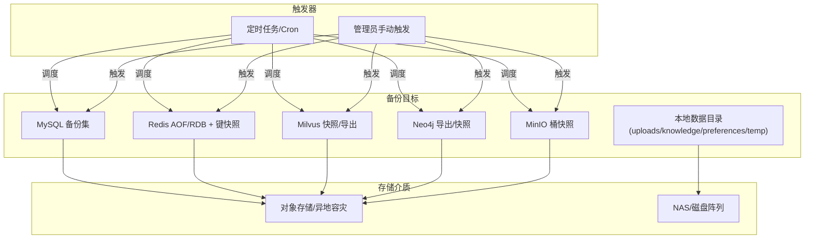
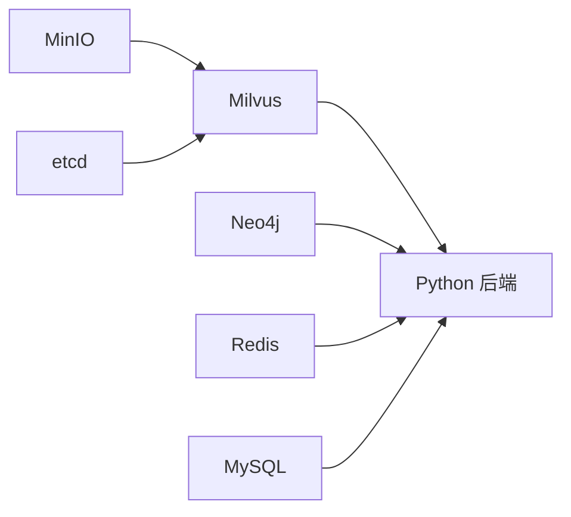
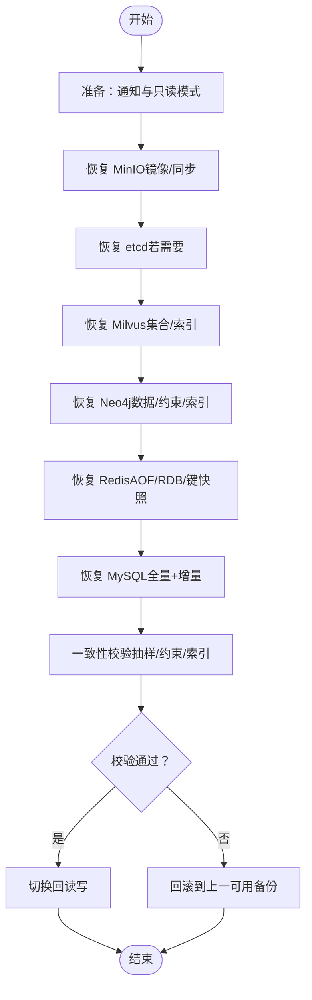

# 备份与灾难恢复

<cite>
**本文引用的文件**   
- [docker-compose.yml](file://docker-compose.yml)
- [database.py](file://backend_design/nexus/config/database.py)
- [cache.py](file://backend_design/nexus/config/cache.py)
- [vector_store.py](file://backend_design/nexus/rag/vector_store.py)
- [graph_store.py](file://backend_design/nexus/rag/graph_store.py)
- [redis_cache.py](file://backend_design/nexus/middleware/redis_cache.py)
- [data.py](file://backend_design/nexus/config/data.py)
- [v2.1_migration.sql](file://backend_design/scripts/v2.1_migration.sql)
- [init_milvus.py](file://backend_design/scripts/init_milvus.py)
- [init_neo4j.py](file://backend_design/scripts/init_neo4j.py)
</cite>

## 目录
1. [简介](#简介)
2. [项目结构与数据源总览](#项目结构与数据源总览)
3. [核心组件与依赖关系](#核心组件与依赖关系)
4. [架构总览](#架构总览)
5. [详细组件分析](#详细组件分析)
6. [依赖关系分析](#依赖关系分析)
7. [性能与容量规划](#性能与容量规划)
8. [故障排查指南](#故障排查指南)
9. [结论](#结论)
10. [附录：操作清单与演练脚本](#附录操作清单与演练脚本)

## 简介
本手册面向 NexusCockpit 的运维与平台团队，提供覆盖 MySQL、Redis、Milvus、Neo4j、MinIO 的数据备份策略、增量与全量实施方案、存储与加密要求、灾难恢复流程、一致性校验与故障切换方案，以及自动化备份脚本的使用方法与恢复演练最佳实践。文档严格基于仓库中的配置与实现进行说明，确保可落地执行。

## 项目结构与数据源总览
NexusCockpit 通过 docker-compose 编排多服务与中间件，关键数据源如下：
- MySQL：用户数据、审计日志、会话与统计等结构化数据持久化
- Redis：语义缓存、限流、会话存储（启用 AOF）
- Milvus：向量库（Food_List、User_Memory），底层对象存储为 MinIO
- Neo4j：知识图谱（约束与索引由初始化脚本创建）
- MinIO：对象存储（Milvus 元数据与持久化）

图表来源
- [docker-compose.yml:1-292](file://docker-compose.yml#L1-L292)

章节来源
- [docker-compose.yml:1-292](file://docker-compose.yml#L1-L292)

## 核心组件与依赖关系
- 数据库连接参数集中管理于配置模块，便于统一导出与迁移
- Milvus 使用 MilvusClient API，集合维度与字段由运行时检查与重建逻辑保障
- Neo4j 通过框架封装自动管理连接池与约束/索引
- Redis 语义缓存支持 KNN 检索与降级扫描模式，具备会话级清理能力
- 数据目录与上传/偏好等路径由 DataConfig 统一管理

章节来源
- [database.py:1-61](file://backend_design/nexus/config/database.py#L1-L61)
- [cache.py:1-41](file://backend_design/nexus/config/cache.py#L1-L41)
- [vector_store.py:1-417](file://backend_design/nexus/rag/vector_store.py#L1-L417)
- [graph_store.py:1-184](file://backend_design/nexus/rag/graph_store.py#L1-L184)
- [redis_cache.py:1-615](file://backend_design/nexus/middleware/redis_cache.py#L1-L615)
- [data.py:1-63](file://backend_design/nexus/config/data.py#L1-L63)

## 架构总览
下图展示备份与恢复在系统中的作用点：各数据源的导出/导入入口、外部存储位置、以及恢复时的顺序与依赖。

[本图为概念性架构图，不直接映射具体代码文件]

## 详细组件分析

### MySQL 备份与恢复
- 数据范围
  - 业务表：cockpits、users、chat_history、chat_logs、chat_sessions、audit_logs、agent_feedback、llm_cost_tracking、voiceprint_enrollments、user_habits、subagent_logs、mainagent_logs 等
  - 字符集与排序规则：utf8mb4 / utf8mb4_unicode_ci
- 备份策略
  - 全量备份：每日一次 mysqldump，包含建库与初始数据
  - 增量备份：开启 binlog，按小时或事件驱动增量归档；结合时间点恢复（PITR）
  - 一致性：对大表建议锁表或使用一致性快照（如 Percona XtraBackup），避免长事务阻塞
- 存储与加密
  - 备份文件落盘后压缩并传输至对象存储（OSS）
  - 建议使用服务端或客户端加密（如 openssl/gpg），密钥由密钥管理服务托管
- 恢复流程
  - 停机或只读模式 → 恢复全量 → 回放增量 binlog 至目标时间点 → 验证表结构与数据完整性 → 切回读写
- 校验要点
  - 校验表数量、行数抽样、外键约束、索引状态
  - 随机抽取用户/会话记录比对关键字段

章节来源
- [v2.1_migration.sql:1-386](file://backend_design/scripts/v2.1_migration.sql#L1-L386)
- [docker-compose.yml:188-209](file://docker-compose.yml#L188-L209)

### Redis 备份与恢复
- 数据范围
  - 语义缓存条目（HASH，前缀 nexus:cache:entry:*），含 user_id、session_id、embedding、timestamp、has_side_effect 等
  - 其他键：限流计数、会话状态等
- 备份策略
  - 全量：AOF 持久化 + 定期 RDB 快照（根据写入负载调整频率）
  - 增量：AOF 追加日志天然支持增量；必要时对热点 key 做键级快照
- 存储与加密
  - 将 AOF/RDB 与键快照压缩后上传至对象存储，启用传输与静态加密
- 恢复流程
  - 停止写请求或切换到只读 → 替换 AOF/RDB → 启动 Redis → 校验索引可用性（FT.*）→ 选择性回填热点键
- 校验要点
  - 检查 FT._LIST 是否返回索引名；抽样查询相似度阈值命中情况；确认 has_side_effect 标记正确

章节来源
- [cache.py:1-41](file://backend_design/nexus/config/cache.py#L1-L41)
- [redis_cache.py:1-615](file://backend_design/nexus/middleware/redis_cache.py#L1-L615)
- [docker-compose.yml:161-187](file://docker-compose.yml#L161-L187)

### Milvus 备份与恢复
- 数据范围
  - 集合：Food_List、User_Memory（含向量与字段）
  - 依赖：etcd（元数据）、MinIO（对象存储）
- 备份策略
  - 全量：利用 Milvus 官方工具导出集合数据（JSON/Parquet）或镜像卷快照
  - 增量：基于时间戳字段（User_Memory.timestamp）增量导出；配合 MinIO 版本控制
- 存储与加密
  - 导出文件与快照均加密后落盘并上传对象存储
- 恢复流程
  - 停机或隔离写流量 → 恢复集合 schema → 导入数据 → 重建索引 → 加载集合 → 健康检查
- 校验要点
  - 集合维度与字段一致性校验；向量相似度检索结果抽样对比；索引可用性与延迟

章节来源
- [vector_store.py:1-417](file://backend_design/nexus/rag/vector_store.py#L1-L417)
- [init_milvus.py:1-54](file://backend_design/nexus/scripts/init_milvus.py#L1-L54)
- [docker-compose.yml:126-146](file://docker-compose.yml#L126-L146)

### Neo4j 备份与恢复
- 数据范围
  - 节点与关系（User、Entity、Food 等），约束与索引（user_id_unique、entity_name_index）
- 备份策略
  - 全量：neo4j-admin dump 或社区版导出 Cypher 脚本
  - 增量：基于变更日志或时间戳字段（如关系 timestamp）增量导出
- 存储与加密
  - 导出文件加密后上传对象存储
- 恢复流程
  - 停止 Neo4j → 恢复数据 → 重建约束与索引 → 启动服务 → 健康检查
- 校验要点
  - 约束与索引存在性；用户画像查询结果一致性；图谱深度遍历路径正确性

章节来源
- [graph_store.py:1-184](file://backend_design/nexus/rag/graph_store.py#L1-L184)
- [init_neo4j.py:1-39](file://backend_design/nexus/scripts/init_neo4j.py#L1-L39)
- [docker-compose.yml:147-160](file://docker-compose.yml#L147-L160)

### MinIO 对象存储备份与恢复
- 数据范围
  - Milvus 持久化数据、用户上传文件、知识库文档等
- 备份策略
  - 全量：mc mirror 同步到远端桶或离线归档
  - 增量：基于版本控制与 mc sync，仅同步新增/变更对象
- 存储与加密
  - 启用服务端加密（SSE-S3/SSE-KMS）与传输加密（TLS）
- 恢复流程
  - 新建或指向目标桶 → 执行镜像/同步 → 校验对象数量与哈希 → 更新 Milvus/应用配置（如需）
- 校验要点
  - 对象总数、大小分布、随机样本内容校验

章节来源
- [docker-compose.yml:111-125](file://docker-compose.yml#L111-L125)

### 本地数据目录备份
- 数据范围
  - uploads、knowledge、preferences、temp 等目录（DataConfig 定义）
- 备份策略
  - 全量：rsync/tar 打包上传
  - 增量：基于文件时间戳增量同步
- 存储与加密
  - 压缩并加密后上传对象存储或 NAS
- 恢复流程
  - 停写 → 覆盖目录 → 重启服务 → 校验文件可读性与权限

章节来源
- [data.py:1-63](file://backend_design/nexus/config/data.py#L1-L63)

## 依赖关系分析
- 应用与服务依赖
  - Python 后端依赖 MySQL、Redis、Milvus、Neo4j
  - Milvus 依赖 etcd 与 MinIO
- 备份依赖链
  - 恢复顺序：MinIO → etcd → Milvus → Neo4j → Redis → MySQL
  - 应用重启应在所有数据源就绪后进行

图表来源
- [docker-compose.yml:94-146](file://docker-compose.yml#L94-L146)

章节来源
- [docker-compose.yml:1-292](file://docker-compose.yml#L1-L292)

## 性能与容量规划
- MySQL
  - 全量备份窗口需评估锁表影响；增量回放需预留 I/O 带宽
- Redis
  - AOF 重写与 RDB 快照会占用 CPU/内存；建议低峰期执行
- Milvus
  - 集合重建与索引构建耗时较长；建议在维护窗口执行
- Neo4j
  - dump/restore 期间服务不可用；大数据集需分批次恢复
- MinIO
  - 镜像/同步受网络带宽限制；建议分桶并行

[本节为通用指导，不直接分析具体文件]

## 故障排查指南
- MySQL
  - 现象：恢复后表结构不一致或索引缺失
  - 处理：重新执行迁移脚本 v2.1_migration.sql；校验约束与索引
- Redis
  - 现象：语义缓存无法检索或命中率异常
  - 处理：检查 FT.* 命令可用性；重建索引；清理旧车控指令缓存
- Milvus
  - 现象：集合维度不匹配导致重建
  - 处理：运行 init_milvus.py --rebuild；确认 embedding 维度一致
- Neo4j
  - 现象：约束/索引缺失导致写入失败
  - 处理：运行 init_neo4j.py 重建约束与索引
- MinIO
  - 现象：对象丢失或版本不一致
  - 处理：mc sync 从备份桶恢复；校验对象哈希

章节来源
- [v2.1_migration.sql:1-386](file://backend_design/scripts/v2.1_migration.sql#L1-L386)
- [redis_cache.py:516-561](file://backend_design/nexus/middleware/redis_cache.py#L516-L561)
- [init_milvus.py:1-54](file://backend_design/nexus/scripts/init_milvus.py#L1-L54)
- [init_neo4j.py:1-39](file://backend_design/nexus/scripts/init_neo4j.py#L1-L39)

## 结论
通过分层备份策略（全量+增量）、严格的存储与加密规范、标准化的恢复流程与一致性校验，NexusCockpit 可在多种故障场景下快速恢复并保持数据一致性。建议将备份与恢复纳入 CI/CD 与演练计划，持续验证 RTO/RPO 指标。

[本节为总结性内容，不直接分析具体文件]

## 附录：操作清单与演练脚本

### 备份策略矩阵
- MySQL
  - 全量：mysqldump 每日一次
  - 增量：binlog 每小时归档
  - 存储：压缩+加密→对象存储
- Redis
  - 全量：RDB 快照+ AOF 文件
  - 增量：AOF 追加日志
  - 存储：压缩+加密→对象存储
- Milvus
  - 全量：集合导出/卷快照
  - 增量：按时间戳字段导出
  - 存储：压缩+加密→对象存储
- Neo4j
  - 全量：dump/导出脚本
  - 增量：基于时间戳导出
  - 存储：压缩+加密→对象存储
- MinIO
  - 全量：mc mirror
  - 增量：mc sync
  - 存储：启用 SSE/TLS

[本节为通用指导，不直接分析具体文件]

### 灾难恢复流程（顺序与要点）

[本图为概念性流程图，不直接映射具体代码文件]

### 自动化备份脚本使用方法
- MySQL
  - 全量：mysqldump 输出到本地并上传对象存储
  - 增量：归档 binlog 并校验完整性
- Redis
  - 触发 SAVE/BGSAVE 生成 RDB；复制 AOF 文件；可选导出热点键
- Milvus
  - 调用集合导出工具或卷快照；校验集合维度与字段
- Neo4j
  - 执行 neo4j-admin dump 或导出脚本；校验约束与索引
- MinIO
  - 使用 mc mirror/sync 同步到备份桶；校验对象数量与哈希
- 本地数据目录
  - rsync/tar 打包上传；校验文件权限与可读性

[本节为通用指导，不直接分析具体文件]

### 恢复演练最佳实践
- 演练环境隔离：使用独立集群或命名空间
- 预置监控与告警：观察恢复时长、错误率、资源占用
- 逐步验证：先恢复只读，再切换读写；逐层校验数据一致性
- 记录与复盘：记录 RTO/RPO、问题与改进项

[本节为通用指导，不直接分析具体文件]