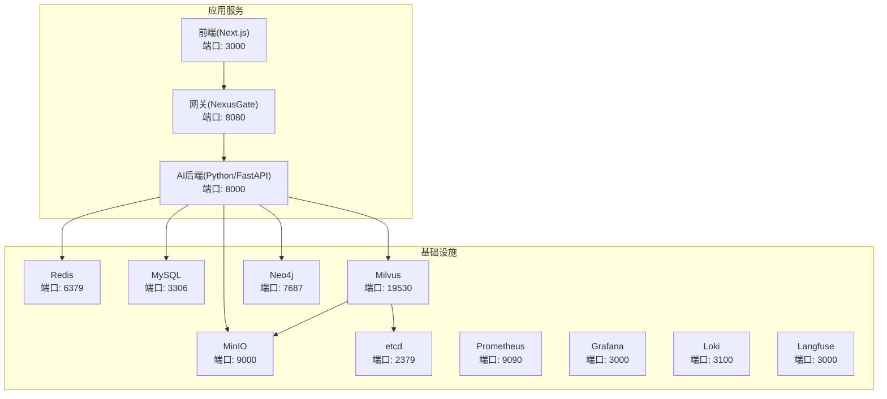
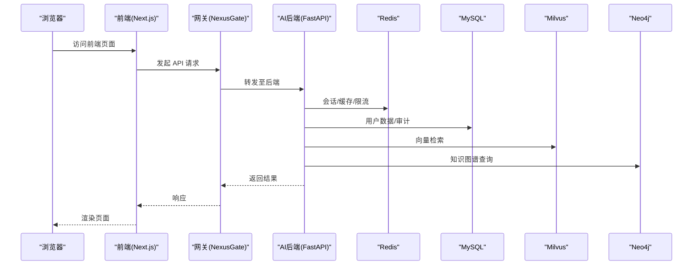
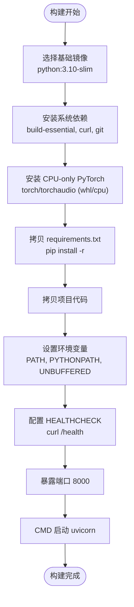
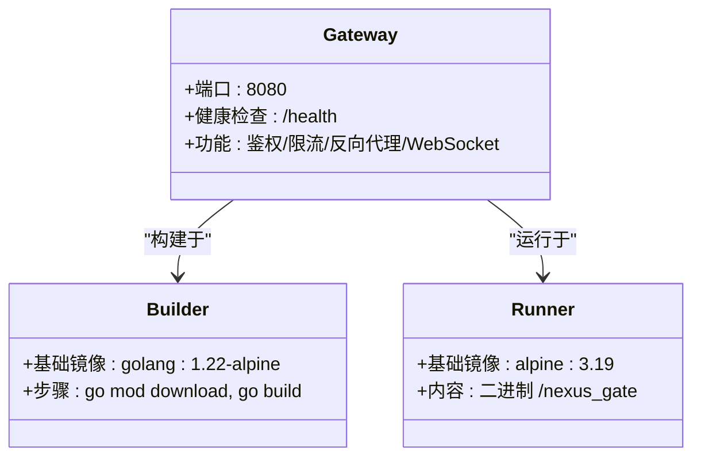
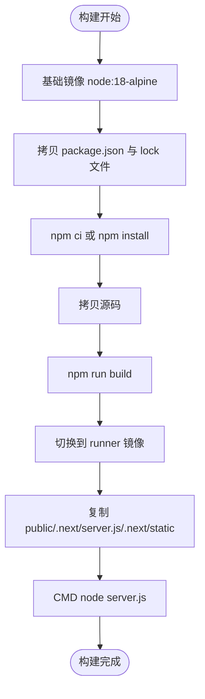
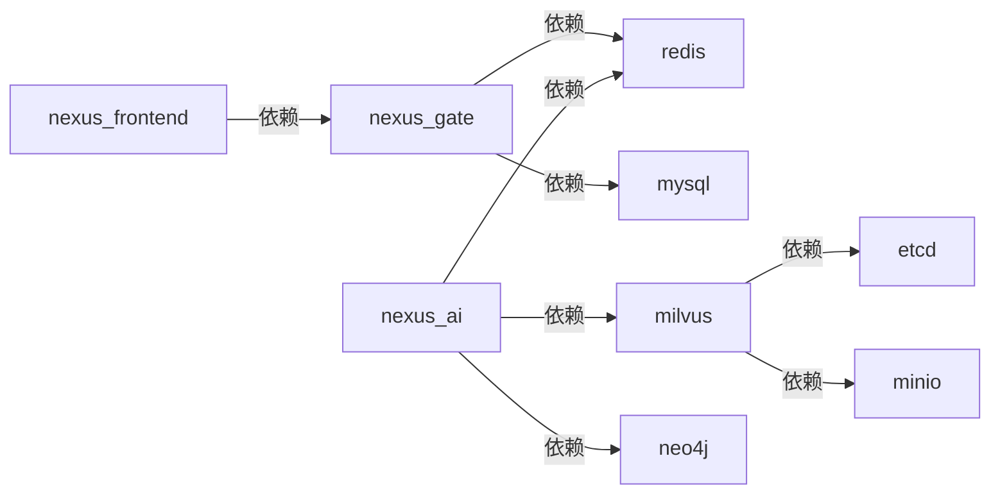
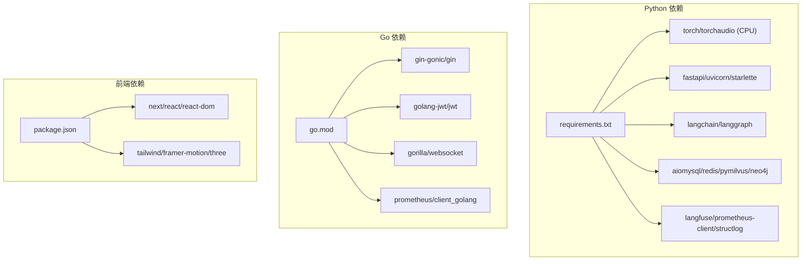
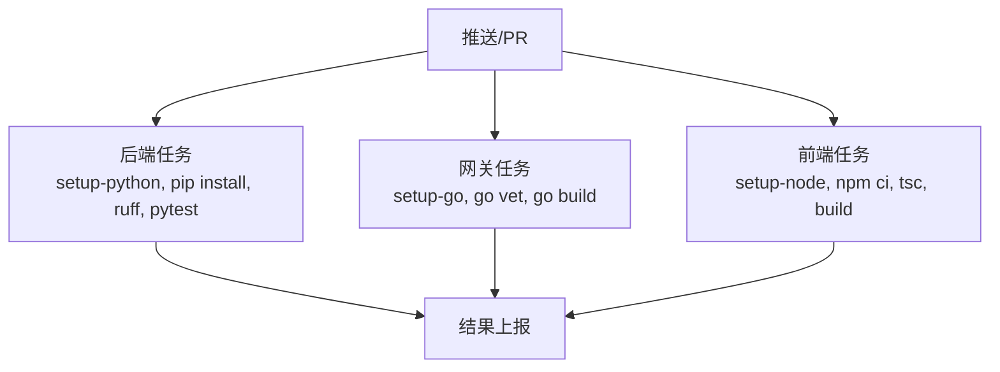

# 容器化部署

<cite>
**本文引用的文件**   
- [backend_design/Dockerfile](file://backend_design/Dockerfile)
- [frontend_design/Dockerfile](file://frontend_design/Dockerfile)
- [backend_design/nexus_gate/Dockerfile](file://backend_design/nexus_gate/Dockerfile)
- [docker-compose.yml](file://docker-compose.yml)
- [docker-compose.dev.yml](file://docker-compose.dev.yml)
- [backend_design/.dockerignore](file://backend_design/.dockerignore)
- [backend_design/requirements.txt](file://backend_design/requirements.txt)
- [frontend_design/package.json](file://frontend_design/package.json)
- [backend_design/nexus_gate/go.mod](file://backend_design/nexus_gate/go.mod)
- [.github/workflows/ci.yml](file://.github/workflows/ci.yml)
- [Makefile](file://Makefile)
</cite>

## 目录
1. [简介](#简介)
2. [项目结构](#项目结构)
3. [核心组件](#核心组件)
4. [架构总览](#架构总览)
5. [详细组件分析](#详细组件分析)
6. [依赖关系分析](#依赖关系分析)
7. [性能与优化](#性能与优化)
8. [故障排查指南](#故障排查指南)
9. [结论](#结论)
10. [附录](#附录)

## 简介
本文件面向 NexusCockpit 的容器化部署，系统阐述 Python、Go、Next.js 三类服务的 Dockerfile 构建策略（多阶段构建、镜像层缓存、安全加固）、镜像体积优化、依赖管理、健康检查与故障恢复、资源限制、CI 流水线以及私有仓库发布流程与版本管理。文档同时给出架构图、数据流图与流程图，帮助读者快速理解并落地生产级容器化方案。

## 项目结构
NexusCockpit 采用“网关 + AI 后端 + 前端”的分层架构：
- Go 网关（nexus_gate）：统一入口、鉴权、限流、反向代理与 WebSocket 转发
- Python AI 后端（nexus）：FastAPI + Uvicorn，提供业务 API、RAG、ASR/TTS、向量检索等能力
- Next.js 前端：静态站点 + Standalone 模式运行，减少运行时依赖

**图示来源** 
- [docker-compose.yml:1-292](file://docker-compose.yml#L1-L292)

**章节来源**
- [docker-compose.yml:1-292](file://docker-compose.yml#L1-L292)

## 核心组件
- Python AI 后端镜像：基于 python:3.10-slim 的多阶段构建，CPU-only PyTorch，分层缓存优化，最小化运行时依赖
- Go 网关镜像：golang:1.22-alpine 编译，alpine:3.19 运行，CGO_ENABLED=0 静态链接，极致瘦身
- Next.js 前端镜像：node:18-alpine 构建，standalone 输出，仅复制必要产物到 runner
- 编排与依赖：docker-compose 统一管理服务、网络、卷、健康检查与启动顺序
- CI 流水线：GitHub Actions 对后端、网关、前端分别执行 lint/test/build

**章节来源**
- [backend_design/Dockerfile:1-58](file://backend_design/Dockerfile#L1-L58)
- [backend_design/nexus_gate/Dockerfile:1-22](file://backend_design/nexus_gate/Dockerfile#L1-L22)
- [frontend_design/Dockerfile:1-32](file://frontend_design/Dockerfile#L1-L32)
- [docker-compose.yml:1-292](file://docker-compose.yml#L1-L292)
- [.github/workflows/ci.yml:1-72](file://.github/workflows/ci.yml#L1-L72)

## 架构总览
下图展示请求从浏览器到各服务的调用链，以及关键中间件的健康检查与依赖关系。

**图示来源** 
- [docker-compose.yml:1-292](file://docker-compose.yml#L1-L292)

## 详细组件分析

### Python AI 后端（FastAPI/Uvicorn）
- 多阶段构建：builder 安装 CPU-only PyTorch 与 Python 依赖；runner 仅包含运行时库与代码
- 镜像层缓存：先拷贝 requirements.txt 再安装依赖，最大化利用 Docker 层缓存
- 安全加固：使用 slim/alpine 基础镜像，清理 apt 缓存，最小权限运行，禁用不必要的二进制
- 健康检查：内置 HEALTHCHECK 探测 /health 端点
- 环境变量：PATH/PYTHONPATH/PYTHONUNBUFFERED 等确保可观测性与稳定性

**图示来源** 
- [backend_design/Dockerfile:1-58](file://backend_design/Dockerfile#L1-L58)

**章节来源**
- [backend_design/Dockerfile:1-58](file://backend_design/Dockerfile#L1-L58)
- [backend_design/requirements.txt:1-105](file://backend_design/requirements.txt#L1-L105)
- [backend_design/.dockerignore:1-49](file://backend_design/.dockerignore#L1-L49)

### Go 网关（NexusGate）
- 多阶段构建：golang:1.22-alpine 编译，alpine:3.19 运行
- 静态链接：CGO_ENABLED=0 GOOS=linux 生成纯 Linux 二进制，避免动态库缺失
- 依赖缓存：先拷贝 go.mod 下载依赖，再拷贝源码构建
- 最小镜像：仅保留 ca-certificates 与 wget，减小攻击面

**图示来源** 
- [backend_design/nexus_gate/Dockerfile:1-22](file://backend_design/nexus_gate/Dockerfile#L1-L22)
- [backend_design/nexus_gate/go.mod:1-44](file://backend_design/nexus_gate/go.mod#L1-L44)

**章节来源**
- [backend_design/nexus_gate/Dockerfile:1-22](file://backend_design/nexus_gate/Dockerfile#L1-L22)
- [backend_design/nexus_gate/go.mod:1-44](file://backend_design/nexus_gate/go.mod#L1-L44)

### Next.js 前端
- 多阶段构建：node:18-alpine 构建，standalone 输出，runner 仅复制 public、server.js、.next/static
- 依赖缓存：优先使用 package-lock.json 进行 npm ci
- 运行环境：NODE_ENV=production，最小化 Node 运行时

**图示来源** 
- [frontend_design/Dockerfile:1-32](file://frontend_design/Dockerfile#L1-L32)
- [frontend_design/package.json:1-43](file://frontend_design/package.json#L1-L43)

**章节来源**
- [frontend_design/Dockerfile:1-32](file://frontend_design/Dockerfile#L1-L32)
- [frontend_design/package.json:1-43](file://frontend_design/package.json#L1-L43)

### 编排与服务依赖（docker-compose）
- 服务分组：app profile 启动应用服务；默认启动基础设施
- 健康检查：每个关键服务均定义 healthcheck，保障启动顺序与可用性
- 数据持久化：通过 volumes 挂载 Redis、MySQL、Milvus、Neo4j、MinIO、Langfuse 等数据
- 开发覆盖：docker-compose.dev.yml 暴露调试端口与挂载日志/文档目录

**图示来源** 
- [docker-compose.yml:1-292](file://docker-compose.yml#L1-L292)

**章节来源**
- [docker-compose.yml:1-292](file://docker-compose.yml#L1-L292)
- [docker-compose.dev.yml:1-63](file://docker-compose.dev.yml#L1-L63)

## 依赖关系分析
- Python 依赖：requirements.txt 明确 Web、LLM/RAG、数据库、音频、可观测性等模块；PyTorch 单独安装以控制体积
- Go 依赖：go.mod 声明 gin、jwt、websocket、prometheus 客户端等
- 前端依赖：package.json 锁定 next/react/axios 等核心库与开发工具

**图示来源** 
- [backend_design/requirements.txt:1-105](file://backend_design/requirements.txt#L1-L105)
- [backend_design/nexus_gate/go.mod:1-44](file://backend_design/nexus_gate/go.mod#L1-L44)
- [frontend_design/package.json:1-43](file://frontend_design/package.json#L1-L43)

**章节来源**
- [backend_design/requirements.txt:1-105](file://backend_design/requirements.txt#L1-L105)
- [backend_design/nexus_gate/go.mod:1-44](file://backend_design/nexus_gate/go.mod#L1-L44)
- [frontend_design/package.json:1-43](file://frontend_design/package.json#L1-L43)

## 性能与优化
- 多阶段构建：分离构建与运行环境，显著降低镜像体积与攻击面
- 分层缓存策略：
  - Python：先拷贝 requirements.txt 再安装依赖，变更代码不影响依赖层
  - Go：先拷贝 go.mod 下载依赖，再拷贝源码构建
  - Next.js：先拷贝 package*.json 再安装依赖，最后拷贝源码构建
- 镜像瘦身：
  - Python：使用 slim 基础镜像，CPU-only PyTorch，清理 apt 缓存，仅保留运行时库
  - Go：CGO_ENABLED=0 静态链接，alpine 运行镜像仅含证书与 wget
  - Next.js：standalone 输出，仅复制必要产物
- 依赖管理：
  - Python：固定版本与索引源，避免不稳定依赖引入
  - Go：go.sum 锁定依赖，CI 缓存 go.sum 加速构建
  - 前端：package-lock.json 保证一致构建
- 安全扫描建议：
  - 在 CI 中集成 Trivy/Grype/Snyk 扫描镜像漏洞
  - 使用非 root 用户运行容器（可在 Dockerfile 中添加 USER）
  - 定期更新基础镜像与依赖版本
- 资源限制（建议在编排层配置）：
  - 为每个服务设置 CPU/Memory 上限与重启策略
  - 针对高负载服务（如 Milvus、Neo4j）预留足够内存与磁盘空间
- 健康检查与故障恢复：
  - 所有服务定义 healthcheck，compose 根据条件启动依赖
  - 设置 restart=unless-stopped 或 on-failure，提升自愈能力

[本节为通用指导，不直接分析具体文件]

## 故障排查指南
- 常见问题定位：
  - 启动失败：查看 compose logs，确认依赖服务健康状态
  - 端口冲突：Windows Hyper-V 保留端口已避让（如 16379/13306/17687），必要时调整映射
  - 模型/数据未挂载：确认 volume 映射路径正确
  - 健康检查失败：检查 /health 端点与网络连通性
- 调试增强：
  - 使用 docker-compose.dev.yml 暴露调试端口（Milvus metrics、Neo4j Browser、MinIO Console、Langfuse、Loki、Prometheus、Grafana）
  - 挂载 docs/logs 目录便于实时查看日志与文档
- 命令参考：
  - 启动基础设施：make docker-up
  - 停止并清理：make docker-down / make docker-clean
  - 查看日志：make docker-logs

**章节来源**
- [docker-compose.yml:1-292](file://docker-compose.yml#L1-L292)
- [docker-compose.dev.yml:1-63](file://docker-compose.dev.yml#L1-L63)
- [Makefile:94-107](file://Makefile#L94-L107)

## 结论
NexusCockpit 的容器化方案通过多阶段构建、分层缓存与安全加固，实现了 Python、Go、Next.js 三类应用的标准化镜像构建与高效部署。结合 docker-compose 的统一编排与健康检查，以及 CI 流水线的质量门禁，能够稳定支撑开发与生产环境。建议在生产环境中进一步落实镜像安全扫描、资源限制与版本治理，以提升整体可靠性与可维护性。

[本节为总结性内容，不直接分析具体文件]

## 附录

### CI 流水线概览
- 后端：Python 3.10，安装轻量依赖，执行 ruff 检查与 pytest 测试
- 网关：Go 1.22，执行 vet 与构建
- 前端：Node 20，安装依赖、类型检查与构建

**图示来源** 
- [.github/workflows/ci.yml:1-72](file://.github/workflows/ci.yml#L1-L72)

**章节来源**
- [.github/workflows/ci.yml:1-72](file://.github/workflows/ci.yml#L1-L72)

### 镜像发布与版本管理建议
- 镜像命名规范：按服务名+语义化版本号（如 nexus-ai:2.2.0、nexus-gate:2.1.0、nexus-frontend:2.1.0）
- 私有仓库：使用 Harbor/阿里云/腾讯云等私有镜像仓库，开启访问控制与扫描策略
- 构建触发：
  - 主干分支合并后自动构建 latest 与对应 tag
  - Tag 推送触发精确版本镜像构建
- 版本回滚：通过镜像 tag 快速切换，配合编排文件的 image 标签管理
- 依赖升级：
  - Python：定期更新 requirements.txt 与基础镜像
  - Go：go get 更新依赖并校验 go.sum
  - 前端：npm audit 修复漏洞，锁定版本避免漂移

[本节为通用指导，不直接分析具体文件]