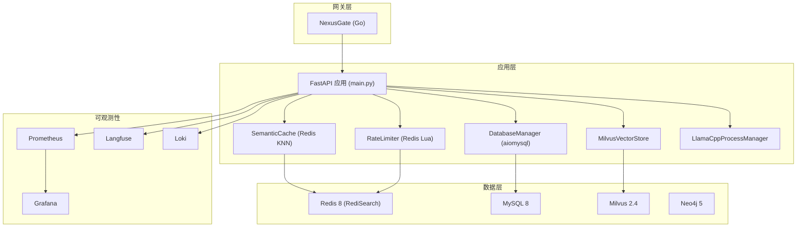
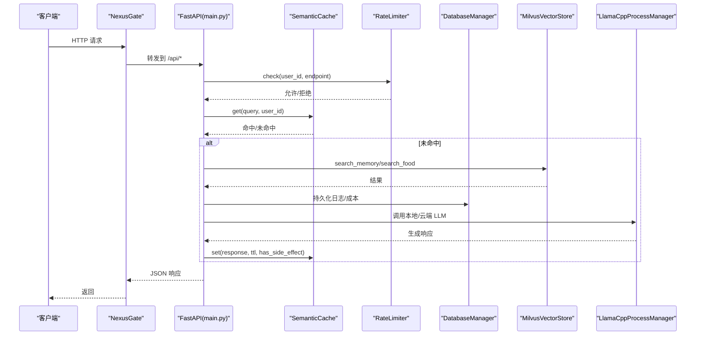
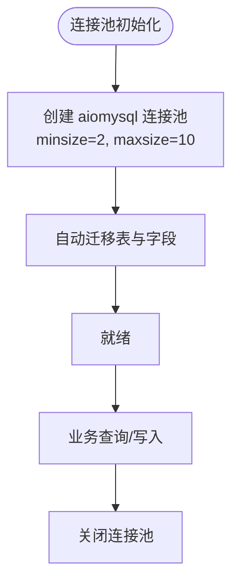
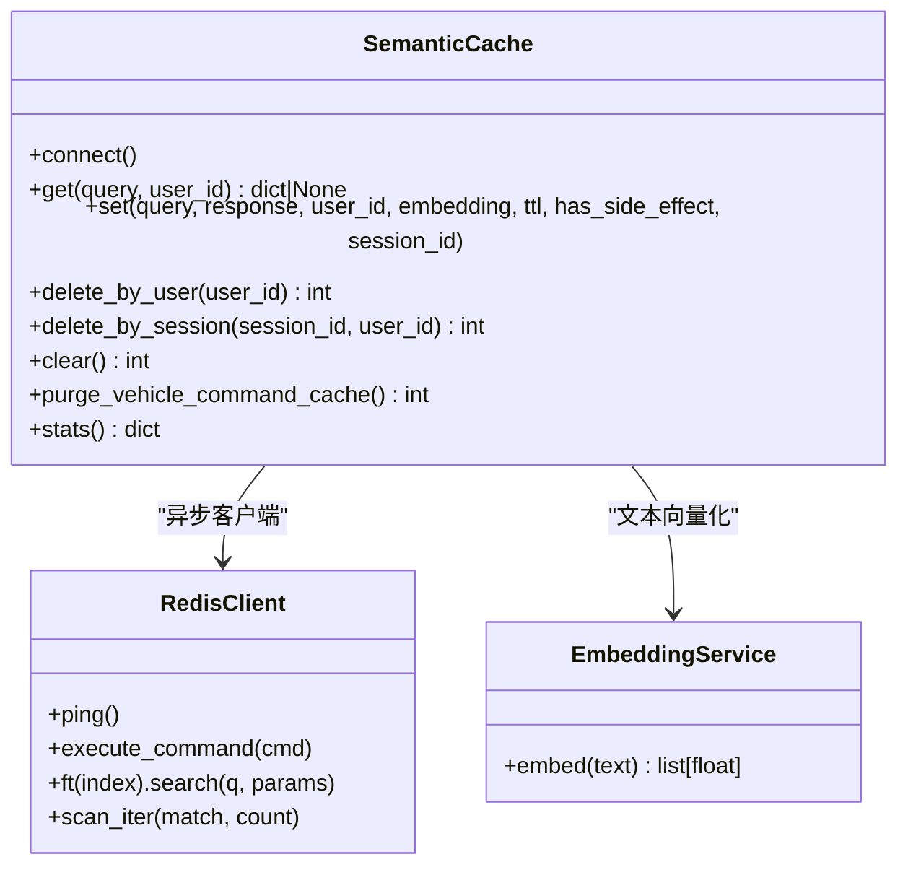
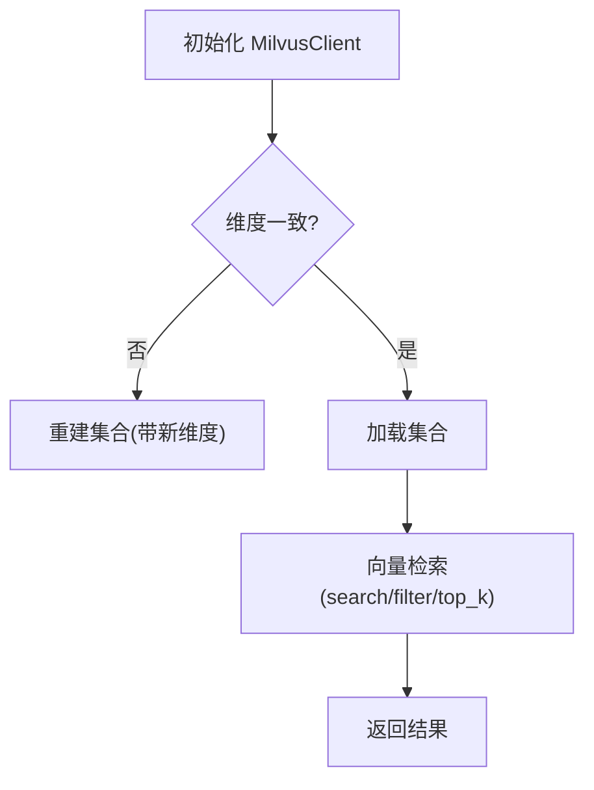
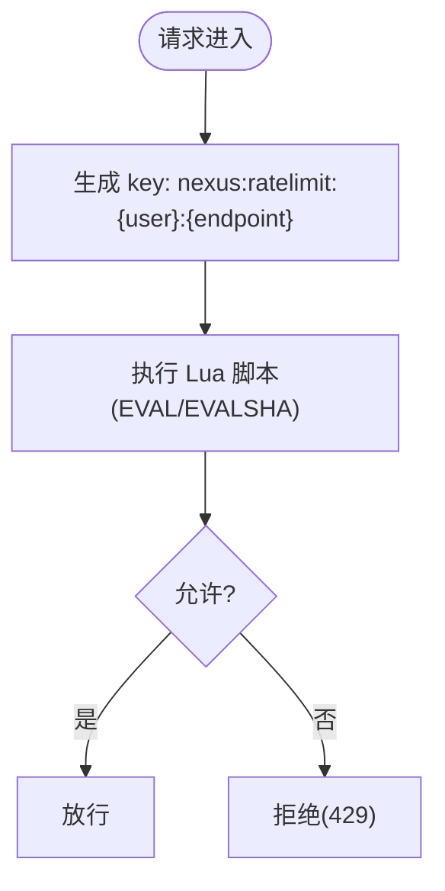
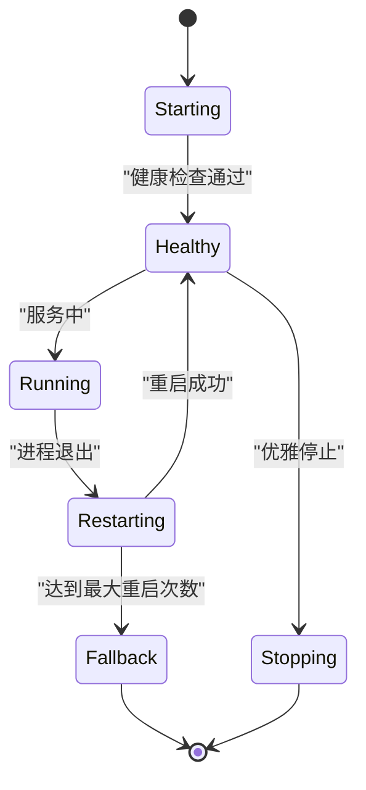
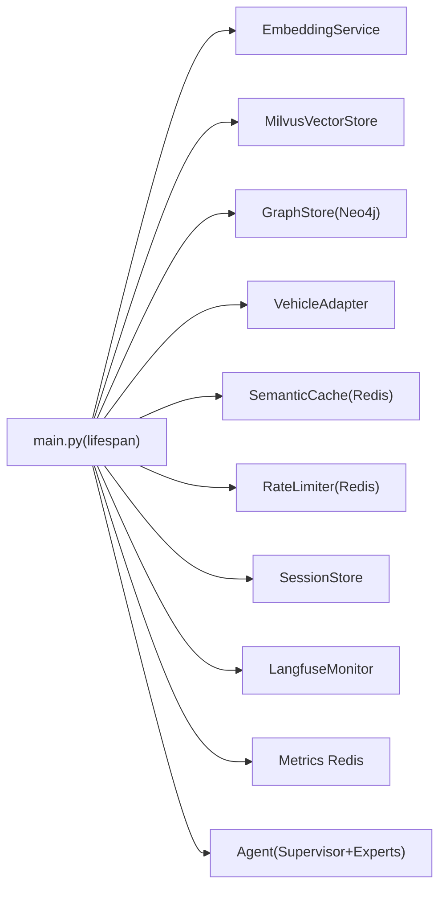

# 性能调优指南

<cite>
**本文引用的文件**   
- [backend_design/nexus/config/database.py](file://backend_design/nexus/config/database.py)
- [backend_design/nexus/config/cache.py](file://backend_design/nexus/config/cache.py)
- [backend_design/nexus/middleware/redis_cache.py](file://backend_design/nexus/middleware/redis_cache.py)
- [backend_design/nexus/core/db_manager.py](file://backend_design/nexus/core/db_manager.py)
- [backend_design/nexus/rag/vector_store.py](file://backend_design/nexus/rag/vector_store.py)
- [backend_design/nexus/config/server.py](file://backend_design/nexus/config/server.py)
- [backend_design/nexus/core/llama_cpp_manager.py](file://backend_design/nexus/core/llama_cpp_manager.py)
- [backend_design/nexus/middleware/rate_limiter.py](file://backend_design/nexus/middleware/rate_limiter.py)
- [backend_design/nexus/observability/metrics.py](file://backend_design/nexus/observability/metrics.py)
- [backend_design/nexus/main.py](file://backend_design/nexus/main.py)
- [backend_design/nexus/config/observability.py](file://backend_design/nexus/config/observability.py)
- [backend_design/nexus/core/circuit_breaker.py](file://backend_design/nexus/core/circuit_breaker.py)
- [docker-compose.yml](file://docker-compose.yml)
- [config/prometheus/prometheus.yml](file://config/prometheus/prometheus.yml)
</cite>

## 目录
1. [简介](#简介)
2. [项目结构](#项目结构)
3. [核心组件](#核心组件)
4. [架构总览](#架构总览)
5. [详细组件分析](#详细组件分析)
6. [依赖关系分析](#依赖关系分析)
7. [性能考虑与优化策略](#性能考虑与优化策略)
8. [故障排查指南](#故障排查指南)
9. [结论](#结论)
10. [附录：基准测试与容量规划](#附录：基准测试与容量规划)

## 简介
本指南面向生产环境的 NexusCockpit 性能调优，覆盖数据库连接池、Redis 语义缓存与限流、向量检索（Milvus）、本地 LLM（llama.cpp）进程管理、负载均衡与水平扩展、弹性伸缩、内存/CPU/I/O 调优、压测与基准、以及监控指标与关键参数。文档基于仓库源码与配置进行深度解析，并提供可视化架构图与流程图，帮助读者快速定位瓶颈并落地优化。

## 项目结构
NexusCockpit 采用“Go 网关 + Python AI 后端 + TS 前端”的容器化部署，基础设施包含 Redis、MySQL、Milvus、Neo4j、Prometheus、Grafana、Loki、Langfuse 等。Python 后端通过 FastAPI 暴露 API，启动时初始化 Embedding、向量库、图数据库、Redis 语义缓存、限流器、会话存储、Agent 工作流等；Go 网关负责鉴权、路由、限流与反向代理。

**图表来源** 
- [docker-compose.yml:15-90](file://docker-compose.yml#L15-L90)
- [config/prometheus/prometheus.yml:1-35](file://config/prometheus/prometheus.yml#L1-L35)

**章节来源**
- [docker-compose.yml:15-90](file://docker-compose.yml#L15-L90)
- [config/prometheus/prometheus.yml:1-35](file://config/prometheus/prometheus.yml#L1-L35)

## 核心组件
- 数据库连接池：使用 aiomysql.create_pool 管理 MySQL 连接，默认 minsize=2, maxsize=10，支持自动建表与迁移。
- Redis 语义缓存：基于 RediSearch VECTOR 索引实现 O(log n) 相似度检索，按 user_id 分片，TTL 分级，车控指令禁止缓存。
- 向量检索：Milvus 双集合（Food_List、User_Memory），HNSW/Trie 索引，支持用户级过滤与会话级清理。
- 限流器：Redis Lua 滑动窗口与令牌桶，原子操作保证分布式安全。
- 本地 LLM：llama.cpp 子进程管理，健康检查、崩溃重启、GPU/CPU 自动检测与高性能参数。
- 可观测性：Prometheus 指标采集（请求、延迟、Agent、RAG、LLM、缓存），Grafana/Loki/Langfuse 集成。

**章节来源**
- [backend_design/nexus/core/db_manager.py:56-85](file://backend_design/nexus/core/db_manager.py#L56-L85)
- [backend_design/nexus/middleware/redis_cache.py:57-127](file://backend_design/nexus/middleware/redis_cache.py#L57-L127)
- [backend_design/nexus/rag/vector_store.py:36-58](file://backend_design/nexus/rag/vector_store.py#L36-L58)
- [backend_design/nexus/middleware/rate_limiter.py:117-155](file://backend_design/nexus/middleware/rate_limiter.py#L117-L155)
- [backend_design/nexus/core/llama_cpp_manager.py:40-80](file://backend_design/nexus/core/llama_cpp_manager.py#L40-L80)
- [backend_design/nexus/observability/metrics.py:14-108](file://backend_design/nexus/observability/metrics.py#L14-L108)

## 架构总览
系统启动流程（main.py lifespan）依次初始化 Embedding、向量库、图数据库、车控适配器、Redis 语义缓存、限流器、会话存储、Langfuse 追踪、指标 Redis、Agent 工作流。启动时清理旧的车控指令缓存条目，确保安全性。

**图表来源** 
- [backend_design/nexus/main.py:75-200](file://backend_design/nexus/main.py#L75-L200)
- [backend_design/nexus/middleware/redis_cache.py:213-234](file://backend_design/nexus/middleware/redis_cache.py#L213-L234)
- [backend_design/nexus/middleware/rate_limiter.py:156-203](file://backend_design/nexus/middleware/rate_limiter.py#L156-L203)
- [backend_design/nexus/rag/vector_store.py:201-231](file://backend_design/nexus/rag/vector_store.py#L201-L231)
- [backend_design/nexus/core/llama_cpp_manager.py:88-158](file://backend_design/nexus/core/llama_cpp_manager.py#L88-L158)

## 详细组件分析

### 数据库连接池（MySQL）
- 连接池创建：aiomysql.create_pool(minsize=2, maxsize=10)，autocommit=True，避免频繁创建销毁连接。
- 自动迁移：启动时执行 IF NOT EXISTS 建表与字段补齐，插入默认座舱与用户数据。
- 性能要点：
  - 根据并发调整 maxsize，观察连接等待与超时。
  - 合理设置 autocommit，批量写入时可关闭以提升吞吐。
  - 关注慢查询与索引命中，chat_history/chat_logs 等高频表需完善索引。

**图表来源** 
- [backend_design/nexus/core/db_manager.py:56-85](file://backend_design/nexus/core/db_manager.py#L56-L85)
- [backend_design/nexus/core/db_manager.py:86-158](file://backend_design/nexus/core/db_manager.py#L86-L158)

**章节来源**
- [backend_design/nexus/core/db_manager.py:56-85](file://backend_design/nexus/core/db_manager.py#L56-L85)
- [backend_design/nexus/core/db_manager.py:86-158](file://backend_design/nexus/core/db_manager.py#L86-L158)

### Redis 语义缓存（RediSearch KNN）
- 索引模式：VECTOR FLAT/HNSW + TAG(user_id/session_id) + Numeric(timestamp)。
- 查询路径：KNN 优先（O(log n)），失败回退 scan 遍历（O(n)）。
- 安全设计：has_side_effect=True 的响应永不写入缓存，避免车控指令被缓存后不执行。
- TTL 分级：闲聊 1h、知识库 24h，支持会话级清理。

**图表来源** 
- [backend_design/nexus/middleware/redis_cache.py:57-127](file://backend_design/nexus/middleware/redis_cache.py#L57-L127)
- [backend_design/nexus/middleware/redis_cache.py:213-234](file://backend_design/nexus/middleware/redis_cache.py#L213-L234)
- [backend_design/nexus/middleware/redis_cache.py:367-436](file://backend_design/nexus/middleware/redis_cache.py#L367-L436)

**章节来源**
- [backend_design/nexus/middleware/redis_cache.py:57-127](file://backend_design/nexus/middleware/redis_cache.py#L57-L127)
- [backend_design/nexus/middleware/redis_cache.py:213-234](file://backend_design/nexus/middleware/redis_cache.py#L213-L234)
- [backend_design/nexus/middleware/redis_cache.py:367-436](file://backend_design/nexus/middleware/redis_cache.py#L367-L436)

### 向量检索（Milvus）
- 集合：Food_List（食材知识）、User_Memory（用户记忆，含 user_id/session_id 过滤）。
- 索引：HNSW(vector) + Trie(user_id/session_id)，搜索参数可调。
- 维度一致性：启动时校验集合维度，不匹配则重建集合。

**图表来源** 
- [backend_design/nexus/rag/vector_store.py:36-58](file://backend_design/nexus/rag/vector_store.py#L36-L58)
- [backend_design/nexus/rag/vector_store.py:106-146](file://backend_design/nexus/rag/vector_store.py#L106-L146)
- [backend_design/nexus/rag/vector_store.py:201-231](file://backend_design/nexus/rag/vector_store.py#L201-L231)

**章节来源**
- [backend_design/nexus/rag/vector_store.py:36-58](file://backend_design/nexus/rag/vector_store.py#L36-L58)
- [backend_design/nexus/rag/vector_store.py:106-146](file://backend_design/nexus/rag/vector_store.py#L106-L146)
- [backend_design/nexus/rag/vector_store.py:201-231](file://backend_design/nexus/rag/vector_store.py#L201-L231)

### 限流器（Redis Lua 滑动窗口/令牌桶）
- 滑动窗口：ZREMRANGEBYSCORE + ZCARD + ZADD 原子操作，超限不污染计数。
- 令牌桶：支持突发流量与平均速率控制，适合 LLM API 调用。
- 降级策略：Redis 不可用时放行，避免雪崩。

**图表来源** 
- [backend_design/nexus/middleware/rate_limiter.py:117-155](file://backend_design/nexus/middleware/rate_limiter.py#L117-L155)
- [backend_design/nexus/middleware/rate_limiter.py:156-203](file://backend_design/nexus/middleware/rate_limiter.py#L156-L203)

**章节来源**
- [backend_design/nexus/middleware/rate_limiter.py:117-155](file://backend_design/nexus/middleware/rate_limiter.py#L117-L155)
- [backend_design/nexus/middleware/rate_limiter.py:156-203](file://backend_design/nexus/middleware/rate_limiter.py#L156-L203)

### 本地 LLM（llama.cpp 进程管理）
- 生命周期：启动子进程、健康检查、崩溃自动重启、优雅停止（SIGTERM→SIGKILL）。
- 参数：ctx-size、threads、gpu-layers、parallel、cont-batching。
- 降级：最大重启次数后回退云端 LLM。

**图表来源** 
- [backend_design/nexus/core/llama_cpp_manager.py:88-158](file://backend_design/nexus/core/llama_cpp_manager.py#L88-L158)
- [backend_design/nexus/core/llama_cpp_manager.py:173-196](file://backend_design/nexus/core/llama_cpp_manager.py#L173-L196)

**章节来源**
- [backend_design/nexus/core/llama_cpp_manager.py:88-158](file://backend_design/nexus/core/llama_cpp_manager.py#L88-L158)
- [backend_design/nexus/core/llama_cpp_manager.py:173-196](file://backend_design/nexus/core/llama_cpp_manager.py#L173-L196)

### 可观测性与指标
- Prometheus 指标：请求总量/延迟、Agent 调用/延迟、RAG 检索/延迟、LLM 调用/延迟、缓存命中/未命中、活跃连接数。
- 采集配置：prometheus.yml 抓取 nexus-ai、nexus-gate、milvus、prometheus 自身。
- Langfuse：本地自托管 LLM 追踪平台，提供 public_key/secret_key 启用。

**章节来源**
- [backend_design/nexus/observability/metrics.py:14-108](file://backend_design/nexus/observability/metrics.py#L14-L108)
- [config/prometheus/prometheus.yml:1-35](file://config/prometheus/prometheus.yml#L1-L35)
- [backend_design/nexus/config/observability.py:15-33](file://backend_design/nexus/config/observability.py#L15-L33)

## 依赖关系分析
- main.py 在 lifespan 中顺序初始化各组件，形成强依赖链：Embedding → VectorStore → GraphStore → VehicleAdapter → SemanticCache → RateLimiter → SessionStore → Langfuse → Metrics Redis → Agent。
- 中间件与组件均通过配置模块集中管理，便于环境切换与参数调优。

**图表来源** 
- [backend_design/nexus/main.py:75-200](file://backend_design/nexus/main.py#L75-L200)

**章节来源**
- [backend_design/nexus/main.py:75-200](file://backend_design/nexus/main.py#L75-L200)

## 性能考虑与优化策略

### 数据库连接池与 I/O
- 连接池大小：根据并发 QPS 与平均延迟估算 maxsize，避免连接饥饿或过多上下文切换。
- 事务与批处理：关闭 autocommit 进行批量写入，减少网络往返。
- 索引优化：对高频查询列建立复合索引，避免全表扫描。
- 慢查询治理：定期导出慢查询日志，结合 EXPLAIN 分析执行计划。

**章节来源**
- [backend_design/nexus/core/db_manager.py:56-85](file://backend_design/nexus/core/db_manager.py#L56-L85)

### Redis 缓存与限流
- 语义缓存阈值：cache_similarity_threshold 影响命中率与准确性，建议 0.90–0.95 区间调优。
- TTL 分级：按场景设置不同 TTL，降低内存占用。
- 限流策略：滑动窗口用于稳定限流，令牌桶用于突发容忍；根据业务峰值调整 capacity/rate。
- Redis 内存：maxmemory 与淘汰策略（allkeys-lru）保障稳定性；io-threads 提升 I/O 吞吐。

**章节来源**
- [backend_design/nexus/config/cache.py:15-41](file://backend_design/nexus/config/cache.py#L15-L41)
- [backend_design/nexus/middleware/redis_cache.py:213-234](file://backend_design/nexus/middleware/redis_cache.py#L213-L234)
- [backend_design/nexus/middleware/rate_limiter.py:117-155](file://backend_design/nexus/middleware/rate_limiter.py#L117-L155)
- [docker-compose.yml:166-186](file://docker-compose.yml#L166-L186)

### 向量检索优化
- 索引类型：HNSW 适合高维近似最近邻，M/efConstruction 与 ef 平衡召回与延迟。
- 维度一致性：启动时校验并重建集合，避免维度不匹配导致错误。
- 过滤条件：user_id/session_id 前置过滤减少候选集。
- 批量写入：insert_memory 批量入库减少 RPC 开销。

**章节来源**
- [backend_design/nexus/config/database.py:15-28](file://backend_design/nexus/config/database.py#L15-L28)
- [backend_design/nexus/rag/vector_store.py:106-146](file://backend_design/nexus/rag/vector_store.py#L106-L146)
- [backend_design/nexus/rag/vector_store.py:233-262](file://backend_design/nexus/rag/vector_store.py#L233-L262)

### 本地 LLM 与 CPU/GPU
- 线程与上下文：threads 与 ctx-size 影响吞吐与显存占用，按需调整。
- GPU 加速：gpu-layers > 0 启用 GPU 层，显著降低延迟。
- 批处理：parallel 与 cont-batching 提升并发处理能力。
- 健康检查：启动时轮询 /health，失败则回退云端 LLM。

**章节来源**
- [backend_design/nexus/core/llama_cpp_manager.py:88-158](file://backend_design/nexus/core/llama_cpp_manager.py#L88-L158)

### 负载均衡与水平扩展
- Go 网关：NexusGate 作为统一入口，支持多实例横向扩展，配合外部 LB（如 Nginx/K8s Ingress）。
- Python 后端：无状态服务，可通过容器编排（K8s Deployment）水平扩展，共享 Redis/Milvus/MySQL。
- 会话与缓存：Redis 作为共享状态，确保多实例一致性。

**章节来源**
- [docker-compose.yml:15-40](file://docker-compose.yml#L15-L40)

### 弹性伸缩策略
- 指标驱动：基于 Prometheus 指标（QPS、延迟、CPU、内存）触发 HPA。
- 预热与冷启动：预加载模型与索引，缩短冷启动时间。
- 熔断与降级：circuit_breaker 保护下游依赖，失败时快速失败或降级。

**章节来源**
- [backend_design/nexus/core/circuit_breaker.py:48-96](file://backend_design/nexus/core/circuit_breaker.py#L48-96)

### 内存管理与 I/O 调优
- Redis：maxmemory 与淘汰策略，避免 OOM；io-threads 提升读写吞吐。
- Python：减少大对象分配，合理使用生成器与异步 I/O。
- 磁盘 I/O：Milvus/Neo4j/MySQL 数据盘使用 SSD，合理分区与挂载选项。

**章节来源**
- [docker-compose.yml:166-186](file://docker-compose.yml#L166-L186)

## 故障排查指南
- 连接失败：检查 Redis/MySQL/Milvus/Neo4j 健康检查与端口映射。
- 缓存异常：确认 FT.* 命令可用性（Redis 8 内置），否则回退 scan 模式。
- 限流误拒：查看 Lua 脚本执行日志，确认 key 命名与窗口参数。
- LLM 不可用：检查 llama-server 二进制与模型路径，健康检查失败则回退云端。
- 指标缺失：确认 prometheus.yml 抓取目标与 /metrics 端点可达。

**章节来源**
- [backend_design/nexus/middleware/redis_cache.py:129-162](file://backend_design/nexus/middleware/redis_cache.py#L129-L162)
- [backend_design/nexus/core/llama_cpp_manager.py:160-171](file://backend_design/nexus/core/llama_cpp_manager.py#L160-L171)
- [config/prometheus/prometheus.yml:1-35](file://config/prometheus/prometheus.yml#L1-L35)

## 结论
NexusCockpit 的性能调优应围绕“连接池、缓存、向量检索、限流、LLM 进程、可观测性”六大维度展开。通过合理的参数配置、索引优化、资源隔离与弹性伸缩，可在保证稳定性的同时显著提升吞吐与响应速度。建议在生产环境持续监控关键指标，结合压测与容量规划，动态调整参数以适配业务增长。

## 附录：基准测试与容量规划
- 压测工具：使用 wrk/jmeter 对 /api/chat 等接口进行并发压测，观察 QPS、P95/P99 延迟与错误率。
- 基准指标：记录 Redis 命中率、Milvus 检索延迟、LLM 生成延迟、MySQL 慢查询数量。
- 容量规划：根据峰值 QPS 与平均延迟估算连接池大小、Redis 内存、Milvus 节点规模与 CPU/GPU 资源。
- 监控看板：Grafana 展示 Prometheus 指标，结合 Loki 日志与 Langfuse 追踪进行根因分析。

[本节为通用指导，不直接引用具体文件]