# 环境配置管理

<cite>
**本文引用的文件**   
- [backend_design/nexus/config/__init__.py](file://backend_design/nexus/config/__init__.py)
- [backend_design/nexus/config/_common.py](file://backend_design/nexus/config/_common.py)
- [backend_design/nexus/config/database.py](file://backend_design/nexus/config/database.py)
- [backend_design/nexus/config/cache.py](file://backend_design/nexus/config/cache.py)
- [backend_design/nexus/config/llm.py](file://backend_design/nexus/config/llm.py)
- [backend_design/nexus/config/server.py](file://backend_design/nexus/config/server.py)
- [backend_design/nexus/config/asr.py](file://backend_design/nexus/config/asr.py)
- [backend_design/nexus/config/cockpit.py](file://backend_design/nexus/config/cockpit.py)
- [backend_design/nexus/config/observability.py](file://backend_design/nexus/config/observability.py)
- [backend_design/nexus/config/providers.py](file://backend_design/nexus/config/providers.py)
- [backend_design/nexus/config/data.py](file://backend_design/nexus/config/data.py)
- [backend_design/nexus/config/vehicle.py](file://backend_design/nexus/config/vehicle.py)
- [docker-compose.yml](file://docker-compose.yml)
- [docker-compose.dev.yml](file://docker-compose.dev.yml)
- [README.md](file://README.md)
</cite>

## 目录
1. [简介](#简介)
2. [项目结构](#项目结构)
3. [核心组件](#核心组件)
4. [架构总览](#架构总览)
5. [详细组件分析](#详细组件分析)
6. [依赖关系分析](#依赖关系分析)
7. [性能与可观测性](#性能与可观测性)
8. [故障排查指南](#故障排查指南)
9. [结论](#结论)
10. [附录：环境变量清单与环境模板](#附录环境变量清单与环境模板)

## 简介
本文件面向 NexusCockpit 的环境配置管理，系统化说明 .env 环境变量、配置文件加载优先级、敏感信息管理与密钥策略、不同部署环境的差异与模板，以及配置验证与排错方法。读者无需深入代码即可正确完成本地开发、测试与生产环境的配置与运维。

## 项目结构
NexusCockpit 的配置采用“统一入口 + 子模块拆分”的设计：
- 统一入口 AppConfig 聚合所有子系统配置，提供全局单例与快捷访问函数。
- 各子系统（数据库、缓存、LLM、ASR/TTS、车控、可观测性等）独立定义 Pydantic Settings 类，各自声明环境变量前缀与默认值。
- 公共路径解析与环境文件加载逻辑集中在 _common.py，确保跨工作目录稳定运行。
- Docker Compose 为基础设施编排，集中注入中间件连接参数与端口映射。

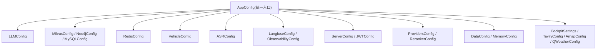

图表来源
- [backend_design/nexus/config/__init__.py:84-132](file://backend_design/nexus/config/__init__.py#L84-L132)

章节来源
- [backend_design/nexus/config/__init__.py:1-167](file://backend_design/nexus/config/__init__.py#L1-L167)
- [backend_design/nexus/config/_common.py:1-75](file://backend_design/nexus/config/_common.py#L1-L75)

## 核心组件
- 统一入口 AppConfig：聚合全部子系统配置，暴露 get_config() 等快捷函数，使用 lru_cache 保证单例。
- 配置加载优先级：优先 .env.local，其次 .env；通过 dotenv 的 override=True 显式注入到 os.environ，避免被空值覆盖。
- 路径解析：_resolve_path() 将相对路径解析为基于项目根目录的绝对路径，解决多启动目录问题。
- 各子系统配置类：均继承 BaseSettings，通过 validation_alias 绑定环境变量名，支持 computed_field 生成派生字段（如 URL）。

章节来源
- [backend_design/nexus/config/__init__.py:84-167](file://backend_design/nexus/config/__init__.py#L84-L167)
- [backend_design/nexus/config/_common.py:25-53](file://backend_design/nexus/config/_common.py#L25-L53)
- [backend_design/nexus/config/_common.py:56-75](file://backend_design/nexus/config/_common.py#L56-L75)

## 架构总览
下图展示配置加载与注入流程，从进程启动到各子系统读取配置的关键步骤。

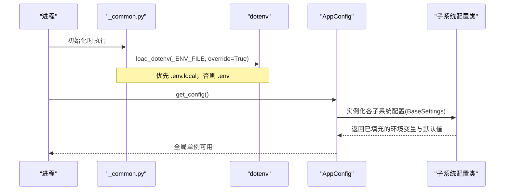

图表来源
- [backend_design/nexus/config/_common.py:39-53](file://backend_design/nexus/config/_common.py#L39-L53)
- [backend_design/nexus/config/__init__.py:144-151](file://backend_design/nexus/config/__init__.py#L144-L151)

## 详细组件分析

### 数据库配置（Milvus / Neo4j / MySQL）
- MilvusConfig：向量库连接参数、集合名、索引类型与搜索参数。
- Neo4jConfig：图数据库 URI、用户与密码。
- MySQLConfig：主机、端口、用户、密码、数据库名，并计算异步连接 URL。

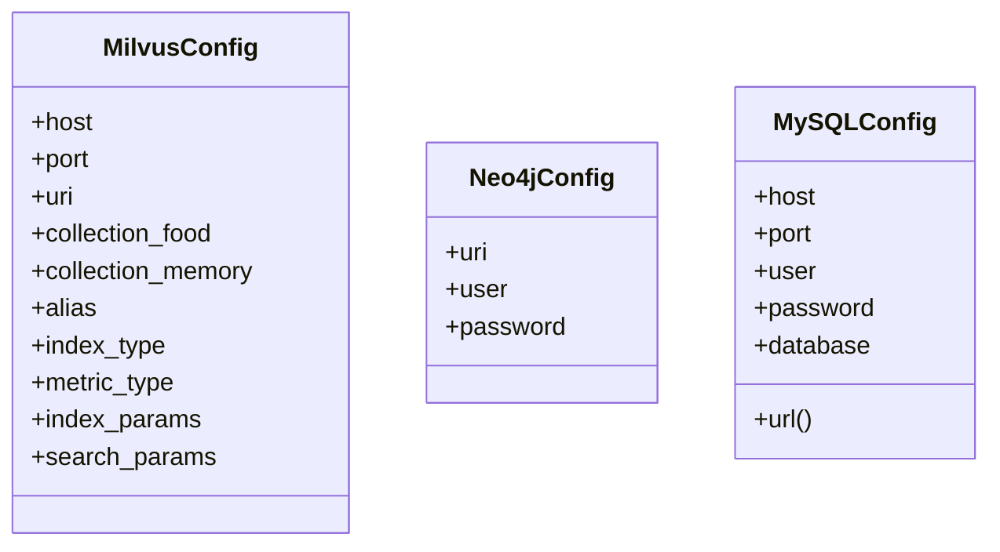

图表来源
- [backend_design/nexus/config/database.py:15-61](file://backend_design/nexus/config/database.py#L15-L61)

章节来源
- [backend_design/nexus/config/database.py:1-61](file://backend_design/nexus/config/database.py#L1-L61)

### Redis 缓存配置
- RedisConfig：主机、端口、密码、DB 号，语义缓存开关、相似度阈值与 TTL。
- 提供 url 计算字段用于连接字符串构造。

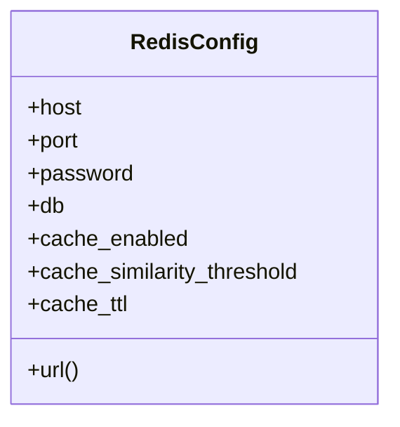

图表来源
- [backend_design/nexus/config/cache.py:15-41](file://backend_design/nexus/config/cache.py#L15-L41)

章节来源
- [backend_design/nexus/config/cache.py:1-41](file://backend_design/nexus/config/cache.py#L1-L41)

### LLM API 配置
- LLMConfig：供应商选择（cloud/local）、API Key/BaseURL、模型名、嵌入维度、温度、超时、并发限制、降级回退参数、美团开发令牌、降级通知开关。
- model_post_init：当 provider=local 时自动切换到本地 llama.cpp 参数。
- computed_field：embedding_url、is_local。

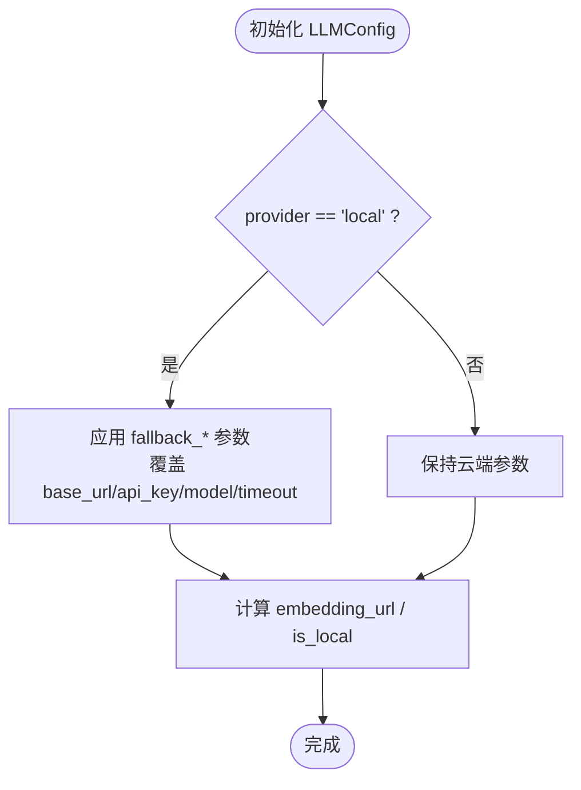

图表来源
- [backend_design/nexus/config/llm.py:15-72](file://backend_design/nexus/config/llm.py#L15-L72)

章节来源
- [backend_design/nexus/config/llm.py:1-72](file://backend_design/nexus/config/llm.py#L1-L72)

### 服务器与认证配置
- ServerConfig：监听地址/端口、调试模式、日志级别、CORS 来源、会话锁上限、SSE 心跳间隔。
- JWTConfig：密钥、算法、过期时间、RBAC 默认角色与管理员/用户默认凭据。

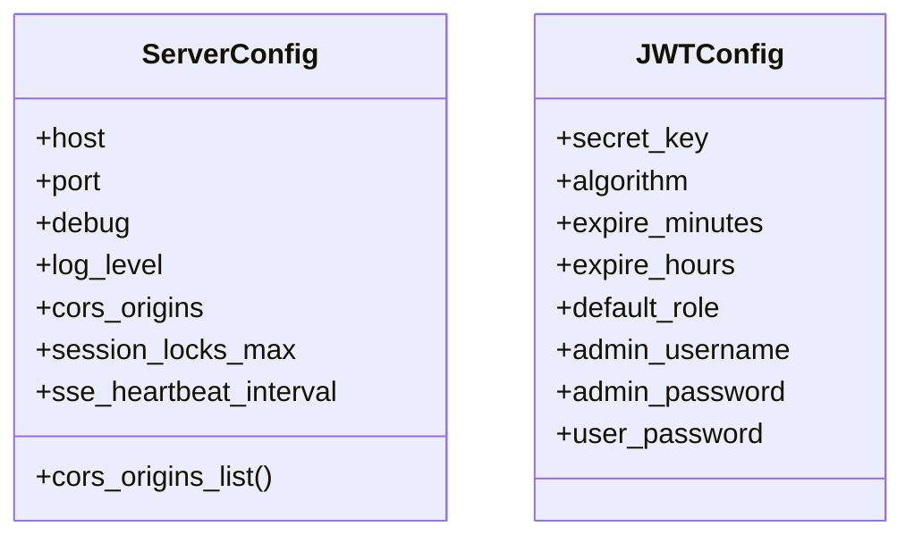

图表来源
- [backend_design/nexus/config/server.py:15-61](file://backend_design/nexus/config/server.py#L15-L61)

章节来源
- [backend_design/nexus/config/server.py:1-61](file://backend_design/nexus/config/server.py#L1-L61)

### ASR/TTS/声纹模型路径配置
- ASRConfig：FunASR SenseVoice、CosyVoice、CAM++ 模型路径与会者注册/用户目录。
- model_post_init：将相对路径解析为绝对路径，并提供 resolved_* 方法。

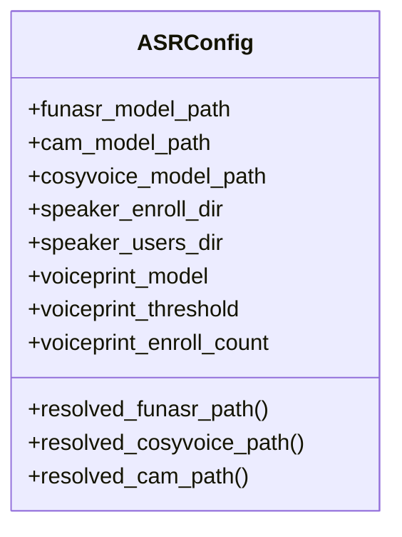

图表来源
- [backend_design/nexus/config/asr.py:15-66](file://backend_design/nexus/config/asr.py#L15-L66)

章节来源
- [backend_design/nexus/config/asr.py:1-66](file://backend_design/nexus/config/asr.py#L1-L66)

### 多座舱与第三方服务配置
- CockpitSettings：默认座舱数量、Go 网关地址/端口/模式、RBAC 默认角色、声纹相关参数。
- TavilyConfig/AmapConfig/QWeatherConfig：搜索引擎与地图/天气 API 密钥与端点。

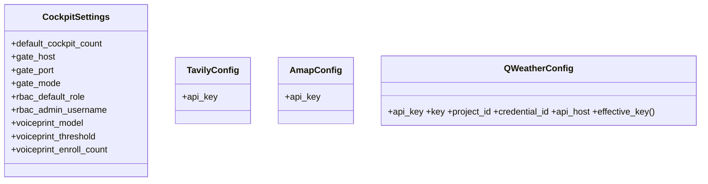

图表来源
- [backend_design/nexus/config/cockpit.py:15-83](file://backend_design/nexus/config/cockpit.py#L15-L83)

章节来源
- [backend_design/nexus/config/cockpit.py:1-83](file://backend_design/nexus/config/cockpit.py#L1-L83)

### 可观测性配置
- LangfuseConfig：Public/Secret Key、Host、DB 密码、NextAuth Secret、Salt，is_enabled 判断是否启用追踪。
- ObservabilityConfig：Prometheus 与 Grafana 地址。

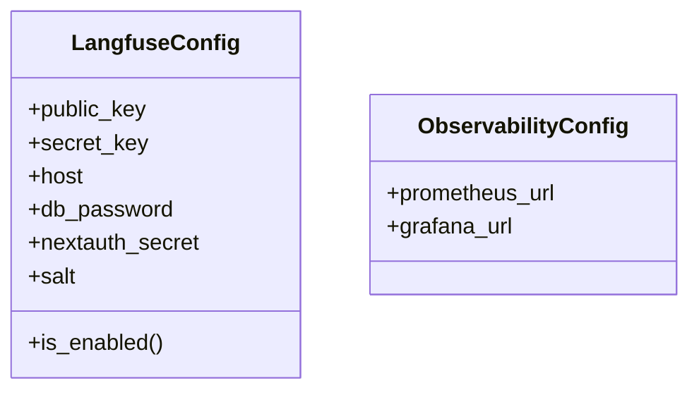

图表来源
- [backend_design/nexus/config/observability.py:15-47](file://backend_design/nexus/config/observability.py#L15-L47)

章节来源
- [backend_design/nexus/config/observability.py:1-47](file://backend_design/nexus/config/observability.py#L1-L47)

### 部署模式与重排器配置
- ProvidersConfig：向量存储、图存储、缓存、重排器、检查点 Provider 开关（默认 local/sqlite），normalized() 归一化输出。
- RerankerConfig：重排模型名称。

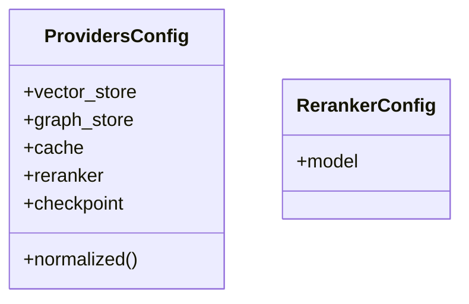

图表来源
- [backend_design/nexus/config/providers.py:15-47](file://backend_design/nexus/config/providers.py#L15-L47)

章节来源
- [backend_design/nexus/config/providers.py:1-47](file://backend_design/nexus/config/providers.py#L1-L47)

### 数据目录与记忆管理
- DataConfig：食物知识库、知识文档、上传、临时、偏好目录，提供 resolved_* 方法。
- MemoryConfig：对话历史压缩阈值、保留轮次、摘要长度、上下文 token 比例与硬上限。

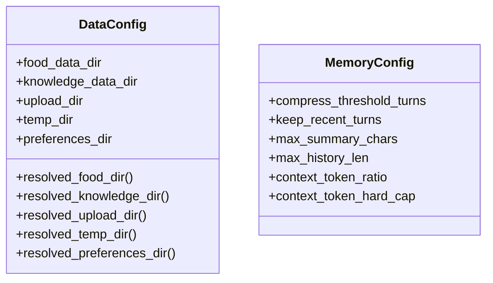

图表来源
- [backend_design/nexus/config/data.py:15-63](file://backend_design/nexus/config/data.py#L15-L63)

章节来源
- [backend_design/nexus/config/data.py:1-63](file://backend_design/nexus/config/data.py#L1-L63)

### 车控总线适配器配置
- VehicleConfig：适配器类型（mock/http/mcp）、HTTP 接口基址/协议/端点/超时/Token、MCP 命令/参数/工作目录、工具列表校验开关。

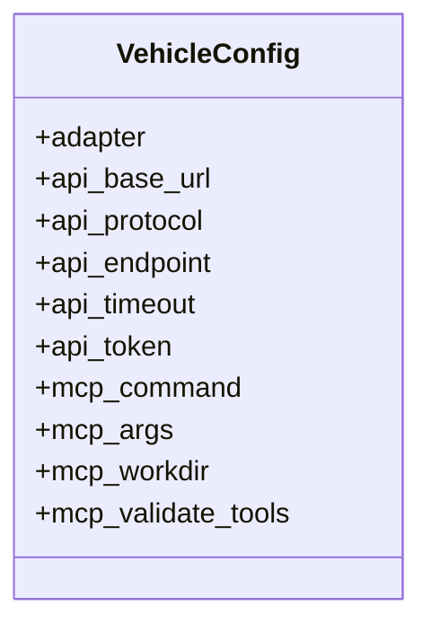

图表来源
- [backend_design/nexus/config/vehicle.py:15-50](file://backend_design/nexus/config/vehicle.py#L15-L50)

章节来源
- [backend_design/nexus/config/vehicle.py:1-50](file://backend_design/nexus/config/vehicle.py#L1-L50)

## 依赖关系分析
- 配置模块依赖 _common.py 提供的 _ENV_FILE 与 _resolve_path()。
- AppConfig 聚合所有子系统配置，并通过 SettingsConfigDict(env_file=_ENV_FILE, extra="ignore") 指定加载源。
- Docker Compose 通过 env_file 与 environment 向容器注入运行时变量，覆盖 .env 中的默认值。

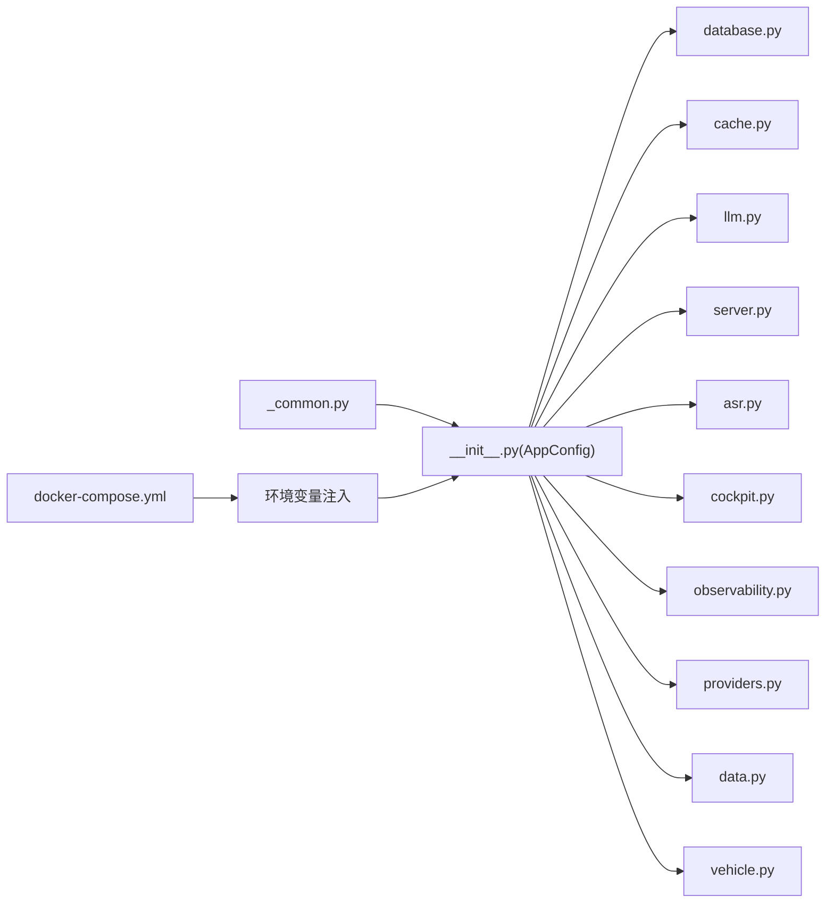

图表来源
- [backend_design/nexus/config/_common.py:39-53](file://backend_design/nexus/config/_common.py#L39-L53)
- [backend_design/nexus/config/__init__.py:132](file://backend_design/nexus/config/__init__.py#L132)
- [docker-compose.yml:23-56](file://docker-compose.yml#L23-L56)

章节来源
- [backend_design/nexus/config/_common.py:1-75](file://backend_design/nexus/config/_common.py#L1-L75)
- [backend_design/nexus/config/__init__.py:1-167](file://backend_design/nexus/config/__init__.py#L1-L167)
- [docker-compose.yml:1-292](file://docker-compose.yml#L1-L292)

## 性能与可观测性
- 语义缓存：RedisConfig 控制缓存开关、相似度阈值与 TTL，影响 LLM 调用频率与延迟。
- 限流与并发：ServerConfig 的 session_locks_max 与 SSE 心跳间隔影响长连接稳定性；LLMConfig 的 llm_concurrency_limit 控制并发。
- 可观测性：Langfuse 追踪与 Prometheus/Grafana 指标采集，便于定位慢查询与异常。

章节来源
- [backend_design/nexus/config/cache.py:15-41](file://backend_design/nexus/config/cache.py#L15-L41)
- [backend_design/nexus/config/server.py:15-42](file://backend_design/nexus/config/server.py#L15-L42)
- [backend_design/nexus/config/llm.py:15-72](file://backend_design/nexus/config/llm.py#L15-L72)
- [backend_design/nexus/config/observability.py:15-47](file://backend_design/nexus/config/observability.py#L15-L47)

## 故障排查指南
- 配置未生效
  - 确认 .env.local 是否存在且位于项目根目录；若不存在则回退到 .env。
  - 检查 dotenv 是否成功加载（override=True），避免被空值覆盖。
- 连接失败
  - 核对数据库/Redis/Milvus/Neo4j 的 host/port/password 是否与 docker-compose 一致。
  - 注意端口映射差异（如 Redis 16379→6379，MySQL 13306→3306，Neo4j 17687→7687）。
- CORS 或跨域错误
  - 调整 ServerConfig.cors_origins，生产环境务必指定具体域名。
- JWT 鉴权失败
  - Go 网关与 Python 后端必须使用相同的 JWT_SECRET_KEY。
- 模型路径错误
  - 确认 ASRConfig 与 DataConfig 的路径已通过 _resolve_path() 解析为绝对路径。
- 可观测性不可用
  - 检查 Langfuse 的 public_key/secret_key 是否为空；确认 Prometheus/Grafana 地址可达。

章节来源
- [backend_design/nexus/config/_common.py:39-53](file://backend_design/nexus/config/_common.py#L39-L53)
- [docker-compose.yml:166-208](file://docker-compose.yml#L166-L208)
- [backend_design/nexus/config/server.py:36-42](file://backend_design/nexus/config/server.py#L36-L42)
- [backend_design/nexus/config/asr.py:47-54](file://backend_design/nexus/config/asr.py#L47-L54)
- [backend_design/nexus/config/observability.py:29-33](file://backend_design/nexus/config/observability.py#L29-L33)

## 结论
NexusCockpit 的配置体系以 Pydantic Settings 为核心，结合统一的 AppConfig 与 _common.py 的路径/环境加载机制，实现了高内聚、低耦合、可扩展的配置管理。通过 .env.local/.env 的分层策略与 Docker Compose 的环境注入，能够灵活适配开发、测试与生产环境。配合可观测性与诊断手段，可有效保障系统稳定运行。

## 附录：环境变量清单与环境模板

### 环境变量清单（按子系统分类）
- 通用与路径
  - APP_ENV：应用环境标识（默认 local）
  - 路径解析由 _resolve_path() 处理，无需手动设置
- 服务器与认证
  - HOST、PORT、DEBUG、LOG_LEVEL、CORS_ORIGINS、SESSION_LOCKS_MAX、SSE_HEARTBEAT_INTERVAL
  - JWT_SECRET_KEY、JWT_ALGORITHM、JWT_EXPIRE_MINUTES、JWT_EXPIRE_HOURS
  - RBAC_DEFAULT_ROLE、RBAC_ADMIN_USERNAME、RBAC_ADMIN_PASSWORD、RBAC_USER_PASSWORD
- 数据库
  - MILVUS_HOST、MILVUS_PORT、MILVUS_URI、MILVUS_COLLECTION_FOOD、MILVUS_COLLECTION_MEMORY
  - NEO4J_URI、NEO4J_USER、NEO4J_PASSWORD
  - MYSQL_HOST、MYSQL_PORT、MYSQL_USER、MYSQL_PASSWORD、MYSQL_DATABASE
- 缓存（Redis）
  - REDIS_HOST、REDIS_PORT、REDIS_PASSWORD、REDIS_DB
  - SEMANTIC_CACHE_ENABLED、SEMANTIC_CACHE_SIMILARITY_THRESHOLD、SEMANTIC_CACHE_TTL_SECONDS
- LLM
  - LLM_PROVIDER、ARK_API_KEY、ARK_BASE_URL、LLM_MODEL、EMBEDDING_MODEL、EMBEDDING_DIM
  - REFLECTION_ENABLED、MEMORY_EXTRACTION_ENABLED、LLM_CONCURRENCY_LIMIT
  - LLM_FALLBACK_ENABLED、LLM_FALLBACK_BASE_URL、LLM_FALLBACK_MODEL、LLM_FALLBACK_API_KEY、LLM_FALLBACK_TIMEOUT
  - MEITUAN_DEV_TOKEN、DEGRADATION_NOTIFY_USER、DEGRADATION_NOTIFY_ADMIN
- ASR/TTS/声纹
  - FUNASR_MODEL_PATH、CAM_MODEL_PATH、COSYVOICE_MODEL_PATH
  - SPEAKER_ENROLL_DIR、SPEAKER_USERS_DIR
  - VOICEPRINT_MODEL、VOICEPRINT_THRESHOLD、VOICEPRINT_ENROLL_COUNT
- 多座舱与第三方服务
  - COCKPIT_COUNT、NEXUS_GATE_HOST、NEXUS_GATE_PORT、NEXUS_GATE_MODE
  - TAVILY_API_KEY、AMAP_KEY、QWEATHER_APIKEY、QWEATHER_KEY、QWEATHER_PROJECT_ID、QWEATHER_CREDENTIAL_ID、QWEATHER_API_HOST
- 可观测性
  - LANGFUSE_PUBLIC_KEY、LANGFUSE_SECRET_KEY、LANGFUSE_HOST、LANGFUSE_DB_PASSWORD、LANGFUSE_NEXTAUTH_SECRET、LANGFUSE_SALT
  - PROMETHEUS_URL、GRAFANA_URL
- 部署模式与重排器
  - VECTOR_STORE_PROVIDER、GRAPH_STORE_PROVIDER、CACHE_PROVIDER、RERANKER_PROVIDER、CHECKPOINT_PROVIDER
  - RERANK_MODEL
- 数据目录与记忆
  - FOOD_DATA_DIR、KNOWLEDGE_DATA_DIR、UPLOAD_DIR、TEMP_DIR、PREFERENCES_DIR
  - MEMORY_COMPRESS_THRESHOLD_TURNS、MEMORY_KEEP_RECENT_TURNS、MEMORY_MAX_SUMMARY_CHARS、MEMORY_MAX_HISTORY_LEN、MEMORY_CONTEXT_TOKEN_RATIO、MEMORY_CONTEXT_TOKEN_HARD_CAP
- 车控总线
  - VEHICLE_ADAPTER、VEHICLE_API_BASE_URL、VEHICLE_API_PROTOCOL、VEHICLE_API_ENDPOINT、VEHICLE_API_TIMEOUT、VEHICLE_API_TOKEN
  - VEHICLE_MCP_COMMAND、VEHICLE_MCP_ARGS、VEHICLE_MCP_WORKDIR、VEHICLE_MCP_VALIDATE_TOOLS

章节来源
- [backend_design/nexus/config/server.py:15-61](file://backend_design/nexus/config/server.py#L15-L61)
- [backend_design/nexus/config/database.py:15-61](file://backend_design/nexus/config/database.py#L15-L61)
- [backend_design/nexus/config/cache.py:15-41](file://backend_design/nexus/config/cache.py#L15-L41)
- [backend_design/nexus/config/llm.py:15-72](file://backend_design/nexus/config/llm.py#L15-L72)
- [backend_design/nexus/config/asr.py:15-66](file://backend_design/nexus/config/asr.py#L15-L66)
- [backend_design/nexus/config/cockpit.py:15-83](file://backend_design/nexus/config/cockpit.py#L15-L83)
- [backend_design/nexus/config/observability.py:15-47](file://backend_design/nexus/config/observability.py#L15-L47)
- [backend_design/nexus/config/providers.py:15-47](file://backend_design/nexus/config/providers.py#L15-L47)
- [backend_design/nexus/config/data.py:15-63](file://backend_design/nexus/config/data.py#L15-L63)
- [backend_design/nexus/config/vehicle.py:15-50](file://backend_design/nexus/config/vehicle.py#L15-L50)

### 配置文件加载优先级与注入机制
- 优先级
  - 进程启动时优先检测 .env.local，若存在则加载；否则加载 .env。
  - 通过 dotenv 的 override=True 将 .env.local 的值注入到 os.environ，避免被 .env 的空值覆盖。
- 注入机制
  - 各子系统配置类通过 SettingsConfigDict(env_file=_ENV_FILE, extra="ignore") 指定加载源。
  - Pydantic Settings 根据 validation_alias 将环境变量映射到字段。
- Docker Compose 注入
  - 通过 env_file 与 environment 为容器注入运行时变量，覆盖 .env 中的默认值。

章节来源
- [backend_design/nexus/config/_common.py:39-53](file://backend_design/nexus/config/_common.py#L39-L53)
- [backend_design/nexus/config/__init__.py:132](file://backend_design/nexus/config/__init__.py#L132)
- [docker-compose.yml:23-56](file://docker-compose.yml#L23-L56)

### 敏感信息与密钥管理最佳实践
- 使用 .env.local 存放个人密钥与敏感信息，不提交至版本库。
- 生产环境建议通过容器编排或平台密钥管理服务注入环境变量，避免明文写入镜像或配置文件。
- JWT_SECRET_KEY 必须在 Go 网关与 Python 后端保持一致。
- 对 Langfuse、Tavily、Amap、QWeather 等第三方服务的 API Key 进行最小权限分配与定期轮换。

章节来源
- [backend_design/nexus/config/_common.py:39-53](file://backend_design/nexus/config/_common.py#L39-L53)
- [README.md:279-282](file://README.md#L279-L282)

### 不同部署环境的配置模板与差异
- 开发环境
  - 使用 docker-compose.yml 与 docker-compose.dev.yml 叠加，暴露更多调试端口（如 Grafana 3001、Prometheus 9200、Langfuse 3101）。
  - 开启 DEBUG=true、LOG_LEVEL=DEBUG，便于本地调试。
- 测试环境
  - 复用 docker-compose.yml，替换 .env 中对应服务的连接参数与密钥。
  - 关闭不必要的调试端口，仅暴露必要端口。
- 生产环境
  - 严格限定 CORS_ORIGINS，禁止通配符。
  - 使用强密码与独立的密钥管理方案（如平台密钥服务）。
  - 关闭 DEBUG，设置合理的 LOG_LEVEL。
  - 合理配置 Redis 内存与淘汰策略、Milvus/Neo4j/MySQL 资源配额。

章节来源
- [docker-compose.dev.yml:1-63](file://docker-compose.dev.yml#L1-L63)
- [docker-compose.yml:166-208](file://docker-compose.yml#L166-L208)
- [backend_design/nexus/config/server.py:26-34](file://backend_design/nexus/config/server.py#L26-L34)

### 配置验证工具与错误诊断
- 验证工具
  - 使用 get_config() 获取全局配置，打印关键字段以确认加载结果。
  - 检查 computed_field（如 Redis.url、MySQL.url、LLM.embedding_url）是否正确生成。
- 常见错误
  - 连接失败：核对 host/port/password 与 docker-compose 映射。
  - CORS 错误：调整 cors_origins。
  - JWT 失败：确保网关与后端密钥一致。
  - 模型路径错误：确认 ASR/Data 路径已解析为绝对路径。
  - 可观测性不可用：检查 Langfuse 的 key 与地址。

章节来源
- [backend_design/nexus/config/__init__.py:144-167](file://backend_design/nexus/config/__init__.py#L144-L167)
- [backend_design/nexus/config/cache.py:35-41](file://backend_design/nexus/config/cache.py#L35-L41)
- [backend_design/nexus/config/database.py:53-61](file://backend_design/nexus/config/database.py#L53-L61)
- [backend_design/nexus/config/llm.py:61-72](file://backend_design/nexus/config/llm.py#L61-L72)
- [backend_design/nexus/config/observability.py:29-33](file://backend_design/nexus/config/observability.py#L29-L33)