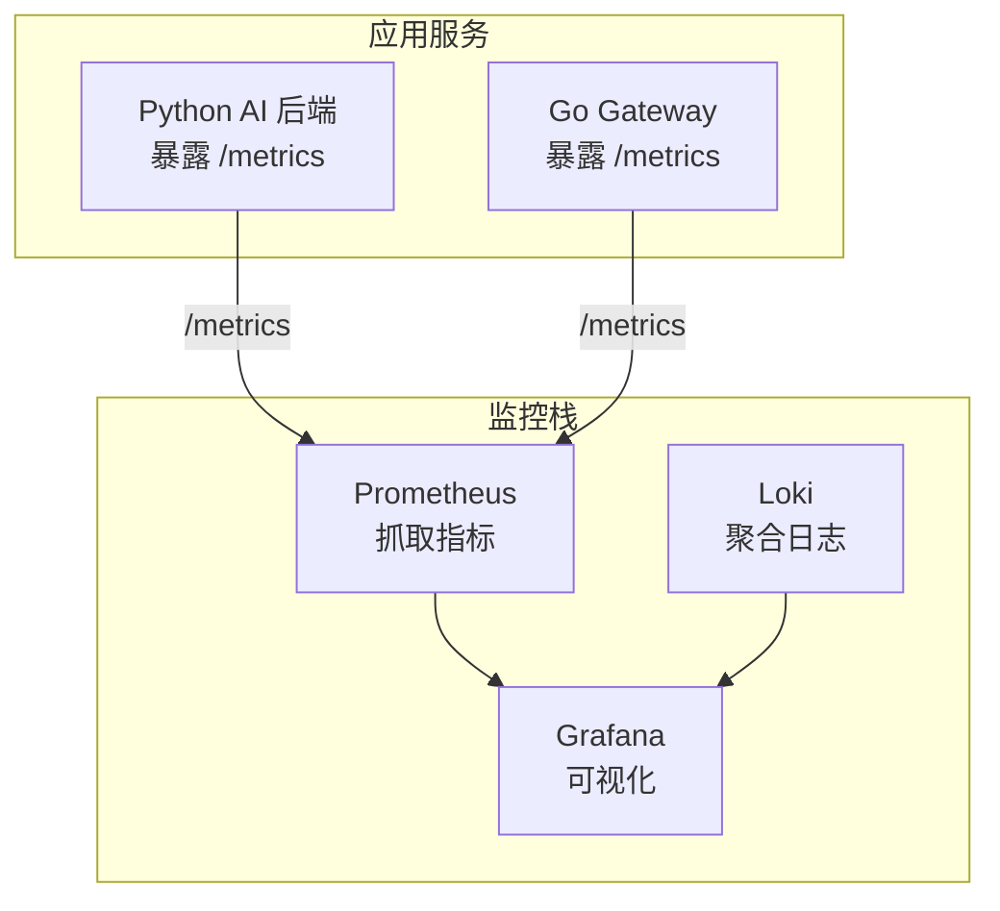
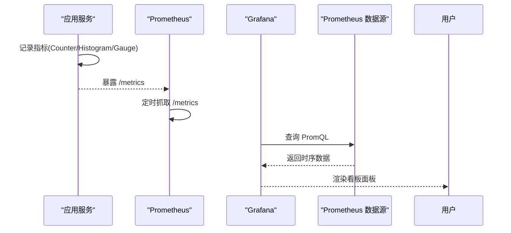
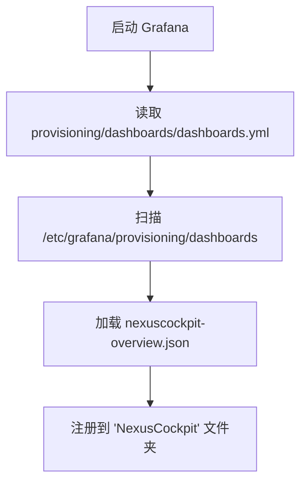
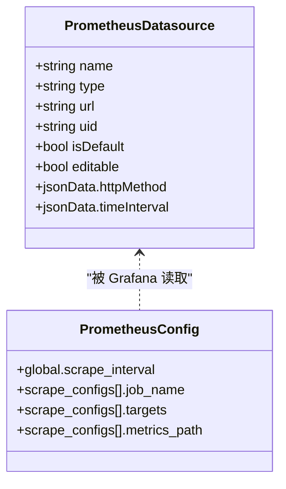
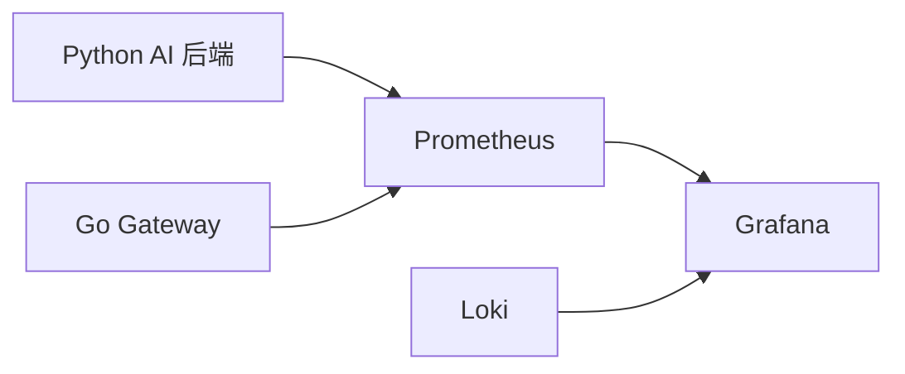

# Grafana看板

<cite>
**本文引用的文件**   
- [config/grafana/provisioning/dashboards/dashboards.yml](file://config/grafana/provisioning/dashboards/dashboards.yml)
- [config/grafana/provisioning/dashboards/nexuscockpit-overview.json](file://config/grafana/provisioning/dashboards/nexuscockpit-overview.json)
- [config/grafana/provisioning/datasources/prometheus.yml](file://config/grafana/provisioning/datasources/prometheus.yml)
- [config/prometheus/prometheus.yml](file://config/prometheus/prometheus.yml)
- [docker-compose.yml](file://docker-compose.yml)
- [backend_design/nexus/observability/metrics.py](file://backend_design/nexus/observability/metrics.py)
- [backend_design/nexus/observability/unified.py](file://backend_design/nexus/observability/unified.py)
- [backend_design/nexus/observability/cockpit_metrics.py](file://backend_design/nexus/observability/cockpit_metrics.py)
- [config/loki/loki-config.yml](file://config/loki/loki-config.yml)
</cite>

## 目录
1. [简介](#简介)
2. [项目结构](#项目结构)
3. [核心组件](#核心组件)
4. [架构总览](#架构总览)
5. [详细组件分析](#详细组件分析)
6. [依赖关系分析](#依赖关系分析)
7. [性能考虑](#性能考虑)
8. [故障排查指南](#故障排查指南)
9. [结论](#结论)
10. [附录](#附录)

## 简介
本文件为 NexusCockpit 项目的 Grafana 看板系统提供完整文档，涵盖：
- 预置看板的导入与配置方法
- NexusCockpit 概览看板各图表含义与阈值参考
- Prometheus 数据源连接与认证配置
- 自定义看板创建流程（面板类型、查询语句、样式定制）
- 告警规则配置与通知渠道设置
- 看板分享、权限管理与性能优化最佳实践

## 项目结构
NexusCockpit 通过 Docker Compose 编排基础设施，包含 Prometheus（指标采集）、Loki（日志聚合）、Grafana（可视化）。Grafana 的 Dashboard 与 Datasource 通过 provisioning 自动注入。

**图示来源** 
- [docker-compose.yml:256-276](file://docker-compose.yml#L256-L276)
- [config/prometheus/prometheus.yml:1-35](file://config/prometheus/prometheus.yml#L1-L35)

**章节来源**
- [docker-compose.yml:256-276](file://docker-compose.yml#L256-L276)
- [config/prometheus/prometheus.yml:1-35](file://config/prometheus/prometheus.yml#L1-L35)

## 核心组件
- 指标定义与采集：Python 后端使用 prometheus_client 暴露标准 /metrics；统一可观测性门面集中记录请求、Agent、技能、缓存、RAG、LLM 等指标。
- 指标抓取：Prometheus 按 job 抓取 Python 后端与 Go Gateway 的 /metrics。
- 数据源与看板：Grafana 通过 provisioning 自动注册 Prometheus 数据源并加载“NexusCockpit Overview”看板。
- 日志聚合：Loki 以 v12 schema 存储结构化日志，便于在 Grafana 中联动查询。

**章节来源**
- [backend_design/nexus/observability/metrics.py:1-108](file://backend_design/nexus/observability/metrics.py#L1-L108)
- [backend_design/nexus/observability/unified.py:1-269](file://backend_design/nexus/observability/unified.py#L1-L269)
- [config/prometheus/prometheus.yml:1-35](file://config/prometheus/prometheus.yml#L1-L35)
- [config/grafana/provisioning/datasources/prometheus.yml:1-14](file://config/grafana/provisioning/datasources/prometheus.yml#L1-L14)
- [config/grafana/provisioning/dashboards/dashboards.yml:1-14](file://config/grafana/provisioning/dashboards/dashboards.yml#L1-L14)
- [config/loki/loki-config.yml:1-56](file://config/loki/loki-config.yml#L1-L56)

## 架构总览
下图展示从应用指标到 Grafana 可视化的端到端链路。

**图示来源** 
- [backend_design/nexus/observability/metrics.py:1-108](file://backend_design/nexus/observability/metrics.py#L1-L108)
- [config/prometheus/prometheus.yml:1-35](file://config/prometheus/prometheus.yml#L1-L35)
- [config/grafana/provisioning/datasources/prometheus.yml:1-14](file://config/grafana/provisioning/datasources/prometheus.yml#L1-L14)

## 详细组件分析

### 预置看板导入与配置
- 看板提供者配置：通过 dashboards.yml 声明 file 类型的 provider，指向 /etc/grafana/provisioning/dashboards，启用自动发现与编辑。
- 预置看板 JSON：nexuscockpit-overview.json 定义了“NexusCockpit Overview”看板及其全部面板、PromQL 查询、阈值与刷新策略。
- 导入方式：将 dashboard 配置文件挂载至 Grafana 容器，启动后自动加载。

**图示来源** 
- [config/grafana/provisioning/dashboards/dashboards.yml:1-14](file://config/grafana/provisioning/dashboards/dashboards.yml#L1-L14)
- [config/grafana/provisioning/dashboards/nexuscockpit-overview.json:1-1125](file://config/grafana/provisioning/dashboards/nexuscockpit-overview.json#L1-L1125)

**章节来源**
- [config/grafana/provisioning/dashboards/dashboards.yml:1-14](file://config/grafana/provisioning/dashboards/dashboards.yml#L1-L14)
- [config/grafana/provisioning/dashboards/nexuscockpit-overview.json:1-1125](file://config/grafana/provisioning/dashboards/nexuscockpit-overview.json#L1-L1125)

### NexusCockpit 概览看板图表说明
概览看板包含以下关键面板（节选）：
- API 请求总数（5min）：统计最近 5 分钟所有 API 端点的请求总量，用于快速感知流量变化。
- API P95 延迟：P95 延迟（毫秒），反映长尾响应时间，适合车载语音助手场景的 SLA 评估。
- 缓存命中率（1h）：语义缓存命中占比，衡量 Agent 流水线绕过效率。
- 当前活跃连接数：WebSocket 长连接数量，体现前端实时通信负载。
- API 请求速率（按方法）：GET/POST/OPTIONS 等方法的请求速率分布。
- API 延迟分布（P50/P95/P99）：不同分位数的延迟趋势，辅助定位慢请求。
- Agent 调用速率（1h）：supervisor 与 pipeline 入口的调用速率。
- 缓存命中/未命中趋势（1h）：命中与未命中的对比，观察缓存有效性。
- Agent 执行延迟（P95, 1h）：Supervisor 节点延迟，关注意图路由与调度耗时。
- RAG 检索 & LLM 调用延迟（P95, 1h）：向量检索与模型调用的延迟表现。
- 技能执行统计（近 1 小时）：车控与通用技能的执行次数。
- 车控/技能执行成功率（1h）：按 skill_name 的成功率，保障车控可靠性。
- LLM 调用延迟（P95, 1h）：模型推理与网络往返的整体延迟。

这些面板均基于 Prometheus 指标，如 nexus_requests_total、nexus_request_latency_seconds_bucket、nexus_cache_hits_total、nexus_active_connections、nexus_agent_invocations_total、nexus_skill_executions_total、nexus_rag_latency_seconds_bucket、nexus_llm_latency_seconds_bucket 等。

**章节来源**
- [config/grafana/provisioning/dashboards/nexuscockpit-overview.json:1-1125](file://config/grafana/provisioning/dashboards/nexuscockpit-overview.json#L1-L1125)
- [backend_design/nexus/observability/metrics.py:1-108](file://backend_design/nexus/observability/metrics.py#L1-L108)

### 数据源配置（Prometheus）
- 数据源注册：prometheus.yml 定义 name、type、url、uid、isDefault、httpMethod、timeInterval 等字段。
- 抓取目标：prometheus.yml 中配置了 nexus-ai、nexus-gate、milvus、prometheus 等 job，分别指向对应服务的 /metrics。
- 认证与安全：默认无鉴权；如需启用，可在 Grafana 数据源 jsonData 中添加 basicAuth、bearerToken 或 TLS 配置。

**图示来源** 
- [config/grafana/provisioning/datasources/prometheus.yml:1-14](file://config/grafana/provisioning/datasources/prometheus.yml#L1-L14)
- [config/prometheus/prometheus.yml:1-35](file://config/prometheus/prometheus.yml#L1-L35)

**章节来源**
- [config/grafana/provisioning/datasources/prometheus.yml:1-14](file://config/grafana/provisioning/datasources/prometheus.yml#L1-L14)
- [config/prometheus/prometheus.yml:1-35](file://config/prometheus/prometheus.yml#L1-L35)

### 自定义看板创建流程
- 面板类型选择：根据需求选择 Stat、Timeseries、Bar Gauge、Table、Graph 等。
- 查询语句编写：基于 Prometheus 指标与 PromQL，例如：
  - 请求总量：sum(increase(nexus_requests_total[5m]))
  - 延迟分位数：histogram_quantile(0.95, sum(rate(nexus_request_latency_seconds_bucket[5m])) by (le))
  - 缓存命中率：sum(increase(nexus_cache_hits_total[1h])) / clamp_min(sum(increase(nexus_cache_hits_total[1h])) + sum(increase(nexus_cache_misses_total[1h])), 1) * 100
- 样式定制：设置颜色阈值、单位、图例计算（mean/max/lastNotNull）、工具提示模式、刷新间隔等。
- 模板变量：可为 endpoint、method、agent_name、skill_name 等维度添加变量，提升看板复用性。

**章节来源**
- [config/grafana/provisioning/dashboards/nexuscockpit-overview.json:1-1125](file://config/grafana/provisioning/dashboards/nexuscockpit-overview.json#L1-L1125)

### 告警规则配置与通知渠道
- 指标告警：在 Grafana 中基于面板查询条件创建 Alert Rule，设定阈值与持续时间，选择通知渠道（Email、Webhook、企业微信、钉钉等）。
- 日志告警：结合 Loki 的 LogQL 对错误关键字或异常模式进行告警。
- 推荐告警项：
  - API P95 延迟超过阈值（如 > 3s）持续 N 分钟
  - 缓存命中率低于阈值（如 < 10%）
  - 技能执行成功率低于阈值（如 < 80%）
  - WebSocket 活跃连接数异常升高（如 > 50）

注意：仓库未包含 Grafana Alerting 规则 YAML，建议在 Grafana UI 中创建并导出保存。

**章节来源**
- [config/grafana/provisioning/dashboards/nexuscockpit-overview.json:1-1125](file://config/grafana/provisioning/dashboards/nexuscockpit-overview.json#L1-L1125)

### 看板分享与权限管理
- 共享链接：在 Grafana 中生成只读分享链接，适用于临时协作。
- 组织与角色：通过 Org、Team、Role 控制访问范围与操作权限（查看/编辑/管理员）。
- 文件夹隔离：将不同业务域看板放入独立文件夹，配合 RBAC 限制访问。
- 外部集成：可通过 OAuth/JWT 与企业身份系统集成，实现单点登录与权限同步。

本节为通用实践建议，不直接引用具体代码文件。

### 性能优化最佳实践
- 指标粒度与保留：合理设置 scrape_interval 与 retention，避免过度细粒度的指标导致存储压力。
- 查询优化：使用 rate/increase/histogram_quantile 等函数时尽量限定时间窗口与标签过滤。
- 面板刷新：按需调整 refresh 间隔，避免频繁重绘。
- 缓存与降级：利用语义缓存降低 LLM 调用频率，提高整体吞吐。
- 资源分配：为 Prometheus/Grafana/Loki 分配足够 CPU/内存，避免 GC 抖动与查询超时。

本节为通用实践建议，不直接引用具体代码文件。

## 依赖关系分析
- 应用层：Python 后端与 Go Gateway 暴露 /metrics。
- 采集层：Prometheus 按 job 抓取指标。
- 可视化层：Grafana 通过 provisioning 加载数据源与看板。
- 日志层：Loki 聚合结构化日志，供 Grafana 联动查询。

**图示来源** 
- [docker-compose.yml:256-276](file://docker-compose.yml#L256-L276)
- [config/prometheus/prometheus.yml:1-35](file://config/prometheus/prometheus.yml#L1-L35)

**章节来源**
- [docker-compose.yml:256-276](file://docker-compose.yml#L256-L276)
- [config/prometheus/prometheus.yml:1-35](file://config/prometheus/prometheus.yml#L1-L35)

## 性能考虑
- 指标采样间隔：Prometheus 全局 scrape_interval 与 evaluation_interval 设置为 15s，平衡实时性与开销。
- 直方图桶设计：请求延迟、Agent/LLM/RAG 延迟的 buckets 覆盖常用区间，确保分位数计算准确。
- 缓存命中率：通过语义缓存减少 LLM 调用，降低延迟与成本。
- 连接数监控：WebSocket 活跃连接数作为前端负载的重要信号。
- 日志保留：Loki 默认保留 168h，防止磁盘无限增长。

**章节来源**
- [config/prometheus/prometheus.yml:1-35](file://config/prometheus/prometheus.yml#L1-L35)
- [backend_design/nexus/observability/metrics.py:1-108](file://backend_design/nexus/observability/metrics.py#L1-L108)
- [config/loki/loki-config.yml:1-56](file://config/loki/loki-config.yml#L1-L56)

## 故障排查指南
- 指标不可见：检查 Prometheus targets 状态与抓取日志，确认 /metrics 可达。
- 看板空白：验证 Grafana 数据源连通性，确认 uid 与 URL 正确。
- 延迟异常：查看 histogram_quantile 曲线与 Agent/LLM 延迟面板，定位瓶颈。
- 缓存命中率低：检查缓存键设计与 TTL，确认车控指令是否强制跳过缓存。
- 日志缺失：确认 Loki 配置与 structlog 输出格式一致，检查索引与保留策略。

**章节来源**
- [config/prometheus/prometheus.yml:1-35](file://config/prometheus/prometheus.yml#L1-L35)
- [config/grafana/provisioning/datasources/prometheus.yml:1-14](file://config/grafana/provisioning/datasources/prometheus.yml#L1-L14)
- [config/loki/loki-config.yml:1-56](file://config/loki/loki-config.yml#L1-L56)

## 结论
NexusCockpit 的 Grafana 看板体系通过标准化的指标采集、统一的 provisioning 与丰富的面板设计，提供了全面的系统可观测性。结合告警、权限与性能优化实践，可有效支撑车载语音助手场景的稳定运行与持续演进。

## 附录
- 指标字典（节选）：
  - nexus_requests_total：HTTP 请求总数（endpoint/method/status）
  - nexus_request_latency_seconds：请求延迟直方图（endpoint）
  - nexus_agent_invocations_total：Agent 调用计数（agent_name/status）
  - nexus_agent_latency_seconds：Agent 延迟直方图（agent_name）
  - nexus_skill_executions_total：技能执行计数（skill_name/status）
  - nexus_cache_hits_total / nexus_cache_misses_total：缓存命中/未命中计数
  - nexus_rag_retrievals_total / nexus_rag_latency_seconds：RAG 检索计数与延迟
  - nexus_llm_calls_total / nexus_llm_latency_seconds：LLM 调用计数与延迟
  - nexus_active_connections：WebSocket 活跃连接数

**章节来源**
- [backend_design/nexus/observability/metrics.py:1-108](file://backend_design/nexus/observability/metrics.py#L1-L108)
- [backend_design/nexus/observability/unified.py:1-269](file://backend_design/nexus/observability/unified.py#L1-L269)
- [backend_design/nexus/observability/cockpit_metrics.py:1-180](file://backend_design/nexus/observability/cockpit_metrics.py#L1-L180)