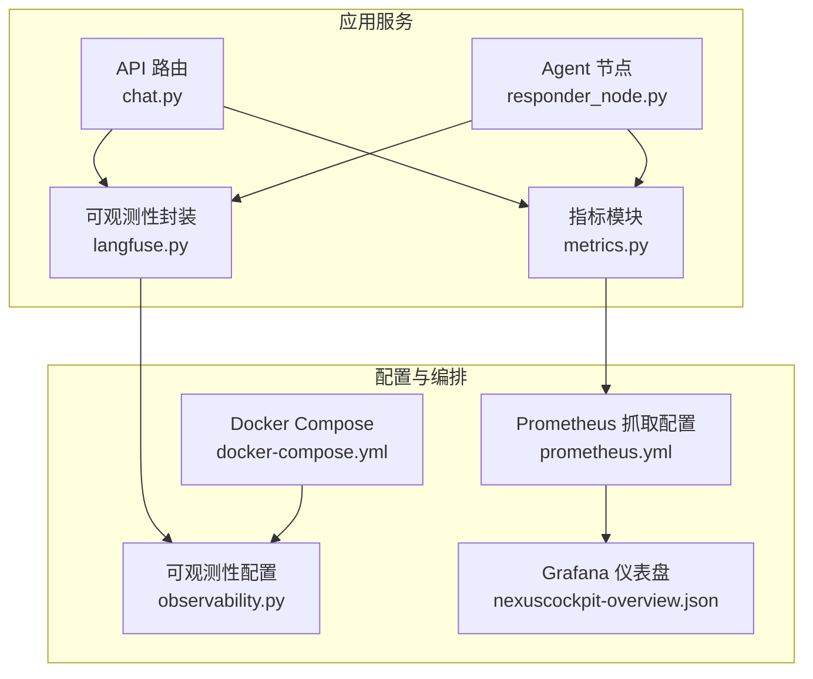
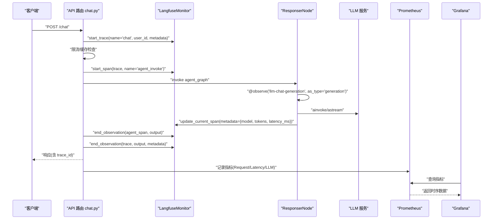
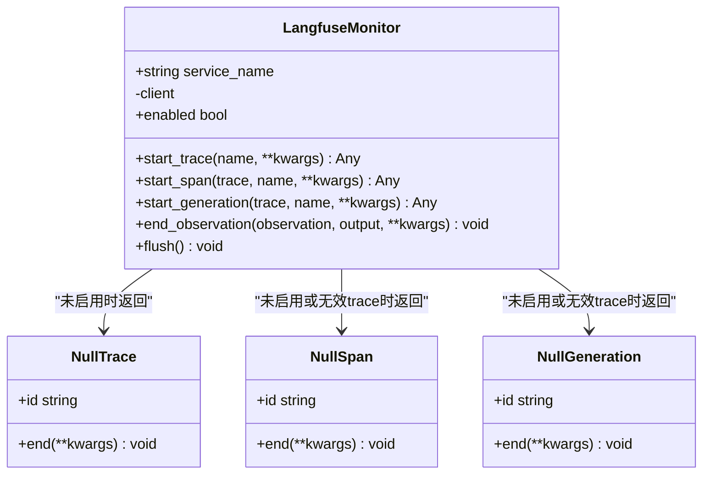
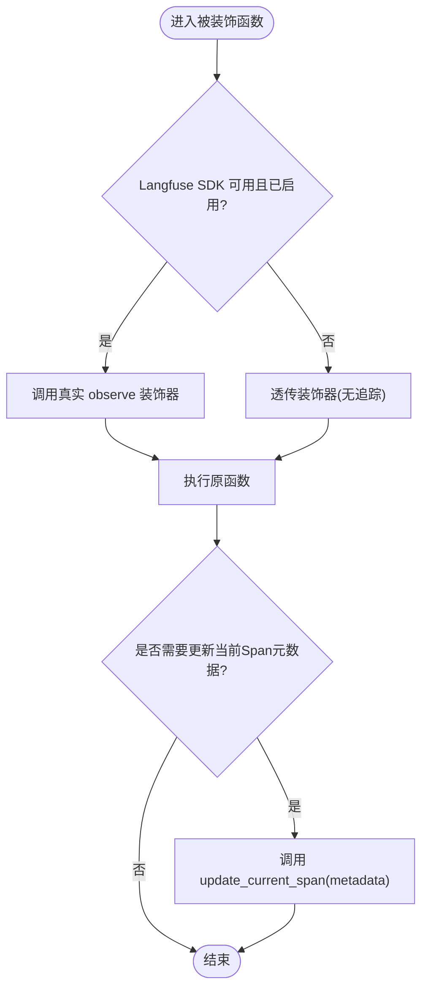
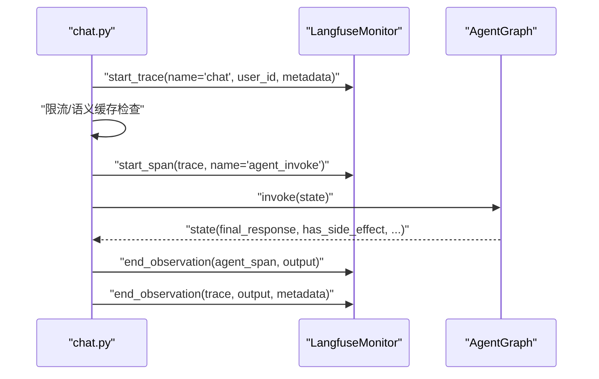
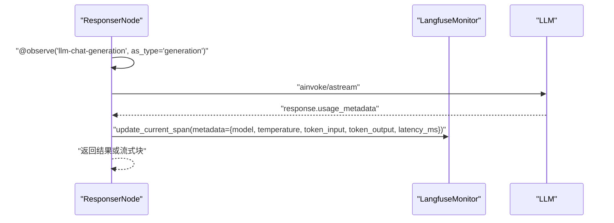
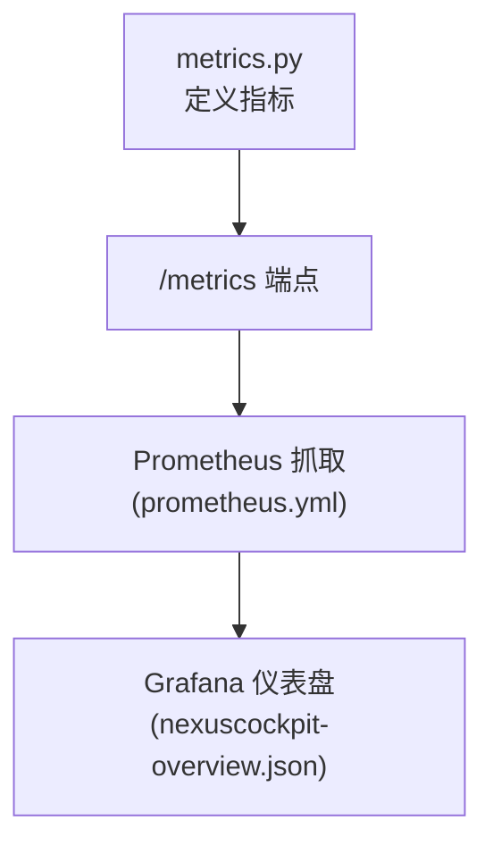
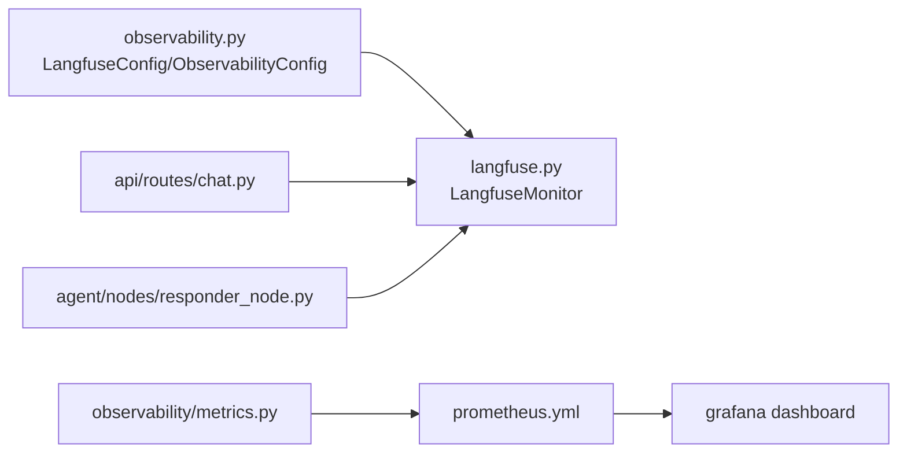

# Langfuse追踪

<cite>
**本文引用的文件**   
- [backend_design/nexus/observability/langfuse.py](file://backend_design/nexus/observability/langfuse.py)
- [backend_design/nexus/config/observability.py](file://backend_design/nexus/config/observability.py)
- [backend_design/nexus/api/routes/chat.py](file://backend_design/nexus/api/routes/chat.py)
- [backend_design/nexus/agent/nodes/responder_node.py](file://backend_design/nexus/agent/nodes/responder_node.py)
- [backend_design/nexus/observability/metrics.py](file://backend_design/nexus/observability/metrics.py)
- [config/prometheus/prometheus.yml](file://config/prometheus/prometheus.yml)
- [config/grafana/provisioning/dashboards/nexuscockpit-overview.json](file://config/grafana/provisioning/dashboards/nexuscockpit-overview.json)
- [docker-compose.yml](file://docker-compose.yml)
</cite>

## 目录
1. [简介](#简介)
2. [项目结构](#项目结构)
3. [核心组件](#核心组件)
4. [架构总览](#架构总览)
5. [详细组件分析](#详细组件分析)
6. [依赖关系分析](#依赖关系分析)
7. [性能与成本优化](#性能与成本优化)
8. [故障排查指南](#故障排查指南)
9. [结论](#结论)
10. [附录](#附录)

## 简介
本文件面向 NexusCockpit 项目中 Langfuse LLM 追踪的集成、配置、数据模型、分析方法与监控联动，提供从部署到排障的全链路说明。重点覆盖：
- API Key、端点与采样策略的配置方法
- 追踪数据结构（Trace/Span/Generation）与字段含义
- 自定义事件与业务上下文注入
- 指标采集与 Prometheus/Grafana 统一监控面板
- 性能瓶颈识别与成本优化建议

## 项目结构
Langfuse 相关能力集中在 observability 层，并在 API 层与 Agent 节点中接入；Prometheus 与 Grafana 通过配置文件暴露与可视化。

图表来源
- [backend_design/nexus/api/routes/chat.py:330-464](file://backend_design/nexus/api/routes/chat.py#L330-L464)
- [backend_design/nexus/agent/nodes/responder_node.py:280-395](file://backend_design/nexus/agent/nodes/responder_node.py#L280-L395)
- [backend_design/nexus/observability/langfuse.py:1-221](file://backend_design/nexus/observability/langfuse.py#L1-L221)
- [backend_design/nexus/observability/metrics.py:1-108](file://backend_design/nexus/observability/metrics.py#L1-L108)
- [backend_design/nexus/config/observability.py:1-47](file://backend_design/nexus/config/observability.py#L1-L47)
- [config/prometheus/prometheus.yml:1-35](file://config/prometheus/prometheus.yml#L1-L35)
- [config/grafana/provisioning/dashboards/nexuscockpit-overview.json:1-200](file://config/grafana/provisioning/dashboards/nexuscockpit-overview.json#L1-L200)
- [docker-compose.yml:210-240](file://docker-compose.yml#L210-L240)

章节来源
- [backend_design/nexus/observability/langfuse.py:1-221](file://backend_design/nexus/observability/langfuse.py#L1-L221)
- [backend_design/nexus/config/observability.py:1-47](file://backend_design/nexus/config/observability.py#L1-L47)
- [backend_design/nexus/api/routes/chat.py:330-464](file://backend_design/nexus/api/routes/chat.py#L330-L464)
- [backend_design/nexus/agent/nodes/responder_node.py:280-395](file://backend_design/nexus/agent/nodes/responder_node.py#L280-L395)
- [backend_design/nexus/observability/metrics.py:1-108](file://backend_design/nexus/observability/metrics.py#L1-L108)
- [config/prometheus/prometheus.yml:1-35](file://config/prometheus/prometheus.yml#L1-L35)
- [config/grafana/provisioning/dashboards/nexuscockpit-overview.json:1-200](file://config/grafana/provisioning/dashboards/nexuscockpit-overview.json#L1-L200)
- [docker-compose.yml:210-240](file://docker-compose.yml#L210-L240)

## 核心组件
- LangfuseMonitor：封装 Langfuse SDK 的 Trace/Span/Generation 生命周期管理，未启用时自动降级为空操作，保证系统可用性。
- observe 装饰器：对函数调用进行自动追踪，支持 as_type 指定 span/generation/agent 类型，未启用时透传执行。
- update_current_span：在当前 Span 上下文中更新 metadata（如模型名、Token 用量、延迟等）。
- ObservabilityConfig：集中管理 Langfuse 与 Prometheus/Grafana 的环境变量与默认值，is_enabled 判定是否启用追踪。
- metrics：定义并暴露 Prometheus 指标（请求数、延迟、LLM 调用、缓存命中等），供 Prometheus 抓取。

章节来源
- [backend_design/nexus/observability/langfuse.py:14-221](file://backend_design/nexus/observability/langfuse.py#L14-L221)
- [backend_design/nexus/config/observability.py:15-47](file://backend_design/nexus/config/observability.py#L15-L47)
- [backend_design/nexus/observability/metrics.py:15-108](file://backend_design/nexus/observability/metrics.py#L15-L108)

## 架构总览
Langfuse 在 API 层创建 Trace，贯穿整个请求生命周期；在 Agent 节点内以 Span/Generation 记录关键步骤（LLM 调用、工具合成、流式输出等）。Prometheus 指标与 Grafana 面板提供统一的运行态监控。

图表来源
- [backend_design/nexus/api/routes/chat.py:330-464](file://backend_design/nexus/api/routes/chat.py#L330-L464)
- [backend_design/nexus/agent/nodes/responder_node.py:315-395](file://backend_design/nexus/agent/nodes/responder_node.py#L315-L395)
- [backend_design/nexus/observability/langfuse.py:144-221](file://backend_design/nexus/observability/langfuse.py#L144-L221)
- [backend_design/nexus/observability/metrics.py:21-90](file://backend_design/nexus/observability/metrics.py#L21-L90)
- [config/prometheus/prometheus.yml:6-20](file://config/prometheus/prometheus.yml#L6-L20)
- [config/grafana/provisioning/dashboards/nexuscockpit-overview.json:79-149](file://config/grafana/provisioning/dashboards/nexuscockpit-overview.json#L79-L149)

## 详细组件分析

### LangfuseMonitor 类
- 功能：初始化 Langfuse 客户端（基于 public_key/secret_key/host），提供 start_trace/start_span/start_generation/end_observation/flush 等方法。
- 降级策略：当未安装 SDK 或未配置 key 时，返回 NullTrace/NullSpan/NullGeneration，确保业务逻辑不受影响。
- 错误处理：所有外部调用均包裹 try/except，失败仅记录日志，不中断主流程。

图表来源
- [backend_design/nexus/observability/langfuse.py:114-221](file://backend_design/nexus/observability/langfuse.py#L114-L221)

章节来源
- [backend_design/nexus/observability/langfuse.py:144-221](file://backend_design/nexus/observability/langfuse.py#L144-L221)

### observe 装饰器与 update_current_span
- observe：包装函数调用，支持 as_type="span"/"generation"/"agent"，未启用时透传执行。
- update_current_span：在当前 Span 上下文中写入 metadata（模型、温度、输入/输出 Token、延迟等）。

图表来源
- [backend_design/nexus/observability/langfuse.py:27-112](file://backend_design/nexus/observability/langfuse.py#L27-L112)

章节来源
- [backend_design/nexus/observability/langfuse.py:27-112](file://backend_design/nexus/observability/langfuse.py#L27-L112)

### API 层追踪（chat.py）
- 在请求入口创建 Trace，携带 user_id、session_id、input 摘要等元数据。
- 在 Agent 执行阶段创建 Span，记录最终输出与延迟。
- 请求结束后关闭 Trace，附带 latency_ms、cache_hit、has_side_effect 等业务上下文。

图表来源
- [backend_design/nexus/api/routes/chat.py:337-453](file://backend_design/nexus/api/routes/chat.py#L337-L453)

章节来源
- [backend_design/nexus/api/routes/chat.py:330-464](file://backend_design/nexus/api/routes/chat.py#L330-L464)

### Agent 节点追踪（responder_node.py）
- 使用 @observe(name="llm-chat-generation", as_type="generation") 标记 LLM 生成过程。
- 在 LLM 调用前后统计延迟，并通过 update_current_span 写入 model、temperature、token_input/output、latency_ms。
- 流式与非流式路径均记录指标与降级策略（搜索兜底）。

图表来源
- [backend_design/nexus/agent/nodes/responder_node.py:289-375](file://backend_design/nexus/agent/nodes/responder_node.py#L289-L375)
- [backend_design/nexus/agent/nodes/responder_node.py:315-395](file://backend_design/nexus/agent/nodes/responder_node.py#L315-L395)

章节来源
- [backend_design/nexus/agent/nodes/responder_node.py:280-395](file://backend_design/nexus/agent/nodes/responder_node.py#L280-L395)

### 指标与监控（metrics.py + prometheus.yml + grafana dashboard）
- metrics.py 定义 Counter/Histogram/Gauge 等指标，暴露 /metrics 端点。
- prometheus.yml 配置抓取 job（nexus-ai、nexus-gate、milvus、prometheus）。
- Grafana 仪表盘提供 API 请求总数、P95 延迟、缓存命中率等可视化。

图表来源
- [backend_design/nexus/observability/metrics.py:15-108](file://backend_design/nexus/observability/metrics.py#L15-L108)
- [config/prometheus/prometheus.yml:6-20](file://config/prometheus/prometheus.yml#L6-L20)
- [config/grafana/provisioning/dashboards/nexuscockpit-overview.json:79-149](file://config/grafana/provisioning/dashboards/nexuscockpit-overview.json#L79-L149)

章节来源
- [backend_design/nexus/observability/metrics.py:1-108](file://backend_design/nexus/observability/metrics.py#L1-L108)
- [config/prometheus/prometheus.yml:1-35](file://config/prometheus/prometheus.yml#L1-L35)
- [config/grafana/provisioning/dashboards/nexuscockpit-overview.json:1-200](file://config/grafana/provisioning/dashboards/nexuscockpit-overview.json#L1-L200)

## 依赖关系分析
- LangfuseMonitor 依赖配置模块获取 is_enabled 与密钥信息。
- API 路由与 Agent 节点通过 LangfuseMonitor 与 observe/update_current_span 实现追踪。
- Prometheus 抓取 Python 后端 /metrics 端点，Grafana 读取 Prometheus 数据源展示面板。

图表来源
- [backend_design/nexus/config/observability.py:15-47](file://backend_design/nexus/config/observability.py#L15-L47)
- [backend_design/nexus/observability/langfuse.py:144-221](file://backend_design/nexus/observability/langfuse.py#L144-L221)
- [backend_design/nexus/api/routes/chat.py:330-464](file://backend_design/nexus/api/routes/chat.py#L330-L464)
- [backend_design/nexus/agent/nodes/responder_node.py:280-395](file://backend_design/nexus/agent/nodes/responder_node.py#L280-L395)
- [backend_design/nexus/observability/metrics.py:15-108](file://backend_design/nexus/observability/metrics.py#L15-L108)
- [config/prometheus/prometheus.yml:6-20](file://config/prometheus/prometheus.yml#L6-L20)
- [config/grafana/provisioning/dashboards/nexuscockpit-overview.json:79-149](file://config/grafana/provisioning/dashboards/nexuscockpit-overview.json#L79-L149)

章节来源
- [backend_design/nexus/config/observability.py:15-47](file://backend_design/nexus/config/observability.py#L15-L47)
- [backend_design/nexus/observability/langfuse.py:144-221](file://backend_design/nexus/observability/langfuse.py#L144-L221)
- [backend_design/nexus/api/routes/chat.py:330-464](file://backend_design/nexus/api/routes/chat.py#L330-L464)
- [backend_design/nexus/agent/nodes/responder_node.py:280-395](file://backend_design/nexus/agent/nodes/responder_node.py#L280-L395)
- [backend_design/nexus/observability/metrics.py:15-108](file://backend_design/nexus/observability/metrics.py#L15-L108)
- [config/prometheus/prometheus.yml:6-20](file://config/prometheus/prometheus.yml#L6-L20)
- [config/grafana/provisioning/dashboards/nexuscockpit-overview.json:79-149](file://config/grafana/provisioning/dashboards/nexuscockpit-overview.json#L79-L149)

## 性能与成本优化
- 采样策略
  - 通过 is_enabled 控制是否启用追踪；未启用时走空操作路径，零开销。
  - 建议在开发环境全量追踪，生产环境按流量比例开启或使用服务端采样（结合 Langfuse 服务端能力）。
- 数据裁剪
  - 在 Trace/Span metadata 中仅保留必要字段（如 model、tokens、latency_ms），避免大对象上传。
  - 限制 input 摘要长度（例如前 200 字符），减少存储与带宽。
- 缓存与降级
  - 语义缓存命中直接返回，跳过 Agent 流水线与 LLM 调用，显著降低延迟与成本。
  - LLM 调用失败时回退搜索结果或友好提示，保障用户体验。
- 指标粒度
  - 使用 Histogram 分桶合理设置（如 0.5s~30s），平衡精度与存储。
  - 区分 endpoint/method/status 标签，便于定位热点与异常。
- 资源隔离
  - 将 Langfuse 上报与主流程解耦（异步/缓冲），避免阻塞请求。
  - 定期 flush 缓冲区，防止内存增长。

[本节为通用指导，不直接分析具体文件]

## 故障排查指南
- 追踪未生效
  - 检查环境变量 LANGFUSE_PUBLIC_KEY/LANGFUSE_SECRET_KEY 是否正确设置。
  - 确认 is_enabled 为真（public_key 与 secret_key 同时非空）。
  - 查看日志中“Langfuse init failed”或“langfuse not installed”警告。
- Span/Generation 缺失
  - 确认在 LLM 调用前后调用了 update_current_span。
  - 检查 observe 装饰器的 as_type 参数是否与预期一致。
- 指标未采集
  - 验证 /metrics 端点可达（端口 8000）。
  - 检查 prometheus.yml 中的 targets 与 metrics_path。
  - 确认 Grafana 数据源指向正确的 Prometheus 实例。
- 延迟高/成本高
  - 观察 LLM_LATENCY 与 LLM_CALLS 指标，定位慢调用与高频调用。
  - 检查缓存命中率，必要时调整缓存策略或提示词以减少 Token 消耗。

章节来源
- [backend_design/nexus/observability/langfuse.py:155-168](file://backend_design/nexus/observability/langfuse.py#L155-L168)
- [backend_design/nexus/agent/nodes/responder_node.py:289-375](file://backend_design/nexus/agent/nodes/responder_node.py#L289-L375)
- [config/prometheus/prometheus.yml:6-20](file://config/prometheus/prometheus.yml#L6-L20)
- [backend_design/nexus/observability/metrics.py:21-90](file://backend_design/nexus/observability/metrics.py#L21-L90)

## 结论
本项目通过 LangfuseMonitor 与 observe/update_current_span 实现了轻量、可降级的 LLM 追踪；在 API 层与 Agent 节点中完整记录了 Trace/Span/Generation 生命周期，并结合 Prometheus/Grafana 形成统一监控体系。通过合理的采样、数据裁剪与缓存策略，可在保障可观测性的同时有效控制成本与延迟。

[本节为总结性内容，不直接分析具体文件]

## 附录

### 配置与环境变量
- Langfuse 配置
  - LANGFUSE_PUBLIC_KEY：追踪公钥
  - LANGFUSE_SECRET_KEY：追踪密钥
  - LANGFUSE_HOST：Langfuse 服务地址（默认 http://127.0.0.1:3101）
  - LANGFUSE_DB_PASSWORD、LANGFUSE_NEXTAUTH_SECRET、LANGFUSE_SALT：自托管数据库与鉴权相关
- Prometheus/Grafana
  - PROMETHEUS_URL：Prometheus 地址（默认 http://127.0.0.1:9200）
  - GRAFANA_URL：Grafana 地址（默认 http://127.0.0.1:3001）

章节来源
- [backend_design/nexus/config/observability.py:18-26](file://backend_design/nexus/config/observability.py#L18-L26)
- [backend_design/nexus/config/observability.py:38-44](file://backend_design/nexus/config/observability.py#L38-L44)
- [docker-compose.yml:218-234](file://docker-compose.yml#L218-L234)

### 追踪数据结构与字段说明
- Trace
  - name：追踪名称（如 “chat”）
  - user_id：用户标识
  - session_id：会话标识
  - metadata：业务上下文（如 input 摘要、latency_ms、cache_hit、has_side_effect）
- Span
  - name：步骤名称（如 “agent_invoke”）
  - output：步骤输出摘要
- Generation
  - name：生成任务名称（如 “llm-chat-generation”）
  - metadata：包含 model、temperature、token_input、token_output、latency_ms 等

章节来源
- [backend_design/nexus/api/routes/chat.py:341-345](file://backend_design/nexus/api/routes/chat.py#L341-L345)
- [backend_design/nexus/api/routes/chat.py:448-453](file://backend_design/nexus/api/routes/chat.py#L448-L453)
- [backend_design/nexus/agent/nodes/responder_node.py:289-299](file://backend_design/nexus/agent/nodes/responder_node.py#L289-L299)
- [backend_design/nexus/agent/nodes/responder_node.py:365-375](file://backend_design/nexus/agent/nodes/responder_node.py#L365-L375)

### 自定义事件与业务上下文
- 在 observe 装饰器中传入 name 与 as_type，明确追踪类型。
- 使用 update_current_span 动态追加 metadata（如模型、Token、延迟、业务标签）。
- 在 Trace 的 metadata 中注入 session_id、user_id、input 摘要、cache_hit、has_side_effect 等。

章节来源
- [backend_design/nexus/observability/langfuse.py:44-86](file://backend_design/nexus/observability/langfuse.py#L44-L86)
- [backend_design/nexus/observability/langfuse.py:89-112](file://backend_design/nexus/observability/langfuse.py#L89-L112)
- [backend_design/nexus/api/routes/chat.py:341-345](file://backend_design/nexus/api/routes/chat.py#L341-L345)
- [backend_design/nexus/api/routes/chat.py:448-453](file://backend_design/nexus/api/routes/chat.py#L448-L453)

### 指标与统一监控面板
- 指标定义
  - 请求计数与延迟：nexus_requests_total、nexus_request_latency_seconds
  - Agent 调用：nexus_agent_invocations_total、nexus_agent_latency_seconds
  - LLM 调用：nexus_llm_calls_total、nexus_llm_latency_seconds
  - 缓存命中/未命中：nexus_cache_hits_total、nexus_cache_misses_total
- Prometheus 抓取
  - job_name: nexus-ai，targets: host.docker.internal:8000，metrics_path: /metrics
- Grafana 面板
  - API 请求总数（5min）、P95 延迟、缓存命中率等

章节来源
- [backend_design/nexus/observability/metrics.py:21-90](file://backend_design/nexus/observability/metrics.py#L21-L90)
- [config/prometheus/prometheus.yml:6-20](file://config/prometheus/prometheus.yml#L6-L20)
- [config/grafana/provisioning/dashboards/nexuscockpit-overview.json:79-149](file://config/grafana/provisioning/dashboards/nexuscockpit-overview.json#L79-L149)