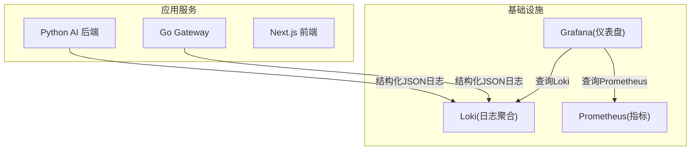
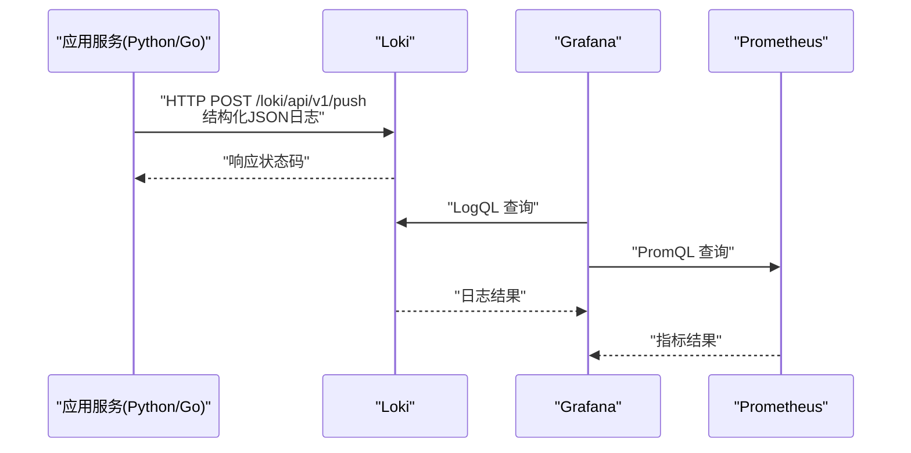
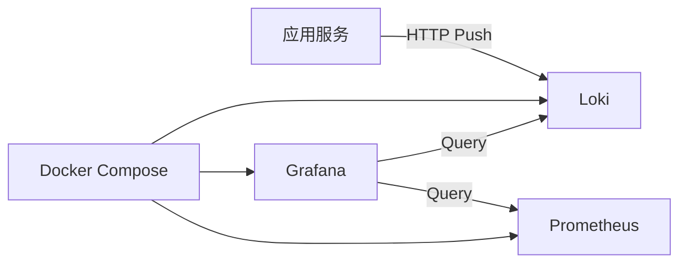

# Loki日志聚合

<cite>
**本文引用的文件**   
- [loki-config.yml](file://config/loki/loki-config.yml)
- [docker-compose.yml](file://docker-compose.yml)
- [logger.py](file://backend_design/nexus/core/logger.py)
- [observability.py](file://backend_design/nexus/config/observability.py)
</cite>

## 目录
1. [简介](#简介)
2. [项目结构](#项目结构)
3. [核心组件](#核心组件)
4. [架构总览](#架构总览)
5. [详细组件分析](#详细组件分析)
6. [依赖关系分析](#依赖关系分析)
7. [性能考虑](#性能考虑)
8. [故障排查指南](#故障排查指南)
9. [结论](#结论)
10. [附录](#附录)

## 简介
本文件面向 NexusCockpit 项目中集成的 Grafana Loki 日志聚合系统，提供从配置到使用的全链路文档。内容涵盖：
- Loki 配置文件参数详解（存储后端、索引策略、保留策略等）
- 结构化日志格式规范与标签设计原则
- 日志采集器配置方法（文件路径监听、日志轮转、错误处理）
- LogQL 查询语法与常用模式
- 日志分析技巧、性能调优与故障排查

本项目在开发环境中采用单机版 Loki，配合 Docker Compose 启动，并通过结构化日志输出 JSON 便于 Loki 采集与 Grafana 可视化。

## 项目结构
与 Loki 相关的工程化配置集中在以下位置：
- Loki 服务配置：config/loki/loki-config.yml
- 容器编排与服务挂载：docker-compose.yml
- 应用侧结构化日志实现：backend_design/nexus/core/logger.py
- 可观测性相关配置（Prometheus/Grafana/Langfuse）：backend_design/nexus/config/observability.py

图表来源
- [docker-compose.yml:248-255](file://docker-compose.yml#L248-L255)
- [docker-compose.yml:256-276](file://docker-compose.yml#L256-L276)

章节来源
- [docker-compose.yml:248-255](file://docker-compose.yml#L248-L255)
- [docker-compose.yml:256-276](file://docker-compose.yml#L256-L276)

## 核心组件
- Loki 服务：负责接收、索引、存储与查询日志数据
- 应用侧日志：基于 structlog 输出结构化 JSON，便于 Loki 解析
- 容器编排：通过 docker-compose 启动 Loki，并挂载配置文件和数据卷
- 可观测性集成：Grafana 作为统一入口，支持日志与指标联动分析

章节来源
- [loki-config.yml:1-56](file://config/loki/loki-config.yml#L1-L56)
- [docker-compose.yml:248-255](file://docker-compose.yml#L248-L255)
- [logger.py:1-249](file://backend_design/nexus/core/logger.py#L1-L249)

## 架构总览
下图展示了应用服务、Loki、Prometheus 与 Grafana 的交互关系。应用通过结构化日志输出 JSON，Loki 接收并索引；Grafana 通过数据源分别查询 Loki 与 Prometheus，形成统一的观测视图。

图表来源
- [docker-compose.yml:248-276](file://docker-compose.yml#L248-L276)
- [loki-config.yml:8-11](file://config/loki/loki-config.yml#L8-L11)

## 详细组件分析

### Loki 配置详解
Loki 的核心配置位于 loki-config.yml，主要包含以下部分：
- 认证与服务器端口：auth_enabled、server.http_listen_port、server.grpc_listen_port
- 通用配置：common.instance_addr、common.path_prefix、common.storage.filesystem.*、common.replication_factor、common.ring.kvstore.store
- 索引与存储：schema_config.configs[*].store、object_store、schema、index.prefix、index.period
- 限制与保留：limits_config.retention_period、reject_old_samples、reject_old_samples_max_age、max_query_series
- 压缩器：compactor.working_directory、shared_store、retention_enabled
- 查询缓存：query_range.results_cache.embedded_cache.enabled、max_size_mb
- 分析上报：analytics.reporting_enabled

建议关注点：
- 存储后端为文件系统，适合单机开发环境；生产环境可切换对象存储
- 索引周期与 schema v12 决定索引粒度与查询性能
- 保留策略默认 7 天，避免磁盘无限增长
- 查询结果缓存可提升重复查询性能

章节来源
- [loki-config.yml:6-11](file://config/loki/loki-config.yml#L6-L11)
- [loki-config.yml:12-23](file://config/loki/loki-config.yml#L12-L23)
- [loki-config.yml:24-33](file://config/loki/loki-config.yml#L24-L33)
- [loki-config.yml:34-40](file://config/loki/loki-config.yml#L34-L40)
- [loki-config.yml:41-45](file://config/loki/loki-config.yml#L41-L45)
- [loki-config.yml:46-52](file://config/loki/loki-config.yml#L46-L52)
- [loki-config.yml:53-56](file://config/loki/loki-config.yml#L53-L56)

### 结构化日志规范与标签设计
应用侧通过 structlog 输出结构化 JSON 日志，具备以下特性：
- 自动时间戳、级别、模块名等元信息
- 敏感字段脱敏（API Key、Token、密码等）
- 上下文绑定（如 request_id、user_id），便于链路追踪
- 开发环境彩色控制台，生产环境 JSON 输出

标签设计原则：
- 使用小写、下划线分隔的键名（如 level、ts、msg、module）
- 业务标签保持高内聚、低耦合，避免过度细分导致索引膨胀
- 对敏感字段进行掩码或移除，防止泄露

章节来源
- [logger.py:1-249](file://backend_design/nexus/core/logger.py#L1-L249)

### 日志采集器配置方法
当前项目在开发环境下未部署独立的日志采集器（如 Filebeat）。推荐实践：
- 将应用日志输出至标准输出（stdout）或文件，由容器运行时或采集器收集
- 若使用文件采集器，需配置：
  - 文件路径监听：匹配日志文件路径与命名规则
  - 日志轮转：按大小或时间切分，避免单文件过大
  - 错误处理：重试机制、死信队列、告警通知
- 在 Docker 环境中，可通过 sidecar 或 DaemonSet 方式部署采集器

注意：本项目中应用日志写入 logs/backend_logs/ 目录，可在生产环境结合采集器统一接入 Loki。

章节来源
- [logger.py:97-104](file://backend_design/nexus/core/logger.py#L97-L104)

### 日志查询语法（LogQL）与常用模式
LogQL 是 Loki 的查询语言，支持：
- 流选择器：{label="value"}
- 行过滤：|= "keyword"
- 表达式：sum(rate({job="app"} |= "error" | line_format "{{.msg}}"))
- 函数：line_format、json、drop、keep、count_values 等

常用查询模式：
- 按级别筛选：{job="app"} |= "ERROR"
- 按用户维度：{user_id="123"}
- 聚合统计：count_over_time({job="app"}[5m])
- 关联指标：在 Grafana 中将日志与 Prometheus 指标联动展示

提示：确保日志中包含必要的标签（如 job、level、module），以提升查询效率与准确性。

### 日志分析技巧
- 使用 line_format 提取关键字段，便于后续聚合
- 结合 json() 函数解析 JSON 日志中的嵌套字段
- 利用 drop/keep 过滤无关日志，减少数据传输量
- 在 Grafana 中创建看板，将日志与指标、追踪数据整合展示

### 性能调优建议
- 合理设置索引周期（index.period），平衡查询性能与存储成本
- 启用查询结果缓存（embedded_cache），提升高频查询响应速度
- 控制 max_query_series，避免单次查询返回过多数据
- 调整 retention_period，根据业务需求与存储容量动态调整

### 故障排查方法
- 检查 Loki 服务健康状态与端口监听
- 验证应用日志是否成功推送到 Loki（HTTP 200/204）
- 查看 Loki 日志与指标，定位索引失败或存储异常
- 使用 Grafana 的“Explore”功能逐步缩小查询范围

## 依赖关系分析
Loki 在本项目中的依赖关系如下：
- 应用服务依赖 Loki HTTP API 推送日志
- Grafana 依赖 Loki 与 Prometheus 数据源
- Docker Compose 管理所有服务的生命周期与网络通信

图表来源
- [docker-compose.yml:248-276](file://docker-compose.yml#L248-L276)

章节来源
- [docker-compose.yml:248-276](file://docker-compose.yml#L248-L276)

## 性能考虑
- 存储后端选择：文件系统适合开发，对象存储适合生产
- 索引策略：v12 schema 与 24h 周期在开发与生产间取得平衡
- 查询缓存：embedded_cache 可显著降低重复查询延迟
- 资源限制：合理设置内存与 CPU 配额，避免 OOM

## 故障排查指南
常见问题与解决思路：
- 日志未入库：检查 Loki 端口、网络连通性与权限
- 查询缓慢：优化标签设计，减少全表扫描
- 磁盘增长过快：调整 retention_period 与 compactor 策略
- 敏感信息泄露：确认脱敏处理器生效，避免输出密钥

章节来源
- [logger.py:36-80](file://backend_design/nexus/core/logger.py#L36-L80)

## 结论
NexusCockpit 项目通过 Loki 实现了集中式日志聚合，结合结构化日志与 Grafana 提供了完整的观测能力。在生产环境中，建议进一步优化存储后端、索引策略与查询性能，并完善日志采集与监控告警体系。

## 附录
- Loki 官方文档：https://grafana.com/docs/loki/latest/
- LogQL 语法参考：https://grafana.com/docs/loki/latest/query/query_language/
- 结构化日志最佳实践：https://structlog.readthedocs.io/