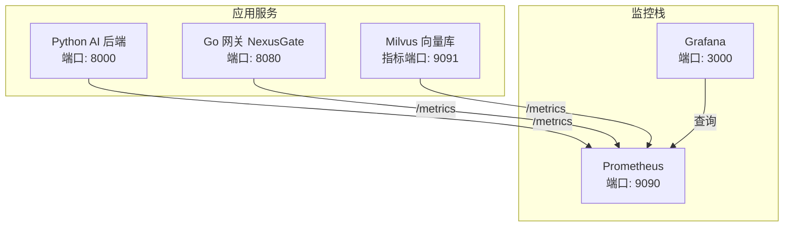
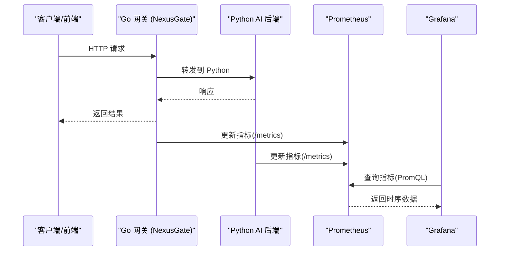
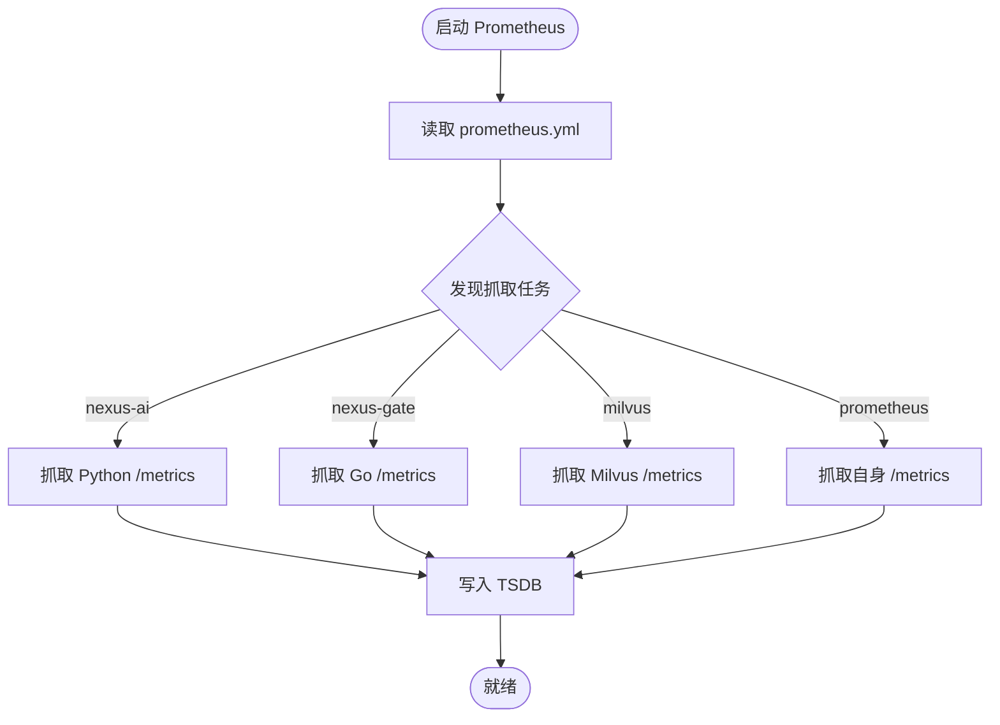
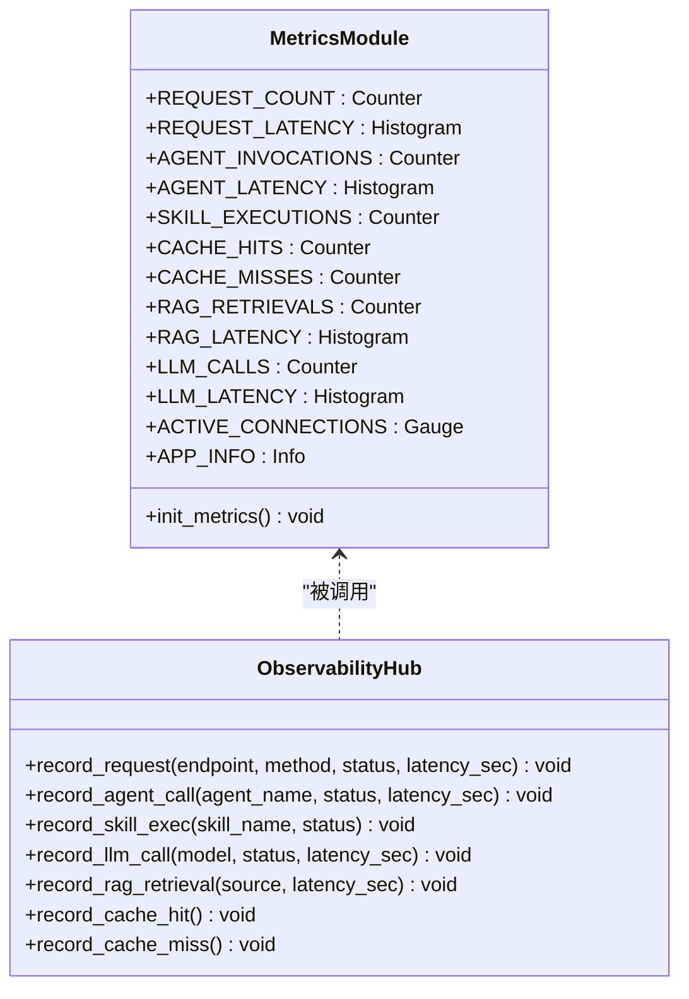
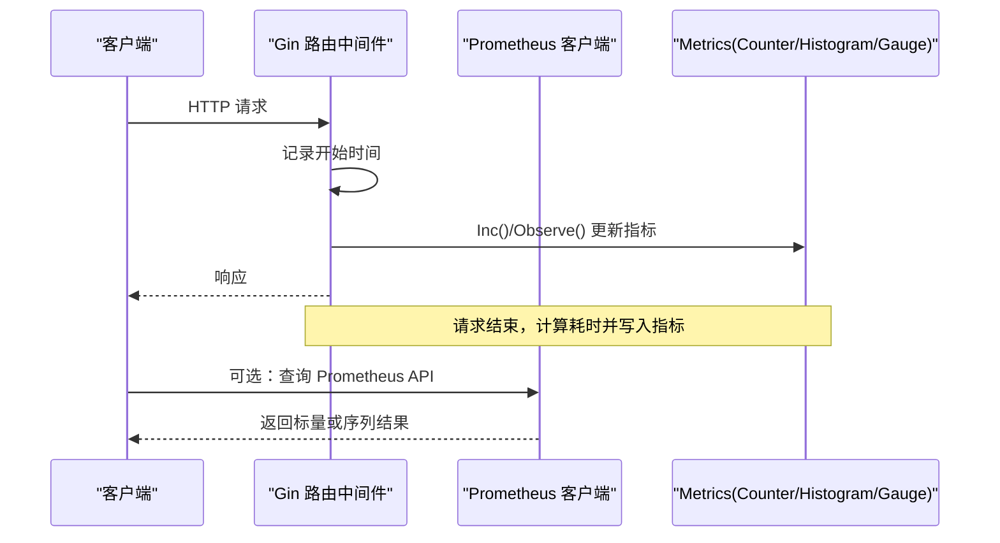
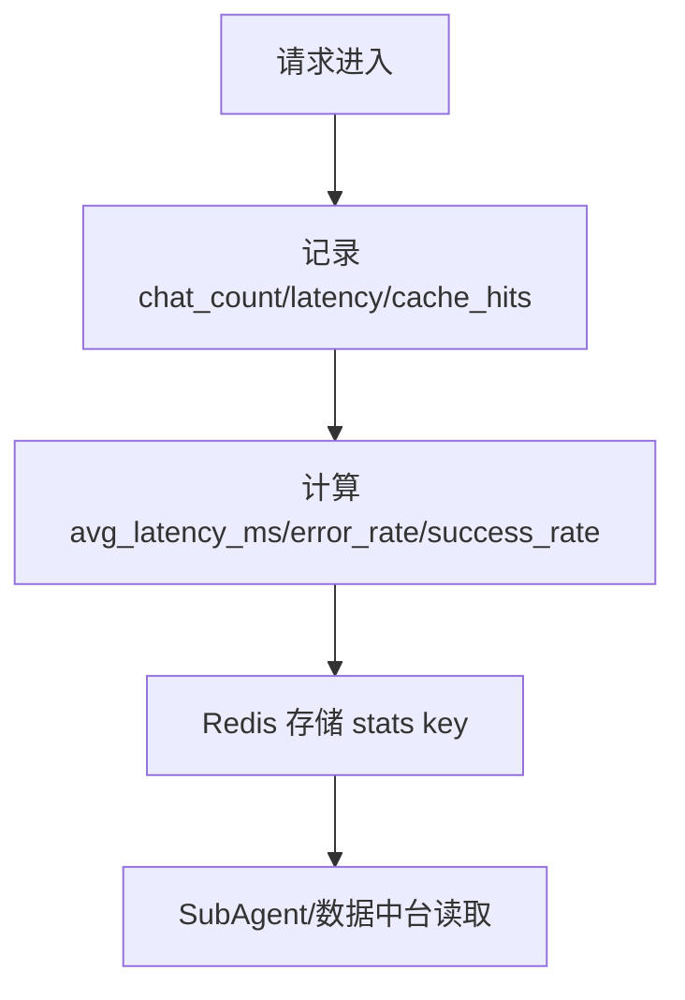
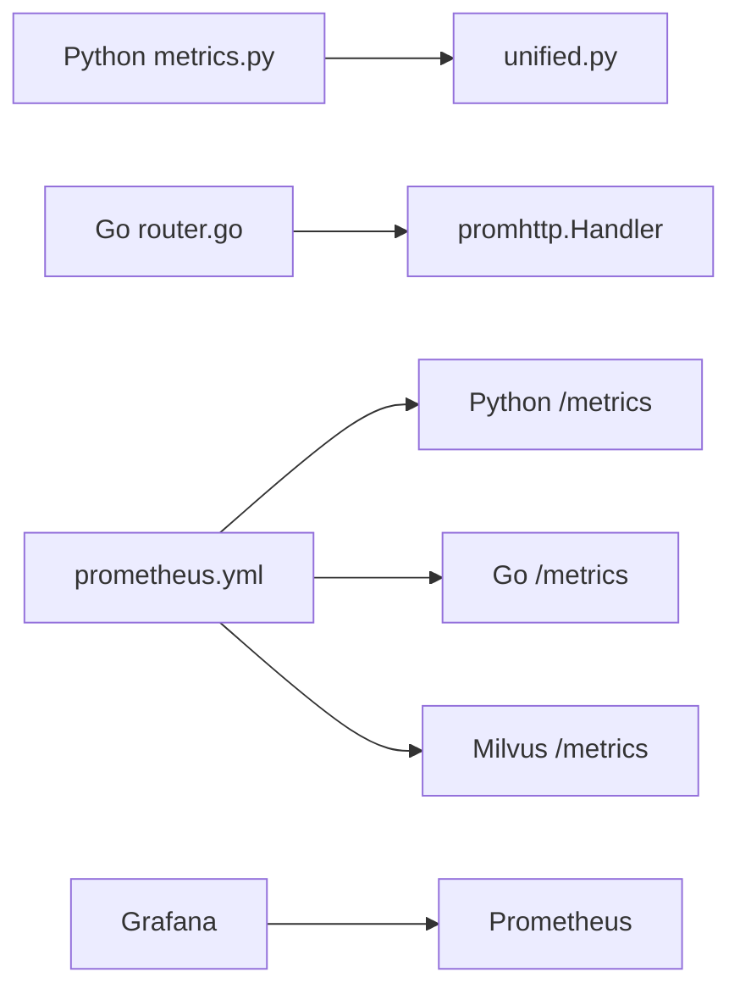

# Prometheus监控

<cite>
**本文引用的文件**   
- [prometheus.yml](file://config/prometheus/prometheus.yml)
- [docker-compose.yml](file://docker-compose.yml)
- [metrics.py](file://backend_design/nexus/observability/metrics.py)
- [unified.py](file://backend_design/nexus/observability/unified.py)
- [cockpit_metrics.py](file://backend_design/nexus/observability/cockpit_metrics.py)
- [router.go](file://backend_design/nexus_gate/internal/router/router.go)
- [prometheus_client.go](file://backend_design/nexus_gate/internal/handlers/prometheus_client.go)
- [nexuscockpit-overview.json](file://config/grafana/provisioning/dashboards/nexuscockpit-overview.json)
</cite>

## 目录
1. [简介](#简介)
2. [项目结构](#项目结构)
3. [核心组件](#核心组件)
4. [架构总览](#架构总览)
5. [详细组件分析](#详细组件分析)
6. [依赖关系分析](#依赖关系分析)
7. [性能考虑](#性能考虑)
8. [故障排查指南](#故障排查指南)
9. [结论](#结论)
10. [附录：PromQL使用指南与常用查询](#附录promql使用指南与常用查询)

## 简介
本文件为 NexusCockpit 项目的 Prometheus 监控系统提供完整文档，涵盖配置、指标采集、埋点方法、命名规范、数据类型选择、性能优化建议以及 PromQL 使用指南。项目通过 Python AI 后端与 Go 网关分别暴露 /metrics 端点，由 Prometheus 统一抓取；Milvus 向量数据库的指标也一并纳入采集。Grafana 预置了“NexusCockpit Overview”仪表盘，便于快速观察关键业务与系统指标。

## 项目结构
- 配置文件
  - Prometheus 抓取配置：config/prometheus/prometheus.yml
  - Grafana 数据源与仪表盘：config/grafana/provisioning/datasources/prometheus.yml、config/grafana/provisioning/dashboards/nexuscockpit-overview.json
  - 容器编排：docker-compose.yml（包含 Prometheus、Grafana、Python、Go、Milvus 等）
- 代码实现
  - Python 指标定义与统一可观测性门面：backend_design/nexus/observability/metrics.py、unified.py、cockpit_metrics.py
  - Go 网关指标与 Prometheus 查询客户端：backend_design/nexus_gate/internal/router/router.go、backend_design/nexus_gate/internal/handlers/prometheus_client.go

**图表来源** 
- [prometheus.yml:1-35](file://config/prometheus/prometheus.yml#L1-L35)
- [docker-compose.yml:256-276](file://docker-compose.yml#L256-L276)

**章节来源**
- [prometheus.yml:1-35](file://config/prometheus/prometheus.yml#L1-L35)
- [docker-compose.yml:256-276](file://docker-compose.yml#L256-L276)

## 核心组件
- Prometheus 抓取配置
  - 全局抓取间隔与评估间隔：15s
  - Job 列表：nexus-ai（Python）、nexus-gate（Go）、milvus（向量库）、prometheus（自身）
- Python 指标
  - 请求计数与延迟直方图、Agent 调用与延迟、技能执行、缓存命中/未命中、RAG 检索与延迟、LLM 调用与延迟、活跃连接数
  - 统一可观测性门面 ObservabilityHub 提供便捷记录方法
- Go 网关指标
  - HTTP 请求总数、请求耗时直方图、WebSocket 活跃连接数
  - 内置 /metrics 端点暴露 promhttp.Handler
- Milvus 指标
  - 通过 job_name milvus 抓取其 /metrics 端点（默认 9091）
- Grafana 仪表盘
  - 预置 overview 面板，展示 API 请求总量、P95/P99 延迟、缓存命中率、活跃连接、Agent 调用速率、RAG/LLM 延迟等

**章节来源**
- [prometheus.yml:1-35](file://config/prometheus/prometheus.yml#L1-L35)
- [metrics.py:1-108](file://backend_design/nexus/observability/metrics.py#L1-L108)
- [unified.py:1-269](file://backend_design/nexus/observability/unified.py#L1-L269)
- [router.go:32-56](file://backend_design/nexus_gate/internal/router/router.go#L32-L56)
- [nexuscockpit-overview.json:1-800](file://config/grafana/provisioning/dashboards/nexuscockpit-overview.json#L1-L800)

## 架构总览
Prometheus 作为时序指标中心，定时抓取各服务的 /metrics。Python 与 Go 分别在各自进程内维护指标状态并暴露 HTTP 接口；Milvus 自带指标端点。Grafana 通过数据源连接 Prometheus，渲染仪表盘与告警规则。

**图表来源** 
- [router.go:122-146](file://backend_design/nexus_gate/internal/router/router.go#L122-L146)
- [prometheus.yml:5-35](file://config/prometheus/prometheus.yml#L5-L35)

## 详细组件分析

### Prometheus 抓取配置详解
- 全局参数
  - scrape_interval: 15s（抓取间隔）
  - evaluation_interval: 15s（规则评估间隔）
- 抓取任务
  - nexus-ai：目标 host.docker.internal:8000，路径 /metrics
  - nexus-gate：目标 host.docker.internal:8080，路径 /metrics
  - milvus：目标 host.docker.internal:9091（Milvus 指标端口）
  - prometheus：目标 localhost:9090（用于排查抓取状态）

**图表来源** 
- [prometheus.yml:1-35](file://config/prometheus/prometheus.yml#L1-L35)

**章节来源**
- [prometheus.yml:1-35](file://config/prometheus/prometheus.yml#L1-L35)

### Python AI 后端指标与埋点
- 指标类型与用途
  - Counter：请求总数、Agent 调用次数、技能执行次数、缓存命中/未命中、RAG 检索次数、LLM 调用次数
  - Histogram：请求延迟、Agent 延迟、RAG 延迟、LLM 延迟
  - Gauge：活跃 WebSocket 连接数
  - Info：应用信息（版本、服务名、描述）
- 埋点方式
  - 直接操作指标对象（如 .inc()、.observe()）
  - 通过 ObservabilityHub 的统一方法记录（推荐）
- 初始化
  - 在应用启动时调用 init_metrics() 设置 Info 元数据

**图表来源** 
- [metrics.py:1-108](file://backend_design/nexus/observability/metrics.py#L1-L108)
- [unified.py:78-269](file://backend_design/nexus/observability/unified.py#L78-L269)

**章节来源**
- [metrics.py:1-108](file://backend_design/nexus/observability/metrics.py#L1-L108)
- [unified.py:78-269](file://backend_design/nexus/observability/unified.py#L78-L269)

### Go 网关指标与 Prometheus 查询客户端
- 指标定义
  - httpRequestsTotal：按 method、path、status、cockpit_id 分组的请求总数
  - httpRequestDuration：按 method、path 分组的请求耗时直方图
  - wsActiveConnections：按 cockpit_id 分组的活跃 WebSocket 连接数
- 中间件埋点
  - 每个请求进入中间件时记录开始时间，结束后计算耗时并更新指标
- /metrics 端点
  - 通过 promhttp.Handler() 暴露标准 Prometheus 格式
- Prometheus 查询客户端
  - queryPrometheus：向 Prometheus API 发起查询，失败时回退默认值
  - queryPrometheusPerCockpit：按座舱维度聚合并发与 QPS

**图表来源** 
- [router.go:32-56](file://backend_design/nexus_gate/internal/router/router.go#L32-L56)
- [router.go:122-146](file://backend_design/nexus_gate/internal/router/router.go#L122-L146)
- [prometheus_client.go:34-99](file://backend_design/nexus_gate/internal/handlers/prometheus_client.go#L34-L99)

**章节来源**
- [router.go:32-56](file://backend_design/nexus_gate/internal/router/router.go#L32-L56)
- [router.go:122-146](file://backend_design/nexus_gate/internal/router/router.go#L122-L146)
- [prometheus_client.go:34-99](file://backend_design/nexus_gate/internal/handlers/prometheus_client.go#L34-L99)

### Milvus 向量数据库指标采集
- 抓取配置
  - job_name: milvus，targets: host.docker.internal:9091
- 说明
  - Milvus 自带 /metrics 端点，Prometheus 可直接抓取
  - 可通过 Grafana 或 PromQL 查看 Milvus 运行状态与性能指标

**章节来源**
- [prometheus.yml:22-28](file://config/prometheus/prometheus.yml#L22-L28)

### 座舱级指标采集（Redis 聚合）
- CockpitMetrics
  - 记录对话请求（延迟、缓存命中/未命中）
  - 记录车控指令成功/失败
  - 记录错误类型计数
  - 提供实时统计查询（命中率、错误率、平均延迟、成功率）
- 使用场景
  - SubAgent 巡检从 Redis 读取实时指标
  - 数据中台从 MySQL 读取历史聚合数据

**图表来源** 
- [cockpit_metrics.py:24-180](file://backend_design/nexus/observability/cockpit_metrics.py#L24-L180)

**章节来源**
- [cockpit_metrics.py:24-180](file://backend_design/nexus/observability/cockpit_metrics.py#L24-L180)

## 依赖关系分析
- 组件耦合
  - Python 模块 metrics.py 被 unified.py 导入并使用
  - Go 网关 router.go 引入 prometheus/client_golang 暴露 /metrics
  - Prometheus 抓取配置关联 Python、Go、Milvus 与自身
- 外部依赖
  - Docker Compose 编排 Prometheus、Grafana、Python、Go、Milvus 等服务
  - Grafana 通过数据源配置连接 Prometheus

**图表来源** 
- [metrics.py:1-108](file://backend_design/nexus/observability/metrics.py#L1-L108)
- [unified.py:62-75](file://backend_design/nexus/observability/unified.py#L62-L75)
- [router.go:20-23](file://backend_design/nexus_gate/internal/router/router.go#L20-L23)
- [prometheus.yml:5-35](file://config/prometheus/prometheus.yml#L5-L35)
- [docker-compose.yml:256-276](file://docker-compose.yml#L256-L276)

**章节来源**
- [metrics.py:1-108](file://backend_design/nexus/observability/metrics.py#L1-L108)
- [unified.py:62-75](file://backend_design/nexus/observability/unified.py#L62-L75)
- [router.go:20-23](file://backend_design/nexus_gate/internal/router/router.go#L20-L23)
- [prometheus.yml:5-35](file://config/prometheus/prometheus.yml#L5-L35)
- [docker-compose.yml:256-276](file://docker-compose.yml#L256-L276)

## 性能考虑
- 抓取间隔与评估间隔
  - 当前均为 15s，适合车载语音助手场景；若负载高可适当增大至 30s
- 指标基数控制
  - Go 网关对 path 进行截断，避免高基数导致内存膨胀
  - 标签维度尽量精简（method、path、status、cockpit_id）
- 直方图桶设计
  - 合理设置 buckets，覆盖典型延迟区间（0.1s~30s），减少不必要的桶数量
- 资源占用
  - Prometheus 持久化卷挂载，确保重启后数据不丢失
  - Grafana 仪表盘查询窗口不宜过长，避免大时间范围计算开销

[本节为通用指导，无需特定文件引用]

## 故障排查指南
- 抓取失败
  - 检查 targets 可达性与端口映射（host.docker.internal 解析）
  - 确认 /metrics 端点正常返回（curl 测试）
- 指标缺失
  - 确认应用已调用 init_metrics()（Python）
  - 确认中间件已注册（Go）
- 查询异常
  - 使用 Prometheus 查询客户端的 fallback 机制，避免影响主流程
- 常见错误
  - 标签基数过高导致内存增长
  - 直方图桶过密或过疏影响分位数准确性

**章节来源**
- [prometheus_client.go:34-79](file://backend_design/nexus_gate/internal/handlers/prometheus_client.go#L34-L79)
- [router.go:122-146](file://backend_design/nexus_gate/internal/router/router.go#L122-L146)

## 结论
本项目通过标准化的 Prometheus 指标体系与统一的埋点入口，实现了 Python AI 后端、Go 网关与 Milvus 的全面监控。结合 Grafana 仪表盘与 PromQL 查询能力，能够快速定位问题、评估性能并支撑告警策略。建议在后续迭代中持续优化指标基数与直方图桶设计，并根据业务变化调整抓取与评估间隔。

[本节为总结性内容，无需特定文件引用]

## 附录：PromQL使用指南与常用查询
- 基础概念
  - 瞬时向量、区间向量、标量
  - 函数：rate、increase、sum、histogram_quantile、avg、max、min
- 常用查询示例
  - 请求总量（最近 5 分钟）：sum(increase(nexus_requests_total[5m]))
  - 请求速率（按方法分组）：sum(rate(nexus_requests_total[1m])) by (method)
  - P95 延迟（秒）：histogram_quantile(0.95, sum(rate(nexus_request_latency_seconds_bucket[5m])) by (le))
  - 缓存命中率（1 小时）：sum(increase(nexus_cache_hits_total[1h])) / clamp_min(sum(increase(nexus_cache_hits_total[1h])) + sum(increase(nexus_cache_misses_total[1h])), 1) * 100
  - 活跃连接数：nexus_active_connections
  - Agent 调用速率（1 小时）：sum(rate(nexus_agent_invocations_total[1h])) by (agent_name)
  - 每座舱 QPS：sum(rate(nexus_requests_total{cockpit_id="cockpit-01"}[1m]))

**章节来源**
- [nexuscockpit-overview.json:79-800](file://config/grafana/provisioning/dashboards/nexuscockpit-overview.json#L79-L800)