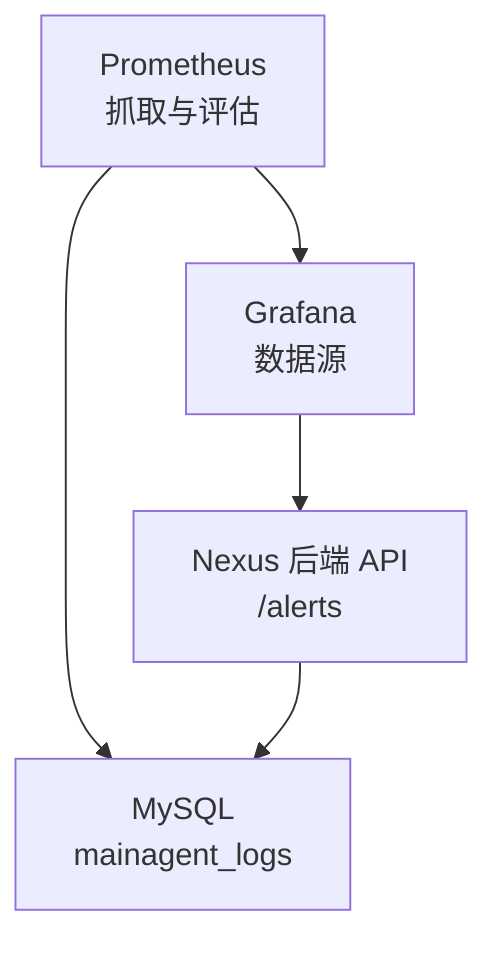
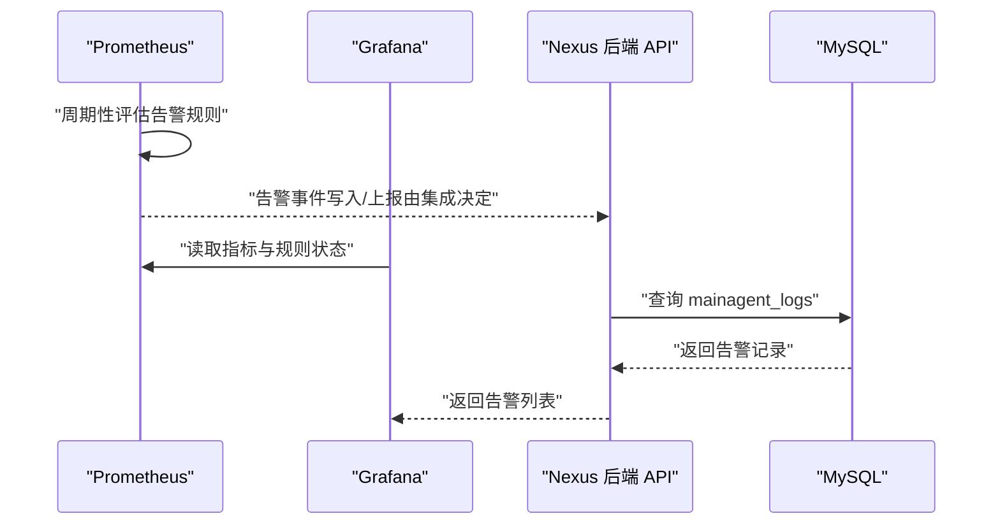
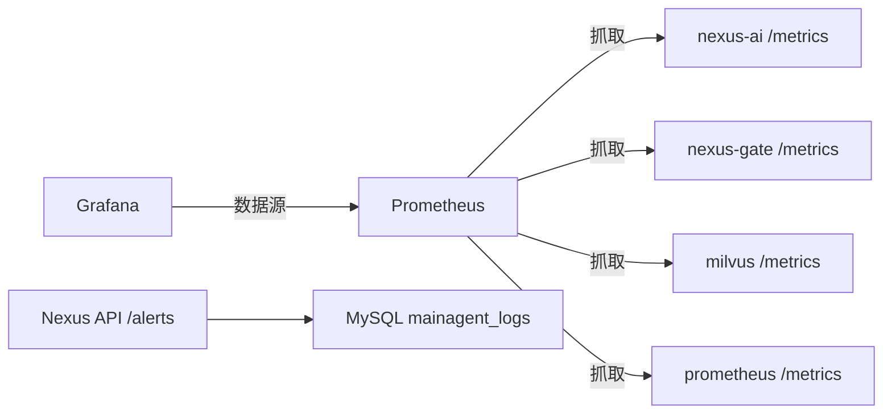

# 告警规则配置

<cite>
**本文引用的文件**   
- [prometheus.yml](file://config/prometheus/prometheus.yml)
- [datasources/prometheus.yml](file://config/grafana/provisioning/datasources/prometheus.yml)
- [dataplatform.py](file://backend_design/nexus/api/routes/dataplatform.py)
- [db_manager.py](file://backend_design/nexus/core/db_manager.py)
- [cockpit.py](file://backend_design/nexus/models/cockpit.py)
</cite>

## 目录
1. [简介](#简介)
2. [项目结构](#项目结构)
3. [核心组件](#核心组件)
4. [架构总览](#架构总览)
5. [详细组件分析](#详细组件分析)
6. [依赖关系分析](#依赖关系分析)
7. [性能考量](#性能考量)
8. [故障排查指南](#故障排查指南)
9. [结论](#结论)
10. [附录](#附录)

## 简介
本文件面向 Prometheus 告警规则系统，结合仓库中现有的 Prometheus 抓取与 Grafana 数据源配置、后端告警历史接口与数据库表结构，提供：
- Prometheus 告警规则编写语法与条件表达式要点（基于 Prometheus 官方能力）
- 告警级别定义（Info、Warning、Critical）及对应处理策略建议
- 通知渠道配置方法（邮件、钉钉、企业微信等）
- 告警抑制、静默与升级策略的配置思路
- 常见业务场景的告警规则示例（服务不可用、响应时间过长、错误率过高等）
- 告警测试方法与调试技巧

说明：本项目当前未内置自定义告警引擎，告警由 Prometheus 计算并触发，后端通过 API 暴露历史告警记录，存储于 MySQL。

## 项目结构
与告警相关的关键位置：
- config/prometheus/prometheus.yml：Prometheus 抓取配置（scrape_interval、evaluation_interval、目标 job）
- config/grafana/provisioning/datasources/prometheus.yml：Grafana 数据源指向 Prometheus
- backend_design/nexus/api/routes/dataplatform.py：告警历史查询接口 /alerts
- backend_design/nexus/core/db_manager.py：MySQL 表结构与索引（mainagent_logs 包含 alert_time、alert_type、severity 等字段）
- backend_design/nexus/models/cockpit.py：AlertRecord 模型（id、cockpit_id、alert_time、alert_type、severity、action_taken）

图表来源
- [prometheus.yml:1-35](file://config/prometheus/prometheus.yml#L1-L35)
- [datasources/prometheus.yml:1-14](file://config/grafana/provisioning/datasources/prometheus.yml#L1-L14)
- [dataplatform.py:99-147](file://backend_design/nexus/api/routes/dataplatform.py#L99-L147)
- [db_manager.py:190-206](file://backend_design/nexus/core/db_manager.py#L190-L206)
- [cockpit.py:100-109](file://backend_design/nexus/models/cockpit.py#L100-L109)

章节来源
- [prometheus.yml:1-35](file://config/prometheus/prometheus.yml#L1-L35)
- [datasources/prometheus.yml:1-14](file://config/grafana/provisioning/datasources/prometheus.yml#L1-L14)
- [dataplatform.py:99-147](file://backend_design/nexus/api/routes/dataplatform.py#L99-L147)
- [db_manager.py:190-206](file://backend_design/nexus/core/db_manager.py#L190-L206)
- [cockpit.py:100-109](file://backend_design/nexus/models/cockpit.py#L100-L109)

## 核心组件
- Prometheus 抓取与评估：负责从各服务拉取指标并周期性评估告警规则
- Grafana 数据源：将 Prometheus 作为默认数据源，便于可视化与规则管理
- 后端告警历史接口：提供最近 N 小时告警记录查询，支持按座舱过滤
- MySQL 告警表：持久化告警事件，包含时间、类型、严重级别、处置动作等

章节来源
- [prometheus.yml:1-35](file://config/prometheus/prometheus.yml#L1-L35)
- [datasources/prometheus.yml:1-14](file://config/grafana/provisioning/datasources/prometheus.yml#L1-L14)
- [dataplatform.py:99-147](file://backend_design/nexus/api/routes/dataplatform.py#L99-L147)
- [db_manager.py:190-206](file://backend_design/nexus/core/db_manager.py#L190-L206)
- [cockpit.py:100-109](file://backend_design/nexus/models/cockpit.py#L100-L109)

## 架构总览
Prometheus 定期抓取指标并评估规则；当满足条件时生成告警事件。后端通过 API 暴露历史告警，供前端或运维工具消费。Grafana 通过数据源连接 Prometheus 进行展示与规则编辑。

图表来源
- [prometheus.yml:1-35](file://config/prometheus/prometheus.yml#L1-L35)
- [datasources/prometheus.yml:1-14](file://config/grafana/provisioning/datasources/prometheus.yml#L1-L14)
- [dataplatform.py:99-147](file://backend_design/nexus/api/routes/dataplatform.py#L99-L147)
- [db_manager.py:190-206](file://backend_design/nexus/core/db_manager.py#L190-L206)

## 详细组件分析

### Prometheus 抓取与评估
- 抓取间隔与评估间隔：全局配置了 scrape_interval 与 evaluation_interval，影响告警触发频率与延迟
- 抓取目标：Python AI 后端、Go Gateway、Milvus、Prometheus 自身
- 指标路径：统一使用 /metrics

章节来源
- [prometheus.yml:1-35](file://config/prometheus/prometheus.yml#L1-L35)

### Grafana 数据源
- 名称与类型：Prometheus
- 访问方式：proxy
- URL：http://prometheus:9090
- 默认启用与可编辑：isDefault=true, editable=true
- HTTP 方法与时间间隔：POST，15s

章节来源
- [datasources/prometheus.yml:1-14](file://config/grafana/provisioning/datasources/prometheus.yml#L1-L14)

### 告警历史接口
- 路由：GET /alerts
- 参数：hours（默认 24）、cockpit_id（可选）
- 行为：从 MySQL mainagent_logs 查询最近 N 小时告警，按时间倒序限制条数；对 JSON 字段做解析与时间格式化

章节来源
- [dataplatform.py:99-147](file://backend_design/nexus/api/routes/dataplatform.py#L99-L147)

### 告警数据存储模型
- 表名：mainagent_logs
- 关键字段：cockpit_id、alert_time、alert_type、severity、action_taken
- 索引：idx_cockpit_time（cockpit_id, alert_time）

章节来源
- [db_manager.py:190-206](file://backend_design/nexus/core/db_manager.py#L190-L206)

### 告警记录模型
- AlertRecord：id、cockpit_id、alert_time、alert_type、severity、action_taken

章节来源
- [cockpit.py:100-109](file://backend_design/nexus/models/cockpit.py#L100-L109)

## 依赖关系分析
- Prometheus 抓取 Python AI 后端与 Go Gateway 的 /metrics
- Grafana 以 Prometheus 为数据源
- 后端 API 依赖 MySQL 主库读取告警历史
- 告警记录在 MySQL 中以结构化字段保存，便于检索与统计

图表来源
- [prometheus.yml:1-35](file://config/prometheus/prometheus.yml#L1-L35)
- [datasources/prometheus.yml:1-14](file://config/grafana/provisioning/datasources/prometheus.yml#L1-L14)
- [dataplatform.py:99-147](file://backend_design/nexus/api/routes/dataplatform.py#L99-L147)
- [db_manager.py:190-206](file://backend_design/nexus/core/db_manager.py#L190-L206)

章节来源
- [prometheus.yml:1-35](file://config/prometheus/prometheus.yml#L1-L35)
- [datasources/prometheus.yml:1-14](file://config/grafana/provisioning/datasources/prometheus.yml#L1-L14)
- [dataplatform.py:99-147](file://backend_design/nexus/api/routes/dataplatform.py#L99-L147)
- [db_manager.py:190-206](file://backend_design/nexus/core/db_manager.py#L190-L206)

## 性能考量
- 抓取与评估间隔：当前均为 15s，适合中小规模监控；若指标量增大，需评估是否调整以避免评估压力
- 告警查询限制：/alerts 接口限制返回最多 100 条，避免大结果集拖慢前端
- 数据库索引：mainagent_logs 已建立 (cockpit_id, alert_time) 索引，利于按时间与座舱快速检索
- 指标采集范围：仅采集必要指标，减少不必要的标签基数，降低内存与查询开销

章节来源
- [prometheus.yml:1-35](file://config/prometheus/prometheus.yml#L1-L35)
- [dataplatform.py:99-147](file://backend_design/nexus/api/routes/dataplatform.py#L99-L147)
- [db_manager.py:190-206](file://backend_design/nexus/core/db_manager.py#L190-L206)

## 故障排查指南
- 无法抓取指标：检查 targets 与 metrics_path 是否正确，确认服务端口可达
- 告警不触发：核对 evaluation_interval 与规则中的持续时间窗口；验证指标是否存在且标签匹配
- 告警历史为空：确认后端数据库连接正常，mainagent_logs 表存在且有写入；检查 /alerts 接口参数
- 查询缓慢：确认 cockpit_id 与时间范围合理，必要时增加索引或限制返回数量

章节来源
- [prometheus.yml:1-35](file://config/prometheus/prometheus.yml#L1-L35)
- [dataplatform.py:99-147](file://backend_design/nexus/api/routes/dataplatform.py#L99-L147)
- [db_manager.py:190-206](file://backend_design/nexus/core/db_manager.py#L190-L206)

## 结论
本项目采用标准 Prometheus + Grafana 监控体系，后端提供告警历史查询与持久化存储。建议在现有基础上完善告警规则、通知渠道与治理策略，形成闭环的告警运营流程。

## 附录

### Prometheus 告警规则编写要点
- 规则文件组织：通常放在 rules/ 目录下，按服务或主题拆分
- 基本语法：groups 包含若干 rule，每条 rule 有 name、expr、for、labels、annotations
- 常用函数：rate()、irate()、sum()、avg()、histogram_quantile()、abs()、delta()、increase()
- 布尔与比较：>, <, >=, <=, ==, !=, and, or, unless
- 聚合与分组：by(...)、without(...)
- 时间窗口：[5m]、[1h]、[24h]
- 持续条件：for 字段用于稳定判定，避免抖动

章节来源
- [prometheus.yml:1-35](file://config/prometheus/prometheus.yml#L1-L35)

### 告警级别定义与处理策略
- Info：信息性提示，如容量接近阈值、计划内维护提醒；策略：记录日志、低优先级通知
- Warning：潜在风险或异常趋势，如错误率上升、延迟升高；策略：即时通知、要求关注与初步排查
- Critical：严重影响可用性，如服务不可用、错误率突增；策略：立即通知、自动升级、联动自动化处置

章节来源
- [cockpit.py:100-109](file://backend_design/nexus/models/cockpit.py#L100-L109)

### 通知渠道配置（邮件、钉钉、企业微信）
- 邮件：配置 SMTP 服务器、发件人、收件人列表、模板变量（{{ .Labels.severity }}、{{ .Annotations.summary }}）
- 钉钉：创建机器人 webhook，设置消息体格式（文本/Markdown），支持 @指定人员
- 企业微信：创建应用 webhook，配置消息类型与内容，支持富文本与卡片
- 通用：使用 Alertmanager 统一管理路由、去重、抑制与静默

章节来源
- [prometheus.yml:1-35](file://config/prometheus/prometheus.yml#L1-L35)

### 告警抑制、静默与升级策略
- 抑制：当某类高优告警触发时，抑制相关的低优告警，避免风暴
- 静默：临时屏蔽特定标签或实例的告警（如维护窗口）
- 升级：按时间阶梯升级通知对象（值班→主管→负责人），确保问题不被遗漏

章节来源
- [prometheus.yml:1-35](file://config/prometheus/prometheus.yml#L1-L35)

### 常见业务场景告警规则示例
- 服务不可用：基于存活探针或健康端点失败比例
- 响应时间过长：p95/p99 延迟超过阈值
- 错误率过高：HTTP 5xx 比例或业务错误码占比超过阈值
- 资源耗尽：CPU、内存、磁盘、连接池接近上限
- 队列积压：消息堆积长度持续增长

章节来源
- [prometheus.yml:1-35](file://config/prometheus/prometheus.yml#L1-L35)

### 告警测试与调试技巧
- 本地验证：使用 promtool 校验规则语法与有效性
- 指标回放：通过 curl 抓取 /metrics 并构造最小复现场景
- 规则调试：在 Prometheus UI 的 Expression 面板逐步验证 expr
- 观察触发：查看 Alerts 页面与历史记录，确认 for 窗口与 labels
- 端到端：模拟故障注入，验证通知到达与升级链路

章节来源
- [prometheus.yml:1-35](file://config/prometheus/prometheus.yml#L1-L35)