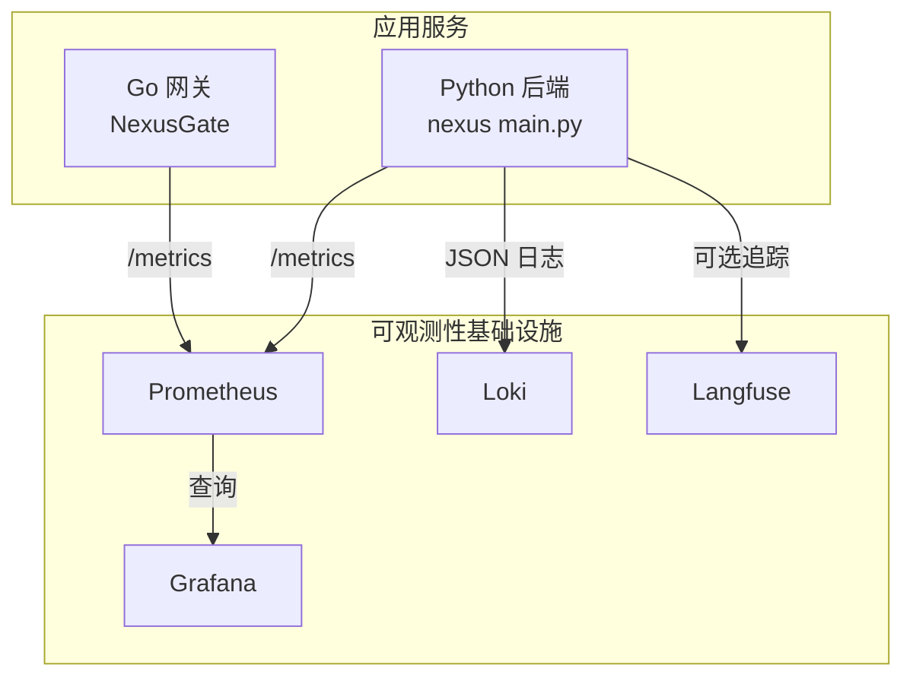
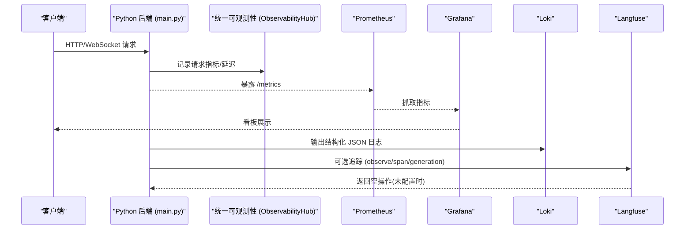
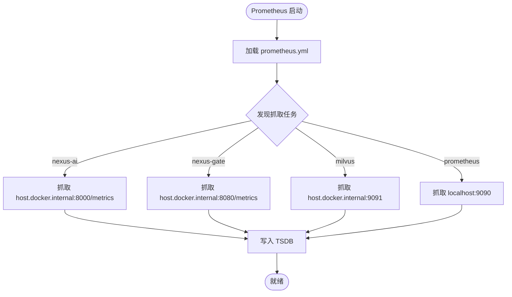
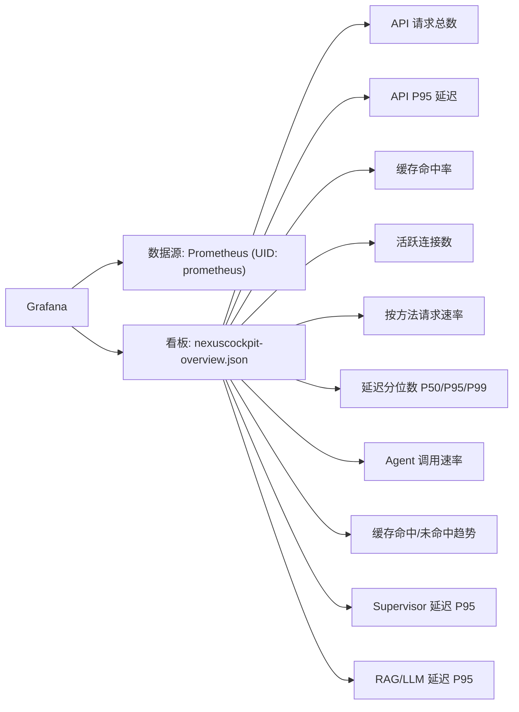
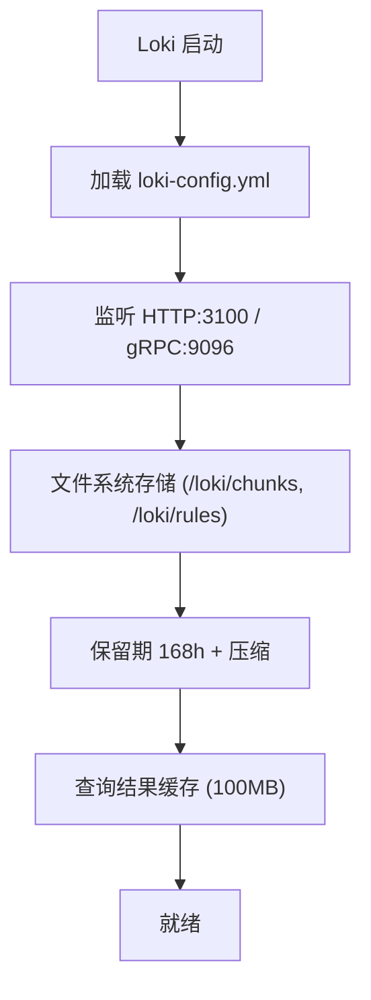
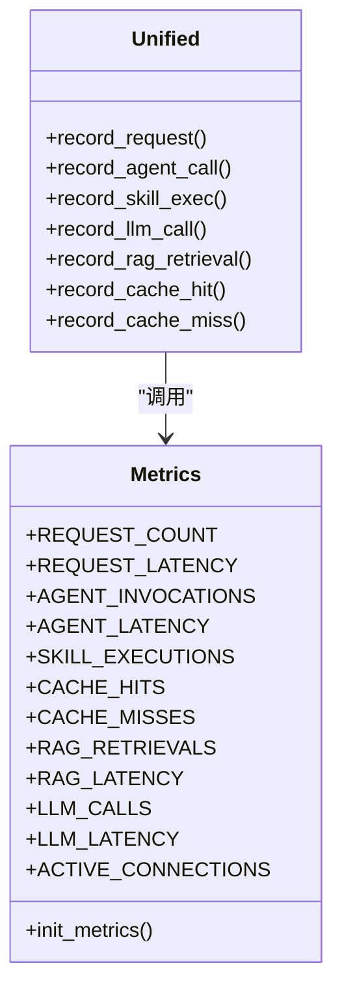
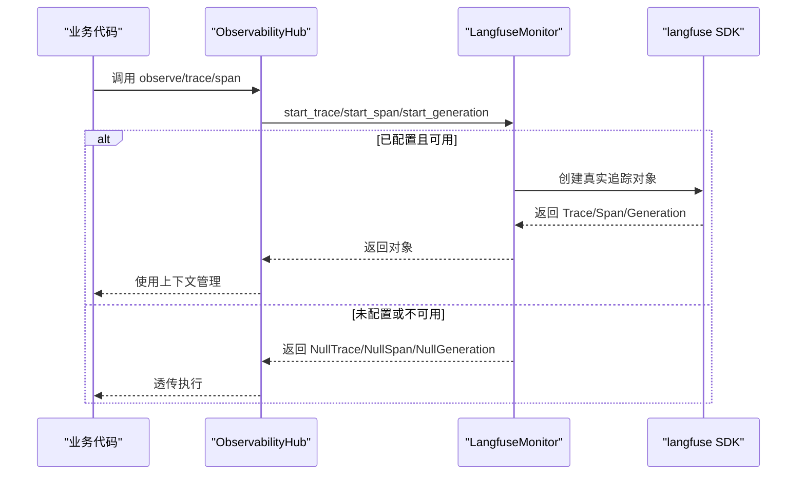
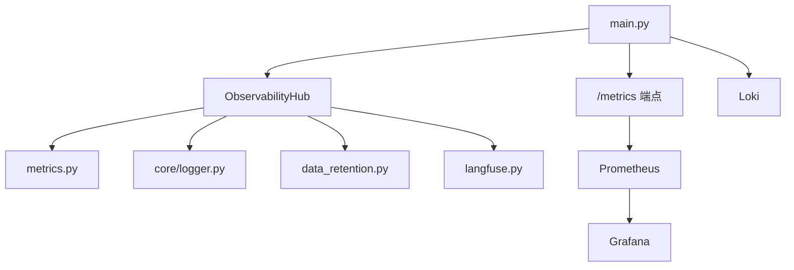

# 监控告警系统

<cite>
**本文引用的文件**   
- [config/prometheus/prometheus.yml](file://config/prometheus/prometheus.yml)
- [config/grafana/provisioning/datasources/prometheus.yml](file://config/grafana/provisioning/datasources/prometheus.yml)
- [config/grafana/provisioning/dashboards/nexuscockpit-overview.json](file://config/grafana/provisioning/dashboards/nexuscockpit-overview.json)
- [config/loki/loki-config.yml](file://config/loki/loki-config.yml)
- [backend_design/nexus/observability/metrics.py](file://backend_design/nexus/observability/metrics.py)
- [backend_design/nexus/observability/unified.py](file://backend_design/nexus/observability/unified.py)
- [backend_design/nexus/observability/langfuse.py](file://backend_design/nexus/observability/langfuse.py)
- [backend_design/nexus/observability/data_retention.py](file://backend_design/nexus/observability/data_retention.py)
- [backend_design/nexus/main.py](file://backend_design/nexus/main.py)
</cite>

## 目录
1. [简介](#简介)
2. [项目结构](#项目结构)
3. [核心组件](#核心组件)
4. [架构总览](#架构总览)
5. [详细组件分析](#详细组件分析)
6. [依赖关系分析](#依赖关系分析)
7. [性能考量](#性能考量)
8. [故障排查指南](#故障排查指南)
9. [结论](#结论)
10. [附录](#附录)

## 简介
本文件为 NexusCockpit 的监控与可观测性体系提供完整说明，覆盖 Prometheus 指标采集、Grafana 看板定制、Loki 日志聚合、Langfuse LLM 追踪部署与使用，以及告警规则、通知渠道与自动恢复策略。文档同时给出关键业务指标的埋点方法、查询语法、看板制作技巧与性能分析方法，帮助运维与研发快速定位问题并优化系统表现。

## 项目结构
NexusCockpit 的可观测性由以下部分构成：
- 指标采集与暴露：Python 后端通过 prometheus_client 暴露 /metrics；Prometheus 按 job 配置抓取 Python 后端、Go Gateway、Milvus 等目标。
- 可视化与看板：Grafana 预置数据源与“NexusCockpit 概览”看板，展示 API 请求量、延迟分位数、缓存命中率、Agent 调用速率等。
- 日志聚合：Loki 单机模式运行，统一 JSON 结构化日志，保留期默认 7 天。
- 追踪与链路：Langfuse 可选集成，未安装或未配置时自动降级为空操作。
- 统一门面：ObservabilityHub 统一初始化日志、指标、追踪与数据保留策略。

图表来源
- [backend_design/nexus/main.py:39-488](file://backend_design/nexus/main.py#L39-L488)
- [config/prometheus/prometheus.yml:1-35](file://config/prometheus/prometheus.yml#L1-L35)
- [config/grafana/provisioning/datasources/prometheus.yml:1-14](file://config/grafana/provisioning/datasources/prometheus.yml#L1-L14)
- [config/loki/loki-config.yml:1-56](file://config/loki/loki-config.yml#L1-L56)

章节来源
- [config/prometheus/prometheus.yml:1-35](file://config/prometheus/prometheus.yml#L1-L35)
- [config/grafana/provisioning/datasources/prometheus.yml:1-14](file://config/grafana/provisioning/datasources/prometheus.yml#L1-L14)
- [config/grafana/provisioning/dashboards/nexuscockpit-overview.json:1-800](file://config/grafana/provisioning/dashboards/nexuscockpit-overview.json#L1-L800)
- [config/loki/loki-config.yml:1-56](file://config/loki/loki-config.yml#L1-L56)
- [backend_design/nexus/observability/metrics.py:1-108](file://backend_design/nexus/observability/metrics.py#L1-L108)
- [backend_design/nexus/observability/unified.py:1-269](file://backend_design/nexus/observability/unified.py#L1-L269)
- [backend_design/nexus/observability/langfuse.py:1-221](file://backend_design/nexus/observability/langfuse.py#L1-L221)
- [backend_design/nexus/observability/data_retention.py:1-141](file://backend_design/nexus/observability/data_retention.py#L1-L141)
- [backend_design/nexus/main.py:39-488](file://backend_design/nexus/main.py#L39-L488)

## 核心组件
- Prometheus 指标定义与采集
  - 指标类型：Counter（累计计数）、Histogram（延迟分布）、Gauge（当前值）、Info（应用信息）。
  - 关键指标：请求总量与延迟、Agent 调用与延迟、技能执行、缓存命中/未命中、RAG 检索与延迟、LLM 调用与延迟、活跃 WebSocket 连接数。
  - 端点挂载：/metrics 由 prometheus_client 暴露，被 Prometheus 抓取。
- Grafana 数据源与看板
  - 数据源：Prometheus 通过 provision 注入，UID 为 prometheus。
  - 看板：nexuscockpit-overview.json 包含 API 请求总数、P95 延迟、缓存命中率、活跃连接、按方法分组请求速率、延迟分位数、Agent 调用速率、缓存命中/未命中趋势、Supervisor 节点延迟、RAG/LLM 延迟等面板。
- Loki 日志聚合
  - 单机模式，HTTP 端口 3100，gRPC 端口 9096，存储使用文件系统，保留期 168h，启用结果缓存。
- Langfuse 追踪
  - 可选集成，未安装或未配置时自动降级为空操作；提供 observe 装饰器与 update_current_span 更新元数据。
- 统一可观测性门面
  - ObservabilityHub 统一初始化日志、指标、追踪与数据保留；提供 record_* 便捷方法与 trace/span 上下文管理。

章节来源
- [backend_design/nexus/observability/metrics.py:1-108](file://backend_design/nexus/observability/metrics.py#L1-L108)
- [config/grafana/provisioning/datasources/prometheus.yml:1-14](file://config/grafana/provisioning/datasources/prometheus.yml#L1-L14)
- [config/grafana/provisioning/dashboards/nexuscockpit-overview.json:1-800](file://config/grafana/provisioning/dashboards/nexuscockpit-overview.json#L1-L800)
- [config/loki/loki-config.yml:1-56](file://config/loki/loki-config.yml#L1-L56)
- [backend_design/nexus/observability/langfuse.py:1-221](file://backend_design/nexus/observability/langfuse.py#L1-L221)
- [backend_design/nexus/observability/unified.py:1-269](file://backend_design/nexus/observability/unified.py#L1-L269)

## 架构总览
下图展示了从请求进入后端到指标采集、日志聚合与追踪的全链路流程。

图表来源
- [backend_design/nexus/main.py:39-488](file://backend_design/nexus/main.py#L39-L488)
- [backend_design/nexus/observability/unified.py:100-136](file://backend_design/nexus/observability/unified.py#L100-L136)
- [config/prometheus/prometheus.yml:1-35](file://config/prometheus/prometheus.yml#L1-L35)
- [config/grafana/provisioning/datasources/prometheus.yml:1-14](file://config/grafana/provisioning/datasources/prometheus.yml#L1-L14)
- [config/loki/loki-config.yml:1-56](file://config/loki/loki-config.yml#L1-L56)
- [backend_design/nexus/observability/langfuse.py:44-86](file://backend_design/nexus/observability/langfuse.py#L44-L86)

## 详细组件分析

### Prometheus 指标采集配置
- 抓取目标
  - nexus-ai：Python 后端，端口 8000，路径 /metrics。
  - nexus-gate：Go 网关，端口 8080，路径 /metrics。
  - milvus：向量数据库，端口 9091。
  - prometheus：自身指标用于抓取状态排查。
- 抓取间隔与评估间隔均为 15s。

图表来源
- [config/prometheus/prometheus.yml:1-35](file://config/prometheus/prometheus.yml#L1-L35)

章节来源
- [config/prometheus/prometheus.yml:1-35](file://config/prometheus/prometheus.yml#L1-L35)

### Grafana 看板定制
- 数据源：通过 provisioning 注入 Prometheus，UID 为 prometheus，默认 POST 方法与 15s 时间间隔。
- 概览看板：包含多个关键面板，如 API 请求总数、P95 延迟、缓存命中率、活跃连接、按方法分组请求速率、延迟分位数、Agent 调用速率、缓存命中/未命中趋势、Supervisor 节点延迟、RAG/LLM 延迟等。
- 阈值与单位：各面板内置阈值与单位（ms、s、reqps、percent），便于快速识别异常。

图表来源
- [config/grafana/provisioning/datasources/prometheus.yml:1-14](file://config/grafana/provisioning/datasources/prometheus.yml#L1-L14)
- [config/grafana/provisioning/dashboards/nexuscockpit-overview.json:1-800](file://config/grafana/provisioning/dashboards/nexuscockpit-overview.json#L1-L800)

章节来源
- [config/grafana/provisioning/datasources/prometheus.yml:1-14](file://config/grafana/provisioning/datasources/prometheus.yml#L1-L14)
- [config/grafana/provisioning/dashboards/nexuscockpit-overview.json:1-800](file://config/grafana/provisioning/dashboards/nexuscockpit-overview.json#L1-L800)

### Loki 日志聚合设置
- 监听端口：HTTP 3100，gRPC 9096。
- 存储：文件系统，chunks 与 rules 目录位于容器内 /loki。
- 保留策略：默认 168h（7 天），拒绝旧样本。
- 查询缓存：启用嵌入式缓存，最大 100MB。
- 兼容性：关闭匿名统计上报。

图表来源
- [config/loki/loki-config.yml:1-56](file://config/loki/loki-config.yml#L1-L56)

章节来源
- [config/loki/loki-config.yml:1-56](file://config/loki/loki-config.yml#L1-L56)

### 自定义指标埋点方法与关键业务指标
- 指标定义位置：metrics.py 中定义了 Counter/Histogram/Gauge/Info 等指标。
- 统一入口：unified.py 的 ObservabilityHub 提供 record_request、record_agent_call、record_skill_exec、record_llm_call、record_rag_retrieval、record_cache_hit/miss 等方法。
- 关键业务指标
  - 请求总量与延迟：nexus_requests_total、nexus_request_latency_seconds。
  - Agent 调用与延迟：nexus_agent_invocations_total、nexus_agent_latency_seconds。
  - 技能执行：nexus_skill_executions_total。
  - 缓存命中/未命中：nexus_cache_hits_total、nexus_cache_misses_total。
  - RAG 检索与延迟：nexus_rag_retrievals_total、nexus_rag_latency_seconds。
  - LLM 调用与延迟：nexus_llm_calls_total、nexus_llm_latency_seconds。
  - 活跃连接：nexus_active_connections。

图表来源
- [backend_design/nexus/observability/metrics.py:1-108](file://backend_design/nexus/observability/metrics.py#L1-L108)
- [backend_design/nexus/observability/unified.py:213-247](file://backend_design/nexus/observability/unified.py#L213-L247)

章节来源
- [backend_design/nexus/observability/metrics.py:1-108](file://backend_design/nexus/observability/metrics.py#L1-L108)
- [backend_design/nexus/observability/unified.py:213-247](file://backend_design/nexus/observability/unified.py#L213-L247)

### 告警规则配置、通知渠道集成与自动恢复策略
- 告警规则：仓库未提供 Prometheus Alertmanager 或规则文件，建议在 Prometheus 侧新增 rules 目录与 .yml 规则，结合 Alertmanager 配置通知渠道（邮件、企业微信、钉钉、Slack 等）。
- 建议告警维度
  - API 错误率突增（基于 status 标签）。
  - P95/P99 延迟超过阈值（参考看板阈值）。
  - 缓存命中率低于阈值。
  - Agent/LLM 调用失败率升高。
  - 活跃连接数异常增长。
- 自动恢复策略
  - 对 LLM/RAG 调用增加重试与超时控制。
  - 对下游依赖（Milvus、Redis）实现熔断与降级。
  - 在 Grafana 中配置自愈动作（如触发脚本重启服务或扩容）。

[本节为通用指导，不直接分析具体文件]

### Langfuse LLM 追踪系统的部署与使用
- 部署
  - 安装 langfuse SDK 并在配置中启用（host/public_key/secret_key）。
  - 未安装或未配置时，observe 装饰器与 update_current_span 自动降级为空操作，不影响业务。
- 使用
  - 使用 @observe(name=..., as_type="span"/"generation"/"agent") 装饰函数进行自动追踪。
  - 使用 update_current_span(metadata=...) 更新当前 span 的元数据。
  - 通过 LangfuseMonitor.start_trace/start_span/start_generation 手动创建与管理追踪。

图表来源
- [backend_design/nexus/observability/langfuse.py:44-86](file://backend_design/nexus/observability/langfuse.py#L44-L86)
- [backend_design/nexus/observability/langfuse.py:144-221](file://backend_design/nexus/observability/langfuse.py#L144-L221)
- [backend_design/nexus/observability/unified.py:175-208](file://backend_design/nexus/observability/unified.py#L175-L208)

章节来源
- [backend_design/nexus/observability/langfuse.py:1-221](file://backend_design/nexus/observability/langfuse.py#L1-221)
- [backend_design/nexus/observability/unified.py:175-208](file://backend_design/nexus/observability/unified.py#L175-L208)

### 监控数据的查询语法与看板制作技巧
- 常用查询语法
  - 请求总量：sum(increase(nexus_requests_total[5m]))
  - 延迟分位数：histogram_quantile(0.95, sum(rate(nexus_request_latency_seconds_bucket[5m])) by (le))
  - 缓存命中率：sum(increase(nexus_cache_hits_total[1h])) / clamp_min(sum(increase(nexus_cache_hits_total[1h])) + sum(increase(nexus_cache_misses_total[1h])), 1) * 100
  - 活跃连接：nexus_active_connections
  - 按方法请求速率：sum(rate(nexus_requests_total[1m])) by (method)
  - Agent 调用速率：sum(rate(nexus_agent_invocations_total[1h])) by (agent_name)
  - Supervisor 延迟 P95：histogram_quantile(0.95, sum(rate(nexus_agent_latency_seconds_bucket[1h])) by (le, agent_name))
  - RAG/LLM 延迟 P95：对应 histogram_quantile 表达式
- 看板制作技巧
  - 使用阈值颜色区分健康/警告/异常状态。
  - 合理选择时间窗口（1m/5m/1h）以平衡实时性与稳定性。
  - 使用变量过滤（endpoint/method/agent_name/model/source）提升灵活性。
  - 将关键面板置顶，并添加描述与参考阈值。

章节来源
- [config/grafana/provisioning/dashboards/nexuscockpit-overview.json:1-800](file://config/grafana/provisioning/dashboards/nexuscockpit-overview.json#L1-L800)

### 性能分析工具的使用方法
- Prometheus 自身指标：用于排查抓取状态与延迟。
- Grafana Explore：交互式查询与调试 PromQL。
- Loki LogQL：按标签与内容过滤日志，关联 trace_id 定位问题。
- Langfuse UI：查看 trace/span/generation 详情，分析 LLM 调用链路与延迟。

[本节为通用指导，不直接分析具体文件]

## 依赖关系分析
- 指标模块依赖 prometheus_client，统一门面依赖 metrics、logger、data_retention、langfuse。
- main.py 挂载 /metrics 端点，并在中间件层记录请求指标（排除 /metrics 自引用）。
- Grafana 数据源与看板通过 provisioning 自动注入。
- Loki 独立运行，接收结构化日志。
- Langfuse 可选，未配置时降级为空操作。

图表来源
- [backend_design/nexus/main.py:39-488](file://backend_design/nexus/main.py#L39-L488)
- [backend_design/nexus/observability/unified.py:1-269](file://backend_design/nexus/observability/unified.py#L1-269)
- [backend_design/nexus/observability/metrics.py:1-108](file://backend_design/nexus/observability/metrics.py#L1-L108)
- [backend_design/nexus/observability/data_retention.py:1-141](file://backend_design/nexus/observability/data_retention.py#L1-L141)
- [backend_design/nexus/observability/langfuse.py:1-221](file://backend_design/nexus/observability/langfuse.py#L1-L221)

章节来源
- [backend_design/nexus/main.py:39-488](file://backend_design/nexus/main.py#L39-L488)
- [backend_design/nexus/observability/unified.py:1-269](file://backend_design/nexus/observability/unified.py#L1-L269)

## 性能考量
- 指标粒度与桶大小：Histogram 的 buckets 需根据业务延迟分布调整，避免过多桶导致内存占用过高。
- 抓取频率：scrape_interval 与 evaluation_interval 影响资源消耗与实时性，建议 15s 起步并根据负载调优。
- 日志保留：Loki 保留期与压缩策略需结合磁盘容量与合规要求设定。
- 追踪开销：Langfuse 开启后会产生额外网络与序列化开销，可在低峰期或测试环境启用。
- 缓存命中率：关注缓存命中/未命中趋势，过低可能意味着热点不足或键设计不合理。

[本节为通用指导，不直接分析具体文件]

## 故障排查指南
- 指标缺失
  - 检查 /metrics 是否可达（浏览器或 curl 访问）。
  - 确认 Prometheus 抓取目标与 labels 是否正确。
  - 查看 Prometheus 抓取日志与目标状态。
- 看板无数据
  - 验证 Grafana 数据源 URL 与 UID。
  - 在 Explore 中执行基础查询，确认指标存在。
- 日志无法查询
  - 检查 Loki 端口与路径前缀。
  - 确认日志格式为 JSON 且包含必要字段（如 trace_id）。
- 追踪未生效
  - 确认 Langfuse 配置与 SDK 安装。
  - 观察 observe 装饰器是否应用到目标函数。
- 数据膨胀
  - 检查 data_retention 清理任务是否正常运行。
  - 调整保留策略与清理间隔。

章节来源
- [backend_design/nexus/observability/data_retention.py:78-128](file://backend_design/nexus/observability/data_retention.py#L78-L128)
- [config/prometheus/prometheus.yml:1-35](file://config/prometheus/prometheus.yml#L1-L35)
- [config/grafana/provisioning/datasources/prometheus.yml:1-14](file://config/grafana/provisioning/datasources/prometheus.yml#L1-L14)
- [config/loki/loki-config.yml:1-56](file://config/loki/loki-config.yml#L1-L56)
- [backend_design/nexus/observability/langfuse.py:44-86](file://backend_design/nexus/observability/langfuse.py#L44-L86)

## 结论
NexusCockpit 的可观测性体系以 Prometheus 指标为核心，结合 Grafana 看板、Loki 日志与可选 Langfuse 追踪，形成完整的监控与诊断闭环。通过统一门面与标准化埋点，业务指标与系统指标一致化呈现，便于快速定位与优化。建议在生产环境补充告警规则与通知渠道，并结合自动恢复策略提升系统韧性。

[本节为总结，不直接分析具体文件]

## 附录
- 指标命名规范：使用前缀 nexus_，按功能域划分（requests、agent、skill、cache、rag、llm、active_connections）。
- 看板模板：可直接导入 nexuscockpit-overview.json，按需扩展。
- 日志格式：统一 JSON，包含时间戳、级别、事件、上下文（request_id、user_id、trace_id）。
- 追踪最佳实践：在关键节点（路由、记忆召回、专家调度、RAG、LLM 调用）埋点，记录输入输出与耗时。

[本节为补充说明，不直接分析具体文件]