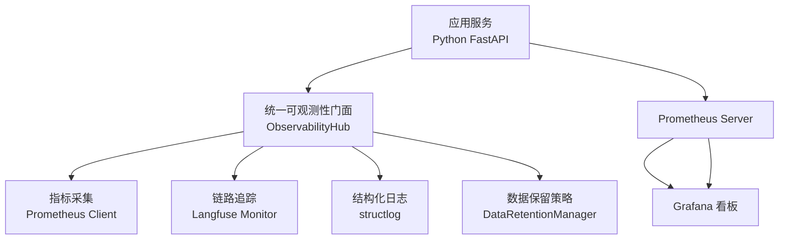
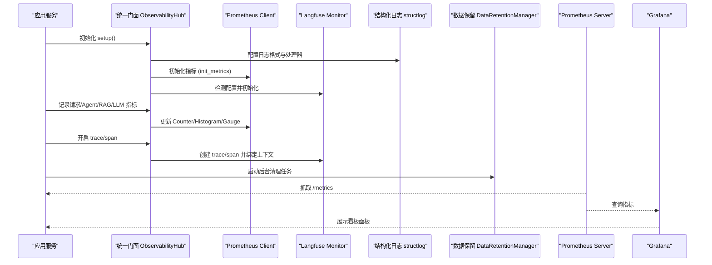
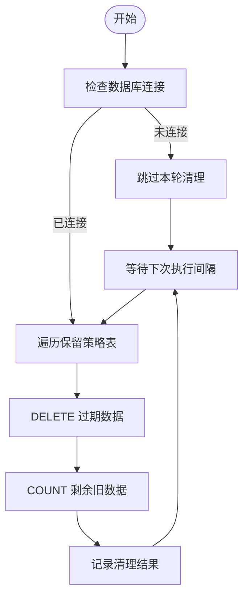
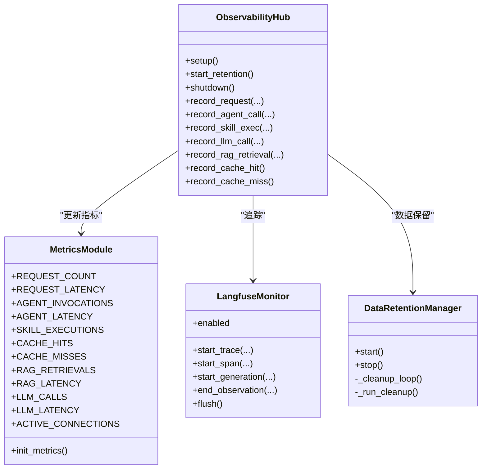

# 监控最佳实践

<cite>
**本文引用的文件**   
- [metrics.py](file://backend_design/nexus/observability/metrics.py)
- [unified.py](file://backend_design/nexus/observability/unified.py)
- [data_retention.py](file://backend_design/nexus/observability/data_retention.py)
- [langfuse.py](file://backend_design/nexus/observability/langfuse.py)
- [logger.py](file://backend_design/nexus/core/logger.py)
- [observability.py](file://backend_design/nexus/config/observability.py)
- [prometheus.yml](file://config/prometheus/prometheus.yml)
- [grafana-datasource.yml](file://config/grafana/provisioning/datasources/prometheus.yml)
- [nexuscockpit-overview.json](file://config/grafana/provisioning/dashboards/nexuscockpit-overview.json)
- [health.py](file://backend_design/nexus/api/routes/health.py)
- [02-系统运维与故障排查手册.md](file://docs/交付版文档包/02-系统运维与故障排查手册.md)
</cite>

## 目录
1. [引言](#引言)
2. [项目结构](#项目结构)
3. [核心组件](#核心组件)
4. [架构总览](#架构总览)
5. [详细组件分析](#详细组件分析)
6. [依赖关系分析](#依赖关系分析)
7. [性能考量](#性能考量)
8. [故障排查指南](#故障排查指南)
9. [结论](#结论)
10. [附录](#附录)

## 引言
本指南面向监控系统的设计与落地，围绕指标设计的黄金法则（RED、USE）、关键业务指标选取与阈值设定、数据生命周期管理、性能调优（采样、批量上报、缓存）、标准故障排查流程与工具使用，以及扩展性与高可用设计，提供可操作的实践建议。内容基于仓库中 Prometheus 指标采集、统一可观测性门面、Langfuse 链路追踪、结构化日志、Grafana/Prometheus 配置与健康检查等实现进行总结与提炼。

## 项目结构
本项目在可观测性方面采用“统一门面 + 多后端”的架构：
- 指标采集：Prometheus 客户端暴露 /metrics 端点，定义请求、Agent、技能、缓存、RAG、LLM、系统等维度指标。
- 统一门面：ObservabilityHub 聚合日志、追踪、指标与数据保留策略，提供统一的初始化、记录与关闭接口。
- 链路追踪：Langfuse 装饰器与上下文管理器，未配置时自动降级为空操作。
- 结构化日志：structlog JSON 输出，支持敏感字段脱敏与上下文绑定。
- 数据保留：后台任务按表粒度清理过期数据，防止无限增长。
- 可视化：Prometheus 抓取配置与 Grafana 预置看板，覆盖 API 延迟、缓存命中率、Agent 调用等。

图表来源 
- [metrics.py:1-108](file://backend_design/nexus/observability/metrics.py#L1-L108)
- [unified.py:78-136](file://backend_design/nexus/observability/unified.py#L78-L136)
- [langfuse.py:144-221](file://backend_design/nexus/observability/langfuse.py#L144-L221)
- [logger.py:83-202](file://backend_design/nexus/core/logger.py#L83-L202)
- [data_retention.py:44-128](file://backend_design/nexus/observability/data_retention.py#L44-L128)
- [prometheus.yml:1-35](file://config/prometheus/prometheus.yml#L1-L35)
- [grafana-datasource.yml:1-14](file://config/grafana/provisioning/datasources/prometheus.yml#L1-L14)

章节来源
- [metrics.py:1-108](file://backend_design/nexus/observability/metrics.py#L1-L108)
- [unified.py:1-269](file://backend_design/nexus/observability/unified.py#L1-L269)
- [data_retention.py:1-141](file://backend_design/nexus/observability/data_retention.py#L1-L141)
- [langfuse.py:1-221](file://backend_design/nexus/observability/langfuse.py#L1-L221)
- [logger.py:1-249](file://backend_design/nexus/core/logger.py#L1-L249)
- [prometheus.yml:1-35](file://config/prometheus/prometheus.yml#L1-L35)
- [grafana-datasource.yml:1-14](file://config/grafana/provisioning/datasources/prometheus.yml#L1-L14)

## 核心组件
- 指标采集模块：定义 Counter/Gauge/Histogram/Info，覆盖请求、Agent、技能、缓存、RAG、LLM、系统连接数等维度，并提供 init_metrics 初始化。
- 统一可观测性门面：集中初始化日志、指标、追踪与数据保留；提供 record_* 便捷方法，自动绑定 trace_id 与上下文。
- 链路追踪模块：observe 装饰器与 LangfuseMonitor 封装，未启用时降级为透传，不影响主流程。
- 结构化日志模块：JSON 输出、敏感字段脱敏、上下文绑定与清除，适配生产与开发环境。
- 数据保留策略：按表配置保留天数，定时执行 DELETE 并统计剩余旧数据条数。
- 健康检查路由：检测 Milvus、Neo4j、Redis、MySQL、OSS、Agent 状态，返回 healthy/degraded。

章节来源
- [metrics.py:1-108](file://backend_design/nexus/observability/metrics.py#L1-L108)
- [unified.py:78-269](file://backend_design/nexus/observability/unified.py#L78-L269)
- [langfuse.py:1-221](file://backend_design/nexus/observability/langfuse.py#L1-L221)
- [logger.py:83-202](file://backend_design/nexus/core/logger.py#L83-L202)
- [data_retention.py:44-128](file://backend_design/nexus/observability/data_retention.py#L44-L128)
- [health.py:26-95](file://backend_design/nexus/api/routes/health.py#L26-L95)

## 架构总览
下图展示从应用到指标采集、抓取与可视化的端到端链路，以及统一门面如何协调日志、追踪与数据保留。

图表来源 
- [unified.py:100-136](file://backend_design/nexus/observability/unified.py#L100-L136)
- [metrics.py:99-108](file://backend_design/nexus/observability/metrics.py#L99-L108)
- [langfuse.py:144-221](file://backend_design/nexus/observability/langfuse.py#L144-L221)
- [prometheus.yml:1-35](file://config/prometheus/prometheus.yml#L1-L35)

## 详细组件分析

### 指标设计与 RED/USE 方法论
- RED 方法论（Rate, Errors, Duration）
  - Rate：请求总量与速率，对应 nexus_requests_total、rate(nexus_requests_total[...])。
  - Errors：错误计数可通过 status 标签区分成功/失败，结合 error 比率计算错误率。
  - Duration：延迟分布通过 Histogram 暴露分位数（P50/P95/P99），如 nexus_request_latency_seconds。
- USE 方法论（Utilization, Saturation, Errors）
  - Utilization：活跃连接数 nexus_active_connections 反映资源占用。
  - Saturation：队列/缓冲/连接池饱和情况可通过相关 Gauge/Counter 组合评估。
  - Errors：错误计数与错误率，结合健康检查与告警规则。

章节来源
- [metrics.py:20-96](file://backend_design/nexus/observability/metrics.py#L20-L96)
- [nexuscockpit-overview.json:79-473](file://config/grafana/provisioning/dashboards/nexuscockpit-overview.json#L79-L473)

### 关键业务指标选取与阈值设定
- 请求指标：nexus_requests_total（按 endpoint/method/status），用于 QPS、错误率与容量规划。
- 延迟指标：nexus_request_latency_seconds（Histogram），用于 P50/P95/P99 目标与 SLO。
- Agent 指标：nexus_agent_invocations_total、nexus_agent_latency_seconds，用于流水线吞吐与瓶颈定位。
- 缓存指标：nexus_cache_hits_total、nexus_cache_misses_total，用于命中率与命中趋势。
- RAG/LLM 指标：nexus_rag_retrievals_total、nexus_rag_latency_seconds、nexus_llm_calls_total、nexus_llm_latency_seconds，用于检索与生成阶段性能。
- 系统指标：nexus_active_connections，用于并发连接监控。
- 阈值参考：看板内已内置不同场景下的绿/黄/红阈值（例如 API P95 < 1s 正常，> 3s 异常）。

章节来源
- [nexuscockpit-overview.json:25-473](file://config/grafana/provisioning/dashboards/nexuscockpit-overview.json#L25-L473)
- [metrics.py:20-96](file://backend_design/nexus/observability/metrics.py#L20-L96)

### 监控数据的生命周期管理
- 数据保留策略：按表配置保留天数（subagent_logs、mainagent_logs、audit_logs、chat_history、llm_cost_tracking、cockpit_stats），定时执行 DELETE 并统计剩余旧数据。
- 清理频率：默认 24 小时一次，避免频繁 IO。
- 归档方案：当前实现为删除旧数据；如需归档至对象存储，可在 _run_cleanup 中扩展导出逻辑。

图表来源 
- [data_retention.py:78-128](file://backend_design/nexus/observability/data_retention.py#L78-L128)

章节来源
- [data_retention.py:30-128](file://backend_design/nexus/observability/data_retention.py#L30-L128)

### 性能调优技巧
- 指标采样与直方图桶：合理设置 buckets，避免过多桶导致内存压力；对高频指标使用 rate/increase 窗口化聚合。
- 批量上报与缓冲：Prometheus client 内部有缓冲机制；确保 flush 在优雅关闭时调用（Langfuse 已实现 flush）。
- 缓存策略：语义缓存命中直接返回，减少 Agent 流水线开销；车控指令强制不命中以保证副作用隔离。
- 日志优化：结构化 JSON 输出，敏感字段脱敏；抑制第三方库 DEBUG 噪音，降低 I/O 与解析成本。

章节来源
- [metrics.py:27-90](file://backend_design/nexus/observability/metrics.py#L27-L90)
- [unified.py:213-247](file://backend_design/nexus/observability/unified.py#L213-L247)
- [logger.py:115-156](file://backend_design/nexus/core/logger.py#L115-L156)

### 扩展性与高可用性设计
- 水平扩展：多实例后端共享 Redis 分布式 checkpoint；Prometheus 抓取多个 target。
- 中间件解耦：Milvus、Neo4j、Redis、MySQL、OSS 状态通过健康检查暴露，便于网关或服务发现判断可用性。
- 降级透明：Langfuse 未配置或 SDK 不可用时自动降级为空操作，不影响主流程。
- 数据保留后台任务：独立 asyncio.Task，避免阻塞主服务；异常捕获与日志记录保证稳定性。

章节来源
- [health.py:26-95](file://backend_design/nexus/api/routes/health.py#L26-L95)
- [langfuse.py:36-86](file://backend_design/nexus/observability/langfuse.py#L36-L86)
- [data_retention.py:59-76](file://backend_design/nexus/observability/data_retention.py#L59-L76)

## 依赖关系分析
- 指标与门面：ObservabilityHub 依赖 metrics 模块中的 Counter/Gauge/Histogram，并通过 record_* 方法统一更新。
- 追踪与门面：LangfuseMonitor 被门面包装，trace/span/generation 调用均经门面代理。
- 日志与门面：setup_logging 由门面统一调用，bind/clear_context 由门面统一入口。
- 数据保留：DataRetentionManager 通过 get_db_manager 访问 MySQL，定期执行清理。
- 抓取与可视化：Prometheus 抓取 Python 后端与 Go 网关的 /metrics，Grafana 读取 Prometheus 数据源并渲染看板。

图表来源 
- [unified.py:78-269](file://backend_design/nexus/observability/unified.py#L78-L269)
- [metrics.py:1-108](file://backend_design/nexus/observability/metrics.py#L1-L108)
- [langfuse.py:144-221](file://backend_design/nexus/observability/langfuse.py#L144-L221)
- [data_retention.py:44-128](file://backend_design/nexus/observability/data_retention.py#L44-L128)

章节来源
- [unified.py:78-269](file://backend_design/nexus/observability/unified.py#L78-L269)
- [metrics.py:1-108](file://backend_design/nexus/observability/metrics.py#L1-L108)
- [langfuse.py:144-221](file://backend_design/nexus/observability/langfuse.py#L144-L221)
- [data_retention.py:44-128](file://backend_design/nexus/observability/data_retention.py#L44-L128)

## 性能考量
- 指标维度控制：避免高基数标签（如用户 ID）直接作为标签，必要时聚合或采样。
- Histogram 桶选择：根据业务延迟分布设置合理桶，减少内存占用与查询复杂度。
- 抓取间隔：Prometheus scrape_interval 与 evaluation_interval 设置为 15s，平衡实时性与负载。
- 日志级别与过滤：生产环境使用 WARNING/ERROR，抑制无关 DEBUG 日志，降低 I/O。
- 缓存命中率：通过 Cache Hits/Misses 与看板阈值监控，优化相似度阈值与 TTL。

章节来源
- [prometheus.yml:1-35](file://config/prometheus/prometheus.yml#L1-L35)
- [logger.py:115-156](file://backend_design/nexus/core/logger.py#L115-L156)
- [nexuscockpit-overview.json:157-216](file://config/grafana/provisioning/dashboards/nexuscockpit-overview.json#L157-L216)

## 故障排查指南
- 服务健康检查：访问 /health 查看各组件状态（Milvus、Neo4j、Redis、MySQL、OSS、Agent）。
- 指标抓取问题：确认 Prometheus 抓取目标与端口，检查 /metrics 是否可达。
- 看板无数据：验证 Grafana 数据源 URL 与时间间隔，检查 Prometheus 目标状态。
- 日志定位：查看后端日志文件路径与级别，结合结构化日志字段（request_id、user_id、trace_id）定位问题。
- 常见报错：参考运维手册中的 ASR/TTS/缓存/Agent/前端/网关/数据库连接池等问题与解决方案。

章节来源
- [health.py:26-95](file://backend_design/nexus/api/routes/health.py#L26-L95)
- [prometheus.yml:1-35](file://config/prometheus/prometheus.yml#L1-L35)
- [grafana-datasource.yml:1-14](file://config/grafana/provisioning/datasources/prometheus.yml#L1-L14)
- [logger.py:83-202](file://backend_design/nexus/core/logger.py#L83-L202)
- [02-系统运维与故障排查手册.md:205-506](file://docs/交付版文档包/02-系统运维与故障排查手册.md#L205-L506)

## 结论
通过统一可观测性门面与标准化指标体系，本项目实现了 RED/USE 方法论的落地，覆盖请求、延迟、错误、资源占用与业务关键路径。配合结构化日志、链路追踪与数据保留策略，形成完整的监控闭环。在生产环境中，应持续优化指标维度、阈值与告警规则，确保系统在扩展性与高可用性方面的稳健运行。

## 附录
- 配置项说明：Langfuse 与 Prometheus 的配置项见 observability.py。
- 看板表达式：Grafana 看板包含常用指标表达式与阈值，可直接复用。
- 运维命令：常用 Docker 与 curl 命令参见运维手册。

章节来源
- [observability.py:1-47](file://backend_design/nexus/config/observability.py#L1-L47)
- [nexuscockpit-overview.json:1-800](file://config/grafana/provisioning/dashboards/nexuscockpit-overview.json#L1-L800)
- [02-系统运维与故障排查手册.md:1-204](file://docs/交付版文档包/02-系统运维与故障排查手册.md#L1-L204)