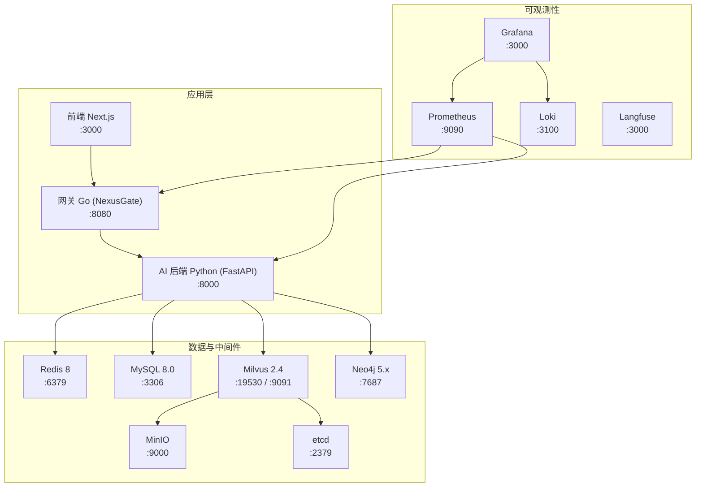
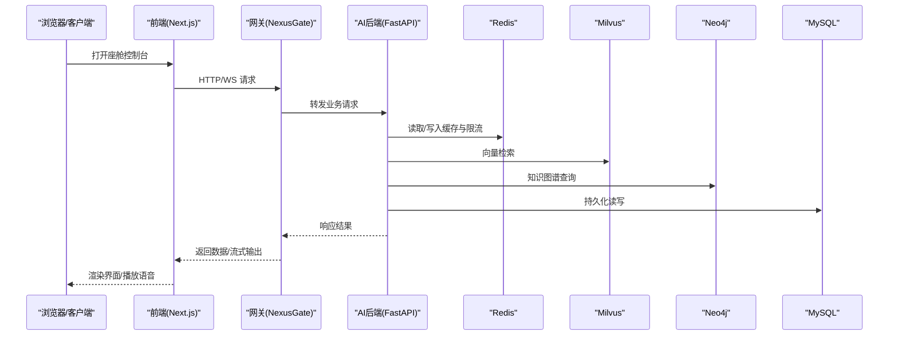
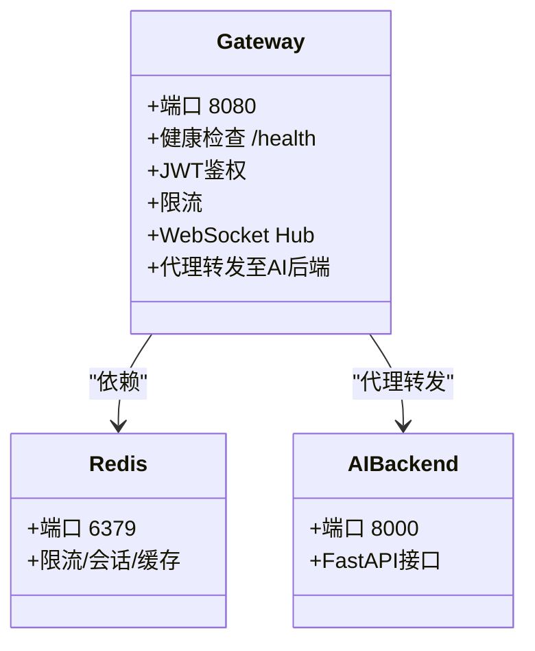
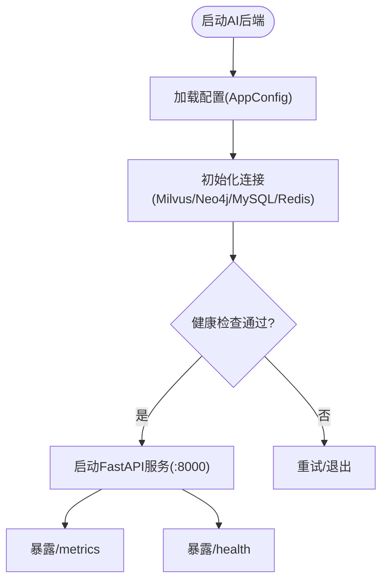
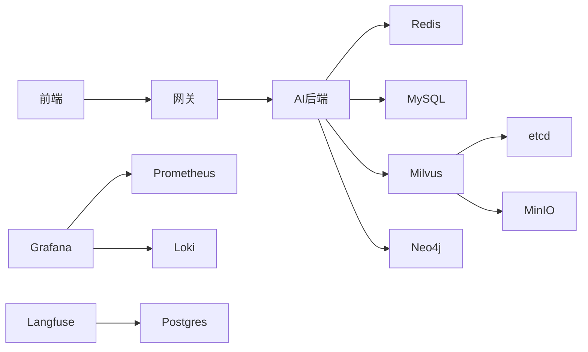

# 部署与运维

<cite>
**本文引用的文件**   
- [docker-compose.yml](file://docker-compose.yml)
- [docker-compose.dev.yml](file://docker-compose.dev.yml)
- [backend_design/Dockerfile](file://backend_design/Dockerfile)
- [frontend_design/Dockerfile](file://frontend_design/Dockerfile)
- [backend_design/nexus_gate/Dockerfile](file://backend_design/nexus_gate/Dockerfile)
- [backend_design/nexus/config/__init__.py](file://backend_design/nexus/config/__init__.py)
- [backend_design/nexus/config/server.py](file://backend_design/nexus/config/server.py)
- [backend_design/nexus/config/database.py](file://backend_design/nexus/config/database.py)
- [config/prometheus/prometheus.yml](file://config/prometheus/prometheus.yml)
- [config/loki/loki-config.yml](file://config/loki/loki-config.yml)
- [Makefile](file://Makefile)
- [scripts/start-all.ps1](file://scripts/start-all.ps1)
- [scripts/stop-all.ps1](file://scripts/stop-all.ps1)
- [README.md](file://README.md)
</cite>

## 目录
1. [简介](#简介)
2. [项目结构](#项目结构)
3. [核心组件](#核心组件)
4. [架构总览](#架构总览)
5. [详细组件分析](#详细组件分析)
6. [依赖关系分析](#依赖关系分析)
7. [性能与资源调优](#性能与资源调优)
8. [故障诊断与排障指南](#故障诊断与排障指南)
9. [生产部署与最佳实践](#生产部署与最佳实践)
10. [监控、日志与可观测性](#监控日志与可观测性)
11. [安全加固与密钥管理](#安全加固与密钥管理)
12. [备份、灾难恢复与版本升级](#备份灾难恢复与版本升级)
13. [自动化脚本与工具使用](#自动化脚本与工具使用)
14. [结论](#结论)

## 简介
本文件面向运维工程师，提供 NexusCockpit 的完整部署与运维手册。内容涵盖 Docker Compose 编排、服务依赖关系、环境变量与密钥管理、生产环境部署流程、容器化最佳实践、监控告警与日志收集、性能调优、水平扩展策略、备份与灾难恢复、以及版本升级流程。文档同时给出可视化架构图与流程图，帮助快速理解系统结构与关键操作路径。

## 项目结构
NexusCockpit 采用多语言微服务组合：Go 网关（nexus_gate）、Python AI 后端（nexus）、Next.js 前端（nexus_frontend），并通过 Docker Compose 统一编排中间件（Milvus、Neo4j、Redis、MySQL、MinIO、etcd、Prometheus、Grafana、Loki、Langfuse）。

图表来源
- [docker-compose.yml:1-292](file://docker-compose.yml#L1-L292)

章节来源
- [docker-compose.yml:1-292](file://docker-compose.yml#L1-L292)
- [README.md:144-320](file://README.md#L144-L320)

## 核心组件
- 网关（NexusGate）：Go 实现的高并发网关，负责鉴权、限流、WebSocket Hub 与路由转发。
- AI 后端（nexus）：Python FastAPI 服务，集成 Multi-Agent、GraphRAG、ASR/TTS、缓存与数据库访问。
- 前端（nexus_frontend）：Next.js 构建产物运行于 Node 运行时，通过网关暴露 API。
- 基础设施：Milvus（向量）、Neo4j（图谱）、Redis（缓存/限流/搜索）、MySQL（用户数据/审计）、MinIO（对象存储）、etcd（分布式协调）。
- 可观测性：Prometheus（指标）、Grafana（看板）、Loki（日志）、Langfuse（LLM 追踪）。

章节来源
- [docker-compose.yml:15-247](file://docker-compose.yml#L15-L247)
- [backend_design/Dockerfile:1-58](file://backend_design/Dockerfile#L1-L58)
- [frontend_design/Dockerfile:1-32](file://frontend_design/Dockerfile#L1-L32)
- [backend_design/nexus_gate/Dockerfile:1-22](file://backend_design/nexus_gate/Dockerfile#L1-L22)

## 架构总览
下图展示请求从前端到网关再到后端的调用链，以及各中间件的依赖关系。

图表来源
- [docker-compose.yml:15-89](file://docker-compose.yml#L15-L89)
- [backend_design/nexus/config/database.py:15-61](file://backend_design/nexus/config/database.py#L15-L61)

## 详细组件分析

### 网关（NexusGate）
- 镜像构建：多阶段构建，编译为静态二进制，最小化运行镜像。
- 健康检查：/health 端点用于编排健康探测。
- 依赖：Redis（限流/会话）、AI 后端（代理转发）。

图表来源
- [backend_design/nexus_gate/Dockerfile:1-22](file://backend_design/nexus_gate/Dockerfile#L1-L22)
- [docker-compose.yml:15-39](file://docker-compose.yml#L15-L39)

章节来源
- [backend_design/nexus_gate/Dockerfile:1-22](file://backend_design/nexus_gate/Dockerfile#L1-L22)
- [docker-compose.yml:15-39](file://docker-compose.yml#L15-L39)

### AI 后端（nexus）
- 镜像构建：CPU-only PyTorch，分层缓存优化镜像体积。
- 配置中心：基于 Pydantic Settings，按子系统拆分配置类，统一入口 AppConfig。
- 健康检查：/health 端点；/metrics 供 Prometheus 采集。

图表来源
- [backend_design/Dockerfile:1-58](file://backend_design/Dockerfile#L1-L58)
- [backend_design/nexus/config/__init__.py:84-167](file://backend_design/nexus/config/__init__.py#L84-L167)
- [docker-compose.yml:40-75](file://docker-compose.yml#L40-L75)

章节来源
- [backend_design/Dockerfile:1-58](file://backend_design/Dockerfile#L1-L58)
- [backend_design/nexus/config/__init__.py:84-167](file://backend_design/nexus/config/__init__.py#L84-L167)
- [docker-compose.yml:40-75](file://docker-compose.yml#L40-L75)

### 前端（nexus_frontend）
- 构建：Node 18 Alpine，npm ci 安装依赖，构建 .next/standalone 产物。
- 运行：独立 Node 进程，默认端口 3000，通过网关访问后端。

章节来源
- [frontend_design/Dockerfile:1-32](file://frontend_design/Dockerfile#L1-L32)
- [docker-compose.yml:76-89](file://docker-compose.yml#L76-L89)

### 中间件与服务
- Milvus：依赖 etcd 与 MinIO，暴露 19530 与 9091（开发模式）。
- Neo4j：启用 APOC 插件，Bolt 协议 7687（宿主机映射 17687）。
- Redis 8：开启密码保护、AOF、内存上限与 LRU 淘汰。
- MySQL：utf8mb4 字符集，自动执行迁移脚本。
- MinIO：对象存储，支持控制台（开发模式）。
- etcd：Milvus 元数据存储。

章节来源
- [docker-compose.yml:94-209](file://docker-compose.yml#L94-L209)

### 可观测性
- Prometheus：采集 AI 后端、网关、Milvus 自身指标。
- Grafana：预置数据源与仪表盘，管理员口令由环境变量注入。
- Loki：本地文件系统存储，保留 7 天，查询范围限制。
- Langfuse：本地化部署，PostgreSQL 作为后端。

章节来源
- [config/prometheus/prometheus.yml:1-35](file://config/prometheus/prometheus.yml#L1-L35)
- [config/loki/loki-config.yml:1-56](file://config/loki/loki-config.yml#L1-L56)
- [docker-compose.yml:248-276](file://docker-compose.yml#L248-L276)

## 依赖关系分析
- 应用服务依赖：
  - nexus_gate 依赖 redis（健康检查条件）。
  - nexus_ai 依赖 redis、milvus、mysql（健康检查条件）。
  - nexus_frontend 依赖 nexus_gate。
- 中间件依赖：
  - milvus 依赖 etcd、minio。
  - langfuse 依赖 langfuse-db（Postgres）。
  - grafana 依赖 prometheus、loki。

图表来源
- [docker-compose.yml:15-276](file://docker-compose.yml#L15-L276)

章节来源
- [docker-compose.yml:15-276](file://docker-compose.yml#L15-L276)

## 性能与资源调优
- 镜像与构建优化：
  - Python 后端使用 CPU-only PyTorch 与分层缓存，显著减小镜像体积。
  - Go 网关静态编译，运行镜像仅包含必要证书与 wget。
  - 前端使用 standalone 构建，减少运行时依赖。
- 中间件参数：
  - Redis 设置 maxmemory 与 allkeys-lru，避免内存溢出；启用 AOF 持久化。
  - Milvus 使用 HNSW 索引与 IP 度量，调整 efConstruction/ef 提升召回与速度平衡。
  - Neo4j 启用 APOC 插件，注意生产环境限制未受限过程。
  - MySQL 使用 utf8mb4，确保中文与表情兼容。
- 可观测性：
  - Prometheus scrape 间隔 15s，覆盖关键服务；Grafana 预置仪表盘便于快速定位瓶颈。
  - Loki 保留 168h，限制最大查询系列数，防止慢查询拖垮系统。

章节来源
- [backend_design/Dockerfile:1-58](file://backend_design/Dockerfile#L1-L58)
- [backend_design/nexus_gate/Dockerfile:1-22](file://backend_design/nexus_gate/Dockerfile#L1-L22)
- [frontend_design/Dockerfile:1-32](file://frontend_design/Dockerfile#L1-L32)
- [docker-compose.yml:161-209](file://docker-compose.yml#L161-L209)
- [config/prometheus/prometheus.yml:1-35](file://config/prometheus/prometheus.yml#L1-L35)
- [config/loki/loki-config.yml:34-40](file://config/loki/loki-config.yml#L34-L40)

## 故障诊断与排障指南
- 健康检查：
  - 网关：/health（wget spider）
  - AI 后端：/health（curl -f）
  - Redis：redis-cli ping（带密码）
  - MySQL：mysqladmin ping（带密码）
  - Milvus：/healthz
  - Grafana/Langfuse：各自健康端点
- 常见问题：
  - JWT 不一致导致 401：确保网关与后端共享相同 JWT_SECRET_KEY。
  - 端口冲突：Windows Hyper-V 保留端口已避让（如 16379、17687、13306）。
  - 模型缺失：下载 ASR/TTS/Embedding/Reranker 模型并挂载至 /app/models。
  - 网络连通：确认 host.docker.internal 可达（Prometheus 采集需要）。
- 日志位置：
  - 开发模式：logs/backend_logs、logs/go_logs、logs/frontend_logs。
  - 容器日志：docker compose logs -f。

章节来源
- [docker-compose.yml:34-75](file://docker-compose.yml#L34-L75)
- [docker-compose.yml:161-209](file://docker-compose.yml#L161-L209)
- [scripts/start-all.ps1:49-94](file://scripts/start-all.ps1#L49-L94)
- [README.md:279-288](file://README.md#L279-L288)

## 生产部署与最佳实践
- 容器化建议：
  - 使用 docker-compose.yml 作为基础编排，生产环境移除 dev 覆盖文件。
  - 所有敏感信息通过 .env 或外部密钥管理注入，不硬编码在镜像中。
  - 为每个服务设置 restart=unless-stopped 与健康检查，提高可用性。
- 资源限制：
  - 为容器设置 CPU/内存限制（建议在编排层或编排器层面配置）。
  - Redis 设置 maxmemory 与淘汰策略，避免 OOM。
- 高可用与扩展：
  - 网关与后端无状态，可通过副本数水平扩展；使用负载均衡器分发流量。
  - 数据库与中间件保持单实例或集群模式（根据规模选择），确保数据持久化卷。
- 安全加固：
  - 启用 Redis 密码与 protected-mode。
  - 限制 CORS_ORIGINS 为具体域名。
  - 最小化镜像权限，只暴露必要端口。

章节来源
- [docker-compose.yml:15-276](file://docker-compose.yml#L15-L276)
- [backend_design/nexus/config/server.py:15-42](file://backend_design/nexus/config/server.py#L15-L42)
- [docker-compose.dev.yml:1-63](file://docker-compose.dev.yml#L1-L63)

## 监控日志与可观测性
- 指标采集：
  - Prometheus 抓取 AI 后端、网关、Milvus 指标，scrape_interval 15s。
  - Grafana 预置数据源与仪表盘，便于查看延迟、命中率等。
- 日志聚合：
  - Loki 本地文件系统存储，保留 168h，限制查询复杂度。
  - 应用日志建议结构化输出，便于 Loki 解析。
- LLM 追踪：
  - Langfuse 本地部署，记录 LLM 调用轨迹，便于分析与优化。

章节来源
- [config/prometheus/prometheus.yml:1-35](file://config/prometheus/prometheus.yml#L1-L35)
- [config/loki/loki-config.yml:1-56](file://config/loki/loki-config.yml#L1-L56)
- [docker-compose.yml:248-276](file://docker-compose.yml#L248-L276)

## 安全加固与密钥管理
- 环境变量与密钥：
  - 使用 .env 或外部密钥管理服务注入敏感信息（如 JWT_SECRET_KEY、数据库密码、MinIO 密钥）。
  - 禁止将密钥写入镜像或代码仓库。
- 认证与授权：
  - JWT 算法 HS256，过期时间合理设置；RBAC 默认角色与管理员账号需修改默认值。
  - CORS_ORIGINS 在生产环境严格限定。
- 网络安全：
  - 仅暴露必要端口（如 8080、3000），其他中间件端口仅在内部网络访问。
  - 启用 HTTPS 反向代理（如 Nginx/Traefik）以加密传输。

章节来源
- [backend_design/nexus/config/server.py:44-61](file://backend_design/nexus/config/server.py#L44-L61)
- [docker-compose.yml:111-125](file://docker-compose.yml#L111-L125)
- [docker-compose.yml:161-186](file://docker-compose.yml#L161-L186)

## 备份灾难恢复与版本升级
- 数据备份：
  - MySQL：使用 mysqldump 或容器快照备份 /var/lib/mysql。
  - Redis：AOF 文件与内存快照（rdb）定期备份。
  - Milvus/Neo4j：分别备份其数据目录（/var/lib/milvus、/data）。
  - MinIO：对象存储桶数据定期同步至异地存储。
- 灾难恢复：
  - 先恢复数据库与中间件数据，再启动应用服务。
  - 验证健康检查与关键接口可用性。
- 版本升级：
  - 滚动更新：逐步替换镜像并重启服务，确保依赖中间件兼容。
  - 数据库迁移：提前执行迁移脚本（如 v2.1_migration.sql），并在升级前备份。
  - 回滚策略：保留旧镜像与数据快照，出现问题快速回滚。

章节来源
- [docker-compose.yml:188-209](file://docker-compose.yml#L188-L209)
- [docker-compose.yml:126-146](file://docker-compose.yml#L126-L146)
- [docker-compose.yml:161-186](file://docker-compose.yml#L161-L186)

## 自动化脚本与工具使用
- Makefile：
  - docker-up/down：一键启停基础设施。
  - init-db：初始化 Milvus/Neo4j。
  - lint/test/format：代码质量与测试。
- PowerShell 脚本：
  - start-all.ps1：后台启动后端、网关、前端，并捕获日志。
  - stop-all.ps1：按进程名与端口停止服务。
- 开发模式：
  - docker-compose.dev.yml：额外暴露调试端口（Neo4j Browser、MinIO Console、Grafana/Prometheus/Loki）。

章节来源
- [Makefile:94-116](file://Makefile#L94-L116)
- [scripts/start-all.ps1:49-94](file://scripts/start-all.ps1#L49-L94)
- [scripts/stop-all.ps1:16-80](file://scripts/stop-all.ps1#L16-L80)
- [docker-compose.dev.yml:16-50](file://docker-compose.dev.yml#L16-L50)

## 结论
本手册提供了 NexusCockpit 的端到端部署与运维指南，涵盖架构、配置、监控、安全、性能与灾备等关键主题。通过 Docker Compose 统一编排与标准化脚本，可实现快速上线与稳定运维。建议在生产环境中严格执行安全加固、资源限制与备份策略，并结合监控告警体系持续优化系统稳定性与性能。