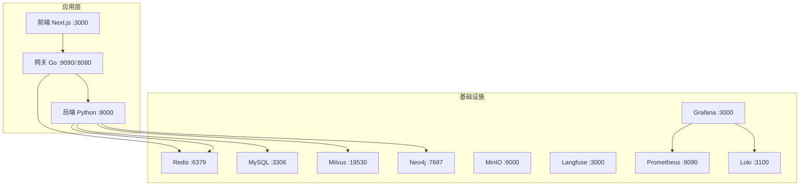
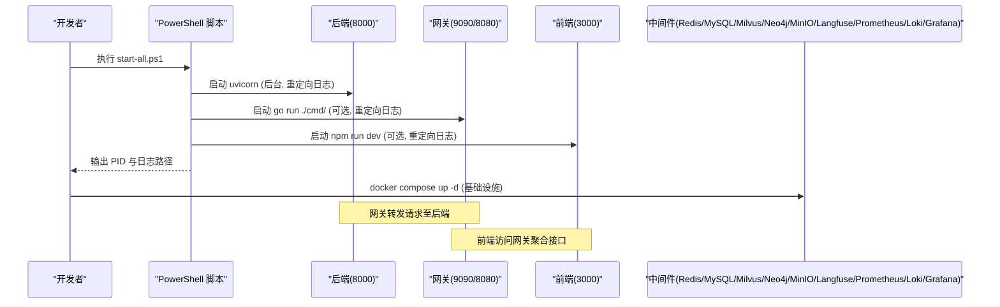
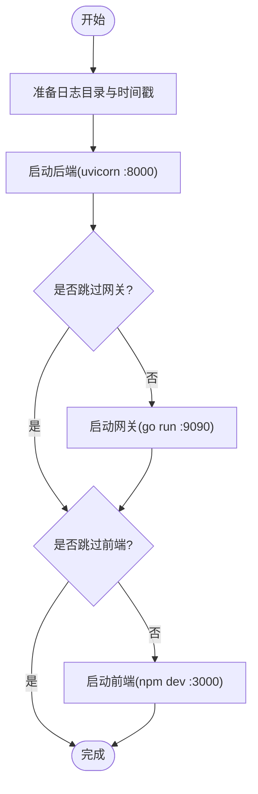
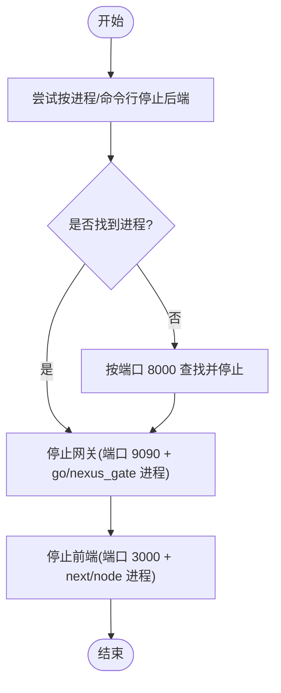
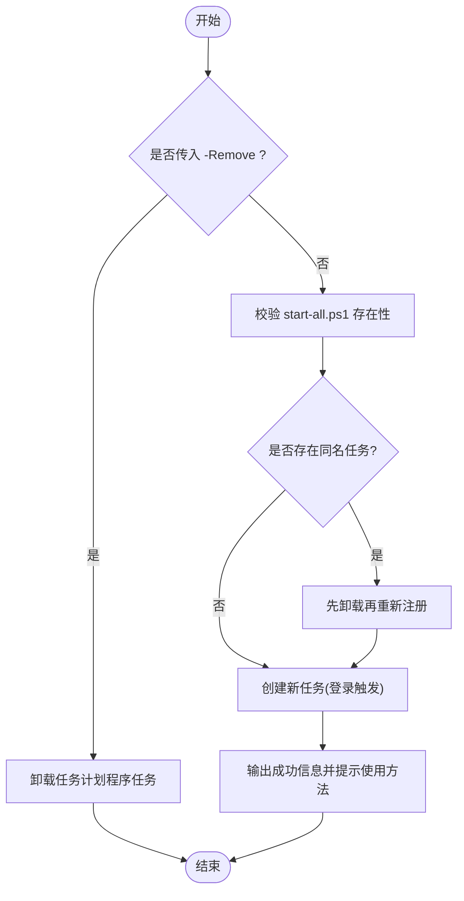
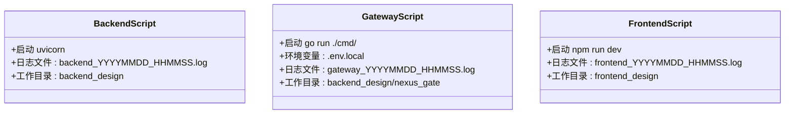
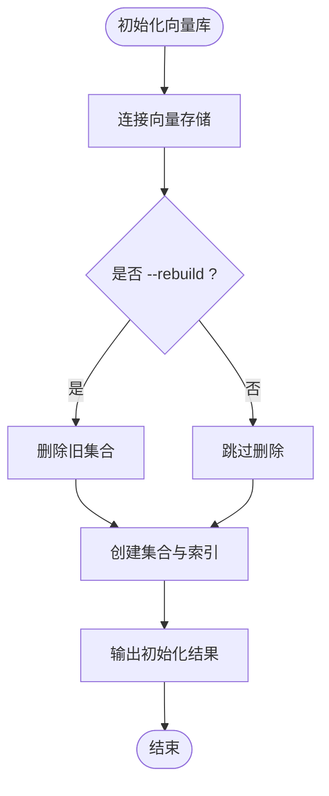
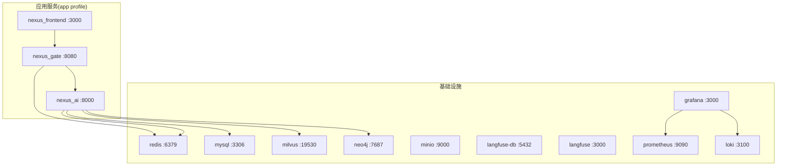
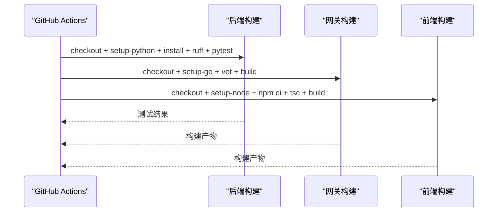
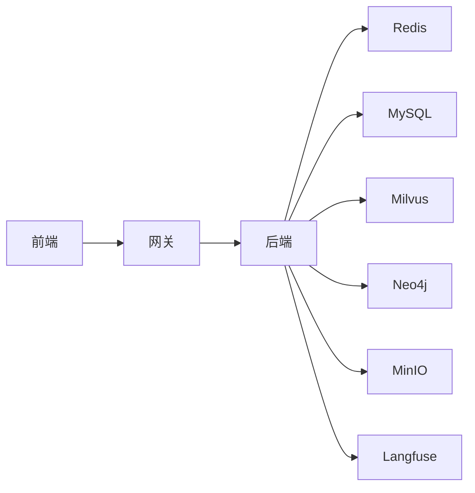

# 部署脚本与自动化

<cite>
**本文引用的文件**   
- [scripts/start-all.ps1](file://scripts/start-all.ps1)
- [scripts/stop-all.ps1](file://scripts/stop-all.ps1)
- [scripts/install-autostart.ps1](file://scripts/install-autostart.ps1)
- [scripts/start-backend.ps1](file://scripts/start-backend.ps1)
- [scripts/start-frontend.ps1](file://scripts/start-frontend.ps1)
- [scripts/start-gateway.ps1](file://scripts/start-gateway.ps1)
- [.github/workflows/ci.yml](file://.github/workflows/ci.yml)
- [docker-compose.yml](file://docker-compose.yml)
- [docker-compose.dev.yml](file://docker-compose.dev.yml)
- [Makefile](file://Makefile)
- [backend_design/scripts/init_milvus.py](file://backend_design/scripts/init_milvus.py)
- [backend_design/scripts/init_neo4j.py](file://backend_design/scripts/init_neo4j.py)
</cite>

## 目录
1. [简介](#简介)
2. [项目结构](#项目结构)
3. [核心组件](#核心组件)
4. [架构总览](#架构总览)
5. [详细组件分析](#详细组件分析)
6. [依赖关系分析](#依赖关系分析)
7. [性能考虑](#性能考虑)
8. [故障排查指南](#故障排查指南)
9. [结论](#结论)
10. [附录](#附录)

## 简介
本文件面向 NexusCockpit 的部署与自动化，聚焦 PowerShell 脚本与容器化、CI/CD 流水线的一体化使用。内容涵盖：
- 一键启动/停止服务与环境初始化
- 各脚本参数、执行顺序与错误处理机制
- CI/CD 集成、自动化部署流程与版本升级建议
- 调试技巧、常见问题排查与企业环境定制指南

## 项目结构
NexusCockpit 采用多语言微服务组合：Python 后端（FastAPI/uvicorn）、Go API 网关、Next.js 前端，以及向量数据库、图数据库、缓存、对象存储、日志与指标等基础设施。本地开发通过 PowerShell 脚本快速拉起各进程；生产或统一编排通过 Docker Compose 管理全栈。

**图表来源** 
- [docker-compose.yml:16-88](file://docker-compose.yml#L16-L88)
- [docker-compose.yml:94-292](file://docker-compose.yml#L94-L292)

**章节来源**
- [docker-compose.yml:1-292](file://docker-compose.yml#L1-L292)
- [docker-compose.dev.yml:1-63](file://docker-compose.dev.yml#L1-L63)

## 核心组件
- 一键启动脚本：scripts/start-all.ps1
- 一键停止脚本：scripts/stop-all.ps1
- 自启动注册脚本：scripts/install-autostart.ps1
- 单服务启动脚本：start-backend.ps1、start-gateway.ps1、start-frontend.ps1
- 环境初始化脚本：init_milvus.py、init_neo4j.py
- 容器编排：docker-compose.yml、docker-compose.dev.yml
- CI/CD 流水线：.github/workflows/ci.yml
- 便捷命令集：Makefile

**章节来源**
- [scripts/start-all.ps1:1-101](file://scripts/start-all.ps1#L1-L101)
- [scripts/stop-all.ps1:1-86](file://scripts/stop-all.ps1#L1-L86)
- [scripts/install-autostart.ps1:1-99](file://scripts/install-autostart.ps1#L1-L99)
- [scripts/start-backend.ps1:1-43](file://scripts/start-backend.ps1#L1-L43)
- [scripts/start-gateway.ps1:1-44](file://scripts/start-gateway.ps1#L1-L44)
- [scripts/start-frontend.ps1:1-42](file://scripts/start-frontend.ps1#L1-L42)
- [backend_design/scripts/init_milvus.py:1-54](file://backend_design/scripts/init_milvus.py#L1-L54)
- [backend_design/scripts/init_neo4j.py:1-39](file://backend_design/scripts/init_neo4j.py#L1-L39)
- [docker-compose.yml:1-292](file://docker-compose.yml#L1-L292)
- [.github/workflows/ci.yml:1-72](file://.github/workflows/ci.yml#L1-L72)
- [Makefile:1-173](file://Makefile#L1-L173)

## 架构总览
PowerShell 脚本负责在 Windows 环境下以最小依赖方式启动各服务并输出到独立日志文件；Docker Compose 提供可复现的全栈环境；CI/CD 保证代码质量与构建产物可用。

**图表来源** 
- [scripts/start-all.ps1:49-94](file://scripts/start-all.ps1#L49-L94)
- [docker-compose.yml:16-88](file://docker-compose.yml#L16-L88)

**章节来源**
- [scripts/start-all.ps1:1-101](file://scripts/start-all.ps1#L1-L101)
- [docker-compose.yml:1-292](file://docker-compose.yml#L1-L292)

## 详细组件分析

### 一键启动脚本：start-all.ps1
- 功能：按序启动后端、网关、前端，支持跳过网关或前端；统一输出到 logs 下分目录的时间戳日志文件；后台运行并返回进程 ID。
- 参数：
  - -NoGateway：跳过启动网关
  - -NoFrontend：跳过启动前端
- 执行顺序：后端 → 网关（可选）→ 前端（可选）
- 错误处理：静默错误模式，关键步骤失败不影响后续启动；日志文件记录完整输出便于定位问题。
- 日志位置：logs/backend_logs、logs/go_logs、logs/frontend_logs

**图表来源** 
- [scripts/start-all.ps1:49-94](file://scripts/start-all.ps1#L49-L94)

**章节来源**
- [scripts/start-all.ps1:1-101](file://scripts/start-all.ps1#L1-L101)

### 一键停止脚本：stop-all.ps1
- 功能：根据进程名、命令行匹配或端口占用情况，停止后端、网关、前端进程。
- 策略：优先按进程名/命令行匹配，其次按端口查找；对未找到的服务给出计数反馈。
- 适用场景：清理残留进程、切换版本前确保端口释放。

**图表来源** 
- [scripts/stop-all.ps1:16-80](file://scripts/stop-all.ps1#L16-L80)

**章节来源**
- [scripts/stop-all.ps1:1-86](file://scripts/stop-all.ps1#L1-L86)

### 自启动注册脚本：install-autostart.ps1
- 功能：将 start-all.ps1 注册为 Windows 任务计划程序，用户登录时自动启动全部服务；支持移除任务。
- 参数：
  - -Remove：移除已存在的自启任务
- 触发器：用户登录时
- 权限与安全：以当前用户身份运行，限制级别；执行策略绕过以确保脚本运行。

**图表来源** 
- [scripts/install-autostart.ps1:23-98](file://scripts/install-autostart.ps1#L23-L98)

**章节来源**
- [scripts/install-autostart.ps1:1-99](file://scripts/install-autostart.ps1#L1-L99)

### 单服务启动脚本
- start-backend.ps1：启动 uvicorn 监听 0.0.0.0:8000，输出重定向到 logs/backend_logs/*.log
- start-gateway.ps1：go run ./cmd/ 加载 .env.local，输出重定向到 logs/go_logs/*.log
- start-frontend.ps1：npm run dev 监听 3000，输出重定向到 logs/frontend_logs/*.log

**图表来源** 
- [scripts/start-backend.ps1:28-43](file://scripts/start-backend.ps1#L28-L43)
- [scripts/start-gateway.ps1:28-44](file://scripts/start-gateway.ps1#L28-L44)
- [scripts/start-frontend.ps1:28-42](file://scripts/start-frontend.ps1#L28-L42)

**章节来源**
- [scripts/start-backend.ps1:1-43](file://scripts/start-backend.ps1#L1-L43)
- [scripts/start-gateway.ps1:1-44](file://scripts/start-gateway.ps1#L1-L44)
- [scripts/start-frontend.ps1:1-42](file://scripts/start-frontend.ps1#L1-L42)

### 环境初始化脚本
- init_milvus.py：连接向量库，创建集合与索引；支持 --rebuild 重建（切换 embedding 维度后需删除旧集合）。
- init_neo4j.py：连接图数据库，创建约束与索引（如 user_id_unique、entity_name_index）。

**图表来源** 
- [backend_design/scripts/init_milvus.py:21-53](file://backend_design/scripts/init_milvus.py#L21-L53)

**章节来源**
- [backend_design/scripts/init_milvus.py:1-54](file://backend_design/scripts/init_milvus.py#L1-L54)
- [backend_design/scripts/init_neo4j.py:1-39](file://backend_design/scripts/init_neo4j.py#L1-L39)

### 容器编排与开发覆盖
- docker-compose.yml：定义应用服务与基础设施，健康检查、端口映射、卷挂载、环境变量注入。
- docker-compose.dev.yml：开发模式追加调试端口与挂载，便于浏览器访问 Milvus、Neo4j、MinIO、Langfuse、Prometheus、Loki、Grafana。

**图表来源** 
- [docker-compose.yml:16-88](file://docker-compose.yml#L16-L88)
- [docker-compose.yml:94-292](file://docker-compose.yml#L94-L292)

**章节来源**
- [docker-compose.yml:1-292](file://docker-compose.yml#L1-L292)
- [docker-compose.dev.yml:1-63](file://docker-compose.dev.yml#L1-L63)

### CI/CD 流水线
- 触发条件：push/PR 到 main/develop
- 后端：安装依赖、ruff lint、pytest 测试
- 网关：go vet、go build
- 前端：npm ci、tsc 类型检查、npm run build

**图表来源** 
- [.github/workflows/ci.yml:10-72](file://.github/workflows/ci.yml#L10-L72)

**章节来源**
- [.github/workflows/ci.yml:1-72](file://.github/workflows/ci.yml#L1-L72)

### Makefile 快捷命令
- 环境安装：install、install-gpu、install-frontend、install-gateway、install-all
- 开发启动：dev、dev-frontend、dev-all、dev-log、dev-frontend-log、dev-gateway-log
- 容器管理：docker-up、docker-down、docker-logs、docker-clean
- 数据库初始化：init-db
- 代码质量：lint、lint-backend、lint-gateway、format、check
- 测试与构建：test、build-gateway、test-cov
- 清理：clean

**章节来源**
- [Makefile:1-173](file://Makefile#L1-L173)

## 依赖关系分析
- 脚本间依赖：install-autostart.ps1 依赖 start-all.ps1 的存在；stop-all.ps1 依赖端口与进程命名约定。
- 服务依赖：前端依赖网关，网关依赖后端；后端依赖 Redis、MySQL、Milvus、Neo4j、MinIO、Langfuse。
- 容器依赖：compose 中通过 depends_on 与健康检查保障启动顺序。

**图表来源** 
- [docker-compose.yml:16-88](file://docker-compose.yml#L16-L88)

**章节来源**
- [docker-compose.yml:1-292](file://docker-compose.yml#L1-L292)

## 性能考虑
- 日志写入：PowerShell 脚本通过 Tee-Object 或重定向将输出写入文件，避免频繁 I/O 阻塞主进程；生产环境建议集中日志采集（Loki/Prometheus）。
- 资源隔离：容器化部署通过镜像与卷隔离，避免宿主机污染；合理设置内存上限（如 Redis maxmemory）。
- 启动顺序：Compose 健康检查确保依赖就绪后再启动上层服务，减少冷启动失败重试。
- 网络端口：Windows Hyper-V 保留端口避让已在 compose 中处理，避免冲突。

[本节为通用指导，不直接分析具体文件]

## 故障排查指南
- 端口占用
  - 现象：服务无法启动或启动后立即退出
  - 排查：使用 stop-all.ps1 清理残留进程；确认端口未被其他程序占用
  - 参考：[scripts/stop-all.ps1:34-42](file://scripts/stop-all.ps1#L34-L42)
- 日志定位
  - 现象：服务启动异常但无控制台输出
  - 排查：查看 logs 目录下对应服务的 *.log 文件
  - 参考：[scripts/start-all.ps1:30-39](file://scripts/start-all.ps1#L30-L39)
- 环境变量
  - 现象：JWT 签名不一致、配置读取失败
  - 排查：确认 .env.local 与前后端共享密钥一致
  - 参考：[scripts/start-gateway.ps1:39-40](file://scripts/start-gateway.ps1#L39-L40)
- 数据库初始化
  - 现象：集合不存在、索引缺失导致查询失败
  - 排查：运行 init_milvus.py 与 init_neo4j.py；必要时使用 --rebuild
  - 参考：[backend_design/scripts/init_milvus.py:21-53](file://backend_design/scripts/init_milvus.py#L21-L53)
- 容器健康检查
  - 现象：服务依赖未就绪导致启动失败
  - 排查：查看 docker compose 健康检查状态与日志
  - 参考：[docker-compose.yml:34-38](file://docker-compose.yml#L34-L38)

**章节来源**
- [scripts/stop-all.ps1:16-80](file://scripts/stop-all.ps1#L16-L80)
- [scripts/start-all.ps1:30-39](file://scripts/start-all.ps1#L30-L39)
- [scripts/start-gateway.ps1:39-40](file://scripts/start-gateway.ps1#L39-L40)
- [backend_design/scripts/init_milvus.py:21-53](file://backend_design/scripts/init_milvus.py#L21-L53)
- [docker-compose.yml:34-38](file://docker-compose.yml#L34-L38)

## 结论
NexusCockpit 的部署与自动化体系以 PowerShell 脚本实现本地快速启动与停止，结合 Docker Compose 提供稳定可复现的全栈环境，并通过 GitHub Actions 进行持续集成。通过合理的日志收集、健康检查与端口管理，可在企业环境中安全扩展与定制。

[本节为总结，不直接分析具体文件]

## 附录

### 常用操作清单
- 本地一键启动：执行 scripts/start-all.ps1
- 本地一键停止：执行 scripts/stop-all.ps1
- 开机自启：执行 scripts/install-autostart.ps1；移除：scripts/install-autostart.ps1 -Remove
- 单独启动服务：scripts/start-backend.ps1、scripts/start-gateway.ps1、scripts/start-frontend.ps1
- 初始化数据：python -m scripts.init_milvus、python -m scripts.init_neo4j
- 容器编排：docker compose up -d；开发模式：docker compose -f docker-compose.yml -f docker-compose.dev.yml up -d
- CI 触发：推送代码到 main/develop 或发起 PR

**章节来源**
- [scripts/start-all.ps1:1-101](file://scripts/start-all.ps1#L1-L101)
- [scripts/stop-all.ps1:1-86](file://scripts/stop-all.ps1#L1-L86)
- [scripts/install-autostart.ps1:1-99](file://scripts/install-autostart.ps1#L1-L99)
- [scripts/start-backend.ps1:1-43](file://scripts/start-backend.ps1#L1-L43)
- [scripts/start-gateway.ps1:1-44](file://scripts/start-gateway.ps1#L1-L44)
- [scripts/start-frontend.ps1:1-42](file://scripts/start-frontend.ps1#L1-L42)
- [backend_design/scripts/init_milvus.py:1-54](file://backend_design/scripts/init_milvus.py#L1-L54)
- [backend_design/scripts/init_neo4j.py:1-39](file://backend_design/scripts/init_neo4j.py#L1-L39)
- [docker-compose.yml:1-292](file://docker-compose.yml#L1-L292)
- [docker-compose.dev.yml:1-63](file://docker-compose.dev.yml#L1-L63)

### 企业环境定制指南
- 端口规划：修改 compose 中的端口映射以避免与本机服务冲突
- 环境变量：通过 .env 或 .env.local 注入密钥与地址；确保前后端 JWT_SECRET_KEY 一致
- 日志策略：接入 Loki/Prometheus/Grafana，集中采集与告警
- 安全加固：启用 Redis 密码与保护模式、MySQL 强密码、MinIO 访问控制
- 高可用：增加副本与持久化卷，配置健康检查与重启策略
- 版本升级：先停服务（stop-all.ps1），再替换镜像/代码，最后初始化数据（如需）并启动

[本节为通用指导，不直接分析具体文件]