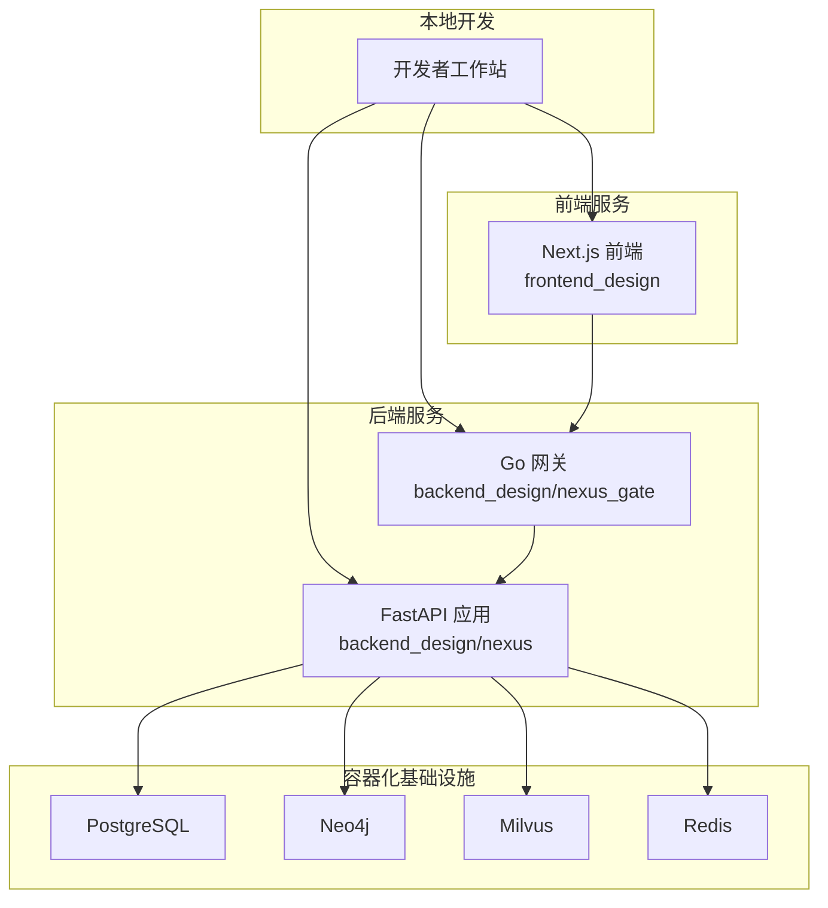
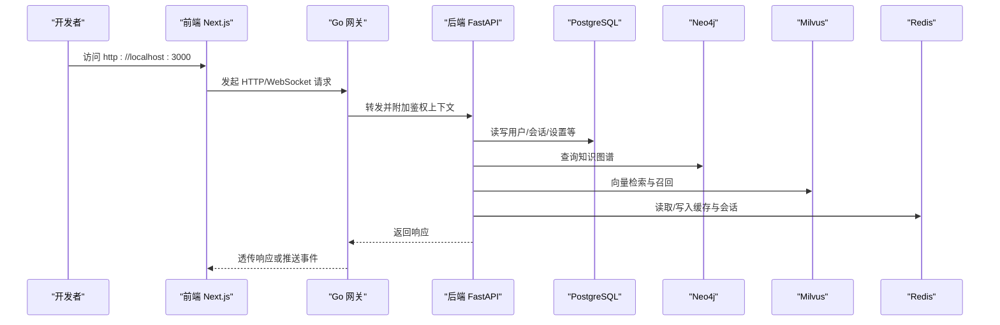
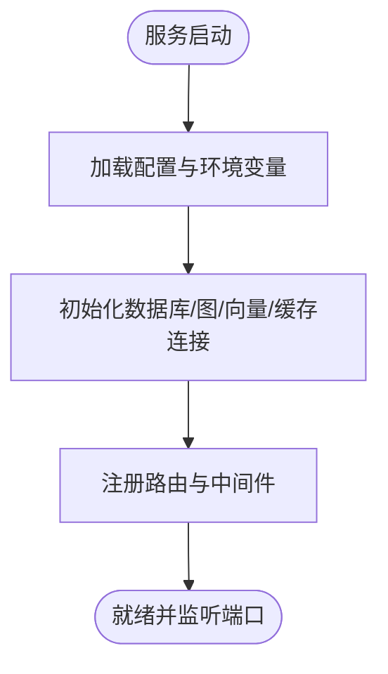
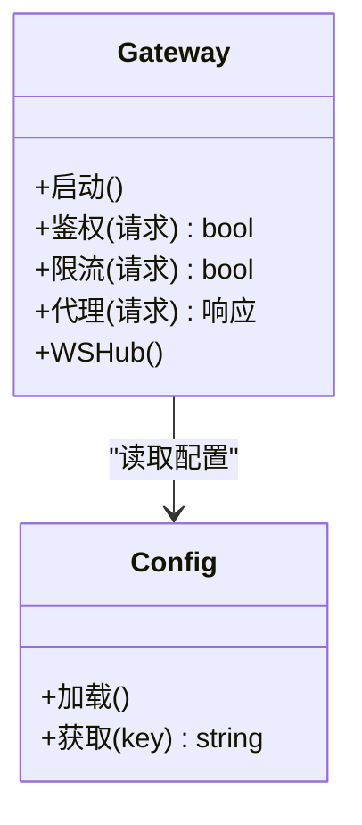
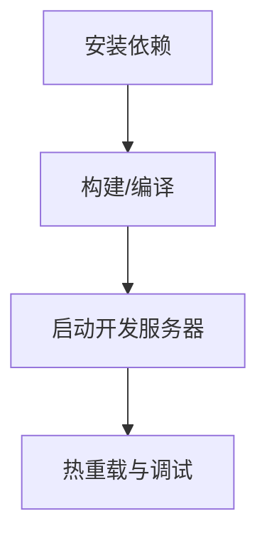
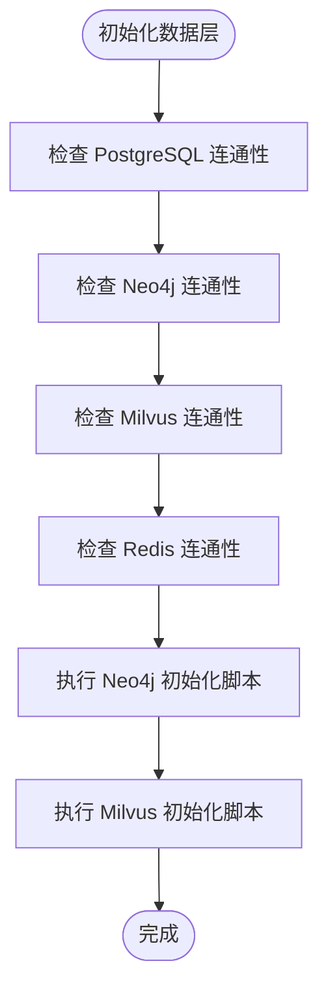
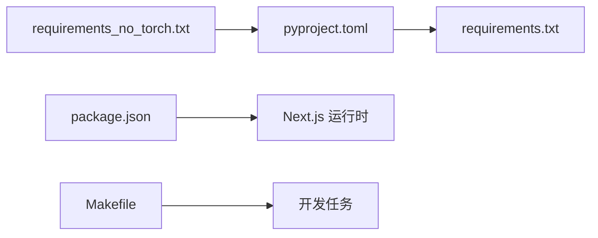

# 开发环境搭建

<cite>
**本文引用的文件**   
- [README.md](file://README.md)
- [docker-compose.yml](file://docker-compose.yml)
- [backend_design/pyproject.toml](file://backend_design/pyproject.toml)
- [backend_design/requirements.txt](file://backend_design/requirements.txt)
- [backend_design/nexus/config.py](file://backend_design/nexus/config.py)
- [backend_design/nexus/main.py](file://backend_design/nexus/main.py)
- [backend_design/scripts/init_neo4j.py](file://backend_design/scripts/init_neo4j.py)
- [backend_design/scripts/init_milvus.py](file://backend_design/scripts/init_milvus.py)
- [frontend_design/package.json](file://frontend_design/package.json)
- [frontend_design/next.config.js](file://frontend_design/next.config.js)
- [Makefile](file://Makefile)
- [.pre-commit-config.yaml](file://.pre-commit-config.yaml)
- [.editorconfig](file://.editorconfig)
</cite>

## 目录
1. [简介](#简介)
2. [项目结构](#项目结构)
3. [核心组件](#核心组件)
4. [架构总览](#架构总览)
5. [详细组件分析](#详细组件分析)
6. [依赖分析](#依赖分析)
7. [性能考虑](#性能考虑)
8. [故障排查指南](#故障排查指南)
9. [结论](#结论)
10. [附录](#附录)

## 简介
本指南面向本地开发者，提供 NexusCockpit 系统的完整开发环境搭建说明。内容涵盖：
- Python 与 Node.js 环境准备
- 数据库与中间件初始化（PostgreSQL、Neo4j、Milvus、Redis）
- 依赖安装与环境变量配置
- 本地服务启动流程（后端、前端、网关）
- 常见问题解决方案与调试技巧
- IDE 配置建议、代码格式化规则与开发工作流最佳实践

## 项目结构
仓库采用前后端分离与多语言微服务组合：
- 后端：Python FastAPI 应用，位于 backend_design/nexus
- 网关：Go 实现的轻量网关，位于 backend_design/nexus_gate
- 前端：Next.js 应用，位于 frontend_design
- 基础设施：通过 docker-compose 编排 PostgreSQL、Neo4j、Milvus、Redis 等
- 脚本：数据库初始化与测试脚本位于 backend_design/scripts

**图表来源**
- [docker-compose.yml](file://docker-compose.yml)
- [backend_design/nexus/main.py](file://backend_design/nexus/main.py)
- [backend_design/nexus_gate/cmd/main.go](file://backend_design/nexus_gate/cmd/main.go)
- [frontend_design/package.json](file://frontend_design/package.json)

**章节来源**
- [README.md](file://README.md)
- [docker-compose.yml](file://docker-compose.yml)

## 核心组件
- 后端服务（FastAPI）
  - 入口与路由注册、中间件、配置加载、日志与可观测性
  - 关键模块：配置、认证、RAG、记忆、技能、车辆控制、ASR/TTS、MCP 网关
- 网关（Go）
  - 鉴权、限流、WebSocket 转发、反向代理
- 前端（Next.js）
  - 页面、组件、状态管理、API 调用、语音与 GPS 能力封装
- 数据层
  - 关系型：PostgreSQL
  - 图数据库：Neo4j
  - 向量检索：Milvus
  - 缓存与会话：Redis

**章节来源**
- [backend_design/nexus/main.py](file://backend_design/nexus/main.py)
- [backend_design/nexus/config.py](file://backend_design/nexus/config.py)
- [backend_design/nexus_gate/cmd/main.go](file://backend_design/nexus_gate/cmd/main.go)
- [frontend_design/package.json](file://frontend_design/package.json)

## 架构总览
下图展示本地开发时各组件的交互关系与数据流向。

**图表来源**
- [docker-compose.yml](file://docker-compose.yml)
- [backend_design/nexus/main.py](file://backend_design/nexus/main.py)
- [backend_design/nexus/config.py](file://backend_design/nexus/config.py)
- [backend_design/nexus_gate/cmd/main.go](file://backend_design/nexus_gate/cmd/main.go)
- [frontend_design/package.json](file://frontend_design/package.json)

## 详细组件分析

### 后端服务（FastAPI）
- 启动与配置
  - 应用入口负责加载配置、注册路由、挂载中间件与生命周期钩子
  - 配置项集中管理，支持环境变量覆盖
- 关键依赖
  - 数据库连接、图数据库客户端、向量库客户端、Redis 客户端
  - 日志、指标与链路追踪集成
- 典型流程
  - 接收请求 -> 鉴权与限流 -> 业务处理 -> 数据访问 -> 返回响应

**图表来源**
- [backend_design/nexus/main.py](file://backend_design/nexus/main.py)
- [backend_design/nexus/config.py](file://backend_design/nexus/config.py)

**章节来源**
- [backend_design/nexus/main.py](file://backend_design/nexus/main.py)
- [backend_design/nexus/config.py](file://backend_design/nexus/config.py)

### 网关（Go）
- 职责
  - 统一入口、鉴权校验、速率限制、WebSocket Hub、反向代理到后端
- 配置
  - 从配置文件或环境变量加载目标后端地址、JWT 密钥、限流策略等

**图表来源**
- [backend_design/nexus_gate/cmd/main.go](file://backend_design/nexus_gate/cmd/main.go)
- [backend_design/nexus_gate/internal/config/config.go](file://backend_design/nexus_gate/internal/config/config.go)

**章节来源**
- [backend_design/nexus_gate/cmd/main.go](file://backend_design/nexus_gate/cmd/main.go)
- [backend_design/nexus_gate/internal/config/config.go](file://backend_design/nexus_gate/internal/config/config.go)

### 前端（Next.js）
- 运行与构建
  - 使用 npm/yarn/pnpm 安装依赖后启动开发服务器
- 环境变量
  - 通过 .env.local 配置后端与网关地址、功能开关等
- 静态资源与样式
  - Tailwind CSS、PostCSS 与 Next.js 内置优化

**图表来源**
- [frontend_design/package.json](file://frontend_design/package.json)
- [frontend_design/next.config.js](file://frontend_design/next.config.js)

**章节来源**
- [frontend_design/package.json](file://frontend_design/package.json)
- [frontend_design/next.config.js](file://frontend_design/next.config.js)

### 数据层与初始化
- PostgreSQL
  - 用于结构化数据存储（用户、会话、设置等）
- Neo4j
  - 用于知识图谱存储与查询
- Milvus
  - 用于向量检索与相似度计算
- Redis
  - 用于缓存、会话与任务队列

**图表来源**
- [docker-compose.yml](file://docker-compose.yml)
- [backend_design/scripts/init_neo4j.py](file://backend_design/scripts/init_neo4j.py)
- [backend_design/scripts/init_milvus.py](file://backend_design/scripts/init_milvus.py)

**章节来源**
- [docker-compose.yml](file://docker-compose.yml)
- [backend_design/scripts/init_neo4j.py](file://backend_design/scripts/init_neo4j.py)
- [backend_design/scripts/init_milvus.py](file://backend_design/scripts/init_milvus.py)

## 依赖分析
- Python 依赖
  - pyproject.toml 与 requirements.txt 定义后端依赖；可选 torch 包在 requirements_no_torch.txt 中排除
- Node.js 依赖
  - package.json 定义前端依赖与脚本命令
- Makefile
  - 提供常用开发任务的快捷命令（如启动、初始化、测试）

**图表来源**
- [backend_design/pyproject.toml](file://backend_design/pyproject.toml)
- [backend_design/requirements.txt](file://backend_design/requirements.txt)
- [frontend_design/package.json](file://frontend_design/package.json)
- [Makefile](file://Makefile)

**章节来源**
- [backend_design/pyproject.toml](file://backend_design/pyproject.toml)
- [backend_design/requirements.txt](file://backend_design/requirements.txt)
- [frontend_design/package.json](file://frontend_design/package.json)
- [Makefile](file://Makefile)

## 性能考虑
- 连接池与超时
  - 为数据库与缓存设置合理的连接池大小与超时时间，避免阻塞
- 缓存策略
  - 热点数据优先走 Redis，减少下游压力
- 异步与并发
  - 利用 FastAPI 异步特性与网关并发能力，提升吞吐
- 资源隔离
  - 将大模型与重计算任务下沉至独立服务或 GPU 节点，避免影响主链路

[本节为通用指导，不直接分析具体文件]

## 故障排查指南
- 端口冲突
  - 确认 3000（前端）、8000（后端）、网关端口未被占用
- 数据库不可达
  - 检查 docker-compose 是否成功拉起，网络与凭据是否正确
- 向量库初始化失败
  - 查看 init_milvus.py 输出与 Milvus 服务健康状态
- 图数据库索引缺失
  - 执行 init_neo4j.py 确保必要索引与约束存在
- 鉴权失败
  - 核对 JWT 密钥与网关配置一致
- 日志定位
  - 后端启用结构化日志，结合网关日志快速定位问题

**章节来源**
- [backend_design/nexus/config.py](file://backend_design/nexus/config.py)
- [backend_design/nexus/main.py](file://backend_design/nexus/main.py)
- [backend_design/scripts/init_neo4j.py](file://backend_design/scripts/init_neo4j.py)
- [backend_design/scripts/init_milvus.py](file://backend_design/scripts/init_milvus.py)

## 结论
按照本指南完成环境准备、依赖安装、数据层初始化与服务启动后，即可在本地进行全链路开发与调试。建议配合 IDE 插件、预提交钩子与统一的代码风格规范，提升协作效率与代码质量。

[本节为总结性内容，不直接分析具体文件]

## 附录

### 一、环境与工具清单
- Python 3.10+（推荐 3.10.x）
- Node.js 18+（LTS）
- Docker 与 Docker Compose
- 可选：Go 1.21+（如需本地编译网关）

### 二、Python 环境配置
- 创建虚拟环境
  - 推荐使用 venv 或 conda 创建独立环境
- 安装依赖
  - 使用 pyproject.toml 或 requirements.txt 安装后端依赖
  - 若无需 torch，可使用 requirements_no_torch.txt 以减小体积
- 验证
  - 导入关键模块无报错，基础配置加载成功

**章节来源**
- [backend_design/pyproject.toml](file://backend_design/pyproject.toml)
- [backend_design/requirements.txt](file://backend_design/requirements.txt)

### 三、Node.js 环境配置
- 安装依赖
  - 进入 frontend_design 目录，执行包管理器安装命令
- 启动开发服务器
  - 使用 package.json 提供的脚本启动
- 环境变量
  - 在 frontend_design/.env.local 中配置后端与网关地址

**章节来源**
- [frontend_design/package.json](file://frontend_design/package.json)
- [frontend_design/next.config.js](file://frontend_design/next.config.js)

### 四、数据库与中间件初始化
- 使用 docker-compose 启动基础设施
  - 包含 PostgreSQL、Neo4j、Milvus、Redis
- 执行初始化脚本
  - Neo4j：init_neo4j.py
  - Milvus：init_milvus.py
- 验证连通性
  - 分别连接各服务，确认版本与权限正确

**章节来源**
- [docker-compose.yml](file://docker-compose.yml)
- [backend_design/scripts/init_neo4j.py](file://backend_design/scripts/init_neo4j.py)
- [backend_design/scripts/init_milvus.py](file://backend_design/scripts/init_milvus.py)

### 五、环境变量配置
- 后端
  - 参考 nexus/config.py 中的配置项，通过环境变量覆盖默认值
- 前端
  - 在 frontend_design/.env.local 中配置 NEXT_PUBLIC_* 相关变量
- 网关
  - 根据 Go 配置模块加载方式，设置相应环境变量或配置文件

**章节来源**
- [backend_design/nexus/config.py](file://backend_design/nexus/config.py)
- [frontend_design/next.config.js](file://frontend_design/next.config.js)

### 六、本地服务启动流程
- 一键启动
  - 使用 Makefile 提供的任务命令（如启动、初始化、重启）
- 手动启动
  - 先启动 docker-compose 基础设施
  - 再启动后端服务（FastAPI）
  - 最后启动前端服务（Next.js）
  - 可选：本地编译并启动网关（Go）

**章节来源**
- [Makefile](file://Makefile)
- [docker-compose.yml](file://docker-compose.yml)
- [backend_design/nexus/main.py](file://backend_design/nexus/main.py)
- [frontend_design/package.json](file://frontend_design/package.json)

### 七、IDE 配置建议
- VS Code
  - Python：Pylance、Black Formatter、isort、flake8/ruff
  - TypeScript/Next.js：ESLint、Prettier、Tailwind CSS IntelliSense
  - YAML/Docker：YAML、Docker 扩展
- JetBrains（PyCharm/WebStorm）
  - 启用内置 Lint 与格式化器，配置解释器与包路径
- 编辑器统一
  - 使用 .editorconfig 保持缩进、换行与编码一致

**章节来源**
- [.editorconfig](file://.editorconfig)

### 八、代码格式化与提交前检查
- 预提交钩子
  - 使用 .pre-commit-config.yaml 配置 lint、format、安全检查
- 常见命令
  - 安装并运行 pre-commit hooks
  - 对 Python 与前端代码分别执行格式化与检查

**章节来源**
- [.pre-commit-config.yaml](file://.pre-commit-config.yaml)

### 九、开发工作流最佳实践
- 分支策略
  - feature/*、fix/*、release/* 分支命名规范
- 提交信息
  - 遵循约定式提交（feat/fix/docs/chore 等）
- 本地自测
  - 启动全链路后进行冒烟测试，确保关键接口可用
- 文档同步
  - 变更涉及配置或接口时，同步更新 README 与相关文档

[本节为通用指导，不直接分析具体文件]