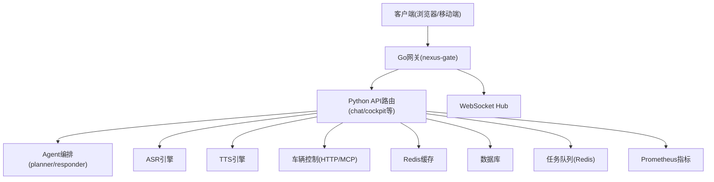
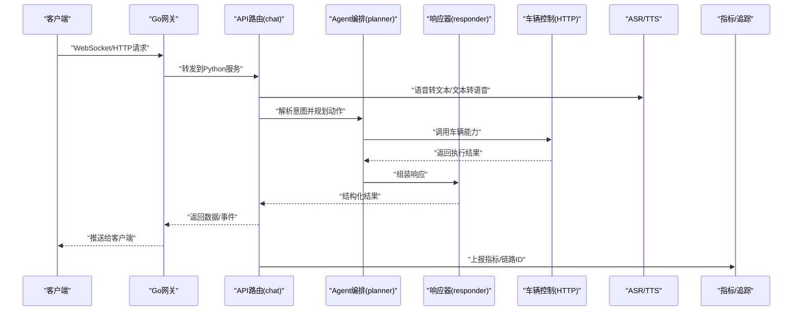
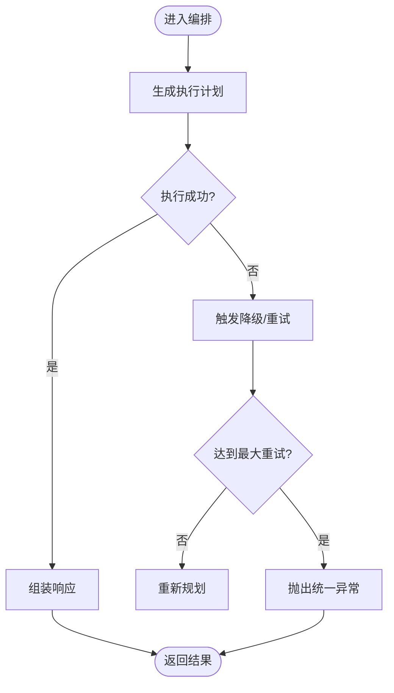
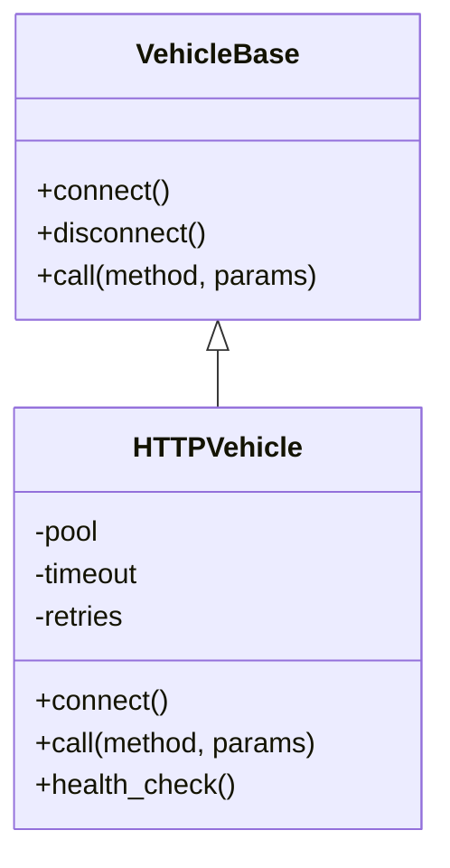
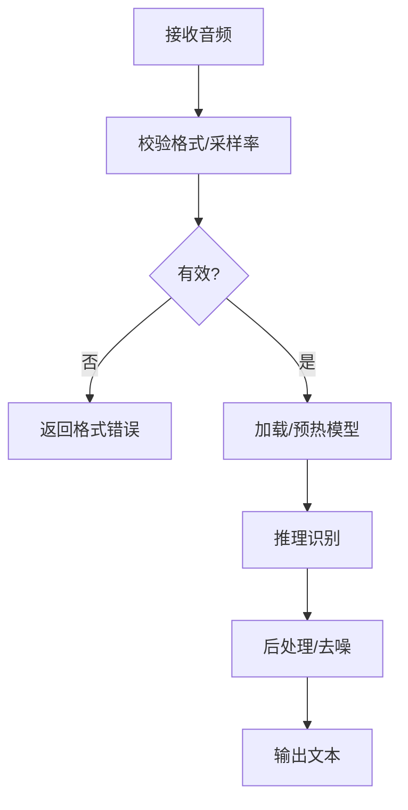
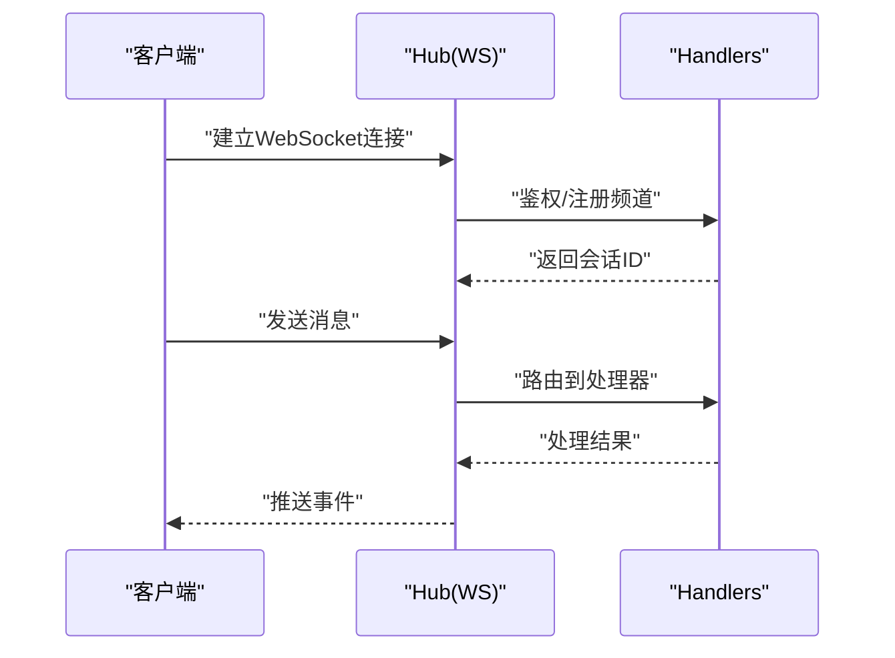
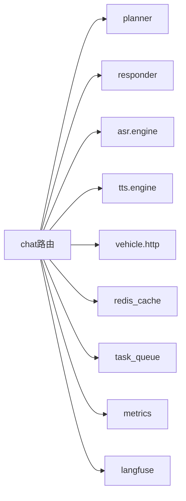

# 故障排查指南

<cite>
**本文引用的文件**   
- [backend_design/nexus/main.py](file://backend_design/nexus/main.py)
- [backend_design/nexus/core/logger.py](file://backend_design/nexus/core/logger.py)
- [backend_design/nexus/core/exceptions.py](file://backend_design/nexus/core/exceptions.py)
- [backend_design/nexus/core/db_manager.py](file://backend_design/nexus/core/db_manager.py)
- [backend_design/nexus/middleware/redis_cache.py](file://backend_design/nexus/middleware/redis_cache.py)
- [backend_design/nexus/middleware/task_queue.py](file://backend_design/nexus/middleware/task_queue.py)
- [backend_design/nexus/asr/engine.py](file://backend_design/nexus/asr/engine.py)
- [backend_design/nexus/tts/engine.py](file://backend_design/nexus/tts/engine.py)
- [backend_design/nexus/vehicle/base.py](file://backend_design/nexus/vehicle/base.py)
- [backend_design/nexus/vehicle/http.py](file://backend_design/nexus/vehicle/http.py)
- [backend_design/nexus/agent/planner.py](file://backend_design/nexus/agent/planner.py)
- [backend_design/nexus/agent/responder.py](file://backend_design/nexus/agent/responder.py)
- [backend_design/nexus/api/routes/chat.py](file://backend_design/nexus/api/routes/chat.py)
- [backend_design/nexus/api/routes/cockpit.py](file://backend_design/nexus/api/routes/cockpit.py)
- [backend_design/nexus/api/websocket.py](file://backend_design/nexus/api/websocket.py)
- [backend_design/nexus/observability/metrics.py](file://backend_design/nexus/observability/metrics.py)
- [backend_design/nexus/observability/langfuse.py](file://backend_design/nexus/observability/langfuse.py)
- [backend_design/nexus_gate/internal/handlers/handlers.go](file://backend_design/nexus_gate/internal/handlers/handlers.go)
- [backend_design/nexus_gate/internal/ws/hub.go](file://backend_design/nexus_gate/internal/ws/hub.go)
- [config/prometheus/prometheus.yml](file://config/prometheus/prometheus.yml)
- [config/grafana/provisioning/dashboards/nexuscockpit-overview.json](file://config/grafana/provisioning/dashboards/nexuscockpit-overview.json)
</cite>

## 目录
1. [简介](#简介)
2. [项目结构](#项目结构)
3. [核心组件](#核心组件)
4. [架构总览](#架构总览)
5. [详细组件分析](#详细组件分析)
6. [依赖分析](#依赖分析)
7. [性能考虑](#性能考虑)
8. [故障排查指南](#故障排查指南)
9. [结论](#结论)
10. [附录](#附录)

## 简介
本指南面向NexusCockpit系统的运维与研发人员，聚焦于常见问题定位、日志分析技巧、性能瓶颈定位与恢复策略。内容覆盖Agent系统异常处理、车辆控制连接问题、语音识别错误排查、数据库连接问题、缓存失效、消息队列阻塞的诊断步骤，并提供调试工具使用、链路追踪分析与内存泄漏检测建议。

## 项目结构
NexusCockpit后端采用Python服务（FastAPI）+ Go网关（nexus-gate）的混合架构：
- Python服务负责业务编排、Agent调度、ASR/TTS、车辆能力集成、中间件（Redis缓存、任务队列）、可观测性指标等。
- Go网关负责鉴权、限流、WebSocket转发与代理。
- 前端通过HTTP/WebSocket与服务交互。

**图表来源**
- [backend_design/nexus/api/routes/chat.py](file://backend_design/nexus/api/routes/chat.py)
- [backend_design/nexus/api/routes/cockpit.py](file://backend_design/nexus/api/routes/cockpit.py)
- [backend_design/nexus/api/websocket.py](file://backend_design/nexus/api/websocket.py)
- [backend_design/nexus/agent/planner.py](file://backend_design/nexus/agent/planner.py)
- [backend_design/nexus/agent/responder.py](file://backend_design/nexus/agent/responder.py)
- [backend_design/nexus/asr/engine.py](file://backend_design/nexus/asr/engine.py)
- [backend_design/nexus/tts/engine.py](file://backend_design/nexus/tts/engine.py)
- [backend_design/nexus/vehicle/http.py](file://backend_design/nexus/vehicle/http.py)
- [backend_design/nexus/middleware/redis_cache.py](file://backend_design/nexus/middleware/redis_cache.py)
- [backend_design/nexus/middleware/task_queue.py](file://backend_design/nexus/middleware/task_queue.py)
- [backend_design/nexus/observability/metrics.py](file://backend_design/nexus/observability/metrics.py)
- [backend_design/nexus_gate/internal/handlers/handlers.go](file://backend_design/nexus_gate/internal/handlers/handlers.go)
- [backend_design/nexus_gate/internal/ws/hub.go](file://backend_design/nexus_gate/internal/ws/hub.go)

**章节来源**
- [backend_design/nexus/main.py](file://backend_design/nexus/main.py)
- [backend_design/nexus/api/routes/chat.py](file://backend_design/nexus/api/routes/chat.py)
- [backend_design/nexus/api/routes/cockpit.py](file://backend_design/nexus/api/routes/cockpit.py)
- [backend_design/nexus/api/websocket.py](file://backend_design/nexus/api/websocket.py)

## 核心组件
- 日志与异常：集中式日志记录与统一异常类型定义，便于快速定位错误上下文。
- 数据库管理：连接池、重试与超时配置，提供健康检查与慢查询告警。
- 缓存中间件：Redis读写封装、键空间清理与一致性策略。
- 任务队列：基于Redis的异步任务分发与消费，支持优先级与重试。
- ASR/TTS：语音识别与合成引擎封装，含模型加载、音频格式校验与错误码映射。
- 车辆控制：HTTP/MCP协议抽象，包含连接池、熔断与重试策略。
- 可观测性：Prometheus指标采集、Langfuse链路追踪与Grafana看板。

**章节来源**
- [backend_design/nexus/core/logger.py](file://backend_design/nexus/core/logger.py)
- [backend_design/nexus/core/exceptions.py](file://backend_design/nexus/core/exceptions.py)
- [backend_design/nexus/core/db_manager.py](file://backend_design/nexus/core/db_manager.py)
- [backend_design/nexus/middleware/redis_cache.py](file://backend_design/nexus/middleware/redis_cache.py)
- [backend_design/nexus/middleware/task_queue.py](file://backend_design/nexus/middleware/task_queue.py)
- [backend_design/nexus/asr/engine.py](file://backend_design/nexus/asr/engine.py)
- [backend_design/nexus/tts/engine.py](file://backend_design/nexus/tts/engine.py)
- [backend_design/nexus/vehicle/base.py](file://backend_design/nexus/vehicle/base.py)
- [backend_design/nexus/vehicle/http.py](file://backend_design/nexus/vehicle/http.py)
- [backend_design/nexus/observability/metrics.py](file://backend_design/nexus/observability/metrics.py)
- [backend_design/nexus/observability/langfuse.py](file://backend_design/nexus/observability/langfuse.py)

## 架构总览
下图展示一次“语音对话→意图理解→执行→反馈”的典型请求路径，以及关键的可观测点。

**图表来源**
- [backend_design/nexus/api/routes/chat.py](file://backend_design/nexus/api/routes/chat.py)
- [backend_design/nexus/agent/planner.py](file://backend_design/nexus/agent/planner.py)
- [backend_design/nexus/agent/responder.py](file://backend_design/nexus/agent/responder.py)
- [backend_design/nexus/vehicle/http.py](file://backend_design/nexus/vehicle/http.py)
- [backend_design/nexus/asr/engine.py](file://backend_design/nexus/asr/engine.py)
- [backend_design/nexus/tts/engine.py](file://backend_design/nexus/tts/engine.py)
- [backend_design/nexus/observability/metrics.py](file://backend_design/nexus/observability/metrics.py)
- [backend_design/nexus/observability/langfuse.py](file://backend_design/nexus/observability/langfuse.py)

## 详细组件分析

### Agent系统异常处理
- 编排层(planner)负责将用户意图拆解为子任务，并在失败时进行回退或重试；响应器(responder)负责将结果标准化并携带上下文信息。
- 常见异常包括：外部服务不可用、参数校验失败、资源不足、超时等。应结合统一异常类型与日志上下文进行归因。

**图表来源**
- [backend_design/nexus/agent/planner.py](file://backend_design/nexus/agent/planner.py)
- [backend_design/nexus/agent/responder.py](file://backend_design/nexus/agent/responder.py)
- [backend_design/nexus/core/exceptions.py](file://backend_design/nexus/core/exceptions.py)

**章节来源**
- [backend_design/nexus/agent/planner.py](file://backend_design/nexus/agent/planner.py)
- [backend_design/nexus/agent/responder.py](file://backend_design/nexus/agent/responder.py)
- [backend_design/nexus/core/exceptions.py](file://backend_design/nexus/core/exceptions.py)

### 车辆控制连接问题
- 车辆控制通过HTTP/MCP抽象，具备连接池、超时与熔断机制。连接失败通常由网络抖动、认证过期、远端服务宕机引起。
- 诊断要点：连接池状态、重试次数、熔断器状态、下游延迟分布。

**图表来源**
- [backend_design/nexus/vehicle/base.py](file://backend_design/nexus/vehicle/base.py)
- [backend_design/nexus/vehicle/http.py](file://backend_design/nexus/vehicle/http.py)

**章节来源**
- [backend_design/nexus/vehicle/base.py](file://backend_design/nexus/vehicle/base.py)
- [backend_design/nexus/vehicle/http.py](file://backend_design/nexus/vehicle/http.py)

### 语音识别错误排查
- ASR引擎负责音频预处理、模型推理与结果后处理。错误可能来自音频格式不匹配、模型加载失败、显存不足、超时等。
- 建议关注：输入采样率/编码格式、模型版本一致性、GPU/CPU资源占用、错误码映射。

**图表来源**
- [backend_design/nexus/asr/engine.py](file://backend_design/nexus/asr/engine.py)

**章节来源**
- [backend_design/nexus/asr/engine.py](file://backend_design/nexus/asr/engine.py)

### WebSocket与网关链路
- Go网关负责鉴权、限流与WebSocket转发；Hub维护连接会话与广播。
- 常见问题：握手失败、心跳超时、订阅频道错误、消息丢失。

**图表来源**
- [backend_design/nexus_gate/internal/ws/hub.go](file://backend_design/nexus_gate/internal/ws/hub.go)
- [backend_design/nexus_gate/internal/handlers/handlers.go](file://backend_design/nexus_gate/internal/handlers/handlers.go)

**章节来源**
- [backend_design/nexus_gate/internal/ws/hub.go](file://backend_design/nexus_gate/internal/ws/hub.go)
- [backend_design/nexus_gate/internal/handlers/handlers.go](file://backend_design/nexus_gate/internal/handlers/handlers.go)

## 依赖分析
- 内部依赖：API路由依赖Agent编排、ASR/TTS、车辆控制、缓存与任务队列；可观测性贯穿各模块。
- 外部依赖：数据库、Redis、Prometheus、Langfuse、车辆服务。

**图表来源**
- [backend_design/nexus/api/routes/chat.py](file://backend_design/nexus/api/routes/chat.py)
- [backend_design/nexus/agent/planner.py](file://backend_design/nexus/agent/planner.py)
- [backend_design/nexus/agent/responder.py](file://backend_design/nexus/agent/responder.py)
- [backend_design/nexus/asr/engine.py](file://backend_design/nexus/asr/engine.py)
- [backend_design/nexus/tts/engine.py](file://backend_design/nexus/tts/engine.py)
- [backend_design/nexus/vehicle/http.py](file://backend_design/nexus/vehicle/http.py)
- [backend_design/nexus/middleware/redis_cache.py](file://backend_design/nexus/middleware/redis_cache.py)
- [backend_design/nexus/middleware/task_queue.py](file://backend_design/nexus/middleware/task_queue.py)
- [backend_design/nexus/observability/metrics.py](file://backend_design/nexus/observability/metrics.py)
- [backend_design/nexus/observability/langfuse.py](file://backend_design/nexus/observability/langfuse.py)

**章节来源**
- [backend_design/nexus/api/routes/chat.py](file://backend_design/nexus/api/routes/chat.py)
- [backend_design/nexus/observability/metrics.py](file://backend_design/nexus/observability/metrics.py)
- [backend_design/nexus/observability/langfuse.py](file://backend_design/nexus/observability/langfuse.py)

## 性能考虑
- 连接池与超时：合理设置数据库、Redis、HTTP连接池大小与超时时间，避免资源耗尽。
- 缓存命中率：监控缓存命中与过期策略，减少热点键倾斜。
- 任务队列积压：监控队列长度与消费者吞吐，必要时扩容或调整优先级。
- 指标与追踪：利用Prometheus与Langfuse观察端到端延迟与错误率。

[本节为通用指导，无需具体文件引用]

## 故障排查指南

### 一、日志分析技巧
- 启用结构化日志，确保每个请求携带唯一链路ID，便于跨服务关联。
- 关键日志点：请求入口、外部调用、缓存命中/未命中、任务入队/出队、异常堆栈。
- 日志级别：生产环境默认INFO/WARN/ERROR，临时排查可提升DEBUG但注意开销。

**章节来源**
- [backend_design/nexus/core/logger.py](file://backend_design/nexus/core/logger.py)

### 二、Agent系统异常处理
- 现象：意图解析失败、子任务执行报错、响应不完整。
- 步骤：
  1) 查看planner日志中的计划与重试次数；
  2) 检查responder是否携带完整上下文；
  3) 确认外部依赖（车辆、LLM、知识库）健康状态；
  4) 根据统一异常类型定位根因分类。

**章节来源**
- [backend_design/nexus/agent/planner.py](file://backend_design/nexus/agent/planner.py)
- [backend_design/nexus/agent/responder.py](file://backend_design/nexus/agent/responder.py)
- [backend_design/nexus/core/exceptions.py](file://backend_design/nexus/core/exceptions.py)

### 三、车辆控制连接问题
- 现象：车辆指令无响应、频繁超时、连接断开。
- 步骤：
  1) 检查HTTP连接池大小与活跃连接数；
  2) 查看熔断器状态与最近失败比例；
  3) 验证认证令牌有效期与签名；
  4) 抓包核对HTTP/MCP报文与端口可达性。

**章节来源**
- [backend_design/nexus/vehicle/http.py](file://backend_design/nexus/vehicle/http.py)
- [backend_design/nexus/vehicle/base.py](file://backend_design/nexus/vehicle/base.py)

### 四、语音识别错误排查
- 现象：无法识别、识别结果为空、乱码。
- 步骤：
  1) 校验音频格式与采样率是否符合预期；
  2) 检查模型加载日志与显存/CPU占用；
  3) 查看推理耗时与错误码映射；
  4) 对比不同音频样本以定位数据问题。

**章节来源**
- [backend_design/nexus/asr/engine.py](file://backend_design/nexus/asr/engine.py)

### 五、数据库连接问题
- 现象：查询超时、连接池耗尽、事务失败。
- 步骤：
  1) 检查连接池配置与当前活跃连接；
  2) 查看慢查询日志与锁等待；
  3) 确认网络连通性与认证凭据；
  4) 重启连接池并观察恢复情况。

**章节来源**
- [backend_design/nexus/core/db_manager.py](file://backend_design/nexus/core/db_manager.py)

### 六、缓存失效
- 现象：热点数据未命中、脏读、雪崩。
- 步骤：
  1) 检查键空间与TTL策略；
  2) 监控命中率与淘汰率；
  3) 对热点键加随机过期与预取；
  4) 评估一致性要求，必要时引入版本号或双写校验。

**章节来源**
- [backend_design/nexus/middleware/redis_cache.py](file://backend_design/nexus/middleware/redis_cache.py)

### 七、消息队列阻塞
- 现象：任务堆积、消费者停滞、重复消费。
- 步骤：
  1) 监控队列长度与消费者速率；
  2) 检查任务幂等与重试策略；
  3) 扩容消费者实例或调整优先级；
  4) 定位死信队列与失败原因。

**章节来源**
- [backend_design/nexus/middleware/task_queue.py](file://backend_design/nexus/middleware/task_queue.py)

### 八、WebSocket与网关链路
- 现象：连接建立失败、消息丢失、心跳超时。
- 步骤：
  1) 检查鉴权与限流规则；
  2) 查看Hub连接数与频道订阅；
  3) 核对客户端重连与心跳间隔；
  4) 在网关侧抓取握手与帧日志。

**章节来源**
- [backend_design/nexus_gate/internal/ws/hub.go](file://backend_design/nexus_gate/internal/ws/hub.go)
- [backend_design/nexus_gate/internal/handlers/handlers.go](file://backend_design/nexus_gate/internal/handlers/handlers.go)

### 九、调试工具使用
- Prometheus指标：暴露服务级指标，结合Grafana看板观察QPS、延迟、错误率、连接池利用率。
- Langfuse链路追踪：为每次请求注入链路ID，串联ASR/TTS/Agent/车辆调用链。
- 本地调试：开启详细日志与慢查询统计，复现问题时捕获完整上下文。

**章节来源**
- [backend_design/nexus/observability/metrics.py](file://backend_design/nexus/observability/metrics.py)
- [backend_design/nexus/observability/langfuse.py](file://backend_design/nexus/observability/langfuse.py)
- [config/prometheus/prometheus.yml](file://config/prometheus/prometheus.yml)
- [config/grafana/provisioning/dashboards/nexuscockpit-overview.json](file://config/grafana/provisioning/dashboards/nexuscockpit-overview.json)

### 十、链路追踪分析
- 在API入口注入链路ID，贯穿planner、responder、ASR/TTS、车辆控制。
- 在Langfuse中按链路ID聚合Span，定位慢节点与异常分支。
- 结合Prometheus指标与日志，形成“指标-链路-日志”三位一体定位法。

**章节来源**
- [backend_design/nexus/observability/langfuse.py](file://backend_design/nexus/observability/langfuse.py)
- [backend_design/nexus/observability/metrics.py](file://backend_design/nexus/observability/metrics.py)

### 十一、内存泄漏检测
- 现象：进程RSS持续增长、GC频繁、响应变慢。
- 步骤：
  1) 使用pprof或类似工具导出内存快照；
  2) 对比不同负载下的对象增长趋势；
  3) 检查长生命周期对象（连接池、缓存、模型）是否正确释放；
  4) 针对热点路径优化数据结构与生命周期管理。

[本节为通用指导，无需具体文件引用]

## 结论
通过系统化日志分析、指标监控与链路追踪，结合统一的异常类型与中间件封装，能够快速定位Agent异常、车辆连接问题、语音识别错误、数据库与缓存问题、消息队列阻塞等典型故障。建议在上线前完善可观测性配置与演练预案，持续优化连接池、缓存策略与任务队列容量，保障系统稳定性与性能。

## 附录
- 常用命令与配置项请参考对应模块源码与配置文件。
- 若需进一步深入，可在开发环境开启更详细的日志与追踪，并结合压测场景验证恢复策略。