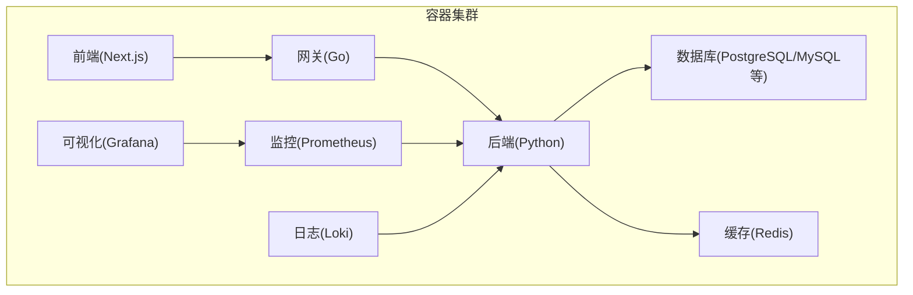
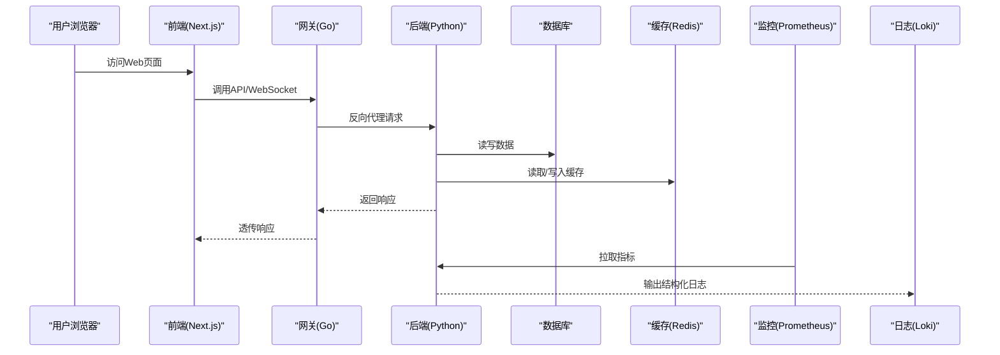
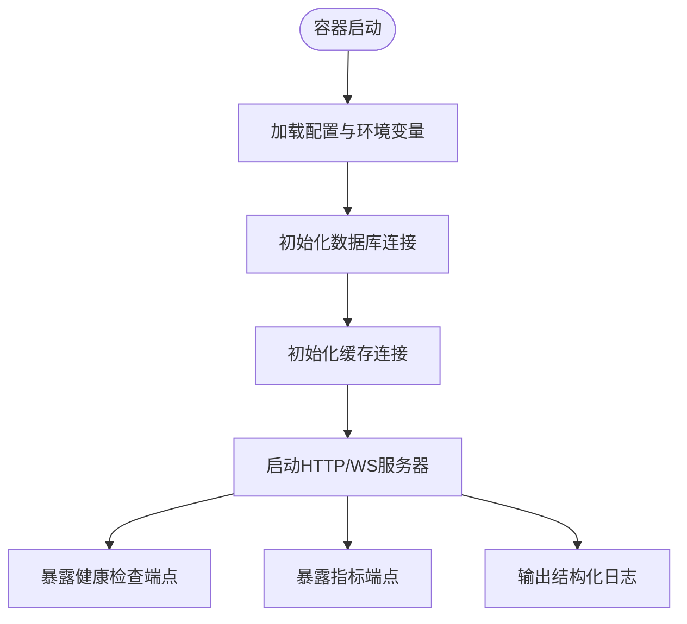
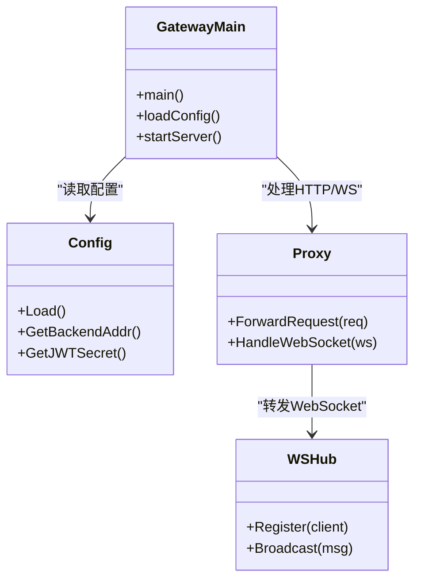
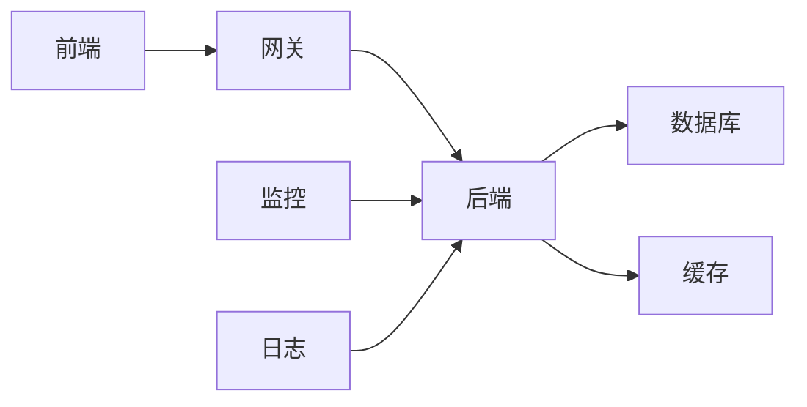

# Docker容器化部署

<cite>
**本文引用的文件**   
- [docker-compose.yml](file://docker-compose.yml)
- [backend/Dockerfile](file://backend_design/Dockerfile)
- [gateway/Dockerfile](file://backend_design/nexus_gate/Dockerfile)
- [frontend/Dockerfile](file://frontend_design/Dockerfile)
- [backend/pyproject.toml](file://backend_design/pyproject.toml)
- [backend/requirements.txt](file://backend_design/requirements.txt)
- [backend/requirements_no_torch.txt](file://backend_design/requirements_no_torch.txt)
- [backend/main.py](file://backend_design/nexus/main.py)
- [backend/config.py](file://backend_design/nexus/config.py)
- [backend/core/logger.py](file://backend_design/nexus/core/logger.py)
- [backend/core/db_manager.py](file://backend_design/nexus/core/db_manager.py)
- [backend/middleware/session_store.py](file://backend_design/nexus/middleware/session_store.py)
- [backend/middleware/redis_cache.py](file://backend_design/nexus/middleware/redis_cache.py)
- [backend/api/routes/health.py](file://backend_design/nexus/api/routes/health.py)
- [backend/api/websocket.py](file://backend_design/nexus/api/websocket.py)
- [gateway/cmd/main.go](file://backend_design/nexus_gate/cmd/main.go)
- [gateway/internal/config/config.go](file://backend_design/nexus_gate/internal/config/config.go)
- [gateway/internal/handlers/handlers.go](file://backend_design/nexus_gate/internal/handlers/handlers.go)
- [gateway/internal/proxy/proxy.go](file://backend_design/nexus_gate/internal/proxy/proxy.go)
- [gateway/internal/ws/hub.go](file://backend_design/nexus_gate/internal/ws/hub.go)
- [config/grafana/provisioning/dashboards/dashboards.yml](file://config/grafana/provisioning/dashboards/dashboards.yml)
- [config/grafana/provisioning/datasources/prometheus.yml](file://config/grafana/provisioning/datasources/prometheus.yml)
- [config/loki/loki-config.yml](file://config/loki/loki-config.yml)
- [config/prometheus/prometheus.yml](file://config/prometheus/prometheus.yml)
</cite>

## 目录
1. [简介](#简介)
2. [项目结构](#项目结构)
3. [核心组件](#核心组件)
4. [架构总览](#架构总览)
5. [详细组件分析](#详细组件分析)
6. [依赖关系分析](#依赖关系分析)
7. [性能与镜像优化](#性能与镜像优化)
8. [故障排查指南](#故障排查指南)
9. [结论](#结论)
10. [附录](#附录)

## 简介
本文件面向NexusCockpit系统的Docker容器化部署，覆盖以下主题：
- Docker镜像构建过程、多阶段构建与分层策略
- docker-compose服务编排（Python后端、Go网关、前端应用、数据库等）的依赖关系与网络配置
- 环境变量管理、数据卷挂载与日志收集
- 容器健康检查、资源限制与启动顺序控制

## 项目结构
仓库包含多个可容器化的子项目：
- 后端（Python）：位于 backend_design 目录，提供业务API、WebSocket、RAG、技能编排等能力
- 网关（Go）：位于 backend_design/nexus_gate 目录，负责鉴权、限流、反向代理与WebSocket转发
- 前端（Next.js）：位于 frontend_design 目录，提供Web控制台与交互界面
- 配置：位于 config 目录，包含Grafana、Prometheus、Loki等观测性配置
- 根级编排：docker-compose.yml 用于本地或CI环境的服务编排

[此图为概念性架构图，不直接映射具体源码文件]

## 核心组件
- 后端服务（Python）
  - 入口与配置：主程序入口与配置加载逻辑
  - 中间件：会话存储、Redis缓存、任务队列等
  - API与WebSocket：REST接口与健康检查、WebSocket通道
  - 日志：结构化日志输出，便于集中采集
- 网关服务（Go）
  - 配置加载、路由与处理器
  - 反向代理到后端
  - WebSocket Hub转发
- 前端应用（Next.js）
  - 静态构建产物由Nginx托管
- 数据库与缓存
  - 持久化数据通过数据卷挂载
  - Redis作为会话与缓存后端
- 观测性与日志
  - Prometheus抓取指标
  - Grafana展示仪表盘
  - Loki聚合日志

章节来源
- [docker-compose.yml](file://docker-compose.yml)
- [backend/main.py](file://backend_design/nexus/main.py)
- [backend/config.py](file://backend_design/nexus/config.py)
- [backend/core/logger.py](file://backend_design/nexus/core/logger.py)
- [backend/core/db_manager.py](file://backend_design/nexus/core/db_manager.py)
- [backend/middleware/session_store.py](file://backend_design/nexus/middleware/session_store.py)
- [backend/middleware/redis_cache.py](file://backend_design/nexus/middleware/redis_cache.py)
- [backend/api/routes/health.py](file://backend_design/nexus/api/routes/health.py)
- [backend/api/websocket.py](file://backend_design/nexus/api/websocket.py)
- [gateway/cmd/main.go](file://backend_design/nexus_gate/cmd/main.go)
- [gateway/internal/config/config.go](file://backend_design/nexus_gate/internal/config/config.go)
- [gateway/internal/handlers/handlers.go](file://backend_design/nexus_gate/internal/handlers/handlers.go)
- [gateway/internal/proxy/proxy.go](file://backend_design/nexus_gate/internal/proxy/proxy.go)
- [gateway/internal/ws/hub.go](file://backend_design/nexus_gate/internal/ws/hub.go)
- [config/grafana/provisioning/dashboards/dashboards.yml](file://config/grafana/provisioning/dashboards/dashboards.yml)
- [config/grafana/provisioning/datasources/prometheus.yml](file://config/grafana/provisioning/datasources/prometheus.yml)
- [config/loki/loki-config.yml](file://config/loki/loki-config.yml)
- [config/prometheus/prometheus.yml](file://config/prometheus/prometheus.yml)

## 架构总览
下图展示了容器间请求路径与关键依赖：浏览器访问前端，经网关统一入口，再路由至后端；后端连接数据库与缓存；监控与日志系统独立运行并采集后端指标与日志。

图表来源
- [gateway/cmd/main.go](file://backend_design/nexus_gate/cmd/main.go)
- [gateway/internal/proxy/proxy.go](file://backend_design/nexus_gate/internal/proxy/proxy.go)
- [backend/api/websocket.py](file://backend_design/nexus/api/websocket.py)
- [backend/core/db_manager.py](file://backend_design/nexus/core/db_manager.py)
- [backend/middleware/redis_cache.py](file://backend_design/nexus/middleware/redis_cache.py)
- [config/prometheus/prometheus.yml](file://config/prometheus/prometheus.yml)
- [config/loki/loki-config.yml](file://config/loki/loki-config.yml)

## 详细组件分析

### 后端服务（Python）
- 镜像构建
  - 使用多阶段构建：第一阶段安装依赖与编译扩展，第二阶段仅拷贝运行时所需文件，显著减小镜像体积
  - 分层策略：将依赖安装层与应用代码层分离，利用Docker缓存加速重复构建
- 配置与环境变量
  - 通过配置文件与环境变量注入数据库、缓存、认证、LLM等参数
- 健康检查
  - 暴露健康检查端点，供编排器探测服务可用性
- 日志与指标
  - 输出结构化日志，支持stdout/stderr与文件双写
  - 暴露Prometheus指标端点，供监控采集

图表来源
- [backend/main.py](file://backend_design/nexus/main.py)
- [backend/config.py](file://backend_design/nexus/config.py)
- [backend/core/db_manager.py](file://backend_design/nexus/core/db_manager.py)
- [backend/middleware/redis_cache.py](file://backend_design/nexus/middleware/redis_cache.py)
- [backend/api/routes/health.py](file://backend_design/nexus/api/routes/health.py)
- [backend/core/logger.py](file://backend_design/nexus/core/logger.py)

章节来源
- [backend/Dockerfile](file://backend_design/Dockerfile)
- [backend/pyproject.toml](file://backend_design/pyproject.toml)
- [backend/requirements.txt](file://backend_design/requirements.txt)
- [backend/requirements_no_torch.txt](file://backend_design/requirements_no_torch.txt)
- [backend/main.py](file://backend_design/nexus/main.py)
- [backend/config.py](file://backend_design/nexus/config.py)
- [backend/core/logger.py](file://backend_design/nexus/core/logger.py)
- [backend/core/db_manager.py](file://backend_design/nexus/core/db_manager.py)
- [backend/middleware/session_store.py](file://backend_design/nexus/middleware/session_store.py)
- [backend/middleware/redis_cache.py](file://backend_design/nexus/middleware/redis_cache.py)
- [backend/api/routes/health.py](file://backend_design/nexus/api/routes/health.py)
- [backend/api/websocket.py](file://backend_design/nexus/api/websocket.py)

### 网关服务（Go）
- 镜像构建
  - 多阶段构建：第一阶段编译二进制，第二阶段仅拷贝可执行文件与必要证书/配置
- 功能职责
  - 鉴权与限流
  - 反向代理到后端API
  - WebSocket Hub转发
- 配置与环境变量
  - 通过配置文件与环境变量注入后端地址、JWT密钥、限流策略等

图表来源
- [gateway/cmd/main.go](file://backend_design/nexus_gate/cmd/main.go)
- [gateway/internal/config/config.go](file://backend_design/nexus_gate/internal/config/config.go)
- [gateway/internal/proxy/proxy.go](file://backend_design/nexus_gate/internal/proxy/proxy.go)
- [gateway/internal/ws/hub.go](file://backend_design/nexus_gate/internal/ws/hub.go)

章节来源
- [gateway/Dockerfile](file://backend_design/nexus_gate/Dockerfile)
- [gateway/cmd/main.go](file://backend_design/nexus_gate/cmd/main.go)
- [gateway/internal/config/config.go](file://backend_design/nexus_gate/internal/config/config.go)
- [gateway/internal/handlers/handlers.go](file://backend_design/nexus_gate/internal/handlers/handlers.go)
- [gateway/internal/proxy/proxy.go](file://backend_design/nexus_gate/internal/proxy/proxy.go)
- [gateway/internal/ws/hub.go](file://backend_design/nexus_gate/internal/ws/hub.go)

### 前端应用（Next.js）
- 镜像构建
  - 多阶段构建：第一阶段安装依赖并构建静态资源，第二阶段用轻量Nginx镜像托管构建产物
- 部署方式
  - 通过网关统一域名与路径前缀对外暴露
  - 静态资源缓存与压缩由Nginx处理

章节来源
- [frontend/Dockerfile](file://frontend_design/Dockerfile)

### 数据库与缓存
- 数据库
  - 使用官方镜像，通过数据卷持久化数据目录
  - 建议设置密码、时区、字符集等环境变量
- 缓存（Redis）
  - 使用官方镜像，开启AOF/RDB持久化
  - 通过数据卷持久化数据目录

章节来源
- [docker-compose.yml](file://docker-compose.yml)

### 观测性与日志
- Prometheus
  - 抓取后端指标端点，提供时序数据
- Grafana
  - 预置仪表盘与数据源配置，开箱即用
- Loki
  - 聚合容器标准输出日志，支持按标签检索

章节来源
- [config/grafana/provisioning/dashboards/dashboards.yml](file://config/grafana/provisioning/dashboards/dashboards.yml)
- [config/grafana/provisioning/datasources/prometheus.yml](file://config/grafana/provisioning/datasources/prometheus.yml)
- [config/loki/loki-config.yml](file://config/loki/loki-config.yml)
- [config/prometheus/prometheus.yml](file://config/prometheus/prometheus.yml)

## 依赖关系分析
- 服务依赖
  - 前端依赖网关（反向代理）
  - 网关依赖后端、可选鉴权与限流组件
  - 后端依赖数据库与缓存
  - 监控与日志独立于业务服务，但需网络可达
- 网络拓扑
  - 所有服务加入同一Compose网络，内部通过服务名通信
  - 对外仅暴露网关端口，前端静态资源由网关或独立Nginx代理

图表来源
- [docker-compose.yml](file://docker-compose.yml)

章节来源
- [docker-compose.yml](file://docker-compose.yml)

## 性能与镜像优化
- 多阶段构建
  - 后端：构建期安装依赖与编译扩展，运行期仅保留最小运行时
  - 网关：构建期生成二进制，运行期仅拷贝可执行文件
  - 前端：构建期生成静态资源，运行期使用Nginx托管
- 分层策略
  - 将依赖层与代码层分离，最大化利用Docker缓存
  - 使用.dockerignore排除无关文件，减少上下文传输
- 资源限制
  - 在编排文件中为各服务设置CPU与内存上限，避免争抢
- 启动顺序控制
  - 使用depends_on与条件健康检查确保依赖就绪后再启动上游服务

章节来源
- [backend/Dockerfile](file://backend_design/Dockerfile)
- [gateway/Dockerfile](file://backend_design/nexus_gate/Dockerfile)
- [frontend/Dockerfile](file://frontend_design/Dockerfile)
- [docker-compose.yml](file://docker-compose.yml)

## 故障排查指南
- 健康检查失败
  - 检查后端健康端点是否可用
  - 确认数据库与缓存连接正常
- 日志定位
  - 查看容器标准输出与文件日志
  - 通过Loki按服务标签检索
- 指标异常
  - 检查Prometheus抓取目标状态
  - 核对后端指标端点暴露与权限
- 网络问题
  - 验证服务名解析与端口映射
  - 检查防火墙与安全组规则

章节来源
- [backend/api/routes/health.py](file://backend_design/nexus/api/routes/health.py)
- [backend/core/logger.py](file://backend_design/nexus/core/logger.py)
- [config/prometheus/prometheus.yml](file://config/prometheus/prometheus.yml)
- [config/loki/loki-config.yml](file://config/loki/loki-config.yml)

## 结论
通过多阶段构建与合理的镜像分层，NexusCockpit实现了高可移植、低体积的容器镜像；借助docker-compose进行服务编排，明确了前后端、网关、数据库与缓存之间的依赖关系与网络拓扑；配合健康检查、资源限制与启动顺序控制，提升了部署稳定性与可观测性。

## 附录
- 环境变量参考
  - 后端：数据库连接、缓存地址、认证密钥、日志级别等
  - 网关：后端地址、JWT密钥、限流阈值等
  - 数据库：用户名、密码、时区、字符集等
  - 监控与日志：采集间隔、保留策略等
- 数据卷建议
  - 数据库与缓存数据目录持久化
  - 上传与临时文件目录按需挂载
- 安全建议
  - 敏感信息通过环境变量或密钥管理工具注入
  - 对外仅暴露必要端口，内部服务通过Compose网络隔离

章节来源
- [docker-compose.yml](file://docker-compose.yml)
- [backend/config.py](file://backend_design/nexus/config.py)
- [gateway/internal/config/config.go](file://backend_design/nexus_gate/internal/config/config.go)