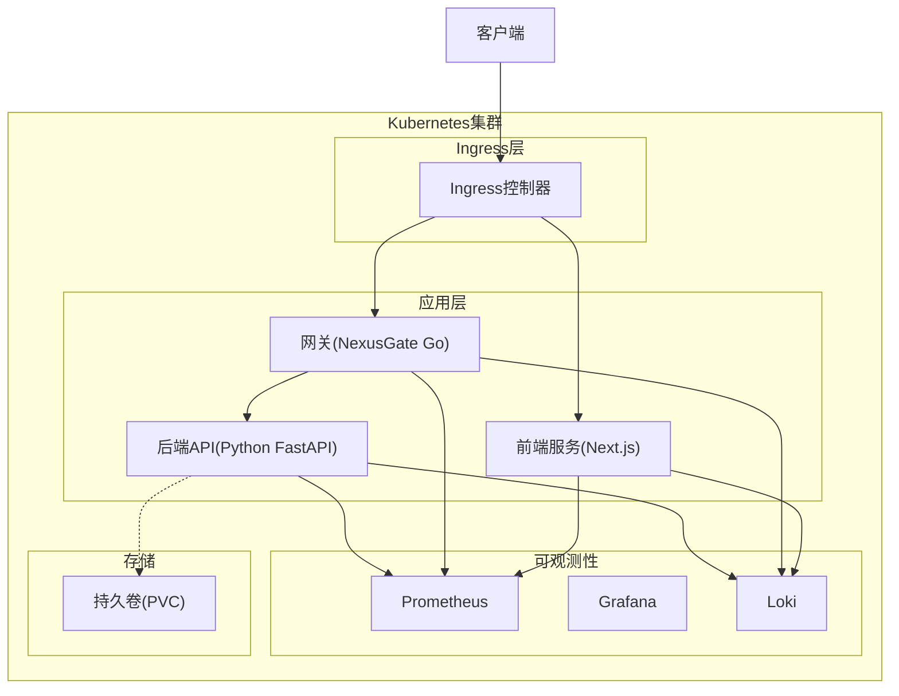
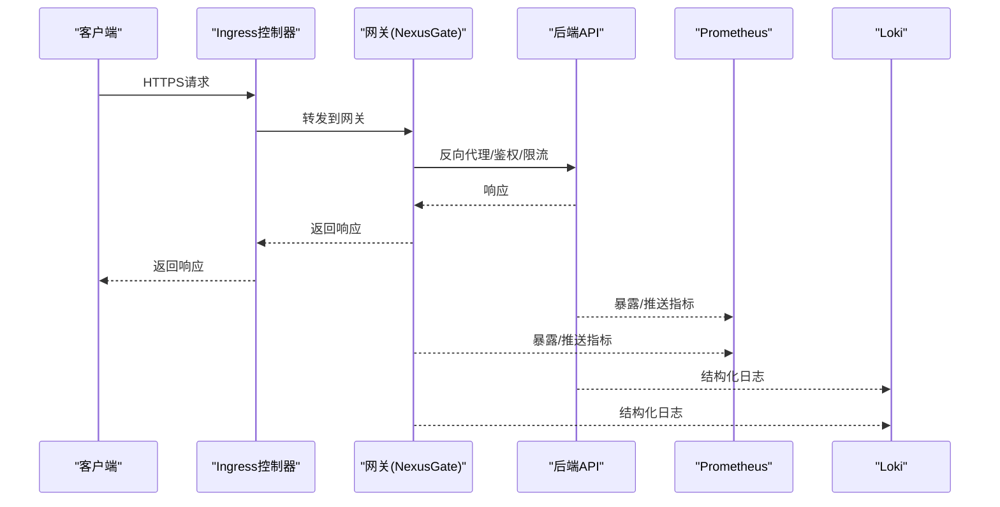
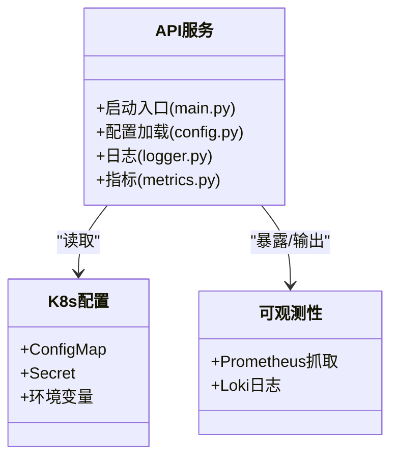
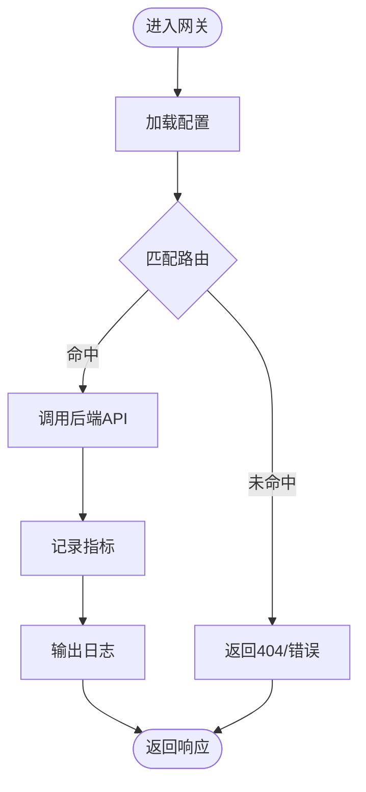
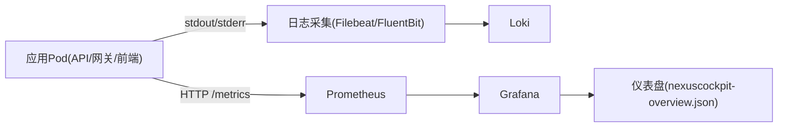
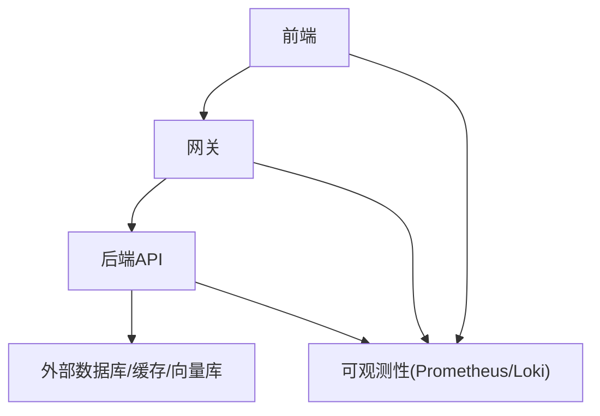

# Kubernetes集群编排

<cite>
**本文引用的文件**   
- [docker-compose.yml](file://docker-compose.yml)
- [backend_design/Dockerfile](file://backend_design/Dockerfile)
- [backend_design/nexus/main.py](file://backend_design/nexus/main.py)
- [backend_design/nexus/config.py](file://backend_design/nexus/config.py)
- [backend_design/nexus/core/logger.py](file://backend_design/nexus/core/logger.py)
- [backend_design/nexus/observability/metrics.py](file://backend_design/nexus/observability/metrics.py)
- [backend_design/nexus_gate/cmd/main.go](file://backend_design/nexus_gate/cmd/main.go)
- [backend_design/nexus_gate/internal/config/config.go](file://backend_design/nexus_gate/internal/config/config.go)
- [backend_design/nexus_gate/internal/handlers/handlers.go](file://backend_design/nexus_gate/internal/handlers/handlers.go)
- [backend_design/nexus_gate/internal/proxy/proxy.go](file://backend_design/nexus_gate/internal/proxy/proxy.go)
- [config/prometheus/prometheus.yml](file://config/prometheus/prometheus.yml)
- [config/grafana/provisioning/datasources/prometheus.yml](file://config/grafana/provisioning/datasources/prometheus.yml)
- [config/grafana/provisioning/dashboards/dashboards.yml](file://config/grafana/provisioning/dashboards/dashboards.yml)
- [config/grafana/provisioning/dashboards/nexuscockpit-overview.json](file://config/grafana/provisioning/dashboards/nexuscockpit-overview.json)
- [config/loki/loki-config.yml/](file://config/loki/loki-config.yml/)
- [frontend_design/Dockerfile](file://frontend_design/Dockerfile)
</cite>

## 目录
1. [简介](#简介)
2. [项目结构](#项目结构)
3. [核心组件](#核心组件)
4. [架构总览](#架构总览)
5. [详细组件分析](#详细组件分析)
6. [依赖关系分析](#依赖关系分析)
7. [性能与容量规划](#性能与容量规划)
8. [故障排查指南](#故障排查指南)
9. [结论](#结论)
10. [附录](#附录)

## 简介
本文件面向NexusCockpit系统的Kubernetes集群编排，覆盖以下主题：
- 微服务部署资源（Deployment、Service、ConfigMap、Secret）的设计与示例要点
- 服务发现、负载均衡与流量管理策略
- Helm Chart模板的组织与参数化建议
- 命名空间隔离与资源配额（ResourceQuota/LimitRange）
- Ingress控制器配置、TLS证书管理与外部访问
- 持久化存储方案与数据卷挂载
- 监控集成（Prometheus/Grafana）与日志收集（Loki）

说明：仓库未提供现成的K8s清单或Helm Chart。本文基于现有Docker镜像构建方式、应用配置与可观测性代码，给出可直接落地的编排方案与最佳实践。

## 项目结构
从容器化与可观测性角度，关键路径如下：
- 后端Python服务镜像构建入口：backend_design/Dockerfile
- 网关Go服务镜像构建入口：backend_design/nexus_gate/Dockerfile
- 前端静态站点镜像构建入口：frontend_design/Dockerfile
- 本地编排参考：docker-compose.yml
- Prometheus抓取与Grafana数据源/仪表盘预置：config/prometheus/*, config/grafana/provisioning/*
- Loki配置文件目录：config/loki/loki-config.yml/

图表来源
- [backend_design/Dockerfile](file://backend_design/Dockerfile)
- [backend_design/nexus_gate/cmd/main.go](file://backend_design/nexus_gate/cmd/main.go)
- [frontend_design/Dockerfile](file://frontend_design/Dockerfile)
- [config/prometheus/prometheus.yml](file://config/prometheus/prometheus.yml)
- [config/grafana/provisioning/datasources/prometheus.yml](file://config/grafana/provisioning/datasources/prometheus.yml)
- [config/grafana/provisioning/dashboards/dashboards.yml](file://config/grafana/provisioning/dashboards/dashboards.yml)
- [config/grafana/provisioning/dashboards/nexuscockpit-overview.json](file://config/grafana/provisioning/dashboards/nexuscockpit-overview.json)
- [config/loki/loki-config.yml/](file://config/loki/loki-config.yml/)

章节来源
- [docker-compose.yml](file://docker-compose.yml)
- [backend_design/Dockerfile](file://backend_design/Dockerfile)
- [frontend_design/Dockerfile](file://frontend_design/Dockerfile)
- [config/prometheus/prometheus.yml](file://config/prometheus/prometheus.yml)
- [config/grafana/provisioning/datasources/prometheus.yml](file://config/grafana/provisioning/datasources/prometheus.yml)
- [config/grafana/provisioning/dashboards/dashboards.yml](file://config/grafana/provisioning/dashboards/dashboards.yml)
- [config/grafana/provisioning/dashboards/nexuscockpit-overview.json](file://config/grafana/provisioning/dashboards/nexuscockpit-overview.json)
- [config/loki/loki-config.yml/](file://config/loki/loki-config.yml/)

## 核心组件
- 后端API服务（Python）
  - 镜像构建：backend_design/Dockerfile
  - 启动入口与路由注册：backend_design/nexus/main.py
  - 配置加载：backend_design/nexus/config.py
  - 日志输出：backend_design/nexus/core/logger.py
  - 指标暴露：backend_design/nexus/observability/metrics.py
- 网关服务（Go）
  - 入口：backend_design/nexus_gate/cmd/main.go
  - 配置：backend_design/nexus_gate/internal/config/config.go
  - 处理器与代理：backend_design/nexus_gate/internal/handlers/handlers.go, backend_design/nexus_gate/internal/proxy/proxy.go
- 前端服务（Next.js）
  - 镜像构建：frontend_design/Dockerfile
- 可观测性
  - Prometheus抓取：config/prometheus/prometheus.yml
  - Grafana数据源与仪表盘：config/grafana/provisioning/datasources/prometheus.yml, dashboards.yml, nexuscockpit-overview.json
  - Loki配置目录：config/loki/loki-config.yml/

章节来源
- [backend_design/Dockerfile](file://backend_design/Dockerfile)
- [backend_design/nexus/main.py](file://backend_design/nexus/main.py)
- [backend_design/nexus/config.py](file://backend_design/nexus/config.py)
- [backend_design/nexus/core/logger.py](file://backend_design/nexus/core/logger.py)
- [backend_design/nexus/observability/metrics.py](file://backend_design/nexus/observability/metrics.py)
- [backend_design/nexus_gate/cmd/main.go](file://backend_design/nexus_gate/cmd/main.go)
- [backend_design/nexus_gate/internal/config/config.go](file://backend_design/nexus_gate/internal/config/config.go)
- [backend_design/nexus_gate/internal/handlers/handlers.go](file://backend_design/nexus_gate/internal/handlers/handlers.go)
- [backend_design/nexus_gate/internal/proxy/proxy.go](file://backend_design/nexus_gate/internal/proxy/proxy.go)
- [frontend_design/Dockerfile](file://frontend_design/Dockerfile)
- [config/prometheus/prometheus.yml](file://config/prometheus/prometheus.yml)
- [config/grafana/provisioning/datasources/prometheus.yml](file://config/grafana/provisioning/datasources/prometheus.yml)
- [config/grafana/provisioning/dashboards/dashboards.yml](file://config/grafana/provisioning/dashboards/dashboards.yml)
- [config/grafana/provisioning/dashboards/nexuscockpit-overview.json](file://config/grafana/provisioning/dashboards/nexuscockpit-overview.json)
- [config/loki/loki-config.yml/](file://config/loki/loki-config.yml/)

## 架构总览
整体采用“前端静态站点 + API服务 + 统一网关”的微服务分层，通过Ingress对外暴露HTTPS入口，内部使用ClusterIP Service进行服务发现与负载均衡，Prometheus采集各组件指标，Grafana展示，Loki集中收集日志。

图表来源
- [backend_design/nexus_gate/cmd/main.go](file://backend_design/nexus_gate/cmd/main.go)
- [backend_design/nexus_gate/internal/proxy/proxy.go](file://backend_design/nexus_gate/internal/proxy/proxy.go)
- [backend_design/nexus/main.py](file://backend_design/nexus/main.py)
- [config/prometheus/prometheus.yml](file://config/prometheus/prometheus.yml)
- [config/loki/loki-config.yml/](file://config/loki/loki-config.yml/)

## 详细组件分析

### 后端API服务（Python）
- 镜像构建与运行
  - 构建脚本与依赖安装见：backend_design/Dockerfile
  - 进程入口与路由注册见：backend_design/nexus/main.py
- 配置与环境变量
  - 配置加载逻辑见：backend_design/nexus/config.py
  - 建议在K8s中通过ConfigMap注入默认配置，Secret注入敏感项（如数据库连接串、密钥等），并通过环境变量或挂载文件方式供应用读取
- 日志与指标
  - 日志模块：backend_design/nexus/core/logger.py
  - 指标模块：backend_design/nexus/observability/metrics.py
  - 建议将指标端点暴露为HTTP端口，供Prometheus抓取；日志以结构化格式输出至stdout/stderr，由DaemonSet侧车或Filebeat采集至Loki

图表来源
- [backend_design/nexus/main.py](file://backend_design/nexus/main.py)
- [backend_design/nexus/config.py](file://backend_design/nexus/config.py)
- [backend_design/nexus/core/logger.py](file://backend_design/nexus/core/logger.py)
- [backend_design/nexus/observability/metrics.py](file://backend_design/nexus/observability/metrics.py)

章节来源
- [backend_design/Dockerfile](file://backend_design/Dockerfile)
- [backend_design/nexus/main.py](file://backend_design/nexus/main.py)
- [backend_design/nexus/config.py](file://backend_design/nexus/config.py)
- [backend_design/nexus/core/logger.py](file://backend_design/nexus/core/logger.py)
- [backend_design/nexus/observability/metrics.py](file://backend_design/nexus/observability/metrics.py)

### 网关服务（Go）
- 入口与配置
  - 主程序入口：backend_design/nexus_gate/cmd/main.go
  - 配置加载：backend_design/nexus_gate/internal/config/config.go
- 处理与代理
  - 请求处理与中间件：backend_design/nexus_gate/internal/handlers/handlers.go
  - 反向代理实现：backend_design/nexus_gate/internal/proxy/proxy.go
- 在K8s中的角色
  - 作为统一入口的Sidecar或独立Service，承载鉴权、限流、协议转换与路由分发
  - 同样暴露指标端点并输出结构化日志

图表来源
- [backend_design/nexus_gate/cmd/main.go](file://backend_design/nexus_gate/cmd/main.go)
- [backend_design/nexus_gate/internal/config/config.go](file://backend_design/nexus_gate/internal/config/config.go)
- [backend_design/nexus_gate/internal/handlers/handlers.go](file://backend_design/nexus_gate/internal/handlers/handlers.go)
- [backend_design/nexus_gate/internal/proxy/proxy.go](file://backend_design/nexus_gate/internal/proxy/proxy.go)

章节来源
- [backend_design/nexus_gate/cmd/main.go](file://backend_design/nexus_gate/cmd/main.go)
- [backend_design/nexus_gate/internal/config/config.go](file://backend_design/nexus_gate/internal/config/config.go)
- [backend_design/nexus_gate/internal/handlers/handlers.go](file://backend_design/nexus_gate/internal/handlers/handlers.go)
- [backend_design/nexus_gate/internal/proxy/proxy.go](file://backend_design/nexus_gate/internal/proxy/proxy.go)

### 前端服务（Next.js）
- 镜像构建：frontend_design/Dockerfile
- 部署形态
  - 通常以静态站点形式部署，无需长连接；可通过Ingress直接暴露或通过网关统一鉴权
- 与后端交互
  - 通过域名或相对路径访问后端API，结合浏览器CORS策略与网关鉴权

章节来源
- [frontend_design/Dockerfile](file://frontend_design/Dockerfile)

### 可观测性（Prometheus/Grafana/Loki）
- Prometheus抓取配置：config/prometheus/prometheus.yml
- Grafana数据源与仪表盘：
  - 数据源：config/grafana/provisioning/datasources/prometheus.yml
  - 仪表盘清单：config/grafana/provisioning/dashboards/dashboards.yml
  - 仪表盘定义：config/grafana/provisioning/dashboards/nexuscockpit-overview.json
- Loki配置目录：config/loki/loki-config.yml/

图表来源
- [config/prometheus/prometheus.yml](file://config/prometheus/prometheus.yml)
- [config/grafana/provisioning/datasources/prometheus.yml](file://config/grafana/provisioning/datasources/prometheus.yml)
- [config/grafana/provisioning/dashboards/dashboards.yml](file://config/grafana/provisioning/dashboards/dashboards.yml)
- [config/grafana/provisioning/dashboards/nexuscockpit-overview.json](file://config/grafana/provisioning/dashboards/nexuscockpit-overview.json)
- [config/loki/loki-config.yml/](file://config/loki/loki-config.yml/)

章节来源
- [config/prometheus/prometheus.yml](file://config/prometheus/prometheus.yml)
- [config/grafana/provisioning/datasources/prometheus.yml](file://config/grafana/provisioning/datasources/prometheus.yml)
- [config/grafana/provisioning/dashboards/dashboards.yml](file://config/grafana/provisioning/dashboards/dashboards.yml)
- [config/grafana/provisioning/dashboards/nexuscockpit-overview.json](file://config/grafana/provisioning/dashboards/nexuscockpit-overview.json)
- [config/loki/loki-config.yml/](file://config/loki/loki-config.yml/)

## 依赖关系分析
- 组件耦合
  - 网关对后端API存在强依赖；前端对网关/API存在弱依赖（仅HTTP接口）
  - 可观测性组件与应用松耦合，通过标准协议（HTTP/JSON、Loki HTTP/Line）对接
- 外部依赖
  - 数据库、向量库、缓存等未在仓库中显式声明，但可通过环境变量与Secret注入，配合StatefulSet/PVC进行持久化

[此图为概念性依赖图，不映射具体源码文件]

## 性能与容量规划
- 副本与水平扩展
  - 根据QPS与延迟目标设置Deployment副本数，并结合HPA自动扩缩容
- 资源限制
  - 为每个容器设置requests/limits，避免资源争用
- 连接池与超时
  - 合理设置后端连接池大小、读写超时与重试策略
- 缓存与会话
  - 使用Redis等外部缓存提升热点数据访问性能
- 带宽与并发
  - 评估Ingress与Node网络吞吐，必要时调整kube-proxy模式与网卡队列

[本节为通用指导，不涉及具体源码文件]

## 故障排查指南
- 常见问题定位
  - 启动失败：检查镜像构建产物、环境变量与ConfigMap/Secret挂载
  - 无法访问：确认Service端口、Ingress规则与TLS证书
  - 指标缺失：核对Prometheus抓取目标与指标端点可达性
  - 日志缺失：确认日志输出格式与采集器配置
- 快速验证步骤
  - 查看Pod事件与日志：kubectl describe pod / kubectl logs
  - 检查Service与Endpoints：kubectl get svc/endpoints
  - 验证Ingress与证书：kubectl get ingress/certificates
  - 测试指标端点：curl http://<pod-ip>:<metrics-port>/metrics

章节来源
- [backend_design/nexus/core/logger.py](file://backend_design/nexus/core/logger.py)
- [backend_design/nexus/observability/metrics.py](file://backend_design/nexus/observability/metrics.py)
- [config/prometheus/prometheus.yml](file://config/prometheus/prometheus.yml)
- [config/grafana/provisioning/datasources/prometheus.yml](file://config/grafana/provisioning/datasources/prometheus.yml)
- [config/grafana/provisioning/dashboards/dashboards.yml](file://config/grafana/provisioning/dashboards/dashboards.yml)
- [config/grafana/provisioning/dashboards/nexuscockpit-overview.json](file://config/grafana/provisioning/dashboards/nexuscockpit-overview.json)
- [config/loki/loki-config.yml/](file://config/loki/loki-config.yml/)

## 结论
本文基于仓库现有的镜像构建与可观测性配置，给出了NexusCockpit在Kubernetes上的完整编排蓝图。通过统一的Ingress入口、网关聚合、标准化指标与日志输出，可实现高可用、可观测、易运维的云原生部署。后续可在仓库中补充K8s清单与Helm Chart，进一步降低部署复杂度。

## 附录

### 命名空间与资源配额
- 命名空间隔离
  - 按环境（dev/staging/prod）创建独立Namespace，配合RBAC控制访问
- 资源配额
  - 使用ResourceQuota限制命名空间内CPU/内存/对象数量
  - 使用LimitRange为容器设置默认requests/limits

[本节为通用指导，不涉及具体源码文件]

### Deployment与服务发现
- Deployment
  - 为API、网关、前端分别创建Deployment，设置副本数、探针、滚动更新策略
- Service
  - 使用ClusterIP暴露内部服务，通过Selector选择Pod标签
- 服务发现
  - 通过DNS名称（<svc>.<namespace>.svc.cluster.local）进行跨命名空间访问

[本节为通用指导，不涉及具体源码文件]

### ConfigMap与Secret
- ConfigMap
  - 存放非敏感配置（如日志级别、指标端口、外部服务地址）
- Secret
  - 存放敏感信息（数据库密码、JWT密钥、第三方API Key）
- 挂载方式
  - 环境变量注入或Volume挂载为文件

[本节为通用指导，不涉及具体源码文件]

### Ingress、TLS与外部访问
- Ingress控制器
  - 选择兼容的控制器（如Nginx/Contour/Traefik），定义Host与Path规则
- TLS证书
  - 使用cert-manager自动签发与管理证书，或在Ingress中引用已有Secret
- 外部访问
  - 通过域名解析指向Ingress Controller的LoadBalancer或NodePort

[本节为通用指导，不涉及具体源码文件]

### 持久化存储
- 适用场景
  - 会话、上传文件、模型权重、RAG知识库等
- 存储类
  - 使用StorageClass动态供给，按需选择SSD/HDD
- 卷挂载
  - 通过PVC在Pod中以Volume形式挂载

[本节为通用指导，不涉及具体源码文件]

### Helm Chart模板建议
- 目录结构
  - templates/deployment.yaml、templates/service.yaml、templates/configmap.yaml、templates/secret.yaml、templates/ingress.yaml、values.yaml
- 参数化
  - 通过values.yaml管理副本数、资源限制、镜像版本、域名与证书
- 多环境
  - 使用values-dev.yaml/values-prod.yaml区分环境差异

[本节为通用指导，不涉及具体源码文件]

### 监控与日志集成
- 指标
  - 应用暴露标准指标端点，Prometheus定期抓取，Grafana可视化
- 日志
  - 应用输出结构化日志，DaemonSet侧车或Filebeat采集至Loki
- 告警
  - 基于Prometheus Alertmanager与Grafana告警规则联动

章节来源
- [config/prometheus/prometheus.yml](file://config/prometheus/prometheus.yml)
- [config/grafana/provisioning/datasources/prometheus.yml](file://config/grafana/provisioning/datasources/prometheus.yml)
- [config/grafana/provisioning/dashboards/dashboards.yml](file://config/grafana/provisioning/dashboards/dashboards.yml)
- [config/grafana/provisioning/dashboards/nexuscockpit-overview.json](file://config/grafana/provisioning/dashboards/nexuscockpit-overview.json)
- [config/loki/loki-config.yml/](file://config/loki/loki-config.yml/)