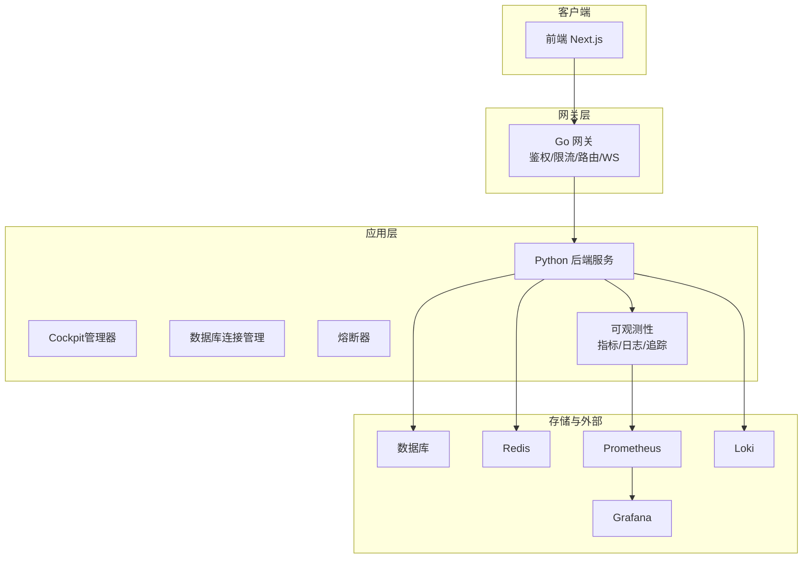
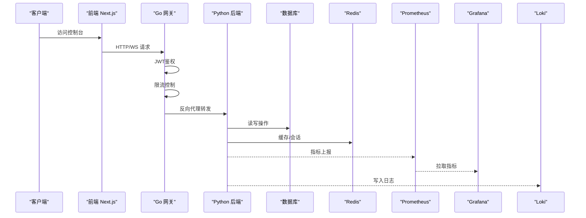
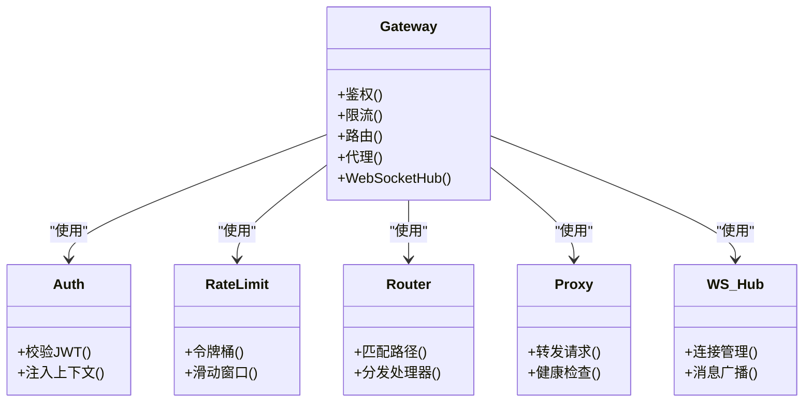
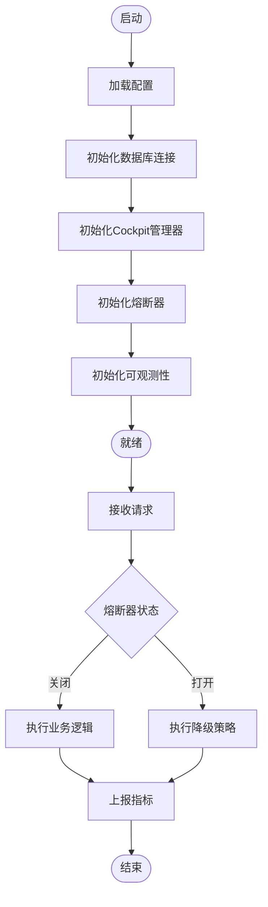
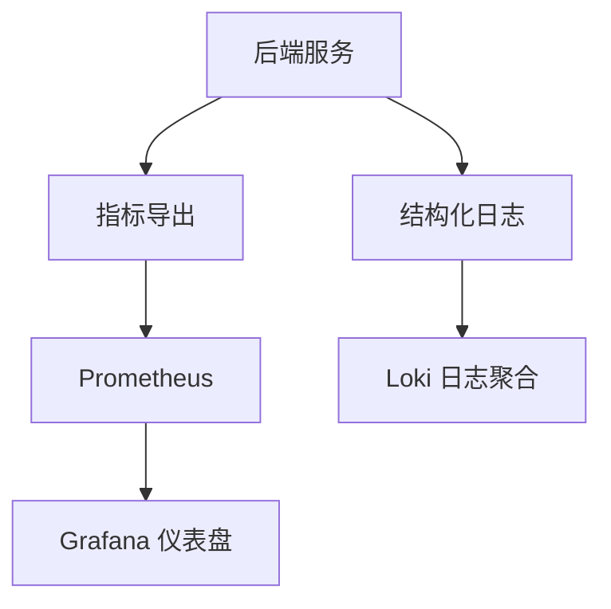
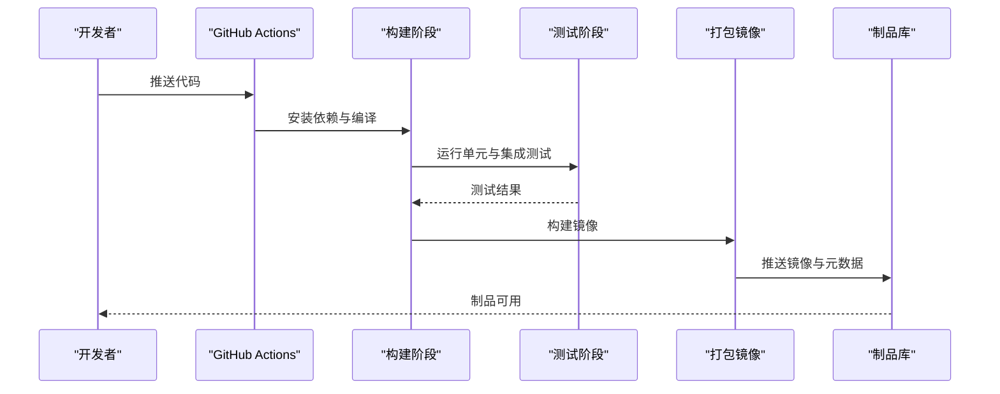
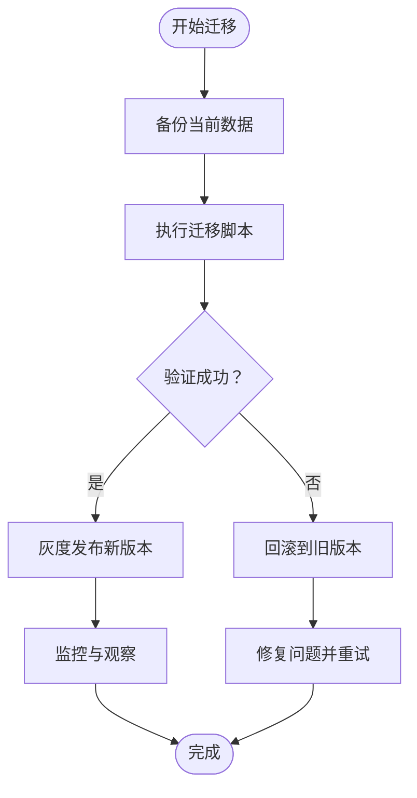
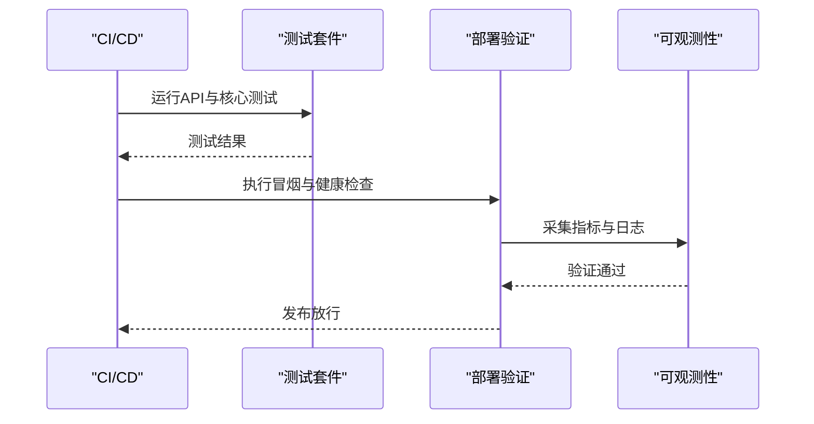
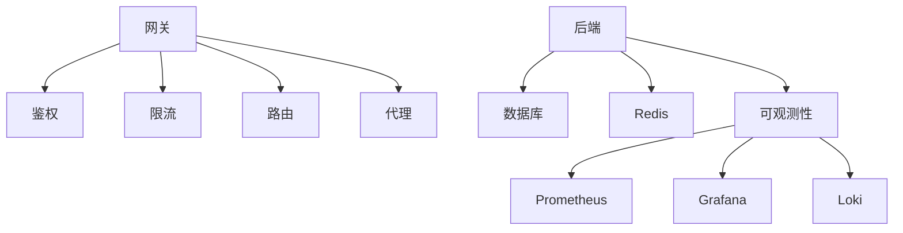

# 发布策略与回滚

<cite>
**本文引用的文件**
- [ci.yml](file://.github/workflows/ci.yml)
- [docker-compose.yml](file://docker-compose.yml)
- [Dockerfile（后端）](file://backend_design/Dockerfile)
- [Dockerfile（网关）](file://backend_design/nexus_gate/Dockerfile)
- [Dockerfile（前端）](file://frontend_design/Dockerfile)
- [Makefile](file://Makefile)
- [config.py](file://backend_design/nexus/config.py)
- [main.py](file://backend_design/nexus/main.py)
- [gateway config.go](file://backend_design/nexus_gate/internal/config/config.go)
- [proxy.go](file://backend_design/nexus_gate/internal/proxy/proxy.go)
- [router.go](file://backend_design/nexus_gate/internal/router/router.go)
- [handlers.go](file://backend_design/nexus_gate/internal/handlers/handlers.go)
- [redis_client.go](file://backend_design/nexus_gate/internal/handlers/redis_client.go)
- [ratelimit.go](file://backend_design/nexus_gate/internal/ratelimit/ratelimit.go)
- [jwt.go](file://backend_design/nexus_gate/internal/auth/jwt.go)
- [hub.go](file://backend_design/nexus_gate/internal/ws/hub.go)
- [cockpit_manager.py](file://backend_design/nexus/core/cockpit_manager.py)
- [db_manager.py](file://backend_design/nexus/core/db_manager.py)
- [circuit_breaker.py](file://backend_design/nexus/core/circuit_breaker.py)
- [logger.py](file://backend_design/nexus/core/logger.py)
- [metrics.py](file://backend_design/nexus/observability/metrics.py)
- [cockpit_metrics.py](file://backend_design/nexus/observability/cockpit_metrics.py)
- [data_retention.py](file://backend_design/nexus/observability/data_retention.py)
- [langfuse.py](file://backend_design/nexus/observability/langfuse.py)
- [v2.1_migration.sql](file://backend_design/scripts/v2.1_migration.sql)
- [test_api.py](file://backend_design/tests/test_api.py)
- [test_core.py](file://backend_design/tests/test_core.py)
- [test_v21.py](file://backend_design/tests/test_v21.py)
- [prometheus.yml](file://config/prometheus/prometheus.yml)
- [grafana dashboards.yml](file://config/grafana/provisioning/dashboards/dashboards.yml)
- [nexuscockpit-overview.json](file://config/grafana/provisioning/dashboards/nexuscockpit-overview.json)
- [loki-config.yml](file://config/loki/loki-config.yml)
</cite>

## 目录
1. [简介](#简介)
2. [项目结构](#项目结构)
3. [核心组件](#核心组件)
4. [架构总览](#架构总览)
5. [详细组件分析](#详细组件分析)
6. [依赖关系分析](#依赖关系分析)
7. [性能考量](#性能考量)
8. [故障排查指南](#故障排查指南)
9. [结论](#结论)
10. [附录](#附录)

## 简介
本文件面向NexusCockpit系统的发布与回滚实践，覆盖灰度发布、蓝绿部署、金丝雀发布、滚动更新、版本兼容性与数据迁移、CI/CD流水线配置、自动化测试与部署验证、回滚机制、紧急修复与故障恢复、环境管理、配置漂移检测以及部署审计日志等主题。文档基于仓库中现有代码与配置文件进行系统化梳理，并提供可落地的流程建议与可视化图示，帮助团队在保障稳定性的前提下持续交付高质量变更。

## 项目结构
NexusCockpit采用前后端分离与网关代理的架构：
- 前端：Next.js应用，提供控制台与交互界面
- 后端：Python服务，包含业务逻辑、中间件、可观测性、RAG与技能编排等
- 网关：Go实现的轻量网关，负责鉴权、限流、路由与WebSocket转发
- 可观测性：Prometheus指标采集、Grafana仪表盘、Loki日志聚合
- CI/CD：GitHub Actions工作流驱动构建与测试
- 容器化：多镜像构建与编排（docker-compose）

**图表来源**
- [docker-compose.yml](file://docker-compose.yml)
- [Dockerfile（后端）](file://backend_design/Dockerfile)
- [Dockerfile（网关）](file://backend_design/nexus_gate/Dockerfile)
- [Dockerfile（前端）](file://frontend_design/Dockerfile)
- [prometheus.yml](file://config/prometheus/prometheus.yml)
- [grafana dashboards.yml](file://config/grafana/provisioning/dashboards/dashboards.yml)
- [nexuscockpit-overview.json](file://config/grafana/provisioning/dashboards/nexuscockpit-overview.json)
- [loki-config.yml](file://config/loki/loki-config.yml)

**章节来源**
- [docker-compose.yml](file://docker-compose.yml)
- [Dockerfile（后端）](file://backend_design/Dockerfile)
- [Dockerfile（网关）](file://backend_design/nexus_gate/Dockerfile)
- [Dockerfile（前端）](file://frontend_design/Dockerfile)

## 核心组件
- 网关（Go）
  - 鉴权：JWT校验与上下文注入
  - 限流：令牌桶/滑动窗口限流
  - 路由：HTTP与WebSocket路径分发
  - 代理：反向代理到后端服务
- 后端（Python）
  - 配置加载与环境变量管理
  - Cockpit管理器：会话与状态协调
  - 数据库连接管理：连接池与生命周期
  - 熔断器：保护下游依赖
  - 可观测性：指标上报、日志输出、追踪集成
- 可观测性
  - Prometheus抓取后端指标
  - Grafana预置仪表盘
  - Loki集中日志
- 测试与脚本
  - API与核心功能测试
  - 数据迁移脚本

**章节来源**
- [jwt.go](file://backend_design/nexus_gate/internal/auth/jwt.go)
- [ratelimit.go](file://backend_design/nexus_gate/internal/ratelimit/ratelimit.go)
- [router.go](file://backend_design/nexus_gate/internal/router/router.go)
- [proxy.go](file://backend_design/nexus_gate/internal/proxy/proxy.go)
- [handlers.go](file://backend_design/nexus_gate/internal/handlers/handlers.go)
- [redis_client.go](file://backend_design/nexus_gate/internal/handlers/redis_client.go)
- [config.py](file://backend_design/nexus/config.py)
- [cockpit_manager.py](file://backend_design/nexus/core/cockpit_manager.py)
- [db_manager.py](file://backend_design/nexus/core/db_manager.py)
- [circuit_breaker.py](file://backend_design/nexus/core/circuit_breaker.py)
- [logger.py](file://backend_design/nexus/core/logger.py)
- [metrics.py](file://backend_design/nexus/observability/metrics.py)
- [cockpit_metrics.py](file://backend_design/nexus/observability/cockpit_metrics.py)
- [data_retention.py](file://backend_design/nexus/observability/data_retention.py)
- [langfuse.py](file://backend_design/nexus/observability/langfuse.py)

## 架构总览
下图展示请求从前端经网关到达后端，再到存储与可观测性组件的完整链路，并标注了鉴权、限流、代理与指标采集的关键节点。

**图表来源**
- [jwt.go](file://backend_design/nexus_gate/internal/auth/jwt.go)
- [ratelimit.go](file://backend_design/nexus_gate/internal/ratelimit/ratelimit.go)
- [proxy.go](file://backend_design/nexus_gate/internal/proxy/proxy.go)
- [router.go](file://backend_design/nexus_gate/internal/router/router.go)
- [handlers.go](file://backend_design/nexus_gate/internal/handlers/handlers.go)
- [redis_client.go](file://backend_design/nexus_gate/internal/handlers/redis_client.go)
- [metrics.py](file://backend_design/nexus/observability/metrics.py)
- [prometheus.yml](file://config/prometheus/prometheus.yml)
- [grafana dashboards.yml](file://config/grafana/provisioning/dashboards/dashboards.yml)
- [nexuscockpit-overview.json](file://config/grafana/provisioning/dashboards/nexuscockpit-overview.json)
- [loki-config.yml](file://config/loki/loki-config.yml)

## 详细组件分析

### 网关组件（鉴权、限流、路由、代理、WebSocket）
- 鉴权：解析JWT并注入用户上下文，未通过则拒绝请求
- 限流：对关键接口实施速率限制，防止过载
- 路由：根据路径将请求分发至对应处理器或WebSocket Hub
- 代理：统一转发至后端服务，支持健康检查与重试
- WebSocket：Hub维护连接与会话状态

**图表来源**
- [jwt.go](file://backend_design/nexus_gate/internal/auth/jwt.go)
- [ratelimit.go](file://backend_design/nexus_gate/internal/ratelimit/ratelimit.go)
- [router.go](file://backend_design/nexus_gate/internal/router/router.go)
- [proxy.go](file://backend_design/nexus_gate/internal/proxy/proxy.go)
- [handlers.go](file://backend_design/nexus_gate/internal/handlers/handlers.go)
- [redis_client.go](file://backend_design/nexus_gate/internal/handlers/redis_client.go)
- [hub.go](file://backend_design/nexus_gate/internal/ws/hub.go)

**章节来源**
- [jwt.go](file://backend_design/nexus_gate/internal/auth/jwt.go)
- [ratelimit.go](file://backend_design/nexus_gate/internal/ratelimit/ratelimit.go)
- [router.go](file://backend_design/nexus_gate/internal/router/router.go)
- [proxy.go](file://backend_design/nexus_gate/internal/proxy/proxy.go)
- [handlers.go](file://backend_design/nexus_gate/internal/handlers/handlers.go)
- [redis_client.go](file://backend_design/nexus_gate/internal/handlers/redis_client.go)
- [hub.go](file://backend_design/nexus_gate/internal/ws/hub.go)

### 后端核心（配置、Cockpit管理、数据库、熔断、可观测性）
- 配置：集中加载环境变量与配置文件，支持热更新
- Cockpit管理器：协调会话、状态与任务调度
- 数据库连接管理：连接池、事务与错误处理
- 熔断器：保护易失败依赖，快速失败与恢复
- 可观测性：指标、日志、追踪与数据保留策略

**图表来源**
- [config.py](file://backend_design/nexus/config.py)
- [cockpit_manager.py](file://backend_design/nexus/core/cockpit_manager.py)
- [db_manager.py](file://backend_design/nexus/core/db_manager.py)
- [circuit_breaker.py](file://backend_design/nexus/core/circuit_breaker.py)
- [metrics.py](file://backend_design/nexus/observability/metrics.py)
- [cockpit_metrics.py](file://backend_design/nexus/observability/cockpit_metrics.py)
- [data_retention.py](file://backend_design/nexus/observability/data_retention.py)
- [logger.py](file://backend_design/nexus/core/logger.py)

**章节来源**
- [config.py](file://backend_design/nexus/config.py)
- [cockpit_manager.py](file://backend_design/nexus/core/cockpit_manager.py)
- [db_manager.py](file://backend_design/nexus/core/db_manager.py)
- [circuit_breaker.py](file://backend_design/nexus/core/circuit_breaker.py)
- [metrics.py](file://backend_design/nexus/observability/metrics.py)
- [cockpit_metrics.py](file://backend_design/nexus/observability/cockpit_metrics.py)
- [data_retention.py](file://backend_design/nexus/observability/data_retention.py)
- [logger.py](file://backend_design/nexus/core/logger.py)

### 可观测性与监控（指标、仪表盘、日志）
- 指标：后端暴露Prometheus格式指标，Prometheus定时抓取
- 仪表盘：Grafana预置NexusCockpit概览面板
- 日志：后端写入Loki，便于检索与分析

**图表来源**
- [metrics.py](file://backend_design/nexus/observability/metrics.py)
- [cockpit_metrics.py](file://backend_design/nexus/observability/cockpit_metrics.py)
- [prometheus.yml](file://config/prometheus/prometheus.yml)
- [grafana dashboards.yml](file://config/grafana/provisioning/dashboards/dashboards.yml)
- [nexuscockpit-overview.json](file://config/grafana/provisioning/dashboards/nexuscockpit-overview.json)
- [loki-config.yml](file://config/loki/loki-config.yml)

**章节来源**
- [metrics.py](file://backend_design/nexus/observability/metrics.py)
- [cockpit_metrics.py](file://backend_design/nexus/observability/cockpit_metrics.py)
- [prometheus.yml](file://config/prometheus/prometheus.yml)
- [grafana dashboards.yml](file://config/grafana/provisioning/dashboards/dashboards.yml)
- [nexuscockpit-overview.json](file://config/grafana/provisioning/dashboards/nexuscockpit-overview.json)
- [loki-config.yml](file://config/loki/loki-config.yml)

### CI/CD流水线（构建、测试、打包）
- 触发：推送或合并到目标分支时自动运行
- 步骤：安装依赖、静态检查、单元测试、构建镜像、生成制品
- 产物：前端、后端、网关镜像与元数据

**图表来源**
- [ci.yml](file://.github/workflows/ci.yml)
- [Dockerfile（后端）](file://backend_design/Dockerfile)
- [Dockerfile（网关）](file://backend_design/nexus_gate/Dockerfile)
- [Dockerfile（前端）](file://frontend_design/Dockerfile)

**章节来源**
- [ci.yml](file://.github/workflows/ci.yml)
- [Dockerfile（后端）](file://backend_design/Dockerfile)
- [Dockerfile（网关）](file://backend_design/nexus_gate/Dockerfile)
- [Dockerfile（前端）](file://frontend_design/Dockerfile)

### 数据迁移与版本兼容性
- 迁移脚本：提供SQL迁移文件，按版本号顺序执行
- 兼容性策略：向后兼容字段与接口，逐步淘汰旧版本
- 回滚策略：迁移前备份，失败时回退到上一版本快照

**图表来源**
- [v2.1_migration.sql](file://backend_design/scripts/v2.1_migration.sql)

**章节来源**
- [v2.1_migration.sql](file://backend_design/scripts/v2.1_migration.sql)

### 自动化测试与部署验证
- 测试套件：API测试、核心逻辑测试、迁移验证测试
- 部署验证：健康检查、冒烟测试、指标阈值校验
- 门禁：测试失败阻断发布

**图表来源**
- [test_api.py](file://backend_design/tests/test_api.py)
- [test_core.py](file://backend_design/tests/test_core.py)
- [test_v21.py](file://backend_design/tests/test_v21.py)
- [metrics.py](file://backend_design/nexus/observability/metrics.py)
- [logger.py](file://backend_design/nexus/core/logger.py)

**章节来源**
- [test_api.py](file://backend_design/tests/test_api.py)
- [test_core.py](file://backend_design/tests/test_core.py)
- [test_v21.py](file://backend_design/tests/test_v21.py)
- [metrics.py](file://backend_design/nexus/observability/metrics.py)
- [logger.py](file://backend_design/nexus/core/logger.py)

## 依赖关系分析
- 组件耦合
  - 网关强依赖鉴权与限流模块
  - 后端依赖数据库、Redis与可观测性组件
  - 可观测性依赖Prometheus、Grafana与Loki
- 外部依赖
  - 数据库与缓存
  - 指标与日志平台
- 潜在循环依赖
  - 避免后端与网关互相调用，保持单向请求流

**图表来源**
- [jwt.go](file://backend_design/nexus_gate/internal/auth/jwt.go)
- [ratelimit.go](file://backend_design/nexus_gate/internal/ratelimit/ratelimit.go)
- [router.go](file://backend_design/nexus_gate/internal/router/router.go)
- [proxy.go](file://backend_design/nexus_gate/internal/proxy/proxy.go)
- [metrics.py](file://backend_design/nexus/observability/metrics.py)
- [prometheus.yml](file://config/prometheus/prometheus.yml)
- [grafana dashboards.yml](file://config/grafana/provisioning/dashboards/dashboards.yml)
- [loki-config.yml](file://config/loki/loki-config.yml)

**章节来源**
- [jwt.go](file://backend_design/nexus_gate/internal/auth/jwt.go)
- [ratelimit.go](file://backend_design/nexus_gate/internal/ratelimit/ratelimit.go)
- [router.go](file://backend_design/nexus_gate/internal/router/router.go)
- [proxy.go](file://backend_design/nexus_gate/internal/proxy/proxy.go)
- [metrics.py](file://backend_design/nexus/observability/metrics.py)
- [prometheus.yml](file://config/prometheus/prometheus.yml)
- [grafana dashboards.yml](file://config/grafana/provisioning/dashboards/dashboards.yml)
- [loki-config.yml](file://config/loki/loki-config.yml)

## 性能考量
- 网关层
  - 合理设置限流阈值与超时时间
  - 复用连接与连接池优化
- 后端服务
  - 数据库连接池大小与查询优化
  - Redis缓存命中率提升
  - 熔断器参数调优，避免雪崩
- 可观测性
  - 指标采样率与保留周期平衡
  - 日志级别与轮转策略

[本节为通用指导，不直接分析具体文件]

## 故障排查指南
- 常见问题定位
  - 鉴权失败：检查JWT配置与签名
  - 限流触发：查看限流计数与阈值
  - 路由异常：核对路径映射与处理器注册
  - 代理错误：确认后端健康与网络连通
  - 指标缺失：检查Prometheus抓取配置
  - 日志缺失：确认Loki写入与索引
- 回滚与恢复
  - 快速回滚到上一稳定版本
  - 数据迁移失败时的回退策略
  - 熔断器打开时的降级与告警

**章节来源**
- [jwt.go](file://backend_design/nexus_gate/internal/auth/jwt.go)
- [ratelimit.go](file://backend_design/nexus_gate/internal/ratelimit/ratelimit.go)
- [router.go](file://backend_design/nexus_gate/internal/router/router.go)
- [proxy.go](file://backend_design/nexus_gate/internal/proxy/proxy.go)
- [prometheus.yml](file://config/prometheus/prometheus.yml)
- [loki-config.yml](file://config/loki/loki-config.yml)

## 结论
通过统一的网关与后端分层、完善的可观测性与自动化流水线，NexusCockpit具备稳健的发布与回滚能力。结合灰度、蓝绿与金丝雀策略，可在风险可控的前提下持续交付。建议在每次发布前执行数据迁移验证与冒烟测试，并在发布后通过指标与日志进行持续监控，确保问题早发现早处置。

[本节为总结性内容，不直接分析具体文件]

## 附录

### 灰度发布方案
- 流量切分：基于网关权重或域名/路径规则分流
- 渐进放量：按百分比逐步增加新实例流量
- 验证指标：错误率、延迟、业务转化率
- 回滚条件：超过阈值立即切回

### 蓝绿部署方案
- 双环境并行：蓝色（生产）与绿色（待发布）
- 切换入口：网关或负载均衡器切换流量
- 回滚策略：直接切回蓝色环境
- 数据同步：迁移完成后双向同步或只读切换

### 金丝雀发布方案
- 小范围试点：选择少量租户或用户群体
- A/B对比：对比新旧版本关键指标
- 决策点：达到稳定性阈值再全量推广
- 快速回滚：失败立即停止金丝雀实例

### 滚动更新策略
- 分批替换：按批次替换实例，保证最小可用副本
- 健康检查：每批上线后进行健康与冒烟测试
- 回滚窗口：失败时回滚该批次并暂停后续批次

### 版本兼容性与数据迁移
- 向后兼容：新增字段默认值与可选接口
- 迁移顺序：先扩表与默认值，再清理旧字段
- 回滚准备：迁移前快照与回退脚本

### CI/CD流水线配置要点
- 触发条件：分支与标签策略
- 构建产物：镜像标签与元数据
- 质量门禁：测试覆盖率与静态检查
- 安全扫描：依赖漏洞与镜像扫描

### 自动化测试与部署验证
- 测试类型：单元、集成、端到端
- 冒烟用例：登录、核心API、WebSocket
- 指标阈值：错误率、延迟、资源使用
- 日志断言：关键事件存在性

### 回滚机制与紧急修复
- 一键回滚：基于镜像标签快速切换
- 数据回退：迁移回退脚本与备份恢复
- 紧急修复：热补丁与灰度回退流程

### 环境管理与配置漂移检测
- 环境隔离：开发、测试、预发、生产
- 配置中心：集中化管理与版本控制
- 漂移检测：定期比对期望与实际配置
- 审计日志：记录配置变更与生效时间

### 部署审计日志
- 审计项：谁、何时、做了什么、结果如何
- 留存策略：按合规要求保留周期
- 检索能力：按时间、用户、变更类型检索

[本节为概念性说明，不直接分析具体文件]