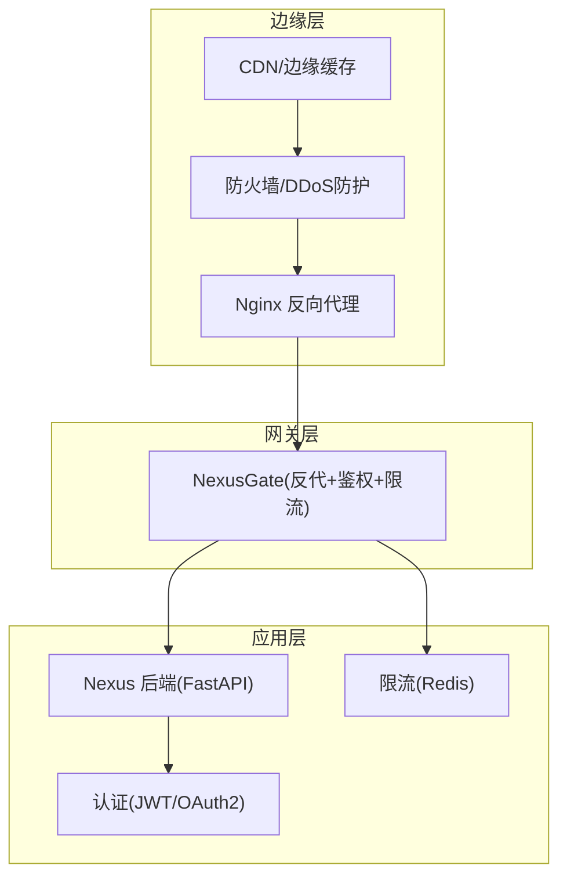
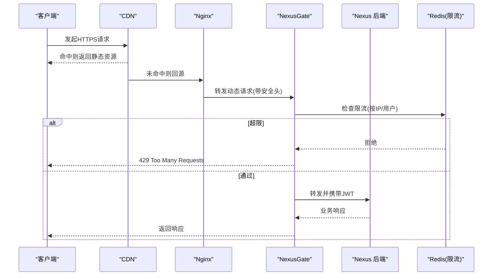
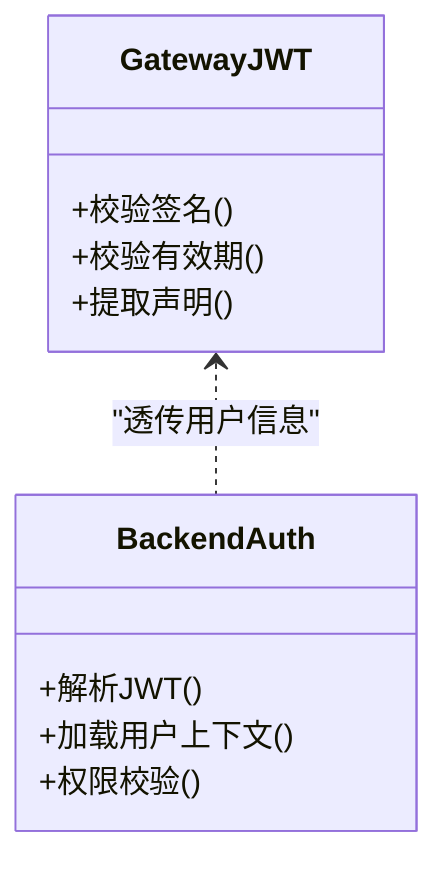
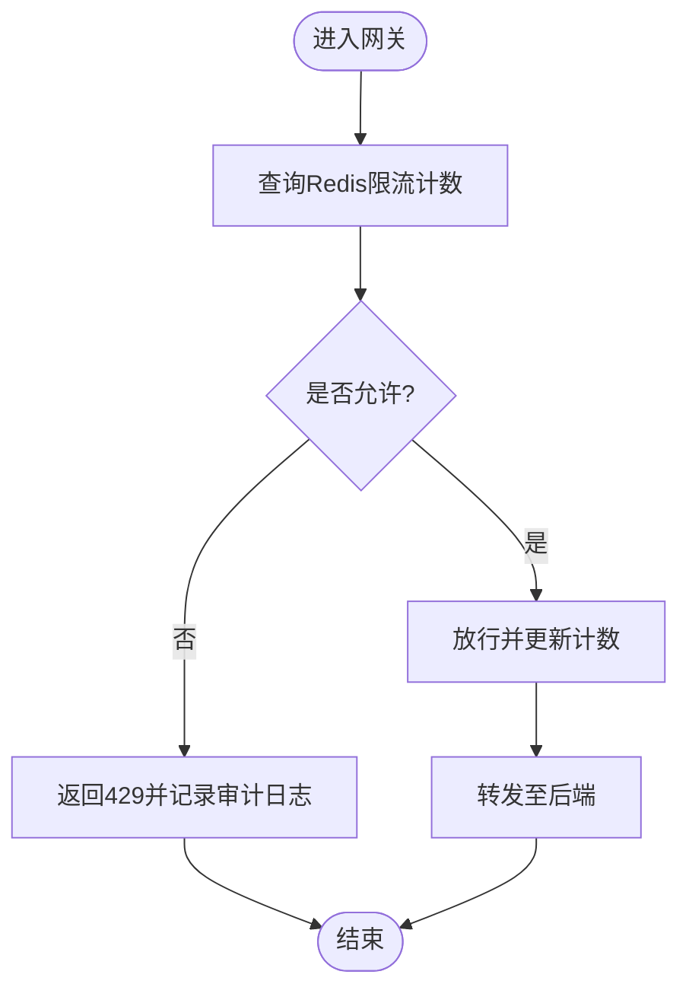
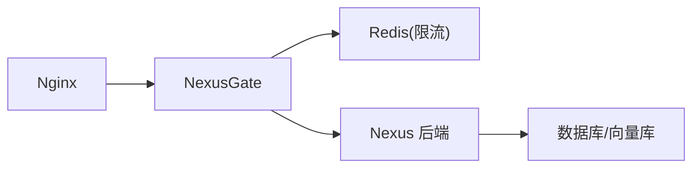

# 安全与CDN配置

<cite>
**本文引用的文件**   
- [docker-compose.yml](file://docker-compose.yml)
- [backend_design/nexus/main.py](file://backend_design/nexus/main.py)
- [backend_design/nexus/config.py](file://backend_design/nexus/config.py)
- [backend_design/nexus/core/auth.py](file://backend_design/nexus/core/auth.py)
- [backend_design/nexus/middleware/rate_limiter.py](file://backend_design/nexus/middleware/rate_limiter.py)
- [backend_design/nexus/api/routes/auth.py](file://backend_design/nexus/api/routes/auth.py)
- [backend_design/nexus_gate/internal/auth/jwt.go](file://backend_design/nexus_gate/internal/auth/jwt.go)
- [backend_design/nexus_gate/internal/proxy/proxy.go](file://backend_design/nexus_gate/internal/proxy/proxy.go)
- [backend_design/nexus_gate/internal/ratelimit/ratelimit.go](file://backend_design/nexus_gate/internal/ratelimit/ratelimit.go)
- [config/nginx/README.md](file://config/nginx/README.md)
</cite>

## 目录
1. [简介](#简介)
2. [项目结构](#项目结构)
3. [核心组件](#核心组件)
4. [架构总览](#架构总览)
5. [详细组件分析](#详细组件分析)
6. [依赖关系分析](#依赖关系分析)
7. [性能考虑](#性能考虑)
8. [故障排查指南](#故障排查指南)
9. [结论](#结论)
10. [附录](#附录)

## 简介
本文件面向NexusCockpit系统的安全与CDN部署，覆盖以下主题：
- SSL/TLS证书申请、安装与自动续期（Let's Encrypt/Certbot）
- Nginx反向代理的安全头、请求过滤与访问控制
- JWT认证配置、OAuth2集成与API限流策略
- CDN加速、静态资源优化与缓存策略
- 防火墙规则、DDoS防护与安全审计日志

说明：本项目仓库未包含现成的Nginx或CDN配置文件。本节提供基于仓库现有后端服务与网关组件的落地方案与最佳实践，确保与后端鉴权、限流等能力对齐。

## 项目结构
从安全与CDN视角，关键位置如下：
- 应用入口与中间件：后端主程序、认证模块、限流中间件
- 网关侧：Go语言网关的JWT校验、反向代理与限流实现
- 编排与部署：Docker Compose定义服务组合
- 文档占位：nginx配置说明文档

图示来源
- [docker-compose.yml](file://docker-compose.yml)
- [backend_design/nexus/main.py](file://backend_design/nexus/main.py)
- [backend_design/nexus_gate/internal/proxy/proxy.go](file://backend_design/nexus_gate/internal/proxy/proxy.go)
- [backend_design/nexus_gate/internal/ratelimit/ratelimit.go](file://backend_design/nexus_gate/internal/ratelimit/ratelimit.go)

章节来源
- [docker-compose.yml](file://docker-compose.yml)
- [backend_design/nexus/main.py](file://backend_design/nexus/main.py)

## 核心组件
- 后端认证与鉴权：负责JWT签发/校验、会话与权限上下文
- 网关鉴权与限流：在边缘侧完成JWT校验与速率限制，减轻后端压力
- 反向代理：统一入口、HTTPS终止、安全头注入、路径转发
- 限流中间件：基于Redis的令牌桶/滑动窗口，支持按IP/用户维度
- 可观测性：指标与日志采集，支撑安全审计与告警

章节来源
- [backend_design/nexus/core/auth.py](file://backend_design/nexus/core/auth.py)
- [backend_design/nexus/middleware/rate_limiter.py](file://backend_design/nexus/middleware/rate_limiter.py)
- [backend_design/nexus_gate/internal/auth/jwt.go](file://backend_design/nexus_gate/internal/auth/jwt.go)
- [backend_design/nexus_gate/internal/ratelimit/ratelimit.go](file://backend_design/nexus_gate/internal/ratelimit/ratelimit.go)

## 架构总览
建议采用“CDN → 防火墙/DDoS → Nginx → NexusGate → 后端”的分层架构，将TLS终止、静态缓存、WAF与限流前置到边缘与网关层，后端专注业务逻辑。

图示来源
- [backend_design/nexus_gate/internal/proxy/proxy.go](file://backend_design/nexus_gate/internal/proxy/proxy.go)
- [backend_design/nexus_gate/internal/ratelimit/ratelimit.go](file://backend_design/nexus_gate/internal/ratelimit/ratelimit.go)
- [backend_design/nexus/middleware/rate_limiter.py](file://backend_design/nexus/middleware/rate_limiter.py)

## 详细组件分析

### SSL/TLS证书申请、安装与自动续期
- 证书来源
  - 推荐使用Let's Encrypt，配合Certbot自动化申请与续期
  - 若使用云厂商DNS API，优先选择DNS验证方式以支持泛域名
- 安装与放置
  - 证书与私钥存放于受保护的目录，仅Nginx进程可读
  - 建议为每个域名独立证书，避免共享密钥风险
- 自动续期
  - 通过系统定时任务定期执行续期命令
  - 续期成功后触发Nginx平滑重载，不中断连接
- 证书校验与最小化协议
  - 启用现代TLS版本，禁用过时套件
  - 开启HSTS、OCSP Stapling以提升安全性与性能
- 证书监控
  - 对证书过期时间进行监控告警，提前预警

章节来源
- [config/nginx/README.md](file://config/nginx/README.md)

### Nginx反向代理：安全头、请求过滤与访问控制
- 安全响应头
  - 强制HTTPS跳转
  - 设置X-Frame-Options、X-Content-Type-Options、Referrer-Policy、Permissions-Policy等
  - 启用Strict-Transport-Security(HSTS)
- 请求过滤
  - 限制请求体大小、URI长度与头部数量
  - 屏蔽危险HTTP方法（如TRACE）
  - 对常见攻击模式进行基础匹配拦截（SQLi/XSS特征）
- 访问控制
  - 管理接口白名单（仅允许特定IP段）
  - 对敏感路径增加二次校验或额外鉴权
- 日志与审计
  - 记录访问日志与错误日志，保留必要字段用于审计
  - 结合外部日志系统集中收集与分析

章节来源
- [config/nginx/README.md](file://config/nginx/README.md)

### JWT认证配置
- 签名算法与密钥管理
  - 建议使用非对称算法（RS256/ES256），公钥公开、私钥严格保管
  - 密钥轮换需保证新旧密钥并存过渡期
- Token生命周期
  - 合理设置Access Token短期有效，Refresh Token长期有效且可撤销
  - 刷新流程应校验设备指纹或会话状态
- 网关侧校验
  - 在NexusGate中校验签名、有效期与必要声明
  - 失败直接拒绝，减少后端负载
- 后端侧校验
  - 再次校验Token有效性，读取用户上下文与权限
  - 对敏感操作进行二次校验（如MFA）

图示来源
- [backend_design/nexus_gate/internal/auth/jwt.go](file://backend_design/nexus_gate/internal/auth/jwt.go)
- [backend_design/nexus/core/auth.py](file://backend_design/nexus/core/auth.py)

章节来源
- [backend_design/nexus_gate/internal/auth/jwt.go](file://backend_design/nexus_gate/internal/auth/jwt.go)
- [backend_design/nexus/core/auth.py](file://backend_design/nexus/core/auth.py)
- [backend_design/nexus/api/routes/auth.py](file://backend_design/nexus/api/routes/auth.py)

### OAuth2集成
- 授权服务器对接
  - 支持Authorization Code Flow with PKCE
  - 配置回调地址、作用域与状态参数防CSRF
- 登录流程
  - 前端重定向至授权服务器，完成后回调携带授权码
  - 后端用授权码换取Token，建立本地会话或下发JWT
- 注销与会话清理
  - 支持后端主动失效Refresh Token
  - 清除本地会话与缓存
- 多租户与角色映射
  - 根据授权服务器的角色/组信息映射到内部权限模型

章节来源
- [backend_design/nexus/api/routes/auth.py](file://backend_design/nexus/api/routes/auth.py)

### API限流策略
- 限流维度
  - 按IP、用户ID、API路径分别限流
  - 区分读写操作，写操作更严格
- 算法与存储
  - 推荐令牌桶或滑动窗口，使用Redis作为分布式计数
  - 网关与后端双重限流，网关侧重整体保护，后端侧重业务保护
- 阈值与弹性
  - 根据历史QPS与P99延迟设定阈值
  - 支持动态调整与灰度放量
- 反馈与降级
  - 超限返回标准错误码与重试提示
  - 对下游依赖异常时快速失败，避免雪崩

图示来源
- [backend_design/nexus_gate/internal/ratelimit/ratelimit.go](file://backend_design/nexus_gate/internal/ratelimit/ratelimit.go)
- [backend_design/nexus/middleware/rate_limiter.py](file://backend_design/nexus/middleware/rate_limiter.py)

章节来源
- [backend_design/nexus_gate/internal/ratelimit/ratelimit.go](file://backend_design/nexus_gate/internal/ratelimit/ratelimit.go)
- [backend_design/nexus/middleware/rate_limiter.py](file://backend_design/nexus/middleware/rate_limiter.py)

### CDN加速、静态资源优化与缓存策略
- 静态资源
  - 将JS/CSS/图片等静态资源托管至CDN，开启压缩与HTTP/2
  - 使用文件名哈希与长缓存，配合浏览器强缓存
- 缓存策略
  - 对只读API启用CDN缓存，设置合理的Cache-Control与ETag
  - 对动态内容使用短缓存或禁止缓存
- 预热与回源
  - 发布前预热热点资源，降低回源冲击
  - 配置健康检查与回源超时，保障可用性
- 安全与合规
  - 关闭CDN上的敏感路径缓存
  - 对跨域请求进行严格配置，避免泄露

章节来源
- [config/nginx/README.md](file://config/nginx/README.md)

### 防火墙规则、DDoS防护与安全审计日志
- 防火墙
  - 仅开放必要端口（如443/80），限制来源IP段
  - 对SSH/管理面进行白名单与跳板机访问
- DDoS防护
  - 启用云厂商DDoS高防或WAF，配置CC防护与Bot管理
  - 针对高频端点设置更严格的限流与验证码挑战
- 安全审计日志
  - 记录访问日志、鉴权失败、限流触发、异常堆栈
  - 集中收集至日志平台，设置告警规则与留存周期

章节来源
- [config/nginx/README.md](file://config/nginx/README.md)

## 依赖关系分析
- 网关与后端耦合点
  - 网关负责JWT校验与限流，后端负责业务鉴权与数据访问
  - 两者均依赖Redis进行限流计数
- 外部依赖
  - TLS证书由外部CA颁发
  - CDN/WAF由云平台或第三方提供
- 潜在风险
  - 密钥泄露、证书过期、限流阈值不当导致误伤或绕过

图示来源
- [backend_design/nexus_gate/internal/proxy/proxy.go](file://backend_design/nexus_gate/internal/proxy/proxy.go)
- [backend_design/nexus_gate/internal/ratelimit/ratelimit.go](file://backend_design/nexus_gate/internal/ratelimit/ratelimit.go)
- [backend_design/nexus/main.py](file://backend_design/nexus/main.py)

章节来源
- [backend_design/nexus/main.py](file://backend_design/nexus/main.py)
- [backend_design/nexus_gate/internal/proxy/proxy.go](file://backend_design/nexus_gate/internal/proxy/proxy.go)
- [backend_design/nexus_gate/internal/ratelimit/ratelimit.go](file://backend_design/nexus_gate/internal/ratelimit/ratelimit.go)

## 性能考虑
- 连接复用与Keep-Alive：在Nginx与网关层启用，减少握手开销
- 压缩与传输优化：启用Gzip/Brotli，HTTP/2与QUIC
- 缓存命中率：提升CDN命中率，降低回源压力
- 限流粒度：按路径与用户精细化限流，避免一刀切
- 资源隔离：动静分离，静态走CDN，动态走网关与后端

## 故障排查指南
- HTTPS无法访问
  - 检查证书路径与权限、Nginx监听端口与域名绑定
  - 查看Nginx错误日志定位握手失败原因
- 鉴权失败
  - 核对JWT签名算法、密钥与有效期
  - 检查网关与后端的时间同步
- 限流过严
  - 观察Redis计数与限流日志，调整阈值与窗口大小
  - 确认限流维度是否正确（IP/用户/路径）
- 回源慢
  - 检查CDN缓存命中与回源链路，优化后端响应时间与连接池

章节来源
- [config/nginx/README.md](file://config/nginx/README.md)
- [backend_design/nexus_gate/internal/auth/jwt.go](file://backend_design/nexus_gate/internal/auth/jwt.go)
- [backend_design/nexus_gate/internal/ratelimit/ratelimit.go](file://backend_design/nexus_gate/internal/ratelimit/ratelimit.go)

## 结论
通过分层安全架构与标准化配置，NexusCockpit可在边缘层获得更强的抗攻击能力与更高的性能表现。建议在上线前完成证书与限流的演练，持续监控与迭代策略，确保安全与体验双达标。

## 附录
- 参考清单
  - 证书与Nginx配置说明：[config/nginx/README.md](file://config/nginx/README.md)
  - 网关鉴权与限流实现：
    - [backend_design/nexus_gate/internal/auth/jwt.go](file://backend_design/nexus_gate/internal/auth/jwt.go)
    - [backend_design/nexus_gate/internal/ratelimit/ratelimit.go](file://backend_design/nexus_gate/internal/ratelimit/ratelimit.go)
  - 后端认证与限流中间件：
    - [backend_design/nexus/core/auth.py](file://backend_design/nexus/core/auth.py)
    - [backend_design/nexus/middleware/rate_limiter.py](file://backend_design/nexus/middleware/rate_limiter.py)
  - 服务编排：[docker-compose.yml](file://docker-compose.yml)