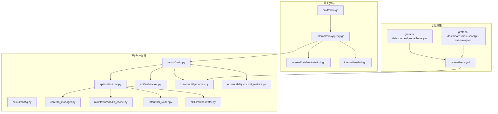
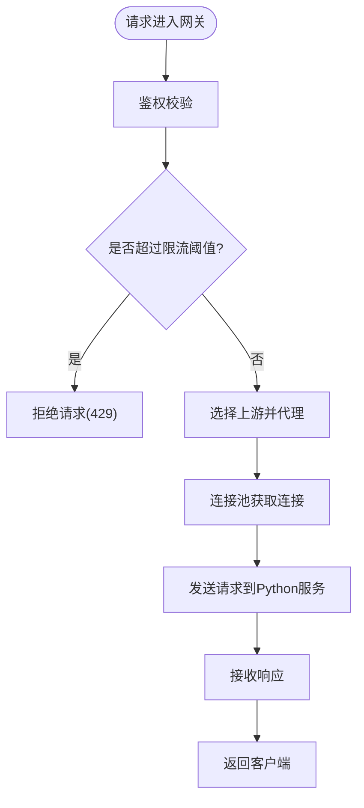
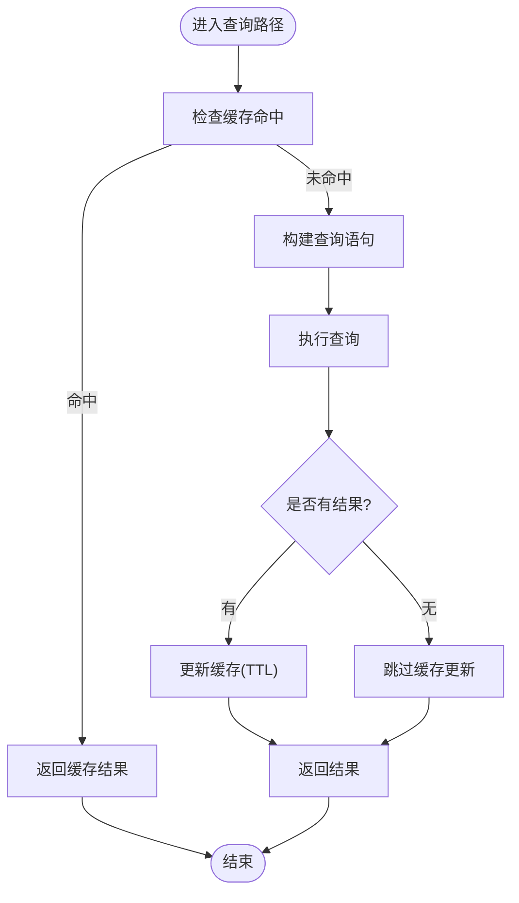
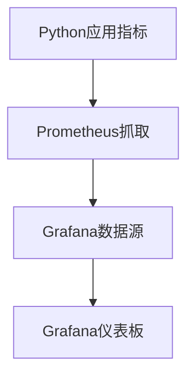
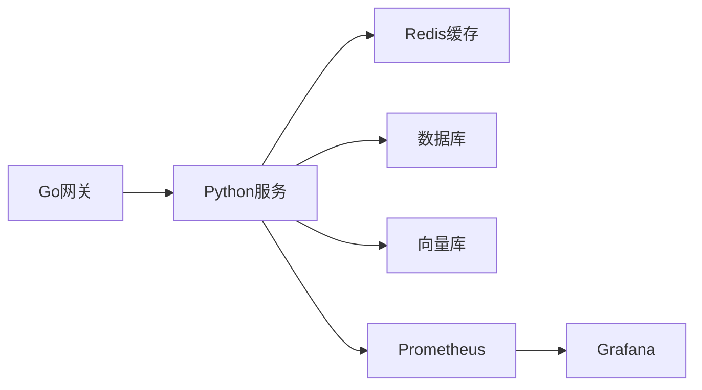

# 性能调优与监控

<cite>
**本文引用的文件**   
- [backend_design/nexus/main.py](file://backend_design/nexus/main.py)
- [backend_design/nexus/config.py](file://backend_design/nexus/config.py)
- [backend_design/nexus/core/db_manager.py](file://backend_design/nexus/core/db_manager.py)
- [backend_design/nexus/middleware/redis_cache.py](file://backend_design/nexus/middleware/redis_cache.py)
- [backend_design/nexus/observability/metrics.py](file://backend_design/nexus/observability/metrics.py)
- [backend_design/nexus/observability/cockpit_metrics.py](file://backend_design/nexus/observability/cockpit_metrics.py)
- [backend_design/nexus/api/routes/chat.py](file://backend_design/nexus/api/routes/chat.py)
- [backend_design/nexus/api/websocket.py](file://backend_design/nexus/api/websocket.py)
- [backend_design/nexus/intent/llm_router.py](file://backend_design/nexus/intent/llm_router.py)
- [backend_design/nexus/skills/orchestrator.py](file://backend_design/nexus/skills/orchestrator.py)
- [backend_design/nexus_gate/cmd/main.go](file://backend_design/nexus_gate/cmd/main.go)
- [backend_design/nexus_gate/internal/proxy/proxy.go](file://backend_design/nexus_gate/internal/proxy/proxy.go)
- [backend_design/nexus_gate/internal/ratelimit/ratelimit.go](file://backend_design/nexus_gate/internal/ratelimit/ratelimit.go)
- [backend_design/nexus_gate/internal/ws/hub.go](file://backend_design/nexus_gate/internal/ws/hub.go)
- [config/prometheus/prometheus.yml](file://config/prometheus/prometheus.yml)
- [config/grafana/provisioning/datasources/prometheus.yml](file://config/grafana/provisioning/datasources/prometheus.yml)
- [config/grafana/provisioning/dashboards/nexuscockpit-overview.json](file://config/grafana/provisioning/dashboards/nexuscockpit-overview.json)
- [docker-compose.yml](file://docker-compose.yml)
</cite>

## 目录
1. [简介](#简介)
2. [项目结构](#项目结构)
3. [核心组件](#核心组件)
4. [架构总览](#架构总览)
5. [详细组件分析](#详细组件分析)
6. [依赖关系分析](#依赖关系分析)
7. [性能考量](#性能考量)
8. [故障排查指南](#故障排查指南)
9. [结论](#结论)
10. [附录](#附录)

## 简介
本文件面向NexusCockpit系统的性能调优与监控，覆盖Python应用层（FastAPI）的CPU、内存与并发优化，Go网关的连接池与请求处理策略，Prometheus指标采集与Grafana仪表板配置，数据库查询与缓存命中率提升，以及API响应时间优化。同时提供压力测试方法、瓶颈分析与容量规划建议，帮助在生产环境稳定高效地运行系统。

## 项目结构
NexusCockpit由Python后端服务与Go网关组成：
- Python后端：基于FastAPI，包含路由、中间件、可观测性、RAG/向量检索、技能编排等模块。
- Go网关：负责鉴权、限流、反向代理、WebSocket转发等。
- 可观测性：Prometheus抓取指标，Grafana展示仪表板。
- 部署：通过docker-compose统一编排。



图表来源
- [backend_design/nexus_gate/cmd/main.go](file://backend_design/nexus_gate/cmd/main.go)
- [backend_design/nexus_gate/internal/proxy/proxy.go](file://backend_design/nexus_gate/internal/proxy/proxy.go)
- [backend_design/nexus_gate/internal/ratelimit/ratelimit.go](file://backend_design/nexus_gate/internal/ratelimit/ratelimit.go)
- [backend_design/nexus_gate/internal/ws/hub.go](file://backend_design/nexus_gate/internal/ws/hub.go)
- [backend_design/nexus/main.py](file://backend_design/nexus/main.py)
- [backend_design/nexus/observability/metrics.py](file://backend_design/nexus/observability/metrics.py)
- [backend_design/nexus/observability/cockpit_metrics.py](file://backend_design/nexus/observability/cockpit_metrics.py)
- [backend_design/nexus/api/routes/chat.py](file://backend_design/nexus/api/routes/chat.py)
- [backend_design/nexus/core/db_manager.py](file://backend_design/nexus/core/db_manager.py)
- [backend_design/nexus/middleware/redis_cache.py](file://backend_design/nexus/middleware/redis_cache.py)
- [backend_design/nexus/intent/llm_router.py](file://backend_design/nexus/intent/llm_router.py)
- [backend_design/nexus/skills/orchestrator.py](file://backend_design/nexus/skills/orchestrator.py)
- [config/prometheus/prometheus.yml](file://config/prometheus/prometheus.yml)
- [config/grafana/provisioning/datasources/prometheus.yml](file://config/grafana/provisioning/datasources/prometheus.yml)
- [config/grafana/provisioning/dashboards/nexuscockpit-overview.json](file://config/grafana/provisioning/dashboards/nexuscockpit-overview.json)

章节来源
- [backend_design/nexus/main.py](file://backend_design/nexus/main.py)
- [backend_design/nexus_gate/cmd/main.go](file://backend_design/nexus_gate/cmd/main.go)
- [config/prometheus/prometheus.yml](file://config/prometheus/prometheus.yml)
- [config/grafana/provisioning/datasources/prometheus.yml](file://config/grafana/provisioning/datasources/prometheus.yml)
- [config/grafana/provisioning/dashboards/nexuscockpit-overview.json](file://config/grafana/provisioning/dashboards/nexuscockpit-overview.json)

## 核心组件
- Go网关
  - 入口与路由分发、反向代理、WebSocket Hub、令牌鉴权与限流。
  - 关键路径：请求进入网关→鉴权/限流→选择上游→代理到Python服务→返回响应。
- Python后端
  - FastAPI应用启动、中间件注册、指标暴露、业务路由（聊天、会话、车辆控制等）。
  - 数据访问：数据库连接管理、Redis缓存、RAG检索、意图路由与技能编排。
- 可观测性
  - Prometheus抓取Python指标；Grafana数据源与仪表板预置。

章节来源
- [backend_design/nexus_gate/cmd/main.go](file://backend_design/nexus_gate/cmd/main.go)
- [backend_design/nexus_gate/internal/proxy/proxy.go](file://backend_design/nexus_gate/internal/proxy/proxy.go)
- [backend_design/nexus_gate/internal/ratelimit/ratelimit.go](file://backend_design/nexus_gate/internal/ratelimit/ratelimit.go)
- [backend_design/nexus_gate/internal/ws/hub.go](file://backend_design/nexus_gate/internal/ws/hub.go)
- [backend_design/nexus/main.py](file://backend_design/nexus/main.py)
- [backend_design/nexus/observability/metrics.py](file://backend_design/nexus/observability/metrics.py)
- [backend_design/nexus/observability/cockpit_metrics.py](file://backend_design/nexus/observability/cockpit_metrics.py)
- [backend_design/nexus/api/routes/chat.py](file://backend_design/nexus/api/routes/chat.py)
- [backend_design/nexus/core/db_manager.py](file://backend_design/nexus/core/db_manager.py)
- [backend_design/nexus/middleware/redis_cache.py](file://backend_design/nexus/middleware/redis_cache.py)
- [backend_design/nexus/intent/llm_router.py](file://backend_design/nexus/intent/llm_router.py)
- [backend_design/nexus/skills/orchestrator.py](file://backend_design/nexus/skills/orchestrator.py)

## 架构总览
下图展示了从客户端到网关再到Python后端的完整链路，以及指标采集与可视化路径。

```mermaid
sequenceDiagram
participant Client as "客户端"
participant Gateway as "Go网关"
participant Proxy as "反向代理"
participant Rate as "限流器"
participant WS as "WebSocket Hub"
participant API as "Python FastAPI"
participant Cache as "Redis缓存"
participant DB as "数据库"
participant Metrics as "Prometheus"
participant Grafana as "Grafana"
Client->>Gateway : HTTP/WebSocket请求
Gateway->>Rate : 鉴权与限流
alt 普通HTTP
Gateway->>Proxy : 转发请求
Proxy->>API : 调用路由
API->>Cache : 读取/写入缓存
API->>DB : 执行查询
API-->>Proxy : 响应
Proxy-->>Gateway : 响应
Gateway-->>Client : 响应
else WebSocket
Gateway->>WS : 建立连接
WS<->API : 双向消息
end
API->>Metrics : 上报指标
Metrics-->>Grafana : 拉取指标
Grafana-->>Client : 展示仪表板
```

图表来源
- [backend_design/nexus_gate/cmd/main.go](file://backend_design/nexus_gate/cmd/main.go)
- [backend_design/nexus_gate/internal/proxy/proxy.go](file://backend_design/nexus_gate/internal/proxy/proxy.go)
- [backend_design/nexus_gate/internal/ratelimit/ratelimit.go](file://backend_design/nexus_gate/internal/ratelimit/ratelimit.go)
- [backend_design/nexus_gate/internal/ws/hub.go](file://backend_design/nexus_gate/internal/ws/hub.go)
- [backend_design/nexus/main.py](file://backend_design/nexus/main.py)
- [backend_design/nexus/observability/metrics.py](file://backend_design/nexus/observability/metrics.py)
- [config/prometheus/prometheus.yml](file://config/prometheus/prometheus.yml)
- [config/grafana/provisioning/datasources/prometheus.yml](file://config/grafana/provisioning/datasources/prometheus.yml)
- [config/grafana/provisioning/dashboards/nexuscockpit-overview.json](file://config/grafana/provisioning/dashboards/nexuscockpit-overview.json)

## 详细组件分析

### Go网关性能参数与连接池优化
- 目标
  - 降低延迟、提高吞吐、避免资源耗尽。
- 关键要点
  - 监听端口与进程模型：根据CPU核数调整worker数量，合理设置最大连接数。
  - 反向代理连接池：复用上游连接、限制空闲连接、设置超时与重试策略。
  - 限流策略：按IP/用户维度限流，结合令牌桶或滑动窗口算法，保护下游。
  - WebSocket：Hub中维护连接集合，使用扇出广播与背压控制。
- 建议参数方向
  - 连接池大小=并发度×因子，空闲连接保留比例适中，避免频繁创建销毁。
  - 读写超时与KeepAlive开启，减少握手开销。
  - 限流阈值依据压测结果动态调整，并配合告警。



图表来源
- [backend_design/nexus_gate/cmd/main.go](file://backend_design/nexus_gate/cmd/main.go)
- [backend_design/nexus_gate/internal/proxy/proxy.go](file://backend_design/nexus_gate/internal/proxy/proxy.go)
- [backend_design/nexus_gate/internal/ratelimit/ratelimit.go](file://backend_design/nexus_gate/internal/ratelimit/ratelimit.go)

章节来源
- [backend_design/nexus_gate/cmd/main.go](file://backend_design/nexus_gate/cmd/main.go)
- [backend_design/nexus_gate/internal/proxy/proxy.go](file://backend_design/nexus_gate/internal/proxy/proxy.go)
- [backend_design/nexus_gate/internal/ratelimit/ratelimit.go](file://backend_design/nexus_gate/internal/ratelimit/ratelimit.go)
- [backend_design/nexus_gate/internal/ws/hub.go](file://backend_design/nexus_gate/internal/ws/hub.go)

### Python应用性能优化（CPU、内存、并发）
- 目标
  - 缩短P95/P99延迟，提升QPS，降低GC与上下文切换开销。
- 关键要点
  - 异步I/O：优先使用asyncio与异步客户端（如aiohttp/httpx），避免阻塞调用。
  - 线程/进程模型：对CPU密集型任务使用多进程或外部队列，避免GIL影响。
  - 对象与序列化：减少大对象拷贝，使用轻量数据结构，必要时启用零拷贝传输。
  - 日志与追踪：采样高频日志，避免在热路径上写盘。
- 建议实践
  - 将耗时操作下沉至后台任务或消息队列，接口快速返回。
  - 预热模型与索引，避免冷启动抖动。
  - 使用连接池与缓冲池，减少分配与释放成本。

章节来源
- [backend_design/nexus/main.py](file://backend_design/nexus/main.py)
- [backend_design/nexus/config.py](file://backend_design/nexus/config.py)
- [backend_design/nexus/api/routes/chat.py](file://backend_design/nexus/api/routes/chat.py)
- [backend_design/nexus/api/websocket.py](file://backend_design/nexus/api/websocket.py)

### 数据库查询优化
- 目标
  - 降低慢查询比例，提升命中率与吞吐。
- 关键要点
  - 连接池：合理设置最小/最大连接数，避免连接风暴。
  - 索引与SQL：为热点字段建立索引，避免SELECT *，使用分页与过滤条件。
  - 事务边界：缩小事务范围，避免长事务锁竞争。
  - 批量操作：合并写入，减少往返次数。
- 监控点
  - 慢查询日志、连接池等待时间、锁等待与死锁检测。



图表来源
- [backend_design/nexus/core/db_manager.py](file://backend_design/nexus/core/db_manager.py)
- [backend_design/nexus/middleware/redis_cache.py](file://backend_design/nexus/middleware/redis_cache.py)
- [backend_design/nexus/api/routes/chat.py](file://backend_design/nexus/api/routes/chat.py)

章节来源
- [backend_design/nexus/core/db_manager.py](file://backend_design/nexus/core/db_manager.py)
- [backend_design/nexus/middleware/redis_cache.py](file://backend_design/nexus/middleware/redis_cache.py)
- [backend_design/nexus/api/routes/chat.py](file://backend_design/nexus/api/routes/chat.py)

### 缓存命中率提升
- 目标
  - 提高缓存命中率，降低数据库与外部服务压力。
- 关键要点
  - 键设计：包含租户、用户、设备、时间窗等维度，避免冲突。
  - TTL策略：按数据新鲜度设置TTL，热点数据延长TTL，冷门数据缩短。
  - 一致性：采用先删后写或双写+延迟删除策略，避免脏读。
  - 降级：缓存不可用时快速回退到直查，并记录失败率。
- 监控点
  - 命中率、过期率、网络错误、序列化/反序列化耗时。

章节来源
- [backend_design/nexus/middleware/redis_cache.py](file://backend_design/nexus/middleware/redis_cache.py)
- [backend_design/nexus/api/routes/chat.py](file://backend_design/nexus/api/routes/chat.py)

### API响应时间优化
- 目标
  - 降低端到端延迟，提升用户体验。
- 关键要点
  - 路由层：减少中间件链长度，按需启用鉴权与审计。
  - 并行化：对独立子任务使用并发调用（注意限流与熔断）。
  - 流式输出：对长时任务使用SSE或WebSocket推送，避免长轮询。
  - 压缩与分块：大响应体启用压缩与分块传输。
- 监控点
  - 各阶段耗时（鉴权、缓存、DB、外部调用）、错误率、超时率。

章节来源
- [backend_design/nexus/api/routes/chat.py](file://backend_design/nexus/api/routes/chat.py)
- [backend_design/nexus/api/websocket.py](file://backend_design/nexus/api/websocket.py)

### 意图路由与技能编排的性能
- 目标
  - 降低路由决策与技能执行的延迟。
- 关键要点
  - 意图路由：缓存路由规则与权重，减少计算开销。
  - 技能编排：串行/并行混合调度，设置超时与熔断，避免级联失败。
  - 资源隔离：不同技能使用独立连接池与线程池。
- 监控点
  - 路由决策耗时、技能执行耗时、失败率与重试次数。

章节来源
- [backend_design/nexus/intent/llm_router.py](file://backend_design/nexus/intent/llm_router.py)
- [backend_design/nexus/skills/orchestrator.py](file://backend_design/nexus/skills/orchestrator.py)

### Prometheus指标采集与Grafana仪表板
- 目标
  - 全面采集指标，直观呈现系统健康与性能。
- 关键要点
  - 指标暴露：Python服务暴露标准HTTP端点供Prometheus抓取。
  - 抓取配置：在Prometheus中配置targets与scrape_interval。
  - 数据源：Grafana配置Prometheus数据源。
  - 仪表板：导入或自定义仪表板，关注关键KPI。
- 建议指标
  - 请求总量、延迟分布（P50/P95/P99）、错误率、缓存命中率、连接池使用率、GC与内存占用。



图表来源
- [backend_design/nexus/observability/metrics.py](file://backend_design/nexus/observability/metrics.py)
- [backend_design/nexus/observability/cockpit_metrics.py](file://backend_design/nexus/observability/cockpit_metrics.py)
- [config/prometheus/prometheus.yml](file://config/prometheus/prometheus.yml)
- [config/grafana/provisioning/datasources/prometheus.yml](file://config/grafana/provisioning/datasources/prometheus.yml)
- [config/grafana/provisioning/dashboards/nexuscockpit-overview.json](file://config/grafana/provisioning/dashboards/nexuscockpit-overview.json)

章节来源
- [backend_design/nexus/observability/metrics.py](file://backend_design/nexus/observability/metrics.py)
- [backend_design/nexus/observability/cockpit_metrics.py](file://backend_design/nexus/observability/cockpit_metrics.py)
- [config/prometheus/prometheus.yml](file://config/prometheus/prometheus.yml)
- [config/grafana/provisioning/datasources/prometheus.yml](file://config/grafana/provisioning/datasources/prometheus.yml)
- [config/grafana/provisioning/dashboards/nexuscockpit-overview.json](file://config/grafana/provisioning/dashboards/nexuscockpit-overview.json)

### WebSocket实时通信性能
- 目标
  - 高并发下保持低延迟与稳定性。
- 关键要点
  - Hub集中管理连接，使用事件驱动与背压控制。
  - 消息批处理与去重，避免风暴。
  - 心跳与断线重连，优雅关闭。
- 监控点
  - 在线连接数、消息吞吐、丢包率、平均延迟。

章节来源
- [backend_design/nexus_gate/internal/ws/hub.go](file://backend_design/nexus_gate/internal/ws/hub.go)
- [backend_design/nexus/api/websocket.py](file://backend_design/nexus/api/websocket.py)

## 依赖关系分析
- 组件耦合
  - 网关与Python服务通过HTTP/WebSocket解耦，便于水平扩展。
  - Python服务内部通过中间件与模块划分职责，降低耦合。
- 外部依赖
  - Redis用于缓存与会话存储，需关注网络与持久化策略。
  - 数据库与向量库需评估连接池与索引效率。
- 潜在风险
  - 循环依赖应避免；外部服务超时与熔断需完善。



图表来源
- [backend_design/nexus_gate/cmd/main.go](file://backend_design/nexus_gate/cmd/main.go)
- [backend_design/nexus/main.py](file://backend_design/nexus/main.py)
- [backend_design/nexus/middleware/redis_cache.py](file://backend_design/nexus/middleware/redis_cache.py)
- [backend_design/nexus/core/db_manager.py](file://backend_design/nexus/core/db_manager.py)
- [backend_design/nexus/observability/metrics.py](file://backend_design/nexus/observability/metrics.py)
- [config/prometheus/prometheus.yml](file://config/prometheus/prometheus.yml)
- [config/grafana/provisioning/datasources/prometheus.yml](file://config/grafana/provisioning/datasources/prometheus.yml)

章节来源
- [backend_design/nexus_gate/cmd/main.go](file://backend_design/nexus_gate/cmd/main.go)
- [backend_design/nexus/main.py](file://backend_design/nexus/main.py)
- [backend_design/nexus/middleware/redis_cache.py](file://backend_design/nexus/middleware/redis_cache.py)
- [backend_design/nexus/core/db_manager.py](file://backend_design/nexus/core/db_manager.py)
- [backend_design/nexus/observability/metrics.py](file://backend_design/nexus/observability/metrics.py)
- [config/prometheus/prometheus.yml](file://config/prometheus/prometheus.yml)
- [config/grafana/provisioning/datasources/prometheus.yml](file://config/grafana/provisioning/datasources/prometheus.yml)

## 性能考量
- 并发与吞吐
  - 根据CPU核数与IO特性调整goroutine与Python worker数量。
  - 对热点接口进行幂等与缓存优化，减少重复计算。
- 内存管理
  - 监控RSS与堆增长，定位泄漏点；避免大对象常驻内存。
  - 合理使用生成器与迭代器，减少一次性加载。
- 网络与序列化
  - 启用HTTP Keep-Alive与连接复用；压缩大响应体。
  - 使用Protobuf或MessagePack替代JSON以降低序列化开销。
- 资源隔离
  - 不同租户/技能使用独立连接池与线程池，避免相互影响。
- 容量规划
  - 以压测峰值为基准，预留30%-50%余量；按功能域拆分实例。

[本节为通用指导，不直接分析具体文件]

## 故障排查指南
- 常见问题
  - 网关限流过严导致误拒：检查限流阈值与白名单。
  - 连接池耗尽：观察连接等待时间与最大连接数。
  - 缓存穿透/雪崩：增加空值缓存与随机TTL。
  - 慢查询：分析执行计划与索引缺失。
- 定位手段
  - 查看Prometheus指标与Grafana异常面板。
  - 收集错误日志与分布式追踪ID，关联上下游。
  - 使用压测脚本复现问题，逐步缩小范围。

章节来源
- [backend_design/nexus_gate/internal/ratelimit/ratelimit.go](file://backend_design/nexus_gate/internal/ratelimit/ratelimit.go)
- [backend_design/nexus/core/db_manager.py](file://backend_design/nexus/core/db_manager.py)
- [backend_design/nexus/middleware/redis_cache.py](file://backend_design/nexus/middleware/redis_cache.py)
- [backend_design/nexus/observability/metrics.py](file://backend_design/nexus/observability/metrics.py)

## 结论
通过合理的Go网关参数与连接池优化、Python应用的异步与并发调优、数据库与缓存策略改进、完善的指标采集与可视化，以及科学的压测与容量规划，NexusCockpit可在高负载场景下保持稳定与高性能。建议持续监控关键KPI，结合告警与自动化扩容，实现弹性与韧性。

[本节为总结，不直接分析具体文件]

## 附录
- 压力测试方法
  - 工具：wrk、locust、k6等。
  - 场景：单接口压测、组合流程压测、峰值与稳态压测。
  - 指标：QPS、延迟分布、错误率、资源利用率。
- 告警规则建议
  - 错误率>阈值、P99延迟>阈值、连接池等待>阈值、缓存命中率<阈值、内存/CPU>阈值。
- 部署参考
  - docker-compose编排服务与可观测性组件，确保端口与网络互通。

章节来源
- [docker-compose.yml](file://docker-compose.yml)