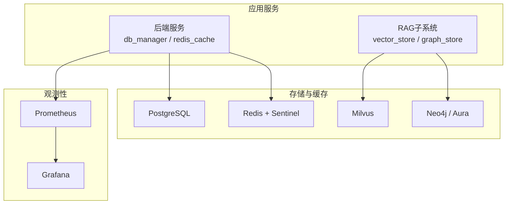
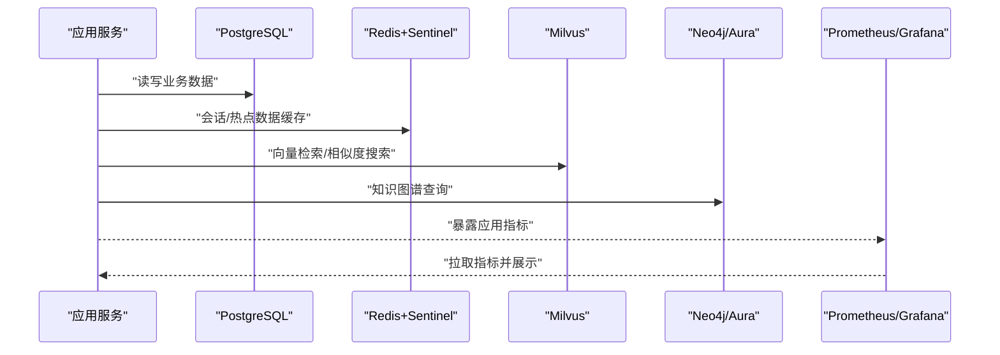
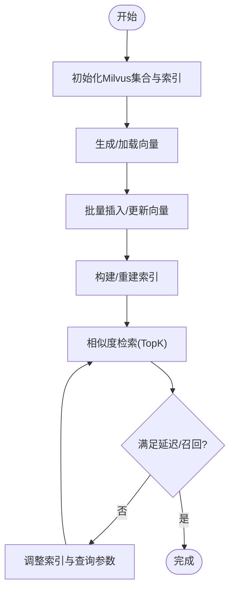
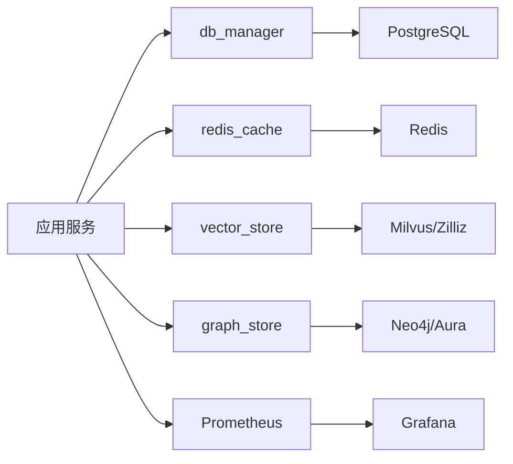

# 数据库高可用配置

<cite>
**本文引用的文件**   
- [docker-compose.yml](file://docker-compose.yml)
- [backend_design/nexus/core/db_manager.py](file://backend_design/nexus/core/db_manager.py)
- [backend_design/nexus/middleware/redis_cache.py](file://backend_design/nexus/middleware/redis_cache.py)
- [backend_design/nexus/rag/vector_store.py](file://backend_design/nexus/rag/vector_store.py)
- [backend_design/nexus/rag/zilliz_vector_store.py](file://backend_design/nexus/rag/zilliz_vector_store.py)
- [backend_design/nexus/rag/graph_store.py](file://backend_design/nexus/rag/graph_store.py)
- [backend_design/nexus/rag/aura_graph_store.py](file://backend_design/nexus/rag/aura_graph_store.py)
- [backend_design/nexus/rag/graph_base.py](file://backend_design/nexus/rag/graph_base.py)
- [backend_design/nexus/config.py](file://backend_design/nexus/config.py)
- [config/prometheus/prometheus.yml](file://config/prometheus/prometheus.yml)
- [config/grafana/provisioning/datasources/prometheus.yml](file://config/grafana/provisioning/datasources/prometheus.yml)
- [config/grafana/provisioning/dashboards/dashboards.yml](file://config/grafana/provisioning/dashboards/dashboards.yml)
- [config/grafana/provisioning/dashboards/nexuscockpit-overview.json](file://config/grafana/provisioning/dashboards/nexuscockpit-overview.json)
- [backend_design/scripts/init_milvus.py](file://backend_design/scripts/init_milvus.py)
- [backend_design/scripts/init_neo4j.py](file://backend_design/scripts/init_neo4j.py)
- [backend_design/scripts/test_db.py](file://backend_design/scripts/test_db.py)
- [backend_design/scripts/v2.1_migration.sql](file://backend_design/scripts/v2.1_migration.sql)
</cite>

## 目录
1. [简介](#简介)
2. [项目结构](#项目结构)
3. [核心组件](#核心组件)
4. [架构总览](#架构总览)
5. [详细组件分析](#详细组件分析)
6. [依赖关系分析](#依赖关系分析)
7. [性能考虑](#性能考虑)
8. [故障排查指南](#故障排查指南)
9. [结论](#结论)
10. [附录](#附录)

## 简介
本文件面向NexusCockpit系统的数据库与存储层，提供高可用（HA）配置与运维指导。内容覆盖：
- PostgreSQL主从复制、故障转移与备份恢复策略
- Neo4j图数据库集群部署、数据同步与一致性保证
- Milvus向量数据库分布式部署、索引优化与查询调优
- Redis缓存集群、哨兵模式与持久化策略
- 数据迁移工具、监控告警与容量规划建议

说明：仓库中未包含PostgreSQL与Neo4j的显式配置文件或编排脚本；本节基于通用最佳实践并结合仓库内现有集成点给出可落地的方案。Milvus与Redis在仓库中存在明确集成点，将结合源码进行针对性说明。

## 项目结构
与数据库高可用相关的代码与配置主要分布在以下位置：
- 应用侧数据库连接管理：后端核心模块中的数据库管理器
- 缓存与会话：中间件层的Redis客户端封装
- 向量检索：RAG子系统中的向量存储抽象与Zillik/Milvus实现
- 图检索：RAG子系统中的图存储抽象与Neo4j/Aura实现
- 初始化脚本：Milvus与Neo4j初始化脚本
- 监控：Prometheus与Grafana配置
- 容器编排：docker-compose.yml（用于本地/演示环境）

图表来源
- [backend_design/nexus/core/db_manager.py](file://backend_design/nexus/core/db_manager.py)
- [backend_design/nexus/middleware/redis_cache.py](file://backend_design/nexus/middleware/redis_cache.py)
- [backend_design/nexus/rag/vector_store.py](file://backend_design/nexus/rag/vector_store.py)
- [backend_design/nexus/rag/zilliz_vector_store.py](file://backend_design/nexus/rag/zilliz_vector_store.py)
- [backend_design/nexus/rag/graph_store.py](file://backend_design/nexus/rag/graph_store.py)
- [backend_design/nexus/rag/aura_graph_store.py](file://backend_design/nexus/rag/aura_graph_store.py)
- [config/prometheus/prometheus.yml](file://config/prometheus/prometheus.yml)
- [config/grafana/provisioning/datasources/prometheus.yml](file://config/grafana/provisioning/datasources/prometheus.yml)
- [config/grafana/provisioning/dashboards/dashboards.yml](file://config/grafana/provisioning/dashboards/dashboards.yml)

章节来源
- [docker-compose.yml](file://docker-compose.yml)
- [backend_design/nexus/core/db_manager.py](file://backend_design/nexus/core/db_manager.py)
- [backend_design/nexus/middleware/redis_cache.py](file://backend_design/nexus/middleware/redis_cache.py)
- [backend_design/nexus/rag/vector_store.py](file://backend_design/nexus/rag/vector_store.py)
- [backend_design/nexus/rag/zilliz_vector_store.py](file://backend_design/nexus/rag/zilliz_vector_store.py)
- [backend_design/nexus/rag/graph_store.py](file://backend_design/nexus/rag/graph_store.py)
- [backend_design/nexus/rag/aura_graph_store.py](file://backend_design/nexus/rag/aura_graph_store.py)
- [config/prometheus/prometheus.yml](file://config/prometheus/prometheus.yml)
- [config/grafana/provisioning/datasources/prometheus.yml](file://config/grafana/provisioning/datasources/prometheus.yml)
- [config/grafana/provisioning/dashboards/dashboards.yml](file://config/grafana/provisioning/dashboards/dashboards.yml)

## 核心组件
- 数据库连接管理：负责PostgreSQL连接池、事务与错误重试等能力
- 缓存中间件：封装Redis连接、键空间隔离、序列化与异常处理
- 向量存储抽象：统一向量检索接口，支持多种后端（含Milvus/Zilliz）
- 图存储抽象：统一图查询接口，支持Neo4j与Aura
- 监控与可视化：Prometheus抓取指标，Grafana展示仪表盘

章节来源
- [backend_design/nexus/core/db_manager.py](file://backend_design/nexus/core/db_manager.py)
- [backend_design/nexus/middleware/redis_cache.py](file://backend_design/nexus/middleware/redis_cache.py)
- [backend_design/nexus/rag/vector_store.py](file://backend_design/nexus/rag/vector_store.py)
- [backend_design/nexus/rag/zilliz_vector_store.py](file://backend_design/nexus/rag/zilliz_vector_store.py)
- [backend_design/nexus/rag/graph_store.py](file://backend_design/nexus/rag/graph_store.py)
- [backend_design/nexus/rag/aura_graph_store.py](file://backend_design/nexus/rag/aura_graph_store.py)

## 架构总览
下图展示了NexusCockpit在存储与缓存层面的整体架构及关键交互路径。

图表来源
- [backend_design/nexus/core/db_manager.py](file://backend_design/nexus/core/db_manager.py)
- [backend_design/nexus/middleware/redis_cache.py](file://backend_design/nexus/middleware/redis_cache.py)
- [backend_design/nexus/rag/vector_store.py](file://backend_design/nexus/rag/vector_store.py)
- [backend_design/nexus/rag/zilliz_vector_store.py](file://backend_design/nexus/rag/zilliz_vector_store.py)
- [backend_design/nexus/rag/graph_store.py](file://backend_design/nexus/rag/graph_store.py)
- [backend_design/nexus/rag/aura_graph_store.py](file://backend_design/nexus/rag/aura_graph_store.py)
- [config/prometheus/prometheus.yml](file://config/prometheus/prometheus.yml)
- [config/grafana/provisioning/datasources/prometheus.yml](file://config/grafana/provisioning/datasources/prometheus.yml)

## 详细组件分析

### PostgreSQL高可用（主从复制、故障转移、备份恢复）
- 主从复制
  - 采用流复制（Streaming Replication），主库写、从库读，提升吞吐与容灾能力
  - 建议开启WAL归档，配合逻辑/物理备份工具（如pg_basebackup、wal-g）
- 故障转移
  - 使用自动故障转移工具（如Patroni+etcd/Consul）实现VIP漂移与只读路由切换
  - 应用侧通过连接池参数控制只读副本与重连退避
- 备份恢复
  - 全量备份：定期执行基础备份（如每日一次）
  - 增量备份：基于WAL归档的连续归档备份
  - 恢复演练：定期验证PITR（时间点恢复）流程
- 安全与合规
  - 传输加密（TLS）、最小权限账号、审计日志

注意：仓库中未包含PostgreSQL具体配置或编排脚本，以上为通用落地方案。

章节来源
- [backend_design/nexus/core/db_manager.py](file://backend_design/nexus/core/db_manager.py)

### Neo4j图数据库集群（部署、同步、一致性）
- 部署模式
  - 多实例集群（Core集群）+ 可选Read Replica
  - 通过Neo4j Cluster Manager或Kubernetes Operator管理
- 数据同步与一致性
  - 强一致写入到多数派节点，读请求可路由至副本
  - 关注事务边界与超时设置，避免长事务阻塞复制
- 高可用与扩容
  - Core节点故障时自动选举新Leader
  - 水平扩展需评估磁盘I/O与网络带宽
- 与应用的集成
  - 通过RAG图存储抽象访问，确保连接池与重试策略合理

章节来源
- [backend_design/nexus/rag/graph_store.py](file://backend_design/nexus/rag/graph_store.py)
- [backend_design/nexus/rag/aura_graph_store.py](file://backend_design/nexus/rag/aura_graph_store.py)
- [backend_design/nexus/rag/graph_base.py](file://backend_design/nexus/rag/graph_base.py)
- [backend_design/scripts/init_neo4j.py](file://backend_design/scripts/init_neo4j.py)

### Milvus向量数据库（分布式部署、索引优化、查询调优）
- 分布式部署
  - 推荐至少3个etcd节点、3个MinIO节点、多个QueryNode/DataNode
  - 使用官方Helm Chart或Operator进行编排
- 索引优化
  - 根据维度与召回率需求选择索引类型（如IVF_FLAT、HNSW、SCANN）
  - 合理设置nlist/nprobe、M、efConstruction等参数
- 查询性能调优
  - 批量化查询、分页与TopK限制
  - 调整QueryNode资源与并发度，避免OOM
- 初始化与校验
  - 使用仓库提供的初始化脚本创建集合与索引

图表来源
- [backend_design/scripts/init_milvus.py](file://backend_design/scripts/init_milvus.py)
- [backend_design/nexus/rag/vector_store.py](file://backend_design/nexus/rag/vector_store.py)
- [backend_design/nexus/rag/zilliz_vector_store.py](file://backend_design/nexus/rag/zilliz_vector_store.py)

章节来源
- [backend_design/nexus/rag/vector_store.py](file://backend_design/nexus/rag/vector_store.py)
- [backend_design/nexus/rag/zilliz_vector_store.py](file://backend_design/nexus/rag/zilliz_vector_store.py)
- [backend_design/scripts/init_milvus.py](file://backend_design/scripts/init_milvus.py)

### Redis缓存集群（哨兵模式与持久化）
- 集群与哨兵
  - 主从复制 + Sentinel实现自动故障转移
  - 客户端应支持多主从与Failover重试
- 持久化策略
  - RDB快照：适合冷备与快速恢复
  - AOF追加：适合数据安全优先场景
  - 生产建议AOF+RDB组合，按业务容忍度调整fsync策略
- 内存与淘汰
  - 设置maxmemory与合适的eviction策略（如allkeys-lru）
- 应用集成
  - 通过中间件封装连接、序列化与异常处理

章节来源
- [backend_design/nexus/middleware/redis_cache.py](file://backend_design/nexus/middleware/redis_cache.py)

### 数据迁移工具
- SQL迁移
  - 使用版本化SQL脚本进行DDL/DML变更，具备幂等与回滚策略
- 初始化脚本
  - 针对外部系统（如Neo4j、Milvus）提供初始化与校验脚本
- 测试与验证
  - 提供数据库连通性与基本功能测试脚本

章节来源
- [backend_design/scripts/v2.1_migration.sql](file://backend_design/scripts/v2.1_migration.sql)
- [backend_design/scripts/init_neo4j.py](file://backend_design/scripts/init_neo4j.py)
- [backend_design/scripts/init_milvus.py](file://backend_design/scripts/init_milvus.py)
- [backend_design/scripts/test_db.py](file://backend_design/scripts/test_db.py)

### 监控与告警
- Prometheus抓取
  - 配置目标端点与抓取间隔
- Grafana仪表盘
  - 预置数据源与仪表盘，便于快速观察系统健康
- 指标建议
  - 数据库连接数、慢查询、复制延迟
  - Redis命中率、内存使用、持久化耗时
  - Milvus查询延迟、索引构建进度
  - Neo4j事务延迟、复制状态

章节来源
- [config/prometheus/prometheus.yml](file://config/prometheus/prometheus.yml)
- [config/grafana/provisioning/datasources/prometheus.yml](file://config/grafana/provisioning/datasources/prometheus.yml)
- [config/grafana/provisioning/dashboards/dashboards.yml](file://config/grafana/provisioning/dashboards/dashboards.yml)
- [config/grafana/provisioning/dashboards/nexuscockpit-overview.json](file://config/grafana/provisioning/dashboards/nexuscockpit-overview.json)

## 依赖关系分析
- 应用对存储的依赖
  - db_manager依赖PostgreSQL
  - redis_cache依赖Redis
  - vector_store依赖Milvus/Zilliz
  - graph_store依赖Neo4j/Aura
- 观测性依赖
  - Prometheus采集应用与组件指标
  - Grafana消费Prometheus数据源

图表来源
- [backend_design/nexus/core/db_manager.py](file://backend_design/nexus/core/db_manager.py)
- [backend_design/nexus/middleware/redis_cache.py](file://backend_design/nexus/middleware/redis_cache.py)
- [backend_design/nexus/rag/vector_store.py](file://backend_design/nexus/rag/vector_store.py)
- [backend_design/nexus/rag/zilliz_vector_store.py](file://backend_design/nexus/rag/zilliz_vector_store.py)
- [backend_design/nexus/rag/graph_store.py](file://backend_design/nexus/rag/graph_store.py)
- [backend_design/nexus/rag/aura_graph_store.py](file://backend_design/nexus/rag/aura_graph_store.py)
- [config/prometheus/prometheus.yml](file://config/prometheus/prometheus.yml)
- [config/grafana/provisioning/datasources/prometheus.yml](file://config/grafana/provisioning/datasources/prometheus.yml)

章节来源
- [backend_design/nexus/core/db_manager.py](file://backend_design/nexus/core/db_manager.py)
- [backend_design/nexus/middleware/redis_cache.py](file://backend_design/nexus/middleware/redis_cache.py)
- [backend_design/nexus/rag/vector_store.py](file://backend_design/nexus/rag/vector_store.py)
- [backend_design/nexus/rag/zilliz_vector_store.py](file://backend_design/nexus/rag/zilliz_vector_store.py)
- [backend_design/nexus/rag/graph_store.py](file://backend_design/nexus/rag/graph_store.py)
- [backend_design/nexus/rag/aura_graph_store.py](file://backend_design/nexus/rag/aura_graph_store.py)
- [config/prometheus/prometheus.yml](file://config/prometheus/prometheus.yml)
- [config/grafana/provisioning/datasources/prometheus.yml](file://config/grafana/provisioning/datasources/prometheus.yml)

## 性能考虑
- PostgreSQL
  - 连接池大小与并发度匹配CPU核数
  - 启用顺序扫描阈值与统计信息收集
  - 对热点表建立合适索引，避免过度索引
- Redis
  - 合理设置过期时间与淘汰策略
  - 大Key拆分，避免阻塞事件循环
- Milvus
  - 批量写入与异步索引构建
  - 查询时限制TopK与过滤条件，减少计算开销
- Neo4j
  - 避免全图遍历，使用索引与约束
  - 控制事务大小与超时，降低锁竞争

[本节为通用性能建议，不直接分析具体文件]

## 故障排查指南
- 数据库连接问题
  - 检查db_manager的连接参数、重试与超时配置
  - 查看PostgreSQL主从复制状态与延迟
- 缓存异常
  - 检查Redis主从与哨兵状态、内存与持久化
  - 确认客户端是否支持Failover与重试
- 向量检索失败
  - 检查Milvus集合是否存在、索引是否构建完成
  - 核对向量维度与索引参数
- 图查询异常
  - 检查Neo4j集群健康与读写路由
  - 确认认证与端口可达
- 监控定位
  - 通过Prometheus/Grafana观察各组件指标与告警

章节来源
- [backend_design/nexus/core/db_manager.py](file://backend_design/nexus/core/db_manager.py)
- [backend_design/nexus/middleware/redis_cache.py](file://backend_design/nexus/middleware/redis_cache.py)
- [backend_design/nexus/rag/vector_store.py](file://backend_design/nexus/rag/vector_store.py)
- [backend_design/nexus/rag/zilliz_vector_store.py](file://backend_design/nexus/rag/zilliz_vector_store.py)
- [backend_design/nexus/rag/graph_store.py](file://backend_design/nexus/rag/graph_store.py)
- [backend_design/nexus/rag/aura_graph_store.py](file://backend_design/nexus/rag/aura_graph_store.py)
- [config/prometheus/prometheus.yml](file://config/prometheus/prometheus.yml)
- [config/grafana/provisioning/datasources/prometheus.yml](file://config/grafana/provisioning/datasources/prometheus.yml)
- [config/grafana/provisioning/dashboards/dashboards.yml](file://config/grafana/provisioning/dashboards/dashboards.yml)

## 结论
通过对NexusCockpit存储与缓存层的分析与设计，本文给出了PostgreSQL主从与故障转移、Neo4j集群与一致性、Milvus分布式与索引调优、Redis哨兵与持久化的高可用方案，并结合仓库内的初始化脚本与监控配置提供了可落地的实施要点。建议在上线前完成备份恢复演练、压测与容量规划，确保系统在峰值负载下的稳定性与可恢复性。

[本节为总结性内容，不直接分析具体文件]

## 附录
- 配置参考
  - 应用配置入口：用于集中读取数据库、缓存、向量与图服务的连接参数
- 容器编排
  - docker-compose.yml可用于本地/演示环境的快速启动与联调

章节来源
- [backend_design/nexus/config.py](file://backend_design/nexus/config.py)
- [docker-compose.yml](file://docker-compose.yml)