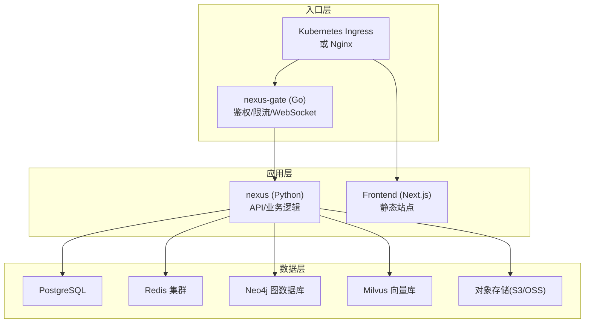
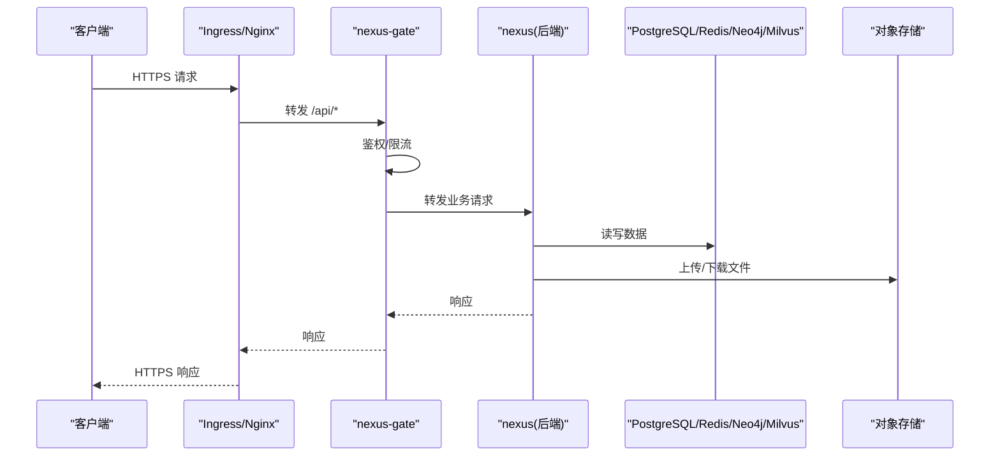
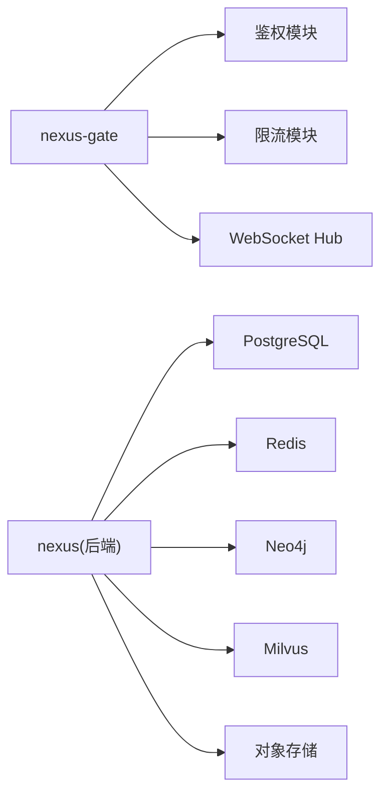

# 生产环境部署

<cite>
**本文引用的文件**   
- [docker-compose.yml](file://docker-compose.yml)
- [backend_design/Dockerfile](file://backend_design/Dockerfile)
- [backend_design/nexus/main.py](file://backend_design/nexus/main.py)
- [backend_design/nexus/config.py](file://backend_design/nexus/config.py)
- [backend_design/nexus/core/db_manager.py](file://backend_design/nexus/core/db_manager.py)
- [backend_design/nexus/middleware/redis_cache.py](file://backend_design/nexus/middleware/redis_cache.py)
- [backend_design/nexus/core/oss.py](file://backend_design/nexus/core/oss.py)
- [backend_design/nexus_gate/Dockerfile](file://backend_design/nexus_gate/Dockerfile)
- [backend_design/nexus_gate/internal/config/config.go](file://backend_design/nexus_gate/internal/config/config.go)
- [backend_design/nexus_gate/internal/handlers/handlers.go](file://backend_design/nexus_gate/internal/handlers/handlers.go)
- [frontend_design/Dockerfile](file://frontend_design/Dockerfile)
- [config/prometheus/prometheus.yml](file://config/prometheus/prometheus.yml)
- [config/grafana/provisioning/dashboards/dashboards.yml](file://config/grafana/provisioning/dashboards/dashboards.yml)
- [config/grafana/provisioning/datasources/prometheus.yml](file://config/grafana/provisioning/datasources/prometheus.yml)
- [backend_design/scripts/init_neo4j.py](file://backend_design/scripts/init_neo4j.py)
- [backend_design/scripts/init_milvus.py](file://backend_design/scripts/init_milvus.py)
</cite>

## 目录
1. [简介](#简介)
2. [项目结构](#项目结构)
3. [核心组件](#核心组件)
4. [架构总览](#架构总览)
5. [详细组件分析](#详细组件分析)
6. [依赖关系分析](#依赖关系分析)
7. [性能考虑](#性能考虑)
8. [故障排查指南](#故障排查指南)
9. [结论](#结论)
10. [附录](#附录)

## 简介
本文件面向生产环境，提供 NexusCockpit 的容器化与集群编排部署方案。内容覆盖：
- Docker 容器化镜像构建与运行
- Kubernetes 集群编排（Deployment、Service、Ingress、ConfigMap/Secret、HPA）
- 负载均衡与反向代理配置要点
- 数据库高可用、缓存集群、对象存储集成
- SSL 证书、域名绑定与 CDN 加速
- 性能调优参数、资源限制与安全加固
- 灰度发布、滚动更新与回滚策略

## 项目结构
NexusCockpit 由以下主要服务组成：
- 后端服务（Python/Next 风格 API + 业务逻辑）
- 网关服务（Go 实现，负责鉴权、限流、WebSocket 转发等）
- 前端静态站点（Next.js 构建产物）
- 外部依赖：PostgreSQL、Redis、Neo4j、Milvus、对象存储（S3/OSS）

**图示来源** 
- [docker-compose.yml](file://docker-compose.yml)
- [backend_design/nexus/main.py](file://backend_design/nexus/main.py)
- [backend_design/nexus_gate/internal/handlers/handlers.go](file://backend_design/nexus_gate/internal/handlers/handlers.go)
- [frontend_design/Dockerfile](file://frontend_design/Dockerfile)

**章节来源**
- [docker-compose.yml](file://docker-compose.yml)
- [backend_design/Dockerfile](file://backend_design/Dockerfile)
- [backend_design/nexus_gate/Dockerfile](file://backend_design/nexus_gate/Dockerfile)
- [frontend_design/Dockerfile](file://frontend_design/Dockerfile)

## 核心组件
- 后端服务（nexus）
  - 启动入口与路由注册
  - 配置加载与环境变量注入
  - 数据库连接管理
  - Redis 缓存中间件
  - 对象存储客户端封装
- 网关服务（nexus-gate）
  - Go 服务入口与配置
  - 请求处理与鉴权
  - WebSocket Hub 转发
- 前端服务（Next.js）
  - 静态站点构建与容器化
- 可观测性
  - Prometheus 抓取配置
  - Grafana 仪表盘与数据源

**章节来源**
- [backend_design/nexus/main.py](file://backend_design/nexus/main.py)
- [backend_design/nexus/config.py](file://backend_design/nexus/config.py)
- [backend_design/nexus/core/db_manager.py](file://backend_design/nexus/core/db_manager.py)
- [backend_design/nexus/middleware/redis_cache.py](file://backend_design/nexus/middleware/redis_cache.py)
- [backend_design/nexus/core/oss.py](file://backend_design/nexus/core/oss.py)
- [backend_design/nexus_gate/internal/config/config.go](file://backend_design/nexus_gate/internal/config/config.go)
- [backend_design/nexus_gate/internal/handlers/handlers.go](file://backend_design/nexus_gate/internal/handlers/handlers.go)
- [config/prometheus/prometheus.yml](file://config/prometheus/prometheus.yml)
- [config/grafana/provisioning/dashboards/dashboards.yml](file://config/grafana/provisioning/dashboards/dashboards.yml)
- [config/grafana/provisioning/datasources/prometheus.yml](file://config/grafana/provisioning/datasources/prometheus.yml)

## 架构总览
生产环境推荐采用“网关+多副本后端+有状态服务外置”的架构模式：
- 入口流量经 Ingress/Nginx 进入，按路径分发至网关或前端静态站点
- 网关统一鉴权、限流、协议转换，并将业务请求转发到后端服务
- 后端服务无状态化，水平扩展；通过环境变量或 ConfigMap 注入配置
- 有状态组件（数据库、缓存、图数据库、向量库、对象存储）以托管或自建高可用集群形式提供

**图示来源** 
- [backend_design/nexus_gate/internal/handlers/handlers.go](file://backend_design/nexus_gate/internal/handlers/handlers.go)
- [backend_design/nexus/main.py](file://backend_design/nexus/main.py)
- [backend_design/nexus/core/db_manager.py](file://backend_design/nexus/core/db_manager.py)
- [backend_design/nexus/core/oss.py](file://backend_design/nexus/core/oss.py)

## 详细组件分析

### 容器化与镜像构建
- 后端服务镜像
  - 使用 Python 基础镜像，安装依赖并拷贝代码
  - 暴露端口与启动命令在入口文件中定义
- 网关服务镜像
  - 使用 Go 多阶段构建，生成最小运行时镜像
  - 通过环境变量或配置文件注入运行时参数
- 前端镜像
  - 基于 Node 构建 Next.js 静态站点，再复制到轻量 HTTP 服务器镜像

建议：
- 为每个服务单独维护 Dockerfile，便于独立构建与缓存优化
- 使用 .dockerignore 排除无关文件，减小镜像体积
- 固定基础镜像版本，避免上游变更导致的不稳定

**章节来源**
- [backend_design/Dockerfile](file://backend_design/Dockerfile)
- [backend_design/nexus_gate/Dockerfile](file://backend_design/nexus_gate/Dockerfile)
- [frontend_design/Dockerfile](file://frontend_design/Dockerfile)

### Kubernetes 编排要点
- Deployment
  - 设置 replicas 与资源请求/限制
  - 健康检查探针（liveness/readiness）
  - 滚动更新策略（maxSurge/maxUnavailable）
- Service
  - ClusterIP 暴露内部服务
  - LoadBalancer 暴露对外入口（可选）
- Ingress
  - 域名绑定与 TLS 终止
  - 路径规则将 /api 指向网关，其余指向前端
- ConfigMap/Secret
  - 敏感信息（数据库密码、密钥）放入 Secret
  - 非敏感配置放入 ConfigMap
- HPA
  - 基于 CPU/内存或自定义指标自动扩缩容
- PodDisruptionBudget
  - 保障滚动更新期间的最小可用副本数

注意：
- 确保探针端点存在且快速返回
- 合理设置资源限制，避免 OOMKill 或 CPU 节流
- 使用持久卷（PVC）挂载有状态数据（如本地临时文件）

[本节为通用编排指导，不直接分析具体文件]

### 负载均衡与反向代理
- Ingress/Nginx 配置
  - 启用 gzip/brotli 压缩
  - 开启 HTTP/2 与 Keep-Alive
  - 配置超时、重试与熔断策略
  - 对 WebSocket 路径进行特殊处理
- 网关层
  - 限流算法（令牌桶/漏桶）
  - 鉴权中间件（JWT 校验）
  - 请求日志与追踪 ID 透传

**章节来源**
- [backend_design/nexus_gate/internal/handlers/handlers.go](file://backend_design/nexus_gate/internal/handlers/handlers.go)
- [backend_design/nexus_gate/internal/config/config.go](file://backend_design/nexus_gate/internal/config/config.go)

### 数据库高可用配置
- PostgreSQL
  - 主从复制与自动故障转移（ Patroni/Cloud SQL 托管）
  - 连接池参数（最大连接数、空闲超时）
  - 只读副本用于报表查询
- 初始化脚本
  - 表结构与初始数据初始化
  - 索引与分区策略

**章节来源**
- [backend_design/nexus/core/db_manager.py](file://backend_design/nexus/core/db_manager.py)
- [backend_design/scripts/init_neo4j.py](file://backend_design/scripts/init_neo4j.py)

### 缓存集群部署
- Redis 集群
  - 哨兵或集群模式
  - 持久化策略（RDB/AOF）
  - 内存淘汰策略与键过期时间
- 应用侧缓存中间件
  - 连接池与重试机制
  - 缓存穿透/雪崩防护（布隆过滤器、随机过期）

**章节来源**
- [backend_design/nexus/middleware/redis_cache.py](file://backend_design/nexus/middleware/redis_cache.py)

### 对象存储集成
- S3/OSS 兼容接口
  - 访问密钥与区域配置
  - 分片上传与断点续传
  - 生命周期管理与冷热分层
- 安全最佳实践
  - 最小权限原则
  - 服务端加密与 KMS 集成

**章节来源**
- [backend_design/nexus/core/oss.py](file://backend_design/nexus/core/oss.py)

### SSL 证书配置、域名绑定与 CDN 加速
- TLS 终止
  - Ingress 控制器管理证书（Let’s Encrypt/私有 CA）
  - 强制 HTTPS 与 HSTS
- 域名绑定
  - DNS A/CNAME 记录指向 Ingress 地址
  - 多域名与通配符证书
- CDN 加速
  - 静态资源与图片缓存
  - 边缘节点预热与回源策略

[本节为通用网络与安全配置指导，不直接分析具体文件]

### 可观测性与监控
- Prometheus
  - 抓取目标与指标暴露
  - 告警规则与阈值
- Grafana
  - 仪表盘模板与数据源
  - 关键指标：QPS、延迟、错误率、资源使用率

**章节来源**
- [config/prometheus/prometheus.yml](file://config/prometheus/prometheus.yml)
- [config/grafana/provisioning/dashboards/dashboards.yml](file://config/grafana/provisioning/dashboards/dashboards.yml)
- [config/grafana/provisioning/datasources/prometheus.yml](file://config/grafana/provisioning/datasources/prometheus.yml)

## 依赖关系分析
- 服务间依赖
  - 网关依赖鉴权与限流模块
  - 后端依赖数据库、缓存、图数据库、向量库与对象存储
- 外部依赖
  - 第三方 LLM/TTS/ASR 服务（按需）
  - 日志与链路追踪平台

**图示来源** 
- [backend_design/nexus_gate/internal/handlers/handlers.go](file://backend_design/nexus_gate/internal/handlers/handlers.go)
- [backend_design/nexus/core/db_manager.py](file://backend_design/nexus/core/db_manager.py)
- [backend_design/nexus/middleware/redis_cache.py](file://backend_design/nexus/middleware/redis_cache.py)
- [backend_design/nexus/core/oss.py](file://backend_design/nexus/core/oss.py)

**章节来源**
- [backend_design/nexus_gate/internal/config/config.go](file://backend_design/nexus_gate/internal/config/config.go)
- [backend_design/nexus/main.py](file://backend_design/nexus/main.py)

## 性能考虑
- 应用层
  - 调整工作进程与线程数（Gunicorn/Uvicorn workers）
  - 连接池大小与超时参数
  - 缓存命中率与热点键优化
- 网关层
  - 并发连接数与缓冲区大小
  - 限流阈值与降级策略
- 数据层
  - 数据库索引与查询优化
  - 向量检索召回率与重排器参数
- 网络层
  - TCP 队列与内核参数
  - 压缩与带宽控制

[本节为通用性能优化指导，不直接分析具体文件]

## 故障排查指南
- 常见问题定位
  - 连接失败：检查网络策略、防火墙与凭据
  - 超时与重试：查看网关与应用层超时配置
  - 缓存异常：确认 Redis 集群状态与键空间
  - 对象存储错误：核对权限与区域配置
- 日志与追踪
  - 结构化日志与采样率
  - 分布式追踪 ID 透传
- 健康检查
  - 探针端点可用性
  - 依赖健康状态聚合

**章节来源**
- [backend_design/nexus/config.py](file://backend_design/nexus/config.py)
- [backend_design/nexus/core/db_manager.py](file://backend_design/nexus/core/db_manager.py)
- [backend_design/nexus/middleware/redis_cache.py](file://backend_design/nexus/middleware/redis_cache.py)
- [backend_design/nexus/core/oss.py](file://backend_design/nexus/core/oss.py)

## 结论
通过容器化与 Kubernetes 编排，NexusCockpit 可实现高可用、可扩展的生产部署。结合网关鉴权限流、数据库高可用、缓存集群与对象存储集成，配合 SSL/CDN 与完善的可观测性体系，能够满足大规模用户场景下的稳定性与性能要求。建议在上线前完成容量规划、压测与演练，制定灰度与回滚策略，持续监控与优化。

[本节为总结性内容，不直接分析具体文件]

## 附录

### 部署清单与步骤（示例）
- 准备基础设施
  - 创建命名空间、RBAC、网络策略
  - 部署数据库、缓存、图数据库、向量库与对象存储
- 构建与推送镜像
  - 后端、网关、前端镜像构建与签名
- 部署应用
  - 创建 ConfigMap/Secret
  - 部署 Deployment、Service、Ingress、HPA
- 验证与监控
  - 健康检查与端到端测试
  - 接入 Prometheus/Grafana 监控

[本节为通用操作指引，不直接分析具体文件]

### 初始化脚本参考
- 图数据库初始化
- 向量库初始化

**章节来源**
- [backend_design/scripts/init_neo4j.py](file://backend_design/scripts/init_neo4j.py)
- [backend_design/scripts/init_milvus.py](file://backend_design/scripts/init_milvus.py)