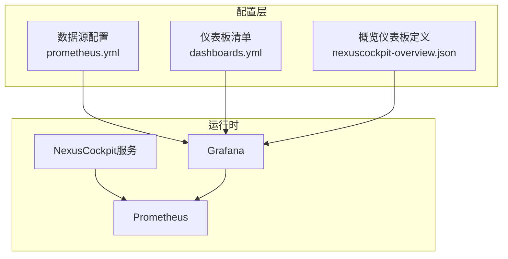
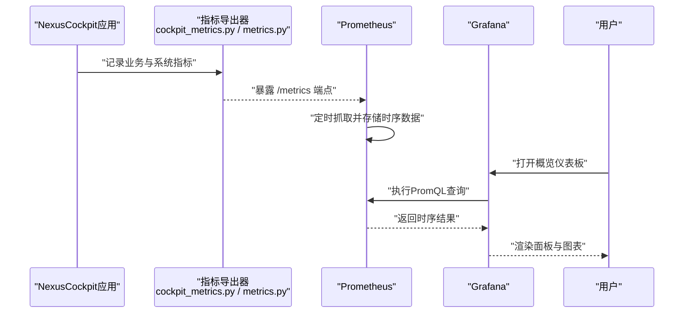
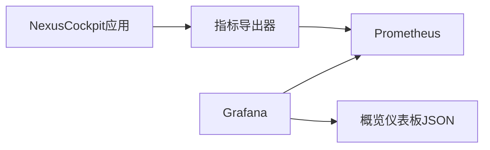

# Grafana仪表板配置

<cite>
**本文引用的文件**   
- [config/grafana/provisioning/dashboards/dashboards.yml](file://config/grafana/provisioning/dashboards/dashboards.yml)
- [config/grafana/provisioning/dashboards/nexuscockpit-overview.json](file://config/grafana/provisioning/dashboards/nexuscockpit-overview.json)
- [config/grafana/provisioning/datasources/prometheus.yml](file://config/grafana/provisioning/datasources/prometheus.yml)
- [backend_design/nexus/observability/cockpit_metrics.py](file://backend_design/nexus/observability/cockpit_metrics.py)
- [backend_design/nexus/observability/metrics.py](file://backend_design/nexus/observability/metrics.py)
- [backend_design/nexus/api/routes/cockpit.py](file://backend_design/nexus/api/routes/cockpit.py)
- [backend_design/nexus/core/cockpit_manager.py](file://backend_design/nexus/core/cockpit_manager.py)
- [docker-compose.yml](file://docker-compose.yml)
</cite>

## 目录
1. [简介](#简介)
2. [项目结构](#项目结构)
3. [核心组件](#核心组件)
4. [架构总览](#架构总览)
5. [详细组件分析](#详细组件分析)
6. [依赖分析](#依赖分析)
7. [性能考虑](#性能考虑)
8. [故障排查指南](#故障排查指南)
9. [结论](#结论)
10. [附录](#附录)

## 简介
本文件面向NexusCockpit系统的Grafana仪表板配置与使用，覆盖以下目标：
- 仪表板JSON结构与数据源连接配置说明
- 面板类型选择建议与系统概览仪表板各面板含义
- 关键业务指标可视化、性能趋势分析与错误率监控方法
- 自定义仪表板开发指南、主题定制方法与权限管理配置
- 常用查询语句与告警集成示例

## 项目结构
与Grafana相关的配置位于config/grafana目录下，采用Provisioning方式自动注册数据源与仪表板。后端通过Prometheus暴露指标，供Grafana采集展示。

图表来源
- [config/grafana/provisioning/datasources/prometheus.yml](file://config/grafana/provisioning/datasources/prometheus.yml)
- [config/grafana/provisioning/dashboards/dashboards.yml](file://config/grafana/provisioning/dashboards/dashboards.yml)
- [config/grafana/provisioning/dashboards/nexuscockpit-overview.json](file://config/grafana/provisioning/dashboards/nexuscockpit-overview.json)

章节来源
- [config/grafana/provisioning/datasources/prometheus.yml](file://config/grafana/provisioning/datasources/prometheus.yml)
- [config/grafana/provisioning/dashboards/dashboards.yml](file://config/grafana/provisioning/dashboards/dashboards.yml)
- [config/grafana/provisioning/dashboards/nexuscockpit-overview.json](file://config/grafana/provisioning/dashboards/nexuscockpit-overview.json)

## 核心组件
- 数据源（Prometheus）：提供时序指标采集与查询能力
- 仪表板清单（dashboards.yml）：声明式注册仪表板到Grafana
- 概览仪表板（nexuscockpit-overview.json）：包含系统概览所需的面板集合
- 指标导出端点：后端将应用指标暴露给Prometheus抓取

章节来源
- [config/grafana/provisioning/datasources/prometheus.yml](file://config/grafana/provisioning/datasources/prometheus.yml)
- [config/grafana/provisioning/dashboards/dashboards.yml](file://config/grafana/provisioning/dashboards/dashboards.yml)
- [config/grafana/provisioning/dashboards/nexuscockpit-overview.json](file://config/grafana/provisioning/dashboards/nexuscockpit-overview.json)
- [backend_design/nexus/observability/cockpit_metrics.py](file://backend_design/nexus/observability/cockpit_metrics.py)
- [backend_design/nexus/observability/metrics.py](file://backend_design/nexus/observability/metrics.py)

## 架构总览
下图展示了从应用指标采集到Grafana可视化的端到端流程。

图表来源
- [backend_design/nexus/observability/cockpit_metrics.py](file://backend_design/nexus/observability/cockpit_metrics.py)
- [backend_design/nexus/observability/metrics.py](file://backend_design/nexus/observability/metrics.py)
- [config/grafana/provisioning/datasources/prometheus.yml](file://config/grafana/provisioning/datasources/prometheus.yml)
- [config/grafana/provisioning/dashboards/nexuscockpit-overview.json](file://config/grafana/provisioning/dashboards/nexuscockpit-overview.json)

## 详细组件分析

### 数据源连接配置（Prometheus）
- 作用：为Grafana提供统一的时序数据访问入口
- 关键点：
  - 数据源类型：Prometheus
  - URL：指向Prometheus服务地址
  - 认证与TLS：根据部署环境配置
  - 最小权限：仅授予读取权限
- 验证方法：在Grafana中测试连接并查看可用时间范围

章节来源
- [config/grafana/provisioning/datasources/prometheus.yml](file://config/grafana/provisioning/datasources/prometheus.yml)

### 仪表板清单注册（dashboards.yml）
- 作用：声明式地将仪表板JSON注册到Grafana
- 关键点：
  - 指定JSON文件路径或URL
  - 设置默认文件夹与标签
  - 支持多环境差异化配置
- 变更生效：修改后重启Grafana或触发重新加载

章节来源
- [config/grafana/provisioning/dashboards/dashboards.yml](file://config/grafana/provisioning/dashboards/dashboards.yml)

### 系统概览仪表板（nexuscockpit-overview.json）
- 作用：集中展示NexusCockpit的关键运行状态与业务指标
- 典型面板分类与建议：
  - 关键业务指标（KPI）
    - 请求总量、成功率、P95/P99延迟、活跃会话数、技能调用次数
    - 推荐面板类型：Stat、Time Series、Bar Gauge
  - 性能趋势分析
    - CPU/内存/磁盘/网络、GC停顿、队列积压、缓存命中率
    - 推荐面板类型：Time Series、Heatmap
  - 错误率监控
    - 5xx比例、异常堆栈Top N、慢请求占比、熔断器状态
    - 推荐面板类型：Time Series、Pie Chart、Table
- 变量与过滤：
  - 使用变量实现按租户、模块、版本等维度筛选
  - 结合全局时间范围与相对时间快捷选项
- 交互与联动：
  - 面板间钻取、跳转至日志或链路追踪
  - 点击事件跳转到外部系统（如Loki、Jaeger）

章节来源
- [config/grafana/provisioning/dashboards/nexuscockpit-overview.json](file://config/grafana/provisioning/dashboards/nexuscockpit-overview.json)

### 指标导出与采集（后端）
- 指标定义与命名规范：
  - 使用清晰的前缀与维度标签（如tenant、module、version）
  - 区分计数器、直方图、摘要与时序指标
- 关键指标类别：
  - 业务类：请求计数、成功率、耗时分布、技能调用量
  - 系统类：CPU、内存、GC、线程池、队列长度
  - 可靠性类：错误率、超时率、熔断状态、重试次数
- 暴露端点：
  - 标准Prometheus格式，便于Prometheus抓取
- 与Grafana的对接：
  - Prometheus定期抓取
  - Grafana通过PromQL进行聚合与可视化

章节来源
- [backend_design/nexus/observability/cockpit_metrics.py](file://backend_design/nexus/observability/cockpit_metrics.py)
- [backend_design/nexus/observability/metrics.py](file://backend_design/nexus/observability/metrics.py)

### 仪表盘与后端接口关系
- 概览仪表板依赖的指标由后端导出
- 某些面板可能直接调用后端API获取实时状态（例如健康检查、中间件状态）
- 建议优先使用Prometheus指标，减少同步调用对性能的影响

章节来源
- [backend_design/nexus/api/routes/cockpit.py](file://backend_design/nexus/api/routes/cockpit.py)
- [backend_design/nexus/core/cockpit_manager.py](file://backend_design/nexus/core/cockpit_manager.py)

## 依赖分析
- 组件耦合：
  - Grafana依赖Prometheus作为唯一数据源
  - 仪表板JSON依赖数据源名称与指标命名约定
  - 后端指标导出需遵循命名与标签规范
- 外部依赖：
  - Prometheus抓取频率影响数据新鲜度
  - 网络与TLS配置影响连通性

图表来源
- [backend_design/nexus/observability/cockpit_metrics.py](file://backend_design/nexus/observability/cockpit_metrics.py)
- [backend_design/nexus/observability/metrics.py](file://backend_design/nexus/observability/metrics.py)
- [config/grafana/provisioning/datasources/prometheus.yml](file://config/grafana/provisioning/datasources/prometheus.yml)
- [config/grafana/provisioning/dashboards/nexuscockpit-overview.json](file://config/grafana/provisioning/dashboards/nexuscockpit-overview.json)

## 性能考虑
- 指标粒度与保留策略：
  - 合理设置Prometheus抓取间隔与数据保留时间
  - 避免过细的时间窗口导致查询缓慢
- 查询优化：
  - 使用预聚合函数与降采样
  - 限制高基数标签数量
- 面板渲染：
  - 控制时间范围与数据点数量
  - 使用热图与分位数替代全量明细

## 故障排查指南
- 数据源不可用：
  - 检查Prometheus服务是否启动与可达
  - 确认Grafana数据源URL与认证配置
- 无数据或空白面板：
  - 验证后端指标端点是否正常暴露
  - 检查Prometheus抓取日志与目标状态
- 查询缓慢：
  - 分析PromQL复杂度与标签基数
  - 调整时间范围与降采样策略
- 权限问题：
  - 确认Grafana角色与数据源访问控制
  - 校验RBAC与组织隔离

章节来源
- [config/grafana/provisioning/datasources/prometheus.yml](file://config/grafana/provisioning/datasources/prometheus.yml)
- [config/grafana/provisioning/dashboards/nexuscockpit-overview.json](file://config/grafana/provisioning/dashboards/nexuscockpit-overview.json)

## 结论
通过标准化的指标导出与Grafana Provisioning机制，NexusCockpit实现了可观测性的快速落地。建议在持续演进中完善指标命名规范、面板模板与告警规则，确保系统稳定性与可维护性。

## 附录

### 自定义仪表板开发指南
- 步骤：
  - 新增或编辑仪表板JSON文件
  - 在dashboards.yml中注册新仪表板
  - 在Grafana中验证面板与查询
- 最佳实践：
  - 使用变量实现多维度筛选
  - 统一颜色与样式风格
  - 为面板添加描述与链接

章节来源
- [config/grafana/provisioning/dashboards/dashboards.yml](file://config/grafana/provisioning/dashboards/dashboards.yml)
- [config/grafana/provisioning/dashboards/nexuscockpit-overview.json](file://config/grafana/provisioning/dashboards/nexuscockpit-overview.json)

### 主题定制方法
- 全局主题：
  - 在Grafana界面中选择浅色/深色主题
- 面板级样式：
  - 统一阈值与颜色映射
  - 使用条件格式突出异常
- 品牌化：
  - 替换Logo与标题
  - 统一字体与间距

[本节为通用指导，不直接分析具体文件]

### 权限管理配置
- 组织与团队：
  - 创建组织与团队，分配成员
- 角色与权限：
  - 管理员、编辑者、观察者
  - 数据源访问控制与只读模式
- 资源隔离：
  - 按项目或环境划分文件夹
  - 使用标签进行分组管理

[本节为通用指导，不直接分析具体文件]

### 常用查询语句（PromQL）
- 请求总量（计数器增量）：
  - 使用rate或increase对请求计数指标求导
- 成功率（比率）：
  - 成功请求数除以总请求数
- P95/P99延迟（分位数）：
  - 使用histogram_quantile计算分位值
- 错误率（5xx比例）：
  - 5xx计数除以总请求计数
- 活跃会话数（瞬时值）：
  - 直接查询当前会话计数指标
- 缓存命中率（比率）：
  - 命中次数除以总访问次数
- 队列积压（瞬时值）：
  - 查询队列长度指标
- 熔断器状态（布尔/枚举）：
  - 查询熔断状态指标并按值聚合

[本节为通用指导，不直接分析具体文件]

### 告警集成示例
- 基于Prometheus Alertmanager：
  - 定义告警规则（如错误率超过阈值）
  - 配置通知渠道（邮件、企业微信、Slack）
- 基于Grafana Alerts：
  - 在面板上配置阈值与通知
  - 使用Grafana OnCall或Webhook集成
- 告警降噪：
  - 使用抑制与静默规则
  - 合并相似告警

[本节为通用指导，不直接分析具体文件]

### 部署与环境要点
- docker-compose编排：
  - 确保Prometheus与Grafana容器正确启动
  - 挂载配置文件与持久化数据
- 环境变量：
  - 配置Grafana与Prometheus必要参数
  - 设置TLS与反向代理

章节来源
- [docker-compose.yml](file://docker-compose.yml)