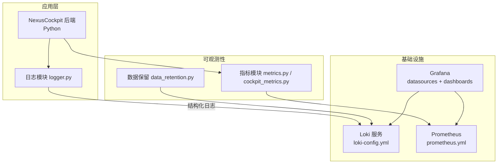
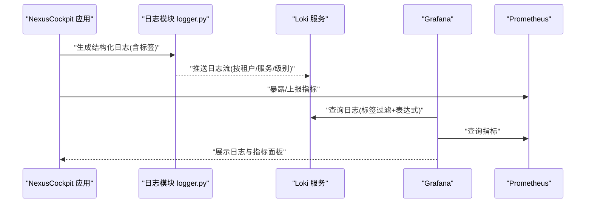
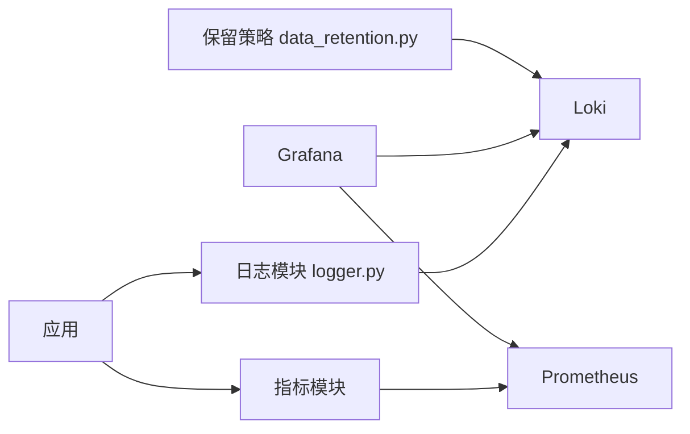

# Loki日志聚合

<cite>
**本文引用的文件**   
- [docker-compose.yml](file://docker-compose.yml)
- [loki-config.yml](file://config/loki/loki-config.yml)
- [prometheus.yml](file://config/prometheus/prometheus.yml)
- [dashboards.yml](file://config/grafana/provisioning/dashboards/dashboards.yml)
- [nexuscockpit-overview.json](file://config/grafana/provisioning/dashboards/nexuscockpit-overview.json)
- [logger.py](file://backend_design/nexus/core/logger.py)
- [observability/__init__.py](file://backend_design/nexus/observability/__init__.py)
- [cockpit_metrics.py](file://backend_design/nexus/observability/cockpit_metrics.py)
- [metrics.py](file://backend_design/nexus/observability/metrics.py)
- [data_retention.py](file://backend_design/nexus/observability/data_retention.py)
</cite>

## 目录
1. [简介](#简介)
2. [项目结构](#项目结构)
3. [核心组件](#核心组件)
4. [架构总览](#架构总览)
5. [详细组件分析](#详细组件分析)
6. [依赖关系分析](#依赖关系分析)
7. [性能考虑](#性能考虑)
8. [故障排查指南](#故障排查指南)
9. [结论](#结论)
10. [附录](#附录)

## 简介
本文件面向NexusCockpit系统的Loki日志聚合方案，覆盖以下方面：
- Loki配置文件结构与关键参数说明
- 索引策略与标签设计（租户隔离、服务维度、级别分类）
- 结构化日志格式定义与采集侧接入方式
- 日志查询语法、标签过滤方法与常用查询模式
- 与Grafana集成配置（数据源、仪表盘）
- 日志轮转策略与长期存储方案
- 性能优化建议与运维注意事项

## 项目结构
仓库中与Loki相关的配置与代码主要分布在以下位置：
- 容器编排与部署：docker-compose.yml
- Loki服务端配置：config/loki/loki-config.yml
- Prometheus配置（用于指标采集，非日志）：config/prometheus/prometheus.yml
- Grafana预置数据源与仪表盘：config/grafana/provisioning/datasources/*.yml、config/grafana/provisioning/dashboards/*.json
- 后端应用日志输出模块：backend_design/nexus/core/logger.py
- 可观测性相关模块（指标、保留策略等）：backend_design/nexus/observability/*

图表来源
- [docker-compose.yml](file://docker-compose.yml)
- [loki-config.yml](file://config/loki/loki-config.yml)
- [prometheus.yml](file://config/prometheus/prometheus.yml)
- [dashboards.yml](file://config/grafana/provisioning/dashboards/dashboards.yml)
- [nexuscockpit-overview.json](file://config/grafana/provisioning/dashboards/nexuscockpit-overview.json)
- [logger.py](file://backend_design/nexus/core/logger.py)
- [metrics.py](file://backend_design/nexus/observability/metrics.py)
- [cockpit_metrics.py](file://backend_design/nexus/observability/cockpit_metrics.py)
- [data_retention.py](file://backend_design/nexus/observability/data_retention.py)

章节来源
- [docker-compose.yml](file://docker-compose.yml)
- [loki-config.yml](file://config/loki/loki-config.yml)
- [prometheus.yml](file://config/prometheus/prometheus.yml)
- [dashboards.yml](file://config/grafana/provisioning/dashboards/dashboards.yml)
- [nexuscockpit-overview.json](file://config/grafana/provisioning/dashboards/nexuscockpit-overview.json)
- [logger.py](file://backend_design/nexus/core/logger.py)
- [observability/__init__.py](file://backend_design/nexus/observability/__init__.py)
- [cockpit_metrics.py](file://backend_design/nexus/observability/cockpit_metrics.py)
- [metrics.py](file://backend_design/nexus/observability/metrics.py)
- [data_retention.py](file://backend_design/nexus/observability/data_retention.py)

## 核心组件
- Loki服务端配置：负责流式索引、分片、存储后端、压缩、缓存、限流、多租户隔离等。
- 应用日志模块：统一输出结构化JSON日志，附带必要标签（如租户、服务、级别、实例）。
- Grafana集成：通过数据源指向Loki，提供日志浏览、仪表盘与告警联动。
- 指标与保留策略：Prometheus采集应用指标；结合Loki的Retention策略实现冷热分层与生命周期管理。

章节来源
- [loki-config.yml](file://config/loki/loki-config.yml)
- [logger.py](file://backend_design/nexus/core/logger.py)
- [prometheus.yml](file://config/prometheus/prometheus.yml)
- [dashboards.yml](file://config/grafana/provisioning/dashboards/dashboards.yml)
- [nexuscockpit-overview.json](file://config/grafana/provisioning/dashboards/nexuscockpit-overview.json)
- [data_retention.py](file://backend_design/nexus/observability/data_retention.py)

## 架构总览
下图展示了从应用日志到Loki再到Grafana的整体流程，以及指标与保留策略的协作关系。

图表来源
- [docker-compose.yml](file://docker-compose.yml)
- [loki-config.yml](file://config/loki/loki-config.yml)
- [prometheus.yml](file://config/prometheus/prometheus.yml)
- [dashboards.yml](file://config/grafana/provisioning/dashboards/dashboards.yml)
- [nexuscockpit-overview.json](file://config/grafana/provisioning/dashboards/nexuscockpit-overview.json)
- [logger.py](file://backend_design/nexus/core/logger.py)

## 详细组件分析

### Loki配置结构与关键参数
- 全局与分片：
  - 分片数量与大小影响写入吞吐与查询并行度。
  - 块大小与压缩策略影响存储体积与读取延迟。
- 存储后端：
  - 本地文件系统或对象存储（S3兼容），需配置持久卷挂载或桶访问凭证。
- 缓存与索引：
  - 前端缓存与索引缓存提升查询性能，需根据内存预算调整。
- 多租户与隔离：
  - 启用租户隔离后，请求头携带租户标识，Loki按租户路由与隔离读写。
- 限流与队列：
  - 控制单租户/全局写入速率，避免雪崩。
- 生命周期与保留：
  - 设置冷/热存储切换与过期清理策略，配合长期存储归档。

章节来源
- [loki-config.yml](file://config/loki/loki-config.yml)

### 结构化日志格式与标签设计
- 推荐字段（示例字段名，实际以项目约定为准）：
  - 时间戳、消息体、级别（info/warn/error/debug）、服务名、实例ID、租户ID、请求ID、模块/函数、耗时、错误码/堆栈摘要。
- 标签维度（用于快速过滤与聚合）：
  - 租户、服务、级别、环境、版本、主机/实例、区域/可用区。
- 输出规范：
  - JSON行式输出，避免换行符污染；大字段（如堆栈）采用摘要或外联链接。
- 采集侧接入：
  - 应用直接HTTP Push至Loki，或通过Filebeat/Bufio等Agent收集容器stdout。

章节来源
- [logger.py](file://backend_design/nexus/core/logger.py)

### 日志级别分类与语义
- 建议分级：
  - debug：调试信息，生产默认关闭或低采样。
  - info：业务主流程关键点。
  - warn：潜在异常但可恢复。
  - error：失败路径与异常堆栈摘要。
- 级别与告警联动：
  - 将error及以上级别作为高优告警输入，结合Grafana规则触发通知。

章节来源
- [logger.py](file://backend_design/nexus/core/logger.py)

### 租户隔离配置
- 客户端在请求头中携带租户标识，Loki据此进行路由与隔离。
- 建议为每个租户分配独立标签tenant_id，并在查询时强制带上该标签。
- 对跨租户聚合场景，使用只读代理或统一视图层进行权限控制。

章节来源
- [loki-config.yml](file://config/loki/loki-config.yml)

### 日志查询语法与标签过滤
- 基础语法要点：
  - 选择器：{标签="值"} 限定范围。
  - 文本匹配：~ 正则匹配，!~ 排除匹配。
  - 管道操作：| json 解析字段，| label_format 重命名，| logfmt 格式化。
  - 时间窗口：相对时间或绝对时间范围。
- 常用模式：
  - 按租户与服务定位：{tenant_id="T1", service="cockpit-api"}
  - 仅错误：{level="error"} | line_format "{{.message}}"
  - 提取关键字段：| json | table time, tenant_id, level, message
- 性能提示：
  - 优先用标签选择器缩小范围，再使用文本匹配。
  - 避免全表扫描与过宽时间窗。

章节来源
- [loki-config.yml](file://config/loki/loki-config.yml)

### 与Grafana集成配置
- 数据源：
  - 在Grafana中添加Loki数据源，指向Loki服务地址。
  - 若启用租户隔离，可在数据源或查询时注入租户头。
- 仪表盘：
  - 预置仪表盘JSON导入，包含日志概览、错误趋势、慢请求TopN等。
- 变量与模板：
  - 使用$tenant、$service、$level等变量驱动动态过滤。

章节来源
- [prometheus.yml](file://config/prometheus/prometheus.yml)
- [dashboards.yml](file://config/grafana/provisioning/dashboards/dashboards.yml)
- [nexuscockpit-overview.json](file://config/grafana/provisioning/dashboards/nexuscockpit-overview.json)

### 日志轮转策略与长期存储
- 短期轮转：
  - 基于块大小与时间窗口切分，减少热点与提升查询效率。
- 长期归档：
  - 将冷数据迁移至对象存储（S3兼容），并设置过期清理策略。
- 保留策略：
  - 热数据保留较短周期，冷数据保留较长周期，结合成本与合规要求。
- 监控与审计：
  - 记录删除任务执行结果与空间回收情况，定期评估保留策略有效性。

章节来源
- [data_retention.py](file://backend_design/nexus/observability/data_retention.py)
- [loki-config.yml](file://config/loki/loki-config.yml)

### 性能优化技巧
- 写入侧：
  - 合理批量大小与并发，开启压缩，避免频繁小写。
  - 限制标签基数与数量，避免高基数字段导致索引膨胀。
- 查询侧：
  - 优先标签选择器，减少正则匹配范围。
  - 使用分页与时间窗口限制，避免长尾查询。
- 资源规划：
  - 根据QPS与峰值估算CPU/内存/磁盘IO，预留缓冲。
  - 分片数与副本数平衡一致性与可用性。

章节来源
- [loki-config.yml](file://config/loki/loki-config.yml)

## 依赖关系分析
- 应用与日志模块：应用调用日志模块输出结构化日志。
- 日志模块与Loki：日志通过HTTP接口推送到Loki。
- Grafana与Loki/Prometheus：Grafana同时消费日志与指标，形成统一可观测视图。
- 保留策略与Loki：后台任务协调Loki的数据生命周期。

图表来源
- [logger.py](file://backend_design/nexus/core/logger.py)
- [metrics.py](file://backend_design/nexus/observability/metrics.py)
- [cockpit_metrics.py](file://backend_design/nexus/observability/cockpit_metrics.py)
- [data_retention.py](file://backend_design/nexus/observability/data_retention.py)
- [prometheus.yml](file://config/prometheus/prometheus.yml)
- [loki-config.yml](file://config/loki/loki-config.yml)

章节来源
- [logger.py](file://backend_design/nexus/core/logger.py)
- [metrics.py](file://backend_design/nexus/observability/metrics.py)
- [cockpit_metrics.py](file://backend_design/nexus/observability/cockpit_metrics.py)
- [data_retention.py](file://backend_design/nexus/observability/data_retention.py)
- [prometheus.yml](file://config/prometheus/prometheus.yml)
- [loki-config.yml](file://config/loki/loki-config.yml)

## 性能考虑
- 容量规划：
  - 预估日增日志量、平均行大小、标签基数，计算磁盘与索引占用。
- 写入吞吐：
  - 调整批大小、并发度、压缩算法，平衡CPU与网络开销。
- 查询延迟：
  - 预热热点索引，限制最大返回行数，使用物化视图或中间表（如有）。
- 成本优化：
  - 冷热分层、压缩、去重、降采样（针对历史统计）。

[本节为通用指导，不直接分析具体文件]

## 故障排查指南
- 常见问题：
  - 无法连接Loki：检查网络连通性、端口与TLS配置。
  - 租户未隔离：确认请求头是否携带租户标识，Loki是否启用租户模式。
  - 查询缓慢：检查标签基数过大、正则匹配范围过宽、时间窗过大。
  - 磁盘增长过快：检查块大小、保留策略、重复写入。
- 定位方法：
  - 在Grafana中使用最小化选择器逐步缩小范围。
  - 查看Loki节点健康与指标，关注GC、缓存命中率、队列积压。
  - 校验应用日志格式是否符合预期，避免非法字符。

章节来源
- [loki-config.yml](file://config/loki/loki-config.yml)
- [logger.py](file://backend_design/nexus/core/logger.py)

## 结论
通过统一的Loki配置、规范的日志结构与合理的标签设计，NexusCockpit可实现高效、可扩展的日志聚合与检索。结合Grafana可视化与保留策略，既能满足日常排障与运营需求，也能兼顾长期存储与成本控制。建议在上线前完成容量与压测验证，持续监控关键指标并迭代优化。

[本节为总结性内容，不直接分析具体文件]

## 附录
- 部署参考：
  - docker-compose.yml中已包含Loki、Grafana、Prometheus等服务编排，便于本地与测试环境快速启动。
- 仪表盘与数据源：
  - 通过provisioning自动注册数据源与仪表盘，开箱即用。

章节来源
- [docker-compose.yml](file://docker-compose.yml)
- [prometheus.yml](file://config/prometheus/prometheus.yml)
- [dashboards.yml](file://config/grafana/provisioning/dashboards/dashboards.yml)
- [nexuscockpit-overview.json](file://config/grafana/provisioning/dashboards/nexuscockpit-overview.json)