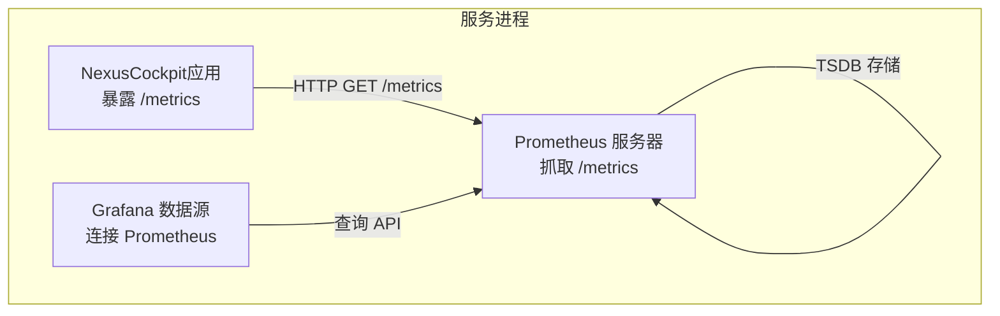
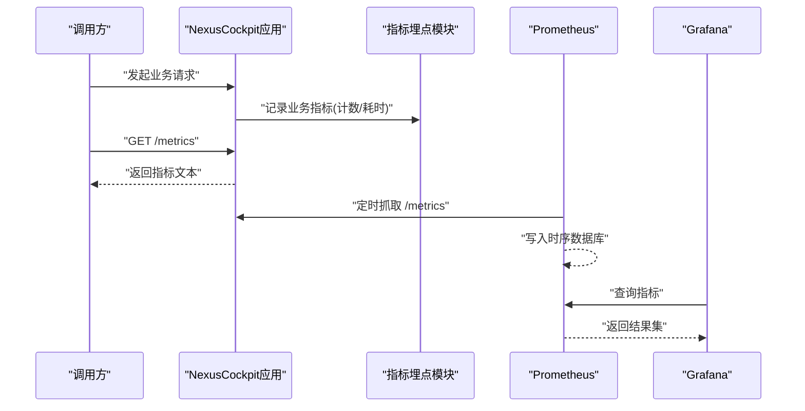
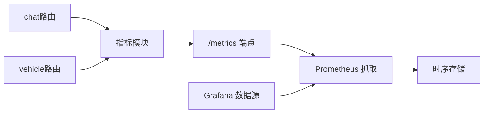

# Prometheus指标收集

<cite>
**本文引用的文件**   
- [backend_design/nexus/observability/metrics.py](file://backend_design/nexus/observability/metrics.py)
- [backend_design/nexus/observability/cockpit_metrics.py](file://backend_design/nexus/observability/cockpit_metrics.py)
- [config/prometheus/prometheus.yml](file://config/prometheus/prometheus.yml)
- [config/grafana/provisioning/datasources/prometheus.yml](file://config/grafana/provisioning/datasources/prometheus.yml)
- [backend_design/nexus/api/routes/chat.py](file://backend_design/nexus/api/routes/chat.py)
- [backend_design/nexus/api/routes/vehicle.py](file://backend_design/nexus/api/routes/vehicle.py)
- [backend_design/nexus/core/logger.py](file://backend_design/nexus/core/logger.py)
- [backend_design/nexus/config.py](file://backend_design/nexus/config.py)
- [backend_design/nexus/main.py](file://backend_design/nexus/main.py)
- [docker-compose.yml](file://docker-compose.yml)
</cite>

## 目录
1. [简介](#简介)
2. [项目结构](#项目结构)
3. [核心组件](#核心组件)
4. [架构总览](#架构总览)
5. [详细组件分析](#详细组件分析)
6. [依赖关系分析](#依赖关系分析)
7. [性能考虑](#性能考虑)
8. [故障排查指南](#故障排查指南)
9. [结论](#结论)
10. [附录](#附录)

## 简介
本文件面向NexusCockpit系统的Prometheus指标采集与配置，覆盖以下目标：
- Prometheus配置文件结构与抓取目标发现机制
- 指标抓取间隔、持久化与存储优化建议
- 自定义业务指标的采集与定义（Agent性能、车辆控制操作统计、对话质量）
- 指标命名规范、标签策略与查询示例
- 性能调优方法与常见问题定位

## 项目结构
本项目在Python后端中通过Prometheus客户端库暴露标准HTTP /metrics端点，并在配置目录提供Prometheus抓取配置。Grafana数据源指向同一Prometheus实例以支持可视化。

图表来源
- [config/prometheus/prometheus.yml](file://config/prometheus/prometheus.yml)
- [config/grafana/provisioning/datasources/prometheus.yml](file://config/grafana/provisioning/datasources/prometheus.yml)
- [backend_design/nexus/observability/metrics.py](file://backend_design/nexus/observability/metrics.py)
- [backend_design/nexus/observability/cockpit_metrics.py](file://backend_design/nexus/observability/cockpit_metrics.py)

章节来源
- [config/prometheus/prometheus.yml](file://config/prometheus/prometheus.yml)
- [config/grafana/provisioning/datasources/prometheus.yml](file://config/grafana/provisioning/datasources/prometheus.yml)
- [backend_design/nexus/observability/metrics.py](file://backend_design/nexus/observability/metrics.py)
- [backend_design/nexus/observability/cockpit_metrics.py](file://backend_design/nexus/observability/cockpit_metrics.py)

## 核心组件
- 指标注册与导出模块：负责定义计数器、直方图、摘要等指标类型，并统一暴露到HTTP /metrics端点。
- 业务指标封装：围绕对话流程、Agent执行路径、车辆控制动作等关键路径埋点。
- Prometheus抓取配置：定义全局抓取间隔、目标发现、持久化参数等。
- Grafana数据源：将Prometheus作为默认数据源以便仪表盘展示。

章节来源
- [backend_design/nexus/observability/metrics.py](file://backend_design/nexus/observability/metrics.py)
- [backend_design/nexus/observability/cockpit_metrics.py](file://backend_design/nexus/observability/cockpit_metrics.py)
- [config/prometheus/prometheus.yml](file://config/prometheus/prometheus.yml)
- [config/grafana/provisioning/datasources/prometheus.yml](file://config/grafana/provisioning/datasources/prometheus.yml)

## 架构总览
下图展示了从请求进入应用到指标被Prometheus抓取再到Grafana可视化的端到端链路。

图表来源
- [backend_design/nexus/observability/metrics.py](file://backend_design/nexus/observability/metrics.py)
- [backend_design/nexus/observability/cockpit_metrics.py](file://backend_design/nexus/observability/cockpit_metrics.py)
- [config/prometheus/prometheus.yml](file://config/prometheus/prometheus.yml)
- [config/grafana/provisioning/datasources/prometheus.yml](file://config/grafana/provisioning/datasources/prometheus.yml)

## 详细组件分析

### Prometheus抓取配置
- 抓取目标与端口：在Prometheus配置中声明本地或容器网络中的NexusCockpit服务地址与端口，确保Prometheus可访问应用的/metrics端点。
- 抓取间隔：通过全局或job级别设置抓取周期，结合系统规模与指标基数调整。
- 持久化与保留：合理设置TSDB保留时间与压缩策略，平衡存储成本与回溯需求。
- 服务发现：若使用容器编排，可通过静态targets或集成服务发现插件动态发现新实例。

章节来源
- [config/prometheus/prometheus.yml](file://config/prometheus/prometheus.yml)
- [docker-compose.yml](file://docker-compose.yml)

### 指标注册与导出
- 指标类型选择：
  - 计数器：用于累计事件次数，如对话创建、工具调用成功/失败、车辆指令下发次数等。
  - 直方图/摘要：用于延迟分布与时延分位统计，如ASR/TTS处理耗时、LLM推理耗时、端到端响应时间。
  - 状态指标：用于瞬时状态，如当前活跃会话数、队列长度、缓存命中率等。
- 标签设计：
  - 维度控制：仅对高基数的分类字段打标签（如模型名、技能名、意图类别），避免高基数字符串（用户ID、会话ID）作为标签。
  - 统一前缀：所有业务指标使用统一前缀，便于过滤与权限管理。
- 导出端点：
  - 应用启动时注册指标，框架自动暴露/metrics供Prometheus抓取。

章节来源
- [backend_design/nexus/observability/metrics.py](file://backend_design/nexus/observability/metrics.py)
- [backend_design/nexus/observability/cockpit_metrics.py](file://backend_design/nexus/observability/cockpit_metrics.py)

### 业务指标埋点位置
- 对话质量指标：
  - 在对话路由层记录请求开始/结束、耗时、错误码、意图识别结果等。
  - 在ASR/TTS/LLM调用处记录各阶段耗时与失败率。
- Agent性能指标：
  - 在子Agent调度与执行路径上记录调用次数、成功率、平均耗时、超时与重试次数。
- 车辆控制操作统计：
  - 在车辆API路由层记录控制指令下发、确认回执、失败原因分类等。

章节来源
- [backend_design/nexus/api/routes/chat.py](file://backend_design/nexus/api/routes/chat.py)
- [backend_design/nexus/api/routes/vehicle.py](file://backend_design/nexus/api/routes/vehicle.py)
- [backend_design/nexus/observability/cockpit_metrics.py](file://backend_design/nexus/observability/cockpit_metrics.py)

### 指标命名规范与标签策略
- 命名规范：
  - 采用小写下划线分隔，语义清晰，包含领域与对象信息，例如：nexus_cockpit_chat_request_total、nexus_cockpit_asr_latency_seconds_bucket。
  - 单位后缀：秒用_seconds，字节用_bytes，比率无单位。
- 标签策略：
  - 固定低基数标签：服务名、环境、版本、区域。
  - 业务分类标签：意图类别、技能名称、模型名称、工具名称。
  - 避免高基数标签：用户标识、会话标识、自由文本。
- 一致性：
  - 所有埋点通过统一的指标注册入口进行，避免重复定义与命名冲突。

章节来源
- [backend_design/nexus/observability/metrics.py](file://backend_design/nexus/observability/metrics.py)
- [backend_design/nexus/observability/cockpit_metrics.py](file://backend_design/nexus/observability/cockpit_metrics.py)

### 指标查询示例
以下为常用查询思路（请根据实际指标名替换）：
- 对话请求总量与错误率
  - 总量：按时间聚合求和
  - 错误率：错误计数除以总请求数
- ASR/TTS/LLM延迟分布
  - 使用分位函数计算P50/P90/P99
- 车辆控制成功率
  - 成功计数除以总下发计数
- Agent调用热点
  - 按技能/工具分组统计调用量与失败率

章节来源
- [backend_design/nexus/observability/cockpit_metrics.py](file://backend_design/nexus/observability/cockpit_metrics.py)

### 存储优化建议
- 保留策略：根据合规与运维需求设置合理的TSDB保留期；对历史归档数据采用冷存储方案。
- 采样与降采样：对非关键指标降低抓取频率；在查询侧使用降采样函数减少负载。
- 标签基数治理：定期审计高基数标签，必要时改为外部关联查询或日志记录。
- 指标裁剪：关闭不需要的内置指标，仅保留必要业务指标以降低存储压力。

章节来源
- [config/prometheus/prometheus.yml](file://config/prometheus/prometheus.yml)

## 依赖关系分析
- 应用与指标模块：业务路由与核心逻辑通过指标模块记录事件与耗时。
- 应用与Prometheus：Prometheus通过HTTP抓取/metrics端点。
- Grafana与Prometheus：Grafana通过数据源配置连接Prometheus进行查询与展示。

图表来源
- [backend_design/nexus/api/routes/chat.py](file://backend_design/nexus/api/routes/chat.py)
- [backend_design/nexus/api/routes/vehicle.py](file://backend_design/nexus/api/routes/vehicle.py)
- [backend_design/nexus/observability/metrics.py](file://backend_design/nexus/observability/metrics.py)
- [config/prometheus/prometheus.yml](file://config/prometheus/prometheus.yml)
- [config/grafana/provisioning/datasources/prometheus.yml](file://config/grafana/provisioning/datasources/prometheus.yml)

章节来源
- [backend_design/nexus/api/routes/chat.py](file://backend_design/nexus/api/routes/chat.py)
- [backend_design/nexus/api/routes/vehicle.py](file://backend_design/nexus/api/routes/vehicle.py)
- [backend_design/nexus/observability/metrics.py](file://backend_design/nexus/observability/metrics.py)
- [config/prometheus/prometheus.yml](file://config/prometheus/prometheus.yml)
- [config/grafana/provisioning/datasources/prometheus.yml](file://config/grafana/provisioning/datasources/prometheus.yml)

## 性能考虑
- 抓取间隔与批量化：
  - 合理设置全局抓取间隔，避免过短导致Prometheus压力过大。
  - 批量上报与合并计数，减少指标更新频率。
- 标签基数控制：
  - 严格限制标签数量与基数，避免高基数导致的内存与查询开销。
- 直方图桶配置：
  - 针对延迟指标选择合适的桶范围，兼顾精度与存储。
- 资源隔离：
  - 为Prometheus与NexusCockpit分配独立资源，避免相互影响。
- 监控自身健康：
  - 关注Prometheus的抓取延迟、样本写入速率、TSDB大小增长趋势。

[本节为通用指导，无需源码引用]

## 故障排查指南
- 无法抓取/metrics
  - 检查Prometheus配置的目标地址与端口是否正确
  - 确认应用已启动且对外暴露/metrics
  - 验证网络连通性与防火墙规则
- 指标缺失或异常
  - 核对埋点是否位于正确路径（路由入口、关键分支）
  - 检查标签值是否出现未预期的空值或高基数
  - 查看应用日志与错误码映射是否一致
- 存储膨胀
  - 审查标签基数与保留策略
  - 评估是否需要降采样或裁剪指标
- 查询缓慢
  - 优化查询表达式，避免全表扫描
  - 增加索引与预聚合视图（在Grafana侧）

章节来源
- [config/prometheus/prometheus.yml](file://config/prometheus/prometheus.yml)
- [backend_design/nexus/core/logger.py](file://backend_design/nexus/core/logger.py)

## 结论
通过规范的指标定义、严格的标签治理与合理的Prometheus配置，NexusCockpit可实现稳定的可观测性体系。建议在上线前完成指标评审与压测，持续监控存储与查询性能，逐步完善告警与仪表盘。

[本节为总结性内容，无需源码引用]

## 附录

### 指标清单与埋点位置参考
- 对话质量
  - 请求总量、错误率、端到端耗时、意图识别耗时、LLM推理耗时
  - 埋点位置：对话路由与中间件
- Agent性能
  - 子Agent调用次数、成功率、平均耗时、超时与重试
  - 埋点位置：Agent调度与执行路径
- 车辆控制
  - 指令下发次数、成功/失败计数、失败原因分类
  - 埋点位置：车辆API路由

章节来源
- [backend_design/nexus/api/routes/chat.py](file://backend_design/nexus/api/routes/chat.py)
- [backend_design/nexus/api/routes/vehicle.py](file://backend_design/nexus/api/routes/vehicle.py)
- [backend_design/nexus/observability/cockpit_metrics.py](file://backend_design/nexus/observability/cockpit_metrics.py)

### 配置要点速查
- Prometheus抓取间隔：在全局或job级别设置
- 持久化保留期：依据合规与容量规划设定
- 服务发现：静态targets或容器编排集成
- Grafana数据源：指向Prometheus地址与认证信息

章节来源
- [config/prometheus/prometheus.yml](file://config/prometheus/prometheus.yml)
- [config/grafana/provisioning/datasources/prometheus.yml](file://config/grafana/provisioning/datasources/prometheus.yml)
- [docker-compose.yml](file://docker-compose.yml)