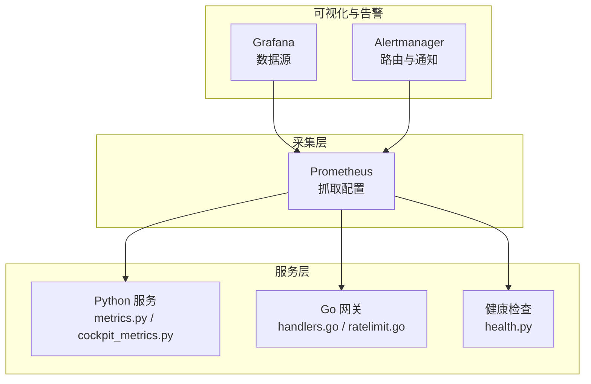
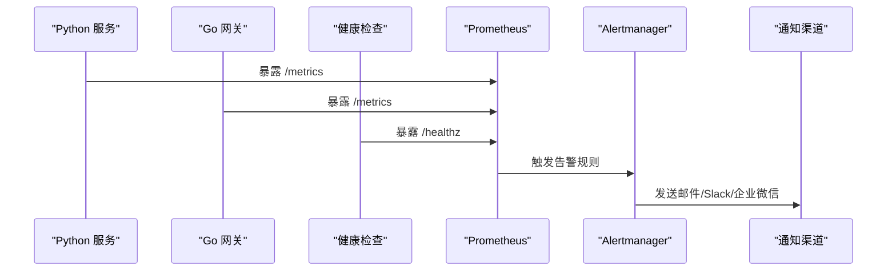
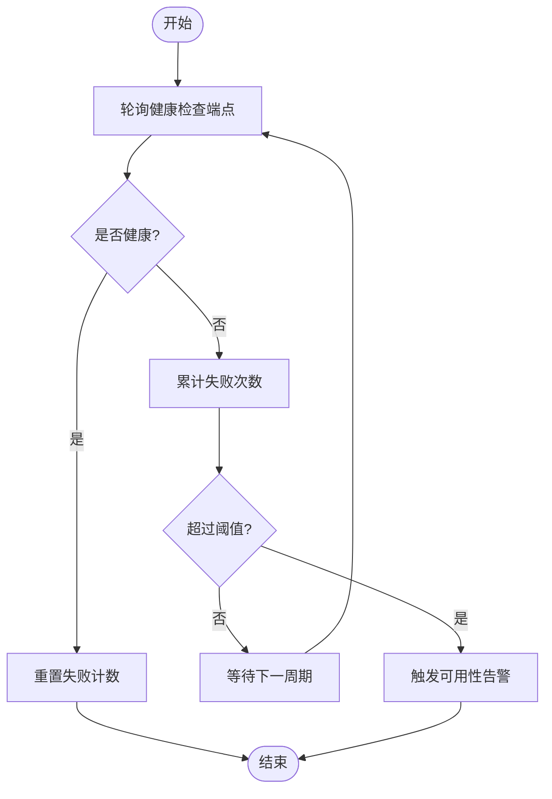
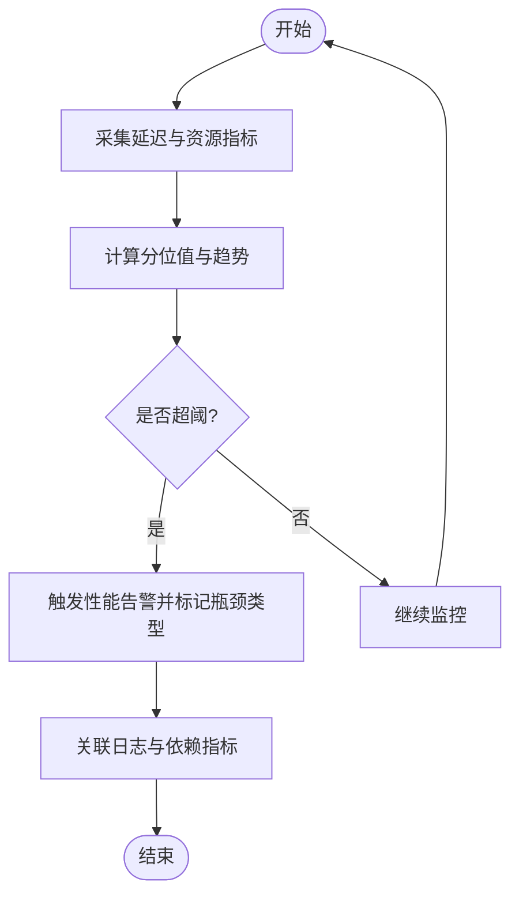
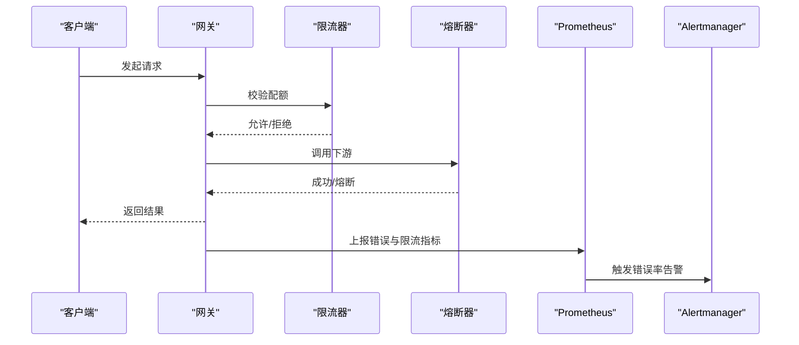
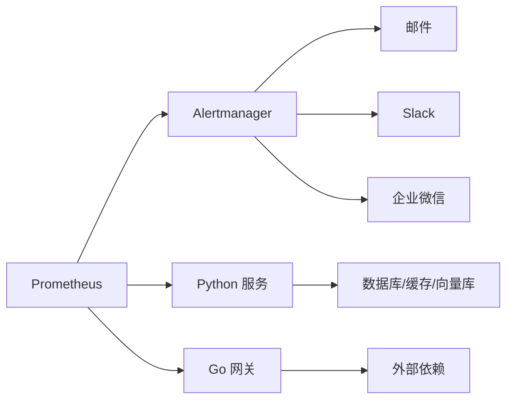

# 告警规则配置

<cite>
**本文引用的文件**   
- [config/prometheus/prometheus.yml](file://config/prometheus/prometheus.yml)
- [config/grafana/provisioning/datasources/prometheus.yml](file://config/grafana/provisioning/datasources/prometheus.yml)
- [backend_design/nexus/observability/metrics.py](file://backend_design/nexus/observability/metrics.py)
- [backend_design/nexus/observability/cockpit_metrics.py](file://backend_design/nexus/observability/cockpit_metrics.py)
- [backend_design/nexus/core/logger.py](file://backend_design/nexus/core/logger.py)
- [backend_design/nexus/api/routes/health.py](file://backend_design/nexus/api/routes/health.py)
- [backend_design/nexus/middleware/rate_limiter.py](file://backend_design/nexus/middleware/rate_limiter.py)
- [backend_design/nexus/middleware/redis_cache.py](file://backend_design/nexus/middleware/redis_cache.py)
- [backend_design/nexus/core/circuit_breaker.py](file://backend_design/nexus/core/circuit_breaker.py)
- [backend_design/nexus_gate/internal/handlers/handlers.go](file://backend_design/nexus_gate/internal/handlers/handlers.go)
- [backend_design/nexus_gate/internal/ratelimit/ratelimit.go](file://backend_design/nexus_gate/internal/ratelimit/ratelimit.go)
- [backend_design/scripts/test_metrics.py](file://backend_design/scripts/test_metrics.py)
</cite>

## 目录
1. [简介](#简介)
2. [项目结构](#项目结构)
3. [核心组件](#核心组件)
4. [架构总览](#架构总览)
5. [详细组件分析](#详细组件分析)
6. [依赖关系分析](#依赖关系分析)
7. [性能考虑](#性能考虑)
8. [故障排查指南](#故障排查指南)
9. [结论](#结论)
10. [附录](#附录)

## 简介
本文件为 NexusCockpit 系统的 Prometheus 告警规则配置与落地实践指南，覆盖以下方面：
- Prometheus 告警规则语法要点、阈值设置策略与告警级别定义
- 关键业务告警场景：系统可用性、性能瓶颈、错误率异常
- 通知渠道配置（邮件、Slack、企业微信）
- 告警升级策略与静默规则
- 告警测试方法与故障响应流程

目标读者包括运维工程师、SRE、后端开发与平台负责人。

## 项目结构
NexusCockpit 的监控与可观测性相关配置与代码主要分布在如下位置：
- Prometheus 抓取配置：config/prometheus/prometheus.yml
- Grafana 数据源配置：config/grafana/provisioning/datasources/prometheus.yml
- Python 服务指标暴露：backend_design/nexus/observability/metrics.py、cockpit_metrics.py
- 网关侧指标与限流：backend_design/nexus_gate/internal/handlers/handlers.go、ratelimit.go
- 健康检查接口：backend_design/nexus/api/routes/health.py
- 中间件与基础能力：rate_limiter.py、redis_cache.py、circuit_breaker.py、logger.py
- 指标测试脚本：backend_design/scripts/test_metrics.py

图表来源
- [config/prometheus/prometheus.yml](file://config/prometheus/prometheus.yml)
- [config/grafana/provisioning/datasources/prometheus.yml](file://config/grafana/provisioning/datasources/prometheus.yml)
- [backend_design/nexus/observability/metrics.py](file://backend_design/nexus/observability/metrics.py)
- [backend_design/nexus/observability/cockpit_metrics.py](file://backend_design/nexus/observability/cockpit_metrics.py)
- [backend_design/nexus_gate/internal/handlers/handlers.go](file://backend_design/nexus_gate/internal/handlers/handlers.go)
- [backend_design/nexus_gate/internal/ratelimit/ratelimit.go](file://backend_design/nexus_gate/internal/ratelimit/ratelimit.go)
- [backend_design/nexus/api/routes/health.py](file://backend_design/nexus/api/routes/health.py)

章节来源
- [config/prometheus/prometheus.yml](file://config/prometheus/prometheus.yml)
- [config/grafana/provisioning/datasources/prometheus.yml](file://config/grafana/provisioning/datasources/prometheus.yml)
- [backend_design/nexus/observability/metrics.py](file://backend_design/nexus/observability/metrics.py)
- [backend_design/nexus/observability/cockpit_metrics.py](file://backend_design/nexus/observability/cockpit_metrics.py)
- [backend_design/nexus_gate/internal/handlers/handlers.go](file://backend_design/nexus_gate/internal/handlers/handlers.go)
- [backend_design/nexus_gate/internal/ratelimit/ratelimit.go](file://backend_design/nexus_gate/internal/ratelimit/ratelimit.go)
- [backend_design/nexus/api/routes/health.py](file://backend_design/nexus/api/routes/health.py)

## 核心组件
- Prometheus 抓取配置：定义服务端点、标签、抓取间隔等，确保指标稳定上报。
- Python 服务指标：基于标准库或第三方库暴露 HTTP 指标端点，包含应用级与业务级指标。
- Go 网关指标：暴露请求量、延迟、错误数、限流计数等。
- 健康检查：提供存活与就绪探针，支撑可用性告警。
- 中间件与基础能力：限流、缓存、熔断器状态等可作为告警触发条件。
- 日志：结构化日志便于关联告警事件与根因定位。

章节来源
- [backend_design/nexus/observability/metrics.py](file://backend_design/nexus/observability/metrics.py)
- [backend_design/nexus/observability/cockpit_metrics.py](file://backend_design/nexus/observability/cockpit_metrics.py)
- [backend_design/nexus_gate/internal/handlers/handlers.go](file://backend_design/nexus_gate/internal/handlers/handlers.go)
- [backend_design/nexus_gate/internal/ratelimit/ratelimit.go](file://backend_design/nexus_gate/internal/ratelimit/ratelimit.go)
- [backend_design/nexus/api/routes/health.py](file://backend_design/nexus/api/routes/health.py)
- [backend_design/nexus/core/logger.py](file://backend_design/nexus/core/logger.py)

## 架构总览
下图展示从指标采集到告警触达的整体链路，以及各组件职责与交互。

图表来源
- [config/prometheus/prometheus.yml](file://config/prometheus/prometheus.yml)
- [config/grafana/provisioning/datasources/prometheus.yml](file://config/grafana/provisioning/datasources/prometheus.yml)
- [backend_design/nexus/observability/metrics.py](file://backend_design/nexus/observability/metrics.py)
- [backend_design/nexus/observability/cockpit_metrics.py](file://backend_design/nexus/observability/cockpit_metrics.py)
- [backend_design/nexus_gate/internal/handlers/handlers.go](file://backend_design/nexus_gate/internal/handlers/handlers.go)
- [backend_design/nexus/api/routes/health.py](file://backend_design/nexus/api/routes/health.py)

## 详细组件分析

### 告警规则语法与阈值策略
- 规则语法要点
  - 使用 PromQL 表达式进行条件判断，结合 by/without 分组聚合
  - 支持记录规则预计算复杂指标，降低查询开销
  - 通过 labels 标注环境、服务、实例等维度，便于路由与降噪
- 阈值设置策略
  - 可用性：基于存活探针与错误率窗口（如 5m/15m）组合判定
  - 性能：P95/P99 延迟超过基线或固定阈值持续一段时间
  - 错误率：HTTP 5xx 比例或绝对错误数在时间窗口内超阈
  - 资源：CPU、内存、磁盘、连接池使用率接近上限并持续增长
- 告警级别定义
  - P0 致命：核心服务不可用或大面积错误，需立即响应
  - P1 严重：关键功能降级或性能显著劣化，快速处理
  - P2 一般：非关键问题或潜在风险，计划内修复
  - P3 提示：信息类告警，用于观察与优化

章节来源
- [config/prometheus/prometheus.yml](file://config/prometheus/prometheus.yml)
- [backend_design/nexus/observability/metrics.py](file://backend_design/nexus/observability/metrics.py)
- [backend_design/nexus/observability/cockpit_metrics.py](file://backend_design/nexus/observability/cockpit_metrics.py)
- [backend_design/nexus/api/routes/health.py](file://backend_design/nexus/api/routes/health.py)

### 关键业务告警场景

#### 系统可用性告警
- 触发条件
  - 健康检查失败（存活/就绪探针）
  - 服务实例长时间无指标上报
  - 核心接口错误率突增导致整体不可用
- 建议阈值
  - 连续 2-3 次健康检查失败或 5 分钟内错误率 > 5%
- 影响范围
  - 用户无法访问、下游任务中断、联动服务雪崩

图表来源
- [backend_design/nexus/api/routes/health.py](file://backend_design/nexus/api/routes/health.py)
- [config/prometheus/prometheus.yml](file://config/prometheus/prometheus.yml)

章节来源
- [backend_design/nexus/api/routes/health.py](file://backend_design/nexus/api/routes/health.py)
- [config/prometheus/prometheus.yml](file://config/prometheus/prometheus.yml)

#### 性能瓶颈告警
- 触发条件
  - 请求延迟 P95/P99 超过阈值
  - 队列积压、线程池饱和、连接池耗尽
  - 外部依赖（数据库、向量库、LLM）慢调用增多
- 建议阈值
  - P95 > 基线 + 20%，且持续 10 分钟
  - 连接池使用率 > 85% 且增长趋势明显
- 影响范围
  - 用户体验下降、吞吐受限、上游超时

图表来源
- [backend_design/nexus/observability/metrics.py](file://backend_design/nexus/observability/metrics.py)
- [backend_design/nexus/observability/cockpit_metrics.py](file://backend_design/nexus/observability/cockpit_metrics.py)
- [backend_design/nexus/middleware/rate_limiter.py](file://backend_design/nexus/middleware/rate_limiter.py)
- [backend_design/nexus/middleware/redis_cache.py](file://backend_design/nexus/middleware/redis_cache.py)
- [backend_design/nexus/core/circuit_breaker.py](file://backend_design/nexus/core/circuit_breaker.py)

章节来源
- [backend_design/nexus/observability/metrics.py](file://backend_design/nexus/observability/metrics.py)
- [backend_design/nexus/observability/cockpit_metrics.py](file://backend_design/nexus/observability/cockpit_metrics.py)
- [backend_design/nexus/middleware/rate_limiter.py](file://backend_design/nexus/middleware/rate_limiter.py)
- [backend_design/nexus/middleware/redis_cache.py](file://backend_design/nexus/middleware/redis_cache.py)
- [backend_design/nexus/core/circuit_breaker.py](file://backend_design/nexus/core/circuit_breaker.py)

#### 错误率异常告警
- 触发条件
  - HTTP 5xx 比例上升或绝对错误数突增
  - 网关限流触发频繁、熔断器打开
  - 下游依赖错误码集中出现
- 建议阈值
  - 5 分钟内 5xx 比例 > 2% 或错误数 > N
  - 限流计数环比增长 > 50%
- 影响范围
  - 业务失败、重试风暴、级联故障

图表来源
- [backend_design/nexus_gate/internal/handlers/handlers.go](file://backend_design/nexus_gate/internal/handlers/handlers.go)
- [backend_design/nexus_gate/internal/ratelimit/ratelimit.go](file://backend_design/nexus_gate/internal/ratelimit/ratelimit.go)
- [backend_design/nexus/core/circuit_breaker.py](file://backend_design/nexus/core/circuit_breaker.py)
- [config/prometheus/prometheus.yml](file://config/prometheus/prometheus.yml)

章节来源
- [backend_design/nexus_gate/internal/handlers/handlers.go](file://backend_design/nexus_gate/internal/handlers/handlers.go)
- [backend_design/nexus_gate/internal/ratelimit/ratelimit.go](file://backend_design/nexus_gate/internal/ratelimit/ratelimit.go)
- [backend_design/nexus/core/circuit_breaker.py](file://backend_design/nexus/core/circuit_breaker.py)
- [config/prometheus/prometheus.yml](file://config/prometheus/prometheus.yml)

### 通知渠道配置
- 邮件
  - 配置 SMTP 服务器、发件人、收件人列表
  - 按告警级别选择不同收件人或群组
- Slack
  - 配置 Incoming Webhook URL
  - 指定频道与消息模板（含告警摘要、链接、标签）
- 企业微信
  - 配置机器人 Webhook 或 API Key
  - 按群或@个人发送，支持富文本与卡片消息

注意：具体参数与字段以 Alertmanager 配置文件为准，确保网络可达与凭据安全。

章节来源
- [config/prometheus/prometheus.yml](file://config/prometheus/prometheus.yml)

### 告警升级策略
- 分级升级
  - P0：立即电话/IM 通知值班人员，同时抄送技术负责人
  - P1：IM 通知并在 15 分钟内未确认则升级至 P0
  - P2：IM 通知并纳入工单跟踪
  - P3：仅记录与看板展示
- 自动升级
  - 基于持续时间与重复触发次数自动提升级别
  - 结合标签（环境、服务、区域）决定升级路径

章节来源
- [config/prometheus/prometheus.yml](file://config/prometheus/prometheus.yml)

### 静默规则
- 维护窗口
  - 对特定服务或实例设置时间段内的静默
- 已知问题
  - 针对已知的临时性问题设置短期静默
- 抑制规则
  - 当上游服务不可用时，抑制其下游衍生告警，避免告警风暴

章节来源
- [config/prometheus/prometheus.yml](file://config/prometheus/prometheus.yml)

### 告警测试方法
- 指标验证
  - 使用测试脚本模拟请求与错误，验证指标上报与阈值命中
- 规则验证
  - 在测试环境执行规则加载与触发演练，确认通知到达
- 端到端演练
  - 注入故障（断网、依赖超时），观察告警链路与升级策略

章节来源
- [backend_design/scripts/test_metrics.py](file://backend_design/scripts/test_metrics.py)
- [config/prometheus/prometheus.yml](file://config/prometheus/prometheus.yml)

### 故障响应流程
- 发现与确认
  - 收到告警后，查看仪表盘与日志，确认影响范围
- 初步处置
  - 重启实例、扩容、回滚版本、切换流量
- 根因分析与修复
  - 关联日志与指标，定位瓶颈或错误点，制定修复方案
- 复盘与改进
  - 更新阈值与规则，完善预案与自动化处置

章节来源
- [backend_design/nexus/core/logger.py](file://backend_design/nexus/core/logger.py)
- [config/grafana/provisioning/datasources/prometheus.yml](file://config/grafana/provisioning/datasources/prometheus.yml)

## 依赖关系分析
- 组件耦合
  - Prometheus 依赖服务暴露的 /metrics 端点
  - Alertmanager 依赖 Prometheus 的规则与路由配置
  - 通知渠道依赖外部服务连通性与凭据
- 外部依赖
  - 邮件、Slack、企业微信等通知通道
  - 数据库、向量库、LLM 等下游依赖的状态与性能

图表来源
- [config/prometheus/prometheus.yml](file://config/prometheus/prometheus.yml)
- [config/grafana/provisioning/datasources/prometheus.yml](file://config/grafana/provisioning/datasources/prometheus.yml)
- [backend_design/nexus/observability/metrics.py](file://backend_design/nexus/observability/metrics.py)
- [backend_design/nexus/observability/cockpit_metrics.py](file://backend_design/nexus/observability/cockpit_metrics.py)
- [backend_design/nexus_gate/internal/handlers/handlers.go](file://backend_design/nexus_gate/internal/handlers/handlers.go)

章节来源
- [config/prometheus/prometheus.yml](file://config/prometheus/prometheus.yml)
- [config/grafana/provisioning/datasources/prometheus.yml](file://config/grafana/provisioning/datasources/prometheus.yml)
- [backend_design/nexus/observability/metrics.py](file://backend_design/nexus/observability/metrics.py)
- [backend_design/nexus/observability/cockpit_metrics.py](file://backend_design/nexus/observability/cockpit_metrics.py)
- [backend_design/nexus_gate/internal/handlers/handlers.go](file://backend_design/nexus_gate/internal/handlers/handlers.go)

## 性能考虑
- 合理设置抓取间隔与保留期，避免存储压力过大
- 使用记录规则预计算热点指标，减少实时查询开销
- 控制告警数量与频率，避免通知疲劳
- 对高基数标签进行治理，防止指标爆炸

[本节为通用指导，无需引用具体文件]

## 故障排查指南
- 常见问题
  - 指标未上报：检查服务 /metrics 端点与 Prometheus 抓取配置
  - 告警不触发：核对 PromQL 表达式、阈值与时间窗口
  - 通知未送达：检查 Alertmanager 路由与渠道凭据
- 定位手段
  - 使用 Grafana 面板与日志关联，快速缩小范围
  - 回放历史指标与日志，复现问题路径

章节来源
- [config/prometheus/prometheus.yml](file://config/prometheus/prometheus.yml)
- [config/grafana/provisioning/datasources/prometheus.yml](file://config/grafana/provisioning/datasources/prometheus.yml)
- [backend_design/nexus/core/logger.py](file://backend_design/nexus/core/logger.py)

## 结论
通过完善的指标采集、合理的告警规则与清晰的升级策略，NexusCockpit 可实现高可用与高性能保障。建议持续迭代阈值与规则，结合演练与复盘，形成闭环的稳定性工程体系。

[本节为总结性内容，无需引用具体文件]

## 附录
- 术语表
  - 存活探针：检测进程是否存活
  - 就绪探针：检测服务是否准备好接收流量
  - 记录规则：预计算的指标，用于加速查询
- 参考配置位置
  - Prometheus 抓取配置：config/prometheus/prometheus.yml
  - Grafana 数据源：config/grafana/provisioning/datasources/prometheus.yml
  - 指标实现：backend_design/nexus/observability/metrics.py、cockpit_metrics.py
  - 网关指标：backend_design/nexus_gate/internal/handlers/handlers.go、ratelimit.go
  - 健康检查：backend_design/nexus/api/routes/health.py
  - 日志：backend_design/nexus/core/logger.py
  - 测试脚本：backend_design/scripts/test_metrics.py

章节来源
- [config/prometheus/prometheus.yml](file://config/prometheus/prometheus.yml)
- [config/grafana/provisioning/datasources/prometheus.yml](file://config/grafana/provisioning/datasources/prometheus.yml)
- [backend_design/nexus/observability/metrics.py](file://backend_design/nexus/observability/metrics.py)
- [backend_design/nexus/observability/cockpit_metrics.py](file://backend_design/nexus/observability/cockpit_metrics.py)
- [backend_design/nexus_gate/internal/handlers/handlers.go](file://backend_design/nexus_gate/internal/handlers/handlers.go)
- [backend_design/nexus_gate/internal/ratelimit/ratelimit.go](file://backend_design/nexus_gate/internal/ratelimit/ratelimit.go)
- [backend_design/nexus/api/routes/health.py](file://backend_design/nexus/api/routes/health.py)
- [backend_design/nexus/core/logger.py](file://backend_design/nexus/core/logger.py)
- [backend_design/scripts/test_metrics.py](file://backend_design/scripts/test_metrics.py)