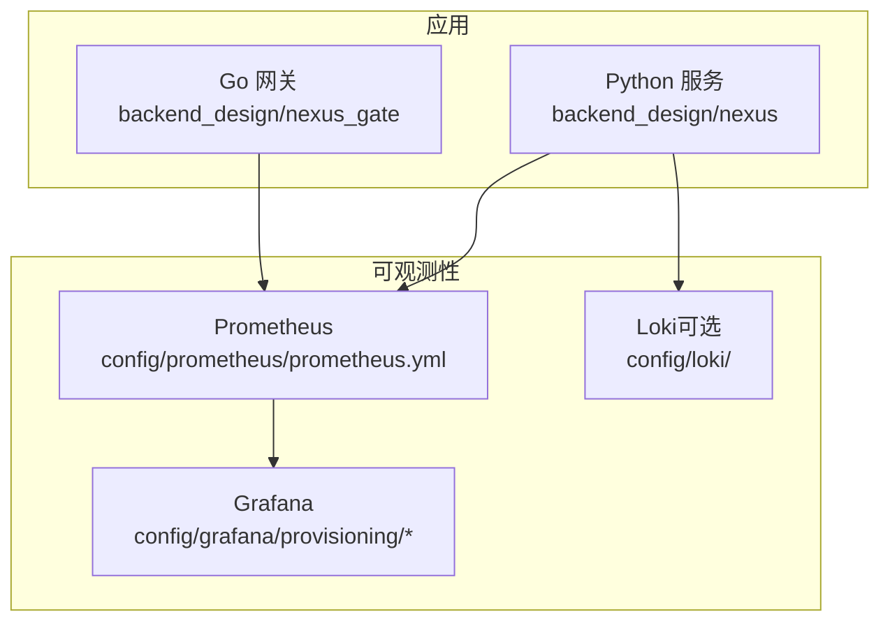
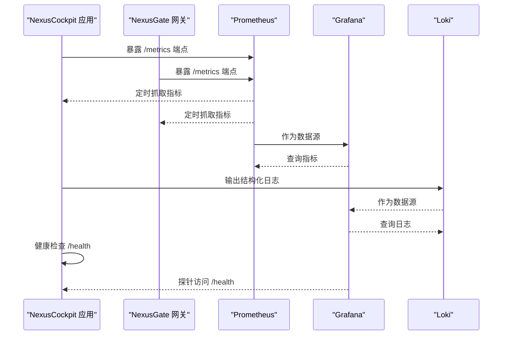
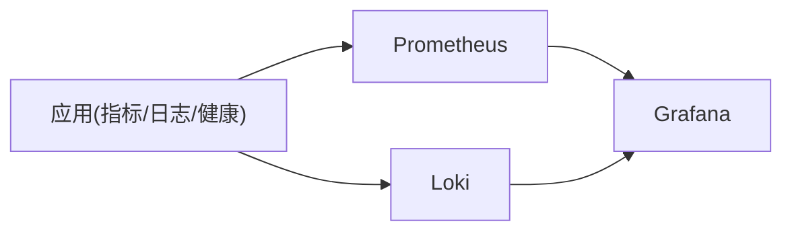

# 监控告警配置

<cite>
**本文引用的文件**   
- [docker-compose.yml](file://docker-compose.yml)
- [config/prometheus/prometheus.yml](file://config/prometheus/prometheus.yml)
- [config/grafana/provisioning/datasources/prometheus.yml](file://config/grafana/provisioning/datasources/prometheus.yml)
- [config/grafana/provisioning/dashboards/dashboards.yml](file://config/grafana/provisioning/dashboards/dashboards.yml)
- [config/grafana/provisioning/dashboards/nexuscockpit-overview.json](file://config/grafana/provisioning/dashboards/nexuscockpit-overview.json)
- [backend_design/nexus/observability/metrics.py](file://backend_design/nexus/observability/metrics.py)
- [backend_design/nexus/observability/cockpit_metrics.py](file://backend_design/nexus/observability/cockpit_metrics.py)
- [backend_design/nexus/api/routes/health.py](file://backend_design/nexus/api/routes/health.py)
- [backend_design/nexus/core/logger.py](file://backend_design/nexus/core/logger.py)
- [backend_design/nexus/config.py](file://backend_design/nexus/config.py)
- [backend_design/nexus/main.py](file://backend_design/nexus/main.py)
- [backend_design/nexus_gate/internal/handlers/handlers.go](file://backend_design/nexus_gate/internal/handlers/handlers.go)
- [backend_design/nexus_gate/internal/ratelimit/ratelimit.go](file://backend_design/nexus_gate/internal/ratelimit/ratelimit.go)
- [backend_design/scripts/test_metrics.py](file://backend_design/scripts/test_metrics.py)
</cite>

## 目录
1. [简介](#简介)
2. [项目结构](#项目结构)
3. [核心组件](#核心组件)
4. [架构总览](#架构总览)
5. [详细组件分析](#详细组件分析)
6. [依赖关系分析](#依赖关系分析)
7. [性能考虑](#性能考虑)
8. [故障诊断指南](#故障诊断指南)
9. [结论](#结论)
10. [附录](#附录)

## 简介
本文件面向NexusCockpit系统的可观测性与运维团队，提供端到端的监控与告警配置说明。内容覆盖：
- Prometheus指标采集配置与应用侧埋点
- Grafana数据源与仪表板预置
- Loki日志聚合与结构化日志输出
- 关键业务指标定义、系统性能与健康检查
- 告警规则、通知渠道与升级策略建议
- 可视化示例与常见故障定位方法

## 项目结构
本项目在配置层提供了Prometheus与Grafana的Provisioning文件，并在后端服务中内置了指标收集与日志模块；网关侧包含限流等运行时行为，便于补充指标。

图表来源
- [config/prometheus/prometheus.yml](file://config/prometheus/prometheus.yml)
- [config/grafana/provisioning/datasources/prometheus.yml](file://config/grafana/provisioning/datasources/prometheus.yml)
- [config/grafana/provisioning/dashboards/dashboards.yml](file://config/grafana/provisioning/dashboards/dashboards.yml)
- [config/grafana/provisioning/dashboards/nexuscockpit-overview.json](file://config/grafana/provisioning/dashboards/nexuscockpit-overview.json)
- [backend_design/nexus/observability/metrics.py](file://backend_design/nexus/observability/metrics.py)
- [backend_design/nexus/observability/cockpit_metrics.py](file://backend_design/nexus/observability/cockpit_metrics.py)
- [backend_design/nexus_gate/internal/handlers/handlers.go](file://backend_design/nexus_gate/internal/handlers/handlers.go)

章节来源
- [docker-compose.yml](file://docker-compose.yml)
- [config/prometheus/prometheus.yml](file://config/prometheus/prometheus.yml)
- [config/grafana/provisioning/datasources/prometheus.yml](file://config/grafana/provisioning/datasources/prometheus.yml)
- [config/grafana/provisioning/dashboards/dashboards.yml](file://config/grafana/provisioning/dashboards/dashboards.yml)
- [config/grafana/provisioning/dashboards/nexuscockpit-overview.json](file://config/grafana/provisioning/dashboards/nexuscockpit-overview.json)

## 核心组件
- 指标采集
  - Python服务通过Prometheus客户端暴露标准HTTP /metrics端点，供Prometheus抓取。
  - 自定义指标集中在observability目录下，涵盖通用指标与座舱业务指标。
- 日志聚合
  - 应用使用统一日志模块输出结构化日志，可按标签写入Loki或本地文件。
- 健康检查
  - 提供健康检查路由，用于存活探针与就绪探针。
- 网关侧指标
  - Go网关可补充请求计数、延迟、错误率与限流相关指标。

章节来源
- [backend_design/nexus/observability/metrics.py](file://backend_design/nexus/observability/metrics.py)
- [backend_design/nexus/observability/cockpit_metrics.py](file://backend_design/nexus/observability/cockpit_metrics.py)
- [backend_design/nexus/api/routes/health.py](file://backend_design/nexus/api/routes/health.py)
- [backend_design/nexus/core/logger.py](file://backend_design/nexus/core/logger.py)
- [backend_design/nexus_gate/internal/handlers/handlers.go](file://backend_design/nexus_gate/internal/handlers/handlers.go)
- [backend_design/nexus_gate/internal/ratelimit/ratelimit.go](file://backend_design/nexus_gate/internal/ratelimit/ratelimit.go)

## 架构总览
下图展示了从应用到存储与可视化的完整链路，包括指标、日志与健康检查。

图表来源
- [backend_design/nexus/observability/metrics.py](file://backend_design/nexus/observability/metrics.py)
- [backend_design/nexus_gate/internal/handlers/handlers.go](file://backend_design/nexus_gate/internal/handlers/handlers.go)
- [config/prometheus/prometheus.yml](file://config/prometheus/prometheus.yml)
- [config/grafana/provisioning/datasources/prometheus.yml](file://config/grafana/provisioning/datasources/prometheus.yml)
- [backend_design/nexus/api/routes/health.py](file://backend_design/nexus/api/routes/health.py)

## 详细组件分析

### Prometheus 指标采集配置
- 抓取目标
  - 通过配置文件声明Python服务与Go网关的指标抓取目标与间隔。
- 标签与过滤
  - 建议使用job、instance、service等标签区分不同实例与环境。
- 可靠性
  - 合理设置抓取超时与重试，避免对应用造成额外压力。

章节来源
- [config/prometheus/prometheus.yml](file://config/prometheus/prometheus.yml)

### Grafana 数据源与仪表板
- 数据源
  - 预置Prometheus数据源，指向Prometheus服务地址。
- 仪表板
  - 预置“NexusCockpit概览”仪表板，集中展示关键指标与趋势。
- 自动发现
  - 通过Provisioning方式自动加载数据源与仪表板，减少人工配置。

章节来源
- [config/grafana/provisioning/datasources/prometheus.yml](file://config/grafana/provisioning/datasources/prometheus.yml)
- [config/grafana/provisioning/dashboards/dashboards.yml](file://config/grafana/provisioning/dashboards/dashboards.yml)
- [config/grafana/provisioning/dashboards/nexuscockpit-overview.json](file://config/grafana/provisioning/dashboards/nexuscockpit-overview.json)

### 应用侧指标埋点（Python）
- 通用指标
  - 进程与运行时指标：内存、CPU、GC、线程数等。
  - HTTP指标：请求总数、错误数、延迟分位、并发数。
- 业务指标（座舱）
  - 会话创建/结束数量、意图识别成功率、技能调用次数、失败原因分布。
- 导出方式
  - 通过Prometheus客户端注册指标并暴露标准端点。

章节来源
- [backend_design/nexus/observability/metrics.py](file://backend_design/nexus/observability/metrics.py)
- [backend_design/nexus/observability/cockpit_metrics.py](file://backend_design/nexus/observability/cockpit_metrics.py)

### 网关侧指标埋点（Go）
- 请求级指标
  - 按路径与方法统计请求量、错误率、P95/P99延迟。
- 限流与熔断
  - 记录被限流的请求数、拒绝原因、恢复时间。
- 连接与资源
  - 活跃连接数、队列长度、背压信号。

章节来源
- [backend_design/nexus_gate/internal/handlers/handlers.go](file://backend_design/nexus_gate/internal/handlers/handlers.go)
- [backend_design/nexus_gate/internal/ratelimit/ratelimit.go](file://backend_design/nexus_gate/internal/ratelimit/ratelimit.go)

### 日志聚合（Loki）
- 结构化日志
  - 为每条日志附加service、env、trace_id、user_id等标签，便于检索与关联。
- 采集与索引
  - 将应用日志以JSON格式输出至Loki，利用标签进行高效查询。
- 与Grafana集成
  - 在Grafana中直接查询Loki日志，并与指标面板联动。

章节来源
- [backend_design/nexus/core/logger.py](file://backend_design/nexus/core/logger.py)
- [config/loki/loki-config.yml](file://config/loki/loki-config.yml)

### 健康检查与探针
- 健康接口
  - 提供统一的健康检查路由，返回服务状态与依赖检查结果。
- 探针集成
  - Kubernetes或编排平台通过该接口执行存活与就绪探测。

章节来源
- [backend_design/nexus/api/routes/health.py](file://backend_design/nexus/api/routes/health.py)

### 配置与环境
- 环境变量
  - 通过配置模块加载运行参数，如端口、日志级别、指标开关等。
- 启动流程
  - 主入口初始化中间件、路由、指标与日志子系统。

章节来源
- [backend_design/nexus/config.py](file://backend_design/nexus/config.py)
- [backend_design/nexus/main.py](file://backend_design/nexus/main.py)

### 指标验证脚本
- 测试用例
  - 提供脚本用于验证指标端点可用性与关键指标存在性。
- 回归保障
  - 在CI中定期执行，确保埋点未被破坏。

章节来源
- [backend_design/scripts/test_metrics.py](file://backend_design/scripts/test_metrics.py)

## 依赖关系分析
- 组件耦合
  - 应用与Prometheus/Grafana/Loki松耦合，通过标准协议交互。
- 外部依赖
  - Prometheus负责时序指标持久化与查询；Grafana负责可视化；Loki负责日志聚合。
- 潜在风险
  - 指标过度细分导致高基数问题；日志过大影响存储成本；健康检查过于严格导致误判。

图表来源
- [config/prometheus/prometheus.yml](file://config/prometheus/prometheus.yml)
- [config/grafana/provisioning/datasources/prometheus.yml](file://config/grafana/provisioning/datasources/prometheus.yml)
- [backend_design/nexus/observability/metrics.py](file://backend_design/nexus/observability/metrics.py)
- [backend_design/nexus/core/logger.py](file://backend_design/nexus/core/logger.py)

章节来源
- [docker-compose.yml](file://docker-compose.yml)
- [config/prometheus/prometheus.yml](file://config/prometheus/prometheus.yml)
- [config/grafana/provisioning/datasources/prometheus.yml](file://config/grafana/provisioning/datasources/prometheus.yml)

## 性能考虑
- 指标粒度
  - 控制标签基数，避免高基数导致的存储与查询压力。
- 采样与聚合
  - 对高频指标采用降采样或预聚合，降低Prometheus负载。
- 日志轮转
  - 启用日志轮转与压缩，限制单文件大小与保留周期。
- 健康检查
  - 健康检查应轻量且快速，避免引入额外阻塞。

[本节为通用指导，不直接分析具体文件]

## 故障诊断指南
- 指标不可用
  - 确认Prometheus抓取目标可达、端口开放、/metrics响应正常。
  - 检查指标命名与标签是否符合规范，是否存在重复注册。
- 指标缺失
  - 核对埋点是否生效，验证关键指标是否在端点中暴露。
  - 使用测试脚本进行回归验证。
- 日志丢失
  - 检查Loki配置与网络连通性，确认日志输出格式与标签正确。
- 健康检查失败
  - 查看健康接口返回体与依赖项状态，排查数据库、缓存、外部API异常。
- 告警风暴
  - 调整阈值与抑制规则，增加静默窗口，避免同一根因触发多条告警。

章节来源
- [backend_design/scripts/test_metrics.py](file://backend_design/scripts/test_metrics.py)
- [backend_design/nexus/api/routes/health.py](file://backend_design/nexus/api/routes/health.py)
- [backend_design/nexus/core/logger.py](file://backend_design/nexus/core/logger.py)

## 结论
通过标准化的指标采集、结构化日志与统一的健康检查，结合Grafana的可视化能力，NexusCockpit可实现全栈可观测。建议在后续迭代中完善告警规则与通知渠道，形成闭环的运维体系。

[本节为总结性内容，不直接分析具体文件]

## 附录

### 关键业务指标定义（建议）
- 会话类
  - 会话创建速率、会话平均时长、会话失败率
- 意图与技能
  - 意图识别准确率、技能调用成功率、技能平均耗时
- 用户体验
  - 首包延迟、端到端延迟P95/P99、用户满意度评分（如有）
- 稳定性
  - 错误率、熔断触发次数、限流拒绝率、重试成功率

[本节为概念性内容，不直接分析具体文件]

### 告警规则与通知（建议）
- 规则分类
  - 可用性：服务不可用、健康检查失败
  - 性能：延迟超阈、吞吐下降、错误率上升
  - 容量：磁盘使用率、内存峰值、队列积压
- 通知渠道
  - 邮件、企业微信、钉钉、Slack、短信
- 升级策略
  - 首次告警通知值班人员，持续未恢复则升级至二线与三线，必要时触发自动化处置

[本节为概念性内容，不直接分析具体文件]

### 可视化示例（建议）
- 概览页
  - QPS、错误率、P95延迟、活跃会话数
- 业务页
  - 意图识别成功率、技能调用TopN、失败原因分布
- 日志页
  - 按trace_id串联指标与日志，快速定位根因

[本节为概念性内容，不直接分析具体文件]