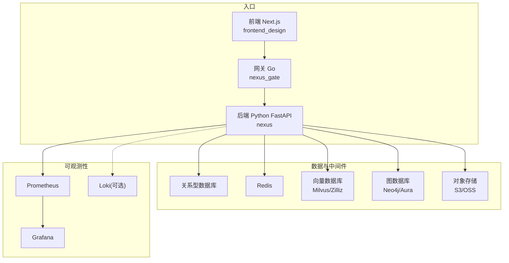
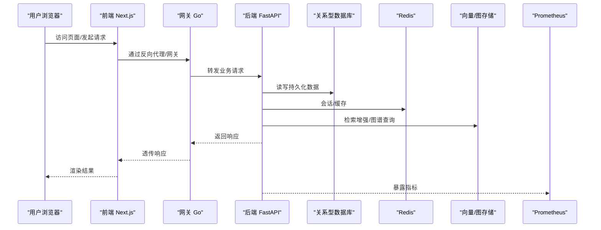
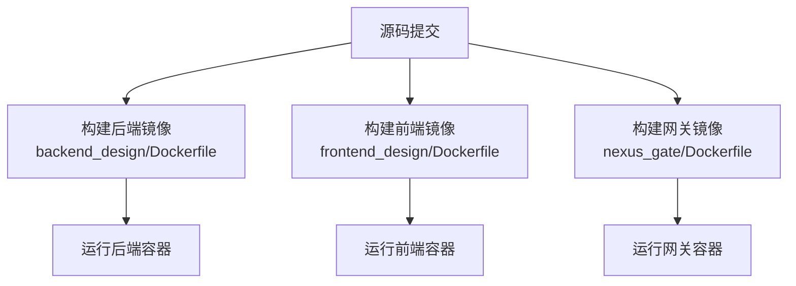
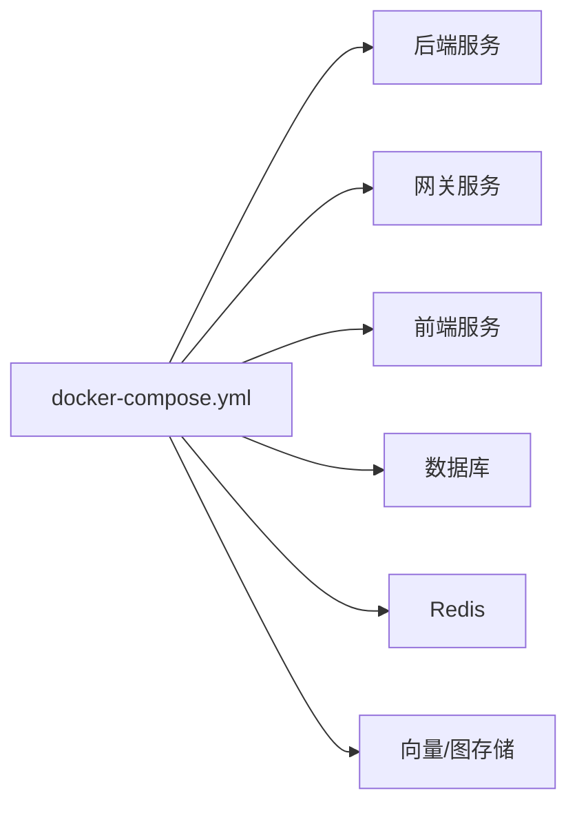
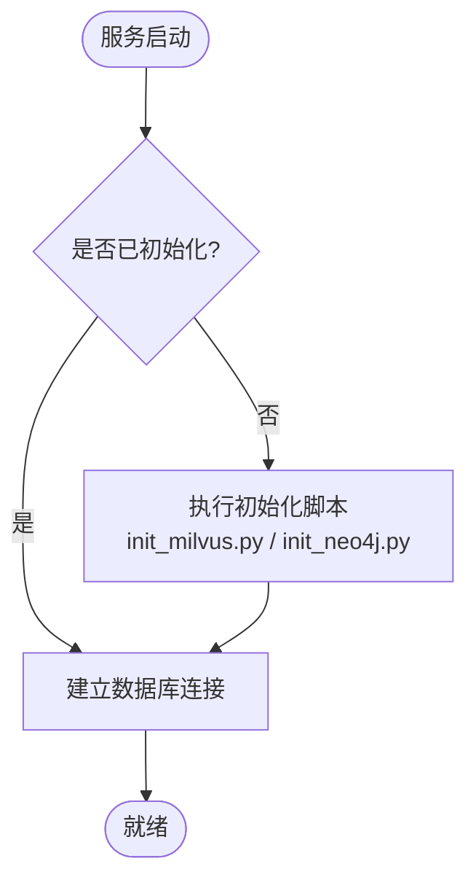
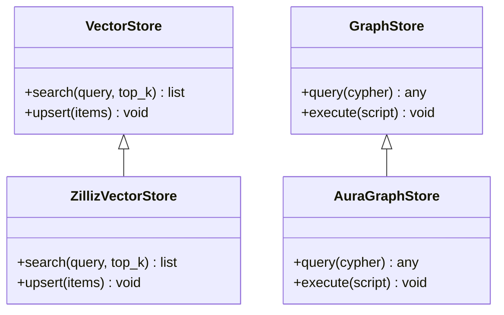
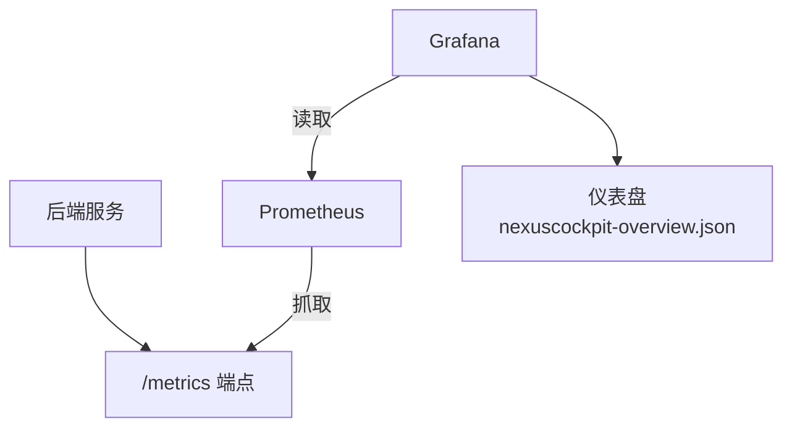
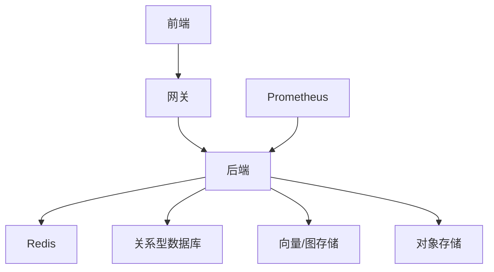

# 部署和运维

<cite>
**本文引用的文件**   
- [docker-compose.yml](file://docker-compose.yml)
- [backend_design/Dockerfile](file://backend_design/Dockerfile)
- [frontend_design/Dockerfile](file://frontend_design/Dockerfile)
- [backend_design/nexus_gate/Dockerfile](file://backend_design/nexus_gate/Dockerfile)
- [backend_design/pyproject.toml](file://backend_design/pyproject.toml)
- [backend_design/requirements.txt](file://backend_design/requirements.txt)
- [backend_design/nexus/main.py](file://backend_design/nexus/main.py)
- [backend_design/nexus/config.py](file://backend_design/nexus/config.py)
- [backend_design/nexus/core/db_manager.py](file://backend_design/nexus/core/db_manager.py)
- [backend_design/nexus/core/oss.py](file://backend_design/nexus/core/oss.py)
- [backend_design/nexus/api/websocket.py](file://backend_design/nexus/api/websocket.py)
- [backend_design/nexus/middleware/session_store.py](file://backend_design/nexus/middleware/session_store.py)
- [backend_design/nexus/middleware/redis_cache.py](file://backend_design/nexus/middleware/redis_cache.py)
- [backend_design/nexus/observability/metrics.py](file://backend_design/nexus/observability/metrics.py)
- [backend_design/nexus/observability/cockpit_metrics.py](file://backend_design/nexus/observability/cockpit_metrics.py)
- [backend_design/scripts/init_milvus.py](file://backend_design/scripts/init_milvus.py)
- [backend_design/scripts/init_neo4j.py](file://backend_design/scripts/init_neo4j.py)
- [backend_design/nexus/rag/vector_store.py](file://backend_design/nexus/rag/vector_store.py)
- [backend_design/nexus/rag/zilliz_vector_store.py](file://backend_design/nexus/rag/zilliz_vector_store.py)
- [backend_design/nexus/rag/graph_store.py](file://backend_design/nexus/rag/graph_store.py)
- [backend_design/nexus/rag/aura_graph_store.py](file://backend_design/nexus/rag/aura_graph_store.py)
- [config/prometheus/prometheus.yml](file://config/prometheus/prometheus.yml)
- [config/grafana/provisioning/datasources/prometheus.yml](file://config/grafana/provisioning/datasources/prometheus.yml)
- [config/grafana/provisioning/dashboards/dashboards.yml](file://config/grafana/provisioning/dashboards/dashboards.yml)
- [config/grafana/provisioning/dashboards/nexuscockpit-overview.json](file://config/grafana/provisioning/dashboards/nexuscockpit-overview.json)
- [Makefile](file://Makefile)
- [.github/workflows/ci.yml](file://.github/workflows/ci.yml)
- [README.md](file://README.md)
- [docs/deployment/SETUP.md](file://docs/deployment/SETUP.md)
- [docs/deployment/VERIFICATION.md](file://docs/deployment/VERIFICATION.md)
- [docs/deployment/FRONTEND_VERIFICATION.md](file://docs/deployment/FRONTEND_VERIFICATION.md)
</cite>

## 目录
1. [简介](#简介)
2. [项目结构](#项目结构)
3. [核心组件](#核心组件)
4. [架构总览](#架构总览)
5. [详细组件分析](#详细组件分析)
6. [依赖关系分析](#依赖关系分析)
7. [性能考虑](#性能考虑)
8. [故障排查指南](#故障排查指南)
9. [结论](#结论)
10. [附录](#附录)

## 简介
本文件面向NexusCockpit系统的开发与生产环境，提供端到端的部署与运维文档。内容涵盖：
- 开发环境与生产环境的完整搭建流程
- Docker容器化配置与镜像构建
- Kubernetes编排建议（基于现有Docker与Compose）
- 配置管理、服务发现与外部依赖初始化
- 数据库与向量/图存储初始化、模型文件管理与静态资源部署
- 性能调优、备份恢复策略与安全加固
- 监控告警、日志采集与日常巡检清单

## 项目结构
仓库采用前后端分离与多语言微服务组合：
- 后端Python服务（FastAPI）位于 backend_design/nexus
- 网关Go服务位于 backend_design/nexus_gate
- 前端Next.js应用位于 frontend_design
- 可观测性配置位于 config 目录
- 脚本与测试位于 scripts 与 tests
- 顶层 docker-compose.yml 用于一键编排本地与演示环境

图表来源
- [docker-compose.yml](file://docker-compose.yml)
- [backend_design/nexus/main.py](file://backend_design/nexus/main.py)
- [backend_design/nexus_gate/Dockerfile](file://backend_design/nexus_gate/Dockerfile)
- [frontend_design/Dockerfile](file://frontend_design/Dockerfile)

章节来源
- [README.md](file://README.md)
- [docs/deployment/SETUP.md](file://docs/deployment/SETUP.md)
- [docs/deployment/VERIFICATION.md](file://docs/deployment/VERIFICATION.md)
- [docs/deployment/FRONTEND_VERIFICATION.md](file://docs/deployment/FRONTEND_VERIFICATION.md)

## 核心组件
- 后端服务（Python/FastAPI）
  - 启动入口与路由挂载
  - 配置加载与环境变量注入
  - 数据库连接与迁移
  - 会话与缓存（Redis）
  - 向量检索与图检索（Milvus/Zilliz、Neo4j/Aura）
  - 对象存储（OSS/S3）
  - 指标暴露（Prometheus）
- 网关（Go）
  - 鉴权、限流、WebSocket转发
- 前端（Next.js）
  - 静态资源构建与反向代理
- 可观测性
  - Prometheus抓取后端指标
  - Grafana仪表盘与数据源预置

章节来源
- [backend_design/nexus/main.py](file://backend_design/nexus/main.py)
- [backend_design/nexus/config.py](file://backend_design/nexus/config.py)
- [backend_design/nexus/core/db_manager.py](file://backend_design/nexus/core/db_manager.py)
- [backend_design/nexus/middleware/session_store.py](file://backend_design/nexus/middleware/session_store.py)
- [backend_design/nexus/middleware/redis_cache.py](file://backend_design/nexus/middleware/redis_cache.py)
- [backend_design/nexus/core/oss.py](file://backend_design/nexus/core/oss.py)
- [backend_design/nexus/observability/metrics.py](file://backend_design/nexus/observability/metrics.py)
- [backend_design/nexus/observability/cockpit_metrics.py](file://backend_design/nexus/observability/cockpit_metrics.py)
- [backend_design/nexus/api/websocket.py](file://backend_design/nexus/api/websocket.py)
- [backend_design/nexus/rag/vector_store.py](file://backend_design/nexus/rag/vector_store.py)
- [backend_design/nexus/rag/zilliz_vector_store.py](file://backend_design/nexus/rag/zilliz_vector_store.py)
- [backend_design/nexus/rag/graph_store.py](file://backend_design/nexus/rag/graph_store.py)
- [backend_design/nexus/rag/aura_graph_store.py](file://backend_design/nexus/rag/aura_graph_store.py)
- [config/prometheus/prometheus.yml](file://config/prometheus/prometheus.yml)
- [config/grafana/provisioning/datasources/prometheus.yml](file://config/grafana/provisioning/datasources/prometheus.yml)
- [config/grafana/provisioning/dashboards/dashboards.yml](file://config/grafana/provisioning/dashboards/dashboards.yml)
- [config/grafana/provisioning/dashboards/nexuscockpit-overview.json](file://config/grafana/provisioning/dashboards/nexuscockpit-overview.json)

## 架构总览
下图展示从浏览器到后端、再到各类存储与可观测性组件的调用路径。

图表来源
- [backend_design/nexus/main.py](file://backend_design/nexus/main.py)
- [backend_design/nexus/api/websocket.py](file://backend_design/nexus/api/websocket.py)
- [backend_design/nexus/core/db_manager.py](file://backend_design/nexus/core/db_manager.py)
- [backend_design/nexus/middleware/redis_cache.py](file://backend_design/nexus/middleware/redis_cache.py)
- [backend_design/nexus/rag/vector_store.py](file://backend_design/nexus/rag/vector_store.py)
- [backend_design/nexus/rag/graph_store.py](file://backend_design/nexus/rag/graph_store.py)
- [config/prometheus/prometheus.yml](file://config/prometheus/prometheus.yml)

## 详细组件分析

### 容器化与镜像构建
- 后端镜像
  - 使用独立Dockerfile进行构建，包含Python运行时与依赖安装
  - 依赖声明位于 pyproject.toml 与 requirements.txt
- 前端镜像
  - 使用Next.js官方基础镜像，构建产物为静态资源
- 网关镜像
  - Go二进制编译并打包至轻量镜像

图表来源
- [backend_design/Dockerfile](file://backend_design/Dockerfile)
- [frontend_design/Dockerfile](file://frontend_design/Dockerfile)
- [backend_design/nexus_gate/Dockerfile](file://backend_design/nexus_gate/Dockerfile)
- [backend_design/pyproject.toml](file://backend_design/pyproject.toml)
- [backend_design/requirements.txt](file://backend_design/requirements.txt)

章节来源
- [backend_design/Dockerfile](file://backend_design/Dockerfile)
- [frontend_design/Dockerfile](file://frontend_design/Dockerfile)
- [backend_design/nexus_gate/Dockerfile](file://backend_design/nexus_gate/Dockerfile)
- [backend_design/pyproject.toml](file://backend_design/pyproject.toml)
- [backend_design/requirements.txt](file://backend_design/requirements.txt)

### 服务编排与启动
- 使用 docker-compose.yml 统一编排后端、网关、前端及依赖（数据库、Redis、向量/图存储等）
- 环境变量集中注入，便于不同环境切换
- 健康检查与重启策略在编排层定义

图表来源
- [docker-compose.yml](file://docker-compose.yml)

章节来源
- [docker-compose.yml](file://docker-compose.yml)

### 配置管理
- 后端通过配置文件与环境变量加载参数
- 关键配置项包括：数据库连接、Redis地址、对象存储凭证、RAG后端URL、指标端口等
- 建议在Kubernetes中使用ConfigMap/Secret管理敏感信息

章节来源
- [backend_design/nexus/config.py](file://backend_design/nexus/config.py)

### 数据库与模型初始化
- 关系型数据库连接由数据库管理器负责
- 提供脚本初始化向量库与图数据库
- 建议在启动前执行初始化脚本，确保索引与Schema就绪

图表来源
- [backend_design/nexus/core/db_manager.py](file://backend_design/nexus/core/db_manager.py)
- [backend_design/scripts/init_milvus.py](file://backend_design/scripts/init_milvus.py)
- [backend_design/scripts/init_neo4j.py](file://backend_design/scripts/init_neo4j.py)

章节来源
- [backend_design/nexus/core/db_manager.py](file://backend_design/nexus/core/db_manager.py)
- [backend_design/scripts/init_milvus.py](file://backend_design/scripts/init_milvus.py)
- [backend_design/scripts/init_neo4j.py](file://backend_design/scripts/init_neo4j.py)

### 会话与缓存
- 会话存储与缓存均基于Redis
- 支持分布式会话与会话过期策略
- 注意Redis容量与淘汰策略配置

章节来源
- [backend_design/nexus/middleware/session_store.py](file://backend_design/nexus/middleware/session_store.py)
- [backend_design/nexus/middleware/redis_cache.py](file://backend_design/nexus/middleware/redis_cache.py)

### 对象存储集成
- 通过对象存储模块上传/下载媒体与模型文件
- 支持多种后端（如S3/OSS），凭据通过配置注入

章节来源
- [backend_design/nexus/core/oss.py](file://backend_design/nexus/core/oss.py)

### RAG检索与存储
- 向量检索：抽象接口 vector_store，具体实现 zilliz_vector_store
- 图检索：抽象接口 graph_store，具体实现 aura_graph_store
- 启动前需完成向量/图库初始化与索引创建

图表来源
- [backend_design/nexus/rag/vector_store.py](file://backend_design/nexus/rag/vector_store.py)
- [backend_design/nexus/rag/zilliz_vector_store.py](file://backend_design/nexus/rag/zilliz_vector_store.py)
- [backend_design/nexus/rag/graph_store.py](file://backend_design/nexus/rag/graph_store.py)
- [backend_design/nexus/rag/aura_graph_store.py](file://backend_design/nexus/rag/aura_graph_store.py)

章节来源
- [backend_design/nexus/rag/vector_store.py](file://backend_design/nexus/rag/vector_store.py)
- [backend_design/nexus/rag/zilliz_vector_store.py](file://backend_design/nexus/rag/zilliz_vector_store.py)
- [backend_design/nexus/rag/graph_store.py](file://backend_design/nexus/rag/graph_store.py)
- [backend_design/nexus/rag/aura_graph_store.py](file://backend_design/nexus/rag/aura_graph_store.py)

### WebSocket与网关
- 后端提供WebSocket能力，网关负责鉴权与转发
- 适合实时交互场景（如语音助手、状态推送）

章节来源
- [backend_design/nexus/api/websocket.py](file://backend_design/nexus/api/websocket.py)
- [backend_design/nexus_gate/Dockerfile](file://backend_design/nexus_gate/Dockerfile)

### 可观测性与监控
- 后端暴露Prometheus指标
- Prometheus抓取配置与Grafana数据源/仪表盘预置
- 建议在生产开启日志聚合（如Loki）

图表来源
- [backend_design/nexus/observability/metrics.py](file://backend_design/nexus/observability/metrics.py)
- [backend_design/nexus/observability/cockpit_metrics.py](file://backend_design/nexus/observability/cockpit_metrics.py)
- [config/prometheus/prometheus.yml](file://config/prometheus/prometheus.yml)
- [config/grafana/provisioning/datasources/prometheus.yml](file://config/grafana/provisioning/datasources/prometheus.yml)
- [config/grafana/provisioning/dashboards/dashboards.yml](file://config/grafana/provisioning/dashboards/dashboards.yml)
- [config/grafana/provisioning/dashboards/nexuscockpit-overview.json](file://config/grafana/provisioning/dashboards/nexuscockpit-overview.json)

章节来源
- [backend_design/nexus/observability/metrics.py](file://backend_design/nexus/observability/metrics.py)
- [backend_design/nexus/observability/cockpit_metrics.py](file://backend_design/nexus/observability/cockpit_metrics.py)
- [config/prometheus/prometheus.yml](file://config/prometheus/prometheus.yml)
- [config/grafana/provisioning/datasources/prometheus.yml](file://config/grafana/provisioning/datasources/prometheus.yml)
- [config/grafana/provisioning/dashboards/dashboards.yml](file://config/grafana/provisioning/dashboards/dashboards.yml)
- [config/grafana/provisioning/dashboards/nexuscockpit-overview.json](file://config/grafana/provisioning/dashboards/nexuscockpit-overview.json)

### 持续集成与发布
- GitHub Actions CI流水线定义于 .github/workflows/ci.yml
- Makefile提供常用命令封装（构建、测试、部署辅助）

章节来源
- [.github/workflows/ci.yml](file://.github/workflows/ci.yml)
- [Makefile](file://Makefile)

## 依赖关系分析
- 外部依赖
  - 关系型数据库（PostgreSQL/MySQL等）
  - Redis（会话与缓存）
  - 向量数据库（Milvus或Zilliz云）
  - 图数据库（Neo4j或Aura）
  - 对象存储（S3/OSS）
  - 可观测性（Prometheus/Grafana/Loki）
- 内部耦合
  - 后端对Redis、向量/图存储、对象存储均有强依赖
  - 网关与后端通过HTTP/WebSocket通信
  - 前端通过网关访问后端

图表来源
- [docker-compose.yml](file://docker-compose.yml)
- [backend_design/nexus/config.py](file://backend_design/nexus/config.py)
- [backend_design/nexus/core/db_manager.py](file://backend_design/nexus/core/db_manager.py)
- [backend_design/nexus/middleware/redis_cache.py](file://backend_design/nexus/middleware/redis_cache.py)
- [backend_design/nexus/rag/vector_store.py](file://backend_design/nexus/rag/vector_store.py)
- [backend_design/nexus/rag/graph_store.py](file://backend_design/nexus/rag/graph_store.py)
- [backend_design/nexus/core/oss.py](file://backend_design/nexus/core/oss.py)
- [config/prometheus/prometheus.yml](file://config/prometheus/prometheus.yml)

章节来源
- [docker-compose.yml](file://docker-compose.yml)
- [backend_design/nexus/config.py](file://backend_design/nexus/config.py)
- [backend_design/nexus/core/db_manager.py](file://backend_design/nexus/core/db_manager.py)
- [backend_design/nexus/middleware/redis_cache.py](file://backend_design/nexus/middleware/redis_cache.py)
- [backend_design/nexus/rag/vector_store.py](file://backend_design/nexus/rag/vector_store.py)
- [backend_design/nexus/rag/graph_store.py](file://backend_design/nexus/rag/graph_store.py)
- [backend_design/nexus/core/oss.py](file://backend_design/nexus/core/oss.py)
- [config/prometheus/prometheus.yml](file://config/prometheus/prometheus.yml)

## 性能考虑
- 连接池与超时
  - 数据库连接池大小与最大空闲时间按QPS与延迟目标调整
  - Redis连接数与超时避免长尾
- 缓存策略
  - 热点数据入缓存，设置合理TTL与失效策略
  - 区分会话缓存与业务缓存命名空间
- 向量/图检索
  - 合理设置top_k与相似度阈值，减少大结果集传输
  - 批量写入与异步索引提升吞吐
- 对象存储
  - 启用分片上传与CDN加速静态资源
- 网关与后端
  - 网关限流与熔断保护后端
  - 后端水平扩展时保持无状态，会话外置Redis
- 可观测性
  - 采集关键指标（请求量、错误率、P95/P99延迟、GC、连接池利用率）
  - 设置告警阈值与降级策略

[本节为通用指导，不直接分析具体文件]

## 故障排查指南
- 启动失败
  - 检查环境变量与配置项是否正确注入
  - 确认外部依赖（数据库、Redis、向量/图存储、对象存储）可达
- 数据库问题
  - 查看连接日志与慢查询
  - 验证初始化脚本是否成功执行
- 缓存与会话异常
  - 检查Redis连通性与内存水位
  - 核对会话Key前缀与过期策略
- 检索失败
  - 校验向量/图库索引是否存在
  - 检查网络与凭据配置
- 指标不可用
  - 确认Prometheus抓取配置与后端指标端点可达
  - 检查Grafana数据源与仪表盘导入状态

章节来源
- [backend_design/nexus/config.py](file://backend_design/nexus/config.py)
- [backend_design/nexus/core/db_manager.py](file://backend_design/nexus/core/db_manager.py)
- [backend_design/nexus/middleware/redis_cache.py](file://backend_design/nexus/middleware/redis_cache.py)
- [backend_design/nexus/rag/vector_store.py](file://backend_design/nexus/rag/vector_store.py)
- [backend_design/nexus/rag/graph_store.py](file://backend_design/nexus/rag/graph_store.py)
- [config/prometheus/prometheus.yml](file://config/prometheus/prometheus.yml)
- [config/grafana/provisioning/datasources/prometheus.yml](file://config/grafana/provisioning/datasources/prometheus.yml)
- [config/grafana/provisioning/dashboards/dashboards.yml](file://config/grafana/provisioning/dashboards/dashboards.yml)

## 结论
通过容器化与编排，NexusCockpit可在本地与生产环境中快速落地。结合完善的初始化脚本、配置管理与可观测性体系，可实现稳定可靠的交付与运维。建议在生产中引入Kubernetes以增强弹性与自愈能力，并完善备份恢复与安全加固措施。

[本节为总结性内容，不直接分析具体文件]

## 附录

### 开发环境搭建
- 克隆仓库并安装依赖
- 使用 docker-compose up 拉起全部依赖与服务
- 执行数据库与RAG初始化脚本
- 访问前端与后端健康检查端点验证

章节来源
- [docs/deployment/SETUP.md](file://docs/deployment/SETUP.md)
- [docker-compose.yml](file://docker-compose.yml)
- [backend_design/scripts/init_milvus.py](file://backend_design/scripts/init_milvus.py)
- [backend_design/scripts/init_neo4j.py](file://backend_design/scripts/init_neo4j.py)

### 生产环境部署
- 将镜像推送到私有仓库
- 使用Kubernetes部署Deployment/Service/Ingress
- 通过ConfigMap/Secret注入配置与密钥
- 配置HPA与探针，启用日志与指标采集

章节来源
- [backend_design/Dockerfile](file://backend_design/Dockerfile)
- [frontend_design/Dockerfile](file://frontend_design/Dockerfile)
- [backend_design/nexus_gate/Dockerfile](file://backend_design/nexus_gate/Dockerfile)
- [config/prometheus/prometheus.yml](file://config/prometheus/prometheus.yml)
- [config/grafana/provisioning/datasources/prometheus.yml](file://config/grafana/provisioning/datasources/prometheus.yml)
- [config/grafana/provisioning/dashboards/dashboards.yml](file://config/grafana/provisioning/dashboards/dashboards.yml)

### 配置管理和服务发现
- 使用环境变量与配置文件统一管理
- 在Kubernetes中使用ConfigMap/Secret
- 服务发现可通过Kubernetes Service或外部DNS

章节来源
- [backend_design/nexus/config.py](file://backend_design/nexus/config.py)

### 数据库初始化与模型文件管理
- 初始化脚本覆盖向量与图库
- 模型文件存放于 models 目录，生产建议挂载持久卷或使用对象存储

章节来源
- [backend_design/scripts/init_milvus.py](file://backend_design/scripts/init_milvus.py)
- [backend_design/scripts/init_neo4j.py](file://backend_design/scripts/init_neo4j.py)

### 静态资源部署
- 前端构建产物为静态资源，可通过Nginx或云对象存储分发
- 配合CDN提升访问性能

章节来源
- [frontend_design/Dockerfile](file://frontend_design/Dockerfile)

### 备份恢复策略
- 定期快照关系型数据库与对象存储
- 导出向量/图库索引与元数据
- 制定恢复演练计划与RTO/RPO目标

[本节为通用指导，不直接分析具体文件]

### 安全加固措施
- 最小权限原则配置各依赖账号
- 启用TLS与证书管理
- 限制公网暴露面，仅开放必要端口
- 审计日志与访问控制

[本节为通用指导，不直接分析具体文件]

### 监控告警配置
- 配置Prometheus抓取后端指标
- 在Grafana导入仪表盘并设置告警规则
- 结合日志系统（如Loki）进行根因定位

章节来源
- [backend_design/nexus/observability/metrics.py](file://backend_design/nexus/observability/metrics.py)
- [backend_design/nexus/observability/cockpit_metrics.py](file://backend_design/nexus/observability/cockpit_metrics.py)
- [config/prometheus/prometheus.yml](file://config/prometheus/prometheus.yml)
- [config/grafana/provisioning/datasources/prometheus.yml](file://config/grafana/provisioning/datasources/prometheus.yml)
- [config/grafana/provisioning/dashboards/dashboards.yml](file://config/grafana/provisioning/dashboards/dashboards.yml)
- [config/grafana/provisioning/dashboards/nexuscockpit-overview.json](file://config/grafana/provisioning/dashboards/nexuscockpit-overview.json)

### 日常运维检查清单
- 服务健康与可用性
- 依赖连通性（数据库、Redis、向量/图存储、对象存储）
- 指标与日志正常采集
- 磁盘与内存水位
- 备份任务执行与恢复演练

[本节为通用指导，不直接分析具体文件]