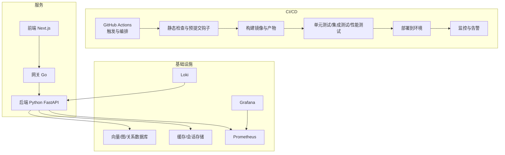
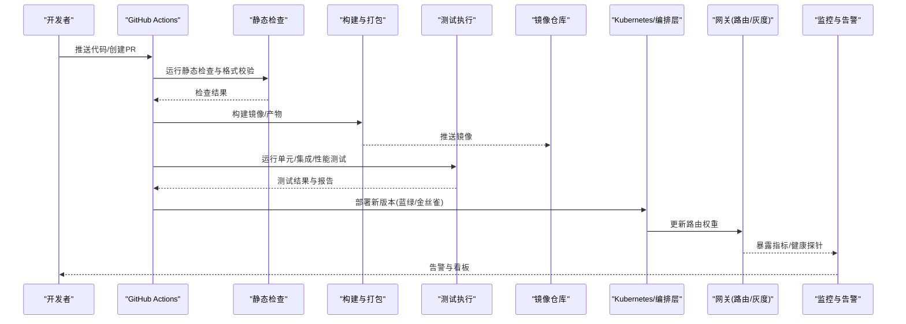
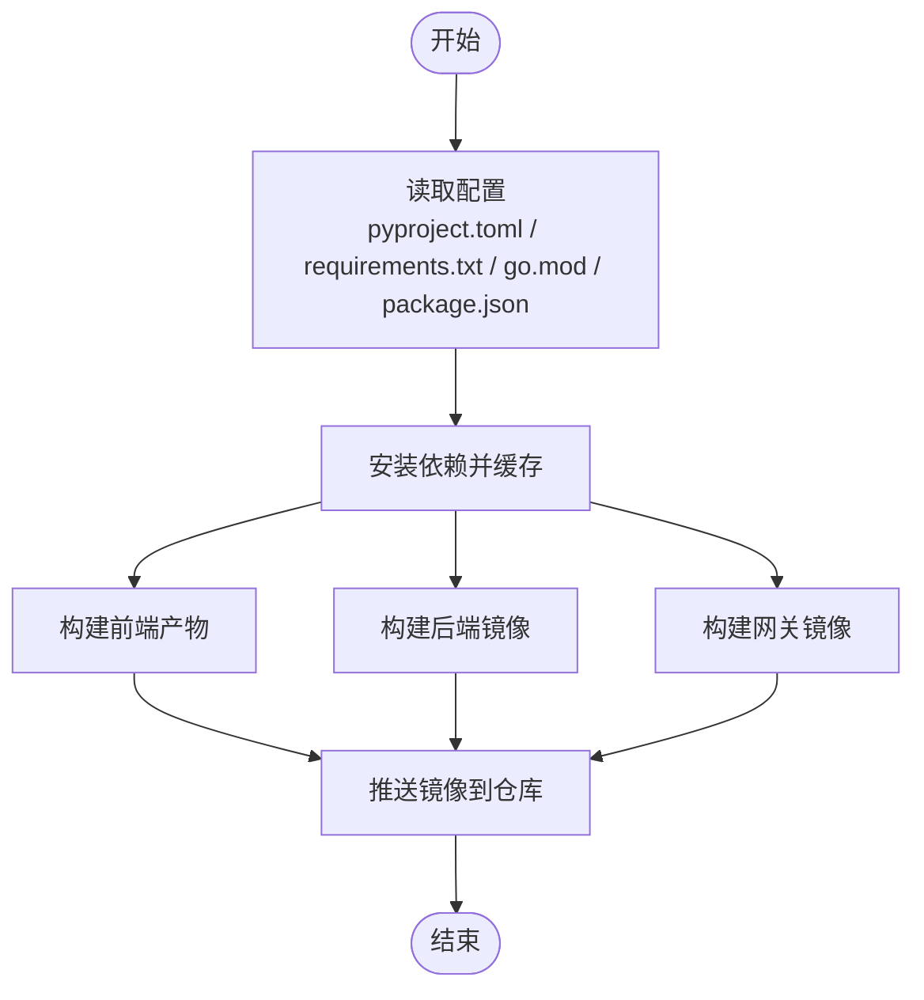
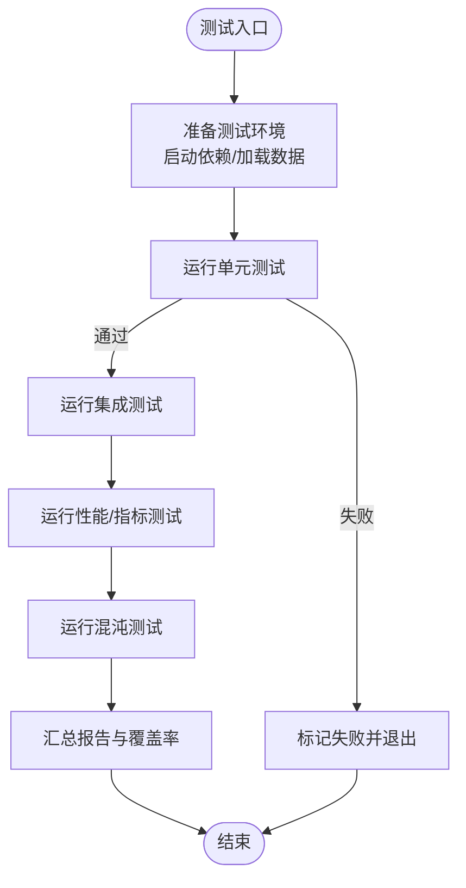
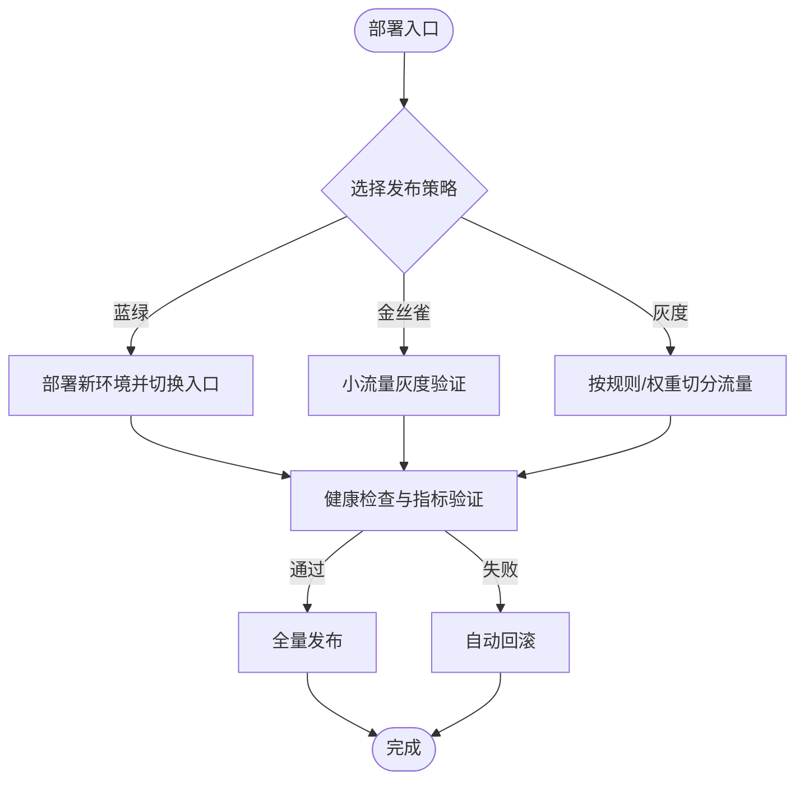
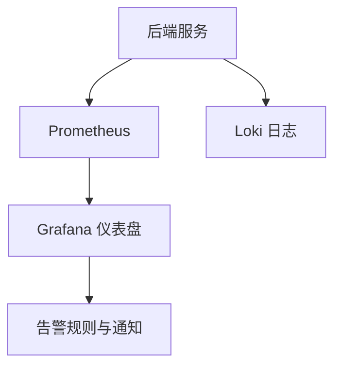
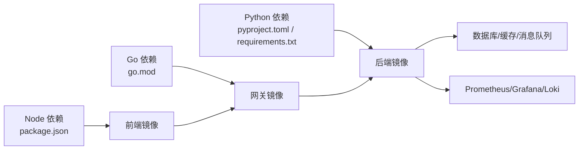

# CI/CD流水线

<cite>
**本文引用的文件**
- [ci.yml](file://.github/workflows/ci.yml)
- [Dockerfile（后端）](file://backend_design/Dockerfile)
- [Dockerfile（前端）](file://frontend_design/Dockerfile)
- [Dockerfile（网关）](file://backend_design/nexus_gate/Dockerfile)
- [docker-compose.yml](file://docker-compose.yml)
- [pyproject.toml](file://backend_design/pyproject.toml)
- [requirements.txt](file://backend_design/requirements.txt)
- [go.mod（网关）](file://backend_design/nexus_gate/go.mod)
- [package.json（前端）](file://frontend_design/package.json)
- [Makefile](file://Makefile)
- [.pre-commit-config.yaml](file://.pre-commit-config.yaml)
- [test_api.py（集成测试脚本）](file://backend_design/scripts/test_api.py)
- [test_db.py（数据库测试脚本）](file://backend_design/scripts/test_db.py)
- [test_metrics.py（指标测试脚本）](file://backend_design/scripts/test_metrics.py)
- [chaos_test.py（混沌工程脚本）](file://backend_design/scripts/chaos_test.py)
- [prometheus.yml](file://config/prometheus/prometheus.yml)
- [grafana 数据源配置](file://config/grafana/provisioning/datasources/prometheus.yml)
- [grafana 仪表盘定义](file://config/grafana/provisioning/dashboards/dashboards.yml)
- [nexuscockpit-overview.json](file://config/grafana/provisioning/dashboards/nexuscockpit-overview.json)
</cite>

## 目录
1. [简介](#简介)
2. [项目结构](#项目结构)
3. [核心组件](#核心组件)
4. [架构总览](#架构总览)
5. [详细组件分析](#详细组件分析)
6. [依赖关系分析](#依赖关系分析)
7. [性能与质量门禁](#性能与质量门禁)
8. [故障排查指南](#故障排查指南)
9. [结论](#结论)
10. [附录](#附录)

## 简介
本文件为 NexusCockpit 系统的 CI/CD 流水线配置文档，聚焦于 GitHub Actions 工作流、代码质量检查、自动化构建与部署策略、测试自动化以及监控告警。目标是帮助团队建立稳定、可观测、可回滚的持续集成与持续交付流程，覆盖从提交到生产的全链路自动化。

## 项目结构
仓库包含前后端服务与网关：
- 后端：Python FastAPI 应用，含 ASR/TTS/RAG/Agent 等模块
- 前端：Next.js 应用
- 网关：Go 实现的反向代理与鉴权网关
- 基础设施：Prometheus/Grafana/Loki 配置用于可观测性
- 测试与脚本：集成测试、数据库初始化、混沌工程等

[本节为概念性说明，不直接分析具体文件]

## 核心组件
- GitHub Actions 工作流：统一入口，定义触发条件、任务阶段、缓存与并行化策略
- 构建系统：多语言构建（Python/Go/Node），容器镜像打包
- 测试套件：单元测试、集成测试、指标与混沌测试
- 部署策略：蓝绿/金丝雀/灰度发布模式（通过网关路由与流量切分实现）
- 可观测性：Prometheus 指标采集、Grafana 可视化、Loki 日志聚合

章节来源
- [ci.yml](file://.github/workflows/ci.yml)
- [Makefile](file://Makefile)
- [docker-compose.yml](file://docker-compose.yml)

## 架构总览
下图展示从代码提交到部署上线与监控告警的端到端流程。

图表来源
- [ci.yml](file://.github/workflows/ci.yml)
- [Dockerfile（后端）](file://backend_design/Dockerfile)
- [Dockerfile（前端）](file://frontend_design/Dockerfile)
- [Dockerfile（网关）](file://backend_design/nexus_gate/Dockerfile)
- [docker-compose.yml](file://docker-compose.yml)

## 详细组件分析

### GitHub Actions 工作流（触发与编排）
- 触发条件
  - 默认分支 push、pull_request、release 事件
  - 支持手动触发以进行紧急修复或回滚
- 阶段划分
  - 准备：拉取代码、设置缓存（pip/Node/Go）、安装依赖
  - 静态检查：lint、格式化、安全扫描
  - 构建：后端/前端/网关镜像构建与推送
  - 测试：单元测试、集成测试、指标与混沌测试
  - 部署：按环境选择策略（开发/预发/生产）
  - 可观测：上报覆盖率、测试结果、生成报告
- 并发与缓存
  - 使用矩阵并行构建多平台镜像
  - 利用 pip/Node/Go 模块缓存加速构建
- 工件与报告
  - 上传测试报告与覆盖率结果
  - 将关键日志归档便于排障

章节来源
- [ci.yml](file://.github/workflows/ci.yml)

### 构建系统（多语言与容器化）
- 后端（Python）
  - 基于 pyproject.toml 与 requirements.txt 管理依赖
  - 使用 Dockerfile 构建镜像，优化分层与缓存
- 前端（Next.js）
  - 基于 package.json 管理依赖与构建脚本
  - 使用 Dockerfile 构建静态资源与运行时镜像
- 网关（Go）
  - 基于 go.mod 管理依赖
  - 使用 Dockerfile 构建轻量镜像

图表来源
- [pyproject.toml](file://backend_design/pyproject.toml)
- [requirements.txt](file://backend_design/requirements.txt)
- [go.mod（网关）](file://backend_design/nexus_gate/go.mod)
- [package.json（前端）](file://frontend_design/package.json)
- [Dockerfile（后端）](file://backend_design/Dockerfile)
- [Dockerfile（前端）](file://frontend_design/Dockerfile)
- [Dockerfile（网关）](file://backend_design/nexus_gate/Dockerfile)

章节来源
- [Dockerfile（后端）](file://backend_design/Dockerfile)
- [Dockerfile（前端）](file://frontend_design/Dockerfile)
- [Dockerfile（网关）](file://backend_design/nexus_gate/Dockerfile)
- [pyproject.toml](file://backend_design/pyproject.toml)
- [requirements.txt](file://backend_design/requirements.txt)
- [go.mod（网关）](file://backend_design/nexus_gate/go.mod)
- [package.json（前端）](file://frontend_design/package.json)

### 测试自动化（单元/集成/性能/混沌）
- 单元测试
  - Python 与 Go 各自运行对应测试框架
  - 输出覆盖率报告并上传
- 集成测试
  - 启动本地依赖（数据库、缓存、消息队列等）
  - 执行 API 与业务集成用例
- 性能与稳定性
  - 指标测试验证 Prometheus 指标可用性
  - 混沌测试注入异常场景，验证降级与恢复
- 测试数据与环境
  - 使用脚本初始化向量/图数据库
  - 提供种子数据与模拟用户

图表来源
- [test_api.py（集成测试脚本）](file://backend_design/scripts/test_api.py)
- [test_db.py（数据库测试脚本）](file://backend_design/scripts/test_db.py)
- [test_metrics.py（指标测试脚本）](file://backend_design/scripts/test_metrics.py)
- [chaos_test.py（混沌工程脚本）](file://backend_design/scripts/chaos_test.py)

章节来源
- [test_api.py（集成测试脚本）](file://backend_design/scripts/test_api.py)
- [test_db.py（数据库测试脚本）](file://backend_design/scripts/test_db.py)
- [test_metrics.py（指标测试脚本）](file://backend_design/scripts/test_metrics.py)
- [chaos_test.py（混沌工程脚本）](file://backend_design/scripts/chaos_test.py)

### 代码质量检查（静态分析与预提交）
- 预提交钩子
  - 在提交前执行格式校验、lint、安全检查
- 流水线内检查
  - 对后端/前端/网关分别执行静态分析
  - 失败则阻断合并与发布

章节来源
- [.pre-commit-config.yaml](file://.pre-commit-config.yaml)
- [ci.yml](file://.github/workflows/ci.yml)

### 自动化部署策略（蓝绿/金丝雀/灰度）
- 蓝绿部署
  - 同时维护两套相同版本的环境，切换流量入口完成零停机发布
- 金丝雀发布
  - 先向小比例用户开放新版本，观察指标后逐步放量
- 灰度发布
  - 基于标签/权重/规则进行细粒度流量切分
- 网关控制
  - 通过网关的路由与权重配置实现流量调度
- 回滚策略
  - 一键回退到上一稳定版本，快速恢复

图表来源
- [Dockerfile（网关）](file://backend_design/nexus_gate/Dockerfile)
- [docker-compose.yml](file://docker-compose.yml)

章节来源
- [docker-compose.yml](file://docker-compose.yml)
- [Dockerfile（网关）](file://backend_design/nexus_gate/Dockerfile)

### 监控与告警（Prometheus/Grafana/Loki）
- 指标采集
  - 后端暴露 Prometheus 指标，Prometheus 定时抓取
- 可视化
  - Grafana 预置仪表盘与数据源，提供概览视图
- 日志聚合
  - Loki 收集服务日志，配合 Grafana 查询与分析
- 告警
  - 基于阈值与规则触发告警，通知至企业通讯工具

图表来源
- [prometheus.yml](file://config/prometheus/prometheus.yml)
- [grafana 数据源配置](file://config/grafana/provisioning/datasources/prometheus.yml)
- [grafana 仪表盘定义](file://config/grafana/provisioning/dashboards/dashboards.yml)
- [nexuscockpit-overview.json](file://config/grafana/provisioning/dashboards/nexuscockpit-overview.json)

章节来源
- [prometheus.yml](file://config/prometheus/prometheus.yml)
- [grafana 数据源配置](file://config/grafana/provisioning/datasources/prometheus.yml)
- [grafana 仪表盘定义](file://config/grafana/provisioning/dashboards/dashboards.yml)
- [nexuscockpit-overview.json](file://config/grafana/provisioning/dashboards/nexuscockpit-overview.json)

## 依赖关系分析
- 构建依赖
  - 后端：Python 包管理与依赖锁定
  - 前端：Node 包管理与构建脚本
  - 网关：Go 模块管理
- 运行时依赖
  - 数据库、缓存、消息队列、对象存储等外部服务
- 可观测性依赖
  - Prometheus/Grafana/Loki 作为监控与日志基础设施

图表来源
- [pyproject.toml](file://backend_design/pyproject.toml)
- [requirements.txt](file://backend_design/requirements.txt)
- [package.json（前端）](file://frontend_design/package.json)
- [go.mod（网关）](file://backend_design/nexus_gate/go.mod)
- [docker-compose.yml](file://docker-compose.yml)

章节来源
- [pyproject.toml](file://backend_design/pyproject.toml)
- [requirements.txt](file://backend_design/requirements.txt)
- [package.json（前端）](file://frontend_design/package.json)
- [go.mod（网关）](file://backend_design/nexus_gate/go.mod)
- [docker-compose.yml](file://docker-compose.yml)

## 性能与质量门禁
- 静态代码分析
  - 统一 lint 与格式规范，禁止低质量代码进入主干
- 单元测试覆盖率
  - 设定最低覆盖率阈值，未达标阻断合并
- 集成测试通过率
  - 所有关键路径必须通过集成测试
- 性能基准
  - 对关键接口进行性能回归检测，超阈告警
- 混沌工程
  - 定期注入故障，验证系统韧性与自愈能力

[本节为通用指导，不直接分析具体文件]

## 故障排查指南
- 构建失败
  - 检查依赖缓存是否命中、网络连通性、镜像仓库权限
- 测试失败
  - 查看测试报告与日志，定位断言失败与超时问题
- 部署失败
  - 检查健康探针、网关路由权重、回滚策略是否生效
- 监控异常
  - 核对 Prometheus 抓取目标、Grafana 数据源、Loki 索引状态

章节来源
- [ci.yml](file://.github/workflows/ci.yml)
- [test_api.py（集成测试脚本）](file://backend_design/scripts/test_api.py)
- [test_metrics.py（指标测试脚本）](file://backend_design/scripts/test_metrics.py)
- [chaos_test.py（混沌工程脚本）](file://backend_design/scripts/chaos_test.py)
- [prometheus.yml](file://config/prometheus/prometheus.yml)
- [grafana 数据源配置](file://config/grafana/provisioning/datasources/prometheus.yml)
- [grafana 仪表盘定义](file://config/grafana/provisioning/dashboards/dashboards.yml)

## 结论
通过统一的 GitHub Actions 工作流、严格的代码质量门禁、完善的测试体系与灵活的发布策略，NexusCockpit 实现了从开发到生产的端到端自动化。结合 Prometheus/Grafana/Loki 的可观测性方案，能够及时发现并定位问题，保障系统的高可用与高质量交付。

[本节为总结性内容，不直接分析具体文件]

## 附录
- Makefile 常用命令
  - 本地构建、测试、清理与依赖安装
- docker-compose 本地联调
  - 一键拉起后端、前端、网关与基础依赖

章节来源
- [Makefile](file://Makefile)
- [docker-compose.yml](file://docker-compose.yml)