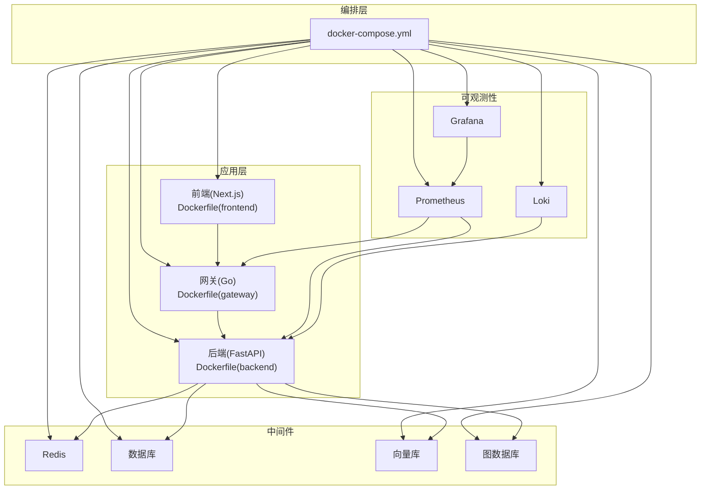
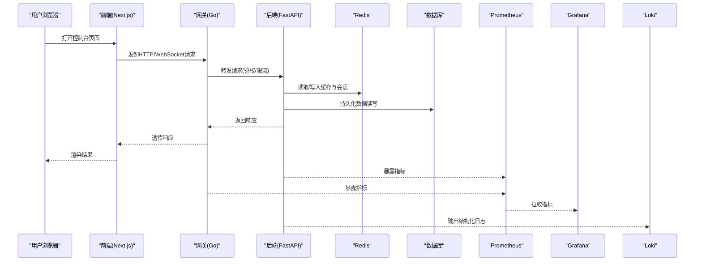
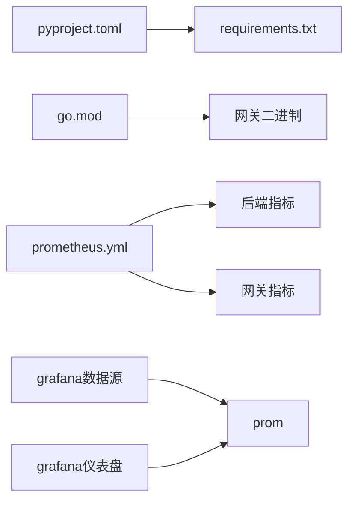

# Docker部署

<cite>
**本文引用的文件**   
- [docker-compose.yml](file://docker-compose.yml)
- [backend/Dockerfile](file://backend_design/Dockerfile)
- [frontend/Dockerfile](file://frontend_design/Dockerfile)
- [gateway/Dockerfile](file://backend_design/nexus_gate/Dockerfile)
- [config/prometheus/prometheus.yml](file://config/prometheus/prometheus.yml)
- [config/grafana/provisioning/datasources/prometheus.yml](file://config/grafana/provisioning/datasources/prometheus.yml)
- [config/grafana/provisioning/dashboards/dashboards.yml](file://config/grafana/provisioning/dashboards/dashboards.yml)
- [config/grafana/provisioning/dashboards/nexuscockpit-overview.json](file://config/grafana/provisioning/dashboards/nexuscockpit-overview.json)
- [config/loki/loki-config.yml](file://config/loki/loki-config.yml)
- [backend_design/pyproject.toml](file://backend_design/pyproject.toml)
- [backend_design/requirements.txt](file://backend_design/requirements.txt)
- [backend_design/backend_design/nexus/main.py](file://backend_design/nexus/main.py)
- [backend_design/nexus_gate/go.mod](file://backend_design/nexus_gate/go.mod)
</cite>

## 目录
1. [简介](#简介)
2. [项目结构](#项目结构)
3. [核心组件](#核心组件)
4. [架构总览](#架构总览)
5. [详细组件分析](#详细组件分析)
6. [依赖关系分析](#依赖关系分析)
7. [性能考虑](#性能考虑)
8. [故障排查指南](#故障排查指南)
9. [结论](#结论)
10. [附录](#附录)

## 简介
本文件面向NexusCockpit系统的Docker化部署，覆盖镜像构建、多阶段优化、分层策略与安全扫描；提供基于Docker Compose的服务编排（服务定义、网络、数据卷、环境变量）；说明容器间通信机制（服务发现、负载均衡、健康检查）；给出生产环境部署方案（资源限制、日志收集、监控集成）；并包含故障排查与性能调优建议。

## 项目结构
仓库采用前后端分离与网关分层的微服务形态：
- 后端服务（Python/FastAPI）：业务逻辑、AI能力、RAG、技能编排等
- 前端应用（Next.js）：管理控制台与交互界面
- 网关服务（Go）：鉴权、限流、反向代理、WebSocket转发
- 可观测性配置：Prometheus、Grafana、Loki
- 基础设施：Redis、数据库、向量库、图数据库等（由Compose编排）

图表来源
- [docker-compose.yml](file://docker-compose.yml)
- [backend/Dockerfile](file://backend_design/Dockerfile)
- [frontend/Dockerfile](file://frontend_design/Dockerfile)
- [gateway/Dockerfile](file://backend_design/nexus_gate/Dockerfile)
- [config/prometheus/prometheus.yml](file://config/prometheus/prometheus.yml)
- [config/grafana/provisioning/datasources/prometheus.yml](file://config/grafana/provisioning/datasources/prometheus.yml)
- [config/grafana/provisioning/dashboards/dashboards.yml](file://config/grafana/provisioning/dashboards/dashboards.yml)
- [config/grafana/provisioning/dashboards/nexuscockpit-overview.json](file://config/grafana/provisioning/dashboards/nexuscockpit-overview.json)
- [config/loki/loki-config.yml](file://config/loki/loki-config.yml)

章节来源
- [docker-compose.yml](file://docker-compose.yml)
- [backend/Dockerfile](file://backend_design/Dockerfile)
- [frontend/Dockerfile](file://frontend_design/Dockerfile)
- [gateway/Dockerfile](file://backend_design/nexus_gate/Dockerfile)

## 核心组件
- 后端服务（FastAPI）
  - 入口与路由组织位于后端主模块中，负责会话、聊天、车辆控制、设置、健康检查等接口
  - 通过中间件实现缓存、速率限制、会话存储与任务队列
  - 可观测性指标暴露供Prometheus抓取
- 前端应用（Next.js）
  - 静态构建产物由Nginx或内置服务器托管，通过网关统一入口访问
- 网关服务（Go）
  - 提供鉴权、限流、反向代理与WebSocket转发能力
  - 将外部请求路由至后端服务，支持连接复用与并发处理
- 可观测性
  - Prometheus采集后端与网关指标
  - Grafana提供仪表盘与数据源配置
  - Loki集中收集日志

章节来源
- [backend_design/nexus/main.py](file://backend_design/nexus/main.py)
- [backend_design/pyproject.toml](file://backend_design/pyproject.toml)
- [backend_design/requirements.txt](file://backend_design/requirements.txt)
- [backend_design/nexus_gate/go.mod](file://backend_design/nexus_gate/go.mod)
- [config/prometheus/prometheus.yml](file://config/prometheus/prometheus.yml)
- [config/grafana/provisioning/datasources/prometheus.yml](file://config/grafana/provisioning/datasources/prometheus.yml)
- [config/grafana/provisioning/dashboards/dashboards.yml](file://config/grafana/provisioning/dashboards/dashboards.yml)
- [config/grafana/provisioning/dashboards/nexuscockpit-overview.json](file://config/grafana/provisioning/dashboards/nexuscockpit-overview.json)
- [config/loki/loki-config.yml](file://config/loki/loki-config.yml)

## 架构总览
下图展示从浏览器到后端服务的完整调用链，以及可观测性数据的流向。

图表来源
- [docker-compose.yml](file://docker-compose.yml)
- [config/prometheus/prometheus.yml](file://config/prometheus/prometheus.yml)
- [config/grafana/provisioning/datasources/prometheus.yml](file://config/grafana/provisioning/datasources/prometheus.yml)
- [config/grafana/provisioning/dashboards/dashboards.yml](file://config/grafana/provisioning/dashboards/dashboards.yml)
- [config/grafana/provisioning/dashboards/nexuscockpit-overview.json](file://config/grafana/provisioning/dashboards/nexuscockpit-overview.json)
- [config/loki/loki-config.yml](file://config/loki/loki-config.yml)

## 详细组件分析

### 镜像构建与多阶段优化
- 后端镜像（Python）
  - 构建阶段：安装系统依赖与Python依赖，预编译扩展，生成虚拟环境
  - 运行阶段：仅拷贝运行时所需文件，使用非root用户运行，最小化基础镜像
  - 分层策略：将依赖安装与代码拷贝分离，提升缓存命中率
  - 安全扫描：在CI中集成Trivy或Snyk，阻断高危漏洞
- 前端镜像（Next.js）
  - 构建阶段：安装Node依赖、执行构建命令生成静态资源
  - 运行阶段：使用轻量运行时镜像托管静态资源，减少攻击面
- 网关镜像（Go）
  - 单二进制产物，多阶段构建分离编译与运行环境
  - 裁剪依赖，启用CGO禁用以减少体积

章节来源
- [backend/Dockerfile](file://backend_design/Dockerfile)
- [frontend/Dockerfile](file://frontend_design/Dockerfile)
- [gateway/Dockerfile](file://backend_design/nexus_gate/Dockerfile)

### Docker Compose编排
- 服务定义
  - 前端、后端、网关、Redis、数据库、向量库、图数据库、Prometheus、Grafana、Loki等服务统一编排
- 网络配置
  - 默认桥接网络，服务间通过服务名进行DNS解析
  - 对外暴露端口由网关统一收敛
- 数据卷挂载
  - 持久化数据（数据库、向量库、图数据库）映射到宿主机或命名卷
  - 配置文件与日志目录按需挂载
- 环境变量管理
  - 通过.env或Compose变量注入敏感信息（密钥、连接串）
  - 区分开发/测试/生产环境配置集

章节来源
- [docker-compose.yml](file://docker-compose.yml)

### 容器间通信与服务发现
- 服务发现
  - 基于Docker Compose内部DNS，服务名即主机名
- 负载均衡
  - 网关对后端实例进行请求分发，结合健康检查剔除异常节点
- 健康检查
  - 为关键服务配置健康检查探针，确保自动重启与流量切换

章节来源
- [docker-compose.yml](file://docker-compose.yml)

### 可观测性与日志
- 指标采集
  - Prometheus按配置抓取后端与网关的指标端点
- 可视化
  - Grafana加载数据源与仪表盘，提供NexusCockpit概览视图
- 日志收集
  - 后端与网关输出结构化日志，Loki聚合检索

章节来源
- [config/prometheus/prometheus.yml](file://config/prometheus/prometheus.yml)
- [config/grafana/provisioning/datasources/prometheus.yml](file://config/grafana/provisioning/datasources/prometheus.yml)
- [config/grafana/provisioning/dashboards/dashboards.yml](file://config/grafana/provisioning/dashboards/dashboards.yml)
- [config/grafana/provisioning/dashboards/nexuscockpit-overview.json](file://config/grafana/provisioning/dashboards/nexuscockpit-overview.json)
- [config/loki/loki-config.yml](file://config/loki/loki-config.yml)

### 生产环境部署方案
- 资源限制
  - 为各服务设置CPU与内存上限，避免争抢与OOM
- 滚动更新
  - 基于Compose或Kubernetes实现零停机发布
- 高可用
  - 多副本后端+网关，配合健康检查与负载均衡
- 安全加固
  - 最小权限运行、只读根文件系统、定期镜像扫描与补丁更新
- 备份与恢复
  - 数据库与向量/图库定期快照，保留策略与演练恢复流程

[本节为通用指导，不直接分析具体文件]

## 依赖关系分析
- 后端依赖
  - Python包管理与依赖声明文件用于构建时锁定版本
  - 运行时依赖包括缓存、数据库驱动、向量库客户端、图数据库客户端等
- 网关依赖
  - Go模块定义与第三方库，编译期裁剪以减小镜像体积
- 可观测性依赖
  - Prometheus抓取目标与Grafana数据源/仪表盘配置

图表来源
- [backend_design/pyproject.toml](file://backend_design/pyproject.toml)
- [backend_design/requirements.txt](file://backend_design/requirements.txt)
- [backend_design/nexus_gate/go.mod](file://backend_design/nexus_gate/go.mod)
- [config/prometheus/prometheus.yml](file://config/prometheus/prometheus.yml)
- [config/grafana/provisioning/datasources/prometheus.yml](file://config/grafana/provisioning/datasources/prometheus.yml)
- [config/grafana/provisioning/dashboards/dashboards.yml](file://config/grafana/provisioning/dashboards/dashboards.yml)

章节来源
- [backend_design/pyproject.toml](file://backend_design/pyproject.toml)
- [backend_design/requirements.txt](file://backend_design/requirements.txt)
- [backend_design/nexus_gate/go.mod](file://backend_design/nexus_gate/go.mod)
- [config/prometheus/prometheus.yml](file://config/prometheus/prometheus.yml)
- [config/grafana/provisioning/datasources/prometheus.yml](file://config/grafana/provisioning/datasources/prometheus.yml)
- [config/grafana/provisioning/dashboards/dashboards.yml](file://config/grafana/provisioning/dashboards/dashboards.yml)

## 性能考虑
- 镜像体积与启动时间
  - 多阶段构建、依赖缓存、精简基础镜像
- 运行时性能
  - 合理设置线程池与连接池大小
  - 开启HTTP/2与连接复用
- 缓存策略
  - Redis热点数据缓存、TTL与失效策略
- 数据库与向量/图库
  - 索引优化、查询分页、批量写入
- 可观测性开销
  - 采样率调整、指标粒度控制

[本节为通用指导，不直接分析具体文件]

## 故障排查指南
- 常见问题定位
  - 容器无法启动：检查健康检查失败原因、端口冲突、环境变量缺失
  - 服务不可达：确认网络连通、防火墙规则、服务名解析
  - 指标未上报：核对Prometheus抓取配置与指标端点可达性
  - 日志缺失：检查Loki配置与日志输出格式
- 诊断步骤
  - 查看容器日志与事件
  - 进入容器执行网络与依赖探测
  - 验证健康检查端点与依赖服务状态
  - 对比不同环境的配置差异

章节来源
- [config/prometheus/prometheus.yml](file://config/prometheus/prometheus.yml)
- [config/grafana/provisioning/datasources/prometheus.yml](file://config/grafana/provisioning/datasources/prometheus.yml)
- [config/grafana/provisioning/dashboards/dashboards.yml](file://config/grafana/provisioning/dashboards/dashboards.yml)
- [config/grafana/provisioning/dashboards/nexuscockpit-overview.json](file://config/grafana/provisioning/dashboards/nexuscockpit-overview.json)
- [config/loki/loki-config.yml](file://config/loki/loki-config.yml)

## 结论
通过多阶段构建与分层优化，NexusCockpit的镜像更安全、更小、更快；借助Docker Compose完成服务编排与依赖管理；以Prometheus/Grafana/Loki构建可观测体系；在生产环境中结合资源限制、滚动更新与健康检查实现稳定交付。持续完善安全扫描与自动化流水线，是保障质量与效率的关键。

## 附录
- 快速开始
  - 准备.env与环境变量
  - 执行Compose拉起服务
  - 访问网关入口验证功能
- 最佳实践清单
  - 镜像签名与漏洞扫描
  - 最小权限与只读文件系统
  - 配置外置与版本化管理
  - 定期备份与恢复演练

[本节为通用指导，不直接分析具体文件]