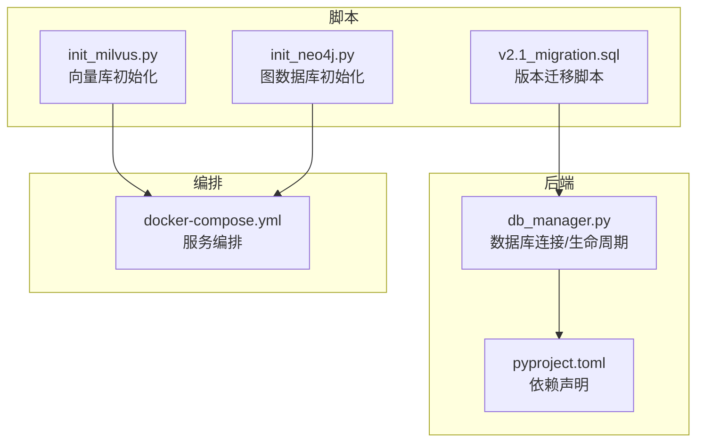
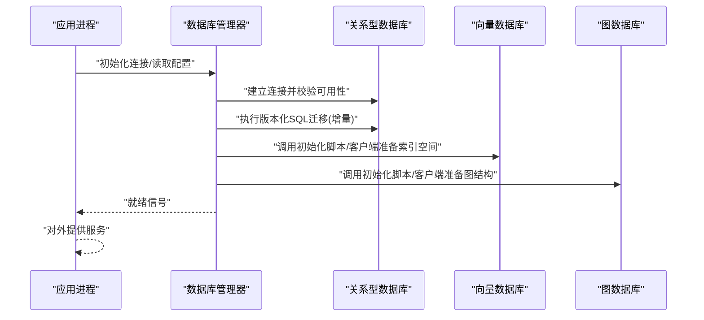
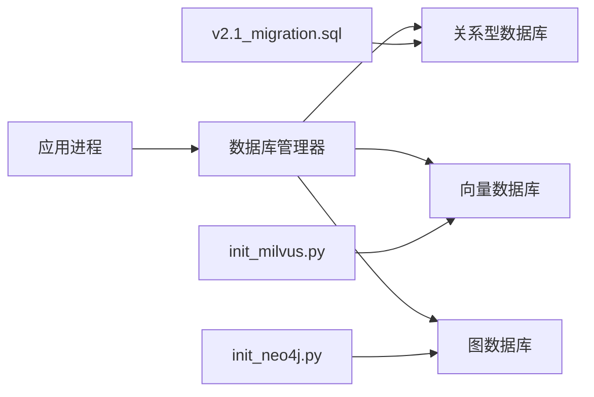

# 数据库迁移

<cite>
**本文引用的文件**   
- [backend_design/nexus/core/db_manager.py](file://backend_design/nexus/core/db_manager.py)
- [backend_design/scripts/init_milvus.py](file://backend_design/scripts/init_milvus.py)
- [backend_design/scripts/init_neo4j.py](file://backend_design/scripts/init_neo4j.py)
- [backend_design/scripts/v2.1_migration.sql](file://backend_design/scripts/v2.1_migration.sql)
- [backend_design/pyproject.toml](file://backend_design/pyproject.toml)
- [docker-compose.yml](file://docker-compose.yml)
</cite>

## 目录
1. [简介](#简介)
2. [项目结构](#项目结构)
3. [核心组件](#核心组件)
4. [架构总览](#架构总览)
5. [详细组件分析](#详细组件分析)
6. [依赖关系分析](#依赖关系分析)
7. [性能考虑](#性能考虑)
8. [故障排查指南](#故障排查指南)
9. [结论](#结论)
10. [附录](#附录)

## 简介
本文件面向NexusCockpit系统的数据库迁移与管理，覆盖版本控制策略、增量与回滚流程、多类型数据库初始化（关系型、向量、图）、一致性保障机制以及性能优化建议。文档基于仓库中现有脚本与配置进行梳理，旨在为开发与运维提供可操作的实践指南。

## 项目结构
与数据库迁移相关的代码与脚本主要分布在以下位置：
- 后端核心：数据库连接与生命周期管理
- 初始化脚本：向量数据库与图数据库的初始化
- SQL迁移脚本：版本化SQL变更
- 构建与运行：依赖声明与容器编排

图表来源
- [backend_design/nexus/core/db_manager.py](file://backend_design/nexus/core/db_manager.py)
- [backend_design/scripts/init_milvus.py](file://backend_design/scripts/init_milvus.py)
- [backend_design/scripts/init_neo4j.py](file://backend_design/scripts/init_neo4j.py)
- [backend_design/scripts/v2.1_migration.sql](file://backend_design/scripts/v2.1_migration.sql)
- [backend_design/pyproject.toml](file://backend_design/pyproject.toml)
- [docker-compose.yml](file://docker-compose.yml)

章节来源
- [backend_design/nexus/core/db_manager.py](file://backend_design/nexus/core/db_manager.py)
- [backend_design/scripts/init_milvus.py](file://backend_design/scripts/init_milvus.py)
- [backend_design/scripts/init_neo4j.py](file://backend_design/scripts/init_neo4j.py)
- [backend_design/scripts/v2.1_migration.sql](file://backend_design/scripts/v2.1_migration.sql)
- [backend_design/pyproject.toml](file://backend_design/pyproject.toml)
- [docker-compose.yml](file://docker-compose.yml)

## 核心组件
- 数据库管理器：负责数据库连接的创建、复用与生命周期管理，是应用层访问各类数据源的统一入口。
- 向量数据库初始化脚本：用于在启动或部署阶段完成向量索引空间、集合等资源的准备。
- 图数据库初始化脚本：用于在启动或部署阶段完成图数据库的连接与必要拓扑结构的准备。
- SQL迁移脚本：以版本化的方式描述关系型数据库的结构变更，支持增量升级。
- 依赖与编排：通过依赖声明和容器编排确保各数据源服务的可用性与连通性。

章节来源
- [backend_design/nexus/core/db_manager.py](file://backend_design/nexus/core/db_manager.py)
- [backend_design/scripts/init_milvus.py](file://backend_design/scripts/init_milvus.py)
- [backend_design/scripts/init_neo4j.py](file://backend_design/scripts/init_neo4j.py)
- [backend_design/scripts/v2.1_migration.sql](file://backend_design/scripts/v2.1_migration.sql)
- [backend_design/pyproject.toml](file://backend_design/pyproject.toml)
- [docker-compose.yml](file://docker-compose.yml)

## 架构总览
下图展示了NexusCockpit在多数据源场景下的迁移与初始化总体流程：应用启动时加载配置，执行必要的数据库迁移与资源初始化，随后进入正常服务状态。

图表来源
- [backend_design/nexus/core/db_manager.py](file://backend_design/nexus/core/db_manager.py)
- [backend_design/scripts/init_milvus.py](file://backend_design/scripts/init_milvus.py)
- [backend_design/scripts/init_neo4j.py](file://backend_design/scripts/init_neo4j.py)
- [backend_design/scripts/v2.1_migration.sql](file://backend_design/scripts/v2.1_migration.sql)

## 详细组件分析

### 数据库管理器（db_manager）
职责与要点
- 统一管理多类数据源的连接对象，提供统一的获取与释放接口。
- 在应用生命周期内维护连接池或会话，避免频繁创建销毁带来的开销。
- 作为迁移与初始化的协调者，按顺序触发关系型、向量、图数据库的准备步骤。

使用建议
- 将连接参数集中管理，避免硬编码；结合环境变量注入。
- 对连接失败与超时设置合理的重试与熔断策略，提升鲁棒性。

章节来源
- [backend_design/nexus/core/db_manager.py](file://backend_design/nexus/core/db_manager.py)

### 向量数据库初始化（Milvus）
目标
- 在部署或首次启动时完成命名空间、集合、索引等基础资源准备。
- 保证后续检索任务可直接使用已就绪的向量存储能力。

关键步骤
- 检查向量服务连通性。
- 按需创建集合与索引（幂等处理）。
- 记录初始化结果以便问题定位。

章节来源
- [backend_design/scripts/init_milvus.py](file://backend_design/scripts/init_milvus.py)

### 图数据库初始化（Neo4j）
目标
- 在部署或首次启动时完成图数据库连接与必要拓扑结构的准备。
- 确保业务侧图查询与写入路径畅通。

关键步骤
- 验证图服务连通性与权限。
- 按需创建约束、标签或索引以提升查询性能。
- 输出初始化日志便于审计与排障。

章节来源
- [backend_design/scripts/init_neo4j.py](file://backend_design/scripts/init_neo4j.py)

### SQL迁移脚本（v2.1）
定位
- 以版本化形式描述关系型数据库的结构变更，遵循“只增不改”的原则。
- 支持增量升级，确保从任意历史版本平滑过渡到最新版本。

规范建议
- 文件名采用语义化版本号前缀，如 v2.1_migration.sql。
- 每个脚本仅包含单一版本的变更，保持幂等与可重复执行的安全性。
- 在脚本内部使用事务包裹，确保原子性。

章节来源
- [backend_design/scripts/v2.1_migration.sql](file://backend_design/scripts/v2.1_migration.sql)

### 依赖与编排（pyproject.toml / docker-compose.yml）
作用
- pyproject.toml声明后端运行时所需的数据驱动与工具包。
- docker-compose.yml编排关系型、向量、图数据库等服务，并提供网络与端口映射。

注意事项
- 确保所有数据源服务在应用启动前可达。
- 合理设置健康检查与重启策略，提高整体可用性。

章节来源
- [backend_design/pyproject.toml](file://backend_design/pyproject.toml)
- [docker-compose.yml](file://docker-compose.yml)

## 依赖关系分析
下图展示迁移相关模块之间的依赖关系：应用通过数据库管理器协调各数据源，初始化脚本由管理器或外部编排触发，SQL迁移脚本由管理器在执行阶段调用。

图表来源
- [backend_design/nexus/core/db_manager.py](file://backend_design/nexus/core/db_manager.py)
- [backend_design/scripts/init_milvus.py](file://backend_design/scripts/init_milvus.py)
- [backend_design/scripts/init_neo4j.py](file://backend_design/scripts/init_neo4j.py)
- [backend_design/scripts/v2.1_migration.sql](file://backend_design/scripts/v2.1_migration.sql)

章节来源
- [backend_design/nexus/core/db_manager.py](file://backend_design/nexus/core/db_manager.py)
- [backend_design/scripts/init_milvus.py](file://backend_design/scripts/init_milvus.py)
- [backend_design/scripts/init_neo4j.py](file://backend_design/scripts/init_neo4j.py)
- [backend_design/scripts/v2.1_migration.sql](file://backend_design/scripts/v2.1_migration.sql)

## 性能考虑
- 索引优化
  - 关系型数据库：为高频查询条件列建立合适索引，避免过度索引导致写入退化。
  - 向量数据库：根据维度与召回需求选择合适的索引类型与参数，平衡内存与查询延迟。
  - 图数据库：为常用遍历属性建立索引或约束，减少全图扫描。
- 查询调优
  - 限制返回字段与行数，避免大结果集传输。
  - 使用分页与游标式读取，降低单次负载。
  - 对热点查询引入缓存层，减轻数据库压力。
- 存储规划
  - 预估数据增长曲线，预留扩容空间。
  - 分离热冷数据，冷热分层存储降低成本。
- 连接与并发
  - 合理设置连接池大小，避免连接耗尽或上下文切换过多。
  - 对长事务进行限流与监控，防止锁竞争。

[本节为通用指导，不直接分析具体文件]

## 故障排查指南
常见问题与定位思路
- 连接失败
  - 检查数据源服务是否启动、端口与网络是否可达。
  - 核对用户名、密码、数据库名等连接参数。
- 迁移失败
  - 确认当前数据库版本与待执行脚本版本匹配。
  - 查看事务边界与错误堆栈，定位具体失败的DDL/DML语句。
- 初始化异常
  - 向量/图数据库初始化脚本需具备相应权限。
  - 若幂等逻辑未生效，可能导致重复创建报错。

建议操作
- 启用详细日志，记录每次迁移与初始化的输入输出。
- 在预发环境先行演练，验证回滚与恢复流程。
- 对关键表与索引建立监控告警，提前发现性能劣化。

章节来源
- [backend_design/nexus/core/db_manager.py](file://backend_design/nexus/core/db_manager.py)
- [backend_design/scripts/init_milvus.py](file://backend_design/scripts/init_milvus.py)
- [backend_design/scripts/init_neo4j.py](file://backend_design/scripts/init_neo4j.py)
- [backend_design/scripts/v2.1_migration.sql](file://backend_design/scripts/v2.1_migration.sql)

## 结论
通过对数据库管理器、初始化脚本与版本化SQL的统一编排，NexusCockpit能够在多数据源环境下实现稳定、可追溯的迁移与初始化流程。配合完善的依赖声明与容器编排，系统可在不同环境中快速复现一致的数据库状态。建议在后续迭代中持续完善幂等性、回滚与观测性能力，进一步提升可靠性与可维护性。

[本节为总结性内容，不直接分析具体文件]

## 附录

### 版本控制策略与命名规范
- 命名规范
  - 使用语义化版本号前缀，例如 v2.1_migration.sql。
  - 同一版本仅一个脚本，避免合并多个不相关变更。
- 版本号管理
  - 维护一份“已执行版本清单”，确保幂等与断点续跑。
  - 升级前校验目标版本与依赖版本兼容性。
- 依赖关系处理
  - 明确脚本间的先后顺序，必要时拆分为多个小版本逐步推进。
  - 跨库变更应分步执行，先结构后数据，先读后写。

章节来源
- [backend_design/scripts/v2.1_migration.sql](file://backend_design/scripts/v2.1_migration.sql)

### 数据迁移流程（增量与回滚）
- 增量迁移
  - 按版本顺序执行未应用的脚本。
  - 每个脚本独立事务，失败即回滚，保证一致性。
- 回滚机制
  - 为每个正向脚本配套反向脚本，或在脚本内提供可逆操作。
  - 回滚前备份受影响对象，确保可恢复。
- 数据备份与恢复
  - 迁移前对关键库与表进行快照或导出。
  - 恢复流程需验证完整性与一致性后再切流。

章节来源
- [backend_design/scripts/v2.1_migration.sql](file://backend_design/scripts/v2.1_migration.sql)

### 多类型数据库初始化与连接配置
- 关系型数据库
  - 通过数据库管理器建立连接，校验可用性后执行迁移。
- 向量数据库
  - 使用初始化脚本完成集合与索引准备，确保幂等。
- 图数据库
  - 使用初始化脚本完成连接与必要拓扑准备，确保幂等。

章节来源
- [backend_design/nexus/core/db_manager.py](file://backend_design/nexus/core/db_manager.py)
- [backend_design/scripts/init_milvus.py](file://backend_design/scripts/init_milvus.py)
- [backend_design/scripts/init_neo4j.py](file://backend_design/scripts/init_neo4j.py)

### 一致性保障机制
- 事务管理
  - 迁移脚本与批量更新使用事务包裹，失败自动回滚。
- 并发控制
  - 对共享资源加锁或采用分布式锁，避免并发迁移冲突。
- 错误处理
  - 捕获并记录异常，区分可重试与不可重试错误。
  - 提供降级与补偿策略，保障服务可用性。

章节来源
- [backend_design/nexus/core/db_manager.py](file://backend_design/nexus/core/db_manager.py)
- [backend_design/scripts/v2.1_migration.sql](file://backend_design/scripts/v2.1_migration.sql)