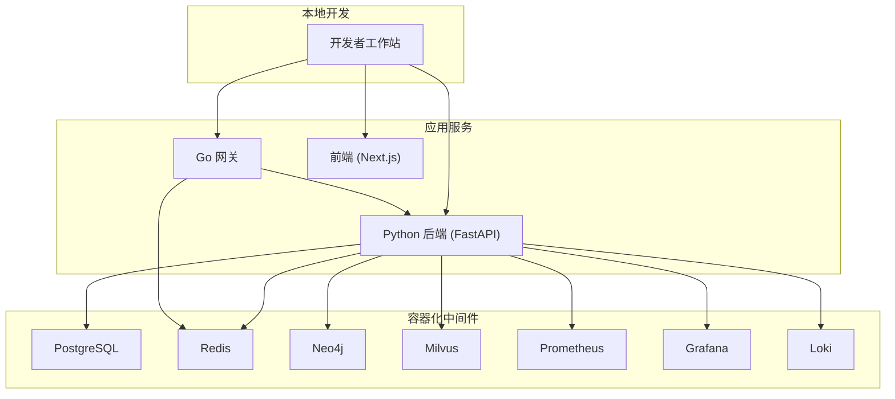
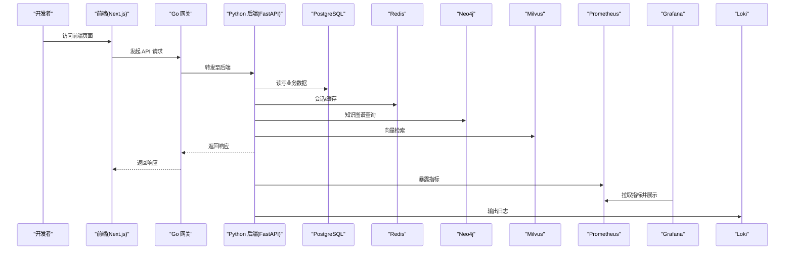
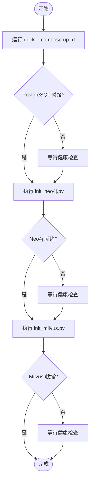
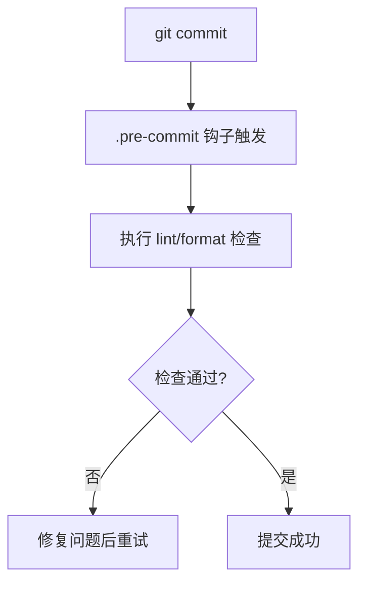
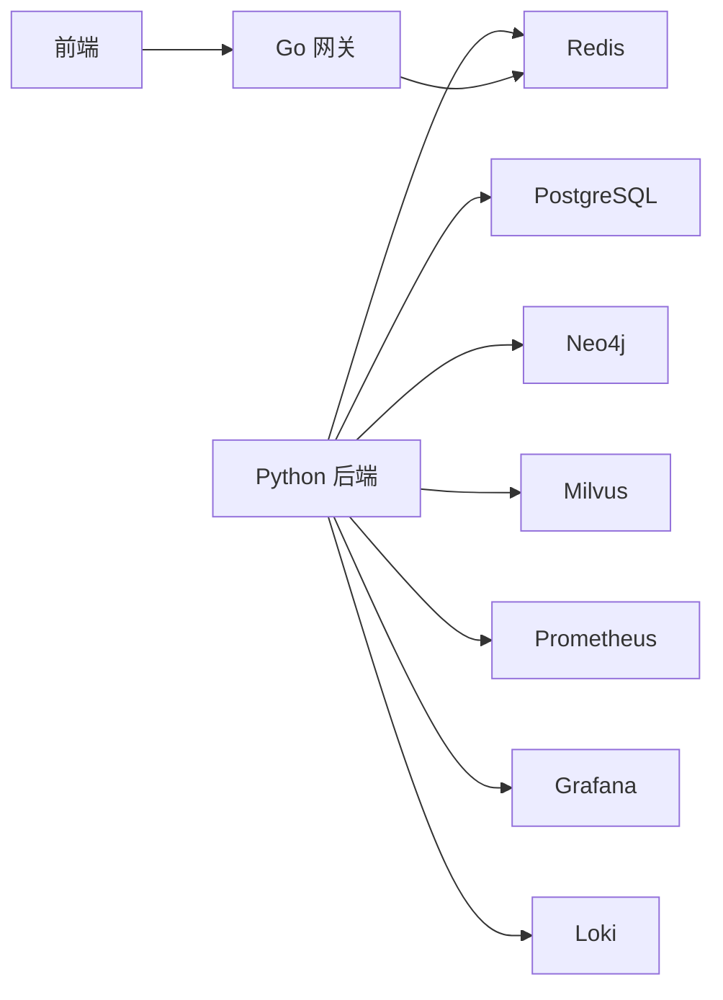

# 环境搭建

<cite>
**本文引用的文件**   
- [docker-compose.yml](file://docker-compose.yml)
- [backend_design/pyproject.toml](file://backend_design/pyproject.toml)
- [backend_design/requirements.txt](file://backend_design/requirements.txt)
- [backend_design/requirements_no_torch.txt](file://backend_design/requirements_no_torch.txt)
- [frontend_design/package.json](file://frontend_design/package.json)
- [backend_design/nexus_gate/go.mod](file://backend_design/nexus_gate/go.mod)
- [backend_design/scripts/init_milvus.py](file://backend_design/scripts/init_milvus.py)
- [backend_design/scripts/init_neo4j.py](file://backend_design/scripts/init_neo4j.py)
- [config/grafana/provisioning/datasources/prometheus.yml](file://config/grafana/provisioning/datasources/prometheus.yml)
- [config/grafana/provisioning/dashboards/dashboards.yml](file://config/grafana/provisioning/dashboards/dashboards.yml)
- [config/grafana/provisioning/dashboards/nexuscockpit-overview.json](file://config/grafana/provisioning/dashboards/nexuscockpit-overview.json)
- [config/loki/loki-config.yml](file://config/loki/loki-config.yml)
- [config/prometheus/prometheus.yml](file://config/prometheus/prometheus.yml)
- [.pre-commit-config.yaml](file://.pre-commit-config.yaml)
- [Makefile](file://Makefile)
- [scripts/start-backend.ps1](file://scripts/start-backend.ps1)
- [scripts/start-frontend.ps1](file://scripts/start-frontend.ps1)
- [scripts/start-gateway.ps1](file://scripts/start-gateway.ps1)
- [README.md](file://README.md)
</cite>

## 目录
1. [简介](#简介)
2. [项目结构](#项目结构)
3. [核心组件](#核心组件)
4. [架构总览](#架构总览)
5. [详细组件分析](#详细组件分析)
6. [依赖分析](#依赖分析)
7. [性能考虑](#性能考虑)
8. [故障排查指南](#故障排查指南)
9. [结论](#结论)
10. [附录](#附录)

## 简介
本指南面向首次接触 NexusCockpit 的开发者，提供从零到一的环境搭建说明。内容覆盖：
- 基础运行环境（Python、Node.js、Go）与版本建议
- 依赖管理（Python 虚拟环境、npm、Go 模块）
- 本地中间件与服务启动（PostgreSQL、Redis、Neo4j、Milvus、Prometheus/Grafana/Loki）
- 开发工具链（IDE、格式化、预提交钩子）
- 常见问题定位与解决

## 项目结构
NexusCockpit 采用前后端分离与多语言服务组合：
- 后端主服务：Python（FastAPI），位于 backend_design/nexus
- 网关服务：Go，位于 backend_design/nexus_gate
- 前端应用：Next.js，位于 frontend_design
- 基础设施编排：docker-compose.yml
- 可观测性配置：config 目录下的 Prometheus/Grafana/Loki 配置
- 脚本与工具：scripts、Makefile、.pre-commit-config.yaml

[本节为概念性概览，不直接分析具体文件，故无“章节来源”]

## 核心组件
- Python 后端
  - 依赖声明：pyproject.toml、requirements.txt、requirements_no_torch.txt
  - 入口与路由：backend_design/nexus/api/*
  - 中间件与缓存：backend_design/nexus/middleware/*
  - 向量检索与图数据库集成：backend_design/nexus/rag/*
- Go 网关
  - 模块与依赖：backend_design/nexus_gate/go.mod
  - 鉴权、限流、代理、WebSocket 等能力
- 前端
  - 包管理与构建：frontend_design/package.json
- 基础设施
  - 容器编排：docker-compose.yml
  - 可观测性：config 下 prometheus、grafana、loki 配置
  - 初始化脚本：backend_design/scripts/init_milvus.py、init_neo4j.py
- 开发与质量
  - 预提交钩子：.pre-commit-config.yaml
  - 常用命令：Makefile
  - Windows 快速启动脚本：scripts/*.ps1

**章节来源**
- [backend_design/pyproject.toml](file://backend_design/pyproject.toml)
- [backend_design/requirements.txt](file://backend_design/requirements.txt)
- [backend_design/requirements_no_torch.txt](file://backend_design/requirements_no_torch.txt)
- [backend_design/nexus_gate/go.mod](file://backend_design/nexus_gate/go.mod)
- [frontend_design/package.json](file://frontend_design/package.json)
- [docker-compose.yml](file://docker-compose.yml)
- [config/grafana/provisioning/datasources/prometheus.yml](file://config/grafana/provisioning/datasources/prometheus.yml)
- [config/grafana/provisioning/dashboards/dashboards.yml](file://config/grafana/provisioning/dashboards/dashboards.yml)
- [config/grafana/provisioning/dashboards/nexuscockpit-overview.json](file://config/grafana/provisioning/dashboards/nexuscockpit-overview.json)
- [config/loki/loki-config.yml](file://config/loki/loki-config.yml)
- [config/prometheus/prometheus.yml](file://config/prometheus/prometheus.yml)
- [backend_design/scripts/init_milvus.py](file://backend_design/scripts/init_milvus.py)
- [backend_design/scripts/init_neo4j.py](file://backend_design/scripts/init_neo4j.py)
- [.pre-commit-config.yaml](file://.pre-commit-config.yaml)
- [Makefile](file://Makefile)
- [scripts/start-backend.ps1](file://scripts/start-backend.ps1)
- [scripts/start-frontend.ps1](file://scripts/start-frontend.ps1)
- [scripts/start-gateway.ps1](file://scripts/start-gateway.ps1)

## 架构总览
下图展示了本地开发时各服务的交互关系与数据流向。

**图表来源**
- [docker-compose.yml](file://docker-compose.yml)
- [config/prometheus/prometheus.yml](file://config/prometheus/prometheus.yml)
- [config/grafana/provisioning/datasources/prometheus.yml](file://config/grafana/provisioning/datasources/prometheus.yml)
- [config/grafana/provisioning/dashboards/dashboards.yml](file://config/grafana/provisioning/dashboards/dashboards.yml)
- [config/grafana/provisioning/dashboards/nexuscockpit-overview.json](file://config/grafana/provisioning/dashboards/nexuscockpit-overview.json)
- [config/loki/loki-config.yml](file://config/loki/loki-config.yml)

**章节来源**
- [docker-compose.yml](file://docker-compose.yml)
- [config/prometheus/prometheus.yml](file://config/prometheus/prometheus.yml)
- [config/grafana/provisioning/datasources/prometheus.yml](file://config/grafana/provisioning/datasources/prometheus.yml)
- [config/grafana/provisioning/dashboards/dashboards.yml](file://config/grafana/provisioning/dashboards/dashboards.yml)
- [config/grafana/provisioning/dashboards/nexuscockpit-overview.json](file://config/grafana/provisioning/dashboards/nexuscockpit-overview.json)
- [config/loki/loki-config.yml](file://config/loki/loki-config.yml)

## 详细组件分析

### 基础环境与依赖安装
- Python
  - 建议使用 Python 3.10+（以 pyproject.toml 中声明为准）
  - 创建虚拟环境并安装依赖：
    - 使用 pyproject.toml 或 requirements.txt 进行依赖管理
    - 可选轻量依赖集：requirements_no_torch.txt（无需 Torch 的场景）
- Node.js
  - 建议使用 LTS 版本（以 package.json 中 engines 或团队约定为准）
  - 使用 npm 安装前端依赖
- Go
  - 建议使用 Go 1.21+（以 nexus_gate/go.mod 中 go 版本声明为准）
  - 通过 go mod tidy 同步依赖

**章节来源**
- [backend_design/pyproject.toml](file://backend_design/pyproject.toml)
- [backend_design/requirements.txt](file://backend_design/requirements.txt)
- [backend_design/requirements_no_torch.txt](file://backend_design/requirements_no_torch.txt)
- [frontend_design/package.json](file://frontend_design/package.json)
- [backend_design/nexus_gate/go.mod](file://backend_design/nexus_gate/go.mod)

### 依赖管理详解
- Python
  - 推荐基于 pyproject.toml 的依赖管理；如需最小化安装，可使用 requirements_no_torch.txt
  - 安装流程：创建 venv -> 激活 -> pip install -r requirements.txt（或 pyproject 对应方式）
- Node.js
  - 使用 npm install 安装依赖；构建与开发命令参考 package.json
- Go
  - 在 backend_design/nexus_gate 目录下执行 go mod download / go mod tidy

**章节来源**
- [backend_design/pyproject.toml](file://backend_design/pyproject.toml)
- [backend_design/requirements.txt](file://backend_design/requirements.txt)
- [backend_design/requirements_no_torch.txt](file://backend_design/requirements_no_torch.txt)
- [frontend_design/package.json](file://frontend_design/package.json)
- [backend_design/nexus_gate/go.mod](file://backend_design/nexus_gate/go.mod)

### 中间件与数据库本地启动
- 一键启动所有中间件与服务
  - 使用 docker-compose 启动 PostgreSQL、Redis、Neo4j、Milvus、Prometheus、Grafana、Loki 等
- 初始化脚本
  - Milvus 集合/索引初始化：backend_design/scripts/init_milvus.py
  - Neo4j 图数据库初始化：backend_design/scripts/init_neo4j.py
- 可观测性
  - Prometheus 抓取配置：config/prometheus/prometheus.yml
  - Grafana 数据源与仪表盘：config/grafana/provisioning/datasources/prometheus.yml、dashboards.yml、nexuscockpit-overview.json
  - Loki 日志采集：config/loki/loki-config.yml

**图表来源**
- [docker-compose.yml](file://docker-compose.yml)
- [backend_design/scripts/init_neo4j.py](file://backend_design/scripts/init_neo4j.py)
- [backend_design/scripts/init_milvus.py](file://backend_design/scripts/init_milvus.py)

**章节来源**
- [docker-compose.yml](file://docker-compose.yml)
- [backend_design/scripts/init_milvus.py](file://backend_design/scripts/init_milvus.py)
- [backend_design/scripts/init_neo4j.py](file://backend_design/scripts/init_neo4j.py)
- [config/prometheus/prometheus.yml](file://config/prometheus/prometheus.yml)
- [config/grafana/provisioning/datasources/prometheus.yml](file://config/grafana/provisioning/datasources/prometheus.yml)
- [config/grafana/provisioning/dashboards/dashboards.yml](file://config/grafana/provisioning/dashboards/dashboards.yml)
- [config/grafana/provisioning/dashboards/nexuscockpit-overview.json](file://config/grafana/provisioning/dashboards/nexuscockpit-overview.json)
- [config/loki/loki-config.yml](file://config/loki/loki-config.yml)

### 开发工具链配置
- IDE 建议
  - Python：启用 PEP8 风格检查、自动格式化（如 Black/isort）、类型提示检查（mypy）
  - Go：启用 gopls、goimports、golangci-lint
  - 前端：ESLint + Prettier、TypeScript 严格模式
- 代码格式化与检查
  - 统一使用 Makefile 提供的命令（lint/format/test）
- 预提交钩子
  - 使用 .pre-commit-config.yaml 在提交前执行格式化和检查任务
- 快速启动脚本（Windows）
  - scripts/start-backend.ps1、scripts/start-frontend.ps1、scripts/start-gateway.ps1

**图表来源**
- [.pre-commit-config.yaml](file://.pre-commit-config.yaml)
- [Makefile](file://Makefile)

**章节来源**
- [.pre-commit-config.yaml](file://.pre-commit-config.yaml)
- [Makefile](file://Makefile)
- [scripts/start-backend.ps1](file://scripts/start-backend.ps1)
- [scripts/start-frontend.ps1](file://scripts/start-frontend.ps1)
- [scripts/start-gateway.ps1](file://scripts/start-gateway.ps1)

### 本地运行与验证
- 启动中间件
  - 使用 docker-compose 启动全部依赖服务
- 启动后端
  - 进入 backend_design，激活 Python 虚拟环境，运行后端服务
- 启动网关
  - 进入 backend_design/nexus_gate，编译并运行 Go 网关
- 启动前端
  - 进入 frontend_design，安装依赖并启动开发服务器
- 验证
  - 访问前端页面，调用 API，确认指标与日志正常

**章节来源**
- [docker-compose.yml](file://docker-compose.yml)
- [backend_design/pyproject.toml](file://backend_design/pyproject.toml)
- [backend_design/nexus_gate/go.mod](file://backend_design/nexus_gate/go.mod)
- [frontend_design/package.json](file://frontend_design/package.json)
- [README.md](file://README.md)

## 依赖分析
- 外部依赖
  - 数据库与存储：PostgreSQL、Redis、Neo4j、Milvus
  - 可观测性：Prometheus、Grafana、Loki
- 内部依赖
  - Python 后端依赖由 pyproject.toml 与 requirements*.txt 管理
  - Go 网关依赖由 go.mod 管理
  - 前端依赖由 package.json 管理

**图表来源**
- [docker-compose.yml](file://docker-compose.yml)
- [backend_design/pyproject.toml](file://backend_design/pyproject.toml)
- [backend_design/requirements.txt](file://backend_design/requirements.txt)
- [backend_design/requirements_no_torch.txt](file://backend_design/requirements_no_torch.txt)
- [backend_design/nexus_gate/go.mod](file://backend_design/nexus_gate/go.mod)
- [frontend_design/package.json](file://frontend_design/package.json)

**章节来源**
- [docker-compose.yml](file://docker-compose.yml)
- [backend_design/pyproject.toml](file://backend_design/pyproject.toml)
- [backend_design/requirements.txt](file://backend_design/requirements.txt)
- [backend_design/requirements_no_torch.txt](file://backend_design/requirements_no_torch.txt)
- [backend_design/nexus_gate/go.mod](file://backend_design/nexus_gate/go.mod)
- [frontend_design/package.json](file://frontend_design/package.json)

## 性能考虑
- 资源分配
  - 为 Docker 容器合理分配 CPU/内存，避免 OOM
- 网络与端口
  - 确保宿主机端口未被占用，避免服务启动失败
- 磁盘空间
  - 向量数据库与图数据库会增长数据体积，预留足够空间
- 依赖下载
  - 使用国内镜像加速 pip/npm/go 依赖下载，提升安装速度

[本节为通用指导，不直接分析具体文件，故无“章节来源”]

## 故障排查指南
- 无法连接数据库/中间件
  - 检查 docker-compose 是否成功启动对应服务
  - 核对服务端口与地址配置
- 初始化脚本失败
  - 确认目标服务已就绪后再执行 init_neo4j.py、init_milvus.py
- 前端无法访问后端
  - 检查网关与后端是否同时运行，跨域与代理配置是否正确
- 指标与日志缺失
  - 检查 Prometheus 抓取配置、Grafana 数据源与仪表盘加载情况
  - 检查 Loki 配置与日志输出路径

**章节来源**
- [docker-compose.yml](file://docker-compose.yml)
- [backend_design/scripts/init_neo4j.py](file://backend_design/scripts/init_neo4j.py)
- [backend_design/scripts/init_milvus.py](file://backend_design/scripts/init_milvus.py)
- [config/prometheus/prometheus.yml](file://config/prometheus/prometheus.yml)
- [config/grafana/provisioning/datasources/prometheus.yml](file://config/grafana/provisioning/datasources/prometheus.yml)
- [config/grafana/provisioning/dashboards/dashboards.yml](file://config/grafana/provisioning/dashboards/dashboards.yml)
- [config/grafana/provisioning/dashboards/nexuscockpit-overview.json](file://config/grafana/provisioning/dashboards/nexuscockpit-overview.json)
- [config/loki/loki-config.yml](file://config/loki/loki-config.yml)

## 结论
按照本指南完成基础环境、依赖管理、中间件与开发工具链的配置后，即可在本地完整运行 NexusCockpit。若遇到问题，优先检查容器状态、端口占用、初始化顺序与可观测性配置。

[本节为总结性内容，不直接分析具体文件，故无“章节来源”]

## 附录
- 常用命令
  - 使用 Makefile 提供的命令进行格式化、检查与测试
  - Windows 用户可使用 scripts/*.ps1 快速启动各服务
- 参考文档
  - README.md 中的总体说明与链接

**章节来源**
- [Makefile](file://Makefile)
- [scripts/start-backend.ps1](file://scripts/start-backend.ps1)
- [scripts/start-frontend.ps1](file://scripts/start-frontend.ps1)
- [scripts/start-gateway.ps1](file://scripts/start-gateway.ps1)
- [README.md](file://README.md)