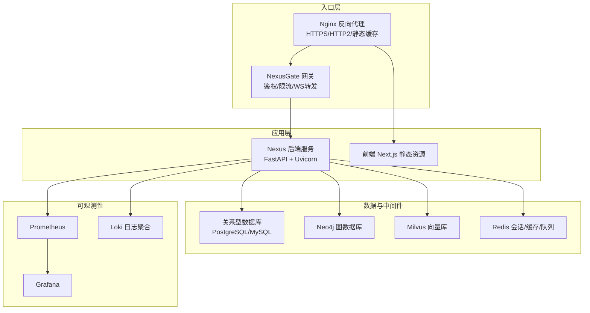
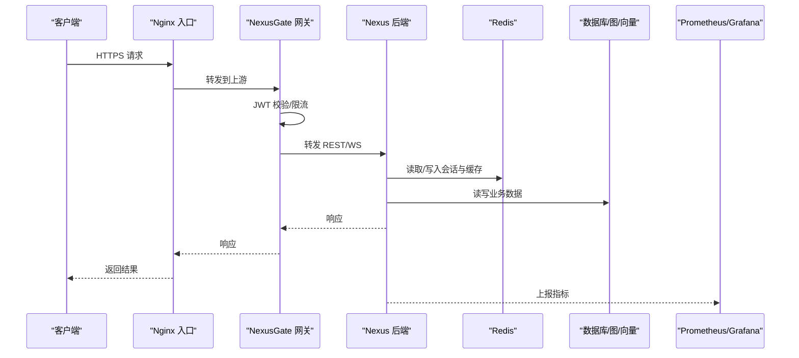
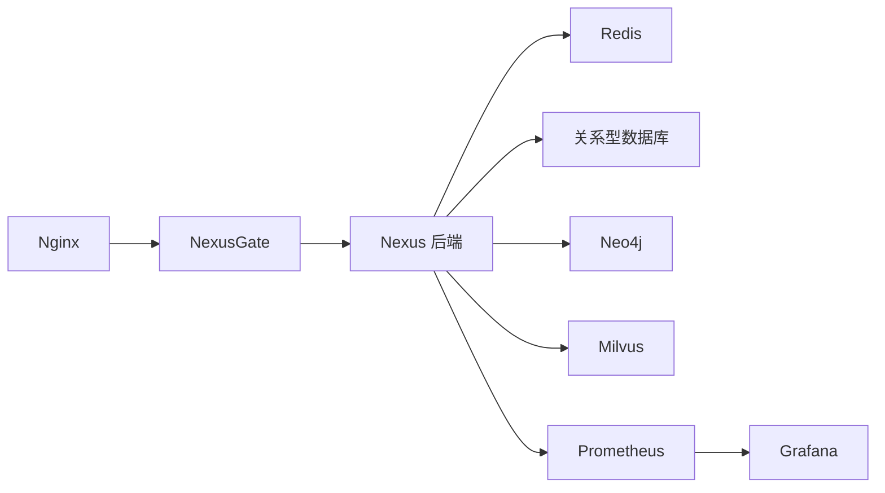

# 生产环境部署

<cite>
**本文引用的文件**   
- [docker-compose.yml](file://docker-compose.yml)
- [backend_design/nexus/main.py](file://backend_design/nexus/main.py)
- [backend_design/nexus/config.py](file://backend_design/nexus/config.py)
- [backend_design/nexus/core/logger.py](file://backend_design/nexus/core/logger.py)
- [backend_design/nexus/observability/metrics.py](file://backend_design/nexus/observability/metrics.py)
- [backend_design/nexus/observability/cockpit_metrics.py](file://backend_design/nexus/observability/cockpit_metrics.py)
- [backend_design/nexus/middleware/rate_limiter.py](file://backend_design/nexus/middleware/rate_limiter.py)
- [backend_design/nexus/middleware/session_store.py](file://backend_design/nexus/middleware/session_store.py)
- [backend_design/nexus_gate/internal/proxy/proxy.go](file://backend_design/nexus_gate/internal/proxy/proxy.go)
- [backend_design/nexus_gate/internal/auth/jwt.go](file://backend_design/nexus_gate/internal/auth/jwt.go)
- [backend_design/nexus_gate/internal/ratelimit/ratelimit.go](file://backend_design/nexus_gate/internal/ratelimit/ratelimit.go)
- [config/prometheus/prometheus.yml](file://config/prometheus/prometheus.yml)
- [config/grafana/provisioning/datasources/prometheus.yml](file://config/grafana/provisioning/datasources/prometheus.yml)
- [config/grafana/provisioning/dashboards/dashboards.yml](file://config/grafana/provisioning/dashboards/dashboards.yml)
- [config/grafana/provisioning/dashboards/nexuscockpit-overview.json](file://config/grafana/provisioning/dashboards/nexuscockpit-overview.json)
- [config/nginx/](file://config/nginx/)
- [backend_design/Dockerfile](file://backend_design/Dockerfile)
- [frontend_design/Dockerfile](file://frontend_design/Dockerfile)
- [backend_design/nexus/api/websocket.py](file://backend_design/nexus/api/websocket.py)
- [backend_design/nexus/core/db_manager.py](file://backend_design/nexus/core/db_manager.py)
- [backend_design/nexus/core/personalization.py](file://backend_design/nexus/core/personalization.py)
- [backend_design/nexus/memory/conflict.py](file://backend_design/nexus/memory/conflict.py)
- [backend_design/nexus/memory/manager.py](file://backend_design/nexus/memory/manager.py)
- [backend_design/scripts/init_neo4j.py](file://backend_design/scripts/init_neo4j.py)
- [backend_design/scripts/init_milvus.py](file://backend_design/scripts/init_milvus.py)
</cite>

## 目录
1. [简介](#简介)
2. [项目结构](#项目结构)
3. [核心组件](#核心组件)
4. [架构总览](#架构总览)
5. [详细组件分析](#详细组件分析)
6. [依赖关系分析](#依赖关系分析)
7. [性能考虑](#性能考虑)
8. [故障排查指南](#故障排查指南)
9. [结论](#结论)
10. [附录](#附录)

## 简介
本指南面向生产环境的 NexusCockpit 系统，提供端到端部署与运维建议。内容覆盖反向代理（Nginx）负载均衡、SSL 证书与静态资源缓存、高可用多实例部署与故障转移、数据同步策略、安全加固（防火墙、访问控制、审计日志）、性能优化（连接池、内存、磁盘 IO），以及监控告警（Prometheus 指标采集、Grafana 仪表板、告警规则）。文档同时给出基于仓库现有配置的可落地方案与扩展建议。

## 项目结构
仓库采用前后端分离与网关分层设计：
- 后端服务：Python FastAPI 应用，包含 API、中间件、可观测性、RAG、记忆、技能等模块。
- 网关服务：Go 实现的轻量网关，负责鉴权、限流、反向代理与 WebSocket 转发。
- 前端：Next.js 应用，构建后由 Nginx 或容器化方式提供服务。
- 基础设施：Docker Compose 编排，Prometheus/Grafana/Loki 可观测性栈，Neo4j/Milvus 向量与图数据库初始化脚本。

图表来源
- [docker-compose.yml](file://docker-compose.yml)
- [backend_design/nexus/main.py](file://backend_design/nexus/main.py)
- [backend_design/nexus_gate/internal/proxy/proxy.go](file://backend_design/nexus_gate/internal/proxy/proxy.go)
- [config/prometheus/prometheus.yml](file://config/prometheus/prometheus.yml)
- [config/grafana/provisioning/datasources/prometheus.yml](file://config/grafana/provisioning/datasources/prometheus.yml)

章节来源
- [docker-compose.yml](file://docker-compose.yml)
- [backend_design/Dockerfile](file://backend_design/Dockerfile)
- [frontend_design/Dockerfile](file://frontend_design/Dockerfile)

## 核心组件
- 反向代理与网关
  - Nginx：统一入口、TLS 终止、静态资源缓存、WebSocket 透传、请求头改写。
  - NexusGate：JWT 校验、令牌刷新、速率限制、路径路由、WebSocket Hub 转发。
- 后端服务
  - FastAPI 应用：REST/WebSocket 接口、业务逻辑、中间件（限流、会话存储）、可观测性埋点。
  - 配置中心：集中式配置加载与环境变量注入。
- 可观测性
  - Prometheus：抓取应用指标与系统指标。
  - Grafana：数据源与仪表板预置。
  - Loki：结构化日志收集与检索。
- 数据与中间件
  - Redis：会话、缓存、任务队列、分布式锁。
  - Neo4j/Milvus：知识图谱与向量检索。
  - 关系型数据库：持久化业务数据。

章节来源
- [backend_design/nexus/main.py](file://backend_design/nexus/main.py)
- [backend_design/nexus/config.py](file://backend_design/nexus/config.py)
- [backend_design/nexus/observability/metrics.py](file://backend_design/nexus/observability/metrics.py)
- [backend_design/nexus/observability/cockpit_metrics.py](file://backend_design/nexus/observability/cockpit_metrics.py)
- [backend_design/nexus/middleware/rate_limiter.py](file://backend_design/nexus/middleware/rate_limiter.py)
- [backend_design/nexus/middleware/session_store.py](file://backend_design/nexus/middleware/session_store.py)
- [backend_design/nexus_gate/internal/proxy/proxy.go](file://backend_design/nexus_gate/internal/proxy/proxy.go)
- [backend_design/nexus_gate/internal/auth/jwt.go](file://backend_design/nexus_gate/internal/auth/jwt.go)
- [backend_design/nexus_gate/internal/ratelimit/ratelimit.go](file://backend_design/nexus_gate/internal/ratelimit/ratelimit.go)
- [config/prometheus/prometheus.yml](file://config/prometheus/prometheus.yml)
- [config/grafana/provisioning/datasources/prometheus.yml](file://config/grafana/provisioning/datasources/prometheus.yml)

## 架构总览
生产环境推荐拓扑：
- 双节点或多节点 Nginx 作为入口，结合健康检查与权重轮询实现负载均衡。
- 多实例 Nexus 后端无状态部署，共享 Redis/DB/Neo4j/Milvus。
- 网关独立部署，支持水平扩展；WebSocket 通过 Hub 进行跨进程广播。
- 可观测性集中化，Prometheus 定期抓取各服务暴露的 /metrics 端点。

图表来源
- [backend_design/nexus/main.py](file://backend_design/nexus/main.py)
- [backend_design/nexus_gate/internal/proxy/proxy.go](file://backend_design/nexus_gate/internal/proxy/proxy.go)
- [backend_design/nexus_gate/internal/auth/jwt.go](file://backend_design/nexus_gate/internal/auth/jwt.go)
- [backend_design/nexus_gate/internal/ratelimit/ratelimit.go](file://backend_design/nexus_gate/internal/ratelimit/ratelimit.go)
- [config/prometheus/prometheus.yml](file://config/prometheus/prometheus.yml)

## 详细组件分析

### 反向代理与负载均衡（Nginx）
- 目标
  - 统一入口、TLS 终止、HTTP/2、静态资源缓存、WebSocket 透传、请求头标准化、健康检查与回退。
- 关键要点
  - 使用 upstream 定义多个 Nexus/NexusGate 实例，启用健康检查与权重。
  - 为静态资源设置长期缓存与版本化文件名，开启 gzip/brotli。
  - WebSocket 路径透传升级协议头，并设置合理的超时与缓冲。
  - 引入安全头（HSTS、CSP、X-Frame-Options 等）。
- 参考位置
  - 配置目录：[config/nginx/](file://config/nginx/)
  - 入口编排：[docker-compose.yml](file://docker-compose.yml)

章节来源
- [config/nginx/](file://config/nginx/)
- [docker-compose.yml](file://docker-compose.yml)

### SSL 证书配置
- 目标
  - 全站 HTTPS、强制重定向、证书自动续期、最小化 TLS 版本与套件。
- 关键要点
  - 使用 Let's Encrypt 或企业 CA 签发证书，挂载至 Nginx 容器卷。
  - 配置 HSTS、OCSP Stapling、SNI 多域名支持。
  - 在网关层不重复做 TLS 终止，避免双重加解密开销。
- 参考位置
  - 入口编排：[docker-compose.yml](file://docker-compose.yml)
  - 后端 SSL 修复（兼容层）：[backend_design/nexus/core/ssl_fix.py](file://backend_design/nexus/core/ssl_fix.py)

章节来源
- [docker-compose.yml](file://docker-compose.yml)
- [backend_design/nexus/core/ssl_fix.py](file://backend_design/nexus/core/ssl_fix.py)

### 静态资源缓存
- 目标
  - 提升前端加载性能，降低后端压力。
- 关键要点
  - 对 JS/CSS/图片设置长缓存与 ETag/Last-Modified。
  - 使用 CDN 或边缘缓存，配合版本号或哈希文件名。
  - 针对大体积模型或媒体资源，启用分块下载与断点续传。
- 参考位置
  - 入口编排：[docker-compose.yml](file://docker-compose.yml)
  - 前端构建产物：[frontend_design/Dockerfile](file://frontend_design/Dockerfile)

章节来源
- [docker-compose.yml](file://docker-compose.yml)
- [frontend_design/Dockerfile](file://frontend_design/Dockerfile)

### 高可用架构设计
- 多实例部署
  - 后端与网关均无状态，按 CPU/内存配额水平扩展。
  - 使用容器编排（Kubernetes/Docker Swarm）或 VM 集群+Nginx 上游。
- 故障转移
  - Nginx 健康检查剔除异常节点；网关侧熔断与重试策略。
  - 后端中间件具备降级能力（如缓存不可用时走直查）。
- 数据同步
  - 会话与缓存：Redis 主从或哨兵/Cluster。
  - 图/向量：Neo4j 集群、Milvus 副本集；定期备份与一致性校验。
  - 关系型数据库：主从复制+读写分离，必要时引入只读副本。
- 参考位置
  - 编排：[docker-compose.yml](file://docker-compose.yml)
  - 会话存储：[backend_design/nexus/middleware/session_store.py](file://backend_design/nexus/middleware/session_store.py)
  - 冲突处理与记忆管理：[backend_design/nexus/memory/conflict.py](file://backend_design/nexus/memory/conflict.py), [backend_design/nexus/memory/manager.py](file://backend_design/nexus/memory/manager.py)
  - 数据库初始化：[backend_design/scripts/init_neo4j.py](file://backend_design/scripts/init_neo4j.py), [backend_design/scripts/init_milvus.py](file://backend_design/scripts/init_milvus.py)

章节来源
- [docker-compose.yml](file://docker-compose.yml)
- [backend_design/nexus/middleware/session_store.py](file://backend_design/nexus/middleware/session_store.py)
- [backend_design/nexus/memory/conflict.py](file://backend_design/nexus/memory/conflict.py)
- [backend_design/nexus/memory/manager.py](file://backend_design/nexus/memory/manager.py)
- [backend_design/scripts/init_neo4j.py](file://backend_design/scripts/init_neo4j.py)
- [backend_design/scripts/init_milvus.py](file://backend/design/scripts/init_milvus.py)

### 安全加固措施
- 防火墙与网络隔离
  - 仅开放 80/443 给公网，内部端口（数据库、Redis、消息队列）仅内网互通。
  - 使用 VPC/子网划分与网络安全组。
- 访问控制
  - 网关层 JWT 校验、权限校验、IP 白名单、请求签名。
  - 后端中间件二次校验，敏感接口增加 MFA 或设备指纹。
- 审计日志
  - 统一接入结构化日志，记录用户、操作、时间、来源 IP、结果码。
  - 日志脱敏（密码、Token、PII），落盘加密与远程归档。
- 参考位置
  - 网关鉴权：[backend_design/nexus_gate/internal/auth/jwt.go](file://backend_design/nexus_gate/internal/auth/jwt.go)
  - 网关限流：[backend_design/nexus_gate/internal/ratelimit/ratelimit.go](file://backend_design/nexus_gate/internal/ratelimit/ratelimit.go)
  - 后端限流：[backend_design/nexus/middleware/rate_limiter.py](file://backend_design/nexus/middleware/rate_limiter.py)
  - 日志配置：[backend_design/nexus/core/logger.py](file://backend_design/nexus/core/logger.py)

章节来源
- [backend_design/nexus_gate/internal/auth/jwt.go](file://backend_design/nexus_gate/internal/auth/jwt.go)
- [backend_design/nexus_gate/internal/ratelimit/ratelimit.go](file://backend_design/nexus_gate/internal/ratelimit/ratelimit.go)
- [backend_design/nexus/middleware/rate_limiter.py](file://backend_design/nexus/middleware/rate_limiter.py)
- [backend_design/nexus/core/logger.py](file://backend_design/nexus/core/logger.py)

### 性能优化配置
- 连接池调优
  - 数据库连接池：根据并发与延迟目标调整最大连接数、空闲回收、超时。
  - Redis 连接池：批量命令、Pipeline、KeepAlive。
  - 外部服务调用：HTTP 客户端连接复用与超时控制。
- 内存管理
  - Python GIL 与线程/进程模型：按需使用多进程 Worker。
  - 对象池与大对象释放：避免内存泄漏，合理 GC 参数。
  - 前端资源压缩与懒加载。
- 磁盘 IO 优化
  - 日志与临时文件落盘策略：异步写入、分区滚动、冷热分离。
  - 向量/图索引预热与定期重建。
- 参考位置
  - 后端启动与中间件：[backend_design/nexus/main.py](file://backend_design/nexus/main.py)
  - 配置加载：[backend_design/nexus/config.py](file://backend_design/nexus/config.py)
  - 会话存储：[backend_design/nexus/middleware/session_store.py](file://backend_design/nexus/middleware/session_store.py)
  - 个性化与偏好：[backend_design/nexus/core/personalization.py](file://backend_design/nexus/core/personalization.py)

章节来源
- [backend_design/nexus/main.py](file://backend_design/nexus/main.py)
- [backend_design/nexus/config.py](file://backend_design/nexus/config.py)
- [backend_design/nexus/middleware/session_store.py](file://backend_design/nexus/middleware/session_store.py)
- [backend_design/nexus/core/personalization.py](file://backend_design/nexus/core/personalization.py)

### 监控告警配置
- Prometheus 指标采集
  - 应用暴露 /metrics 端点，Prometheus 定时抓取。
  - 自定义业务指标（对话成功率、ASR/TTS 耗时、RAG 召回率等）。
- Grafana 仪表板
  - 数据源指向 Prometheus，导入预置仪表板。
  - 关键面板：QPS、P95/P99 延迟、错误率、GC、连接池、缓存命中率。
- 告警规则
  - 阈值告警：错误率、延迟、资源使用率、下游依赖异常。
  - 趋势告警：容量增长、慢查询增多、向量索引退化。
- 参考位置
  - Prometheus 抓取配置：[config/prometheus/prometheus.yml](file://config/prometheus/prometheus.yml)
  - Grafana 数据源：[config/grafana/provisioning/datasources/prometheus.yml](file://config/grafana/provisioning/datasources/prometheus.yml)
  - Grafana 仪表板清单：[config/grafana/provisioning/dashboards/dashboards.yml](file://config/grafana/provisioning/dashboards/dashboards.yml)
  - 预置仪表板 JSON：[config/grafana/provisioning/dashboards/nexuscockpit-overview.json](file://config/grafana/provisioning/dashboards/nexuscockpit-overview.json)
  - 应用指标导出：[backend_design/nexus/observability/metrics.py](file://backend_design/nexus/observability/metrics.py), [backend_design/nexus/observability/cockpit_metrics.py](file://backend_design/nexus/observability/cockpit_metrics.py)

章节来源
- [config/prometheus/prometheus.yml](file://config/prometheus/prometheus.yml)
- [config/grafana/provisioning/datasources/prometheus.yml](file://config/grafana/provisioning/datasources/prometheus.yml)
- [config/grafana/provisioning/dashboards/dashboards.yml](file://config/grafana/provisioning/dashboards/dashboards.yml)
- [config/grafana/provisioning/dashboards/nexuscockpit-overview.json](file://config/grafana/provisioning/dashboards/nexuscockpit-overview.json)
- [backend_design/nexus/observability/metrics.py](file://backend_design/nexus/observability/metrics.py)
- [backend_design/nexus/observability/cockpit_metrics.py](file://backend_design/nexus/observability/cockpit_metrics.py)

### WebSocket 与实时通信
- 目标
  - 稳定可靠的实时消息通道，支持跨实例广播与断线重连。
- 关键要点
  - 网关层维护 Hub，转发 WS 帧至后端；后端按房间/会话分发。
  - 心跳检测、背压控制、消息去重与幂等。
  - 前端重连指数退避与状态恢复。
- 参考位置
  - 后端 WS 接口：[backend_design/nexus/api/websocket.py](file://backend_design/nexus/api/websocket.py)
  - 网关 WS 转发：[backend_design/nexus_gate/internal/ws/hub.go](file://backend_design/nexus_gate/internal/ws/hub.go)

章节来源
- [backend_design/nexus/api/websocket.py](file://backend_design/nexus/api/websocket.py)
- [backend_design/nexus_gate/internal/ws/hub.go](file://backend_design/nexus_gate/internal/ws/hub.go)

## 依赖关系分析
- 组件耦合
  - Nginx 与 NexusGate 松耦合，通过 HTTP/WS 协议交互。
  - NexusGate 与后端服务解耦，便于独立扩缩容。
  - 后端依赖 Redis/DB/Neo4j/Milvus，需保证高可用与一致性。
- 外部依赖
  - 可观测性：Prometheus/Grafana/Loki。
  - 认证：JWT 密钥管理与轮换。
- 潜在循环依赖
  - 网关与后端单向依赖，避免双向调用。
- 接口契约
  - 统一鉴权头、标准错误码、分页与排序规范。

图表来源
- [docker-compose.yml](file://docker-compose.yml)
- [backend_design/nexus/main.py](file://backend_design/nexus/main.py)
- [backend_design/nexus_gate/internal/proxy/proxy.go](file://backend_design/nexus_gate/internal/proxy/proxy.go)
- [config/prometheus/prometheus.yml](file://config/prometheus/prometheus.yml)

章节来源
- [docker-compose.yml](file://docker-compose.yml)
- [backend_design/nexus/main.py](file://backend_design/nexus/main.py)
- [backend_design/nexus_gate/internal/proxy/proxy.go](file://backend_design/nexus_gate/internal/proxy/proxy.go)
- [config/prometheus/prometheus.yml](file://config/prometheus/prometheus.yml)

## 性能考虑
- 连接池
  - 数据库：max_connections、idle_timeout、statement_timeout 与连接复用。
  - Redis：pool_size、pipeline、keepalive。
  - 外部 LLM/ASR/TTS：连接复用、超时与重试退避。
- 内存
  - Python 进程数=CPU 核数×系数；大对象及时释放；禁用不必要的调试信息。
  - 前端资源分包与懒加载，CDN 加速。
- 磁盘 IO
  - 日志异步落盘、滚动策略；向量/图索引预热；热数据缓存。
- 网络
  - TCP 参数优化（backlog、tcp_tw_reuse）、HTTP/2 多路复用、gzip/brotli。
- 参考位置
  - 后端启动与中间件：[backend_design/nexus/main.py](file://backend_design/nexus/main.py)
  - 配置加载：[backend_design/nexus/config.py](file://backend_design/nexus/config.py)
  - 会话存储：[backend_design/nexus/middleware/session_store.py](file://backend_design/nexus/middleware/session_store.py)

章节来源
- [backend_design/nexus/main.py](file://backend_design/nexus/main.py)
- [backend_design/nexus/config.py](file://backend_design/nexus/config.py)
- [backend_design/nexus/middleware/session_store.py](file://backend_design/nexus/middleware/session_store.py)

## 故障排查指南
- 常见问题定位
  - 5xx 错误：查看网关与后端日志，确认鉴权失败、限流触发、下游超时。
  - WS 断开：检查心跳、Hub 状态、后端订阅者数量。
  - 指标异常：核对 Prometheus 抓取目标、Grafana 数据源连通性。
- 日志与追踪
  - 统一日志格式、关联 ID 贯穿请求链路。
  - 关键路径埋点：鉴权、路由、缓存命中、数据库/向量检索耗时。
- 参考位置
  - 日志配置：[backend_design/nexus/core/logger.py](file://backend_design/nexus/core/logger.py)
  - 指标导出：[backend_design/nexus/observability/metrics.py](file://backend_design/nexus/observability/metrics.py), [backend_design/nexus/observability/cockpit_metrics.py](file://backend_design/nexus/observability/cockpit_metrics.py)
  - 数据库连接：[backend_design/nexus/core/db_manager.py](file://backend_design/nexus/core/db_manager.py)

章节来源
- [backend_design/nexus/core/logger.py](file://backend_design/nexus/core/logger.py)
- [backend_design/nexus/observability/metrics.py](file://backend_design/nexus/observability/metrics.py)
- [backend_design/nexus/observability/cockpit_metrics.py](file://backend_design/nexus/observability/cockpit_metrics.py)
- [backend_design/nexus/core/db_manager.py](file://backend_design/nexus/core/db_manager.py)

## 结论
通过 Nginx 统一入口与 NexusGate 网关的分层设计，NexusCockpit 在生产环境可实现高可用、可扩展与安全可控。配合完善的监控告警与性能调优策略，能够保障系统在复杂场景下的稳定性与用户体验。建议在上线前完成容量规划、压测演练与应急预案验证。

## 附录
- 部署清单
  - 证书与域名、Nginx 配置、网关与后端镜像、中间件与数据库初始化脚本。
- 变更与回滚
  - 灰度发布、蓝绿切换、配置中心与镜像版本管理。
- 参考位置
  - 编排与镜像：[docker-compose.yml](file://docker-compose.yml), [backend_design/Dockerfile](file://backend_design/Dockerfile), [frontend_design/Dockerfile](file://frontend_design/Dockerfile)
  - 初始化脚本：[backend_design/scripts/init_neo4j.py](file://backend_design/scripts/init_neo4j.py), [backend_design/scripts/init_milvus.py](file://backend_design/scripts/init_milvus.py)