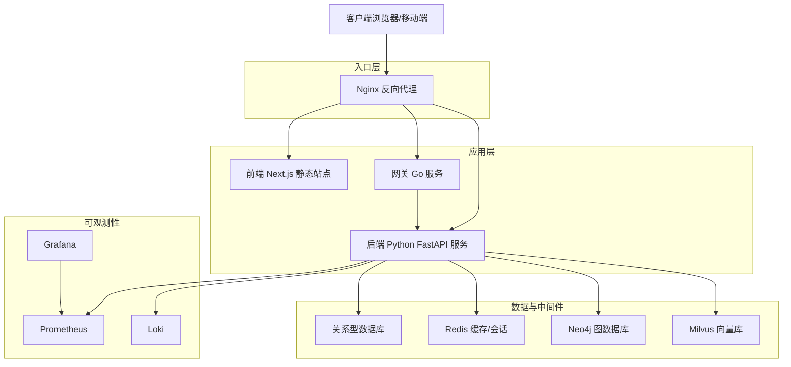
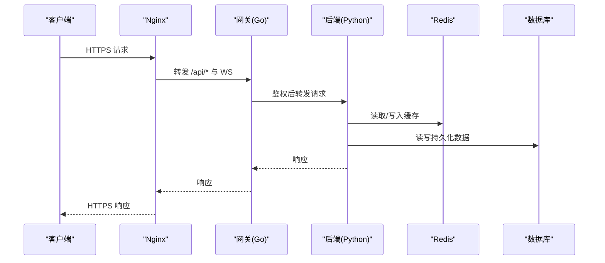
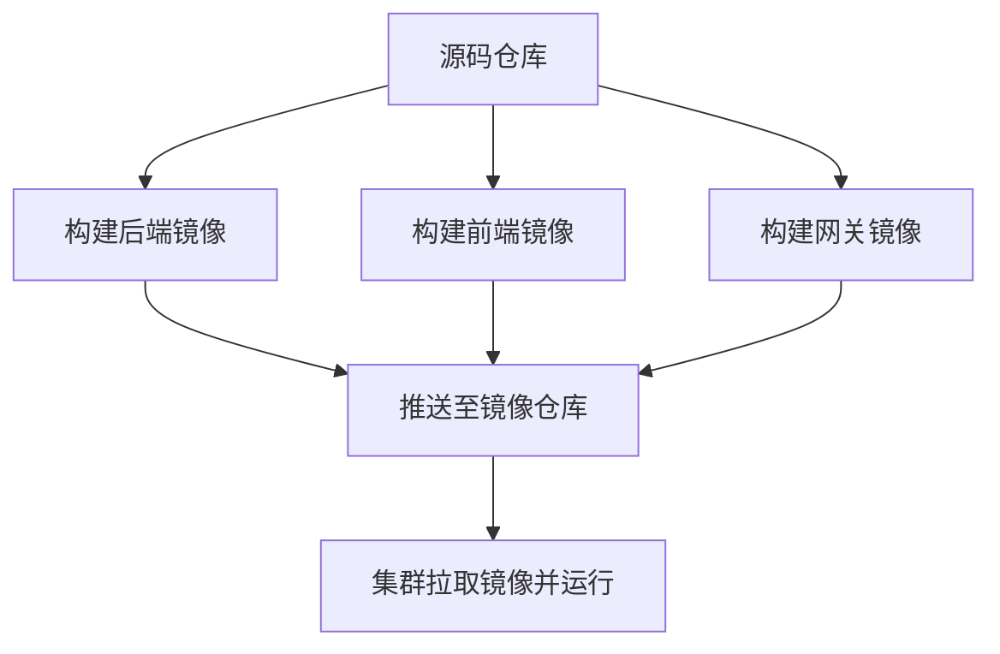
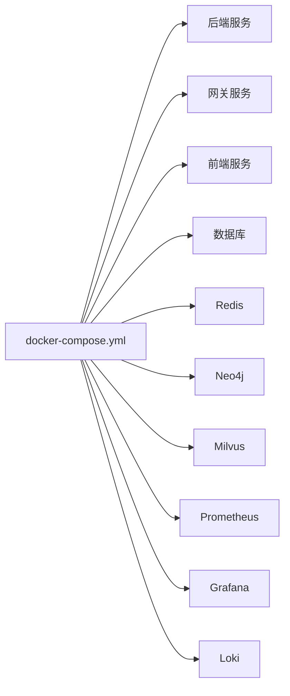
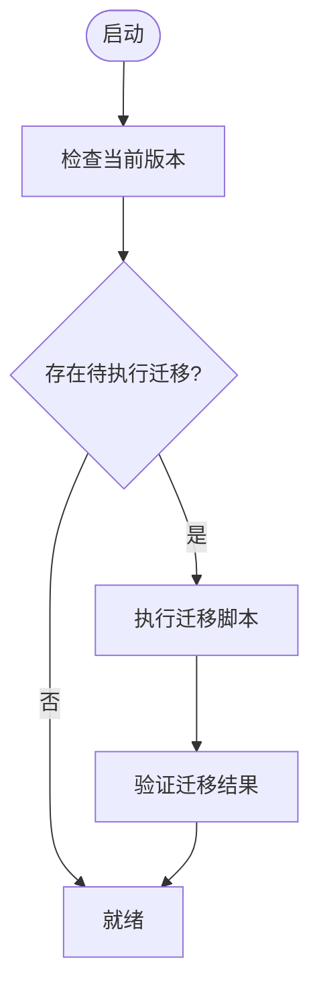
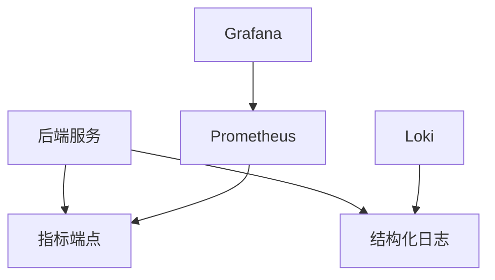
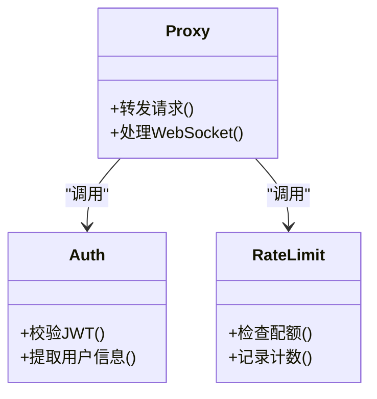
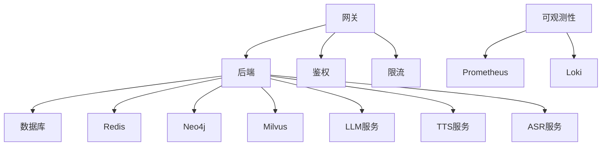
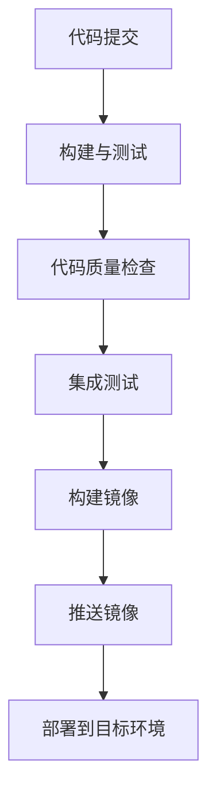

# 部署和配置

<cite>
**本文引用的文件**   
- [docker-compose.yml](file://docker-compose.yml)
- [backend_design/Dockerfile](file://backend_design/Dockerfile)
- [frontend_design/Dockerfile](file://frontend_design/Dockerfile)
- [backend_design/nexus_gate/Dockerfile](file://backend_design/nexus_gate/Dockerfile)
- [backend_design/pyproject.toml](file://backend_design/pyproject.toml)
- [backend_design/requirements.txt](file://backend_design/requirements.txt)
- [backend_design/nexus/config.py](file://backend_design/nexus/config.py)
- [backend_design/nexus/main.py](file://backend_design/nexus/main.py)
- [backend_design/nexus/core/db_manager.py](file://backend_design/nexus/core/db_manager.py)
- [backend_design/nexus/middleware/redis_cache.py](file://backend_design/nexus/middleware/redis_cache.py)
- [backend_design/nexus/api/websocket.py](file://backend_design/nexus/api/websocket.py)
- [backend_design/nexus_gate/internal/config/config.go](file://backend_design/nexus_gate/internal/config/config.go)
- [backend_design/nexus_gate/internal/proxy/proxy.go](file://backend_design/nexus_gate/internal/proxy/proxy.go)
- [backend_design/nexus_gate/internal/ratelimit/ratelimit.go](file://backend_design/nexus_gate/internal/ratelimit/ratelimit.go)
- [config/nginx/default.conf](file://config/nginx/default.conf)
- [config/prometheus/prometheus.yml](file://config/prometheus/prometheus.yml)
- [config/grafana/provisioning/datasources/prometheus.yml](file://config/grafana/provisioning/datasources/prometheus.yml)
- [config/grafana/provisioning/dashboards/dashboards.yml](file://config/grafana/provisioning/dashboards/dashboards.yml)
- [config/grafana/provisioning/dashboards/nexuscockpit-overview.json](file://config/grafana/provisioning/dashboards/nexuscockpit-overview.json)
- [config/loki/loki-config.yml](file://config/loki/loki-config.yml)
- [scripts/init_neo4j.py](file://scripts/init_neo4j.py)
- [scripts/init_milvus.py](file://scripts/init_milvus.py)
- [scripts/v2.1_migration.sql](file://scripts/v2.1_migration.sql)
- [.github/workflows/ci.yml](file://.github/workflows/ci.yml)
- [Makefile](file://Makefile)
- [backend_design/scripts/test_db.py](file://backend_design/scripts/test_db.py)
- [backend_design/scripts/test_api.py](file://backend_design/scripts/test_api.py)
- [backend_design/scripts/test_metrics.py](file://backend_design/scripts/test_metrics.py)
- [backend_design/nexus/observability/metrics.py](file://backend_design/nexus/observability/metrics.py)
- [backend_design/nexus/observability/langfuse.py](file://backend_design/nexus/observability/langfuse.py)
- [backend_design/nexus/core/logger.py](file://backend_design/nexus/core/logger.py)
- [backend_design/nexus/core/circuit_breaker.py](file://backend_design/nexus/core/circuit熔断器.py)
- [backend_design/nexus/core/exceptions.py](file://backend_design/nexus/core/exceptions.py)
</cite>

## 目录
1. [简介](#简介)
2. [项目结构](#项目结构)
3. [核心组件](#核心组件)
4. [架构总览](#架构总览)
5. [详细组件分析](#详细组件分析)
6. [依赖关系分析](#依赖关系分析)
7. [性能考虑](#性能考虑)
8. [故障排查指南](#故障排查指南)
9. [结论](#结论)
10. [附录](#附录)

## 简介
本文件面向NexusCockpit系统的生产与运维团队，提供端到端的部署与配置说明。内容涵盖：
- Docker容器化镜像构建与编排（后端、前端、网关）
- 服务发现与反向代理、负载均衡、SSL证书配置
- 环境变量与多环境差异化配置管理
- 数据库初始化脚本与迁移流程（含备份恢复与版本升级策略）
- CI/CD流水线配置（自动化测试、代码质量检查、自动化部署）
- 性能调优建议（JVM参数不适用，Python应用侧重连接池、缓存、并发与可观测性）

## 项目结构
仓库采用前后端分离与微服务网关组合的形态：
- 后端服务：Python FastAPI应用，包含业务逻辑、中间件、可观测性与RAG等模块
- 网关服务：Go实现的轻量网关，负责鉴权、限流、WebSocket转发与反向代理
- 前端应用：Next.js静态站点，通过反向代理访问后端API与WebSocket
- 基础设施：Docker Compose编排，Prometheus/Grafana/Loki监控日志栈，Nginx作为入口反向代理
- 脚本与配置：数据库初始化、迁移、测试与CI/CD流水线

图表来源
- [docker-compose.yml](file://docker-compose.yml)
- [config/nginx/default.conf](file://config/nginx/default.conf)
- [backend_design/nexus/main.py](file://backend_design/nexus/main.py)
- [backend_design/nexus_gate/internal/proxy/proxy.go](file://backend_design/nexus_gate/internal/proxy/proxy.go)

章节来源
- [docker-compose.yml](file://docker-compose.yml)
- [backend_design/Dockerfile](file://backend_design/Dockerfile)
- [frontend_design/Dockerfile](file://frontend_design/Dockerfile)
- [backend_design/nexus_gate/Dockerfile](file://backend_design/nexus_gate/Dockerfile)

## 核心组件
- 后端服务（Python）
  - 启动入口与路由注册
  - 配置加载与环境变量解析
  - 数据库连接管理与迁移执行
  - Redis缓存与会话存储
  - WebSocket支持
  - 可观测性指标与日志
- 网关服务（Go）
  - 反向代理与请求转发
  - JWT鉴权与限流
  - WebSocket Hub转发
- 前端应用（Next.js）
  - 静态资源构建与部署
  - 通过反向代理访问后端API与WS
- 可观测性
  - Prometheus抓取后端指标
  - Grafana仪表盘与数据源
  - Loki日志聚合

章节来源
- [backend_design/nexus/main.py](file://backend_design/nexus/main.py)
- [backend_design/nexus/config.py](file://backend_design/nexus/config.py)
- [backend_design/nexus/core/db_manager.py](file://backend_design/nexus/core/db_manager.py)
- [backend_design/nexus/middleware/redis_cache.py](file://backend_design/nexus/middleware/redis_cache.py)
- [backend_design/nexus/api/websocket.py](file://backend_design/nexus/api/websocket.py)
- [backend_design/nexus_gate/internal/proxy/proxy.go](file://backend_design/nexus_gate/internal/proxy/proxy.go)
- [backend_design/nexus_gate/internal/auth/jwt.go](file://backend_design/nexus_gate/internal/auth/jwt.go)
- [backend_design/nexus_gate/internal/ratelimit/ratelimit.go](file://backend_design/nexus_gate/internal/ratelimit/ratelimit.go)
- [backend_design/nexus/observability/metrics.py](file://backend_design/nexus/observability/metrics.py)
- [backend_design/nexus/core/logger.py](file://backend_design/nexus/core/logger.py)

## 架构总览
生产环境推荐架构：
- 入口：Nginx统一入口，提供HTTPS终止、静态资源托管、反向代理与负载均衡
- 网关：独立Go网关处理鉴权、限流、WebSocket转发，降低后端压力
- 后端：无状态FastAPI服务，水平扩展；使用外部Redis、数据库、图数据库与向量库
- 可观测性：Prometheus采集指标，Grafana可视化，Loki收集结构化日志

图表来源
- [config/nginx/default.conf](file://config/nginx/default.conf)
- [backend_design/nexus_gate/internal/proxy/proxy.go](file://backend_design/nexus_gate/internal/proxy/proxy.go)
- [backend_design/nexus/middleware/redis_cache.py](file://backend_design/nexus/middleware/redis_cache.py)
- [backend_design/nexus/core/db_manager.py](file://backend_design/nexus/core/db_manager.py)

## 详细组件分析

### 容器化与镜像构建
- 后端镜像
  - 基于官方Python基础镜像，安装依赖并复制源码
  - 暴露端口供反向代理或网关访问
  - 启动命令指向应用入口
- 前端镜像
  - 基于Node镜像进行构建，输出静态资源
  - 使用轻量HTTP服务器提供静态页面
- 网关镜像
  - 基于官方Go镜像，编译二进制并运行

图表来源
- [backend_design/Dockerfile](file://backend_design/Dockerfile)
- [frontend_design/Dockerfile](file://frontend_design/Dockerfile)
- [backend_design/nexus_gate/Dockerfile](file://backend_design/nexus_gate/Dockerfile)

章节来源
- [backend_design/Dockerfile](file://backend_design/Dockerfile)
- [frontend_design/Dockerfile](file://frontend_design/Dockerfile)
- [backend_design/nexus_gate/Dockerfile](file://backend_design/nexus_gate/Dockerfile)

### 容器编排与服务发现
- 使用Docker Compose定义服务网络、端口映射、卷挂载与依赖顺序
- 关键服务包括：后端、网关、前端、数据库、Redis、Neo4j、Milvus、Prometheus、Grafana、Loki
- 服务间通过Compose内部DNS进行通信，无需额外服务发现组件

图表来源
- [docker-compose.yml](file://docker-compose.yml)

章节来源
- [docker-compose.yml](file://docker-compose.yml)

### 反向代理与负载均衡
- Nginx作为入口，提供：
  - HTTPS终止与证书管理
  - 静态资源直接返回
  - API与WebSocket路径转发到网关或后端
  - 负载均衡与健康检查（多实例场景）
- 配置文件集中存放于config/nginx目录

章节来源
- [config/nginx/default.conf](file://config/nginx/default.conf)

### SSL证书配置
- 在Nginx中配置证书路径与密钥路径
- 建议使用自动续期工具（如certbot）生成与管理证书
- 强制HTTPS并重定向HTTP

章节来源
- [config/nginx/default.conf](file://config/nginx/default.conf)

### 环境变量与多环境配置
- 后端配置加载
  - 从环境变量读取数据库、Redis、第三方服务地址与凭据
  - 提供默认值与校验逻辑
- 多环境差异
  - 开发：本地直连数据库与中间件，开启调试日志
  - 测试：隔离环境，启用更多断言与慢查询检测
  - 生产：关闭调试，启用限流、熔断与审计日志
- 建议将敏感信息注入为Secrets，避免硬编码

章节来源
- [backend_design/nexus/config.py](file://backend_design/nexus/config.py)
- [backend_design/nexus/main.py](file://backend_design/nexus/main.py)

### 数据库初始化与迁移
- 初始化脚本
  - Neo4j初始化：创建必要节点与索引
  - Milvus初始化：创建集合与索引
- 迁移流程
  - SQL迁移脚本按版本号管理
  - 启动时检查版本并执行未应用的迁移
- 备份与恢复
  - 定期导出SQL与图数据库快照
  - 制定恢复演练计划

图表来源
- [scripts/init_neo4j.py](file://scripts/init_neo4j.py)
- [scripts/init_milvus.py](file://scripts/init_milvus.py)
- [scripts/v2.1_migration.sql](file://scripts/v2.1_migration.sql)
- [backend_design/nexus/core/db_manager.py](file://backend_design/nexus/core/db_manager.py)

章节来源
- [scripts/init_neo4j.py](file://scripts/init_neo4j.py)
- [scripts/init_milvus.py](file://scripts/init_milvus.py)
- [scripts/v2.1_migration.sql](file://scripts/v2.1_migration.sql)
- [backend_design/nexus/core/db_manager.py](file://backend_design/nexus/core/db_manager.py)

### 可观测性与日志
- 指标采集
  - 后端暴露Prometheus指标端点
  - Prometheus抓取并存储时序数据
- 可视化
  - Grafana预置数据源与仪表盘
- 日志
  - 结构化日志输出至Loki
  - 统一时间戳与标签便于检索

图表来源
- [backend_design/nexus/observability/metrics.py](file://backend_design/nexus/observability/metrics.py)
- [config/prometheus/prometheus.yml](file://config/prometheus/prometheus.yml)
- [config/grafana/provisioning/datasources/prometheus.yml](file://config/grafana/provisioning/datasources/prometheus.yml)
- [config/grafana/provisioning/dashboards/dashboards.yml](file://config/grafana/provisioning/dashboards/dashboards.yml)
- [config/grafana/provisioning/dashboards/nexuscockpit-overview.json](file://config/grafana/provisioning/dashboards/nexuscockpit-overview.json)
- [config/loki/loki-config.yml](file://config/loki/loki-config.yml)
- [backend_design/nexus/core/logger.py](file://backend_design/nexus/core/logger.py)

章节来源
- [backend_design/nexus/observability/metrics.py](file://backend_design/nexus/observability/metrics.py)
- [config/prometheus/prometheus.yml](file://config/prometheus/prometheus.yml)
- [config/grafana/provisioning/datasources/prometheus.yml](file://config/grafana/provisioning/datasources/prometheus.yml)
- [config/grafana/provisioning/dashboards/dashboards.yml](file://config/grafana/provisioning/dashboards/dashboards.yml)
- [config/grafana/provisioning/dashboards/nexuscockpit-overview.json](file://config/grafana/provisioning/dashboards/nexuscockpit-overview.json)
- [config/loki/loki-config.yml](file://config/loki/loki-config.yml)
- [backend_design/nexus/core/logger.py](file://backend_design/nexus/core/logger.py)

### 网关与鉴权
- 网关职责
  - 反向代理与路径匹配
  - JWT令牌校验与用户上下文注入
  - 速率限制与熔断保护
  - WebSocket Hub转发
- 配置项
  - 上游服务地址、超时、重试策略
  - 限流阈值与窗口大小
  - JWT密钥与算法

图表来源
- [backend_design/nexus_gate/internal/proxy/proxy.go](file://backend_design/nexus_gate/internal/proxy/proxy.go)
- [backend_design/nexus_gate/internal/auth/jwt.go](file://backend_design/nexus_gate/internal/auth/jwt.go)
- [backend_design/nexus_gate/internal/ratelimit/ratelimit.go](file://backend_design/nexus_gate/internal/ratelimit/ratelimit.go)

章节来源
- [backend_design/nexus_gate/internal/proxy/proxy.go](file://backend_design/nexus_gate/internal/proxy/proxy.go)
- [backend_design/nexus_gate/internal/auth/jwt.go](file://backend_design/nexus_gate/internal/auth/jwt.go)
- [backend_design/nexus_gate/internal/ratelimit/ratelimit.go](file://backend_design/nexus_gate/internal/ratelimit/ratelimit.go)

### WebSocket支持
- 后端提供WebSocket接口用于实时通信
- 网关Hub负责连接管理与消息转发
- 前端通过WSS协议建立安全连接

章节来源
- [backend_design/nexus/api/websocket.py](file://backend_design/nexus/api/websocket.py)
- [backend_design/nexus_gate/internal/ws/hub.go](file://backend_design/nexus_gate/internal/ws/hub.go)

### 中间件与缓存
- Redis缓存
  - 热点数据缓存与过期策略
  - 分布式锁与幂等控制
- 会话存储
  - 基于Redis的用户会话持久化
- 任务队列
  - 异步任务与重试机制

章节来源
- [backend_design/nexus/middleware/redis_cache.py](file://backend_design/nexus/middleware/redis_cache.py)

### 依赖与包管理
- Python依赖
  - requirements.txt与pyproject.toml声明运行时与开发依赖
- Go依赖
  - go.mod与go.sum管理网关依赖

章节来源
- [backend_design/requirements.txt](file://backend_design/requirements.txt)
- [backend_design/pyproject.toml](file://backend_design/pyproject.toml)
- [backend_design/nexus_gate/go.mod](file://backend_design/nexus_gate/go.mod)

## 依赖关系分析
- 组件耦合
  - 后端依赖数据库、Redis、图数据库与向量库
  - 网关依赖认证与限流模块
  - 可观测性依赖Prometheus与Loki
- 外部集成
  - 第三方LLM与TTS/ASR服务（通过配置切换）
  - 对象存储与消息队列（可选）

图表来源
- [docker-compose.yml](file://docker-compose.yml)
- [backend_design/nexus/config.py](file://backend_design/nexus/config.py)

章节来源
- [docker-compose.yml](file://docker-compose.yml)
- [backend_design/nexus/config.py](file://backend_design/nexus/config.py)

## 性能考虑
- 后端服务
  - 连接池：合理设置数据库与Redis连接数，避免过多导致资源争用
  - 缓存策略：热点数据缓存、短TTL与失效回源
  - 并发模型：根据CPU核数调整工作进程数
  - 内存与GC：监控堆内存与GC停顿，必要时调整JVM不适用（Python应用）
- 网关服务
  - 限流阈值：根据QPS与下游容量设定
  - 超时与重试：避免雪崩效应
- 可观测性
  - 指标粒度：关键路径埋点与错误率统计
  - 日志采样：生产环境降低日志量，保留关键上下文

[本节为通用指导，不直接分析具体文件]

## 故障排查指南
- 常见问题
  - 连接失败：检查环境变量与网络连通性
  - 鉴权失败：核对JWT密钥与算法
  - 限流触发：调整阈值或扩容
  - 缓存异常：检查Redis可用性与键空间
- 诊断步骤
  - 查看后端日志与指标
  - 检查网关转发与错误码
  - 确认数据库与中间件健康状态
  - 复现问题并定位最近变更

章节来源
- [backend_design/nexus/core/exceptions.py](file://backend_design/nexus/core/exceptions.py)
- [backend_design/nexus/core/circuit_breaker.py](file://backend_design/nexus/core/circuit_breaker.py)
- [backend_design/nexus/core/logger.py](file://backend_design/nexus/core/logger.py)

## 结论
通过容器化与编排，NexusCockpit实现了高内聚、低耦合的可扩展架构。结合反向代理、鉴权限流与可观测性体系，可在生产环境中稳定运行。建议持续完善CI/CD与自动化测试，强化版本管理与灰度发布能力。

[本节为总结，不直接分析具体文件]

## 附录

### CI/CD流水线
- 自动化测试
  - 单元测试与集成测试
  - API与数据库连通性测试
- 代码质量检查
  - 静态分析与格式校验
- 自动化部署
  - 构建镜像并推送到仓库
  - 更新编排配置并滚动重启

图表来源
- [.github/workflows/ci.yml](file://.github/workflows/ci.yml)
- [Makefile](file://Makefile)
- [backend_design/scripts/test_db.py](file://backend_design/scripts/test_db.py)
- [backend_design/scripts/test_api.py](file://backend_design/scripts/test_api.py)
- [backend_design/scripts/test_metrics.py](file://backend_design/scripts/test_metrics.py)

章节来源
- [.github/workflows/ci.yml](file://.github/workflows/ci.yml)
- [Makefile](file://Makefile)
- [backend_design/scripts/test_db.py](file://backend_design/scripts/test_db.py)
- [backend_design/scripts/test_api.py](file://backend_design/scripts/test_api.py)
- [backend_design/scripts/test_metrics.py](file://backend_design/scripts/test_metrics.py)

### 数据库备份与恢复
- 备份策略
  - 定时全量与增量备份
  - 图数据库与向量库快照
- 恢复流程
  - 停止写入与一致性检查
  - 导入备份并重建索引
  - 验证数据完整性

章节来源
- [scripts/v2.1_migration.sql](file://scripts/v2.1_migration.sql)
- [scripts/init_neo4j.py](file://scripts/init_neo4j.py)
- [scripts/init_milvus.py](file://scripts/init_milvus.py)

### 版本升级策略
- 灰度发布
  - 逐步替换实例并观察指标
- 回滚方案
  - 保留上一版本镜像与配置
  - 快速回切与数据一致性保障

章节来源
- [docker-compose.yml](file://docker-compose.yml)
- [backend_design/nexus/core/db_manager.py](file://backend_design/nexus/core/db_manager.py)