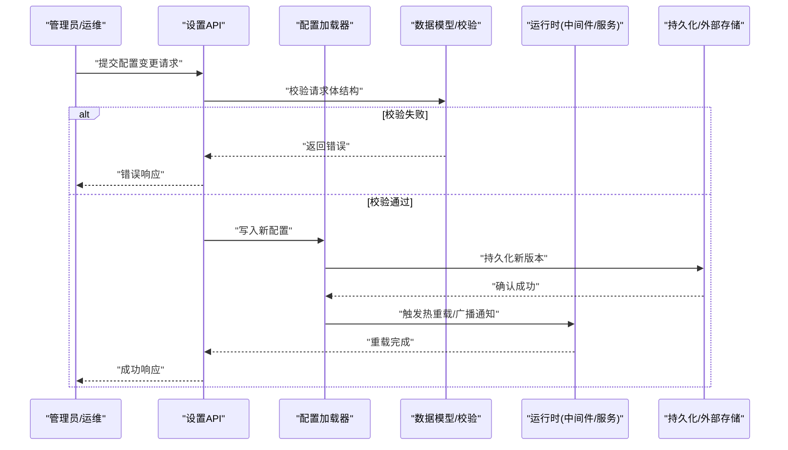
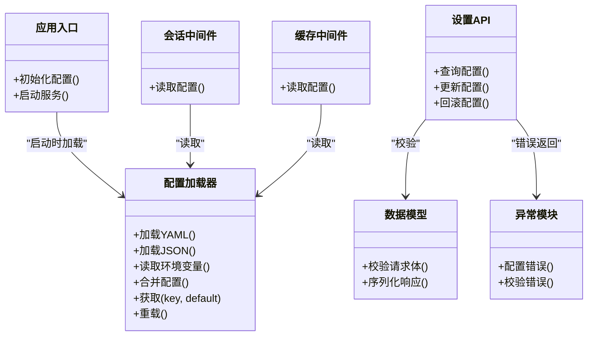
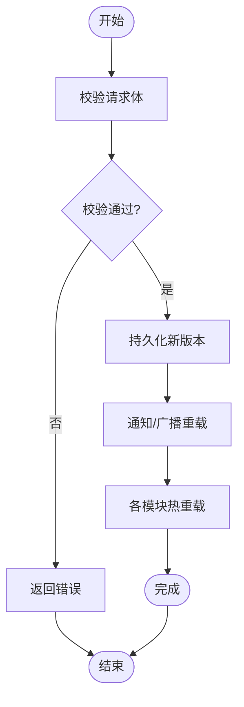

# 配置管理

<cite>
**本文引用的文件**   
- [backend_design/nexus/config.py](file://backend_design/nexus/config.py)
- [backend_design/nexus/main.py](file://backend_design/nexus/main.py)
- [backend_design/nexus/api/routes/settings.py](file://backend_design/nexus/api/routes/settings.py)
- [backend_design/nexus/core/exceptions.py](file://backend_design/nexus/core/exceptions.py)
- [backend_design/nexus/middleware/session_store.py](file://backend_design/nexus/middleware/session_store.py)
- [backend_design/nexus/middleware/redis_cache.py](file://backend_design/nexus/middleware/redis_cache.py)
- [backend_design/nexus/models/schemas.py](file://backend_design/nexus/models/schemas.py)
- [backend_design/nexus_gate/internal/config/config.go](file://backend_design/nexus_gate/internal/config/config.go)
- [docker-compose.yml](file://docker-compose.yml)
- [config/grafana/provisioning/dashboards/dashboards.yml](file://config/grafana/provisioning/dashboards/dashboards.yml)
- [config/grafana/provisioning/datasources/prometheus.yml](file://config/grafana/provisioning/datasources/prometheus.yml)
- [config/loki/loki-config.yml](file://config/loki/loki-config.yml)
- [config/prometheus/prometheus.yml](file://config/prometheus/prometheus.yml)
- [models/asr/sensevoice/config.yaml](file://models/asr/sensevoice/config.yaml)
- [models/asr/sensevoice/configuration.json](file://models/asr/sensevoice/configuration.json)
- [models/reranker/bge-reranker-v2-m3/config.json](file://models/reranker/bge-reranker-v2-m3/config.json)
- [models/tts/cosyvoice/cosyvoice.yaml](file://models/tts/cosyvoice/cosyvoice.yaml)
- [models/tts/cosyvoice/configuration.json](file://models/tts/cosyvoice/configuration.json)
- [frontend_design/next.config.js](file://frontend_design/next.config.js)
</cite>

## 目录
1. [简介](#简介)
2. [项目结构](#项目结构)
3. [核心组件](#核心组件)
4. [架构总览](#架构总览)
5. [详细组件分析](#详细组件分析)
6. [依赖分析](#依赖分析)
7. [性能考虑](#性能考虑)
8. [故障排查指南](#故障排查指南)
9. [结论](#结论)
10. [附录](#附录)

## 简介
本文件面向NexusCockpit系统的配置管理，覆盖以下方面：
- 配置文件结构与多格式规范（YAML、JSON、环境变量）
- 多环境差异化配置策略（开发、测试、生产）
- 动态配置更新机制（热重载、版本与回滚）
- 配置验证与校验（语法检查、依赖关系、默认值）
- 最佳实践与安全（敏感信息加密、权限控制）

## 项目结构
NexusCockpit采用前后端分离与网关分层架构。配置来源包括：
- 后端Python服务配置与运行时参数
- Go网关配置
- 基础设施监控与日志配置（Grafana、Prometheus、Loki）
- 模型侧配置（ASR、TTS、Reranker等）
- 前端构建期环境变量注入

```mermaid
graph TB
subgraph "后端服务"
PY_CFG["Python配置<br/>config.py"]
MAIN["应用入口<br/>main.py"]
SETTINGS_API["设置API<br/>api/routes/settings.py"]
SCHEMAS["数据模型/校验<br/>models/schemas.py"]
EXC["异常定义<br/>core/exceptions.py"]
SESS["会话存储中间件<br/>middleware/session_store.py"]
REDIS["缓存中间件<br/>middleware/redis_cache.py"]
end
subgraph "网关"
GO_CFG["Go配置<br/>nexus_gate/internal/config/config.go"]
end
subgraph "基础设施"
GRAFANA_DASH["Grafana仪表盘清单<br/>grafana/provisioning/dashboards/dashboards.yml"]
PROM_DS["Grafana数据源<br/>grafana/provisioning/datasources/prometheus.yml"]
PROM_CONF["Prometheus配置<br/>prometheus/prometheus.yml"]
LOKI_CONF["Loki配置<br/>loki/loki-config.yml"]
end
subgraph "模型配置"
ASR_YAML["ASR配置<br/>models/asr/sensevoice/config.yaml"]
ASR_JSON["ASR配置<br/>models/asr/sensevoice/configuration.json"]
RERANK_JSON["Reranker配置<br/>models/reranker/bge-reranker-v2-m3/config.json"]
TTS_YAML["TTS配置<br/>models/tts/cosyvoice/cosyvoice.yaml"]
TTS_JSON["TTS配置<br/>models/tts/cosyvoice/configuration.json"]
end
subgraph "前端"
NEXT_CFG["Next.js构建配置<br/>frontend_design/next.config.js"]
end
subgraph "编排"
DC["Docker Compose<br/>docker-compose.yml"]
end
DC --> MAIN
MAIN --> PY_CFG
MAIN --> GO_CFG
MAIN --> SESS
MAIN --> REDIS
MAIN --> SETTINGS_API
SETTINGS_API --> SCHEMAS
SETTINGS_API --> EXC
MAIN --> GRAFANA_DASH
MAIN --> PROM_DS
MAIN --> PROM_CONF
MAIN --> LOKI_CONF
MAIN --> ASR_YAML
MAIN --> ASR_JSON
MAIN --> RERANK_JSON
MAIN --> TTS_YAML
MAIN --> TTS_JSON
MAIN --> NEXT_CFG
```

图表来源
- [backend_design/nexus/config.py](file://backend_design/nexus/config.py)
- [backend_design/nexus/main.py](file://backend_design/nexus/main.py)
- [backend_design/nexus/api/routes/settings.py](file://backend_design/nexus/api/routes/settings.py)
- [backend_design/nexus/core/exceptions.py](file://backend_design/nexus/core/exceptions.py)
- [backend_design/nexus/middleware/session_store.py](file://backend_design/nexus/middleware/session_store.py)
- [backend_design/nexus/middleware/redis_cache.py](file://backend_design/nexus/middleware/redis_cache.py)
- [backend_design/nexus/models/schemas.py](file://backend_design/nexus/models/schemas.py)
- [backend_design/nexus_gate/internal/config/config.go](file://backend_design/nexus_gate/internal/config/config.go)
- [config/grafana/provisioning/dashboards/dashboards.yml](file://config/grafana/provisioning/dashboards/dashboards.yml)
- [config/grafana/provisioning/datasources/prometheus.yml](file://config/grafana/provisioning/datasources/prometheus.yml)
- [config/prometheus/prometheus.yml](file://config/prometheus/prometheus.yml)
- [config/loki/loki-config.yml](file://config/loki/loki-config.yml)
- [models/asr/sensevoice/config.yaml](file://models/asr/sensevoice/config.yaml)
- [models/asr/sensevoice/configuration.json](file://models/asr/sensevoice/configuration.json)
- [models/reranker/bge-reranker-v2-m3/config.json](file://models/reranker/bge-reranker-v2-m3/config.json)
- [models/tts/cosyvoice/cosyvoice.yaml](file://models/tts/cosyvoice/cosyvoice.yaml)
- [models/tts/cosyvoice/configuration.json](file://models/tts/cosyvoice/configuration.json)
- [frontend_design/next.config.js](file://frontend_design/next.config.js)
- [docker-compose.yml](file://docker-compose.yml)

章节来源
- [backend_design/nexus/config.py](file://backend_design/nexus/config.py)
- [backend_design/nexus/main.py](file://backend_design/nexus/main.py)
- [backend_design/nexus/api/routes/settings.py](file://backend_design/nexus/api/routes/settings.py)
- [backend_design/nexus/core/exceptions.py](file://backend_design/nexus/core/exceptions.py)
- [backend_design/nexus/middleware/session_store.py](file://backend_design/nexus/middleware/session_store.py)
- [backend_design/nexus/middleware/redis_cache.py](file://backend_design/nexus/middleware/redis_cache.py)
- [backend_design/nexus/models/schemas.py](file://backend_design/nexus/models/schemas.py)
- [backend_design/nexus_gate/internal/config/config.go](file://backend_design/nexus_gate/internal/config/config.go)
- [config/grafana/provisioning/dashboards/dashboards.yml](file://config/grafana/provisioning/dashboards/dashboards.yml)
- [config/grafana/provisioning/datasources/prometheus.yml](file://config/grafana/provisioning/datasources/prometheus.yml)
- [config/prometheus/prometheus.yml](file://config/prometheus/prometheus.yml)
- [config/loki/loki-config.yml](file://config/loki/loki-config.yml)
- [models/asr/sensevoice/config.yaml](file://models/asr/sensevoice/config.yaml)
- [models/asr/sensevoice/configuration.json](file://models/asr/sensevoice/configuration.json)
- [models/reranker/bge-reranker-v2-m3/config.json](file://models/reranker/bge-reranker-v2-m3/config.json)
- [models/tts/cosyvoice/cosyvoice.yaml](file://models/tts/cosyvoice/cosyvoice.yaml)
- [models/tts/cosyvoice/configuration.json](file://models/tts/cosyvoice/configuration.json)
- [frontend_design/next.config.js](file://frontend_design/next.config.js)
- [docker-compose.yml](file://docker-compose.yml)

## 核心组件
- Python后端配置加载器：负责读取并解析YAML/JSON与环境变量，提供统一访问接口。
- 应用启动流程：在进程启动时完成配置加载、依赖初始化与中间件装配。
- 设置API：暴露配置查询与更新能力，结合数据模型进行输入校验。
- 中间件：会话存储与Redis缓存的运行时配置接入点。
- Go网关配置：独立于后端的网关配置加载逻辑。
- 基础设施配置：Grafana、Prometheus、Loki的声明式配置。
- 模型配置：ASR/TTS/Reranker模型的参数化配置。
- 前端构建配置：通过环境变量注入构建期常量。

章节来源
- [backend_design/nexus/config.py](file://backend_design/nexus/config.py)
- [backend_design/nexus/main.py](file://backend_design/nexus/main.py)
- [backend_design/nexus/api/routes/settings.py](file://backend_design/nexus/api/routes/settings.py)
- [backend_design/nexus/middleware/session_store.py](file://backend_design/nexus/middleware/session_store.py)
- [backend_design/nexus/middleware/redis_cache.py](file://backend_design/nexus/middleware/redis_cache.py)
- [backend_design/nexus_gate/internal/config/config.go](file://backend_design/nexus_gate/internal/config/config.go)
- [config/grafana/provisioning/dashboards/dashboards.yml](file://config/grafana/provisioning/dashboards/dashboards.yml)
- [config/grafana/provisioning/datasources/prometheus.yml](file://config/grafana/provisioning/datasources/prometheus.yml)
- [config/prometheus/prometheus.yml](file://config/prometheus/prometheus.yml)
- [config/loki/loki-config.yml](file://config/loki/loki-config.yml)
- [models/asr/sensevoice/config.yaml](file://models/asr/sensevoice/config.yaml)
- [models/asr/sensevoice/configuration.json](file://models/asr/sensevoice/configuration.json)
- [models/reranker/bge-reranker-v2-m3/config.json](file://models/reranker/bge-reranker-v2-m3/config.json)
- [models/tts/cosyvoice/cosyvoice.yaml](file://models/tts/cosyvoice/cosyvoice.yaml)
- [models/tts/cosyvoice/configuration.json](file://models/tts/cosyvoice/configuration.json)
- [frontend_design/next.config.js](file://frontend_design/next.config.js)

## 架构总览
下图展示了配置从“静态文件+环境变量”到“运行时内存”的加载路径，以及动态更新的调用链。

图表来源
- [backend_design/nexus/api/routes/settings.py](file://backend_design/nexus/api/routes/settings.py)
- [backend_design/nexus/models/schemas.py](file://backend_design/nexus/models/schemas.py)
- [backend_design/nexus/config.py](file://backend_design/nexus/config.py)

## 详细组件分析

### Python后端配置加载器
职责
- 合并多来源配置：YAML/JSON文件、环境变量、默认值
- 提供类型安全的访问接口
- 支持按需重载与快照记录

关键要点
- 键名命名规范：建议全大写、下划线分隔，便于与.env映射
- 优先级：环境变量 > 显式传入 > 文件配置 > 默认值
- 缺失处理：对必填项抛出明确异常；可选项使用默认值

章节来源
- [backend_design/nexus/config.py](file://backend_design/nexus/config.py)

### 应用启动流程
职责
- 初始化配置加载器
- 根据配置创建数据库连接、缓存、队列等依赖
- 注册中间件与路由

关键要点
- 启动阶段应完成所有强依赖的配置校验
- 将可降级能力（如缓存、外部服务）配置为可开关

章节来源
- [backend_design/nexus/main.py](file://backend_design/nexus/main.py)

### 设置API（动态配置）
职责
- 提供配置的查询与更新接口
- 基于数据模型进行请求体验证
- 记录变更历史，支持回滚

关键要点
- 只允许更新白名单字段
- 更新成功后触发热重载或异步刷新
- 返回变更摘要与生效时间

章节来源
- [backend_design/nexus/api/routes/settings.py](file://backend_design/nexus/api/routes/settings.py)
- [backend_design/nexus/models/schemas.py](file://backend_design/nexus/models/schemas.py)

### 中间件配置接入点
- 会话存储中间件：从配置中读取存储后端、过期策略、密钥等
- Redis缓存中间件：从配置中读取连接串、池大小、超时、前缀等

章节来源
- [backend_design/nexus/middleware/session_store.py](file://backend_design/nexus/middleware/session_store.py)
- [backend_design/nexus/middleware/redis_cache.py](file://backend_design/nexus/middleware/redis_cache.py)

### Go网关配置
职责
- 独立加载网关相关配置（监听端口、上游转发、鉴权、限流等）
- 与后端配置解耦，避免耦合部署

章节来源
- [backend_design/nexus_gate/internal/config/config.go](file://backend_design/nexus_gate/internal/config/config.go)

### 基础设施配置
- Grafana仪表盘清单：声明式导入仪表盘
- Grafana数据源：指向Prometheus等
- Prometheus抓取配置：目标、间隔、标签
- Loki日志采集配置：索引、保留策略

章节来源
- [config/grafana/provisioning/dashboards/dashboards.yml](file://config/grafana/provisioning/dashboards/dashboards.yml)
- [config/grafana/provisioning/datasources/prometheus.yml](file://config/grafana/provisioning/datasources/prometheus.yml)
- [config/prometheus/prometheus.yml](file://config/prometheus/prometheus.yml)
- [config/loki/loki-config.yml](file://config/loki/loki-config.yml)

### 模型配置
- ASR模型：包含音频采样率、模型路径、解码参数等
- Reranker模型：包含维度、阈值、设备选择等
- TTS模型：包含音色、语速、输出格式等

章节来源
- [models/asr/sensevoice/config.yaml](file://models/asr/sensevoice/config.yaml)
- [models/asr/sensevoice/configuration.json](file://models/asr/sensevoice/configuration.json)
- [models/reranker/bge-reranker-v2-m3/config.json](file://models/reranker/bge-reranker-v2-m3/config.json)
- [models/tts/cosyvoice/cosyvoice.yaml](file://models/tts/cosyvoice/cosyvoice.yaml)
- [models/tts/cosyvoice/configuration.json](file://models/tts/cosyvoice/configuration.json)

### 前端构建配置
职责
- 通过环境变量注入构建期常量（如API地址、功能开关）
- 区分不同环境的构建产物

章节来源
- [frontend_design/next.config.js](file://frontend_design/next.config.js)

## 依赖分析
- 配置加载器与应用入口存在强依赖：启动时必须完成配置校验
- 设置API依赖数据模型进行校验，依赖异常模块返回结构化错误
- 中间件依赖配置加载器提供的运行时配置
- 网关配置与后端配置相互独立，通过编排层协调

图表来源
- [backend_design/nexus/config.py](file://backend_design/nexus/config.py)
- [backend_design/nexus/main.py](file://backend_design/nexus/main.py)
- [backend_design/nexus/api/routes/settings.py](file://backend_design/nexus/api/routes/settings.py)
- [backend_design/nexus/models/schemas.py](file://backend_design/nexus/models/schemas.py)
- [backend_design/nexus/core/exceptions.py](file://backend_design/nexus/core/exceptions.py)
- [backend_design/nexus/middleware/session_store.py](file://backend_design/nexus/middleware/session_store.py)
- [backend_design/nexus/middleware/redis_cache.py](file://backend_design/nexus/middleware/redis_cache.py)

章节来源
- [backend_design/nexus/config.py](file://backend_design/nexus/config.py)
- [backend_design/nexus/main.py](file://backend_design/nexus/main.py)
- [backend_design/nexus/api/routes/settings.py](file://backend_design/nexus/api/routes/settings.py)
- [backend_design/nexus/models/schemas.py](file://backend_design/nexus/models/schemas.py)
- [backend_design/nexus/core/exceptions.py](file://backend_design/nexus/core/exceptions.py)
- [backend_design/nexus/middleware/session_store.py](file://backend_design/nexus/middleware/session_store.py)
- [backend_design/nexus/middleware/redis_cache.py](file://backend_design/nexus/middleware/redis_cache.py)

## 性能考虑
- 配置加载时机：尽量在进程启动时一次性加载，减少运行时IO
- 热重载粒度：按模块细粒度重载，避免全量重启
- 缓存策略：对频繁读取的配置项加入内存缓存，并设置合理失效时间
- 并发安全：配置读写加锁或使用不可变对象发布，避免竞态条件
- 大配置处理：将大型配置拆分为多个小文件，按需加载

[本节为通用指导，不直接分析具体文件]

## 故障排查指南
常见问题与定位步骤
- 启动失败：检查必填配置是否缺失、环境变量是否正确注入、配置文件语法是否合法
- 运行时异常：查看异常模块返回的错误码与消息，定位具体配置项
- 热重载无效：确认设置API是否成功持久化与广播，检查中间件是否重新读取配置
- 鉴权/限流异常：核对网关与后端配置一致性，检查端口、域名、证书等

章节来源
- [backend_design/nexus/core/exceptions.py](file://backend_design/nexus/core/exceptions.py)
- [backend_design/nexus/api/routes/settings.py](file://backend_design/nexus/api/routes/settings.py)

## 结论
通过统一的配置加载器、严格的数据模型校验、可观测的设置API与中间件接入点，NexusCockpit实现了稳定、可扩展且安全的配置管理体系。配合多环境编排与基础设施声明式配置，可在保证一致性的同时满足快速迭代与高可用要求。

[本节为总结性内容，不直接分析具体文件]

## 附录

### 配置格式与约定
- YAML：用于结构化配置与模型参数，注意缩进与类型
- JSON：用于模型与工具链兼容的配置片段
- 环境变量：用于敏感信息与运行期差异项，命名建议全大写、下划线分隔
- 默认值：在代码中提供合理的默认值，降低部署复杂度

章节来源
- [backend_design/nexus/config.py](file://backend_design/nexus/config.py)
- [models/asr/sensevoice/config.yaml](file://models/asr/sensevoice/config.yaml)
- [models/asr/sensevoice/configuration.json](file://models/asr/sensevoice/configuration.json)
- [models/reranker/bge-reranker-v2-m3/config.json](file://models/reranker/bge-reranker-v2-m3/config.json)
- [models/tts/cosyvoice/cosyvoice.yaml](file://models/tts/cosyvoice/cosyvoice.yaml)
- [models/tts/cosyvoice/configuration.json](file://models/tts/cosyvoice/configuration.json)

### 多环境差异化策略
- 使用环境变量覆盖环境相关项（如数据库地址、密钥、开关）
- 使用不同的Compose或服务编排文件区分环境
- 将非敏感配置放入仓库，敏感信息通过密钥管理服务注入

章节来源
- [docker-compose.yml](file://docker-compose.yml)
- [frontend_design/next.config.js](file://frontend_design/next.config.js)

### 动态配置更新流程

图表来源
- [backend_design/nexus/api/routes/settings.py](file://backend_design/nexus/api/routes/settings.py)
- [backend_design/nexus/models/schemas.py](file://backend_design/nexus/models/schemas.py)

### 安全与权限控制
- 敏感信息：使用环境变量或密钥管理服务，避免明文落盘
- 最小权限：仅开放必要的设置API，限制写操作主体
- 审计追踪：记录每次配置变更的操作人、时间与结果
- 传输安全：对外暴露的API启用HTTPS与鉴权

[本节为通用指导，不直接分析具体文件]