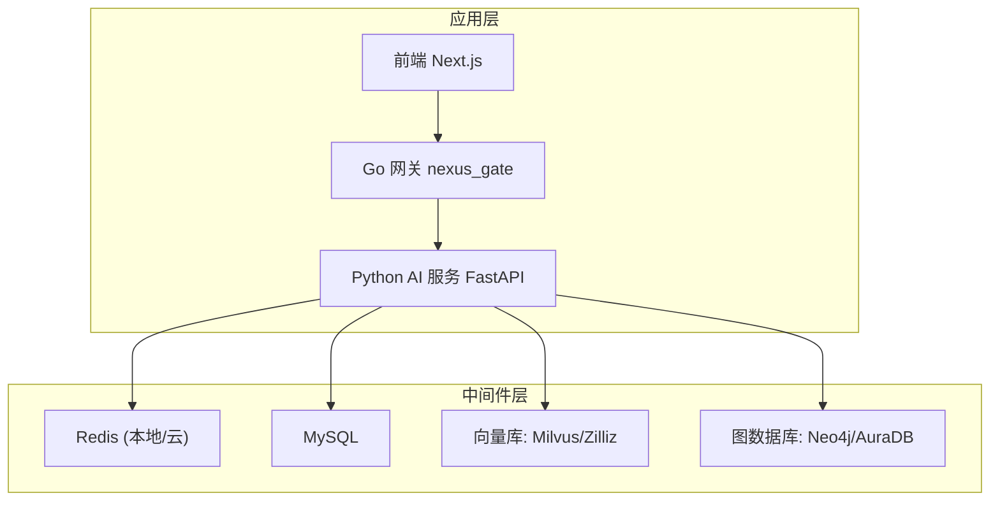
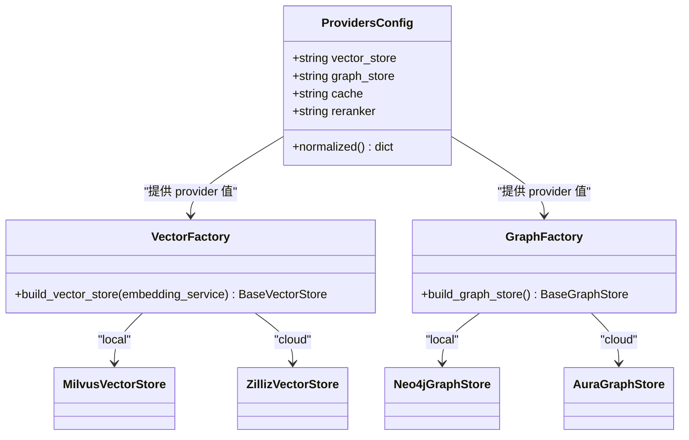
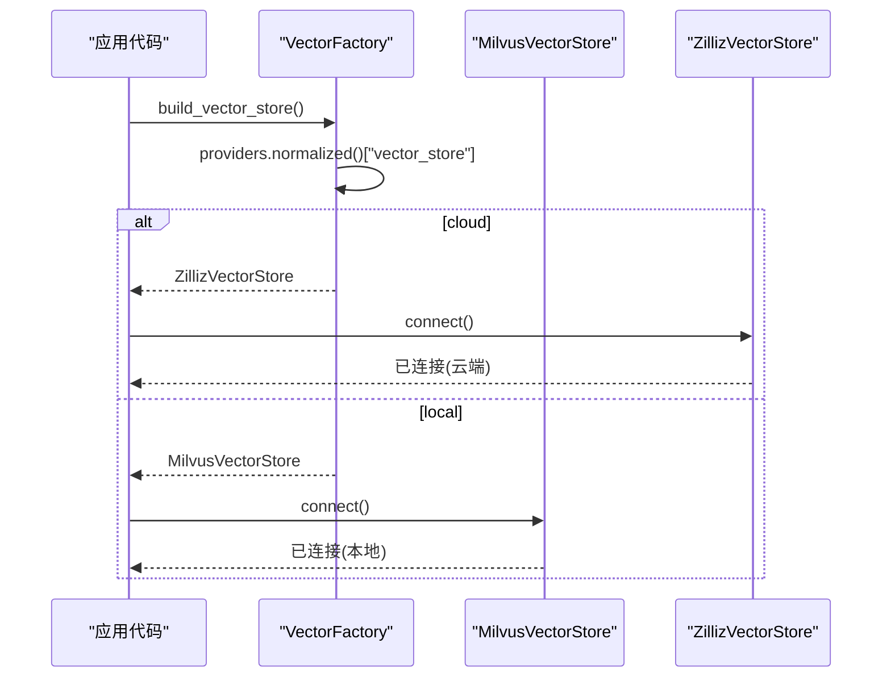
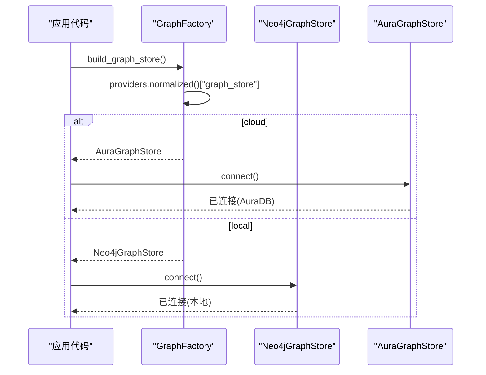
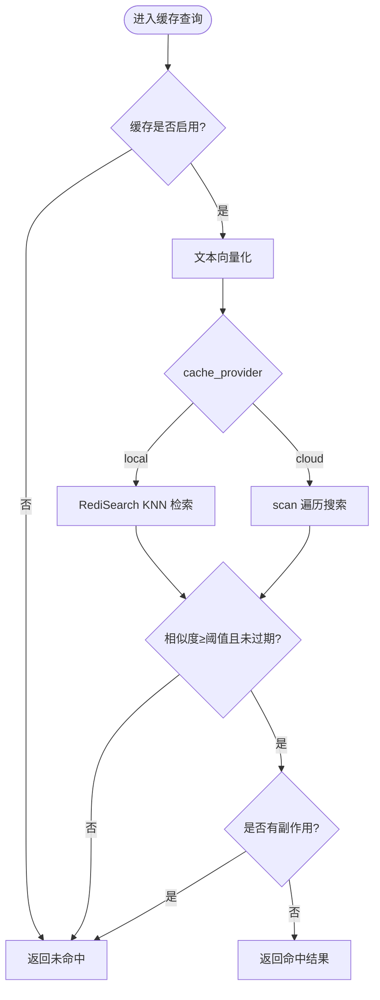
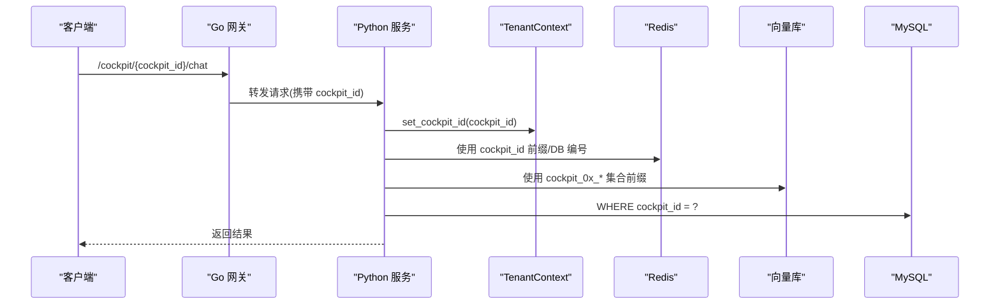
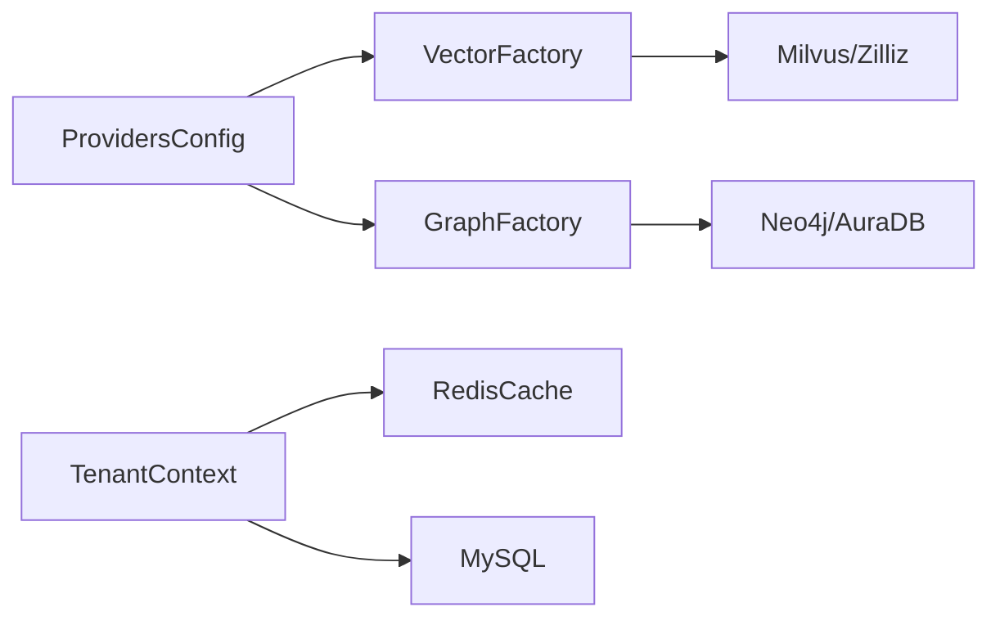

# 双模式部署

<cite>
**本文引用的文件**   
- [docker-compose.yml](file://docker-compose.yml)
- [config.py](file://backend_design/nexus/config.py)
- [vector_factory.py](file://backend_design/nexus/rag/vector_factory.py)
- [zilliz_vector_store.py](file://backend_design/nexus/rag/zilliz_vector_store.py)
- [graph_factory.py](file://backend_design/nexus/rag/graph_factory.py)
- [aura_graph_store.py](file://backend_design/nexus/rag/aura_graph_store.py)
- [redis_cache.py](file://backend_design/nexus/middleware/redis_cache.py)
- [tenant_context.py](file://backend_design/nexus/core/tenant_context.py)
- [cockpit_manager.py](file://backend_design/nexus/core/cockpit_manager.py)
- [v2.1_migration.sql](file://backend_design/scripts/v2.1_migration.sql)
- [SETUP.md](file://docs/deployment/SETUP.md)
- [L0-infrastructure.md](file://docs/architecture/L0-infrastructure.md)
</cite>

## 目录
1. [简介](#简介)
2. [项目结构](#项目结构)
3. [核心组件](#核心组件)
4. [架构总览](#架构总览)
5. [详细组件分析](#详细组件分析)
6. [依赖关系分析](#依赖关系分析)
7. [性能与容量规划](#性能与容量规划)
8. [故障排查指南](#故障排查指南)
9. [结论](#结论)
10. [附录：一键切换步骤清单](#附录一键切换步骤清单)

## 简介
本指南面向 NexusCockpit 的“双模式部署”场景，覆盖本地 Docker 中间件与云端托管服务的一键切换机制。重点包括：
- 向量库：Milvus（本地）⇄ Zilliz Cloud（云端）
- 图谱库：Neo4j（本地）⇄ Neo4j AuraDB（云端）
- 缓存：Redis Stack（本地）⇄ 云 Redis（无 RediSearch 时自动降级）
- 多租户隔离：cockpit-01→DB1、cockpit-02→DB2 等策略
- 配置切换：环境变量、配置文件与服务重启流程
- 混合部署最佳实践：数据同步、故障转移、性能监控

## 项目结构
NexusCockpit 采用分层架构，基础设施由 docker-compose 编排；后端通过配置中心按 provider 动态选择本地或云端实现；前端通过网关访问后端 API。

图表来源
- [docker-compose.yml:1-246](file://docker-compose.yml#L1-L246)
- [config.py:458-489](file://backend_design/nexus/config.py#L458-L489)

章节来源
- [docker-compose.yml:1-246](file://docker-compose.yml#L1-L246)
- [L0-infrastructure.md:1-55](file://docs/architecture/L0-infrastructure.md#L1-L55)

## 核心组件
- 配置中心：集中管理所有连接参数与环境开关，支持 APP_ENV 自动加载 .env.local/.env.prod
- Provider 工厂：根据 *_PROVIDER 动态选择本地或云端实现
- 多租户上下文：基于 contextvars 在请求级传递 cockpit_id/user_id，驱动缓存/索引前缀/DB 过滤
- 健康检查与可观测性：Prometheus/Grafana/Loki 采集指标与日志

章节来源
- [config.py:41-74](file://backend_design/nexus/config.py#L41-L74)
- [config.py:458-489](file://backend_design/nexus/config.py#L458-L489)
- [tenant_context.py:1-106](file://backend_design/nexus/core/tenant_context.py#L1-L106)
- [cockpit_manager.py:94-114](file://backend_design/nexus/core/cockpit_manager.py#L94-L114)

## 架构总览
下图展示“本地 ⇄ 云端”的双模式切换路径与关键工厂类。

图表来源
- [config.py:458-489](file://backend_design/nexus/config.py#L458-L489)
- [vector_factory.py:1-45](file://backend_design/nexus/rag/vector_factory.py#L1-L45)
- [graph_factory.py:1-39](file://backend_design/nexus/rag/graph_factory.py#L1-L39)
- [zilliz_vector_store.py:1-45](file://backend_design/nexus/rag/zilliz_vector_store.py#L1-L45)
- [aura_graph_store.py:1-40](file://backend_design/nexus/rag/aura_graph_store.py#L1-L40)

## 详细组件分析

### 向量库：Milvus 本地 ⇄ Zilliz Cloud
- 本地 Milvus：通过 docker-compose 启动 etcd/minio/milvus，端口映射 19530/9091
- 云端 Zilliz：使用相同 pymilvus 客户端，仅 connect 使用云端 URI + Token
- 工厂选择：VECTOR_STORE_PROVIDER=local|cloud

图表来源
- [vector_factory.py:25-45](file://backend_design/nexus/rag/vector_factory.py#L25-L45)
- [zilliz_vector_store.py:31-45](file://backend_design/nexus/rag/zilliz_vector_store.py#L31-L45)
- [docker-compose.yml:125-143](file://docker-compose.yml#L125-L143)

章节来源
- [vector_factory.py:1-45](file://backend_design/nexus/rag/vector_factory.py#L1-L45)
- [zilliz_vector_store.py:1-45](file://backend_design/nexus/rag/zilliz_vector_store.py#L1-L45)
- [docker-compose.yml:125-143](file://docker-compose.yml#L125-L143)

### 图谱库：Neo4j 本地 ⇄ AuraDB 云端
- 本地 Neo4j：Docker 镜像 neo4j:5.19.0，启用 APOC 插件
- 云端 AuraDB：使用 neo4j+s 加密协议，driver 自动处理 TLS
- 工厂选择：GRAPH_STORE_PROVIDER=local|cloud

图表来源
- [graph_factory.py:24-39](file://backend_design/nexus/rag/graph_factory.py#L24-L39)
- [aura_graph_store.py:31-40](file://backend_design/nexus/rag/aura_graph_store.py#L31-L40)
- [docker-compose.yml:146-158](file://docker-compose.yml#L146-L158)

章节来源
- [graph_factory.py:1-39](file://backend_design/nexus/rag/graph_factory.py#L1-L39)
- [aura_graph_store.py:1-40](file://backend_design/nexus/rag/aura_graph_store.py#L1-L40)
- [docker-compose.yml:146-158](file://docker-compose.yml#L146-L158)

### 语义缓存：Redis Stack 本地 ⇄ 云 Redis 降级
- 本地 Redis Stack：启用 RediSearch VECTOR 索引，KNN O(log n)
- 云 Redis：通常无 RediSearch，自动降级为 scan 遍历 O(n)
- 安全设计：有副作用响应（如车控指令）永不写入缓存

图表来源
- [redis_cache.py:97-110](file://backend_design/nexus/middleware/redis_cache.py#L97-L110)
- [redis_cache.py:160-249](file://backend_design/nexus/middleware/redis_cache.py#L160-L249)
- [redis_cache.py:315-380](file://backend_design/nexus/middleware/redis_cache.py#L315-L380)

章节来源
- [redis_cache.py:1-449](file://backend_design/nexus/middleware/redis_cache.py#L1-L449)

### 多租户隔离：cockpit-01→DB1、cockpit-02→DB2
- 默认座舱初始化：cockpit-01/02/03，分别映射到 Redis DB 1/2/3
- 向量库：Collection 前缀 cockpit_0x_*
- MySQL：行级隔离，按 cockpit_id 过滤
- 上下文：contextvars 在请求级注入 cockpit_id/user_id

图表来源
- [tenant_context.py:29-72](file://backend_design/nexus/core/tenant_context.py#L29-L72)
- [cockpit_manager.py:94-114](file://backend_design/nexus/core/cockpit_manager.py#L94-L114)
- [v2.1_migration.sql:274-296](file://backend_design/scripts/v2.1_migration.sql#L274-L296)

章节来源
- [tenant_context.py:1-106](file://backend_design/nexus/core/tenant_context.py#L1-L106)
- [cockpit_manager.py:94-114](file://backend_design/nexus/core/cockpit_manager.py#L94-L114)
- [v2.1_migration.sql:274-296](file://backend_design/scripts/v2.1_migration.sql#L274-L296)

## 依赖关系分析
- 配置中心是所有 provider 选择的唯一入口
- 工厂类读取 ProvidersConfig.normalized() 决定实例化本地还是云端实现
- 中间件（缓存/限流/会话）统一从上下文获取 cockpit_id 做隔离

图表来源
- [config.py:458-489](file://backend_design/nexus/config.py#L458-L489)
- [vector_factory.py:25-45](file://backend_design/nexus/rag/vector_factory.py#L25-L45)
- [graph_factory.py:24-39](file://backend_design/nexus/rag/graph_factory.py#L24-L39)
- [tenant_context.py:65-72](file://backend_design/nexus/core/tenant_context.py#L65-L72)

章节来源
- [config.py:458-489](file://backend_design/nexus/config.py#L458-L489)
- [vector_factory.py:1-45](file://backend_design/nexus/rag/vector_factory.py#L1-L45)
- [graph_factory.py:1-39](file://backend_design/nexus/rag/graph_factory.py#L1-L39)
- [tenant_context.py:1-106](file://backend_design/nexus/core/tenant_context.py#L1-L106)

## 性能与容量规划
- 向量库
  - 本地 Milvus：HNSW 索引，M/efConstruction/ef 可按数据规模调优
  - 云端 Zilliz：按需扩容集群，关注 QPS/延迟与存储配额
- 图数据库
  - 本地 Neo4j：APOC 插件开启，注意内存与磁盘 I/O
  - 云端 AuraDB：按实例规格与连接池大小评估吞吐
- 缓存
  - 本地 Redis Stack：优先使用 RediSearch KNN，避免全量扫描
  - 云 Redis：scan 降级下建议控制缓存条目规模与 TTL
- 监控
  - Prometheus+Grafana：采集 API 延迟、Agent 耗时、缓存命中率、中间件状态
  - Loki：聚合日志便于定位问题

[本节为通用指导，不直接分析具体文件]

## 故障排查指南
- 健康检查
  - Python 服务：/health 返回各组件连接状态
  - Go 网关：/health 返回网关状态
- 常见问题
  - Milvus 连接失败：等待容器就绪，检查端口占用
  - 模型加载失败：确认模型路径与权限
  - GPU 不可用：检查 CUDA 驱动与容器 GPU 透传
- 回滚与降级
  - LLM 降级：云端不可用时自动切换到本地 llama.cpp OpenAI 兼容接口
  - 缓存降级：云 Redis 无 RediSearch 时自动走 scan 模式

章节来源
- [SETUP.md:418-519](file://docs/deployment/SETUP.md#L418-L519)
- [LLM_FALLBACK.md:1-76](file://docs/deployment/LLM_FALLBACK.md#L1-L76)

## 结论
通过 ProvidersConfig 与工厂模式，NexusCockpit 实现了“本地 ⇄ 云端”的一键切换，无需改动业务代码。结合多租户上下文与数据库行级隔离，可在同一套代码上同时支撑开发、测试与生产环境。配合 Prometheus/Grafana/Loki 的可观测体系，可实现稳定可靠的混合部署。

[本节为总结性内容，不直接分析具体文件]

## 附录：一键切换步骤清单
- 准备云端凭据
  - Zilliz Cloud：设置 MILVUS_URI、MILVUS_TOKEN
  - AuraDB：设置 NEO4J_URI（neo4j+s）、NEO4J_PASSWORD
  - 云 Redis：设置 REDIS_HOST/PORT/PASSWORD/DB
- 修改环境变量
  - 将对应 *_PROVIDER 设置为 cloud
  - 若使用生产环境，设置 APP_ENV=prod 并准备 .env.prod
- 重启服务
  - 停止当前服务进程或容器
  - 重新加载 .env 后启动后端与网关
- 验证
  - 访问 /health 确认各组件状态
  - 执行一次对话与车控命令，确认行为正常

章节来源
- [SETUP.md:320-332](file://docs/deployment/SETUP.md#L320-L332)
- [config.py:41-74](file://backend_design/nexus/config.py#L41-L74)
- [docker-compose.yml:1-246](file://docker-compose.yml#L1-L246)