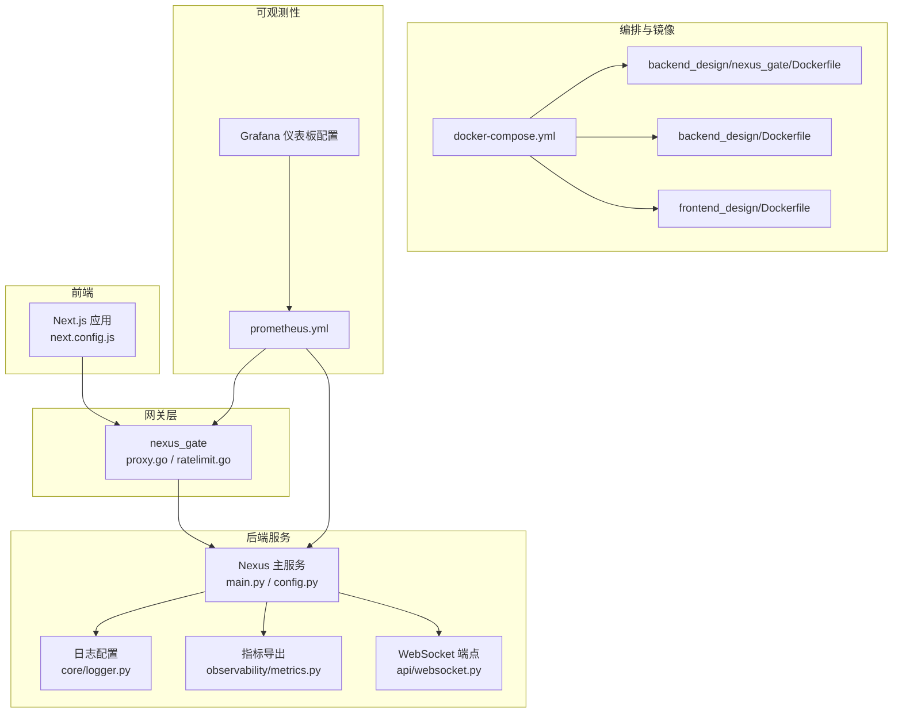
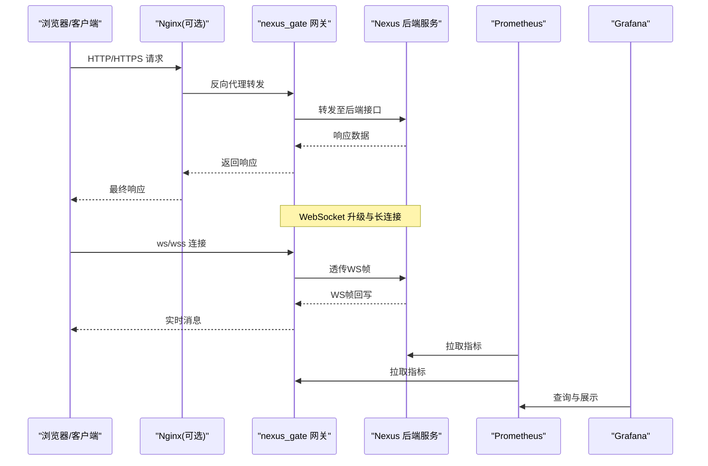
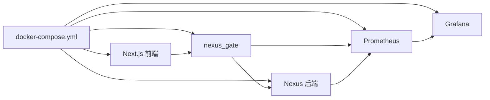

# 基础设施性能优化

<cite>
**本文引用的文件**   
- [docker-compose.yml](file://docker-compose.yml)
- [backend_design/Dockerfile](file://backend_design/Dockerfile)
- [backend_design/nexus/main.py](file://backend_design/nexus/main.py)
- [backend_design/nexus/config.py](file://backend_design/nexus/config.py)
- [backend_design/nexus/core/logger.py](file://backend_design/nexus/core/logger.py)
- [backend_design/nexus/observability/metrics.py](file://backend_design/nexus/observability/metrics.py)
- [backend_design/nexus/api/websocket.py](file://backend_design/nexus/api/websocket.py)
- [backend_design/nexus_gate/Dockerfile](file://backend_design/nexus_gate/Dockerfile)
- [backend_design/nexus_gate/internal/proxy/proxy.go](file://backend_design/nexus_gate/internal/proxy/proxy.go)
- [backend_design/nexus_gate/internal/ratelimit/ratelimit.go](file://backend_design/nexus_gate/internal/ratelimit/ratelimit.go)
- [config/prometheus/prometheus.yml](file://config/prometheus/prometheus.yml)
- [config/grafana/provisioning/dashboards/dashboards.yml](file://config/grafana/provisioning/dashboards/dashboards.yml)
- [config/grafana/provisioning/dashboards/nexuscockpit-overview.json](file://config/grafana/provisioning/dashboards/nexuscockpit-overview.json)
- [frontend_design/Dockerfile](file://frontend_design/Dockerfile)
- [frontend_design/next.config.js](file://frontend_design/next.config.js)
- [docs/architecture/L0-infrastructure.md](file://docs/architecture/L0-infrastructure.md)
</cite>

## 目录
1. [简介](#简介)
2. [项目结构](#项目结构)
3. [核心组件](#核心组件)
4. [架构总览](#架构总览)
5. [详细组件分析](#详细组件分析)
6. [依赖分析](#依赖分析)
7. [性能考虑](#性能考虑)
8. [故障排查指南](#故障排查指南)
9. [结论](#结论)
10. [附录](#附录)

## 简介
本指南面向基础设施层性能优化，围绕容器资源限制与优化、Kubernetes集群调优、网络性能优化、前端构建与静态资源优化、以及编排最佳实践与监控方案展开。文档结合仓库中的Docker配置、网关与后端服务实现、可观测性配置与前端构建脚本，给出可落地的优化建议与可视化说明，帮助读者在真实环境中提升吞吐、降低延迟并增强稳定性。

## 项目结构
本项目包含以下与基础设施相关的关键位置：
- 容器编排与镜像构建：docker-compose.yml、各服务Dockerfile
- 网关与代理：Go实现的nexus_gate（含反向代理、限流）
- 后端服务：Python FastAPI应用（含WebSocket、指标暴露）
- 可观测性：Prometheus抓取配置、Grafana仪表板
- 前端：Next.js应用及构建配置

图表来源
- [docker-compose.yml](file://docker-compose.yml)
- [backend_design/Dockerfile](file://backend_design/Dockerfile)
- [backend_design/nexus_gate/Dockerfile](file://backend_design/nexus_gate/Dockerfile)
- [backend_design/nexus_gate/internal/proxy/proxy.go](file://backend_design/nexus_gate/internal/proxy/proxy.go)
- [backend_design/nexus_gate/internal/ratelimit/ratelimit.go](file://backend_design/nexus_gate/internal/ratelimit/ratelimit.go)
- [backend_design/nexus/main.py](file://backend_design/nexus/main.py)
- [backend_design/nexus/config.py](file://backend_design/nexus/config.py)
- [backend_design/nexus/api/websocket.py](file://backend_design/nexus/api/websocket.py)
- [backend_design/nexus/observability/metrics.py](file://backend_design/nexus/observability/metrics.py)
- [backend_design/nexus/core/logger.py](file://backend_design/nexus/core/logger.py)
- [config/prometheus/prometheus.yml](file://config/prometheus/prometheus.yml)
- [config/grafana/provisioning/dashboards/dashboards.yml](file://config/grafana/provisioning/dashboards/dashboards.yml)
- [frontend_design/Dockerfile](file://frontend_design/Dockerfile)
- [frontend_design/next.config.js](file://frontend_design/next.config.js)

章节来源
- [docker-compose.yml](file://docker-compose.yml)
- [docs/architecture/L0-infrastructure.md](file://docs/architecture/L0-infrastructure.md)

## 核心组件
- 网关层（nexus_gate）：提供反向代理、鉴权、速率限制与WebSocket转发能力，是流量入口与性能关键路径。
- 后端服务（Nexus）：业务逻辑、模型调用、RAG检索、记忆管理、指标与日志输出。
- 可观测性：Prometheus抓取后端与网关指标，Grafana展示整体健康与性能视图。
- 前端（Next.js）：SSR/静态化构建、资源压缩与缓存策略。

章节来源
- [backend_design/nexus_gate/internal/proxy/proxy.go](file://backend_design/nexus_gate/internal/proxy/proxy.go)
- [backend_design/nexus_gate/internal/ratelimit/ratelimit.go](file://backend_design/nexus_gate/internal/ratelimit/ratelimit.go)
- [backend_design/nexus/main.py](file://backend_design/nexus/main.py)
- [backend_design/nexus/observability/metrics.py](file://backend_design/nexus/observability/metrics.py)
- [config/prometheus/prometheus.yml](file://config/prometheus/prometheus.yml)
- [config/grafana/provisioning/dashboards/dashboards.yml](file://config/grafana/provisioning/dashboards/dashboards.yml)
- [frontend_design/next.config.js](file://frontend_design/next.config.js)

## 架构总览
下图展示了从浏览器到网关、后端、可观测性的端到端请求链路，以及WebSocket长连接路径。

图表来源
- [backend_design/nexus_gate/internal/proxy/proxy.go](file://backend_design/nexus_gate/internal/proxy/proxy.go)
- [backend_design/nexus/api/websocket.py](file://backend_design/nexus/api/websocket.py)
- [config/prometheus/prometheus.yml](file://config/prometheus/prometheus.yml)
- [config/grafana/provisioning/dashboards/dashboards.yml](file://config/grafana/provisioning/dashboards/dashboards.yml)

## 详细组件分析

### Docker容器资源限制与优化
- CPU配额设置
  - 通过compose或Kubernetes的CPU requests/limits控制调度与隔离，避免争用导致的抖动。
  - 针对计算密集型任务（ASR/TTS/RAG）提高requests以保障稳定调度；对I/O密集任务适当放宽CPU上限。
- 内存限制配置
  - 为Python进程与模型加载预留足够堆外内存，防止OOM Kill；合理设置JVM/Python GC参数（如适用）。
  - 使用cgroup v2时注意memory.swap行为，避免过度交换导致延迟升高。
- 磁盘I/O优化
  - 将临时目录、上传目录、检查点目录挂载到高性能卷（本地NVMe或云盘），减少跨节点复制。
  - 调整文件系统选项（如noatime）、关闭不必要的同步写入，批量写入合并。
- 镜像与运行时优化
  - 多阶段构建减小镜像体积，按需安装依赖，启用分层缓存。
  - 使用glibc精简基础镜像或musl替代（需验证兼容性），减少启动时间。

章节来源
- [docker-compose.yml](file://docker-compose.yml)
- [backend_design/Dockerfile](file://backend_design/Dockerfile)
- [backend_design/nexus_gate/Dockerfile](file://backend_design/nexus_gate/Dockerfile)
- [frontend_design/Dockerfile](file://frontend_design/Dockerfile)

### Kubernetes集群性能调优
- Pod资源分配
  - 基于压测结果设定requests/limits，采用HPA按CPU/自定义指标自动扩缩容。
  - 对GPU工作负载使用Device Plugin与亲和性规则，确保独占与低抢占。
- 服务发现优化
  - 优先使用ClusterIP+Ingress/Gateway，避免NodePort带来的额外跳数。
  - 开启EndpointSlice与kube-proxy IPVS模式，降低大规模服务的查找开销。
- 负载均衡配置
  - Ingress控制器启用HTTP/2与连接复用，合理设置超时与重试策略。
  - 对WebSocket场景，确保Ingress支持协议升级并保持会话粘性（必要时）。

[本节为通用指导，不直接分析具体文件]

### 网络性能优化
- TCP连接池配置
  - 网关与后端之间启用Keep-Alive与连接复用，减少握手开销。
  - 根据并发规模调整最大连接数、空闲超时与队列长度。
- HTTP/2启用
  - 在网关与上游服务间启用HTTP/2，利用多路复用与头部压缩。
  - 注意TLS终止位置与证书热更新，避免频繁重建连接。
- WebSocket连接优化
  - 网关透传WS帧，保持心跳与重连策略；后端侧限制单用户连接数与消息速率。
  - 对大消息进行分片与压缩，避免阻塞事件循环。

章节来源
- [backend_design/nexus_gate/internal/proxy/proxy.go](file://backend_design/nexus_gate/internal/proxy/proxy.go)
- [backend_design/nexus/api/websocket.py](file://backend_design/nexus/api/websocket.py)

### 前端性能优化策略（Next.js）
- 构建优化
  - 启用增量静态再生成（ISR）与预渲染，减少首屏TTI。
  - 拆分路由级代码与第三方库，按需加载，降低包体。
- 静态资源压缩与缓存
  - 启用Brotli/Gzip压缩，图片WebP/AVIF转换，CDN缓存策略配合ETag/Cache-Control。
- CDN配置
  - 将静态资源与API边缘加速分离，设置合理的TTL与回源策略。
  - 对动态内容使用边缘函数或轻量网关做缓存与鉴权。

章节来源
- [frontend_design/next.config.js](file://frontend_design/next.config.js)
- [frontend_design/Dockerfile](file://frontend_design/Dockerfile)

### 可观测性与监控方案
- 指标采集
  - Prometheus抓取后端与网关指标，定义合适的抓取间隔与保留策略。
  - 暴露业务指标（QPS、延迟分布、错误率、队列深度、模型调用耗时）。
- 日志与追踪
  - 结构化日志统一格式，关联traceId；集中存储与索引。
- 告警与仪表板
  - 基于SLO制定阈值告警；Grafana提供概览与下钻视图。

章节来源
- [backend_design/nexus/observability/metrics.py](file://backend_design/nexus/observability/metrics.py)
- [backend_design/nexus/core/logger.py](file://backend_design/nexus/core/logger.py)
- [config/prometheus/prometheus.yml](file://config/prometheus/prometheus.yml)
- [config/grafana/provisioning/dashboards/dashboards.yml](file://config/grafana/provisioning/dashboards/dashboards.yml)
- [config/grafana/provisioning/dashboards/nexuscockpit-overview.json](file://config/grafana/provisioning/dashboards/nexuscockpit-overview.json)

### 网关与限流
- 反向代理
  - 合理设置上游超时、重试与熔断，避免雪崩。
  - 启用连接池与HTTP/2，减少TCP握手与TLS协商成本。
- 速率限制
  - 基于IP/用户维度限流，保护后端与外部依赖。
  - 动态调整限流阈值，结合监控反馈进行自适应。

章节来源
- [backend_design/nexus_gate/internal/proxy/proxy.go](file://backend_design/nexus_gate/internal/proxy/proxy.go)
- [backend_design/nexus_gate/internal/ratelimit/ratelimit.go](file://backend_design/nexus_gate/internal/ratelimit/ratelimit.go)

## 依赖分析
组件间的依赖关系如下：
- docker-compose负责编排镜像与服务，驱动网关、后端、前端与可观测性组件的部署。
- 网关依赖后端API与WebSocket端点，同时向Prometheus暴露指标。
- 后端服务暴露指标与日志，供Prometheus抓取与Grafana展示。
- 前端通过网关访问后端，静态资源由CDN或Nginx分发。

图表来源
- [docker-compose.yml](file://docker-compose.yml)
- [backend_design/nexus_gate/internal/proxy/proxy.go](file://backend_design/nexus_gate/internal/proxy/proxy.go)
- [backend_design/nexus/main.py](file://backend_design/nexus/main.py)
- [config/prometheus/prometheus.yml](file://config/prometheus/prometheus.yml)
- [config/grafana/provisioning/dashboards/dashboards.yml](file://config/grafana/provisioning/dashboards/dashboards.yml)

章节来源
- [docker-compose.yml](file://docker-compose.yml)
- [backend_design/nexus_gate/internal/proxy/proxy.go](file://backend_design/nexus_gate/internal/proxy/proxy.go)
- [backend_design/nexus/main.py](file://backend_design/nexus/main.py)
- [config/prometheus/prometheus.yml](file://config/prometheus/prometheus.yml)
- [config/grafana/provisioning/dashboards/dashboards.yml](file://config/grafana/provisioning/dashboards/dashboards.yml)

## 性能考虑
- 容量规划
  - 基于峰值QPS与P99延迟目标，估算CPU/内存/带宽需求，预留20%-30%冗余。
- 缓存策略
  - 热点数据入Redis/内存缓存，RAG检索引入向量缓存与去重。
- 异步与批处理
  - 非关键路径异步执行（如日志落盘、指标上报），批量写入数据库与对象存储。
- 弹性与降级
  - 对LLM/外部API调用增加熔断与退避，失败快速返回默认值或缓存。
- 安全与性能平衡
  - TLS终止于网关，后端使用内网明文或mTLS，减少重复加解密。

[本节为通用指导，不直接分析具体文件]

## 故障排查指南
- 常见问题定位
  - 高延迟：检查网关超时、上游慢查询、模型推理耗时、GC停顿。
  - OOM：查看容器内存限制与RSS增长趋势，定位泄漏或大对象。
  - 连接耗尽：统计活跃连接与等待队列，调整连接池与线程数。
- 指标与日志
  - 通过Prometheus查询关键指标（http_request_duration_seconds、process_resident_memory_bytes等）。
  - 结合Grafana仪表板快速定位异常时段与影响范围。
- 复现与回归
  - 使用压测脚本模拟峰值流量，对比优化前后指标变化。
  - 记录变更项与基线，建立回归测试用例。

章节来源
- [backend_design/nexus/observability/metrics.py](file://backend_design/nexus/observability/metrics.py)
- [backend_design/nexus/core/logger.py](file://backend_design/nexus/core/logger.py)
- [config/prometheus/prometheus.yml](file://config/prometheus/prometheus.yml)
- [config/grafana/provisioning/dashboards/dashboards.yml](file://config/grafana/provisioning/dashboards/dashboards.yml)
- [config/grafana/provisioning/dashboards/nexuscockpit-overview.json](file://config/grafana/provisioning/dashboards/nexuscockpit-overview.json)

## 结论
通过在容器层精细控制资源、在Kubernetes中科学分配与弹性伸缩、在网络层启用连接复用与HTTP/2、在前端侧优化构建与缓存，并结合完善的可观测性与限流熔断机制，可以显著提升系统吞吐、降低延迟并增强稳定性。建议持续压测与监控，形成闭环优化流程。

[本节为总结性内容，不直接分析具体文件]

## 附录
- 参考架构文档
  - L0基础设施层设计说明有助于理解整体拓扑与边界。

章节来源
- [docs/architecture/L0-infrastructure.md](file://docs/architecture/L0-infrastructure.md)