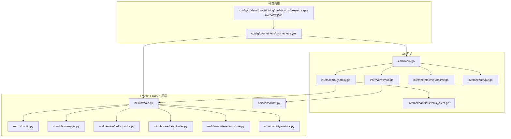
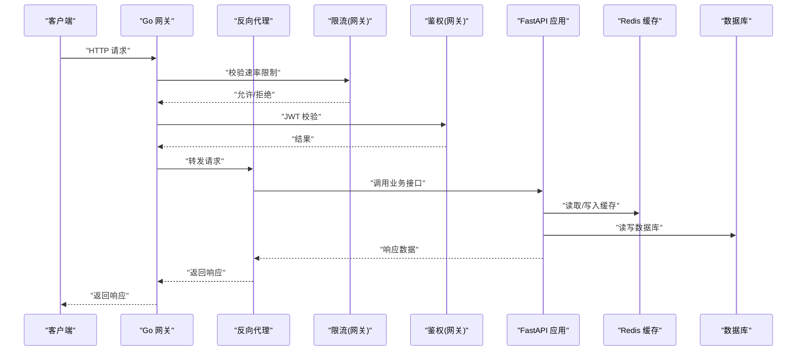
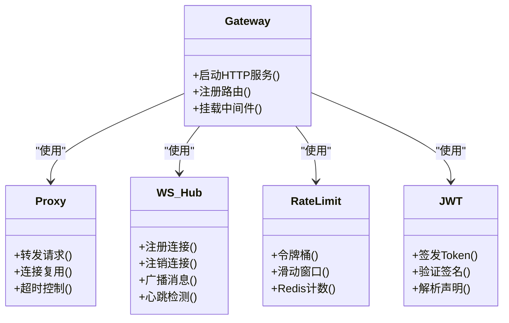
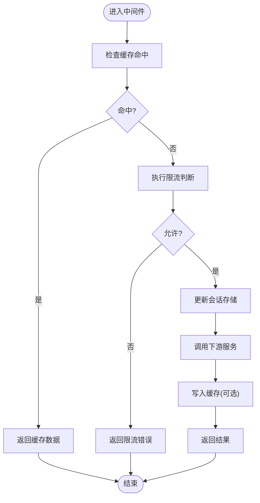
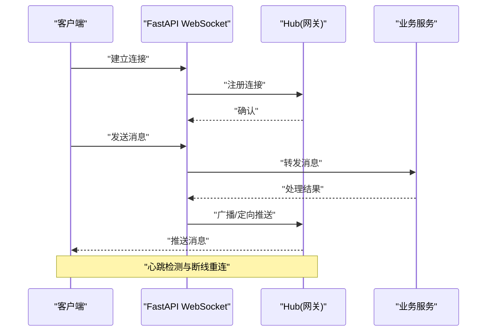
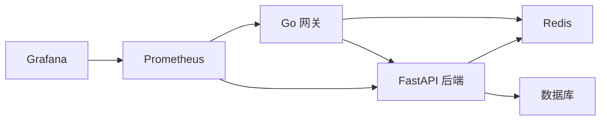

# 应用层性能优化

<cite>
**本文引用的文件**   
- [backend_design/nexus/main.py](file://backend_design/nexus/main.py)
- [backend_design/nexus/config.py](file://backend_design/nexus/config.py)
- [backend_design/nexus/core/db_manager.py](file://backend_design/nexus/core/db_manager.py)
- [backend_design/nexus/middleware/redis_cache.py](file://backend_design/nexus/middleware/redis_cache.py)
- [backend_design/nexus/middleware/rate_limiter.py](file://backend_design/nexus/middleware/rate_limiter.py)
- [backend_design/nexus/middleware/session_store.py](file://backend_design/nexus/middleware/session_store.py)
- [backend_design/nexus/api/websocket.py](file://backend_design/nexus/api/websocket.py)
- [backend_design/nexus/observability/metrics.py](file://backend_design/nexus/observability/metrics.py)
- [backend_design/nexus_gate/cmd/main.go](file://backend_design/nexus_gate/cmd/main.go)
- [backend_design/nexus_gate/internal/proxy/proxy.go](file://backend_design/nexus_gate/internal/proxy/proxy.go)
- [backend_design/nexus_gate/internal/ws/hub.go](file://backend_design/nexus_gate/internal/ws/hub.go)
- [backend_design/nexus_gate/internal/ratelimit/ratelimit.go](file://backend_design/nexus_gate/internal/ratelimit/ratelimit.go)
- [backend_design/nexus_gate/internal/handlers/redis_client.go](file://backend_design/nexus_gate/internal/handlers/redis_client.go)
- [backend_design/nexus_gate/internal/auth/jwt.go](file://backend_design/nexus_gate/internal/auth/jwt.go)
- [config/prometheus/prometheus.yml](file://config/prometheus/prometheus.yml)
- [config/grafana/provisioning/dashboards/nexuscockpit-overview.json](file://config/grafana/provisioning/dashboards/nexuscockpit-overview.json)
</cite>

## 目录
1. [简介](#简介)
2. [项目结构](#项目结构)
3. [核心组件](#核心组件)
4. [架构总览](#架构总览)
5. [详细组件分析](#详细组件分析)
6. [依赖关系分析](#依赖关系分析)
7. [性能考量](#性能考量)
8. [故障排查指南](#故障排查指南)
9. [结论](#结论)
10. [附录](#附录)

## 简介
本指南聚焦于应用层性能优化，覆盖以下方面：
- Python FastAPI 应用的异步优化策略：并发连接池配置、内存管理优化、GIL 锁优化技巧。
- Go 网关的高并发调优：goroutine 池配置、HTTP 连接复用、WebSocket 连接管理。
- 中间件性能优化：Redis 缓存策略、限流算法优化、会话存储优化。
- 具体配置参数示例与监控指标，包含基准测试方法与瓶颈识别工具使用指导。

## 项目结构
本项目采用前后端分离与多语言服务组合的架构：
- Python FastAPI 后端（Nexus）提供业务 API、WebSocket、RAG/ASR/TTS 等能力，并通过中间件实现缓存、限流与会话存储。
- Go 网关（Nexus Gate）负责鉴权、路由转发、限流与 WebSocket 代理。
- 可观测性通过 Prometheus + Grafana 暴露与展示关键指标。

图表来源
- [backend_design/nexus_gate/cmd/main.go](file://backend_design/nexus_gate/cmd/main.go)
- [backend_design/nexus_gate/internal/proxy/proxy.go](file://backend_design/nexus_gate/internal/proxy/proxy.go)
- [backend_design/nexus_gate/internal/ws/hub.go](file://backend_design/nexus_gate/internal/ws/hub.go)
- [backend_design/nexus_gate/internal/ratelimit/ratelimit.go](file://backend_design/nexus_gate/internal/ratelimit/ratelimit.go)
- [backend_design/nexus_gate/internal/handlers/redis_client.go](file://backend_design/nexus_gate/internal/handlers/redis_client.go)
- [backend_design/nexus_gate/internal/auth/jwt.go](file://backend_design/nexus_gate/internal/auth/jwt.go)
- [backend_design/nexus/main.py](file://backend_design/nexus/main.py)
- [backend_design/nexus/config.py](file://backend_design/nexus/config.py)
- [backend_design/nexus/core/db_manager.py](file://backend_design/nexus/core/db_manager.py)
- [backend_design/nexus/middleware/redis_cache.py](file://backend_design/nexus/middleware/redis_cache.py)
- [backend_design/nexus/middleware/rate_limiter.py](file://backend_design/nexus/middleware/rate_limiter.py)
- [backend_design/nexus/middleware/session_store.py](file://backend_design/nexus/middleware/session_store.py)
- [backend_design/nexus/api/websocket.py](file://backend_design/nexus/api/websocket.py)
- [backend_design/nexus/observability/metrics.py](file://backend_design/nexus/observability/metrics.py)
- [config/prometheus/prometheus.yml](file://config/prometheus/prometheus.yml)
- [config/grafana/provisioning/dashboards/nexuscockpit-overview.json](file://config/grafana/provisioning/dashboards/nexuscockpit-overview.json)

章节来源
- [backend_design/nexus/main.py](file://backend_design/nexus/main.py)
- [backend_design/nexus_gate/cmd/main.go](file://backend_design/nexus_gate/cmd/main.go)
- [config/prometheus/prometheus.yml](file://config/prometheus/prometheus.yml)

## 核心组件
- Go 网关
  - 入口与路由：负责启动 HTTP 服务、注册路由、挂载鉴权与限流中间件。
  - 反向代理：对上游 FastAPI 进行请求转发，需关注连接复用与超时控制。
  - WebSocket 代理：维护长连接与消息转发，需关注连接生命周期与资源清理。
  - 限流：基于令牌桶或滑动窗口实现，结合 Redis 做分布式限流。
- Python FastAPI 后端
  - 应用初始化：加载配置、注册路由、挂载中间件、启动事件循环。
  - 数据库连接池：异步驱动连接池大小、空闲回收、最大重试等。
  - 中间件：Redis 缓存、限流、会话存储。
  - 可观测性：Prometheus 指标导出与自定义业务指标。

章节来源
- [backend_design/nexus_gate/cmd/main.go](file://backend_design/nexus_gate/cmd/main.go)
- [backend_design/nexus_gate/internal/proxy/proxy.go](file://backend_design/nexus_gate/internal/proxy/proxy.go)
- [backend_design/nexus_gate/internal/ws/hub.go](file://backend_design/nexus_gate/internal/ws/hub.go)
- [backend_design/nexus_gate/internal/ratelimit/ratelimit.go](file://backend_design/nexus_gate/internal/ratelimit/ratelimit.go)
- [backend_design/nexus/main.py](file://backend_design/nexus/main.py)
- [backend_design/nexus/core/db_manager.py](file://backend_design/nexus/core/db_manager.py)
- [backend_design/nexus/middleware/redis_cache.py](file://backend_design/nexus/middleware/redis_cache.py)
- [backend_design/nexus/middleware/rate_limiter.py](file://backend_design/nexus/middleware/rate_limiter.py)
- [backend_design/nexus/middleware/session_store.py](file://backend_design/nexus/middleware/session_store.py)
- [backend_design/nexus/observability/metrics.py](file://backend_design/nexus/observability/metrics.py)

## 架构总览
下图展示了从客户端到 Go 网关再到 FastAPI 后端的典型请求路径，以及关键的中间件与外部依赖。

图表来源
- [backend_design/nexus_gate/cmd/main.go](file://backend_design/nexus_gate/cmd/main.go)
- [backend_design/nexus_gate/internal/proxy/proxy.go](file://backend_design/nexus_gate/internal/proxy/proxy.go)
- [backend_design/nexus_gate/internal/ratelimit/ratelimit.go](file://backend_design/nexus_gate/internal/ratelimit/ratelimit.go)
- [backend_design/nexus_gate/internal/auth/jwt.go](file://backend_design/nexus_gate/internal/auth/jwt.go)
- [backend_design/nexus/main.py](file://backend_design/nexus/main.py)
- [backend_design/nexus/middleware/redis_cache.py](file://backend_design/nexus/middleware/redis_cache.py)
- [backend_design/nexus/core/db_manager.py](file://backend_design/nexus/core/db_manager.py)

## 详细组件分析

### Python FastAPI 异步优化策略
- 事件循环与并发模型
  - 使用 uvicorn/gunicorn 时，合理设置 worker 数与线程/协程并发度，避免阻塞 I/O 操作。
  - 将 CPU 密集型任务放入进程池或外部队列，减少 GIL 影响。
- 连接池配置
  - 数据库连接池：根据 QPS 与平均延迟估算最大连接数；为空闲连接设置回收时间；开启重试与退避。
  - HTTP 客户端连接池：复用连接、设置最大空闲连接数与连接存活时间，降低握手开销。
- 内存管理优化
  - 大对象及时释放，避免在请求上下文中持有长生命周期引用。
  - 使用生成器与流式处理减少峰值内存占用。
  - 定期触发垃圾回收并监控堆增长趋势。
- GIL 锁优化技巧
  - 将计算密集逻辑迁移至 C/C++ 扩展或多进程。
  - 使用 asyncio.to_thread 包装阻塞调用，避免阻塞事件循环。
  - 对共享状态使用无锁数据结构或细粒度锁。

章节来源
- [backend_design/nexus/main.py](file://backend_design/nexus/main.py)
- [backend_design/nexus/core/db_manager.py](file://backend_design/nexus/core/db_manager.py)
- [backend_design/nexus/config.py](file://backend_design/nexus/config.py)

### Go 网关高并发调优
- goroutine 池配置
  - 使用有界工作池限制并发度，防止突发流量导致资源耗尽。
  - 按下游服务容量与错误率动态调整池大小。
- HTTP 连接复用
  - 配置 Transport 的连接池大小、空闲连接数、KeepAlive 时长与最大空闲连接每主机数。
  - 设置合理的超时与重试策略，避免雪崩。
- WebSocket 连接管理
  - 使用 Hub 集中管理连接，支持广播与定向推送。
  - 心跳检测与断线重连，确保连接健康。
  - 背压与队列缓冲，防止消息堆积导致内存暴涨。

图表来源
- [backend_design/nexus_gate/cmd/main.go](file://backend_design/nexus_gate/cmd/main.go)
- [backend_design/nexus_gate/internal/proxy/proxy.go](file://backend_design/nexus_gate/internal/proxy/proxy.go)
- [backend_design/nexus_gate/internal/ws/hub.go](file://backend_design/nexus_gate/internal/ws/hub.go)
- [backend_design/nexus_gate/internal/ratelimit/ratelimit.go](file://backend_design/nexus_gate/internal/ratelimit/ratelimit.go)
- [backend_design/nexus_gate/internal/auth/jwt.go](file://backend_design/nexus_gate/internal/auth/jwt.go)

章节来源
- [backend_design/nexus_gate/cmd/main.go](file://backend_design/nexus_gate/cmd/main.go)
- [backend_design/nexus_gate/internal/proxy/proxy.go](file://backend_design/nexus_gate/internal/proxy/proxy.go)
- [backend_design/nexus_gate/internal/ws/hub.go](file://backend_design/nexus_gate/internal/ws/hub.go)
- [backend_design/nexus_gate/internal/ratelimit/ratelimit.go](file://backend_design/nexus_gate/internal/ratelimit/ratelimit.go)
- [backend_design/nexus_gate/internal/auth/jwt.go](file://backend_design/nexus_gate/internal/auth/jwt.go)

### 中间件性能优化
- Redis 缓存策略
  - 热点键优先缓存，设置合理 TTL 与过期抖动。
  - 使用 Pipeline 批量操作，减少网络往返。
  - 缓存穿透防护：布隆过滤器或空值缓存。
  - 缓存击穿防护：互斥锁或一次性重建。
- 限流算法优化
  - 令牌桶适合平滑流量，滑动窗口适合精确统计。
  - 分布式场景下使用 Redis 原子操作保证一致性。
  - 针对用户/IP/接口维度分别限流，避免误伤。
- 会话存储优化
  - 使用 Redis 作为会话后端，设置过期时间与压缩。
  - 会话分片与分区键设计，提升查询效率。
  - 敏感字段加密存储，遵循最小化原则。

图表来源
- [backend_design/nexus/middleware/redis_cache.py](file://backend_design/nexus/middleware/redis_cache.py)
- [backend_design/nexus/middleware/rate_limiter.py](file://backend_design/nexus/middleware/rate_limiter.py)
- [backend_design/nexus/middleware/session_store.py](file://backend_design/nexus/middleware/session_store.py)

章节来源
- [backend_design/nexus/middleware/redis_cache.py](file://backend_design/nexus/middleware/redis_cache.py)
- [backend_design/nexus/middleware/rate_limiter.py](file://backend_design/nexus/middleware/rate_limiter.py)
- [backend_design/nexus/middleware/session_store.py](file://backend_design/nexus/middleware/session_store.py)

### WebSocket 连接管理（后端）
- 连接生命周期管理：建立、心跳、关闭、异常恢复。
- 消息路由与广播：按房间/主题分发，避免全量广播造成拥塞。
- 背压与队列：当消费者慢时，使用队列缓冲并丢弃低优先级消息。

图表来源
- [backend_design/nexus/api/websocket.py](file://backend_design/nexus/api/websocket.py)
- [backend_design/nexus_gate/internal/ws/hub.go](file://backend_design/nexus_gate/internal/ws/hub.go)

章节来源
- [backend_design/nexus/api/websocket.py](file://backend_design/nexus/api/websocket.py)
- [backend_design/nexus_gate/internal/ws/hub.go](file://backend_design/nexus_gate/internal/ws/hub.go)

## 依赖关系分析
- 组件耦合
  - 网关与后端通过 HTTP/WebSocket 解耦，中间件在两端均有实现，职责清晰。
  - Redis 作为共享缓存与会话存储，需注意连接池与序列化成本。
- 外部依赖
  - Prometheus 抓取指标，Grafana 可视化展示。
  - 数据库与向量库（如 Milvus/Neo4j）由后端直连，需关注连接池与查询计划。

图表来源
- [backend_design/nexus_gate/cmd/main.go](file://backend_design/nexus_gate/cmd/main.go)
- [backend_design/nexus/main.py](file://backend_design/nexus/main.py)
- [config/prometheus/prometheus.yml](file://config/prometheus/prometheus.yml)

章节来源
- [backend_design/nexus_gate/cmd/main.go](file://backend_design/nexus_gate/cmd/main.go)
- [backend_design/nexus/main.py](file://backend_design/nexus/main.py)
- [config/prometheus/prometheus.yml](file://config/prometheus/prometheus.yml)

## 性能考量
- 并发与吞吐
  - 根据 CPU 核数与 I/O 特性设置合适的 worker 与线程数。
  - 对下游服务设置熔断与降级，避免级联失败。
- 连接与超时
  - 合理设置连接池大小、空闲回收与超时时间，避免连接泄漏。
  - 对长耗时操作使用超时与取消机制。
- 缓存命中率
  - 监控缓存命中率与延迟，优化键设计与 TTL。
- 内存与 GC
  - 监控堆大小与 GC 频率，避免频繁 Full GC。
  - 减少临时对象分配，复用缓冲区。
- 监控与告警
  - 定义关键指标：QPS、P95/P99 延迟、错误率、连接池使用率、缓存命中率、GC 次数与停顿时间。
  - 配置阈值告警，及时发现异常。

[本节为通用指导，不直接分析具体文件]

## 故障排查指南
- 常见问题定位
  - 高延迟：检查数据库慢查询、Redis 大 Key、连接池饱和。
  - 高错误率：查看限流与熔断日志，确认下游服务健康。
  - 内存泄漏：分析堆快照，定位未释放对象与长生命周期引用。
- 工具与方法
  - Python：cProfile、py-spy、memory_profiler、tracemalloc。
  - Go：pprof、trace、go tool trace。
  - 系统：top、htop、iostat、netstat、ss。
  - 链路追踪：OpenTelemetry 集成，统一采集跨服务调用链。
- 指标与看板
  - Prometheus 抓取后端与网关指标。
  - Grafana 仪表盘展示关键指标与趋势。

章节来源
- [backend_design/nexus/observability/metrics.py](file://backend_design/nexus/observability/metrics.py)
- [config/prometheus/prometheus.yml](file://config/prometheus/prometheus.yml)
- [config/grafana/provisioning/dashboards/nexuscockpit-overview.json](file://config/grafana/provisioning/dashboards/nexuscockpit-overview.json)

## 结论
通过合理配置连接池、优化内存与 GIL 使用、完善中间件策略与可观测性体系，可以显著提升 FastAPI 与 Go 网关在高并发场景下的稳定性与性能。建议持续进行压测与监控，结合业务特征动态调优。

[本节为总结，不直接分析具体文件]

## 附录
- 基准测试方法
  - 使用 wrk/k6 对网关与后端进行压测，模拟不同负载与混合场景。
  - 记录 QPS、延迟分布、错误率与资源使用率。
- 配置参数示例（说明性）
  - Go 网关 Transport：最大空闲连接、KeepAlive 时长、最大连接数。
  - Python 数据库连接池：最大连接数、空闲回收时间、重试次数。
  - Redis 缓存：TTL、Pipeline 批量大小、序列化格式。
- 监控指标清单
  - 网关：入站 QPS、出站 QPS、P95/P99 延迟、错误率、连接复用率。
  - 后端：协程并发数、数据库连接池使用率、缓存命中率、GC 次数与停顿。
  - 中间件：限流拒绝率、会话存储延迟、Redis 命令延迟。

[本节为补充信息，不直接分析具体文件]