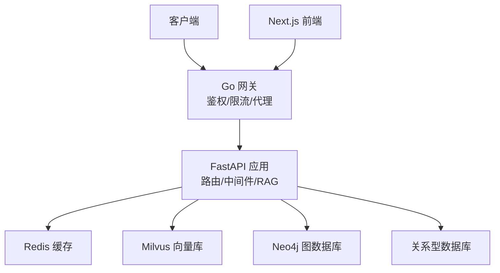
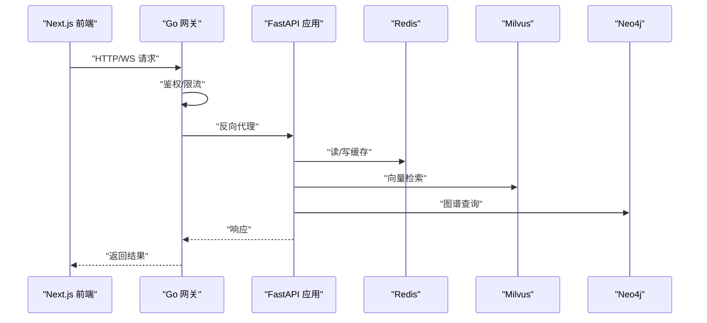
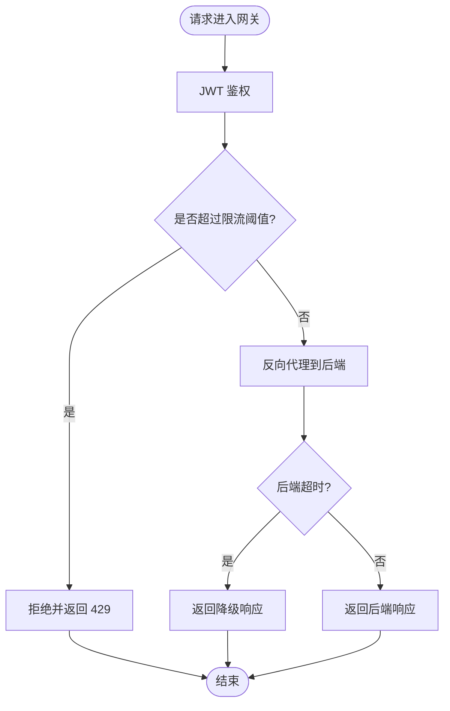
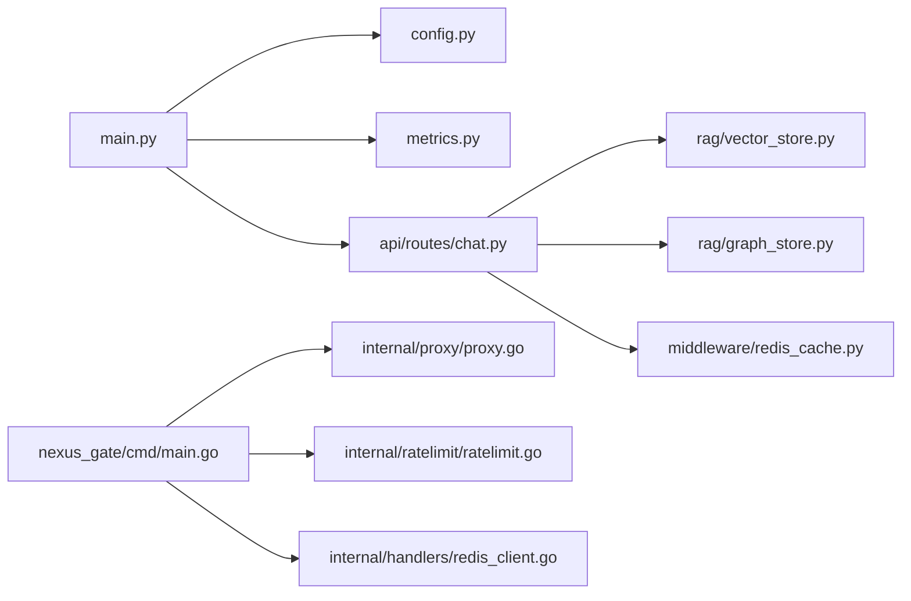

# 性能调优

<cite>
**本文引用的文件**   
- [backend_design/nexus/main.py](file://backend_design/nexus/main.py)
- [backend_design/nexus/config.py](file://backend_design/nexus/config.py)
- [backend_design/nexus/core/db_manager.py](file://backend_design/nexus/core/db_manager.py)
- [backend_design/nexus/middleware/redis_cache.py](file://backend_design/nexus/middleware/redis_cache.py)
- [backend_design/nexus/middleware/rate_limiter.py](file://backend_design/nexus/middleware/rate_limiter.py)
- [backend_design/nexus/observability/metrics.py](file://backend_design/nexus/observability/metrics.py)
- [backend_design/nexus/rag/vector_store.py](file://backend_design/nexus/rag/vector_store.py)
- [backend_design/nexus/rag/zilliz_vector_store.py](file://backend_design/nexus/rag/zilliz_vector_store.py)
- [backend_design/nexus/rag/graph_store.py](file://backend_design/nexus/rag/graph_store.py)
- [backend_design/nexus/rag/aura_graph_store.py](file://backend_design/nexus/rag/aura_graph_store.py)
- [backend_design/nexus/rag/retriever.py](file://backend_design/nexus/rag/retriever.py)
- [backend_design/nexus/api/routes/chat.py](file://backend_design/nexus/api/routes/chat.py)
- [backend_design/nexus_gate/cmd/main.go](file://backend_design/nexus_gate/cmd/main.go)
- [backend_design/nexus_gate/internal/proxy/proxy.go](file://backend_design/nexus_gate/internal/proxy/proxy.go)
- [backend_design/nexus_gate/internal/ratelimit/ratelimit.go](file://backend_design/nexus_gate/internal/ratelimit/ratelimit.go)
- [backend_design/nexus_gate/internal/handlers/redis_client.go](file://backend_design/nexus_gate/internal/handlers/redis_client.go)
- [frontend_design/next.config.js](file://frontend_design/next.config.js)
- [docker-compose.yml](file://docker-compose.yml)
</cite>

## 目录
1. [简介](#简介)
2. [项目结构](#项目结构)
3. [核心组件](#核心组件)
4. [架构总览](#架构总览)
5. [详细组件分析](#详细组件分析)
6. [依赖分析](#依赖分析)
7. [性能考虑](#性能考虑)
8. [故障排查指南](#故障排查指南)
9. [结论](#结论)
10. [附录](#附录)

## 简介
本指南面向 NexusCockpit 的性能调优，覆盖以下关键领域：
- Python FastAPI 应用优化（并发、I/O、中间件、缓存）
- Go 网关并发与代理调优（连接池、限流、WebSocket）
- Next.js 前端性能优化（构建、渲染、资源加载）
- 数据库与检索系统优化（Milvus 向量索引、Neo4j 图谱查询、Redis 缓存策略）
- 内存管理与垃圾回收（JVM、Python GC、容器内存限制）
- 监控指标与基准测试（关键指标定义、瓶颈识别、压测方案）
- 容量规划与负载测试方法

## 项目结构
NexusCockpit 采用前后端分离与多语言微服务组合：
- 后端：Python FastAPI 应用，提供业务 API、RAG 检索、中间件能力
- 网关：Go 实现的轻量网关，负责鉴权、限流、反向代理与 WebSocket 转发
- 前端：Next.js 应用，提供管理控制台与交互界面
- 数据层：Milvus（向量）、Neo4j（图谱）、Redis（缓存）、关系型数据库（会话/配置等）
- 可观测性：Prometheus/Grafana 集成，应用内埋点指标

图表来源
- [backend_design/nexus/main.py](file://backend_design/nexus/main.py)
- [backend_design/nexus_gate/cmd/main.go](file://backend_design/nexus_gate/cmd/main.go)
- [backend_design/nexus/rag/vector_store.py](file://backend_design/nexus/rag/vector_store.py)
- [backend_design/nexus/rag/graph_store.py](file://backend_design/nexus/rag/graph_store.py)
- [backend_design/nexus/middleware/redis_cache.py](file://backend_design/nexus/middleware/redis_cache.py)

章节来源
- [backend_design/nexus/main.py](file://backend_design/nexus/main.py)
- [backend_design/nexus_gate/cmd/main.go](file://backend_design/nexus_gate/cmd/main.go)
- [docker-compose.yml](file://docker-compose.yml)

## 核心组件
- FastAPI 应用入口与配置：包含启动参数、中间件注册、日志与可观测性初始化
- Go 网关：HTTP/WebSocket 代理、JWT 鉴权、令牌桶限流、Redis 客户端
- RAG 检索：向量检索（Milvus/Zilliz）、图谱检索（Neo4j/Aura）、统一检索器
- 中间件：Redis 缓存、速率限制、会话存储、任务队列
- 可观测性：应用指标采集与导出

章节来源
- [backend_design/nexus/main.py](file://backend_design/nexus/main.py)
- [backend_design/nexus/config.py](file://backend_design/nexus/config.py)
- [backend_design/nexus/middleware/redis_cache.py](file://backend_design/nexus/middleware/redis_cache.py)
- [backend_design/nexus/middleware/rate_limiter.py](file://backend_design/nexus/middleware/rate_limiter.py)
- [backend_design/nexus/observability/metrics.py](file://backend_design/nexus/observability/metrics.py)
- [backend_design/nexus/rag/unified_retriever.py](file://backend_design/nexus/rag/unified_retriever.py)

## 架构总览
下图展示请求从前端到后端再到数据层的完整路径，以及关键性能控制点。

图表来源
- [backend_design/nexus_gate/cmd/main.go](file://backend_design/nexus_gate/cmd/main.go)
- [backend_design/nexus_gate/internal/proxy/proxy.go](file://backend_design/nexus_gate/internal/proxy/proxy.go)
- [backend_design/nexus/api/routes/chat.py](file://backend_design/nexus/api/routes/chat.py)
- [backend_design/nexus/rag/vector_store.py](file://backend_design/nexus/rag/vector_store.py)
- [backend_design/nexus/rag/graph_store.py](file://backend_design/nexus/rag/graph_store.py)
- [backend_design/nexus/middleware/redis_cache.py](file://backend_design/nexus/middleware/redis_cache.py)

## 详细组件分析

### Python FastAPI 应用优化
- 并发模型
  - 使用 uvicorn/gunicorn 多进程+异步事件循环；合理设置 worker 数与线程数
  - 对 CPU 密集任务使用线程池或进程池隔离，避免阻塞事件循环
- I/O 与连接池
  - 数据库/外部服务调用使用连接池与超时重试
  - 批量操作合并减少往返次数
- 中间件与缓存
  - 启用 Redis 缓存热点数据，设置合理的 TTL 与失效策略
  - 使用速率限制保护后端，防止雪崩
- 可观测性与诊断
  - 暴露 Prometheus 指标，记录 P95/P99 延迟、错误率、QPS
  - 结构化日志与链路追踪，定位慢请求

章节来源
- [backend_design/nexus/main.py](file://backend_design/nexus/main.py)
- [backend_design/nexus/config.py](file://backend_design/nexus/config.py)
- [backend_design/nexus/middleware/redis_cache.py](file://backend_design/nexus/middleware/redis_cache.py)
- [backend_design/nexus/middleware/rate_limiter.py](file://backend_design/nexus/middleware/rate_limiter.py)
- [backend_design/nexus/observability/metrics.py](file://backend_design/nexus/observability/metrics.py)

### Go 网关并发调优
- 代理与连接
  - 调整 HTTP 客户端连接池大小、Keep-Alive 与超时
  - 针对 WebSocket 连接复用与心跳保活进行优化
- 鉴权与限流
  - JWT 校验前置，避免无效请求进入后端
  - 令牌桶/漏桶限流，按 IP/用户维度控制 QPS
- 错误处理与降级
  - 快速失败与熔断，避免级联故障
  - 超时与重试策略，结合幂等键保证一致性

图表来源
- [backend_design/nexus_gate/cmd/main.go](file://backend_design/nexus_gate/cmd/main.go)
- [backend_design/nexus_gate/internal/proxy/proxy.go](file://backend_design/nexus_gate/internal/proxy/proxy.go)
- [backend_design/nexus_gate/internal/ratelimit/ratelimit.go](file://backend_design/nexus_gate/internal/ratelimit/ratelimit.go)
- [backend_design/nexus_gate/internal/handlers/redis_client.go](file://backend_design/nexus_gate/internal/handlers/redis_client.go)

章节来源
- [backend_design/nexus_gate/cmd/main.go](file://backend_design/nexus_gate/cmd/main.go)
- [backend_design/nexus_gate/internal/proxy/proxy.go](file://backend_design/nexus_gate/internal/proxy/proxy.go)
- [backend_design/nexus_gate/internal/ratelimit/ratelimit.go](file://backend_design/nexus_gate/internal/ratelimit/ratelimit.go)
- [backend_design/nexus_gate/internal/handlers/redis_client.go](file://backend_design/nexus_gate/internal/handlers/redis_client.go)

### Next.js 前端性能优化
- 构建与打包
  - 开启增量编译与并行构建，按需引入第三方库
  - 图片/字体等资源压缩与懒加载
- 渲染策略
  - 静态生成（SSG）优先，动态页面使用服务端渲染（SSR）与客户端水合最小化
  - 列表虚拟化与分页加载，减少首屏 DOM 节点
- 网络与缓存
  - 浏览器缓存与 CDN 加速，HTTP/2 多路复用
  - 接口请求去抖与节流，避免重复请求

章节来源
- [frontend_design/next.config.js](file://frontend_design/next.config.js)

### 数据库与检索系统优化

#### Milvus 向量索引优化
- 索引类型选择
  - HNSW/IVF_FLAT/SCANN 根据数据规模与召回精度权衡
  - 高维向量建议 HNSW，低延迟场景关注 M 与 efConstruction
- 查询参数
  - topK 与 efSearch 平衡召回与延迟
  - 过滤条件下推，减少候选集
- 写入与重建
  - 批量插入与分段提交，避免频繁 flush
  - 定期重建索引以优化空间利用率

章节来源
- [backend_design/nexus/rag/vector_store.py](file://backend_design/nexus/rag/vector_store.py)
- [backend_design/nexus/rag/zilliz_vector_store.py](file://backend_design/nexus/rag/zilliz_vector_store.py)

#### Neo4j 图谱查询优化
- 查询设计
  - 使用索引与约束，避免全表扫描
  - 限制遍历深度与分支因子，减少笛卡尔积
- 执行计划
  - 使用 EXPLAIN 分析执行计划，优化 JOIN 顺序
  - 分批读取大结果集，避免 OOM
- 缓存与物化
  - 热点子图缓存至 Redis，降低重复计算

章节来源
- [backend_design/nexus/rag/graph_store.py](file://backend_design/nexus/rag/graph_store.py)
- [backend_design/nexus/rag/aura_graph_store.py](file://backend_design/nexus/rag/aura_graph_store.py)

#### Redis 缓存策略优化
- 缓存粒度
  - 按用户/会话/实体维度缓存，避免过大对象
  - 热点键拆分，降低锁竞争
- 过期与一致性
  - 短 TTL + 主动失效，保证最终一致
  - 双写策略与回源保护，避免缓存击穿
- 连接与序列化
  - 连接池大小与超时配置，序列化方式选择 msgpack/json 权衡

章节来源
- [backend_design/nexus/middleware/redis_cache.py](file://backend_design/nexus/middleware/redis_cache.py)
- [backend_design/nexus_gate/internal/handlers/redis_client.go](file://backend_design/nexus_gate/internal/handlers/redis_client.go)

### 内存管理与垃圾回收配置
- JVM 参数调优（适用于 Java 子系统）
  - 堆大小与新生代比例，选择合适的 GC（G1/ZGC）
  - 监控 GC 停顿与频率，调整目标吞吐与延迟
- Python GC 配置
  - 调整分代阈值与自动回收开关，必要时手动触发
  - 避免循环引用与大对象驻留
- 容器内存限制
  - 设置 requests/limits，避免 OOMKill
  - 监控 RSS 与 Swap，预留系统开销

章节来源
- [docker-compose.yml](file://docker-compose.yml)

### 监控指标分析与基准测试
- 关键指标定义
  - 延迟：P50/P95/P99，错误率，QPS，CPU/内存/IO 使用率
  - 检索质量：召回率、准确率、TopK 命中率
- 瓶颈识别方法
  - 分层打点：网关→应用→数据层，定位慢环节
  - 火焰图与慢查询分析，关联日志与链路追踪
- 性能基准测试
  - 端到端压测：模拟真实用户行为，阶梯加压
  - 回归测试：变更前后对比关键指标

章节来源
- [backend_design/nexus/observability/metrics.py](file://backend_design/nexus/observability/metrics.py)
- [backend_design/nexus/api/routes/chat.py](file://backend_design/nexus/api/routes/chat.py)

## 依赖分析
组件间依赖关系如下：

图表来源
- [backend_design/nexus/main.py](file://backend_design/nexus/main.py)
- [backend_design/nexus/config.py](file://backend_design/nexus/config.py)
- [backend_design/nexus/observability/metrics.py](file://backend_design/nexus/observability/metrics.py)
- [backend_design/nexus/api/routes/chat.py](file://backend_design/nexus/api/routes/chat.py)
- [backend_design/nexus/rag/vector_store.py](file://backend_design/nexus/rag/vector_store.py)
- [backend_design/nexus/rag/graph_store.py](file://backend_design/nexus/rag/graph_store.py)
- [backend_design/nexus/middleware/redis_cache.py](file://backend_design/nexus/middleware/redis_cache.py)
- [backend_design/nexus_gate/cmd/main.go](file://backend_design/nexus_gate/cmd/main.go)
- [backend_design/nexus_gate/internal/proxy/proxy.go](file://backend_design/nexus_gate/internal/proxy/proxy.go)
- [backend_design/nexus_gate/internal/ratelimit/ratelimit.go](file://backend_design/nexus_gate/internal/ratelimit/ratelimit.go)
- [backend_design/nexus_gate/internal/handlers/redis_client.go](file://backend_design/nexus_gate/internal/handlers/redis_client.go)

章节来源
- [backend_design/nexus/main.py](file://backend_design/nexus/main.py)
- [backend_design/nexus_gate/cmd/main.go](file://backend_design/nexus_gate/cmd/main.go)

## 性能考虑
- 端到端延迟优化
  - 网关侧快速鉴权与限流，减少无效请求
  - 应用侧缓存命中优先，检索层并行调用与结果合并
- 资源利用
  - 水平扩展：网关与应用无状态扩容，数据层垂直/水平扩展
  - 连接池与线程池调优，避免过度争用
- 稳定性
  - 熔断与降级，避免雪崩
  - 重试与幂等，保障一致性

[本节为通用指导，不直接分析具体文件]

## 故障排查指南
- 常见问题
  - 高延迟：检查网关超时、后端慢查询、检索层召回参数
  - 高错误率：查看限流与鉴权失败、下游服务异常
  - 内存飙升：定位大对象与泄漏，调整 GC 与容器限制
- 定位步骤
  - 通过指标面板筛选异常时段，关联日志与链路
  - 对热点接口进行压测复现，逐步缩小范围
  - 数据层慢查询与索引缺失验证

章节来源
- [backend_design/nexus/observability/metrics.py](file://backend_design/nexus/observability/metrics.py)
- [backend_design/nexus/middleware/rate_limiter.py](file://backend_design/nexus/middleware/rate_limiter.py)

## 结论
通过系统化调优网关、应用、检索与缓存层，并结合完善的监控与压测体系，NexusCockpit 可在高并发与复杂检索场景下保持稳定与高效。建议持续迭代指标与基线，形成闭环优化机制。

[本节为总结，不直接分析具体文件]

## 附录
- 负载测试方案
  - 工具：wrk/k6/JMeter
  - 场景：登录、聊天、检索、图谱查询
  - 指标：QPS、延迟分布、错误率、资源使用
- 容量规划指导
  - 基于历史峰值与增长趋势，评估 CPU/内存/带宽
  - 数据层容量：向量库分区、图数据库节点、缓存集群
  - 弹性伸缩策略：HPA/自动扩缩容

[本节为方法论说明，不直接分析具体文件]