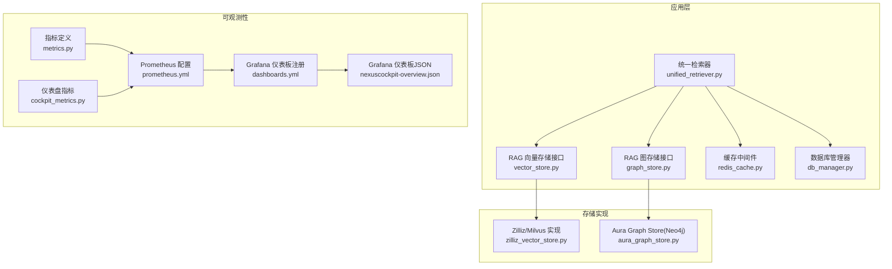
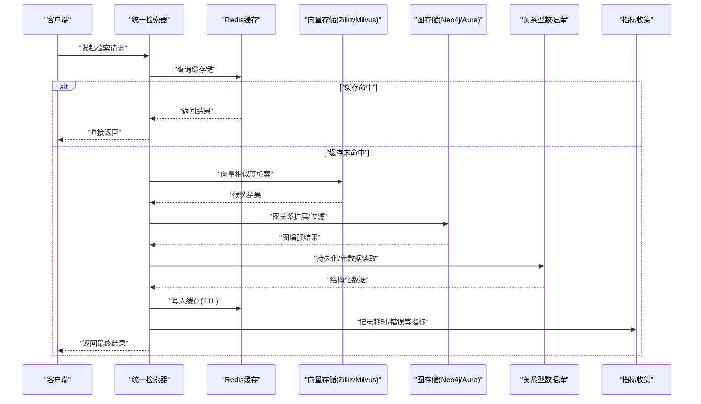
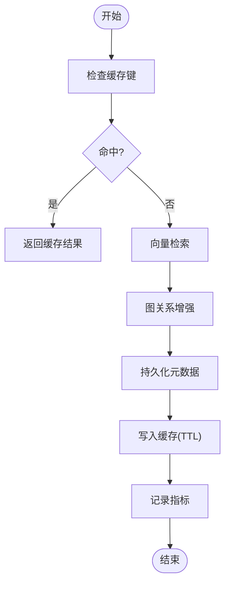
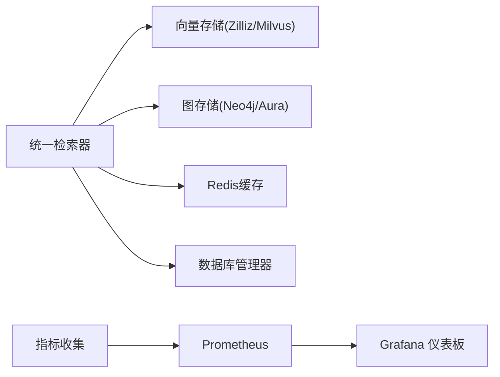

# 数据库性能优化

<cite>
**本文引用的文件**   
- [backend_design/nexus/config.py](file://backend_design/nexus/config.py)
- [backend_design/nexus/core/db_manager.py](file://backend_design/nexus/core/db_manager.py)
- [backend_design/nexus/middleware/redis_cache.py](file://backend_design/nexus/middleware/redis_cache.py)
- [backend_design/nexus/rag/vector_store.py](file://backend_design/nexus/rag/vector_store.py)
- [backend_design/nexus/rag/zilliz_vector_store.py](file://backend_design/nexus/rag/zilliz_vector_store.py)
- [backend_design/nexus/rag/graph_store.py](file://backend_design/nexus/rag/graph_store.py)
- [backend_design/nexus/rag/aura_graph_store.py](file://backend_design/nexus/rag/aura_graph_store.py)
- [backend_design/nexus/rag/unified_retriever.py](file://backend_design/nexus/rag/unified_retriever.py)
- [backend_design/nexus/observability/metrics.py](file://backend_design/nexus/observability/metrics.py)
- [backend_design/nexus/observability/cockpit_metrics.py](file://backend_design/nexus/observability/cockpit_metrics.py)
- [config/prometheus/prometheus.yml](file://config/prometheus/prometheus.yml)
- [config/grafana/provisioning/dashboards/dashboards.yml](file://config/grafana/provisioning/dashboards/dashboards.yml)
- [config/grafana/provisioning/dashboards/nexuscockpit-overview.json](file://config/grafana/provisioning/dashboards/nexuscockpit-overview.json)
- [docker-compose.yml](file://docker-compose.yml)
</cite>

## 目录
1. [简介](#简介)
2. [项目结构](#项目结构)
3. [核心组件](#核心组件)
4. [架构总览](#架构总览)
5. [详细组件分析](#详细组件分析)
6. [依赖关系分析](#依赖关系分析)
7. [性能考虑](#性能考虑)
8. [故障排查指南](#故障排查指南)
9. [结论](#结论)
10. [附录](#附录)

## 简介
本指南面向在生产环境中使用Milvus向量数据库、Neo4j图数据库、MySQL关系型数据库以及Redis缓存的系统，结合当前仓库中的实现与配置，提供可落地的性能调优建议。内容覆盖：
- Milvus：索引类型选择、分片策略、查询优化
- Neo4j：Cypher查询优化、索引策略、内存配置
- MySQL：连接池配置、查询优化、表结构设计优化
- Redis：缓存策略设计、数据过期策略、内存优化
- 监控与可观测性：Prometheus/Grafana集成、关键指标采集

## 项目结构
本项目在后端模块中抽象了多种存储后端（向量、图、关系型）与中间件（缓存、会话、任务队列），并通过统一检索器进行组合调用；同时提供了Prometheus与Grafana的配置文件用于监控。

图表来源
- [backend_design/nexus/rag/unified_retriever.py](file://backend_design/nexus/rag/unified_retriever.py)
- [backend_design/nexus/rag/vector_store.py](file://backend_design/nexus/rag/vector_store.py)
- [backend_design/nexus/rag/zilliz_vector_store.py](file://backend_design/nexus/rag/zilliz_vector_store.py)
- [backend_design/nexus/rag/graph_store.py](file://backend_design/nexus/rag/graph_store.py)
- [backend_design/nexus/rag/aura_graph_store.py](file://backend_design/nexus/rag/aura_graph_store.py)
- [backend_design/nexus/middleware/redis_cache.py](file://backend_design/nexus/middleware/redis_cache.py)
- [backend_design/nexus/core/db_manager.py](file://backend_design/nexus/core/db_manager.py)
- [backend_design/nexus/observability/metrics.py](file://backend_design/nexus/observability/metrics.py)
- [backend_design/nexus/observability/cockpit_metrics.py](file://backend_design/nexus/observability/cockpit_metrics.py)
- [config/prometheus/prometheus.yml](file://config/prometheus/prometheus.yml)
- [config/grafana/provisioning/dashboards/dashboards.yml](file://config/grafana/provisioning/dashboards/dashboards.yml)
- [config/grafana/provisioning/dashboards/nexuscockpit-overview.json](file://config/grafana/provisioning/dashboards/nexuscockpit-overview.json)

章节来源
- [backend_design/nexus/config.py](file://backend_design/nexus/config.py)
- [backend_design/nexus/rag/unified_retriever.py](file://backend_design/nexus/rag/unified_retriever.py)
- [backend_design/nexus/rag/vector_store.py](file://backend_design/nexus/rag/vector_store.py)
- [backend_design/nexus/rag/zilliz_vector_store.py](file://backend_design/nexus/rag/zilliz_vector_store.py)
- [backend_design/nexus/rag/graph_store.py](file://backend_design/nexus/rag/graph_store.py)
- [backend_design/nexus/rag/aura_graph_store.py](file://backend_design/nexus/rag/aura_graph_store.py)
- [backend_design/nexus/middleware/redis_cache.py](file://backend_design/nexus/middleware/redis_cache.py)
- [backend_design/nexus/core/db_manager.py](file://backend_design/nexus/core/db_manager.py)
- [backend_design/nexus/observability/metrics.py](file://backend_design/nexus/observability/metrics.py)
- [backend_design/nexus/observability/cockpit_metrics.py](file://backend_design/nexus/observability/cockpit_metrics.py)
- [config/prometheus/prometheus.yml](file://config/prometheus/prometheus.yml)
- [config/grafana/provisioning/dashboards/dashboards.yml](file://config/grafana/provisioning/dashboards/dashboards.yml)
- [config/grafana/provisioning/dashboards/nexuscockpit-overview.json](file://config/grafana/provisioning/dashboards/nexuscockpit-overview.json)

## 核心组件
- 统一检索器：协调向量检索、图检索与缓存命中，形成端到端查询路径。
- 向量存储接口与Zilliz/Milvus实现：封装集合管理、索引构建与相似性搜索。
- 图存储接口与Aura Graph Store：封装Neo4j连接、事务与查询执行。
- Redis缓存中间件：提供键值缓存能力，支持TTL与批量操作。
- 数据库管理器：封装关系型数据库连接与基础CRUD。
- 可观测性：指标定义与Prometheus/Grafana集成，支撑性能监控与告警。

章节来源
- [backend_design/nexus/rag/unified_retriever.py](file://backend_design/nexus/rag/unified_retriever.py)
- [backend_design/nexus/rag/vector_store.py](file://backend_design/nexus/rag/vector_store.py)
- [backend_design/nexus/rag/zilliz_vector_store.py](file://backend_design/nexus/rag/zilliz_vector_store.py)
- [backend_design/nexus/rag/graph_store.py](file://backend_design/nexus/rag/graph_store.py)
- [backend_design/nexus/rag/aura_graph_store.py](file://backend_design/nexus/rag/aura_graph_store.py)
- [backend_design/nexus/middleware/redis_cache.py](file://backend_design/nexus/middleware/redis_cache.py)
- [backend_design/nexus/core/db_manager.py](file://backend_design/nexus/core/db_manager.py)
- [backend_design/nexus/observability/metrics.py](file://backend_design/nexus/observability/metrics.py)
- [backend_design/nexus/observability/cockpit_metrics.py](file://backend_design/nexus/observability/cockpit_metrics.py)

## 架构总览
下图展示了从请求进入统一检索器到各存储后端的调用链，以及缓存与监控的参与点。

图表来源
- [backend_design/nexus/rag/unified_retriever.py](file://backend_design/nexus/rag/unified_retriever.py)
- [backend_design/nexus/rag/zilliz_vector_store.py](file://backend_design/nexus/rag/zilliz_vector_store.py)
- [backend_design/nexus/rag/aura_graph_store.py](file://backend_design/nexus/rag/aura_graph_store.py)
- [backend_design/nexus/core/db_manager.py](file://backend_design/nexus/core/db_manager.py)
- [backend_design/nexus/middleware/redis_cache.py](file://backend_design/nexus/middleware/redis_cache.py)
- [backend_design/nexus/observability/metrics.py](file://backend_design/nexus/observability/metrics.py)

## 详细组件分析

### Milvus/Zilliz 向量数据库性能优化
- 索引类型选择
  - 高维密集向量：优先HNSW或IVF_PQ，平衡召回率与延迟。
  - 大规模数据：IVF系列更利于内存占用控制；HNSW适合低延迟场景但需更大内存。
  - 量化压缩：PQ/OPQ在精度允许下显著降低内存与带宽。
- 分片与副本
  - 合理设置分区/分片数，避免单节点热点；按业务维度划分集合。
  - 副本提升读吞吐与可用性，写放大需权衡。
- 查询优化
  - 限制topK、预过滤条件、批处理合并请求。
  - 预热常用向量集合，减少冷启动开销。
- 监控要点
  - 关注索引构建耗时、查询延迟分布、内存与磁盘IO。

章节来源
- [backend_design/nexus/rag/vector_store.py](file://backend_design/nexus/rag/vector_store.py)
- [backend_design/nexus/rag/zilliz_vector_store.py](file://backend_design/nexus/rag/zilliz_vector_store.py)

### Neo4j 图数据库性能优化
- Cypher查询优化
  - 明确匹配模式，避免全图扫描；合理使用WITH聚合与LIMIT。
  - 将复杂子图计算拆分为多步，减少单次查询复杂度。
- 索引策略
  - 为高频过滤属性建立唯一/存在性索引；对标签+属性组合建复合索引。
  - 定期重建统计信息，确保查询计划最优。
- 内存配置
  - 调整堆大小与页缓存比例，避免频繁GC；监控JVM与Neo4j内部指标。
- 监控要点
  - 关注查询计划、锁等待、事务超时、CPU与内存峰值。

章节来源
- [backend_design/nexus/rag/graph_store.py](file://backend_design/nexus/rag/graph_store.py)
- [backend_design/nexus/rag/aura_graph_store.py](file://backend_design/nexus/rag/aura_graph_store.py)

### MySQL 关系数据库性能优化
- 连接池配置
  - 根据并发与慢查询情况调整最大连接数、空闲回收与超时时间。
  - 读写分离时区分主从连接池参数。
- 查询优化
  - 避免SELECT *，仅取必要字段；利用覆盖索引减少回表。
  - 分页采用基于游标或范围查询替代OFFSET深分页。
- 表结构设计
  - 规范化与反规范化权衡；大字段外置；冷热数据分层。
  - 合理选择字符集与排序规则，减少转换开销。
- 监控要点
  - 关注连接使用率、慢查询日志、锁等待与缓冲命中率。

章节来源
- [backend_design/nexus/core/db_manager.py](file://backend_design/nexus/core/db_manager.py)

### Redis 缓存最佳实践
- 缓存策略设计
  - 多级缓存：本地内存+Redis；热点数据优先本地。
  - 缓存穿透防护：布隆过滤器或空值缓存；缓存雪崩：随机TTL与限流。
- 数据过期策略
  - 短TTL配合主动刷新；长TTL配合版本号失效。
  - 批量删除时使用SCAN而非KEYS，避免阻塞。
- 内存优化
  - 合理设置maxmemory与淘汰策略；大对象序列化压缩。
  - 监控碎片率与内存增长趋势。
- 监控要点
  - 命中率、延迟、内存使用、命令耗时分布。

章节来源
- [backend_design/nexus/middleware/redis_cache.py](file://backend_design/nexus/middleware/redis_cache.py)

### 统一检索器与缓存协同流程

图表来源
- [backend_design/nexus/rag/unified_retriever.py](file://backend_design/nexus/rag/unified_retriever.py)
- [backend_design/nexus/middleware/redis_cache.py](file://backend_design/nexus/middleware/redis_cache.py)
- [backend_design/nexus/rag/zilliz_vector_store.py](file://backend_design/nexus/rag/zilliz_vector_store.py)
- [backend_design/nexus/rag/aura_graph_store.py](file://backend_design/nexus/rag/aura_graph_store.py)
- [backend_design/nexus/core/db_manager.py](file://backend_design/nexus/core/db_manager.py)
- [backend_design/nexus/observability/metrics.py](file://backend_design/nexus/observability/metrics.py)

## 依赖关系分析
- 统一检索器依赖向量存储、图存储、缓存与数据库管理器。
- 可观测性模块通过指标收集与Prometheus/Grafana配置形成闭环监控。
- 容器编排通过docker-compose统一管理服务依赖与端口暴露。

图表来源
- [backend_design/nexus/rag/unified_retriever.py](file://backend_design/nexus/rag/unified_retriever.py)
- [backend_design/nexus/rag/zilliz_vector_store.py](file://backend_design/nexus/rag/zilliz_vector_store.py)
- [backend_design/nexus/rag/aura_graph_store.py](file://backend_design/nexus/rag/aura_graph_store.py)
- [backend_design/nexus/middleware/redis_cache.py](file://backend_design/nexus/middleware/redis_cache.py)
- [backend_design/nexus/core/db_manager.py](file://backend_design/nexus/core/db_manager.py)
- [backend_design/nexus/observability/metrics.py](file://backend_design/nexus/observability/metrics.py)
- [config/prometheus/prometheus.yml](file://config/prometheus/prometheus.yml)
- [config/grafana/provisioning/dashboards/dashboards.yml](file://config/grafana/provisioning/dashboards/dashboards.yml)
- [docker-compose.yml](file://docker-compose.yml)

章节来源
- [backend_design/nexus/rag/unified_retriever.py](file://backend_design/nexus/rag/unified_retriever.py)
- [backend_design/nexus/rag/zilliz_vector_store.py](file://backend_design/nexus/rag/zilliz_vector_store.py)
- [backend_design/nexus/rag/aura_graph_store.py](file://backend_design/nexus/rag/aura_graph_store.py)
- [backend_design/nexus/middleware/redis_cache.py](file://backend_design/nexus/middleware/redis_cache.py)
- [backend_design/nexus/core/db_manager.py](file://backend_design/nexus/core/db_manager.py)
- [backend_design/nexus/observability/metrics.py](file://backend_design/nexus/observability/metrics.py)
- [config/prometheus/prometheus.yml](file://config/prometheus/prometheus.yml)
- [config/grafana/provisioning/dashboards/dashboards.yml](file://config/grafana/provisioning/dashboards/dashboards.yml)
- [docker-compose.yml](file://docker-compose.yml)

## 性能考虑
- 容量规划
  - 向量库：按向量维度、数量与查询QPS估算内存与磁盘；预留索引构建空间。
  - 图数据库：按节点/边规模与遍历深度评估堆与页缓存。
  - 关系库：按连接数与IOPS评估实例规格。
  - Redis：按热点数据总量与TTL分布估算内存峰值。
- 资源隔离
  - 不同存储独立部署，避免资源争用；容器化时设置CPU/内存限制。
- 弹性伸缩
  - 向量库与图库横向扩展分片/副本；关系库读写分离；Redis集群化。
- 成本优化
  - 使用混合索引与量化降低存储成本；冷热分层与归档降低热数据量。

[本节为通用指导，不直接分析具体文件]

## 故障排查指南
- 常见问题定位
  - 向量检索延迟飙升：检查索引状态、分片负载与网络抖动。
  - 图查询超时：查看慢查询计划、锁等待与内存压力。
  - 连接池耗尽：确认最大连接数、空闲回收与泄漏检测。
  - 缓存命中率低：分析键设计、TTL与热点分布。
- 监控与告警
  - 使用Prometheus抓取应用指标与存储侧指标；Grafana可视化关键面板。
  - 针对延迟P95/P99、错误率、内存使用设置阈值告警。
- 快速恢复
  - 降级策略：关闭非核心图增强或向量召回阶段，优先返回基础结果。
  - 熔断与重试：对下游不稳定服务实施熔断与退避重试。

章节来源
- [backend_design/nexus/observability/metrics.py](file://backend_design/nexus/observability/metrics.py)
- [backend_design/nexus/observability/cockpit_metrics.py](file://backend_design/nexus/observability/cockpit_metrics.py)
- [config/prometheus/prometheus.yml](file://config/prometheus/prometheus.yml)
- [config/grafana/provisioning/dashboards/dashboards.yml](file://config/grafana/provisioning/dashboards/dashboards.yml)
- [config/grafana/provisioning/dashboards/nexuscockpit-overview.json](file://config/grafana/provisioning/dashboards/nexuscockpit-overview.json)

## 结论
通过在向量、图、关系与缓存四个层面进行系统性调优，并结合完善的监控与告警体系，可在保证服务质量的前提下显著提升整体吞吐与稳定性。建议以指标驱动持续优化，结合压测验证变更效果。

[本节为总结性内容，不直接分析具体文件]

## 附录
- 配置文件参考位置
  - Prometheus抓取配置：[config/prometheus/prometheus.yml](file://config/prometheus/prometheus.yml)
  - Grafana仪表板注册：[config/grafana/provisioning/dashboards/dashboards.yml](file://config/grafana/provisioning/dashboards/dashboards.yml)
  - Grafana仪表板JSON：[config/grafana/provisioning/dashboards/nexuscockpit-overview.json](file://config/grafana/provisioning/dashboards/nexuscockpit-overview.json)
  - 容器编排与服务依赖：[docker-compose.yml](file://docker-compose.yml)
- 关键实现参考位置
  - 统一检索器：[backend_design/nexus/rag/unified_retriever.py](file://backend_design/nexus/rag/unified_retriever.py)
  - 向量存储接口与Zilliz实现：[backend_design/nexus/rag/vector_store.py](file://backend_design/nexus/rag/vector_store.py)、[backend_design/nexus/rag/zilliz_vector_store.py](file://backend_design/nexus/rag/zilliz_vector_store.py)
  - 图存储接口与Aura实现：[backend_design/nexus/rag/graph_store.py](file://backend_design/nexus/rag/graph_store.py)、[backend_design/nexus/rag/aura_graph_store.py](file://backend_design/nexus/rag/aura_graph_store.py)
  - Redis缓存中间件：[backend_design/nexus/middleware/redis_cache.py](file://backend_design/nexus/middleware/redis_cache.py)
  - 数据库管理器：[backend_design/nexus/core/db_manager.py](file://backend_design/nexus/core/db_manager.py)
  - 指标与仪表盘：[backend_design/nexus/observability/metrics.py](file://backend_design/nexus/observability/metrics.py)、[backend_design/nexus/observability/cockpit_metrics.py](file://backend_design/nexus/observability/cockpit_metrics.py)