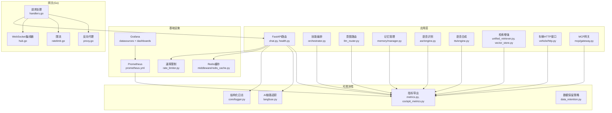
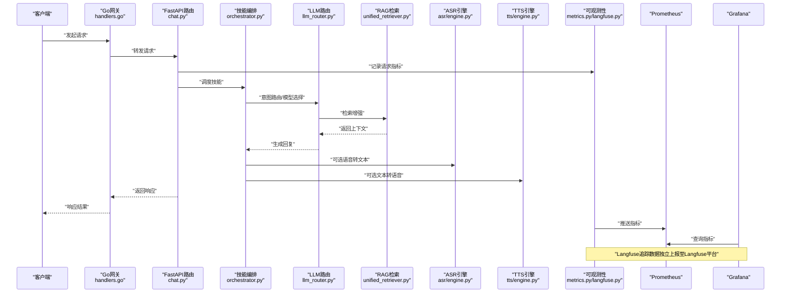
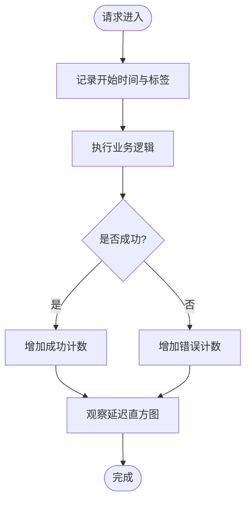
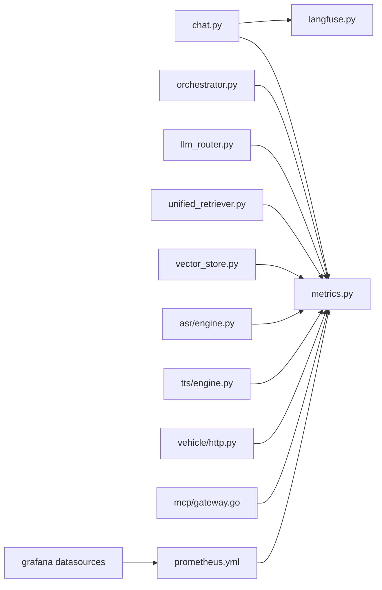

# 监控与性能分析

<cite>
**本文引用的文件**   
- [backend_design/nexus/observability/metrics.py](file://backend_design/nexus/observability/metrics.py)
- [backend_design/nexus/observability/langfuse.py](file://backend_design/nexus/observability/langfuse.py)
- [backend_design/nexus/observability/cockpit_metrics.py](file://backend_design/nexus/observability/cockpit_metrics.py)
- [backend_design/nexus/observability/data_retention.py](file://backend_design/nexus/observability/data_retention.py)
- [config/prometheus/prometheus.yml](file://config/prometheus/prometheus.yml)
- [config/grafana/provisioning/datasources/prometheus.yml](file://config/grafana/provisioning/datasources/prometheus.yml)
- [config/grafana/provisioning/dashboards/dashboards.yml](file://config/grafana/provisioning/dashboards/dashboards.yml)
- [config/grafana/provisioning/dashboards/nexuscockpit-overview.json](file://config/grafana/provisioning/dashboards/nexuscockpit-overview.json)
- [backend_design/nexus/api/routes/chat.py](file://backend_design/nexus/api/routes/chat.py)
- [backend_design/nexus/api/routes/health.py](file://backend_design/nexus/api/routes/health.py)
- [backend_design/nexus/core/logger.py](file://backend_design/nexus/core/logger.py)
- [backend_design/nexus/config.py](file://backend_design/nexus/config.py)
- [backend_design/nexus/main.py](file://backend_design/nexus/main.py)
- [backend_design/nexus/middleware/rate_limiter.py](file://backend_design/nexus/middleware/rate_limiter.py)
- [backend_design/nexus/middleware/redis_cache.py](file://backend_design/nexus/middleware/redis_cache.py)
- [backend_design/nexus/intent/llm_router.py](file://backend_design/nexus/intent/llm_router.py)
- [backend_design/nexus/skills/orchestrator.py](file://backend_design/nexus/skills/orchestrator.py)
- [backend_design/nexus/memory/manager.py](file://backend_design/nexus/memory/manager.py)
- [backend_design/nexus/asr/engine.py](file://backend_design/nexus/asr/engine.py)
- [backend_design/nexus/tts/engine.py](file://backend_design/nexus/tts/engine.py)
- [backend_design/nexus/rag/unified_retriever.py](file://backend_design/nexus/rag/unified_retriever.py)
- [backend_design/nexus/rag/vector_store.py](file://backend_design/nexus/rag/vector_store.py)
- [backend_design/nexus/vehicle/http.py](file://backend_design/nexus/vehicle/http.py)
- [backend_design/nexus/mcp/gateway.py](file://backend_design/nexus/mcp/gateway.py)
- [backend_design/nexus_gate/internal/handlers/handlers.go](file://backend_design/nexus_gate/internal/handlers/handlers.go)
- [backend_design/nexus_gate/internal/proxy/proxy.go](file://backend_design/nexus_gate/internal/proxy/proxy.go)
- [backend_design/nexus_gate/internal/ratelimit/ratelimit.go](file://backend_design/nexus_gate/internal/ratelimit/ratelimit.go)
- [backend_design/nexus_gate/internal/ws/hub.go](file://backend_design/nexus_gate/internal/ws/hub.go)
- [docker-compose.yml](file://docker-compose.yml)
- [scripts/test_metrics.py](file://scripts/test_metrics.py)
</cite>

## 目录
1. [简介](#简介)
2. [项目结构](#项目结构)
3. [核心组件](#核心组件)
4. [架构总览](#架构总览)
5. [详细组件分析](#详细组件分析)
6. [依赖关系分析](#依赖关系分析)
7. [性能考量](#性能考量)
8. [故障排查指南](#故障排查指南)
9. [结论](#结论)
10. [附录](#附录)

## 简介
本指南面向NexusCockpit系统的运维、研发与SRE团队，聚焦于“可观测性”与“性能工程”。文档围绕以下目标展开：
- 定义并采集关键性能指标（KPI）：响应时间、吞吐量、错误率、资源利用率等。
- 配置Prometheus监控系统：自定义指标导出、抓取配置、查询语言使用。
- 搭建Grafana可视化仪表板：预置面板解读、自定义图表创建、告警通知配置。
- 使用Langfuse进行AI链路追踪：对话质量评估、模型性能监控、成本分析。
- 设计性能基准测试与负载测试方案，覆盖API、ASR/TTS、RAG检索、车辆控制接口等。

## 项目结构
本项目在Python后端与Go网关两侧均埋点了可观测性能力，并通过Prometheus与Grafana提供统一监控视图；同时集成Langfuse用于AI链路追踪。

图示来源
- [backend_design/nexus/api/routes/chat.py](file://backend_design/nexus/api/routes/chat.py)
- [backend_design/nexus/api/routes/health.py](file://backend_design/nexus/api/routes/health.py)
- [backend_design/nexus/observability/metrics.py](file://backend_design/nexus/observability/metrics.py)
- [backend_design/nexus/observability/langfuse.py](file://backend_design/nexus/observability/langfuse.py)
- [backend_design/nexus/observability/cockpit_metrics.py](file://backend_design/nexus/observability/cockpit_metrics.py)
- [backend_design/nexus/observability/data_retention.py](file://backend_design/nexus/observability/data_retention.py)
- [backend_design/nexus/core/logger.py](file://backend_design/nexus/core/logger.py)
- [backend_design/nexus/middleware/rate_limiter.py](file://backend_design/nexus/middleware/rate_limiter.py)
- [backend_design/nexus/middleware/redis_cache.py](file://backend_design/nexus/middleware/redis_cache.py)
- [backend_design/nexus/intent/llm_router.py](file://backend_design/nexus/intent/llm_router.py)
- [backend_design/nexus/skills/orchestrator.py](file://backend_design/nexus/skills/orchestrator.py)
- [backend_design/nexus/memory/manager.py](file://backend_design/nexus/memory/manager.py)
- [backend_design/nexus/asr/engine.py](file://backend_design/nexus/asr/engine.py)
- [backend_design/nexus/tts/engine.py](file://backend_design/nexus/tts/engine.py)
- [backend_design/nexus/rag/unified_retriever.py](file://backend_design/nexus/rag/unified_retriever.py)
- [backend_design/nexus/rag/vector_store.py](file://backend_design/nexus/rag/vector_store.py)
- [backend_design/nexus/vehicle/http.py](file://backend_design/nexus/vehicle/http.py)
- [backend_design/nexus/mcp/gateway.py](file://backend_design/nexus/mcp/gateway.py)
- [backend_design/nexus_gate/internal/handlers/handlers.go](file://backend_design/nexus_gate/internal/handlers/handlers.go)
- [backend_design/nexus_gate/internal/proxy/proxy.go](file://backend_design/nexus_gate/internal/proxy/proxy.go)
- [backend_design/nexus_gate/internal/ratelimit/ratelimit.go](file://backend_design/nexus_gate/internal/ratelimit/ratelimit.go)
- [backend_design/nexus_gate/internal/ws/hub.go](file://backend_design/nexus_gate/internal/ws/hub.go)
- [config/prometheus/prometheus.yml](file://config/prometheus/prometheus.yml)
- [config/grafana/provisioning/datasources/prometheus.yml](file://config/grafana/provisioning/datasources/prometheus.yml)
- [config/grafana/provisioning/dashboards/dashboards.yml](file://config/grafana/provisioning/dashboards/dashboards.yml)
- [config/grafana/provisioning/dashboards/nexuscockpit-overview.json](file://config/grafana/provisioning/dashboards/nexuscockpit-overview.json)

章节来源
- [backend_design/nexus/main.py](file://backend_design/nexus/main.py)
- [backend_design/nexus/config.py](file://backend_design/nexus/config.py)
- [docker-compose.yml](file://docker-compose.yml)

## 核心组件
本节聚焦于指标采集、AI链路追踪、日志与数据保留策略，以及网关侧的可观测性支撑。

- 指标导出与业务指标
  - 通用指标封装与HTTP请求级指标（耗时、状态码、标签维度）。
  - 领域指标：会话数、意图分发成功率、RAG召回命中率、ASR/TTS时延、车辆接口调用成功率等。
- AI链路追踪（Langfuse）
  - 为每次对话生成trace/span，记录输入输出、模型参数、token用量、延迟与错误。
  - 支持按用户/会话/技能维度聚合，便于质量评估与成本核算。
- 结构化日志
  - 统一日志格式与上下文注入（租户、会话ID、请求ID），便于关联指标与追踪。
- 数据保留策略
  - 针对指标、日志、追踪数据的生命周期管理与清理策略。
- 网关侧可观测性
  - Go网关统计转发耗时、上游错误、WebSocket连接数与消息吞吐。

章节来源
- [backend_design/nexus/observability/metrics.py](file://backend_design/nexus/observability/metrics.py)
- [backend_design/nexus/observability/cockpit_metrics.py](file://backend_design/nexus/observability/cockpit_metrics.py)
- [backend_design/nexus/observability/langfuse.py](file://backend_design/nexus/observability/langfuse.py)
- [backend_design/nexus/observability/data_retention.py](file://backend_design/nexus/observability/data_retention.py)
- [backend_design/nexus/core/logger.py](file://backend_design/nexus/core/logger.py)
- [backend_design/nexus_gate/internal/handlers/handlers.go](file://backend_design/nexus_gate/internal/handlers/handlers.go)
- [backend_design/nexus_gate/internal/proxy/proxy.go](file://backend_design/nexus_gate/internal/proxy/proxy.go)
- [backend_design/nexus_gate/internal/ratelimit/ratelimit.go](file://backend_design/nexus_gate/internal/ratelimit/ratelimit.go)
- [backend_design/nexus_gate/internal/ws/hub.go](file://backend_design/nexus_gate/internal/ws/hub.go)

## 架构总览
下图展示从客户端到后端服务、再到监控栈的端到端流程，包括指标采集、链路追踪与可视化。

图示来源
- [backend_design/nexus_gate/internal/handlers/handlers.go](file://backend_design/nexus_gate/internal/handlers/handlers.go)
- [backend_design/nexus/api/routes/chat.py](file://backend_design/nexus/api/routes/chat.py)
- [backend_design/nexus/skills/orchestrator.py](file://backend_design/nexus/skills/orchestrator.py)
- [backend_design/nexus/intent/llm_router.py](file://backend_design/nexus/intent/llm_router.py)
- [backend_design/nexus/rag/unified_retriever.py](file://backend_design/nexus/rag/unified_retriever.py)
- [backend_design/nexus/asr/engine.py](file://backend_design/nexus/asr/engine.py)
- [backend_design/nexus/tts/engine.py](file://backend_design/nexus/tts/engine.py)
- [backend_design/nexus/observability/metrics.py](file://backend_design/nexus/observability/metrics.py)
- [backend_design/nexus/observability/langfuse.py](file://backend_design/nexus/observability/langfuse.py)
- [config/prometheus/prometheus.yml](file://config/prometheus/prometheus.yml)
- [config/grafana/provisioning/datasources/prometheus.yml](file://config/grafana/provisioning/datasources/prometheus.yml)

## 详细组件分析

### 指标体系与采集
- 指标分类
  - HTTP指标：请求总数、成功/失败计数、P50/P95/P99延迟、错误率、并发数。
  - 业务指标：会话创建/结束、意图分发成功率、RAG召回命中、ASR/TTS时延、车辆指令执行成功率。
  - 资源指标：CPU、内存、磁盘、网络I/O（由系统或Exporter提供）。
- 采集方式
  - Python侧通过指标库暴露标准HTTP端点供Prometheus抓取。
  - Go网关侧统计转发与WebSocket相关指标，统一上报。
- 标签设计
  - 建议包含：服务名、版本、租户、会话ID、技能名、模型名称、状态码、错误类型等。

图示来源
- [backend_design/nexus/observability/metrics.py](file://backend_design/nexus/observability/metrics.py)
- [backend_design/nexus/observability/cockpit_metrics.py](file://backend_design/nexus/observability/cockpit_metrics.py)

章节来源
- [backend_design/nexus/observability/metrics.py](file://backend_design/nexus/observability/metrics.py)
- [backend_design/nexus/observability/cockpit_metrics.py](file://backend_design/nexus/observability/cockpit_metrics.py)

### Prometheus配置与使用
- 抓取配置
  - 在Prometheus中配置对Python服务与Go网关的指标端点进行周期性抓取。
- 常用查询示例
  - 请求总量：sum by (status_code)(rate(http_requests_total[5m]))
  - P95延迟：histogram_quantile(0.95, rate(http_request_duration_seconds_bucket[5m]))
  - 错误率：sum(rate(http_requests_total{status_code=~"5.."}[5m])) / sum(rate(http_requests_total[5m]))
  - 资源使用：node_cpu_usage_seconds_total、node_memory_MemAvailable_bytes等（取决于部署环境）
- 告警规则
  - 基于阈值与趋势设置告警，如错误率超过阈值、延迟P99突增、资源不足等。

章节来源
- [config/prometheus/prometheus.yml](file://config/prometheus/prometheus.yml)

### Grafana仪表板与告警
- 数据源配置
  - 在Grafana中配置Prometheus数据源，确保能访问到Prometheus地址。
- 预置面板
  - 提供“NexusCockpit概览”面板，涵盖总体健康、请求量、延迟分布、错误率、资源使用等。
- 自定义图表
  - 基于PromQL构建多系列折线图、热力图、仪表盘等，结合标签过滤实现分租户/分技能视图。
- 告警通知
  - 在Grafana中配置告警规则并对接通知渠道（邮件、企业微信、Slack等）。

章节来源
- [config/grafana/provisioning/datasources/prometheus.yml](file://config/grafana/provisioning/datasources/prometheus.yml)
- [config/grafana/provisioning/dashboards/dashboards.yml](file://config/grafana/provisioning/dashboards/dashboards.yml)
- [config/grafana/provisioning/dashboards/nexuscockpit-overview.json](file://config/grafana/provisioning/dashboards/nexuscockpit-overview.json)

### Langfuse AI链路追踪
- 接入方式
  - 在服务启动时初始化Langfuse客户端，并在关键节点创建span（如意图路由、RAG检索、LLM调用、ASR/TTS）。
- 关键维度
  - 对话质量：输入输出一致性、意图识别准确率、工具调用成功率。
  - 模型性能：不同模型的延迟、成功率、token消耗。
  - 成本分析：按模型与技能维度汇总token用量与费用估算。
- 数据治理
  - 结合数据保留策略，定期归档或清理历史追踪数据，避免存储膨胀。

章节来源
- [backend_design/nexus/observability/langfuse.py](file://backend_design/nexus/observability/langfuse.py)
- [backend_design/nexus/observability/data_retention.py](file://backend_design/nexus/observability/data_retention.py)

### 网关侧可观测性（Go）
- 请求处理
  - 统计转发耗时、上游错误、重试次数。
- WebSocket
  - 统计在线连接数、消息收发速率、断连重连次数。
- 限流
  - 统计被拒绝的请求比例与IP/租户维度分布。

章节来源
- [backend_design/nexus_gate/internal/handlers/handlers.go](file://backend_design/nexus_gate/internal/handlers/handlers.go)
- [backend_design/nexus_gate/internal/proxy/proxy.go](file://backend_design/nexus_gate/internal/proxy/proxy.go)
- [backend_design/nexus_gate/internal/ratelimit/ratelimit.go](file://backend_design/nexus_gate/internal/ratelimit/ratelimit.go)
- [backend_design/nexus_gate/internal/ws/hub.go](file://backend_design/nexus_gate/internal/ws/hub.go)

### 中间件与外部依赖
- 速率限制
  - 基于令牌桶或滑动窗口实现，记录被限流的请求比例与热点租户/IP。
- 缓存
  - Redis缓存命中率、过期键数量、读写延迟。
- 外部接口
  - 车辆HTTP接口调用成功率、超时率、重试次数。
  - MCP网关调用成功率与延迟。

章节来源
- [backend_design/nexus/middleware/rate_limiter.py](file://backend_design/nexus/middleware/rate_limiter.py)
- [backend_design/nexus/middleware/redis_cache.py](file://backend_design/nexus/middleware/redis_cache.py)
- [backend_design/nexus/vehicle/http.py](file://backend_design/nexus/vehicle/http.py)
- [backend_design/nexus/mcp/gateway.py](file://backend_design/nexus/mcp/gateway.py)

### 健康检查与就绪探针
- 健康检查端点
  - 提供健康与就绪状态，便于负载均衡与健康探测。
- 探针集成
  - 在容器编排中配置liveness/readiness探针，结合指标与日志快速定位问题。

章节来源
- [backend_design/nexus/api/routes/health.py](file://backend_design/nexus/api/routes/health.py)

## 依赖关系分析
- 模块耦合
  - 路由层依赖可观测性模块进行指标与追踪上报。
  - 技能编排与意图路由依赖RAG与外部模型服务。
  - 网关层作为入口，承担转发、限流与WebSocket管理职责。
- 外部依赖
  - Prometheus/Grafana用于指标采集与可视化。
  - Langfuse用于AI链路追踪。
  - Redis用于缓存与会话存储。

图示来源
- [backend_design/nexus/api/routes/chat.py](file://backend_design/nexus/api/routes/chat.py)
- [backend_design/nexus/observability/metrics.py](file://backend_design/nexus/observability/metrics.py)
- [backend_design/nexus/observability/langfuse.py](file://backend_design/nexus/observability/langfuse.py)
- [backend_design/nexus/skills/orchestrator.py](file://backend_design/nexus/skills/orchestrator.py)
- [backend_design/nexus/intent/llm_router.py](file://backend_design/nexus/intent/llm_router.py)
- [backend_design/nexus/rag/unified_retriever.py](file://backend_design/nexus/rag/unified_retriever.py)
- [backend_design/nexus/rag/vector_store.py](file://backend_design/nexus/rag/vector_store.py)
- [backend_design/nexus/asr/engine.py](file://backend_design/nexus/asr/engine.py)
- [backend_design/nexus/tts/engine.py](file://backend_design/nexus/tts/engine.py)
- [backend_design/nexus/vehicle/http.py](file://backend_design/nexus/vehicle/http.py)
- [backend_design/nexus/mcp/gateway.py](file://backend_design/nexus/mcp/gateway.py)
- [config/prometheus/prometheus.yml](file://config/prometheus/prometheus.yml)
- [config/grafana/provisioning/datasources/prometheus.yml](file://config/grafana/provisioning/datasources/prometheus.yml)

## 性能考量
- 指标粒度与采样
  - 合理设置直方图桶与聚合窗口，避免过度细粒度导致存储压力。
- 标签基数控制
  - 避免高基数字段（如用户ID）直接作为标签，必要时采用哈希或采样。
- 异步上报
  - 将指标与追踪上报改为异步批处理，降低主路径开销。
- 缓存与降级
  - 对高频查询启用缓存；当外部依赖异常时启用降级策略，保障核心功能可用。
- 容量规划
  - 根据峰值QPS与延迟SLA规划实例数与资源配额，预留扩容空间。

## 故障排查指南
- 常见问题
  - 指标缺失：检查Prometheus抓取配置与服务端点可达性。
  - 延迟突增：查看P95/P99延迟与错误率，定位瓶颈模块（RAG、LLM、ASR/TTS）。
  - 错误率升高：结合日志与追踪，分析上游依赖与限流策略。
  - 资源不足：关注CPU/内存/磁盘/网络指标，评估是否需要扩容或优化。
- 诊断步骤
  - 使用Grafana面板快速定位异常时间段与受影响租户/技能。
  - 在Langfuse中查看具体trace，确认输入输出与模型调用细节。
  - 在日志系统中搜索请求ID，关联指标与追踪信息。
- 恢复建议
  - 临时扩容或切换备用模型/检索器。
  - 调整限流阈值与缓存策略。
  - 清理历史数据，释放存储资源。

章节来源
- [backend_design/nexus/core/logger.py](file://backend_design/nexus/core/logger.py)
- [backend_design/nexus/observability/data_retention.py](file://backend_design/nexus/observability/data_retention.py)

## 结论
通过统一的指标体系、完善的链路追踪与可视化能力，NexusCockpit实现了端到端的可观测性与性能工程闭环。建议在持续迭代中完善告警策略与容量规划，并结合Langfuse的数据驱动方法不断优化AI服务质量与成本效率。

## 附录

### 性能基准与负载测试方案
- 测试范围
  - API接口：聊天、健康检查、设置管理等。
  - AI链路：意图路由、RAG检索、LLM调用、ASR/TTS。
  - 外部依赖：车辆HTTP接口、MCP网关、Redis缓存。
- 工具与脚本
  - 使用现有测试脚本进行基础验证与回归。
  - 结合压测工具（如k6、locust）构造并发场景，模拟真实用户行为。
- 关键指标
  - QPS、P50/P95/P99延迟、错误率、资源利用率、缓存命中率、限流拒绝率。
- 场景设计
  - 单租户/多租户混合流量。
  - 峰值突发与长尾延迟场景。
  - 外部依赖故障与降级场景。
- 结果分析
  - 对比不同模型/检索器的性能差异。
  - 评估限流与缓存策略的有效性。
  - 输出容量规划与优化建议。

章节来源
- [scripts/test_metrics.py](file://scripts/test_metrics.py)