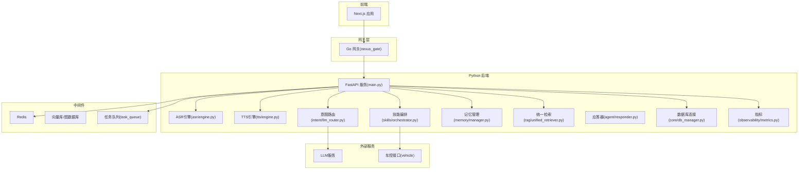
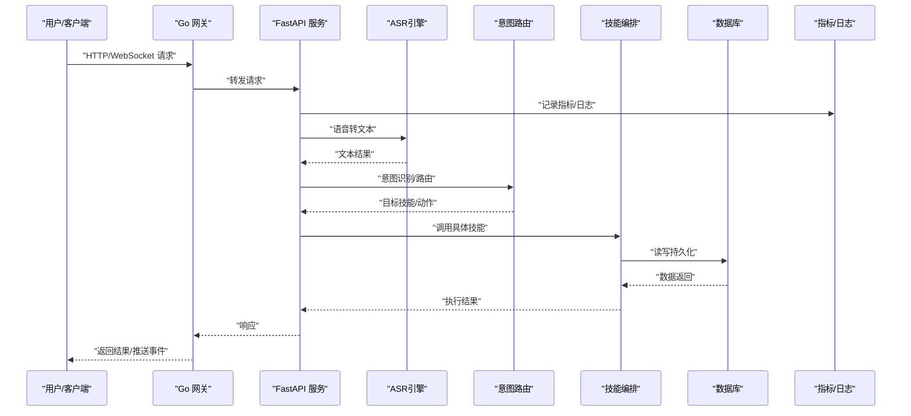
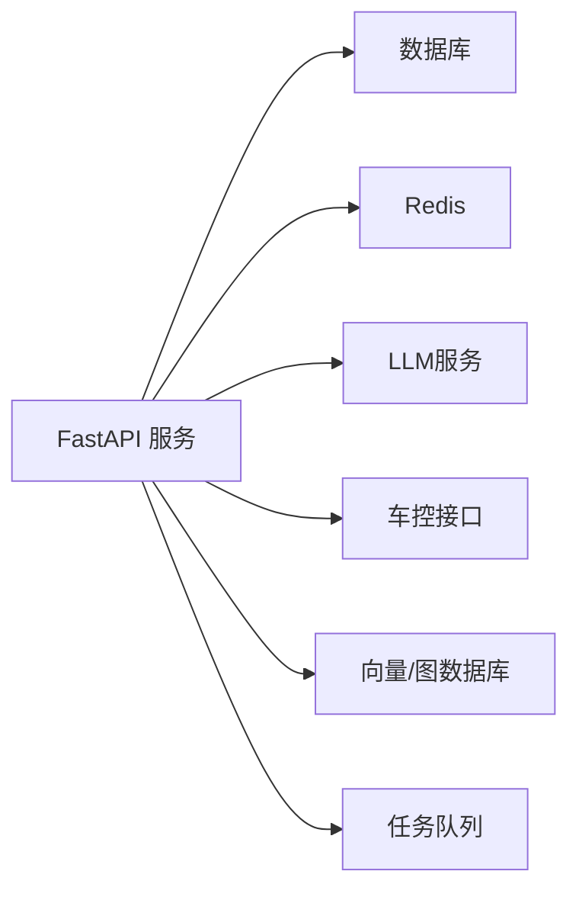
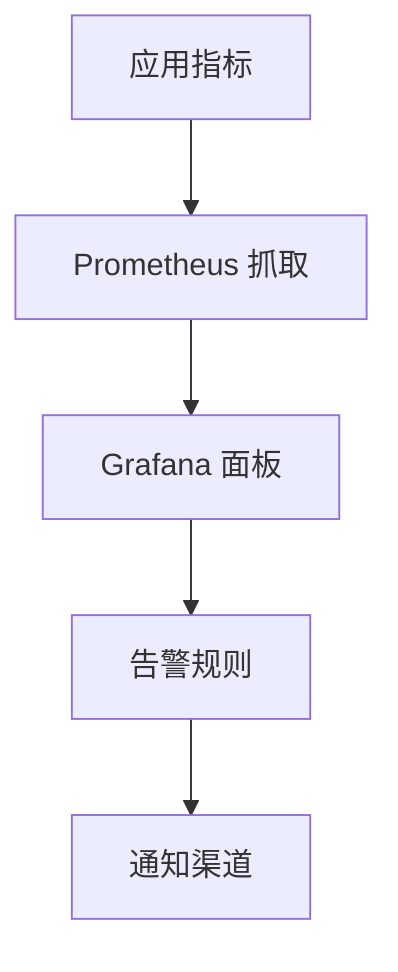
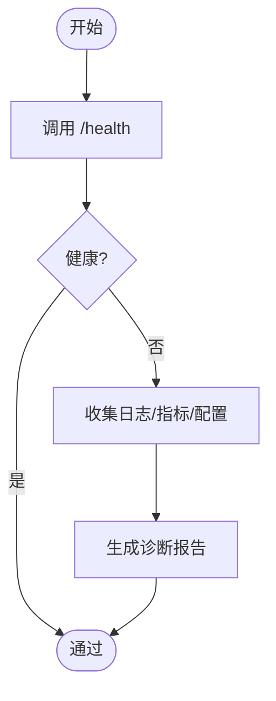

# 故障排查手册

<cite>
**本文引用的文件**   
- [backend_design/nexus/main.py](file://backend_design/nexus/main.py)
- [backend_design/nexus/core/logger.py](file://backend_design/nexus/core/logger.py)
- [backend_design/nexus/core/db_manager.py](file://backend_design/nexus/core/db_manager.py)
- [backend_design/nexus/core/exceptions.py](file://backend_design/nexus/core/exceptions.py)
- [backend_design/nexus/api/routes/health.py](file://backend_design/nexus/api/routes/health.py)
- [backend_design/nexus/api/websocket.py](file://backend_design/nexus/api/websocket.py)
- [backend_design/nexus/asr/engine.py](file://backend_design/nexus/asr/engine.py)
- [backend_design/nexus/tts/engine.py](file://backend_design/nexus/tts/engine.py)
- [backend_design/nexus/skills/orchestrator.py](file://backend_design/nexus/skills/orchestrator.py)
- [backend_design/nexus/skills/vehicle/climate.py](file://backend_design/nexus/skills/vehicle/climate.py)
- [backend_design/nexus/observability/metrics.py](file://backend_design/nexus/observability/metrics.py)
- [backend_design/nexus/observability/cockpit_metrics.py](file://backend_design/nexus/observability/cockpit_metrics.py)
- [config/grafana/provisioning/dashboards/nexuscockpit-overview.json](file://config/grafana/provisioning/dashboards/nexuscockpit-overview.json)
- [config/prometheus/prometheus.yml](file://config/prometheus/prometheus.yml)
- [docker-compose.yml](file://docker-compose.yml)
- [backend_design/scripts/test_db.py](file://backend_design/scripts/test_db.py)
- [backend_design/scripts/test_api.py](file://backend_design/scripts/test_api.py)
- [backend_design/scripts/test_metrics.py](file://backend_design/scripts/test_metrics.py)
- [backend_design/nexus/config.py](file://backend_design/nexus/config.py)
- [backend_design/nexus/core/circuit_breaker.py](file://backend_design/nexus/core/circuit_breaker.py)
- [backend_design/nexus/middleware/rate_limiter.py](file://backend_design/nexus/middleware/rate_limiter.py)
- [backend_design/nexus/middleware/redis_cache.py](file://backend_design/nexus/middleware/redis_cache.py)
- [backend_design/nexus/middleware/task_queue.py](file://backend_design/nexus/middleware/task_queue.py)
- [backend_design/nexus/intent/llm_router.py](file://backend_design/nexus/intent/llm_router.py)
- [backend_design/nexus/memory/manager.py](file://backend_design/nexus/memory/manager.py)
- [backend_design/nexus/rag/unified_retriever.py](file://backend_design/nexus/rag/unified_retriever.py)
- [backend_design/nexus/agent/responder.py](file://backend_design/nexus/agent/responder.py)
- [backend_design/nexus/agent/reviewer.py](file://backend_design/nexus/agent/reviewer.py)
- [backend_design/nexus/agent/supervisor_graph.py](file://backend_design/nexus/agent/supervisor_graph.py)
</cite>

## 目录
1. [简介](#简介)
2. [项目结构](#项目结构)
3. [核心组件](#核心组件)
4. [架构总览](#架构总览)
5. [详细组件分析](#详细组件分析)
6. [依赖关系分析](#依赖关系分析)
7. [性能与容量规划](#性能与容量规划)
8. [日志分析方法](#日志分析方法)
9. [监控与告警配置](#监控与告警配置)
10. [健康检查与自动化诊断](#健康检查与自动化诊断)
11. [典型故障场景案例](#典型故障场景案例)
12. [结论](#结论)

## 简介
本手册面向 NexusCockpit 的运维与研发人员，聚焦于常见问题的定位与解决、日志与可观测性实践、监控告警配置以及自动化诊断工具的使用。内容覆盖服务启动失败、网络连接异常、数据库连接问题、内存溢出、AI 模型加载失败、语音处理超时、车控指令执行异常等高频场景，并提供从现象到根因的系统化排查路径。

## 项目结构
NexusCockpit 采用前后端分离与多语言微服务组合：
- Python 后端（FastAPI）：提供 API、WebSocket、ASR/TTS、意图路由、记忆与检索、技能编排、可观测性等能力
- Go 网关（nexus_gate）：鉴权、限流、反向代理、WebSocket Hub
- 前端（Next.js）：控制台、聊天、车辆面板、仪表盘等
- 中间件：Redis、向量库、图数据库、对象存储等
- 可观测性：Prometheus、Grafana、Loki（可选）

图表来源
- [backend_design/nexus/main.py](file://backend_design/nexus/main.py)
- [backend_design/nexus/asr/engine.py](file://backend_design/nexus/asr/engine.py)
- [backend_design/nexus/tts/engine.py](file://backend_design/nexus/tts/engine.py)
- [backend_design/nexus/skills/orchestrator.py](file://backend_design/nexus/skills/orchestrator.py)
- [backend_design/nexus/intent/llm_router.py](file://backend_design/nexus/intent/llm_router.py)
- [backend_design/nexus/memory/manager.py](file://backend_design/nexus/memory/manager.py)
- [backend_design/nexus/rag/unified_retriever.py](file://backend_design/nexus/rag/unified_retriever.py)
- [backend_design/nexus/core/db_manager.py](file://backend_design/nexus/core/db_manager.py)
- [backend_design/nexus/observability/metrics.py](file://backend_design/nexus/observability/metrics.py)
- [backend_design/nexus/middleware/task_queue.py](file://backend_design/nexus/middleware/task_queue.py)

章节来源
- [backend_design/nexus/main.py](file://backend_design/nexus/main.py)
- [docker-compose.yml](file://docker-compose.yml)

## 核心组件
- 服务入口与生命周期：负责应用初始化、路由注册、中间件挂载、优雅关闭
- 日志系统：结构化日志输出、分级控制、上下文注入
- 数据库连接池：连接复用、重试与熔断、错误分类
- 可观测性：指标采集、请求追踪、业务埋点
- 中间件：限流、缓存、会话、任务队列
- 领域模块：ASR/TTS、意图路由、记忆与检索、技能编排、Agent 协作

章节来源
- [backend_design/nexus/core/logger.py](file://backend_design/nexus/core/logger.py)
- [backend_design/nexus/core/db_manager.py](file://backend_design/nexus/core/db_manager.py)
- [backend_design/nexus/observability/metrics.py](file://backend_design/nexus/observability/metrics.py)
- [backend_design/nexus/middleware/rate_limiter.py](file://backend_design/nexus/middleware/rate_limiter.py)
- [backend_design/nexus/middleware/redis_cache.py](file://backend_design/nexus/middleware/redis_cache.py)
- [backend_design/nexus/middleware/task_queue.py](file://backend_design/nexus/middleware/task_queue.py)

## 架构总览
下图展示关键请求链路中的组件交互与可观测性接入点，便于快速定位瓶颈与异常。

图表来源
- [backend_design/nexus/main.py](file://backend_design/nexus/main.py)
- [backend_design/nexus/asr/engine.py](file://backend_design/nexus/asr/engine.py)
- [backend_design/nexus/intent/llm_router.py](file://backend_design/nexus/intent/llm_router.py)
- [backend_design/nexus/skills/orchestrator.py](file://backend_design/nexus/skills/orchestrator.py)
- [backend_design/nexus/core/db_manager.py](file://backend_design/nexus/core/db_manager.py)
- [backend_design/nexus/observability/metrics.py](file://backend_design/nexus/observability/metrics.py)

## 详细组件分析

### 服务启动与生命周期
- 启动流程：加载配置、初始化日志、建立数据库连接、注册路由与中间件、启动异步任务
- 常见问题：端口占用、环境变量缺失、依赖服务不可用、证书/SSL 配置错误
- 建议：通过健康检查端点验证服务就绪；使用容器编排进行依赖顺序与重启策略控制

章节来源
- [backend_design/nexus/main.py](file://backend_design/nexus/main.py)
- [backend_design/nexus/config.py](file://backend_design/nexus/config.py)
- [backend_design/nexus/core/ssl_fix.py](file://backend_design/nexus/core/ssl_fix.py)

### 日志系统
- 特性：结构化 JSON 日志、TraceId 贯穿、分级输出、敏感信息脱敏
- 使用要点：在关键路径打点（进入/退出、异常分支、耗时统计）
- 排障技巧：按 TraceId 聚合全链路日志；结合时间窗口与关键字过滤

章节来源
- [backend_design/nexus/core/logger.py](file://backend_design/nexus/core/logger.py)

### 数据库连接与事务
- 连接池：最大连接数、空闲回收、超时与重试
- 错误分类：网络类、认证类、权限类、死锁/超时类
- 降级策略：只读副本、缓存命中、熔断保护

章节来源
- [backend_design/nexus/core/db_manager.py](file://backend_design/nexus/core/db_manager.py)
- [backend_design/nexus/core/circuit_breaker.py](file://backend_design/nexus/core/circuit_breaker.py)

### 可观测性与指标
- 内置指标：请求量、延迟分布、错误率、资源使用、业务指标（如 ASR/TTS 成功率）
- 集成方式：中间件自动埋点、手动埋点、自定义计数器/直方图
- 导出：Prometheus 抓取、Grafana 可视化

章节来源
- [backend_design/nexus/observability/metrics.py](file://backend_design/nexus/observability/metrics.py)
- [backend_design/nexus/observability/cockpit_metrics.py](file://backend_design/nexus/observability/cockpit_metrics.py)

### 中间件与基础设施
- 限流：基于令牌桶/滑动窗口，防止雪崩
- 缓存：Redis 热点数据缓存，失效与一致性策略
- 任务队列：异步长任务、重试与死信队列

章节来源
- [backend_design/nexus/middleware/rate_limiter.py](file://backend_design/nexus/middleware/rate_limiter.py)
- [backend_design/nexus/middleware/redis_cache.py](file://backend_design/nexus/middleware/redis_cache.py)
- [backend_design/nexus/middleware/task_queue.py](file://backend_design/nexus/middleware/task_queue.py)

### 领域模块
- ASR/TTS：音频编解码、模型加载、超时与回退
- 意图路由：规则+LLM 混合路由，失败回退至默认策略
- 记忆与检索：向量/图检索、压缩与冲突合并
- 技能编排：多技能协同、参数校验、幂等与补偿

章节来源
- [backend_design/nexus/asr/engine.py](file://backend_design/nexus/asr/engine.py)
- [backend_design/nexus/tts/engine.py](file://backend_design/nexus/tts/engine.py)
- [backend_design/nexus/intent/llm_router.py](file://backend_design/nexus/intent/llm_router.py)
- [backend_design/nexus/memory/manager.py](file://backend_design/nexus/memory/manager.py)
- [backend_design/nexus/rag/unified_retriever.py](file://backend_design/nexus/rag/unified_retriever.py)
- [backend_design/nexus/skills/orchestrator.py](file://backend_design/nexus/skills/orchestrator.py)

## 依赖关系分析
- 直接依赖：数据库、Redis、外部 LLM/车控接口
- 间接依赖：向量库、图数据库、消息队列
- 风险点：外部服务抖动、证书过期、配额限制、带宽饱和

图表来源
- [backend_design/nexus/main.py](file://backend_design/nexus/main.py)
- [backend_design/nexus/core/db_manager.py](file://backend_design/nexus/core/db_manager.py)
- [backend_design/nexus/middleware/redis_cache.py](file://backend_design/nexus/middleware/redis_cache.py)
- [backend_design/nexus/intent/llm_router.py](file://backend_design/nexus/intent/llm_router.py)
- [backend_design/nexus/skills/orchestrator.py](file://backend_design/nexus/skills/orchestrator.py)
- [backend_design/nexus/rag/unified_retriever.py](file://backend_design/nexus/rag/unified_retriever.py)
- [backend_design/nexus/middleware/task_queue.py](file://backend_design/nexus/middleware/task_queue.py)

章节来源
- [backend_design/nexus/main.py](file://backend_design/nexus/main.py)

## 性能与容量规划
- CPU/内存：ASR/TTS 模型加载峰值高，需预留足够内存并启用按需加载
- I/O：向量/图检索对磁盘与网络敏感，建议本地缓存热点索引
- 并发：合理设置连接池大小与线程池上限，避免上下文切换开销
- 弹性：水平扩展实例，配合负载均衡与健康检查

[本节为通用指导，不直接分析具体文件]

## 日志分析方法
- 结构化日志解析：以 TraceId 为主键聚合请求全链路日志，提取字段（级别、模块、耗时、状态码、错误码）
- 错误堆栈分析：关注最近一次变更、关联的外部依赖、资源水位
- 性能日志追踪：在关键函数入口/出口打点，计算 P50/P95/P99 延迟
- 常用命令与模式：按时间窗口筛选、关键字匹配、去重统计、Top N 错误

章节来源
- [backend_design/nexus/core/logger.py](file://backend_design/nexus/core/logger.py)

## 监控与告警配置
- Prometheus 抓取：确保服务暴露 /metrics 端点，配置 scrape 间隔与标签
- Grafana 仪表盘：导入概览面板，关注错误率、延迟、资源使用、业务指标
- 告警规则：基于阈值与复合条件（如错误率突增、P99 延迟飙升、连接池耗尽）

图表来源
- [backend_design/nexus/observability/metrics.py](file://backend_design/nexus/observability/metrics.py)
- [config/prometheus/prometheus.yml](file://config/prometheus/prometheus.yml)
- [config/grafana/provisioning/dashboards/nexuscockpit-overview.json](file://config/grafana/provisioning/dashboards/nexuscockpit-overview.json)

章节来源
- [config/prometheus/prometheus.yml](file://config/prometheus/prometheus.yml)
- [config/grafana/provisioning/dashboards/nexuscockpit-overview.json](file://config/grafana/provisioning/dashboards/nexuscockpit-overview.json)

## 健康检查与自动化诊断
- 健康检查端点：/health 返回服务状态、依赖项连通性、资源水位
- 脚本工具：
  - 数据库连通性测试
  - API 冒烟测试
  - 指标可用性验证
- 自动化诊断：一键收集日志片段、指标快照、配置摘要，生成诊断报告

图表来源
- [backend_design/nexus/api/routes/health.py](file://backend_design/nexus/api/routes/health.py)
- [backend_design/scripts/test_db.py](file://backend_design/scripts/test_db.py)
- [backend_design/scripts/test_api.py](file://backend_design/scripts/test_api.py)
- [backend_design/scripts/test_metrics.py](file://backend_design/scripts/test_metrics.py)

章节来源
- [backend_design/nexus/api/routes/health.py](file://backend_design/nexus/api/routes/health.py)
- [backend_design/scripts/test_db.py](file://backend_design/scripts/test_db.py)
- [backend_design/scripts/test_api.py](file://backend_design/scripts/test_api.py)
- [backend_design/scripts/test_metrics.py](file://backend_design/scripts/test_metrics.py)

## 典型故障场景案例

### 服务启动失败
- 现象：进程退出、端口无法监听、依赖服务报错
- 排查步骤：
  1) 查看启动日志，确认配置加载与依赖初始化阶段
  2) 检查端口占用与防火墙规则
  3) 验证数据库/Redis/外部服务连通性
  4) 使用健康检查端点确认就绪
- 参考文件
  - [backend_design/nexus/main.py](file://backend_design/nexus/main.py)
  - [backend_design/nexus/config.py](file://backend_design/nexus/config.py)
  - [backend_design/nexus/api/routes/health.py](file://backend_design/nexus/api/routes/health.py)

章节来源
- [backend_design/nexus/main.py](file://backend_design/nexus/main.py)
- [backend_design/nexus/config.py](file://backend_design/nexus/config.py)
- [backend_design/nexus/api/routes/health.py](file://backend_design/nexus/api/routes/health.py)

### 网络连接问题
- 现象：网关到后端超时、WebSocket 断连、外部服务不可达
- 排查步骤：
  1) 检查网关与后端间路由与证书
  2) 查看限流与熔断状态
  3) 抓包或网络探针定位丢包/延迟
  4) 验证 DNS 与域名解析
- 参考文件
  - [backend_design/nexus/middleware/rate_limiter.py](file://backend_design/nexus/middleware/rate_limiter.py)
  - [backend_design/nexus/core/circuit_breaker.py](file://backend_design/nexus/core/circuit_breaker.py)
  - [backend_design/nexus/api/websocket.py](file://backend_design/nexus/api/websocket.py)

章节来源
- [backend_design/nexus/middleware/rate_limiter.py](file://backend_design/nexus/middleware/rate_limiter.py)
- [backend_design/nexus/core/circuit_breaker.py](file://backend_design/nexus/core/circuit_breaker.py)
- [backend_design/nexus/api/websocket.py](file://backend_design/nexus/api/websocket.py)

### 数据库连接异常
- 现象：连接池耗尽、查询超时、认证失败
- 排查步骤：
  1) 检查连接池参数与活跃连接数
  2) 核对账号权限与白名单
  3) 观察慢查询与锁等待
  4) 使用测试脚本验证连通性
- 参考文件
  - [backend_design/nexus/core/db_manager.py](file://backend_design/nexus/core/db_manager.py)
  - [backend_design/scripts/test_db.py](file://backend_design/scripts/test_db.py)

章节来源
- [backend_design/nexus/core/db_manager.py](file://backend_design/nexus/core/db_manager.py)
- [backend_design/scripts/test_db.py](file://backend_design/scripts/test_db.py)

### 内存溢出（OOM）
- 现象：进程被杀、频繁重启、GC 抖动
- 排查步骤：
  1) 查看内存曲线与峰值
  2) 定位大对象与未释放引用
  3) 调整模型加载策略与批大小
  4) 增加实例或分片扩容
- 参考文件
  - [backend_design/nexus/asr/engine.py](file://backend_design/nexus/asr/engine.py)
  - [backend_design/nexus/tts/engine.py](file://backend_design/nexus/tts/engine.py)
  - [backend_design/nexus/rag/unified_retriever.py](file://backend_design/nexus/rag/unified_retriever.py)

章节来源
- [backend_design/nexus/asr/engine.py](file://backend_design/nexus/asr/engine.py)
- [backend_design/nexus/tts/engine.py](file://backend_design/nexus/tts/engine.py)
- [backend_design/nexus/rag/unified_retriever.py](file://backend_design/nexus/rag/unified_retriever.py)

### AI 模型加载失败
- 现象：ASR/TTS/Reranker 初始化报错、权重文件缺失、GPU 显存不足
- 排查步骤：
  1) 校验模型路径与权限
  2) 检查设备可用性与驱动版本
  3) 降低并发或分批加载
  4) 启用回退策略与降级开关
- 参考文件
  - [backend_design/nexus/asr/engine.py](file://backend_design/nexus/asr/engine.py)
  - [backend_design/nexus/tts/engine.py](file://backend_design/nexus/tts/engine.py)

章节来源
- [backend_design/nexus/asr/engine.py](file://backend_design/nexus/asr/engine.py)
- [backend_design/nexus/tts/engine.py](file://backend_design/nexus/tts/engine.py)

### 语音处理超时
- 现象：ASR 转写耗时过长、TTS 合成阻塞
- 排查步骤：
  1) 检查音频格式与采样率是否匹配
  2) 评估模型推理时间与并发度
  3) 引入超时与取消机制
  4) 使用缓存与预加载减少冷启动
- 参考文件
  - [backend_design/nexus/asr/engine.py](file://backend_design/nexus/asr/engine.py)
  - [backend_design/nexus/tts/engine.py](file://backend_design/nexus/tts/engine.py)

章节来源
- [backend_design/nexus/asr/engine.py](file://backend_design/nexus/asr/engine.py)
- [backend_design/nexus/tts/engine.py](file://backend_design/nexus/tts/engine.py)

### 车控指令执行异常
- 现象：空调/车窗/座椅等指令无响应或返回错误
- 排查步骤：
  1) 检查技能编排参数与权限
  2) 验证车控接口连通性与签名
  3) 查看重试与熔断状态
  4) 回放请求与响应，比对协议版本
- 参考文件
  - [backend_design/nexus/skills/orchestrator.py](file://backend_design/nexus/skills/orchestrator.py)
  - [backend_design/nexus/skills/vehicle/climate.py](file://backend_design/nexus/skills/vehicle/climate.py)

章节来源
- [backend_design/nexus/skills/orchestrator.py](file://backend_design/nexus/skills/orchestrator.py)
- [backend_design/nexus/skills/vehicle/climate.py](file://backend_design/nexus/skills/vehicle/climate.py)

### Agent 协作与审查异常
- 现象：多专家协作出错、审查环节卡住
- 排查步骤：
  1) 检查各专家输出格式与约束
  2) 审查器逻辑与阈值配置
  3) 监督图状态机流转是否正确
- 参考文件
  - [backend_design/nexus/agent/responder.py](file://backend_design/nexus/agent/responder.py)
  - [backend_design/nexus/agent/reviewer.py](file://backend_design/nexus/agent/reviewer.py)
  - [backend_design/nexus/agent/supervisor_graph.py](file://backend_design/nexus/agent/supervisor_graph.py)

章节来源
- [backend_design/nexus/agent/responder.py](file://backend_design/nexus/agent/responder.py)
- [backend_design/nexus/agent/reviewer.py](file://backend_design/nexus/agent/reviewer.py)
- [backend_design/nexus/agent/supervisor_graph.py](file://backend_design/nexus/agent/supervisor_graph.py)

## 结论
通过系统化日志分析、完善的监控告警与自动化诊断工具，能够快速定位 NexusCockpit 的启动、网络、数据库、内存与业务链路问题。建议在上线前完成健康检查与压测基线，持续优化关键路径的可观测性与容错能力。