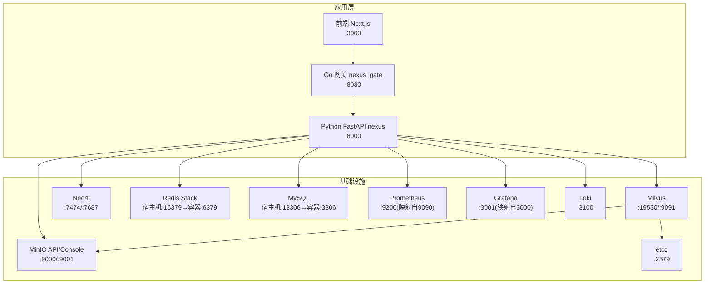
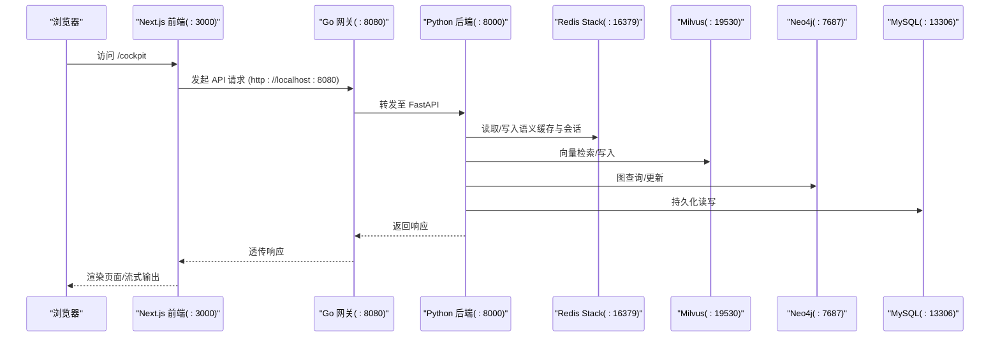
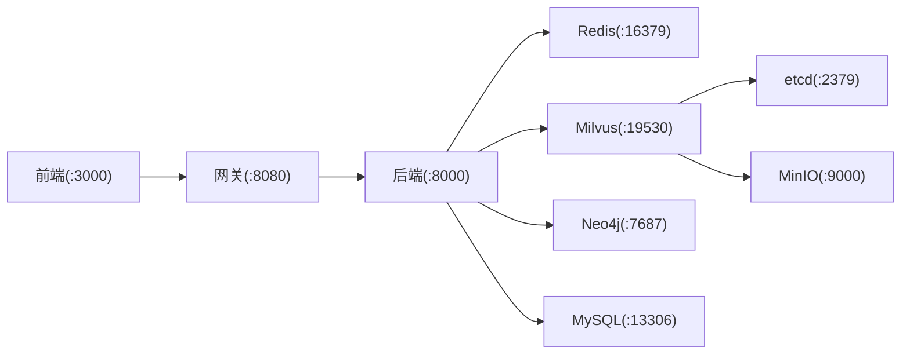

# 本地开发环境

<cite>
**本文引用的文件**   
- [README.md](file://README.md)
- [docker-compose.yml](file://docker-compose.yml)
- [.env.example](file://.env.example)
- [Makefile](file://Makefile)
- [backend_design/nexus/config.py](file://backend_design/nexus/config.py)
- [backend_design/nexus/main.py](file://backend_design/nexus/main.py)
- [frontend_design/next.config.js](file://frontend_design/next.config.js)
- [frontend_design/package.json](file://frontend_design/package.json)
- [docs/deployment/SETUP.md](file://docs/deployment/SETUP.md)
</cite>

## 目录
1. [简介](#简介)
2. [项目结构](#项目结构)
3. [核心组件](#核心组件)
4. [架构总览](#架构总览)
5. [详细组件分析](#详细组件分析)
6. [依赖关系分析](#依赖关系分析)
7. [性能与资源建议](#性能与资源建议)
8. [故障排查指南](#故障排查指南)
9. [结论](#结论)
10. [附录：端口与环境变量速查](#附录端口与环境变量速查)

## 简介
本指南面向本地开发者，目标是“一键启动、快速上手”。通过 Docker Compose 拉起 Milvus、Neo4j、Redis、MySQL、MinIO、Prometheus、Grafana、Loki 等基础设施；再分别启动 Go 网关、Python 后端与 Next.js 前端，即可在本地完成端到端联调。文档同时覆盖环境变量配置、热重载与调试技巧、日志查看方法、常见端口冲突解决方案以及跨平台注意事项，并给出推荐的开发工具链。

## 项目结构
- 根目录提供 docker-compose.yml 编排所有中间件与应用服务；Makefile 封装常用命令；.env.example 提供环境变量模板。
- 后端 Python 服务位于 backend_design/nexus，Go 网关位于 backend_design/nexus_gate，前端位于 frontend_design。
- 配置文件集中在 config/（Grafana/Prometheus/Loki），模型与数据分别在 models/ 与 data/。

图表来源
- [docker-compose.yml:1-246](file://docker-compose.yml#L1-L246)
- [frontend_design/next.config.js:1-21](file://frontend_design/next.config.js#L1-L21)
- [frontend_design/package.json:1-45](file://frontend_design/package.json#L1-L45)

章节来源
- [README.md:95-143](file://README.md#L95-L143)
- [docker-compose.yml:1-246](file://docker-compose.yml#L1-L246)

## 核心组件
- 基础设施（Docker Compose）
  - Milvus：向量检索（依赖 etcd、MinIO）
  - Neo4j：知识图谱（启用 APOC）
  - Redis Stack：语义缓存、限流、会话存储
  - MySQL：用户与审计数据（默认数据库 nexus_cockpit）
  - MinIO：对象存储（控制台 :9001）
  - Prometheus/Grafana/Loki：指标、可视化、日志聚合
- 应用服务
  - Go 网关：JWT鉴权、限流、WebSocket Hub、反向代理到 Python 后端
  - Python 后端：FastAPI + LangGraph 多智能体 + GraphRAG + 语音 ASR/TTS + 车控总线
  - 前端：Next.js 14 App Router，直连网关或可选 rewrites 代理

章节来源
- [docker-compose.yml:1-246](file://docker-compose.yml#L1-L246)
- [backend_design/nexus/main.py:294-452](file://backend_design/nexus/main.py#L294-L452)
- [frontend_design/next.config.js:1-21](file://frontend_design/next.config.js#L1-L21)

## 架构总览
下图展示本地开发时请求从浏览器到各中间件的完整链路，以及关键健康检查点。

图表来源
- [docker-compose.yml:1-246](file://docker-compose.yml#L1-L246)
- [backend_design/nexus/main.py:61-292](file://backend_design/nexus/main.py#L61-L292)

## 详细组件分析

### 一键启动与验证
- 启动基础设施
  - 使用 Makefile 或 docker compose 拉起全部中间件
- 验证服务状态
  - 使用 docker compose ps 确认各服务 running
  - 访问 Grafana/Prometheus/Loki 管理界面

章节来源
- [Makefile:75-88](file://Makefile#L75-L88)
- [README.md:166-178](file://README.md#L166-L178)
- [docs/deployment/SETUP.md:145-189](file://docs/deployment/SETUP.md#L145-L189)

### 环境变量配置（.env）
- 复制模板并编辑
  - cp .env.example .env
- 必填项
  - ARK_API_KEY、LLM_MODEL、EMBEDDING_MODEL、EMBEDDING_DIM
- 双模式开关（local/cloud）
  - VECTOR_STORE_PROVIDER、GRAPH_STORE_PROVIDER、CACHE_PROVIDER、RERANKER_PROVIDER
- 路径与数据目录
  - FUNASR_MODEL_PATH、CAM_MODEL_PATH、COSYVOICE_MODEL_PATH、SPEAKER_ENROLL_DIR、SPEAKER_USERS_DIR、FOOD_DATA_DIR、KNOWLEDGE_DATA_DIR、UPLOAD_DIR、TEMP_DIR、PREFERENCES_DIR
- 服务器与调试
  - HOST、PORT、DEBUG、LOG_LEVEL
- 其他
  - JWT、Tavily、Langfuse、Amap、观测性地址等

章节来源
- [.env.example:1-194](file://.env.example#L1-L194)
- [backend_design/nexus/config.py:97-158](file://backend_design/nexus/config.py#L97-L158)
- [backend_design/nexus/config.py:167-247](file://backend_design/nexus/config.py#L167-L247)
- [backend_design/nexus/config.py:253-330](file://backend_design/nexus/config.py#L253-L330)
- [backend_design/nexus/config.py:332-393](file://backend_design/nexus/config.py#L332-L393)
- [backend_design/nexus/config.py:416-432](file://backend_design/nexus/config.py#L416-L432)
- [backend_design/nexus/config.py:435-456](file://backend_design/nexus/config.py#L435-L456)
- [backend_design/nexus/config.py:458-504](file://backend_design/nexus/config.py#L458-L504)
- [backend_design/nexus/config.py:506-551](file://backend_design/nexus/config.py#L506-L551)
- [backend_design/nexus/config.py:557-581](file://backend_design/nexus/config.py#L557-L581)
- [backend_design/nexus/config.py:583-599](file://backend_design/nexus/config.py#L583-L599)

### 后端服务（Python FastAPI）
- 启动方式
  - 直接运行入口或使用 Makefile
- 生命周期初始化
  - 加载配置、初始化日志与指标、连接向量/图谱/缓存/数据库、注册路由与中间件
- 健康检查与文档
  - /health 健康检查、/docs Swagger UI

章节来源
- [Makefile:60-69](file://Makefile#L60-L69)
- [backend_design/nexus/main.py:61-292](file://backend_design/nexus/main.py#L61-L292)
- [backend_design/nexus/main.py:294-452](file://backend_design/nexus/main.py#L294-L452)
- [README.md:249-268](file://README.md#L249-L268)

### Go 网关
- 启动方式
  - go run cmd/main.go 或编译后运行
- 功能要点
  - JWT 鉴权、限流、WebSocket Hub、反向代理到 Python 后端
- 健康检查
  - /health

章节来源
- [README.md:269-287](file://README.md#L269-L287)

### 前端（Next.js）
- 启动方式
  - npm install && npm run dev
- 构建与部署
  - output: standalone 独立包，减小镜像体积
- 代理说明
  - 默认直连网关；如需避免 CORS，可启用 rewrites 将 /api/* 代理到网关

章节来源
- [frontend_design/package.json:1-45](file://frontend_design/package.json#L1-L45)
- [frontend_design/next.config.js:1-21](file://frontend_design/next.config.js#L1-L21)
- [README.md:289-306](file://README.md#L289-L306)

### 数据库与中间件初始化
- Milvus 集合初始化
- Neo4j 约束与索引初始化
- MySQL 迁移脚本自动执行（容器启动时）

章节来源
- [Makefile:94-97](file://Makefile#L94-L97)
- [docker-compose.yml:176-196](file://docker-compose.yml#L176-L196)
- [docs/deployment/SETUP.md:360-390](file://docs/deployment/SETUP.md#L360-L390)

## 依赖关系分析
- 应用间依赖
  - 前端 → Go 网关 → Python 后端
  - Python 后端 → Milvus/Neo4j/Redis/MySQL/MinIO/Prometheus/Grafana/Loki
- 中间件内部依赖
  - Milvus → etcd + MinIO
- 健康检查与就绪
  - 各服务均定义 healthcheck，Compose 按条件等待依赖就绪

图表来源
- [docker-compose.yml:1-246](file://docker-compose.yml#L1-L246)

章节来源
- [docker-compose.yml:1-246](file://docker-compose.yml#L1-L246)

## 性能与资源建议
- 硬件建议
  - CPU 4核起步，推荐 8核+；内存 8GB 起步，推荐 16GB+；磁盘 20GB 起步，含模型建议 50GB+
- 推理加速
  - 无 GPU 可使用 CPU 推理；有 GPU 建议安装 CUDA 驱动并使用对应 PyTorch 版本
- 模型下载
  - SenseVoice、CAM++、CosyVoice 需提前下载至 models/ 目录；CosyVoice 约 3.5GB

章节来源
- [docs/deployment/SETUP.md:40-48](file://docs/deployment/SETUP.md#L40-L48)
- [docs/deployment/SETUP.md:193-301](file://docs/deployment/SETUP.md#L193-L301)

## 故障排查指南
- Docker 启动失败
  - 检查 Docker 是否运行、端口占用情况
- Milvus 连接失败
  - 查看容器日志，等待完全启动后再试
- 模型加载失败
  - 检查模型文件是否存在、路径是否正确
- GPU 不可用
  - 检查 CUDA 驱动与 nvidia-smi
- Windows PowerShell 激活虚拟环境失败
  - 调整执行策略后重新激活
- pip 安装超时
  - 切换国内镜像源

章节来源
- [docs/deployment/SETUP.md:464-528](file://docs/deployment/SETUP.md#L464-L528)

## 结论
通过 Docker Compose 一键拉起中间件，配合 Makefile 与 .env 模板，可在本地快速搭建 NexusCockpit 的完整开发环境。遵循本文的环境变量与端口规范，结合调试与日志手段，能高效定位问题并推进迭代。

## 附录：端口与环境变量速查
- 常用端口
  - 前端: 3000
  - Go 网关: 8080
  - Python 后端: 8000
  - Milvus: 19530, 9091
  - Neo4j: 7474, 7687
  - Redis: 宿主机 16379 → 容器 6379
  - MySQL: 宿主机 13306 → 容器 3306
  - MinIO: 9000(API), 9001(Console)
  - Prometheus: 宿主机 9200 → 容器 9090
  - Grafana: 宿主机 3001 → 容器 3000
  - Loki: 3100
- 关键环境变量
  - ARK_API_KEY、LLM_MODEL、EMBEDDING_MODEL、EMBEDDING_DIM
  - VECTOR_STORE_PROVIDER、GRAPH_STORE_PROVIDER、CACHE_PROVIDER、RERANKER_PROVIDER
  - FUNASR_MODEL_PATH、CAM_MODEL_PATH、COSYVOICE_MODEL_PATH
  - HOST、PORT、DEBUG、LOG_LEVEL

章节来源
- [docker-compose.yml:1-246](file://docker-compose.yml#L1-L246)
- [.env.example:1-194](file://.env.example#L1-L194)