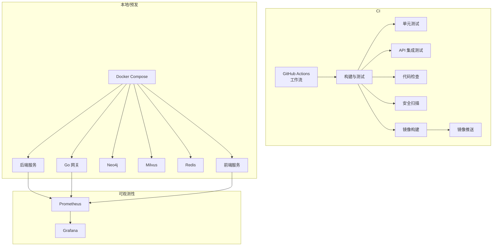
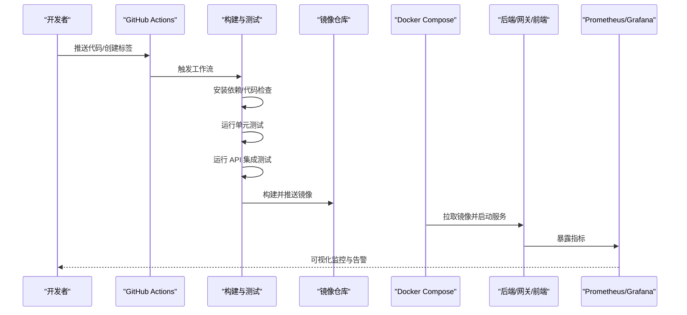
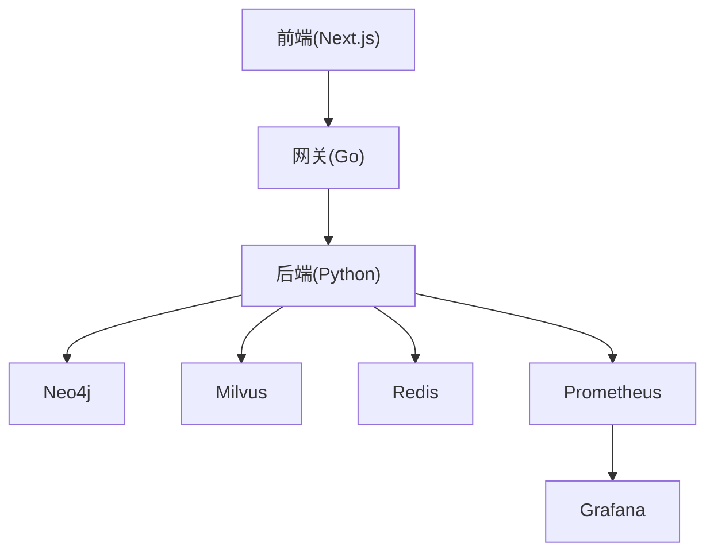

# CI/CD流水线

<cite>
**本文引用的文件**   
- [.github/workflows/ci.yml](file://.github/workflows/ci.yml)
- [docker-compose.yml](file://docker-compose.yml)
- [backend_design/Dockerfile](file://backend_design/Dockerfile)
- [frontend_design/Dockerfile](file://frontend_design/Dockerfile)
- [backend_design/pyproject.toml](file://backend_design/pyproject.toml)
- [backend_design/requirements.txt](file://backend_design/requirements.txt)
- [backend_design/nexus/main.py](file://backend_design/nexus/main.py)
- [backend_design/nexus/config.py](file://backend_design/nexus/config.py)
- [backend_design/tests/test_api.py](file://backend_design/tests/test_api.py)
- [backend_design/tests/test_core.py](file://backend_design/tests/test_core.py)
- [backend_design/scripts/test_api.py](file://backend_design/scripts/test_api.py)
- [backend_design/scripts/init_neo4j.py](file://backend_design/scripts/init_neo4j.py)
- [backend_design/scripts/init_milvus.py](file://backend_design/scripts/init_milvus.py)
- [backend_design/scripts/v2.1_migration.sql](file://backend_design/scripts/v2.1_migration.sql)
- [config/prometheus/prometheus.yml](file://config/prometheus/prometheus.yml)
- [config/grafana/provisioning/dashboards/dashboards.yml](file://config/grafana/provisioning/dashboards/dashboards.yml)
- [config/grafana/provisioning/datasources/prometheus.yml](file://config/grafana/provisioning/datasources/prometheus.yml)
- [Makefile](file://Makefile)
</cite>

## 目录
1. [简介](#简介)
2. [项目结构](#项目结构)
3. [核心组件](#核心组件)
4. [架构总览](#架构总览)
5. [详细组件分析](#详细组件分析)
6. [依赖分析](#依赖分析)
7. [性能考虑](#性能考虑)
8. [故障排查指南](#故障排查指南)
9. [结论](#结论)
10. [附录](#附录)

## 简介
本指南面向 NexusCockpit 的持续集成与持续交付（CI/CD）流水线，覆盖代码检查、单元测试、集成测试自动化、构建触发、镜像推送、多环境部署、灰度发布与回滚策略。文档基于仓库中现有 CI 配置、Docker 构建脚本、服务编排与可观测性配置进行系统化梳理，并提供可扩展的实践建议，帮助团队在开发、测试、生产环境中稳定高效地交付版本。

## 项目结构
NexusCockpit 采用前后端分离与微服务化设计：后端以 Python 为主，提供 API、RAG、ASR/TTS、技能编排等能力；前端基于 Next.js；网关使用 Go 实现；整体通过 Docker Compose 编排运行，并通过 GitHub Actions 执行 CI。

图表来源
- [.github/workflows/ci.yml](file://.github/workflows/ci.yml)
- [docker-compose.yml](file://docker-compose.yml)
- [backend_design/Dockerfile](file://backend_design/Dockerfile)
- [frontend_design/Dockerfile](file://frontend_design/Dockerfile)
- [config/prometheus/prometheus.yml](file://config/prometheus/prometheus.yml)
- [config/grafana/provisioning/dashboards/dashboards.yml](file://config/grafana/provisioning/dashboards/dashboards.yml)
- [config/grafana/provisioning/datasources/prometheus.yml](file://config/grafana/provisioning/datasources/prometheus.yml)

章节来源
- [.github/workflows/ci.yml](file://.github/workflows/ci.yml)
- [docker-compose.yml](file://docker-compose.yml)
- [backend_design/Dockerfile](file://backend_design/Dockerfile)
- [frontend_design/Dockerfile](file://frontend_design/Dockerfile)
- [config/prometheus/prometheus.yml](file://config/prometheus/prometheus.yml)
- [config/grafana/provisioning/dashboards/dashboards.yml](file://config/grafana/provisioning/dashboards/dashboards.yml)
- [config/grafana/provisioning/datasources/prometheus.yml](file://config/grafana/provisioning/datasources/prometheus.yml)

## 核心组件
- CI 工作流：定义触发条件、构建步骤、测试任务、镜像构建与推送。
- 容器化：后端与前端分别提供 Dockerfile，支持多阶段构建与依赖优化。
- 服务编排：docker-compose.yml 统一编排后端、网关、数据库、向量库、缓存与监控组件。
- 可观测性：Prometheus 采集指标，Grafana 提供仪表盘与数据源配置。
- 测试套件：Python 单元测试与 API 集成测试脚本，覆盖核心逻辑与接口稳定性。
- 初始化与迁移：数据库与向量库初始化脚本、数据迁移 SQL。

章节来源
- [.github/workflows/ci.yml](file://.github/workflows/ci.yml)
- [backend_design/Dockerfile](file://backend_design/Dockerfile)
- [frontend_design/Dockerfile](file://frontend_design/Dockerfile)
- [docker-compose.yml](file://docker-compose.yml)
- [config/prometheus/prometheus.yml](file://config/prometheus/prometheus.yml)
- [config/grafana/provisioning/dashboards/dashboards.yml](file://config/grafana/provisioning/dashboards/dashboards.yml)
- [config/grafana/provisioning/datasources/prometheus.yml](file://config/grafana/provisioning/datasources/prometheus.yml)
- [backend_design/tests/test_api.py](file://backend_design/tests/test_api.py)
- [backend_design/tests/test_core.py](file://backend_design/tests/test_core.py)
- [backend_design/scripts/test_api.py](file://backend_design/scripts/test_api.py)
- [backend_design/scripts/init_neo4j.py](file://backend_design/scripts/init_neo4j.py)
- [backend_design/scripts/init_milvus.py](file://backend_design/scripts/init_milvus.py)
- [backend_design/scripts/v2.1_migration.sql](file://backend_design/scripts/v2.1_migration.sql)

## 架构总览
下图展示从代码提交到部署上线的整体流程，包括 CI 中的构建与测试、镜像构建与推送，以及多环境下的服务编排与可观测性接入。

图表来源
- [.github/workflows/ci.yml](file://.github/workflows/ci.yml)
- [docker-compose.yml](file://docker-compose.yml)
- [backend_design/Dockerfile](file://backend_design/Dockerfile)
- [frontend_design/Dockerfile](file://frontend_design/Dockerfile)
- [config/prometheus/prometheus.yml](file://config/prometheus/prometheus.yml)
- [config/grafana/provisioning/dashboards/dashboards.yml](file://config/grafana/provisioning/dashboards/dashboards.yml)
- [config/grafana/provisioning/datasources/prometheus.yml](file://config/grafana/provisioning/datasources/prometheus.yml)

## 详细组件分析

### CI 工作流（GitHub Actions）
- 触发条件：支持分支推送与标签事件，便于按语义版本触发发布流程。
- 构建与测试：
  - 设置 Python 环境与依赖安装。
  - 执行代码检查（lint）、单元测试与 API 集成测试。
  - 可选安全扫描（如依赖漏洞扫描）。
- 镜像构建与推送：
  - 为后端与前端分别构建镜像，打标签（含 commit 或语义版本）。
  - 推送到镜像仓库，供后续环境部署使用。
- 部署触发：
  - 可通过 workflow_dispatch 或标签匹配触发部署任务。
  - 结合 docker-compose 在不同环境执行部署。

章节来源
- [.github/workflows/ci.yml](file://.github/workflows/ci.yml)

### 容器化与镜像构建
- 后端镜像：
  - 基于官方 Python 镜像，复制项目依赖与源码。
  - 安装依赖（pyproject.toml 与 requirements.txt），暴露端口，设置入口命令。
- 前端镜像：
  - 基于 Node 镜像，安装依赖并构建静态资源。
  - 使用轻量运行时镜像提供服务。
- 多阶段构建：
  - 构建阶段与运行阶段分离，减小镜像体积，提升安全性与启动速度。

章节来源
- [backend_design/Dockerfile](file://backend_design/Dockerfile)
- [frontend_design/Dockerfile](file://frontend_design/Dockerfile)
- [backend_design/pyproject.toml](file://backend_design/pyproject.toml)
- [backend_design/requirements.txt](file://backend_design/requirements.txt)

### 服务编排与环境管理
- 服务清单：
  - 后端服务、Go 网关、Neo4j、Milvus、Redis、前端服务、Prometheus、Grafana。
- 环境变量与配置：
  - 通过 docker-compose 的环境变量注入不同环境的差异化配置。
  - 后端配置文件（nexus/config.py）与服务入口（nexus/main.py）读取环境变量。
- 数据持久化：
  - Neo4j 与 Milvus 的数据卷挂载，确保重启后数据不丢失。
- 网络与端口：
  - 各服务间通过内部网络通信，对外暴露必要端口。

章节来源
- [docker-compose.yml](file://docker-compose.yml)
- [backend_design/nexus/config.py](file://backend_design/nexus/config.py)
- [backend_design/nexus/main.py](file://backend_design/nexus/main.py)

### 可观测性与监控
- Prometheus 配置：
  - 抓取后端与网关指标，提供时间序列数据。
- Grafana 配置：
  - 数据源指向 Prometheus。
  - 预置仪表盘（nexuscockpit-overview.json）用于概览关键指标。
- 指标暴露：
  - 后端服务通过中间件或 SDK 暴露 HTTP 指标与业务指标。

章节来源
- [config/prometheus/prometheus.yml](file://config/prometheus/prometheus.yml)
- [config/grafana/provisioning/dashboards/dashboards.yml](file://config/grafana/provisioning/dashboards/dashboards.yml)
- [config/grafana/provisioning/datasources/prometheus.yml](file://config/grafana/provisioning/datasources/prometheus.yml)

### 测试策略与覆盖率
- 单元测试：
  - 针对核心模块编写用例，验证业务逻辑正确性。
- API 集成测试：
  - 启动依赖服务（Neo4j、Milvus、Redis），调用真实接口验证端到端流程。
- 覆盖率统计：
  - 使用覆盖率工具生成报告，设定阈值保证质量基线。
- 性能与安全扫描：
  - 在 CI 中加入性能基准测试与安全依赖扫描，提前发现风险。

章节来源
- [backend_design/tests/test_api.py](file://backend_design/tests/test_api.py)
- [backend_design/tests/test_core.py](file://backend_design/tests/test_core.py)
- [backend_design/scripts/test_api.py](file://backend_design/scripts/test_api.py)
- [Makefile](file://Makefile)

### 初始化与数据迁移
- 数据库初始化：
  - Neo4j 初始化脚本用于创建图结构与基础数据。
- 向量库初始化：
  - Milvus 初始化脚本用于集合与索引准备。
- 数据迁移：
  - v2.1 迁移脚本用于数据库结构变更与数据兼容处理。

章节来源
- [backend_design/scripts/init_neo4j.py](file://backend_design/scripts/init_neo4j.py)
- [backend_design/scripts/init_milvus.py](file://backend_design/scripts/init_milvus.py)
- [backend_design/scripts/v2.1_migration.sql](file://backend_design/scripts/v2.1_migration.sql)

### 版本发布与灰度策略
- 语义版本控制：
  - 使用标签（如 v1.2.3）作为发布标识，CI 根据标签构建并发布镜像。
- 变更日志生成：
  - 基于 Git 标签与提交信息自动生成变更日志，辅助发布说明。
- 灰度发布：
  - 通过流量权重或金丝雀实例逐步放量，观察指标与错误率后再全量。

章节来源
- [.github/workflows/ci.yml](file://.github/workflows/ci.yml)
- [docker-compose.yml](file://docker-compose.yml)

### 回滚策略
- 快速回滚：
  - 将服务镜像回退至上一稳定版本，立即恢复服务。
- 数据迁移回滚：
  - 对不可逆迁移提供反向脚本或快照恢复机制。
- 服务降级：
  - 在异常情况下关闭非核心功能（如 RAG、TTS），保障核心链路可用。

章节来源
- [docker-compose.yml](file://docker-compose.yml)
- [backend_design/scripts/v2.1_migration.sql](file://backend_design/scripts/v2.1_migration.sql)

## 依赖分析
- 外部依赖：
  - Neo4j（图数据库）、Milvus（向量检索）、Redis（缓存与会话）、Prometheus/Grafana（监控）。
- 内部依赖：
  - 后端依赖中间件（限流、缓存、会话存储、任务队列）、RAG 组件（向量库、重排器）、ASR/TTS 引擎、车辆控制接口。
- 耦合关系：
  - 网关负责鉴权与路由，后端提供业务 API，前端通过网关访问后端。
  - 可观测性组件独立部署，通过指标采集与仪表盘展示系统状态。

图表来源
- [docker-compose.yml](file://docker-compose.yml)
- [config/prometheus/prometheus.yml](file://config/prometheus/prometheus.yml)
- [config/grafana/provisioning/dashboards/dashboards.yml](file://config/grafana/provisioning/dashboards/dashboards.yml)
- [config/grafana/provisioning/datasources/prometheus.yml](file://config/grafana/provisioning/datasources/prometheus.yml)

章节来源
- [docker-compose.yml](file://docker-compose.yml)
- [config/prometheus/prometheus.yml](file://config/prometheus/prometheus.yml)
- [config/grafana/provisioning/dashboards/dashboards.yml](file://config/grafana/provisioning/dashboards/dashboards.yml)
- [config/grafana/provisioning/datasources/prometheus.yml](file://config/grafana/provisioning/datasources/prometheus.yml)

## 性能考虑
- 构建优化：
  - 使用多阶段构建与依赖缓存，缩短 CI 构建时间。
- 镜像瘦身：
  - 仅包含运行所需依赖，移除构建工具与调试信息。
- 资源隔离：
  - 为各服务分配合理 CPU/内存限制，避免相互影响。
- 监控与告警：
  - 关注请求延迟、错误率、资源利用率，设置阈值告警。
- 容量规划：
  - 根据峰值 QPS 与并发连接数评估节点规模与水平扩展策略。

[本节为通用指导，无需特定文件引用]

## 故障排查指南
- CI 失败：
  - 检查依赖安装与测试输出，定位具体失败用例。
  - 确认镜像仓库认证与网络连通性。
- 服务启动失败：
  - 查看容器日志与端口占用，确认环境变量与配置文件。
  - 验证数据库与向量库初始化是否成功。
- 指标缺失：
  - 检查 Prometheus 抓取目标与 Grafana 数据源配置。
- 回滚问题：
  - 确认镜像版本一致性，核对数据迁移脚本执行顺序。

章节来源
- [.github/workflows/ci.yml](file://.github/workflows/ci.yml)
- [docker-compose.yml](file://docker-compose.yml)
- [config/prometheus/prometheus.yml](file://config/prometheus/prometheus.yml)
- [config/grafana/provisioning/dashboards/dashboards.yml](file://config/grafana/provisioning/dashboards/dashboards.yml)
- [config/grafana/provisioning/datasources/prometheus.yml](file://config/grafana/provisioning/datasources/prometheus.yml)

## 结论
通过完善的 CI/CD 流水线与多环境编排，NexusCockpit 能够实现高效的持续集成与稳定的持续交付。建议在现有基础上进一步完善覆盖率门禁、性能基准与安全扫描，并结合灰度发布与回滚策略提升发布可靠性与用户体验。

[本节为总结性内容，无需特定文件引用]

## 附录
- 常用命令：
  - 本地构建与运行：参考 Makefile 与 docker-compose 命令。
  - 运行测试：使用 pytest 与集成测试脚本。
  - 初始化依赖：执行 Neo4j 与 Milvus 初始化脚本。
- 最佳实践：
  - 小步快跑，频繁合并与发布。
  - 严格遵循语义版本与变更日志规范。
  - 持续改进监控与告警体系。

章节来源
- [Makefile](file://Makefile)
- [docker-compose.yml](file://docker-compose.yml)
- [backend_design/scripts/init_neo4j.py](file://backend_design/scripts/init_neo4j.py)
- [backend_design/scripts/init_milvus.py](file://backend_design/scripts/init_milvus.py)