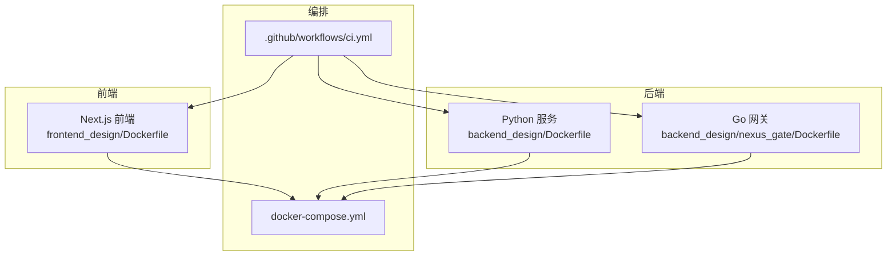
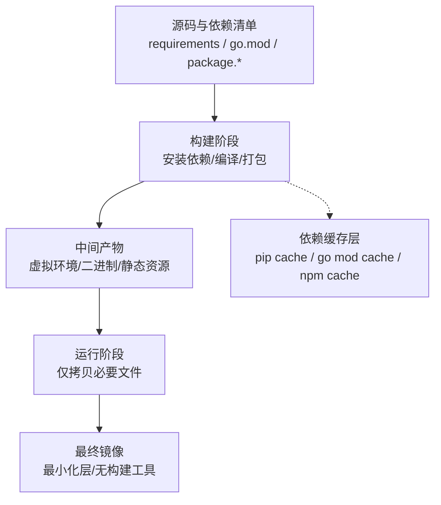
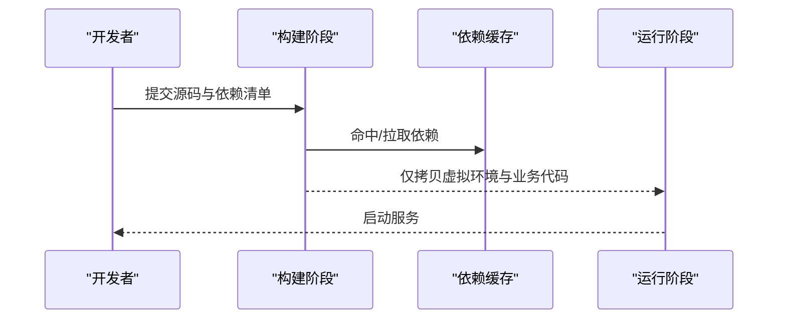
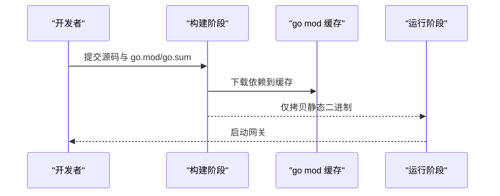
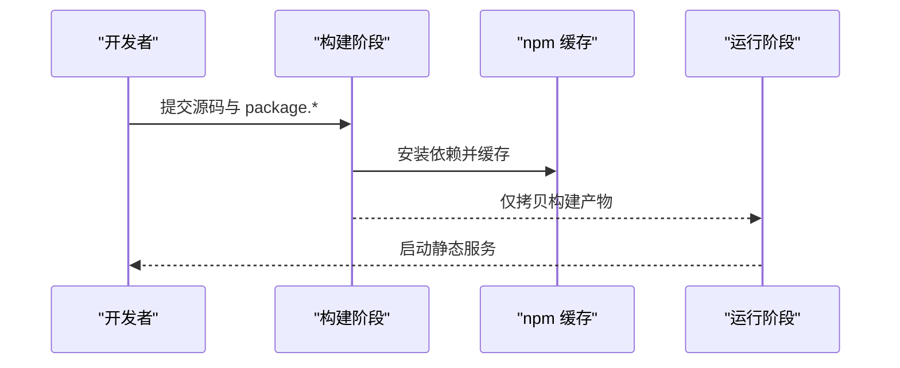
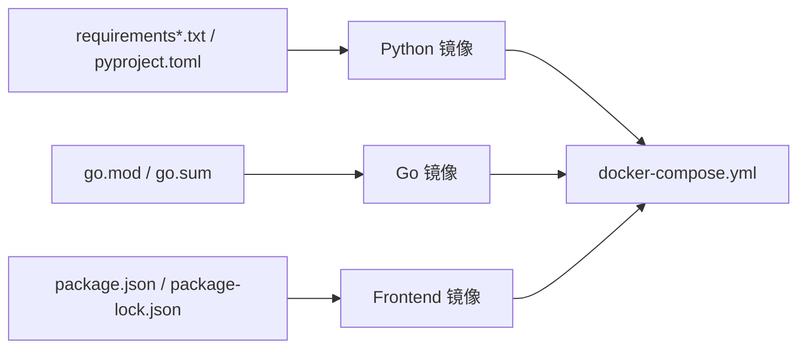
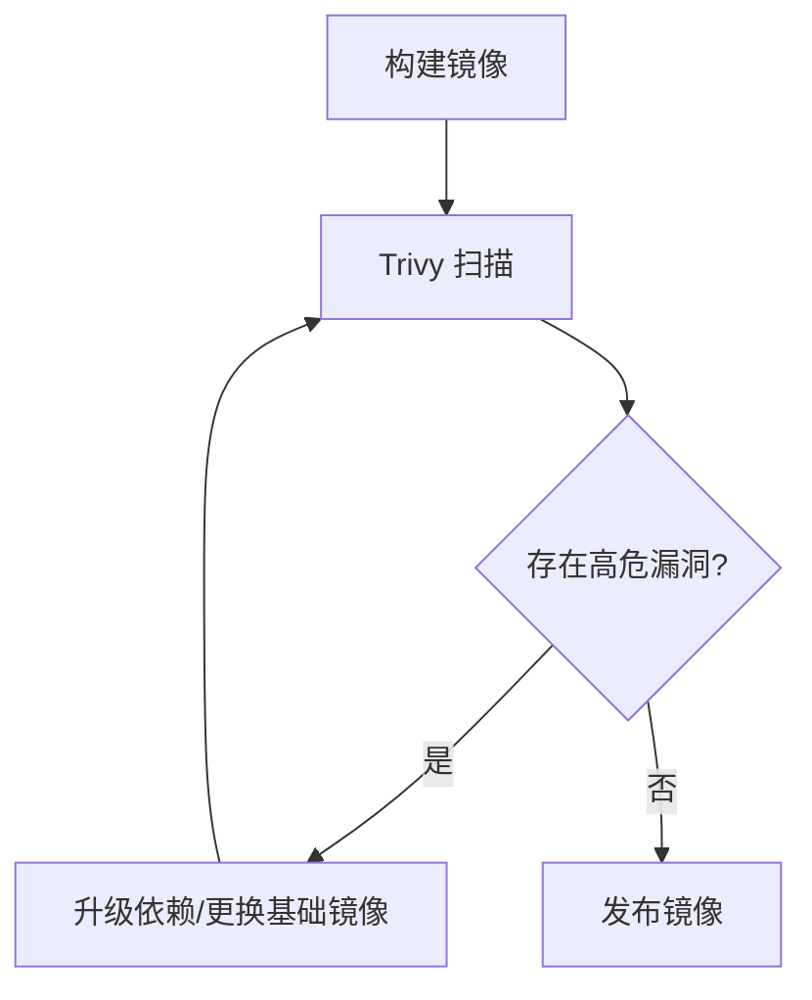
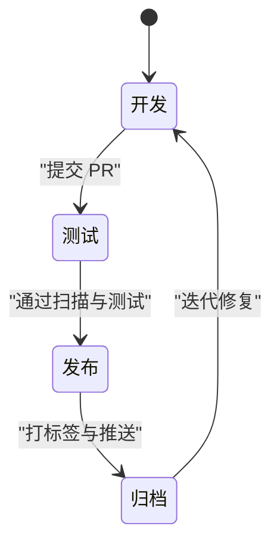
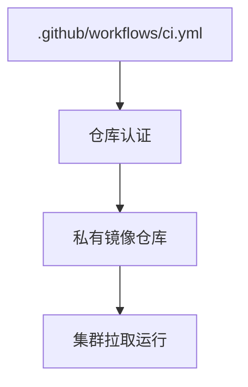

# 容器镜像优化

<cite>
**本文引用的文件**   
- [backend_design/Dockerfile](file://backend_design/Dockerfile)
- [backend_design/nexus_gate/Dockerfile](file://backend_design/nexus_gate/Dockerfile)
- [frontend_design/Dockerfile](file://frontend_design/Dockerfile)
- [docker-compose.yml](file://docker-compose.yml)
- [.github/workflows/ci.yml](file://.github/workflows/ci.yml)
- [backend_design/pyproject.toml](file://backend_design/pyproject.toml)
- [backend_design/requirements.txt](file://backend_design/requirements.txt)
- [backend_design/requirements_no_torch.txt](file://backend_design/requirements_no_torch.txt)
- [backend_design/go.mod](file://backend_design/nexus_gate/go.mod)
- [backend_design/nexus_gate/go.sum](file://backend_design/nexus_gate/go.sum)
- [frontend_design/package.json](file://frontend_design/package.json)
- [frontend_design/package-lock.json](file://frontend_design/package-lock.json)
</cite>

## 目录
1. [简介](#简介)
2. [项目结构](#项目结构)
3. [核心组件](#核心组件)
4. [架构总览](#架构总览)
5. [详细组件分析](#详细组件分析)
6. [依赖关系分析](#依赖关系分析)
7. [性能与体积优化](#性能与体积优化)
8. [安全扫描与漏洞修复](#安全扫描与漏洞修复)
9. [版本管理与标签策略](#版本管理与标签策略)
10. [私有仓库配置与管理](#私有仓库配置与管理)
11. [故障排查指南](#故障排查指南)
12. [结论](#结论)

## 简介
本指南面向 NexusCockpit 项目的容器镜像优化，围绕多阶段构建、基础镜像选择、依赖缓存、层压缩、语言最佳实践（Python、Go、Node.js）、安全扫描与漏洞修复、体积瘦身、版本与标签策略以及私有镜像仓库管理等方面提供系统化建议。文档中的具体实现均以仓库中现有 Dockerfile 和 CI 配置为依据，并给出可操作的改进路径与验证方法。

## 项目结构
NexusCockpit 包含三个主要可交付产物：
- Python 后端服务（backend_design）
- Go 网关服务（backend_design/nexus_gate）
- Next.js 前端应用（frontend_design）

每个子项目均提供独立的 Dockerfile，便于按语言特性进行分层优化与独立发布。CI 流水线位于 .github/workflows/ci.yml，用于触发构建与测试流程。

图表来源
- [backend_design/Dockerfile](file://backend_design/Dockerfile)
- [backend_design/nexus_gate/Dockerfile](file://backend_design/nexus_gate/Dockerfile)
- [frontend_design/Dockerfile](file://frontend_design/Dockerfile)
- [docker-compose.yml](file://docker-compose.yml)
- [.github/workflows/ci.yml](file://.github/workflows/ci.yml)

章节来源
- [backend_design/Dockerfile](file://backend_design/Dockerfile)
- [backend_design/nexus_gate/Dockerfile](file://backend_design/nexus_gate/Dockerfile)
- [frontend_design/Dockerfile](file://frontend_design/Dockerfile)
- [docker-compose.yml](file://docker-compose.yml)
- [.github/workflows/ci.yml](file://.github/workflows/ci.yml)

## 核心组件
- Python 后端镜像：基于多阶段构建，分离依赖安装与运行环境，结合 requirements 与 pyproject 管理依赖，支持可选的轻量依赖集。
- Go 网关镜像：使用静态编译产物，最小化运行时依赖，利用 Go 模块缓存提升构建速度。
- Next.js 前端镜像：通过多阶段构建将构建期工具链与最终运行镜像解耦，输出静态资源后由轻量 HTTP 服务器托管。

章节来源
- [backend_design/Dockerfile](file://backend_design/Dockerfile)
- [backend_design/pyproject.toml](file://backend_design/pyproject.toml)
- [backend_design/requirements.txt](file://backend_design/requirements.txt)
- [backend_design/requirements_no_torch.txt](file://backend_design/requirements_no_torch.txt)
- [backend_design/nexus_gate/Dockerfile](file://backend_design/nexus_gate/Dockerfile)
- [backend_design/nexus_gate/go.mod](file://backend_design/nexus_gate/go.mod)
- [backend_design/nexus_gate/go.sum](file://backend_design/nexus_gate/go.sum)
- [frontend_design/Dockerfile](file://frontend_design/Dockerfile)
- [frontend_design/package.json](file://frontend_design/package.json)
- [frontend_design/package-lock.json](file://frontend_design/package-lock.json)

## 架构总览
下图展示了三套镜像在多阶段构建下的典型数据流与依赖关系，强调“构建期”与“运行期”的隔离，以及依赖缓存对构建速度的影响。

图表来源
- [backend_design/Dockerfile](file://backend_design/Dockerfile)
- [backend_design/nexus_gate/Dockerfile](file://backend_design/nexus_gate/Dockerfile)
- [frontend_design/Dockerfile](file://frontend_design/Dockerfile)

## 详细组件分析

### Python 后端镜像优化
- 基础镜像选择
  - 生产运行建议使用精简发行版或官方 slim/alpine 变体，减少系统包与库体积。
  - 若需特定系统依赖（如 CUDA），在单独阶段准备，再复制到运行镜像。
- 依赖缓存优化
  - 先复制依赖清单（requirements.txt 或 pyproject.toml），再执行 pip 安装，使依赖层可被缓存。
  - 使用 pip 本地缓存目录，避免重复下载；必要时启用离线缓存卷。
- 分层结构优化
  - 将“依赖安装”与“应用代码拷贝”分步写入不同层，确保代码变更不破坏依赖缓存。
  - 合并 RUN 指令以减少层数，但注意可读性与缓存命中率之间的平衡。
- 无用文件清理
  - 在安装系统包后及时清理 apt/yum 缓存与临时文件。
  - 删除 pip 构建缓存、wheel 缓存等，避免进入最终镜像。
- 可选依赖集
  - 根据部署场景选择 requirements.txt 或 requirements_no_torch.txt，避免引入不必要的重型依赖。

图表来源
- [backend_design/Dockerfile](file://backend_design/Dockerfile)
- [backend_design/requirements.txt](file://backend_design/requirements.txt)
- [backend_design/requirements_no_torch.txt](file://backend_design/requirements_no_torch.txt)
- [backend_design/pyproject.toml](file://backend_design/pyproject.toml)

章节来源
- [backend_design/Dockerfile](file://backend_design/Dockerfile)
- [backend_design/requirements.txt](file://backend_design/requirements.txt)
- [backend_design/requirements_no_torch.txt](file://backend_design/requirements_no_torch.txt)
- [backend_design/pyproject.toml](file://backend_design/pyproject.toml)

### Go 网关镜像优化
- 基础镜像选择
  - 使用 distroless 或 scratch 作为运行镜像，仅包含必要的系统库（如需）。
  - 构建阶段使用 golang:alpine 或 golang:slim，减小构建镜像体积。
- 静态编译
  - 设置 CGO_ENABLED=0，确保生成完全静态二进制，避免运行期依赖缺失。
- 依赖缓存优化
  - 先复制 go.mod 与 go.sum，再执行 go mod download，利用 Go 模块缓存层。
  - 使用 --mount=type=cache 挂载构建缓存（Docker BuildKit）以提升增量构建速度。
- 分层结构优化
  - 将“下载依赖”、“编译”、“拷贝二进制”拆分为独立步骤，最大化缓存命中。
- 无用文件清理
  - 构建完成后仅保留编译产物与必要配置文件，移除源码与构建工具。

图表来源
- [backend_design/nexus_gate/Dockerfile](file://backend_design/nexus_gate/Dockerfile)
- [backend_design/nexus_gate/go.mod](file://backend_design/nexus_gate/go.mod)
- [backend_design/nexus_gate/go.sum](file://backend_design/nexus_gate/go.sum)

章节来源
- [backend_design/nexus_gate/Dockerfile](file://backend_design/nexus_gate/Dockerfile)
- [backend_design/nexus_gate/go.mod](file://backend_design/nexus_gate/go.mod)
- [backend_design/nexus_gate/go.sum](file://backend_design/nexus_gate/go.sum)

### Node.js 前端镜像优化
- 基础镜像选择
  - 构建阶段使用 node:slim 或 node:alpine，运行阶段使用 nginx 或 node:slim 直接 serve 静态资源。
- 依赖缓存优化
  - 先复制 package.json 与 package-lock.json，再执行 npm install，利用 npm 缓存层。
  - 使用 --cache-folder 指定缓存目录，配合 BuildKit 缓存挂载。
- 静态资源打包
  - 构建阶段执行 build 命令，输出静态资源至固定目录。
  - 运行阶段仅拷贝构建产物，避免携带开发依赖与源码。
- 无用文件清理
  - 删除 node_modules/.cache、构建中间文件、README 等非必需内容。
- 分层结构优化
  - 将“安装依赖”、“构建应用”、“拷贝产物”分步写入不同层，提高缓存命中率。

图表来源
- [frontend_design/Dockerfile](file://frontend_design/Dockerfile)
- [frontend_design/package.json](file://frontend_design/package.json)
- [frontend_design/package-lock.json](file://frontend_design/package-lock.json)

章节来源
- [frontend_design/Dockerfile](file://frontend_design/Dockerfile)
- [frontend_design/package.json](file://frontend_design/package.json)
- [frontend_design/package-lock.json](file://frontend_design/package-lock.json)

## 依赖关系分析
- 构建期依赖与运行期依赖解耦：各语言镜像均采用多阶段构建，确保最终镜像不包含构建工具链。
- 依赖清单驱动缓存：requirements、go.mod/go.sum、package.json/package-lock.json 分别作为依赖缓存的关键输入。
- 外部依赖最小化：按需选择依赖集（如 requirements_no_torch.txt），避免引入大型模型或 GPU 相关依赖。

图表来源
- [backend_design/requirements.txt](file://backend_design/requirements.txt)
- [backend_design/requirements_no_torch.txt](file://backend_design/requirements_no_torch.txt)
- [backend_design/pyproject.toml](file://backend_design/pyproject.toml)
- [backend_design/nexus_gate/go.mod](file://backend_design/nexus_gate/go.mod)
- [backend_design/nexus_gate/go.sum](file://backend_design/nexus_gate/go.sum)
- [frontend_design/package.json](file://frontend_design/package.json)
- [frontend_design/package-lock.json](file://frontend_design/package-lock.json)
- [docker-compose.yml](file://docker-compose.yml)

章节来源
- [backend_design/requirements.txt](file://backend_design/requirements.txt)
- [backend_design/requirements_no_torch.txt](file://backend_design/requirements_no_torch.txt)
- [backend_design/pyproject.toml](file://backend_design/pyproject.toml)
- [backend_design/nexus_gate/go.mod](file://backend_design/nexus_gate/go.mod)
- [backend_design/nexus_gate/go.sum](file://backend_design/nexus_gate/go.sum)
- [frontend_design/package.json](file://frontend_design/package.json)
- [frontend_design/package-lock.json](file://frontend_design/package-lock.json)
- [docker-compose.yml](file://docker-compose.yml)

## 性能与体积优化
- 基础镜像选择
  - 优先使用官方 slim/alpine/distroless 变体，减少系统包与共享库体积。
- 依赖预安装与缓存
  - 将依赖清单前置复制，确保依赖层稳定且可缓存。
  - 使用语言生态的缓存机制（pip、go mod、npm）并结合 BuildKit 缓存挂载。
- 层压缩技术
  - 合并 RUN 指令，减少层数量；在单条 RUN 内完成“安装+清理”，避免残留文件。
  - 使用 .dockerignore 排除无关文件（如 .git、node_modules、__pycache__）。
- 无用文件清理
  - 删除包管理器缓存、构建中间产物、日志与调试信息。
  - 在 Python 中清理 pip 缓存与 wheel 缓存；在 Go 中移除源码与构建工具；在 Node.js 中删除 devDependencies 与缓存目录。
- 重复依赖合并
  - 统一依赖版本锁定（requirements.txt、go.sum、package-lock.json），避免多份重复依赖。
- 分层结构优化
  - 将“依赖安装”、“构建”、“拷贝产物”分步写入不同层，最大化缓存命中与最小化重建范围。

[本节为通用指导，无需列出具体文件来源]

## 安全扫描与漏洞修复
- Trivy 集成
  - 在 CI 中集成 Trivy 扫描镜像，检测 CVE 与高危漏洞。
  - 将扫描结果输出为报告，并在流水线中设置失败阈值。
- CVE 检测与修复流程
  - 定期更新基础镜像与依赖版本，优先采用已修复的安全版本。
  - 针对关键漏洞制定修复优先级与回滚策略。
- 安全基线配置
  - 禁止以 root 用户运行容器，创建非特权用户。
  - 关闭不必要的网络端口与服务，最小化暴露面。
  - 启用只读根文件系统，使用环境变量或挂载卷注入敏感配置。

图表来源
- [.github/workflows/ci.yml](file://.github/workflows/ci.yml)

章节来源
- [.github/workflows/ci.yml](file://.github/workflows/ci.yml)

## 版本管理与标签策略
- 语义化版本
  - 使用主.次.修订号（如 v1.2.3）作为镜像标签，同时维护 latest 指向最新稳定版本。
- 分支与标签映射
  - 主干分支对应 latest，发布分支对应具体版本号，功能分支使用短哈希标签。
- 构建上下文与缓存
  - 在 CI 中使用缓存键包含依赖清单哈希，确保依赖变更时重建缓存。
- 多架构支持
  - 使用 BuildKit 与 docker buildx 构建多架构镜像，统一标签策略。

[本节为通用指导，无需列出具体文件来源]

## 私有仓库配置与管理
- 仓库地址与认证
  - 在 CI 中配置私有仓库登录凭据，使用密钥管理服务存储敏感信息。
- 镜像命名规范
  - 使用组织域前缀与项目名称，如 registry.example.com/project/service:tag。
- 访问控制与审计
  - 启用仓库访问控制，限制推送权限；开启操作审计日志。
- 镜像同步与缓存
  - 在 CI 节点配置镜像代理与缓存，加速拉取与构建。

图表来源
- [.github/workflows/ci.yml](file://.github/workflows/ci.yml)
- [docker-compose.yml](file://docker-compose.yml)

章节来源
- [.github/workflows/ci.yml](file://.github/workflows/ci.yml)
- [docker-compose.yml](file://docker-compose.yml)

## 故障排查指南
- 构建失败
  - 检查依赖清单是否完整与版本锁定是否正确。
  - 确认网络可达与缓存键是否有效。
- 运行异常
  - 校验运行镜像是否包含必要运行时依赖。
  - 检查环境变量与挂载卷配置。
- 安全告警
  - 依据 Trivy 报告定位漏洞来源，评估风险等级并制定修复计划。
- 体积过大
  - 审查 Dockerfile 层顺序与清理步骤，确认未引入构建期文件。
  - 使用镜像分析工具定位大文件或冗余依赖。

[本节为通用指导，无需列出具体文件来源]

## 结论
通过对 Python、Go、Node.js 三类应用的镜像进行多阶段构建、依赖缓存、层压缩与安全扫描，NexusCockpit 可在保证功能完整性的前提下显著降低镜像体积、提升构建效率与安全性。建议在 CI 中固化上述优化流程，并持续跟踪依赖与基础镜像的安全状态，形成闭环治理。